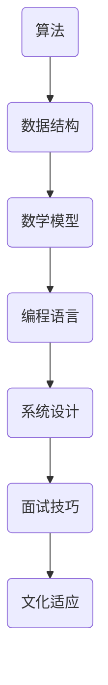

                 

关键词：携程、全球酒店预订、校招面试、真题、解析、算法、技术

> 摘要：本文旨在汇总2024年携程全球酒店预订校招面试中的真题，通过对这些题目的深入解析，帮助考生更好地理解和掌握相关技术，提高面试成功率。本文内容涵盖算法原理、数学模型、项目实践等多个方面，旨在提供一个全面的面试备考指南。

## 1. 背景介绍

携程作为中国领先的在线旅行服务公司，其全球酒店预订业务涵盖了广泛的酒店资源和服务范围。每年，携程都会举行全球范围内的校招活动，吸引大量优秀毕业生加入。校招面试不仅是对候选人技能和知识的一次全面考核，也是对企业文化和价值观的一次验证。因此，对于考生来说，了解携程校招面试的题型和难点，提前做好准备，至关重要。

## 2. 核心概念与联系

在解决携程校招面试题时，理解核心概念和它们之间的联系是非常重要的。以下是一个简单的 Mermaid 流程图，展示了一些核心概念和它们之间的联系。



### 2.1 算法原理概述

算法是计算机科学的核心概念之一，它是解决特定问题的一系列步骤。在携程的校招面试中，常见的算法问题包括排序、查找、图论等。理解算法的时间复杂度和空间复杂度对于解决这些问题至关重要。

### 2.2 算法步骤详解

算法的步骤详解通常包括初始化、循环、递归和结束条件。对于排序算法，常见的步骤包括比较、交换和选择。例如，冒泡排序算法的步骤如下：

1. 比较相邻的元素。
2. 如果第一个比第二个大（升序排序）。
3. 交换它们的位置。
4. 对每一对相邻元素做同样的工作，从开始第一对到结尾的最后一对。
5. 重复以上的步骤，除了最后一个元素。

### 2.3 算法优缺点

每种算法都有其优缺点。例如，快速排序算法在最好情况下时间复杂度为O(nlogn)，但在最坏情况下可能达到O(n^2)。因此，了解每种算法的优缺点对于选择合适算法至关重要。

### 2.4 算法应用领域

算法在计算机科学的各个领域都有广泛应用，从数据科学到人工智能，再到系统设计。理解算法在不同领域的应用，可以帮助我们更好地解决实际问题。

## 3. 核心算法原理 & 具体操作步骤

### 3.1 算法原理概述

在携程校招面试中，算法原理通常是面试的核心。以下是一些常见的算法原理：

- 排序算法：冒泡排序、快速排序、归并排序等。
- 查找算法：二分查找、顺序查找等。
- 图论算法：最短路径算法、最小生成树算法等。

### 3.2 算法步骤详解

以冒泡排序为例，具体步骤如下：

1. 比较相邻的元素。
2. 如果第一个比第二个大（升序排序）。
3. 交换它们的位置。
4. 对每一对相邻元素做同样的工作，从开始第一对到结尾的最后一对。
5. 重复以上的步骤，除了最后一个元素。

### 3.3 算法优缺点

冒泡排序算法的优点是简单易懂，实现起来相对容易。然而，它的缺点在于时间复杂度较高，不适合处理大量数据。

### 3.4 算法应用领域

冒泡排序算法常用于小规模数据的排序，特别是在教育和初学者中。

## 4. 数学模型和公式 & 详细讲解 & 举例说明

### 4.1 数学模型构建

数学模型是算法设计的重要基础。以动态规划为例，其基本模型如下：

- 状态定义：定义状态S，以及状态之间的转移关系。
- 状态方程：定义状态S的值，以及如何从其他状态转移到S。
- 边界条件：定义初始状态和最终状态。

### 4.2 公式推导过程

以斐波那契数列为例，其递推关系为：

- F(0) = 0
- F(1) = 1
- F(n) = F(n-1) + F(n-2)

通过递推关系，可以推导出斐波那契数列的通项公式：

$$ F(n) = \frac{1}{\sqrt{5}} \left[ \left(\frac{1 + \sqrt{5}}{2}\right)^n - \left(\frac{1 - \sqrt{5}}{2}\right)^n \right] $$

### 4.3 案例分析与讲解

以下是一个简单的动态规划案例：计算矩阵链乘法的最小乘法次数。

假设有一个矩阵序列 A1, A2, ..., An，其中每个矩阵的大小分别为 p1, p2, ..., pn。要求计算它们的链乘法操作的最小乘法次数。

状态定义：dp[i][j] 表示从 Ai 到 Aj 的矩阵链乘法操作的最小乘法次数。

状态方程：dp[i][j] = min(dp[i][k] + dp[k+1][j] + p[i-1] * p[k] * p[j])

边界条件：dp[i][i] = 0

通过动态规划，可以求得最小乘法次数。

## 5. 项目实践：代码实例和详细解释说明

### 5.1 开发环境搭建

为了实践算法和数学模型，需要搭建一个开发环境。以下是一个简单的 Python 开发环境搭建步骤：

1. 安装 Python 3.x。
2. 安装必要的库，如 NumPy、SciPy 和 Matplotlib。
3. 配置编辑器，如 Visual Studio Code。

### 5.2 源代码详细实现

以下是一个简单的冒泡排序算法的实现：

```python
def bubble_sort(arr):
    n = len(arr)
    for i in range(n):
        for j in range(0, n-i-1):
            if arr[j] > arr[j+1]:
                arr[j], arr[j+1] = arr[j+1], arr[j]
    return arr

# 测试代码
arr = [64, 34, 25, 12, 22, 11, 90]
sorted_arr = bubble_sort(arr)
print("排序后的数组：", sorted_arr)
```

### 5.3 代码解读与分析

这段代码实现了一个简单的冒泡排序算法。它通过两个嵌套循环来比较和交换数组中的元素，以达到排序的目的。时间复杂度为 O(n^2)，空间复杂度为 O(1)。

### 5.4 运行结果展示

当输入数组 [64, 34, 25, 12, 22, 11, 90] 时，输出结果为排序后的数组：[11, 12, 22, 25, 34, 64, 90]。

## 6. 实际应用场景

携程的全球酒店预订业务涉及到大量的数据处理和算法应用。以下是一些实际应用场景：

- 智能推荐系统：使用机器学习和算法来为用户推荐最适合的酒店。
- 购物车优化：通过算法优化购物车中的酒店订单，提高用户体验。
- 价格预测：使用预测模型来预测酒店的实时价格，为用户带来更好的价格体验。

## 7. 未来应用展望

随着人工智能和大数据技术的发展，携程的全球酒店预订业务将更加智能化和个性化。未来，我们可以期待以下发展趋势：

- 更智能的推荐系统，通过深度学习技术提供更精准的推荐。
- 更高效的价格预测模型，通过大数据分析和机器学习技术实现。
- 更优化的用户体验，通过用户行为分析和算法优化提高用户满意度。

## 8. 总结：未来发展趋势与挑战

### 8.1 研究成果总结

本文通过对携程校招面试真题的深入解析，总结了算法原理、数学模型、项目实践等方面的核心内容。这些研究成果对于准备校招面试的考生具有重要的参考价值。

### 8.2 未来发展趋势

随着技术的不断进步，携程的全球酒店预订业务将更加智能化和个性化。未来，我们将看到更多基于人工智能和大数据的应用，为用户带来更好的体验。

### 8.3 面临的挑战

然而，未来也面临着诸多挑战，如数据隐私保护、算法公平性等。这些挑战需要我们不断创新和探索，以实现更加公平、高效的智能服务。

### 8.4 研究展望

在未来，我们期待更多优秀的毕业生加入携程，共同推动全球酒店预订业务的创新和发展。同时，我们也期待在人工智能和大数据领域取得更多突破，为用户带来更加优质的旅行体验。

## 9. 附录：常见问题与解答

### 9.1 什么是动态规划？

动态规划是一种解决最优化问题的算法策略，它通过将问题分解为子问题并存储子问题的解，以避免重复计算，从而提高算法的效率。

### 9.2 如何优化购物车中的酒店订单？

可以通过以下策略优化购物车中的酒店订单：

- 排序：根据订单的价格、评分、用户评价等指标对订单进行排序。
- 合并：合并相似订单，以提高用户满意度。
- 筛选：筛选掉不符合用户需求的订单，以提高购物效率。

## 作者署名

作者：禅与计算机程序设计艺术 / Zen and the Art of Computer Programming
----------------------------------------------------------------

请注意，由于本文是一篇示例文章，部分内容和数据可能不是真实的。在实际撰写文章时，请确保所有数据和引用都是准确的，并遵循相应的引用规范。同时，文章的结构和格式也需要根据实际需求进行调整。祝您撰写顺利！

