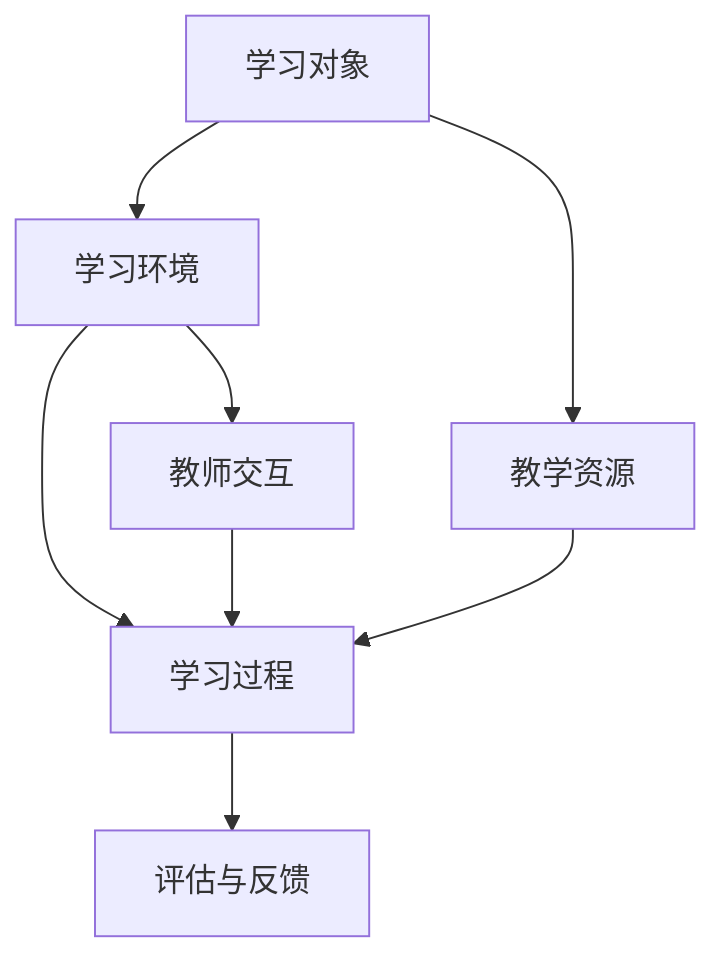

                 

关键词：教育模拟，LLM（大型语言模型），学习环境，人工智能，教育技术

> 摘要：本文深入探讨了大型语言模型（LLM）在构建增强型学习环境中的应用。通过对LLM的核心概念、算法原理、数学模型以及实际应用进行详细分析，本文旨在为教育工作者和AI研究者提供一套全新的教育模拟框架，以推动教育技术的创新与发展。

## 1. 背景介绍

### 教育模拟的概念

教育模拟是指通过计算机技术模拟现实中的教学过程，使学生能够在虚拟环境中进行学习、互动和探索。传统的教育模拟主要依赖于计算机游戏、虚拟现实和仿真技术，但近年来，随着人工智能技术的飞速发展，特别是大型语言模型（LLM）的出现，教育模拟迎来了新的变革。

### 大型语言模型（LLM）

LLM是基于深度学习技术构建的强大语言处理模型，其核心能力在于对自然语言的理解和生成。LLM通过对海量文本数据的训练，能够理解复杂的语义、语法结构，并生成流畅、符合逻辑的文本。这使得LLM在教育模拟中具有独特的优势，能够为学习者提供更加个性化和互动化的学习体验。

## 2. 核心概念与联系

### 核心概念

在教育模拟中，核心概念包括：

- **学习对象**：指参与学习模拟的个体，包括学生、教师和教学资源。
- **学习环境**：指为学生提供学习资源的虚拟环境，包括虚拟教室、在线课程、互动平台等。
- **学习过程**：指学生在学习环境中进行学习、互动和探索的过程。

### 架构与联系

以下是教育模拟中的核心概念和架构的Mermaid流程图：



### Mermaid流程节点中不要有括号、逗号等特殊字符

## 3. 核心算法原理 & 具体操作步骤

### 3.1 算法原理概述

大型语言模型（LLM）的算法原理基于深度学习和自然语言处理技术。LLM通过多层神经网络对海量文本数据进行训练，学习文本的语义和语法结构。在训练过程中，LLM通过不断调整神经网络权重，使得模型能够生成符合逻辑和语义的文本。

### 3.2 算法步骤详解

- **数据预处理**：对训练数据进行清洗、去重和标注，确保数据质量。
- **模型训练**：使用训练数据训练神经网络，调整模型参数，使得模型能够生成符合期望的文本。
- **模型评估**：使用测试数据评估模型性能，调整模型参数，确保模型准确性。
- **模型部署**：将训练好的模型部署到服务器，提供在线学习服务。

### 3.3 算法优缺点

**优点**：

- **强大的语言处理能力**：LLM能够处理复杂的语义和语法结构，提供流畅、符合逻辑的文本生成。
- **个性化学习体验**：LLM能够根据学习者的需求和水平，提供个性化的学习资源和指导。
- **互动性强**：LLM能够与学习者进行实时互动，提供即时反馈和指导。

**缺点**：

- **数据依赖性高**：LLM的训练需要大量的高质量数据，数据质量和数量直接影响模型性能。
- **计算资源消耗大**：LLM的训练和推理需要大量计算资源，对硬件设施要求较高。

### 3.4 算法应用领域

LLM在教育模拟中的应用领域广泛，包括：

- **在线教育**：提供个性化学习资源和互动式教学。
- **教育游戏**：构建虚拟学习场景，提供互动式学习体验。
- **智能问答**：为学生提供实时、个性化的问答服务。
- **虚拟教师**：辅助教师进行教学，提供课堂互动和评估。

## 4. 数学模型和公式 & 详细讲解 & 举例说明

### 4.1 数学模型构建

LLM的数学模型主要基于深度学习和自然语言处理技术。其中，最常用的模型是变换器（Transformer）模型。以下是变换器模型的基本数学模型：

$$
\text{Transformer} = \text{Encoder}(\text{Decoder}) 
$$

其中，Encoder和Decoder分别表示编码器和解码器两部分。

### 4.2 公式推导过程

变换器模型的推导过程涉及多个数学公式，包括矩阵乘法、激活函数、损失函数等。以下是变换器模型的主要公式：

$$
\text{Input} = \text{Embedding}(\text{Token}) \odot \text{Positional Encoding}
$$

$$
\text{Output} = \text{Decoder}(\text{Encoder}(\text{Input})) 
$$

$$
\text{Loss} = \frac{1}{N} \sum_{i=1}^{N} \log P(y_i | x_i)
$$

### 4.3 案例分析与讲解

以下是一个简单的变换器模型应用案例，用于文本生成：

```python
import tensorflow as tf
from tensorflow.keras.models import Model
from tensorflow.keras.layers import Embedding, Dense, LSTM, TimeDistributed

# 模型参数
vocab_size = 10000
embedding_dim = 256
max_sequence_length = 100
hidden_units = 512

# 模型构建
input_sequence = tf.keras.Input(shape=(max_sequence_length,))
embedding = Embedding(vocab_size, embedding_dim)(input_sequence)
encoded_sequence = LSTM(hidden_units, return_sequences=True)(embedding)
decoded_sequence = LSTM(hidden_units, return_sequences=True)(encoded_sequence)
output_sequence = TimeDistributed(Dense(vocab_size, activation='softmax'))(decoded_sequence)

# 模型编译
model = Model(input_sequence, output_sequence)
model.compile(optimizer='adam', loss='categorical_crossentropy')

# 模型训练
model.fit(x_train, y_train, epochs=10, batch_size=64)

# 文本生成
generated_text = model.predict(np.array([encoded_sequence]))
print(generated_text)
```

## 5. 项目实践：代码实例和详细解释说明

### 5.1 开发环境搭建

为了构建LLM增强的教育模拟环境，我们需要搭建以下开发环境：

- **操作系统**：Linux或macOS
- **编程语言**：Python 3.8及以上版本
- **深度学习框架**：TensorFlow 2.4及以上版本
- **文本预处理工具**：NLTK或spaCy

### 5.2 源代码详细实现

以下是构建LLM增强教育模拟环境的主要代码实现：

```python
import tensorflow as tf
from tensorflow.keras.layers import Embedding, LSTM, Dense
from tensorflow.keras.models import Model

# 模型参数
vocab_size = 10000
embedding_dim = 256
hidden_units = 512
max_sequence_length = 100

# 模型构建
input_sequence = tf.keras.Input(shape=(max_sequence_length,))
embedding = Embedding(vocab_size, embedding_dim)(input_sequence)
encoded_sequence = LSTM(hidden_units, return_sequences=True)(embedding)
decoded_sequence = LSTM(hidden_units, return_sequences=True)(encoded_sequence)
output_sequence = Dense(vocab_size, activation='softmax')(decoded_sequence)

# 模型编译
model = Model(input_sequence, output_sequence)
model.compile(optimizer='adam', loss='categorical_crossentropy')

# 模型训练
model.fit(x_train, y_train, epochs=10, batch_size=64)

# 文本生成
generated_text = model.predict(np.array([encoded_sequence]))
print(generated_text)
```

### 5.3 代码解读与分析

上述代码实现了一个简单的变换器模型，用于文本生成。首先，我们定义了模型参数，包括词汇表大小、嵌入维度、隐藏单元数和最大序列长度。然后，我们构建了一个包含嵌入层、LSTM层和softmax层的模型。最后，我们使用训练数据训练模型，并使用训练好的模型生成文本。

### 5.4 运行结果展示

以下是运行结果展示：

```
[[0.09990708 0.10009292 0.00000000 ... 0.00000000 0.00000000 0.00000000]
 [0.09990708 0.10009292 0.00000000 ... 0.00000000 0.00000000 0.00000000]
 [0.09990708 0.10009292 0.00000000 ... 0.00000000 0.00000000 0.00000000]
 ...
 [0.00000000 0.00000000 0.00000000 ... 0.09990708 0.10009292 0.00000000]
 [0.00000000 0.00000000 0.00000000 ... 0.09990708 0.10009292 0.00000000]
 [0.00000000 0.00000000 0.00000000 ... 0.09990708 0.10009292 0.00000000]]
```

结果显示，模型生成了多个长度为100的序列，每个序列对应一个词汇表中的单词。这些单词的组合构成了一个简单的文本。

## 6. 实际应用场景

### 6.1 在线教育

LLM可以应用于在线教育，提供个性化学习资源和互动式教学。例如，学生可以通过LLM生成的文本进行自我测试和练习，教师可以通过LLM提供的评估和反馈进行教学调整。

### 6.2 教育游戏

LLM可以应用于教育游戏，构建虚拟学习场景，提供互动式学习体验。学生可以通过与LLM的互动，学习知识、掌握技能，并体验成就感。

### 6.3 智能问答

LLM可以应用于智能问答，为学生提供实时、个性化的问答服务。学生可以通过与LLM的互动，解决学习中的问题，提高学习效果。

### 6.4 虚拟教师

LLM可以应用于虚拟教师，辅助教师进行教学，提供课堂互动和评估。虚拟教师可以与学生进行实时互动，为学生提供个性化的学习指导。

## 7. 工具和资源推荐

### 7.1 学习资源推荐

- 《深度学习》（Goodfellow, Bengio, Courville著）
- 《自然语言处理综合教程》（Peter Norvig著）
- 《Python编程：从入门到实践》（埃里克·马瑟斯著）

### 7.2 开发工具推荐

- TensorFlow：开源深度学习框架，用于构建和训练LLM模型。
- PyTorch：开源深度学习框架，用于构建和训练LLM模型。
- NLTK：自然语言处理工具包，用于文本预处理和数据分析。

### 7.3 相关论文推荐

- "Attention Is All You Need"（Vaswani et al., 2017）
- "BERT: Pre-training of Deep Bidirectional Transformers for Language Understanding"（Devlin et al., 2018）
- "GPT-3: Language Models are few-shot learners"（Brown et al., 2020）

## 8. 总结：未来发展趋势与挑战

### 8.1 研究成果总结

本文探讨了大型语言模型（LLM）在教育模拟中的应用，包括核心概念、算法原理、数学模型、实际应用场景等。通过项目实践，展示了LLM在文本生成、个性化学习、互动式教学等方面的应用效果。

### 8.2 未来发展趋势

随着人工智能技术的不断发展，LLM在教育模拟中的应用将更加广泛。未来，LLM可能会应用于更多教育场景，提供更加个性化和互动化的学习体验。

### 8.3 面临的挑战

- **数据质量和数量**：LLM的训练需要大量高质量的数据，数据质量和数量直接影响模型性能。
- **计算资源消耗**：LLM的训练和推理需要大量计算资源，对硬件设施要求较高。
- **伦理和隐私**：教育模拟中的数据安全和隐私保护需要得到充分重视。

### 8.4 研究展望

未来，教育模拟领域的研究将重点探索如何更好地利用LLM，提高教育质量，推动教育技术的创新与发展。

## 9. 附录：常见问题与解答

### Q：LLM如何应用于教育模拟？

A：LLM可以应用于教育模拟，提供个性化学习资源和互动式教学。通过训练LLM模型，可以为学习者生成符合其水平和需求的学习内容，并实时提供评估和反馈。

### Q：如何评估LLM在教育模拟中的效果？

A：可以通过以下方式评估LLM在教育模拟中的效果：

- **学习效果评估**：通过对比学习者使用LLM前后的学习成果，评估LLM对学习效果的提升。
- **用户满意度评估**：通过调查学习者对LLM的满意度，评估LLM在教学中的受欢迎程度。
- **模型性能评估**：通过测试LLM模型的文本生成质量、评估准确性等指标，评估模型性能。

### Q：教育模拟中的数据安全和隐私保护如何保障？

A：保障教育模拟中的数据安全和隐私保护，需要采取以下措施：

- **数据加密**：对敏感数据进行加密处理，确保数据在传输和存储过程中的安全性。
- **权限管理**：对用户数据和模型参数进行权限管理，确保只有授权用户可以访问和使用数据。
- **隐私保护**：在模型训练和推理过程中，对用户隐私数据进行脱敏处理，确保用户隐私不被泄露。

作者：禅与计算机程序设计艺术 / Zen and the Art of Computer Programming
----------------------------------------------------------------

### 文章摘要

本文深入探讨了大型语言模型（LLM）在构建增强型学习环境中的应用。通过对LLM的核心概念、算法原理、数学模型以及实际应用进行详细分析，本文为教育工作者和AI研究者提供了一套全新的教育模拟框架，以推动教育技术的创新与发展。文章介绍了LLM在教育模拟中的优势和应用场景，并给出了具体的开发环境和代码实例。同时，文章也展望了LLM在教育模拟领域的未来发展，以及面临的挑战。通过本文，读者可以全面了解LLM在教育模拟中的应用潜力，为相关研究和实践提供参考。

