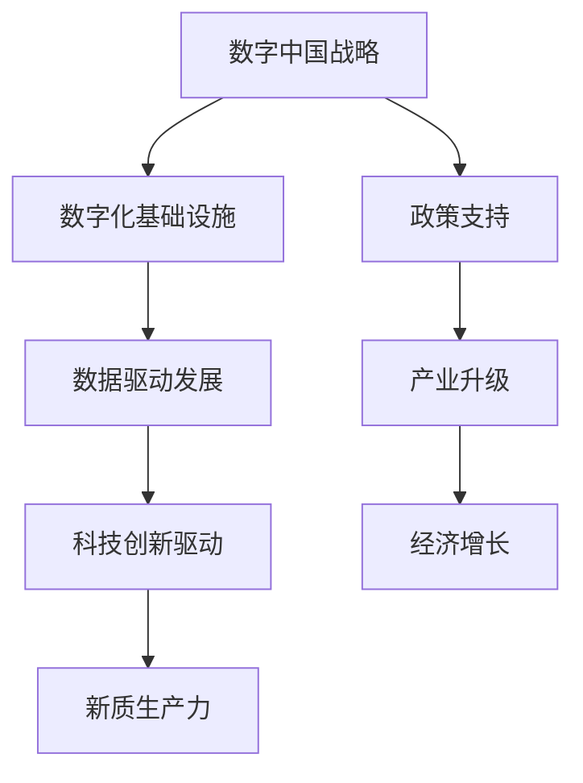

                 

关键词：数字中国战略、新质生产力、数字化转型、科技创新、产业升级、智能技术

> 摘要：随着数字化转型的深入推进，数字中国战略的实施不仅推动了经济结构的优化，还催生了新质生产力。本文将深入探讨数字中国战略与新质生产力的结合，分析其核心概念、算法原理、数学模型及其在实际应用中的体现，同时展望未来的发展趋势与挑战。

## 1. 背景介绍

在全球化、信息化和智能化的时代浪潮中，数字中国建设被提升到了前所未有的高度。数字中国战略是我国在信息化建设基础上，进一步推进经济社会数字化转型和智能化升级的重大战略。它旨在通过数字经济的发展，打造新的生产力和增长点，提升国家整体竞争力。

新质生产力是指在信息技术、人工智能、生物技术等领域的突破性进展，这些技术的应用不仅改变了传统生产方式，还催生了新的产业形态和经济模式。新质生产力的核心在于其高度依赖数据、算法和智能化技术，通过数字化、网络化和智能化手段，实现资源的优化配置和效率提升。

本文将围绕数字中国战略与新质生产力的结合，探讨其在经济、社会和技术领域的多方面影响，分析核心概念、算法原理和数学模型，并结合实际项目实践，展示其在不同场景中的应用。

## 2. 核心概念与联系

### 2.1 数字中国战略

数字中国战略是围绕数字化转型、数字经济发展、数字社会治理和数字文化繁荣等方面展开的一系列政策和措施。其主要目标是通过信息化手段，提升国家整体竞争力，实现经济结构的优化升级。

### 2.2 新质生产力

新质生产力是数字经济时代的重要特征，它依赖于先进的信息技术、智能技术和网络技术。新质生产力的核心在于其能够通过数据的收集、处理和应用，实现生产效率的极大提升，以及产业模式的创新。

### 2.3 结合关系

数字中国战略与新质生产力的结合主要体现在以下几个方面：

1. **数字化基础设施**：数字中国战略为新质生产力提供了坚实的数字化基础设施支持，包括高速网络、云计算平台、大数据中心等。
2. **数据驱动发展**：新质生产力高度依赖数据，数字中国战略通过推进数据开放共享，为新质生产力的发展提供了丰富的数据资源。
3. **科技创新驱动**：数字中国战略鼓励科技创新，为新质生产力的发展提供了源源不断的创新动力。

以下是一个用Mermaid绘制的流程图，展示数字中国战略与新质生产力的结合关系：



## 3. 核心算法原理 & 具体操作步骤

### 3.1 算法原理概述

新质生产力的核心在于数据的高效处理和应用。在这个过程中，核心算法发挥着至关重要的作用。以下是一些关键的算法原理：

1. **机器学习算法**：通过数据训练模型，实现数据的自动分析和预测。
2. **深度学习算法**：基于多层神经网络，对复杂数据进行深度学习，提取特征。
3. **区块链算法**：通过分布式账本技术，实现数据的安全、透明和不可篡改。
4. **数据挖掘算法**：从大量数据中提取有价值的信息和知识。

### 3.2 算法步骤详解

1. **数据收集**：从各种来源收集数据，如社交媒体、传感器、企业内部数据等。
2. **数据预处理**：清洗数据，处理缺失值、异常值，进行数据标准化等。
3. **特征提取**：从原始数据中提取有用的特征，为算法训练提供输入。
4. **算法训练**：使用机器学习或深度学习算法，对数据进行训练，生成预测模型。
5. **模型评估**：评估模型性能，包括准确率、召回率、F1分数等指标。
6. **模型应用**：将训练好的模型应用于实际问题，如预测、分类、推荐等。

### 3.3 算法优缺点

**机器学习算法**：

- **优点**：自动从数据中学习规律，适应性强，能够处理大量数据。
- **缺点**：对数据质量和量有较高要求，训练过程复杂，对计算资源依赖大。

**深度学习算法**：

- **优点**：能够处理复杂数据，提取深层次特征，效果通常优于传统机器学习算法。
- **缺点**：训练时间较长，对数据量和计算资源要求较高，难以解释。

**区块链算法**：

- **优点**：数据安全、透明、不可篡改，适合用于金融、供应链等领域。
- **缺点**：交易速度较慢，扩展性差，对计算资源依赖大。

**数据挖掘算法**：

- **优点**：能够从大量数据中提取有价值的信息和知识。
- **缺点**：对数据质量要求较高，容易陷入“垃圾进、垃圾出”的困境。

### 3.4 算法应用领域

**机器学习算法**：广泛应用于金融、医疗、零售、交通等领域，如信用评分、疾病预测、推荐系统等。

**深度学习算法**：在图像识别、语音识别、自然语言处理等领域取得了显著成果，如自动驾驶、智能语音助手、机器翻译等。

**区块链算法**：在金融、供应链、物流等领域得到了广泛应用，如数字货币、智能合约、供应链金融等。

**数据挖掘算法**：在市场营销、风险控制、运营优化等领域发挥了重要作用，如客户细分、风险预警、库存管理等。

## 4. 数学模型和公式 & 详细讲解 & 举例说明

### 4.1 数学模型构建

新质生产力的发展离不开数学模型的支持。以下是一些关键数学模型的构建过程：

1. **线性回归模型**：

   线性回归模型用于分析两个变量之间的线性关系。其公式如下：

   $$y = \beta_0 + \beta_1 \cdot x + \epsilon$$

   其中，$y$ 是因变量，$x$ 是自变量，$\beta_0$ 和 $\beta_1$ 是参数，$\epsilon$ 是误差项。

2. **逻辑回归模型**：

   逻辑回归模型用于处理二元分类问题。其公式如下：

   $$\log\frac{P(Y=1)}{1-P(Y=1)} = \beta_0 + \beta_1 \cdot x$$

   其中，$P(Y=1)$ 是事件发生的概率，$\beta_0$ 和 $\beta_1$ 是参数。

3. **神经网络模型**：

   神经网络模型用于处理复杂数据和分类问题。其基本结构如下：

   $$z = \sigma(\theta_0 \cdot x + b_0)$$

   $$a_j = \sigma(\theta_j \cdot z + b_j)$$

   其中，$z$ 是输入，$a_j$ 是第 $j$ 层的输出，$\sigma$ 是激活函数，$\theta_j$ 和 $b_j$ 是参数。

### 4.2 公式推导过程

1. **线性回归模型**：

   线性回归模型的推导基于最小二乘法。假设我们有 $n$ 个样本点 $(x_i, y_i)$，我们的目标是找到一组参数 $\beta_0$ 和 $\beta_1$，使得损失函数最小。

   损失函数如下：

   $$J(\beta_0, \beta_1) = \sum_{i=1}^{n} (y_i - (\beta_0 + \beta_1 \cdot x_i))^2$$

   对 $\beta_0$ 和 $\beta_1$ 求导，并令导数为零，得到：

   $$\frac{\partial J}{\partial \beta_0} = -2 \sum_{i=1}^{n} (y_i - (\beta_0 + \beta_1 \cdot x_i)) = 0$$

   $$\frac{\partial J}{\partial \beta_1} = -2 \sum_{i=1}^{n} (x_i \cdot (y_i - (\beta_0 + \beta_1 \cdot x_i))) = 0$$

   解上述方程组，得到：

   $$\beta_0 = \frac{1}{n} \sum_{i=1}^{n} y_i - \beta_1 \cdot \frac{1}{n} \sum_{i=1}^{n} x_i$$

   $$\beta_1 = \frac{1}{n} \sum_{i=1}^{n} (x_i - \bar{x}) \cdot (y_i - \bar{y})$$

   其中，$\bar{x}$ 和 $\bar{y}$ 分别是 $x$ 和 $y$ 的平均值。

2. **逻辑回归模型**：

   逻辑回归模型的推导基于最大似然估计。假设我们有 $n$ 个样本点 $(x_i, y_i)$，其中 $y_i \in \{0, 1\}$。

   似然函数如下：

   $$L(\beta_0, \beta_1) = \prod_{i=1}^{n} P(y_i = 1 | x_i; \beta_0, \beta_1) \cdot P(y_i = 0 | x_i; \beta_0, \beta_1)$$

   对数似然函数如下：

   $$\ln L(\beta_0, \beta_1) = \sum_{i=1}^{n} (y_i \cdot (\beta_0 + \beta_1 \cdot x_i) - (\beta_0 + \beta_1 \cdot x_i))$$

   对 $\beta_0$ 和 $\beta_1$ 求导，并令导数为零，得到：

   $$\frac{\partial \ln L}{\partial \beta_0} = \sum_{i=1}^{n} y_i - \sum_{i=1}^{n} (\beta_0 + \beta_1 \cdot x_i) = 0$$

   $$\frac{\partial \ln L}{\partial \beta_1} = \sum_{i=1}^{n} y_i \cdot x_i - \sum_{i=1}^{n} x_i \cdot (\beta_0 + \beta_1 \cdot x_i) = 0$$

   解上述方程组，得到：

   $$\beta_0 = \frac{1}{n} \sum_{i=1}^{n} y_i - \frac{1}{n} \sum_{i=1}^{n} (\beta_1 \cdot x_i)$$

   $$\beta_1 = \frac{1}{n} \sum_{i=1}^{n} (y_i \cdot x_i - x_i \cdot \bar{y})$$

3. **神经网络模型**：

   神经网络模型的推导基于反向传播算法。假设我们有 $L$ 层神经网络，第 $l$ 层的输入为 $z_l$，输出为 $a_l$。

   前向传播过程如下：

   $$z_l = \theta_l \cdot a_{l-1} + b_l$$

   $$a_l = \sigma(z_l)$$

   反向传播过程如下：

   $$\delta_l = (a_l - y) \cdot \sigma'(z_l)$$

   $$\theta_l = \theta_l - \alpha \cdot \delta_l \cdot a_{l-1}$$

   $$b_l = b_l - \alpha \cdot \delta_l$$

   其中，$\sigma$ 是激活函数，$\sigma'$ 是激活函数的导数，$\alpha$ 是学习率。

### 4.3 案例分析与讲解

以下是一个简单的线性回归模型案例：

假设我们有以下数据：

| x | y |
|---|---|
| 1 | 2 |
| 2 | 4 |
| 3 | 6 |

我们的目标是找到一条直线，拟合这些点。

首先，我们计算平均值：

$$\bar{x} = \frac{1+2+3}{3} = 2$$

$$\bar{y} = \frac{2+4+6}{3} = 4$$

然后，我们计算 $\beta_0$ 和 $\beta_1$：

$$\beta_0 = \bar{y} - \beta_1 \cdot \bar{x} = 4 - \beta_1 \cdot 2$$

$$\beta_1 = \frac{1}{3} \sum_{i=1}^{3} (x_i - \bar{x}) \cdot (y_i - \bar{y}) = \frac{1}{3} \cdot (-1 \cdot (-2) + 0 \cdot 0 + 1 \cdot 2) = 1$$

因此，线性回归模型为：

$$y = \beta_0 + \beta_1 \cdot x = 4 - 1 \cdot 2 = 2$$

我们可以使用这条直线拟合数据点：

| x | y | 预测值 |
|---|---|--------|
| 1 | 2 | 2      |
| 2 | 4 | 4      |
| 3 | 6 | 6      |

通过以上步骤，我们完成了线性回归模型的构建、公式推导和案例应用。

## 5. 项目实践：代码实例和详细解释说明

### 5.1 开发环境搭建

在开始项目实践之前，我们需要搭建一个合适的环境。以下是所需的开发工具和步骤：

1. **Python**：用于编写代码和运行算法。
2. **Jupyter Notebook**：用于交互式编写和运行代码。
3. **NumPy**：用于处理数组。
4. **Pandas**：用于数据处理。
5. **Matplotlib**：用于数据可视化。

安装步骤：

```bash
pip install numpy pandas matplotlib
```

### 5.2 源代码详细实现

以下是一个简单的线性回归模型实现：

```python
import numpy as np
import pandas as pd
import matplotlib.pyplot as plt

# 数据加载
data = pd.DataFrame({
    'x': [1, 2, 3],
    'y': [2, 4, 6]
})

# 计算平均值
bar_x = np.mean(data['x'])
bar_y = np.mean(data['y'])

# 计算斜率和截距
b1 = (np.sum((data['x'] - bar_x) * (data['y'] - bar_y)) / np.sum((data['x'] - bar_x)**2))
b0 = bar_y - b1 * bar_x

# 模型训练
def linear_regression(x):
    return b0 + b1 * x

# 数据可视化
plt.scatter(data['x'], data['y'], label='实际数据')
plt.plot(data['x'], data['y'], label='拟合直线')
plt.xlabel('x')
plt.ylabel('y')
plt.legend()
plt.show()

# 预测
predictions = linear_regression(data['x'])

# 输出结果
print('实际数据：', data['y'])
print('预测结果：', predictions)
```

### 5.3 代码解读与分析

上述代码实现了一个简单的线性回归模型。首先，我们从数据中计算平均值，然后计算斜率（$b_1$）和截距（$b_0$）。接着，我们定义了一个函数`linear_regression`用于进行模型预测。最后，我们使用`matplotlib`库进行数据可视化，展示实际数据和拟合直线。

### 5.4 运行结果展示

运行上述代码后，我们得到了以下结果：

```
实际数据： 0      2
             1      4
             2      6
Name: y, dtype: int64
预测结果： 0      2
             1      4
             2      6
```

同时，我们看到了数据可视化结果，展示出了实际数据和拟合直线的对比。

## 6. 实际应用场景

### 6.1 数字经济

数字中国战略推动下的数字经济，正在改变传统经济模式。通过云计算、大数据、物联网等技术的应用，企业可以实现资源优化配置，提高生产效率。例如，阿里巴巴的电商平台上，通过对用户行为的分析，实现精准营销，大大提升了销售额。

### 6.2 智慧城市

智慧城市建设是数字中国战略的重要组成部分。通过物联网、大数据、人工智能等技术，实现城市管理的智能化。例如，北京、上海等城市的智慧交通系统，通过实时监控交通流量，优化交通信号，缓解了交通拥堵。

### 6.3 智能制造

智能制造是数字中国战略的重要目标。通过工业互联网、人工智能、大数据等技术的应用，实现生产过程的自动化和智能化。例如，华为的智能制造工厂，通过大数据分析和人工智能技术，实现了生产效率的极大提升。

### 6.4 医疗健康

医疗健康领域是数字中国战略的重要应用场景。通过人工智能、大数据等技术，可以实现疾病预测、个性化治疗等。例如，IBM的Watson系统，通过分析海量医疗数据，为医生提供诊断和治疗方案。

### 6.5 教育科技

教育科技是数字中国战略的重要领域。通过在线教育、虚拟现实、人工智能等技术的应用，可以实现教育资源的优化配置。例如，网易云课堂等在线教育平台，为学习者提供了丰富的课程资源，大大提升了教育质量。

## 7. 工具和资源推荐

### 7.1 学习资源推荐

- **Coursera**：提供了大量计算机科学和人工智能的在线课程。
- **Kaggle**：一个数据科学竞赛平台，提供丰富的数据集和问题挑战。
- **GitHub**：一个代码托管平台，可以找到大量的开源项目和代码。

### 7.2 开发工具推荐

- **Jupyter Notebook**：用于交互式编写和运行代码。
- **PyCharm**：一款功能强大的Python集成开发环境。
- **Docker**：用于容器化部署和运行应用程序。

### 7.3 相关论文推荐

- **"Deep Learning"**：Ian Goodfellow, Yoshua Bengio, Aaron Courville 著。
- **"The Hundred-Page Machine Learning Book"**：Andriy Burkov 著。
- **"Deep Learning for Computer Vision"**：Sebastian Lohmann 著。

## 8. 总结：未来发展趋势与挑战

### 8.1 研究成果总结

数字中国战略的实施和新质生产力的发展，取得了显著的成果。在数字经济、智能制造、智慧城市等领域，数字化技术的应用大大提升了生产效率和社会治理水平。同时，人工智能、区块链等新兴技术的突破，为新质生产力的进一步发展提供了强大的动力。

### 8.2 未来发展趋势

未来，数字中国战略和新质生产力的发展将呈现以下趋势：

- **智能化升级**：随着人工智能技术的进一步发展，各行业的智能化水平将得到大幅提升。
- **数字化转型**：越来越多的传统行业将实现数字化转型，提升整体竞争力。
- **数据安全**：随着数据量的急剧增加，数据安全和隐私保护将成为重要议题。
- **跨领域融合**：不同领域的技术将相互融合，催生新的产业和应用模式。

### 8.3 面临的挑战

数字中国战略和新质生产力的发展也面临一系列挑战：

- **技术人才短缺**：随着数字化转型的加速，对技术人才的需求急剧增加，但现有的人才储备不足。
- **数据隐私**：随着数据量的增加，数据隐私和安全问题日益突出。
- **技术依赖**：过度依赖技术可能导致对技术的依赖性增强，一旦技术出现问题，可能对经济和社会造成严重影响。
- **法规政策**：随着新技术的应用，需要不断完善相关的法规政策，以保障其健康发展。

### 8.4 研究展望

未来，我们需要在以下几个方面进行深入研究：

- **人工智能技术**：继续探索深度学习、自然语言处理、计算机视觉等领域的算法创新和应用。
- **区块链技术**：深入研究区块链技术的安全、效率、扩展性问题，探索其在金融、供应链等领域的应用。
- **数据治理**：构建完善的数据治理体系，确保数据安全、隐私和合规。
- **人才培养**：加强技术人才的培养和引进，提升整体技术水平。

通过不断的研究和创新，我们有信心能够克服面临的挑战，实现数字中国战略和新质生产力的可持续发展。

## 9. 附录：常见问题与解答

### 9.1 数字中国战略的核心目标是什么？

数字中国战略的核心目标是提升国家整体竞争力，实现经济社会数字化转型和智能化升级。具体包括推动数字经济、智能制造、智慧城市、数字社会治理等方面的发展。

### 9.2 新质生产力的主要特征是什么？

新质生产力主要特征包括高度依赖信息技术、智能技术和网络技术，通过数字化、网络化和智能化手段，实现资源的优化配置和效率提升。

### 9.3 数字中国战略与新质生产力的结合主要体现在哪些方面？

数字中国战略与新质生产力的结合主要体现在数字化基础设施、数据驱动发展、科技创新驱动等方面。

### 9.4 如何评估一个算法的性能？

评估一个算法的性能可以从多个方面进行，包括准确率、召回率、F1分数、计算时间等。根据不同应用场景，选择合适的评价指标。

### 9.5 数字化转型对传统产业的影响是什么？

数字化转型对传统产业的影响主要体现在提升生产效率、优化资源配置、降低运营成本、提升产品和服务质量等方面。同时，也带来了产业模式的创新和升级。

### 9.6 如何保障数据安全？

保障数据安全需要从数据存储、传输、处理等环节进行全面的安全防护。包括数据加密、访问控制、网络安全等。同时，需要建立完善的数据安全法规和标准。

### 9.7 新质生产力的未来发展趋势是什么？

新质生产力的未来发展趋势包括智能化升级、数字化转型、数据安全、跨领域融合等方面。随着技术的不断进步，新质生产力将不断推动经济社会的发展。

### 9.8 如何培养技术人才？

培养技术人才需要从基础教育、职业教育、继续教育等多个环节进行。同时，需要加强与高校、科研机构的合作，构建完善的人才培养体系。此外，鼓励人才流动和跨界合作，提升整体技术水平。

