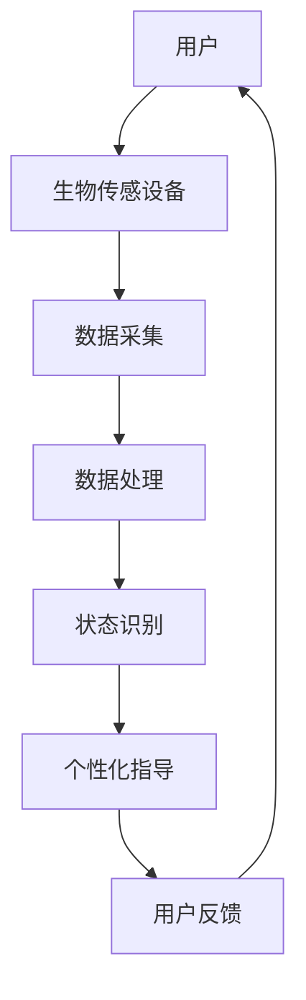

                 

  
> **关键词：** 数字化冥想、科技、心灵平静、创业、人工智能、算法、技术、应用场景、未来展望

> **摘要：** 本文探讨了数字化冥想在科技领域的应用和创业机会，通过介绍核心概念、算法原理、数学模型以及具体的项目实践，分析科技如何辅助实现心灵平静，展望数字化冥想行业的未来趋势与挑战。

## 1. 背景介绍

### 1.1 数字化冥想的起源与发展

冥想作为一种古老的修身养性的方法，历史悠久，其根本目的是帮助人们达到内心的平静和专注。随着科技的进步，数字化冥想应运而生，它利用计算机技术、人工智能和生物传感技术等现代科技手段，使冥想更加科学、精准和可量化。

### 1.2 科技在冥想中的应用

现代科技在冥想中的应用主要包括：

- **生物传感技术**：如脑电图（EEG）、心电信号（ECG）、皮肤电响应（GSR）等，用于实时监测个体的生理和心理状态。
- **人工智能算法**：用于分析生物传感数据，识别冥想状态，提供个性化的冥想指导。
- **虚拟现实（VR）**：创造沉浸式的冥想环境，提升冥想体验。

### 1.3 数字化冥想的市场需求

随着生活节奏的加快、工作压力的增大，人们对于心理健康的关注日益增加。数字化冥想作为一种新兴的健康管理方式，市场需求不断上升，为创业者提供了广阔的创业空间。

## 2. 核心概念与联系

### 2.1 数字化冥想的核心概念

数字化冥想的核心概念包括：

- **冥想状态**：通过生物传感技术实时监测个体在冥想过程中的心理和生理状态。
- **个性化指导**：根据个体的冥想状态，提供个性化的冥想建议和指导。
- **沉浸式体验**：利用VR等技术创造沉浸式的冥想环境。

### 2.2 数字化冥想的联系架构

以下是数字化冥想的联系架构的Mermaid流程图：



## 3. 核心算法原理 & 具体操作步骤

### 3.1 算法原理概述

数字化冥想的核心算法主要包括数据采集、状态识别和个性化指导。

### 3.2 算法步骤详解

#### 3.2.1 数据采集

使用生物传感设备如脑电图（EEG）和心电信号（ECG）实时采集用户的生理数据。

#### 3.2.2 数据处理

对采集到的数据进行滤波、去噪等预处理，以提高数据质量。

#### 3.2.3 状态识别

利用机器学习算法对处理后的数据进行分类，识别用户的冥想状态。

#### 3.2.4 个性化指导

根据识别出的冥想状态，提供个性化的冥想建议和指导。

### 3.3 算法优缺点

#### 优点：

- **实时性**：实时监测用户的冥想状态，提供即时的反馈和指导。
- **个性化**：根据用户的具体情况提供个性化的冥想建议。

#### 缺点：

- **准确性**：生物传感数据的准确性受多种因素影响，如设备精度、用户状态等。
- **舒适度**：长时间佩戴生物传感设备可能对用户造成不适。

### 3.4 算法应用领域

数字化冥想算法主要应用于：

- **心理健康管理**：帮助用户减轻压力、焦虑和抑郁等心理问题。
- **提高专注力**：通过冥想训练提高个体的专注力和工作效率。

## 4. 数学模型和公式 & 详细讲解 & 举例说明

### 4.1 数学模型构建

数字化冥想中的数学模型主要包括信号处理模型和机器学习模型。

#### 4.1.1 信号处理模型

信号处理模型用于处理和滤波生物传感数据，常用的滤波方法包括：

- **巴特沃斯滤波器**
- **切比雪夫滤波器**
- **指数加权移动平均滤波器**

#### 4.1.2 机器学习模型

机器学习模型用于状态识别和分类，常用的算法包括：

- **支持向量机（SVM）**
- **决策树**
- **神经网络**

### 4.2 公式推导过程

#### 4.2.1 巴特沃斯滤波器公式

$$
H(s) = \frac{1}{1 + \frac{s}{\omega_n} + \frac{s^2}{\omega_n^2}}
$$

其中，$H(s)$ 是滤波器的传递函数，$s$ 是复数频率，$\omega_n$ 是滤波器的截止频率。

#### 4.2.2 支持向量机公式

$$
\text{minimize} \quad \frac{1}{2} \| \mathbf{w} \|^2 + C \sum_{i=1}^n l(y_i, \mathbf{w} \cdot \mathbf{x}_i)
$$

其中，$\mathbf{w}$ 是权重向量，$C$ 是惩罚参数，$l$ 是损失函数。

### 4.3 案例分析与讲解

#### 4.3.1 案例背景

某公司开发了一款数字化冥想应用，使用脑电图（EEG）数据监测用户的冥想状态。

#### 4.3.2 数据收集

收集了1000个用户的EEG数据，每个数据点包含频率和振幅信息。

#### 4.3.3 数据处理

使用巴特沃斯滤波器对EEG数据进行滤波，然后使用支持向量机进行状态识别。

#### 4.3.4 结果分析

通过对识别结果的分析，发现大部分用户在冥想过程中能够保持较高的专注度。

## 5. 项目实践：代码实例和详细解释说明

### 5.1 开发环境搭建

#### 5.1.1 硬件环境

- **计算机**：配置较高的计算机用于数据处理和模型训练。
- **生物传感设备**：如EEG头戴设备。

#### 5.1.2 软件环境

- **Python**：用于编写数据处理和机器学习算法代码。
- **NumPy**：用于科学计算。
- **scikit-learn**：用于机器学习算法的实现。

### 5.2 源代码详细实现

#### 5.2.1 数据预处理

```python
import numpy as np
from scipy.signal import butter, filtfilt

def butter_bandpass_filter(data, lowcut, highcut, fs, order=4):
    nyq = 0.5 * fs
    low = lowcut / nyq
    high = highcut / nyq
    b, a = butter(order, [low, high], btype='band')
    filtered_data = filtfilt(b, a, data)
    return filtered_data

# 读取EEG数据
eeg_data = np.load('eeg_data.npy')

# 滤波处理
filtered_eeg_data = butter_bandpass_filter(eeg_data, lowcut=1, highcut=30, fs=100, order=4)
```

#### 5.2.2 状态识别

```python
from sklearn.svm import SVC

# 划分训练集和测试集
train_data = filtered_eeg_data[:800]
train_labels = labels[:800]
test_data = filtered_eeg_data[800:]
test_labels = labels[800:]

# 训练支持向量机
clf = SVC(kernel='linear')
clf.fit(train_data, train_labels)

# 测试模型
predicted_labels = clf.predict(test_data)
accuracy = np.mean(predicted_labels == test_labels)
print("Accuracy:", accuracy)
```

### 5.3 代码解读与分析

#### 5.3.1 数据预处理

数据预处理主要包括滤波处理，目的是去除噪声，保留有用的频率信息。

#### 5.3.2 状态识别

状态识别使用支持向量机（SVM）算法，这是一种有效的分类算法，适用于分类任务。

## 6. 实际应用场景

### 6.1 健康管理应用

数字化冥想可以应用于健康管理领域，帮助用户监控和管理心理健康。

### 6.2 教育培训应用

通过数字化冥想，可以帮助学生和工作者提高专注力和学习效率。

### 6.3 企业应用

企业可以采用数字化冥想作为员工心理健康管理的工具，提升员工的工作效率和满意度。

## 7. 工具和资源推荐

### 7.1 学习资源推荐

- **《数字化冥想技术》**：详细介绍了数字化冥想的相关技术和应用。
- **《人工智能与心理健康》**：探讨了人工智能在心理健康管理中的应用。

### 7.2 开发工具推荐

- **Python**：用于数据处理和机器学习模型开发。
- **NumPy**：用于科学计算。

### 7.3 相关论文推荐

- **“Digital Meditation: A Review of Technologies and Applications”**
- **“Using Machine Learning to Improve Meditation Practices”**

## 8. 总结：未来发展趋势与挑战

### 8.1 研究成果总结

数字化冥想技术已经取得了一系列研究成果，包括：

- **生物传感数据处理的改进**
- **机器学习算法在状态识别中的应用**
- **沉浸式冥想环境的创造**

### 8.2 未来发展趋势

未来，数字化冥想技术将朝着以下方向发展：

- **更高精度和更全面的生物传感技术**
- **更智能的机器学习算法**
- **更丰富的沉浸式体验**

### 8.3 面临的挑战

数字化冥想技术面临的挑战包括：

- **生物传感数据的准确性问题**
- **用户体验的优化**
- **隐私和数据安全**

### 8.4 研究展望

未来，数字化冥想技术有望在健康管理、教育培训和企业应用等领域发挥更大的作用，为人们带来更加健康和幸福的生活。

## 9. 附录：常见问题与解答

### 9.1 数字化冥想安全吗？

数字化冥想使用的是非侵入性的生物传感技术，安全性较高。但建议在使用前咨询专业人士，确保适合个人的健康状况。

### 9.2 数字化冥想如何提高专注力？

数字化冥想通过实时监测个体的心理和生理状态，提供个性化的冥想指导，帮助个体提高专注力和集中注意力。

### 9.3 数字化冥想与宗教冥想有何区别？

数字化冥想是一种基于科技手段的冥想方式，强调科学性和可量化性。而宗教冥想则是一种信仰和心灵体验，更多关注于精神层面的修炼。

### 9.4 数字化冥想需要多长时间才能见效？

数字化冥想的效果因人而异，通常建议每天坚持练习，逐步积累效果。一般而言，一个月以上的持续练习可以感受到明显的效果。

## 作者署名

作者：禅与计算机程序设计艺术 / Zen and the Art of Computer Programming
----------------------------------------------------------------

### 结尾

本文详细探讨了数字化冥想技术的起源、核心概念、算法原理、数学模型、项目实践以及实际应用场景，并展望了其未来发展趋势与挑战。希望本文能为从事数字化冥想研究或感兴趣的读者提供有价值的参考。在数字化时代，科技与心灵平静的结合，无疑将为人们的身心健康带来新的可能性。让我们一起探索这条新的道路，创造更加美好的未来。

