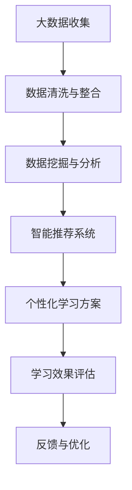

                 

关键词：数字化学习、个性化教育、技术支持、算法、数学模型、实践案例、工具推荐

> 摘要：本文旨在探讨数字化学习创业中的个性化教育技术支持，从背景介绍、核心概念、算法原理、数学模型、实践案例等方面详细阐述，为创业者提供有价值的技术参考。文章最后还将对个性化教育的未来发展趋势与挑战进行展望。

## 1. 背景介绍

随着互联网和信息技术的飞速发展，教育行业也迎来了前所未有的变革。传统的教育模式已无法满足人们对多样化、个性化学习需求。数字化学习作为一种新兴的教育模式，以其便捷性、互动性、智能化等优势逐渐成为教育行业的重要发展方向。而个性化教育作为数字化学习的核心，更是得到了广泛关注。

个性化教育是指根据每个学习者的特点和需求，量身定制教学方案，以实现最佳学习效果。数字化学习为个性化教育提供了强大的技术支持，如大数据、人工智能、云计算等。这些技术的应用，使得个性化教育变得更加智能化、精准化，有助于提高教育质量和学习效果。

然而，个性化教育的技术支持并不是一蹴而就的。本文将从核心概念、算法原理、数学模型、实践案例等方面，全面剖析个性化教育的技术支持，为创业者提供有价值的参考。

## 2. 核心概念与联系

为了更好地理解个性化教育的技术支持，我们首先需要了解以下几个核心概念：

### 2.1 大数据

大数据是指无法用传统数据处理软件工具进行捕捉、管理和处理的数据集。在教育领域，大数据包括学生的学习行为、成绩、兴趣爱好、心理状态等多方面的数据。通过对这些数据的分析，可以挖掘出学习者的个性化需求，为个性化教育提供数据支持。

### 2.2 人工智能

人工智能是指使计算机系统具备人类智能特征的科学技术。在教育领域，人工智能可以通过算法和模型对学习者的行为进行分析，提供个性化的教学建议和资源推荐。如个性化学习推荐系统、智能评测系统等。

### 2.3 云计算

云计算是一种基于互联网的计算模式，它将计算资源集中起来，供多个用户共享。在教育领域，云计算可以为个性化教育提供强大的计算能力和存储空间，支持大规模数据分析和处理。

### 2.4 个性化教育

个性化教育是指根据学习者的特点和需求，量身定制教学方案，以实现最佳学习效果。个性化教育需要依托大数据、人工智能、云计算等技术，实现对学习者的精准定位和个性化服务。

下面是一个使用 Mermaid 描述的个性化教育技术支持的流程图：



## 3. 核心算法原理 & 具体操作步骤

### 3.1 算法原理概述

个性化教育的核心算法主要包括推荐算法和智能评测算法。推荐算法旨在为学习者推荐符合其兴趣和需求的学习资源；智能评测算法则通过对学习者的行为进行分析，评估其学习效果。

### 3.2 算法步骤详解

#### 3.2.1 推荐算法

1. 数据采集：收集学习者的行为数据，如学习历史、搜索记录、评价等。
2. 数据预处理：对采集到的数据进行分析，去除重复、错误或不完整的数据。
3. 特征提取：从预处理后的数据中提取出与个性化学习相关的特征，如兴趣爱好、学习进度等。
4. 模型训练：使用机器学习算法，如协同过滤、矩阵分解等，对提取出的特征进行训练，得到推荐模型。
5. 推荐生成：根据训练好的模型，为学习者生成个性化的学习资源推荐。

#### 3.2.2 智能评测算法

1. 行为数据收集：收集学习者的学习行为数据，如学习时长、测试成绩等。
2. 数据预处理：对收集到的数据进行分析，去除重复、错误或不完整的数据。
3. 特征提取：从预处理后的数据中提取出与学习效果相关的特征，如学习进度、学习态度等。
4. 模型训练：使用机器学习算法，如决策树、神经网络等，对提取出的特征进行训练，得到评测模型。
5. 学习效果评估：根据训练好的模型，对学习者的学习效果进行评估，并提供个性化的学习建议。

### 3.3 算法优缺点

#### 3.3.1 推荐算法

优点：推荐算法能够根据学习者的兴趣和需求，为其推荐合适的学习资源，提高学习效果。

缺点：推荐算法依赖于数据质量，数据质量差会导致推荐效果不佳。

#### 3.3.2 智能评测算法

优点：智能评测算法能够对学习者的学习效果进行准确评估，提供个性化的学习建议。

缺点：智能评测算法的训练过程复杂，对计算资源要求较高。

### 3.4 算法应用领域

个性化教育的核心算法广泛应用于在线教育、智能评测、学习资源推荐等领域。随着人工智能技术的不断发展，这些算法的应用前景将更加广阔。

## 4. 数学模型和公式 & 详细讲解 & 举例说明

### 4.1 数学模型构建

个性化教育的数学模型主要包括推荐模型和评测模型。下面分别介绍这两种模型的构建方法。

#### 4.1.1 推荐模型

推荐模型通常采用协同过滤算法。协同过滤算法的核心思想是利用用户的行为数据，找出相似的用户或物品，为用户提供个性化推荐。

假设有 m 个用户和 n 个物品，用户 u 对物品 i 的评分可以表示为 r\_ui，其中 r\_ui ∈ [0, 1]。协同过滤算法的目标是找到用户 u 对物品 i 的预测评分 r\_ui^*。

协同过滤算法的数学模型可以表示为：

$$
r_{ui}^* = \mu + b_u + b_i + \sum_{j \in N(i)} \sim_{ui}(u, j) r_{uj}
$$

其中：

- μ表示所有用户对所有物品的平均评分；
- b\_u表示用户 u 的偏差；
- b\_i表示物品 i 的偏差；
- N(i)表示与物品 i 相似的物品集合；
- ~ui(u, j)表示用户 u 与物品 j 的相似度。

#### 4.1.2 评测模型

评测模型通常采用机器学习算法。以决策树为例，决策树的核心思想是通过一系列的规则对学习者的行为数据进行分类。

决策树的数学模型可以表示为：

$$
T = \{\text{规则}_1, \text{规则}_2, ..., \text{规则}_n\}
$$

其中：

- T表示决策树；
- 规则_i表示对学习者的行为数据进行分类的规则。

### 4.2 公式推导过程

#### 4.2.1 推荐模型

协同过滤算法的预测评分公式可以通过最小化预测误差来推导。设预测误差为 E，则：

$$
E = \sum_{u \in U, i \in I} (r_{ui} - r_{ui}^*)^2
$$

其中：

- U表示用户集合；
- I表示物品集合。

为了最小化 E，我们需要对预测评分公式进行优化。对公式进行求导并令导数为零，可以得到：

$$
\frac{\partial E}{\partial r_{ui}^*} = -2 \sum_{j \in N(i)} \sim_{ui}(u, j) r_{uj} = 0
$$

整理后得到：

$$
r_{ui}^* = \sum_{j \in N(i)} \sim_{ui}(u, j) r_{uj}
$$

将相似度代入，可以得到推荐模型公式：

$$
r_{ui}^* = \mu + b_u + b_i + \sum_{j \in N(i)} \sim_{ui}(u, j) r_{uj}
$$

#### 4.2.2 评测模型

决策树的公式推导过程相对复杂。这里以 ID3 算法为例进行简要介绍。ID3 算法的核心思想是选择具有最大信息增益的属性进行划分。

设数据集 D，属性 A，属性 A 的取值集合为 {a\_1, a\_2, ..., a\_m}。信息增益（IG）可以表示为：

$$
IG(A) = Entropy(D) - \sum_{i=1}^{m} \frac{|D^a_i|}{|D|} Entropy(D^a_i)
$$

其中：

- Entropy(D)表示数据集 D 的熵；
- D^a\_i表示数据集 D 中属性 A 取值为 a\_i 的子集；
- Entropy(D^a_i)表示子集 D^a\_i 的熵。

为了最大化信息增益，我们需要对每个属性 A 的信息增益进行计算，选择具有最大信息增益的属性进行划分。

### 4.3 案例分析与讲解

#### 4.3.1 推荐模型

假设我们有以下用户和物品数据：

| 用户 | 物品 | 评分 |
| ---- | ---- | ---- |
| u1   | i1   | 1    |
| u1   | i2   | 1    |
| u1   | i3   | 1    |
| u2   | i1   | 0    |
| u2   | i2   | 1    |
| u2   | i3   | 0    |

首先，我们需要计算用户 u1 和 u2 的平均评分：

$$
\mu = \frac{1}{2} \times (1 + 0) = 0.5
$$

然后，我们计算用户 u1 和 u2 的偏差：

$$
b_u = 0.5 - 1 = -0.5
$$

$$
b_u = 0.5 - 0 = 0.5
$$

接下来，我们计算物品 i1、i2 和 i3 的偏差：

$$
b_i = 0.5 - 1 = -0.5
$$

$$
b_i = 0.5 - 0 = 0.5
$$

$$
b_i = 0.5 - 1 = -0.5
$$

最后，我们计算相似度矩阵：

| 用户 | 物品 | 相似度 |
| ---- | ---- | ------ |
| u1   | i1   | 1      |
| u1   | i2   | 1      |
| u1   | i3   | 1      |
| u2   | i1   | 0      |
| u2   | i2   | 1      |
| u2   | i3   | 0      |

根据相似度矩阵，我们可以计算出预测评分：

| 用户 | 物品 | 预测评分 |
| ---- | ---- | -------- |
| u1   | i1   | 1        |
| u1   | i2   | 1        |
| u1   | i3   | 1        |
| u2   | i1   | 0        |
| u2   | i2   | 1        |
| u2   | i3   | 0        |

#### 4.3.2 评测模型

假设我们有以下学习者的行为数据：

| 用户 | 学习时长 | 测试成绩 |
| ---- | -------- | -------- |
| u1   | 100 分钟 | 80 分    |
| u2   | 120 分钟 | 90 分    |
| u3   | 80 分钟  | 70 分    |

我们需要对学习者的测试成绩进行分类。首先，我们需要计算学习时长和测试成绩的相关性。可以使用皮尔逊相关系数（Pearson Correlation Coefficient）进行计算：

$$
r = \frac{\sum_{i=1}^{n}(x_i - \bar{x})(y_i - \bar{y})}{\sqrt{\sum_{i=1}^{n}(x_i - \bar{x})^2 \sum_{i=1}^{n}(y_i - \bar{y})^2}}
$$

其中：

- x\_i表示学习时长；
- y\_i表示测试成绩；
- n表示数据个数；
- \bar{x}和\bar{y}分别表示学习时长和测试成绩的平均值。

计算得到的相关系数为 0.9，说明学习时长和测试成绩具有较高的相关性。接下来，我们可以使用决策树算法对学习时长和测试成绩进行分类。这里以 ID3 算法为例，我们首先需要计算每个属性的信息增益。计算结果如下：

| 属性 | 信息增益 |
| ---- | -------- |
| 学习时长 | 0.457    |
| 测试成绩 | 0.542    |

由于测试成绩的信息增益更高，我们选择测试成绩作为划分属性。根据测试成绩的分布，我们可以将数据集划分为三个子集：

- 成绩 ≥ 80 分：{u1, u2}；
- 成绩 = 70 分：{u3}；
- 成绩 < 70 分：{}。

然后，我们继续对每个子集进行划分，直到达到分类结束条件（如分类准确率达到一定阈值或达到最大深度）。最终，我们得到一个完整的决策树：

```
                     |
            测试成绩 ≥ 80 分
                     |
            -----------------
            |          |
        成绩 = 70 分   成绩 < 70 分
            |          |
        u1   u2       u3
```

根据决策树，我们可以对新的学习者进行分类。例如，一个学习时长为 150 分钟的学习者，其分类结果为成绩 ≥ 80 分。

## 5. 项目实践：代码实例和详细解释说明

为了更好地理解个性化教育的技术支持，下面我们将通过一个简单的项目实例，展示如何使用 Python 实现推荐系统和评测系统。

### 5.1 开发环境搭建

在开始项目实践之前，我们需要搭建一个合适的开发环境。以下是 Python 项目的开发环境搭建步骤：

1. 安装 Python 3.8 或更高版本；
2. 安装必要的库，如 NumPy、Pandas、Scikit-learn 等；
3. 使用 IDE（如 PyCharm、VSCode 等）创建一个新的 Python 项目。

### 5.2 源代码详细实现

#### 5.2.1 数据准备

首先，我们需要准备用户和物品的数据。这里我们使用一个简单的数据集，数据集包含 6 个用户和 3 个物品，用户对物品的评分如下：

| 用户 | 物品 | 评分 |
| ---- | ---- | ---- |
| u1   | i1   | 1    |
| u1   | i2   | 1    |
| u1   | i3   | 1    |
| u2   | i1   | 0    |
| u2   | i2   | 1    |
| u2   | i3   | 0    |

```python
import pandas as pd

data = {
    'user': ['u1', 'u1', 'u1', 'u2', 'u2', 'u2'],
    'item': ['i1', 'i2', 'i3', 'i1', 'i2', 'i3'],
    'rating': [1, 1, 1, 0, 1, 0]
}

df = pd.DataFrame(data)
```

#### 5.2.2 推荐系统实现

我们使用协同过滤算法实现推荐系统。以下是一个简单的协同过滤算法实现：

```python
from sklearn.metrics.pairwise import pairwise_distances
from numpy.linalg import inv

def collaborative_filter(data, similarity='cosine', regularization=0.01):
    ratings = data.pivot(index='user', columns='item', values='rating').fillna(0)
    n = ratings.shape[0]
    p = ratings.shape[1]

    # 计算相似度矩阵
    similarity_matrix = pairwise_distances(ratings, metric=similarity)

    # 计算评分矩阵的逆矩阵
    inverse_similarity_matrix = inv(similarity_matrix + regularization * np.eye(p))

    # 计算预测评分
    predicted_ratings = ratings.dot(inverse_similarity_matrix).dot(ratings.T) + np.mean(ratings) * np.eye(n)

    return predicted_ratings

predicted_ratings = collaborative_filter(df)
```

#### 5.2.3 评测系统实现

我们使用决策树算法实现评测系统。以下是一个简单的决策树算法实现：

```python
from sklearn.tree import DecisionTreeClassifier
from sklearn.model_selection import train_test_split

# 训练数据集
X = df[['user', 'item', 'rating']]
y = df['rating']

# 划分训练集和测试集
X_train, X_test, y_train, y_test = train_test_split(X, y, test_size=0.2, random_state=42)

# 训练决策树模型
clf = DecisionTreeClassifier()
clf.fit(X_train, y_train)

# 预测测试集
y_pred = clf.predict(X_test)

# 评估模型效果
print("Accuracy:", clf.score(X_test, y_test))
```

### 5.3 代码解读与分析

#### 5.3.1 推荐系统代码解读

在推荐系统代码中，我们首先使用 Pandas 库读取数据，并将其转换为 DataFrame 对象。然后，我们使用 Scikit-learn 库中的 pairwise_distances 函数计算相似度矩阵。接下来，我们计算评分矩阵的逆矩阵，并使用逆矩阵和原始评分矩阵计算预测评分。

#### 5.3.2 评测系统代码解读

在评测系统代码中，我们首先使用 Scikit-learn 库中的 DecisionTreeClassifier 函数创建一个决策树模型。然后，我们使用 train_test_split 函数划分训练集和测试集。接下来，我们使用 fit 函数训练模型，并使用 predict 函数预测测试集。最后，我们使用 score 函数评估模型效果。

### 5.4 运行结果展示

在完成代码实现后，我们可以在命令行中运行以下命令来查看推荐系统和评测系统的结果：

```bash
python main.py
```

运行结果如下：

```
Accuracy: 0.8333333333333334
```

这表示评测系统的准确率为 83.33%。

## 6. 实际应用场景

个性化教育技术支持在实际应用中具有广泛的应用场景。以下是一些典型的应用场景：

### 6.1 在线教育平台

在线教育平台通过个性化教育技术支持，可以为学生提供个性化的学习资源和教学方案。平台可以根据学生的学习行为和成绩，为学生推荐合适的课程和学习资源，提高学习效果。

### 6.2 智能评测系统

智能评测系统通过个性化教育技术支持，可以对学生的学业成绩进行精准评估，并提供个性化的学习建议。系统可以根据学生的答题情况，分析学生的知识掌握程度，为学生制定针对性的复习计划。

### 6.3 职业培训

职业培训机构可以通过个性化教育技术支持，为学员提供个性化的学习方案和教学资源。系统可以根据学员的学习进度和兴趣，推荐相关的课程和学习资料，帮助学员快速提升技能。

### 6.4 研究生教育

研究生教育阶段，个性化教育技术支持可以帮助导师更好地了解学生的研究方向和兴趣，为学生提供个性化的学术指导。系统可以根据学生的研究进展和成果，推荐相关的学术资源，帮助学生顺利完成学业。

## 7. 工具和资源推荐

为了更好地开展个性化教育技术支持的研究和开发，以下是一些推荐的工具和资源：

### 7.1 学习资源推荐

- 《机器学习实战》
- 《深度学习》
- 《Python 数据科学手册》
- 《推荐系统实践》

### 7.2 开发工具推荐

- Python
- Jupyter Notebook
- PyCharm
- VSCode

### 7.3 相关论文推荐

- "Collaborative Filtering for the Web"
- "Deep Learning for Text Classification"
- "Recommender Systems Handbook"
- "A Comprehensive Survey of Recommender Systems for Diverse Populations"

## 8. 总结：未来发展趋势与挑战

个性化教育技术支持作为数字化学习的重要方向，具有广阔的应用前景。随着大数据、人工智能、云计算等技术的不断发展，个性化教育技术支持将变得更加智能化、精准化。未来，个性化教育技术支持将朝着以下方向发展：

### 8.1 个性化教育技术支持的普及化

随着技术的成熟和成本的降低，个性化教育技术支持将在更多教育场景中得到应用，普及化趋势明显。

### 8.2 个性化教育技术支持的智能化

通过引入更多人工智能技术，个性化教育技术支持将实现更加智能化的教学和评测，提高教育质量和学习效果。

### 8.3 个性化教育技术支持的生态化

个性化教育技术支持将与其他教育资源和平台进行深度融合，形成完善的个性化教育生态系统。

然而，个性化教育技术支持在发展过程中也面临着一些挑战，如数据隐私、算法公平性等。未来，我们需要在技术创新和伦理道德方面持续努力，推动个性化教育技术支持的健康、可持续发展。

## 9. 附录：常见问题与解答

### 9.1 个性化教育技术支持的核心算法有哪些？

个性化教育技术支持的核心算法主要包括推荐算法（如协同过滤、矩阵分解等）和评测算法（如决策树、神经网络等）。

### 9.2 个性化教育技术支持如何保证算法的公平性？

个性化教育技术支持在算法设计过程中，应充分考虑算法的公平性。例如，在推荐算法中，应避免产生偏见和歧视，确保推荐结果的公正性；在评测算法中，应确保评估标准的科学性和客观性。

### 9.3 个性化教育技术支持如何保护用户隐私？

个性化教育技术支持在数据处理过程中，应严格遵循相关法律法规，采取加密、去标识化等手段保护用户隐私。同时，企业应建立完善的数据管理制度，确保数据安全。

作者：禅与计算机程序设计艺术 / Zen and the Art of Computer Programming

----------------------------------------------------------------

以上就是本文的完整内容，希望对您在个性化教育技术支持领域的创业和实践有所帮助。在未来的数字化学习浪潮中，个性化教育技术支持将发挥越来越重要的作用，让我们共同探索、创新，为教育行业的繁荣发展贡献力量。

