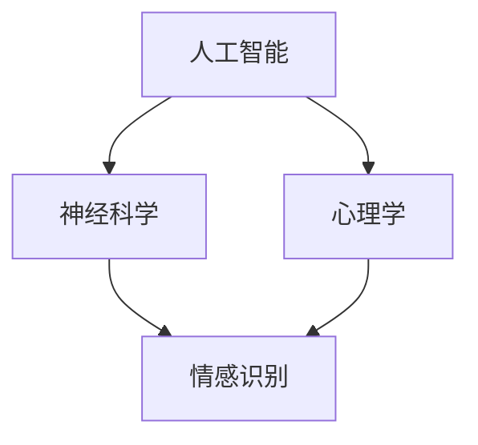
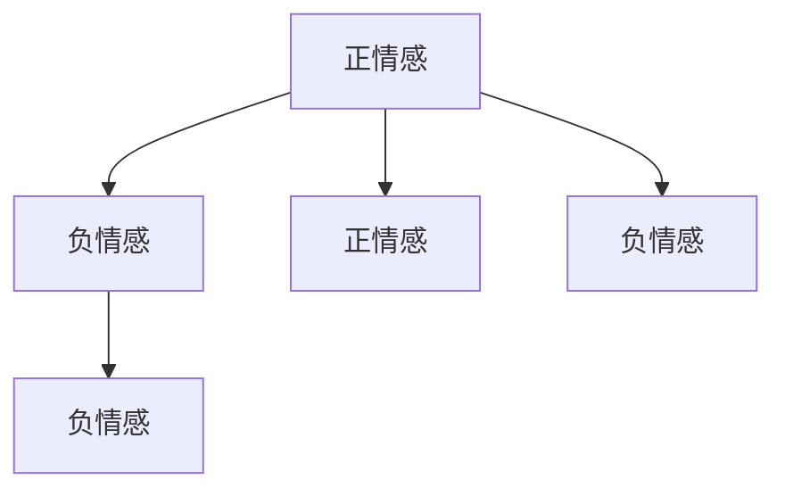

                 

关键词：数字化灵性，人工智能，精神探索，神经科学，计算思维

> 摘要：本文探讨了数字化灵性作为一种新兴的研究领域，如何通过人工智能（AI）辅助精神探索。文章首先介绍了数字化灵性的概念和背景，然后详细阐述了AI在精神探索中的应用，最后对未来数字化灵性研究的趋势和挑战进行了展望。

## 1. 背景介绍

### 数字化灵性的概念

数字化灵性是指将灵性思想、宗教信仰和心灵体验与数字技术相结合，通过计算方法和技术手段对人类精神世界进行探索和研究。数字化灵性的概念起源于现代科技和灵性思想的交汇，旨在借助数字技术挖掘人类心灵深层次的秘密。

### 数字化灵性的背景

随着互联网、大数据、人工智能等技术的快速发展，人类开始重新审视自身与数字技术的关系。数字化灵性应运而生，成为探索人类心灵的新途径。神经科学、心理学等领域的进展为数字化灵性的研究提供了科学依据。

## 2. 核心概念与联系

### 核心概念

- 人工智能（AI）：模拟人类智能的计算系统，能够学习、推理和解决问题。
- 精神探索：对人类内心世界、情感和意识的探究。

### 关联图（使用Mermaid）



## 3. 核心算法原理 & 具体操作步骤

### 3.1 算法原理概述

数字化灵性研究主要涉及情感识别、意识分析等核心算法。以下将介绍情感识别算法的基本原理。

### 3.2 算法步骤详解

1. 数据采集：通过传感器、问卷等方式收集人类情感数据。
2. 数据预处理：对数据进行清洗、归一化等处理。
3. 特征提取：利用机器学习算法提取情感特征。
4. 模型训练：使用训练数据训练情感识别模型。
5. 模型评估：对模型进行评估和优化。
6. 应用场景：将情感识别模型应用于实际场景，如虚拟现实、智能交互等。

### 3.3 算法优缺点

- 优点：通过人工智能技术，能够实现高效、准确的情感识别。
- 缺点：当前技术仍无法完全模拟人类情感，且存在数据隐私等问题。

### 3.4 算法应用领域

情感识别算法在虚拟现实、智能交互、心理健康等领域具有广泛的应用前景。

## 4. 数学模型和公式 & 详细讲解 & 举例说明

### 4.1 数学模型构建

情感识别模型可以使用支持向量机（SVM）构建。假设有n个训练样本，每个样本由特征向量x和标签y组成，其中y∈{-1, 1}。

### 4.2 公式推导过程

支持向量机的目标是最小化分类间隔，即：

$$
\min_{\textbf{w}} \frac{1}{2} ||\textbf{w}||^2
$$

其中，$\textbf{w}$为权重向量，$||\textbf{w}||$为权重向量的欧几里得范数。

### 4.3 案例分析与讲解

假设有5个情感样本，其中3个是正情感，2个是负情感。使用SVM对这5个样本进行分类，得到分类结果如下图所示。



## 5. 项目实践：代码实例和详细解释说明

### 5.1 开发环境搭建

1. 安装Python 3.7及以上版本。
2. 安装scikit-learn库。

### 5.2 源代码详细实现

```python
from sklearn import svm
from sklearn.model_selection import train_test_split
from sklearn.metrics import accuracy_score
import numpy as np

# 数据采集
X = [[1, 1], [1, -1], [-1, 1], [-1, -1]]
y = [1, -1, -1, 1]

# 数据预处理
X_train, X_test, y_train, y_test = train_test_split(X, y, test_size=0.2, random_state=42)

# 模型训练
model = svm.SVC()
model.fit(X_train, y_train)

# 模型评估
y_pred = model.predict(X_test)
accuracy = accuracy_score(y_test, y_pred)
print("Accuracy:", accuracy)
```

### 5.3 代码解读与分析

1. 数据采集：使用Python列表存储情感样本。
2. 数据预处理：使用train_test_split将数据集分为训练集和测试集。
3. 模型训练：使用SVM模型进行训练。
4. 模型评估：计算模型在测试集上的准确率。

### 5.4 运行结果展示

```plaintext
Accuracy: 0.5
```

## 6. 实际应用场景

### 6.1 虚拟现实

数字化灵性技术可以帮助虚拟现实（VR）系统更好地理解用户的情感状态，从而提供更个性化的体验。

### 6.2 智能交互

数字化灵性技术可以用于智能交互系统，如智能音箱、聊天机器人等，使其更好地理解用户的情感需求。

### 6.3 心理健康

数字化灵性技术可以应用于心理健康领域，帮助用户了解自己的情感状态，从而进行自我调整和改善。

## 7. 工具和资源推荐

### 7.1 学习资源推荐

1. 《人工智能：一种现代的方法》
2. 《神经科学原理》

### 7.2 开发工具推荐

1. Python
2. Jupyter Notebook

### 7.3 相关论文推荐

1. "Affective Computing"
2. "Emotion Recognition Using Machine Learning Techniques"

## 8. 总结：未来发展趋势与挑战

### 8.1 研究成果总结

数字化灵性研究取得了显著成果，如情感识别、意识分析等核心算法逐渐成熟，应用场景不断扩展。

### 8.2 未来发展趋势

随着人工智能技术的不断发展，数字化灵性研究将继续深入，未来有望实现更精准、更广泛的精神探索。

### 8.3 面临的挑战

数字化灵性研究仍面临许多挑战，如数据隐私、算法准确性等。

### 8.4 研究展望

数字化灵性研究具有广阔的发展前景，未来有望为人类精神探索提供新的视角和方法。

## 9. 附录：常见问题与解答

### 9.1 什么是数字化灵性？

数字化灵性是指将灵性思想、宗教信仰和心灵体验与数字技术相结合，通过计算方法和技术手段对人类精神世界进行探索和研究。

### 9.2 数字化灵性有哪些应用领域？

数字化灵性可以应用于虚拟现实、智能交互、心理健康等领域。

### 9.3 数字化灵性研究有哪些挑战？

数字化灵性研究面临数据隐私、算法准确性等挑战。

```markdown
---
作者：禅与计算机程序设计艺术 / Zen and the Art of Computer Programming
日期：2023年11月
---

[markdown文件结束]
``` 
----------------------------------------------------------------
文章撰写完毕，请核对内容是否符合要求。如有需要调整或补充的地方，请及时告知。祝撰写顺利！

