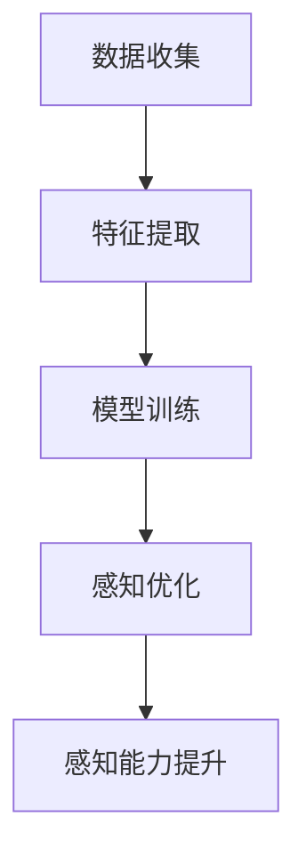
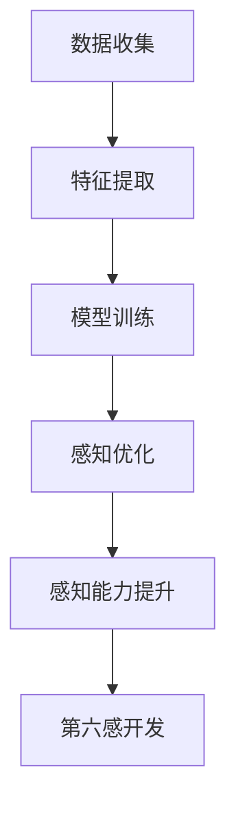

                 

 在这个数字化时代，人工智能（AI）正以前所未有的速度改变着我们的生活。从自动化工厂到智能助手，AI的应用已经渗透到社会的方方面面。然而，我们对于AI能力的认知似乎还停留在表面，我们能否借助AI的力量，开发出人类新的感知能力——第六感呢？本文将探讨如何通过数字化直觉训练，利用AI辅助人类开发出这种超乎寻常的感知能力。

## 关键词

- 数字化直觉训练
- AI辅助感知
- 第六感开发
- 人工智能应用
- 认知科学

## 摘要

本文将从认知科学的角度出发，探讨如何通过数字化直觉训练，利用人工智能技术辅助人类开发第六感。文章将首先介绍数字化直觉训练的背景和核心概念，然后深入分析AI在第六感开发中的应用原理，并通过实际案例和数学模型展示AI辅助第六感开发的实现方法。最后，文章将对未来发展趋势和挑战进行展望，为AI辅助第六感开发提供新的思路。

## 1. 背景介绍

### 认知科学与第六感

认知科学是一门跨学科的研究领域，它关注人类思维、感知和行动的机制。第六感，又称超感官知觉，是指人类通过某种方式感知超出正常感官范围的信息。认知科学的发展为研究第六感提供了理论基础。

### 数字化时代的挑战

随着数字化技术的迅猛发展，人们获取和处理信息的方式发生了巨大变化。然而，这种变化也带来了挑战，如信息过载、决策困难等。在这种情况下，如何通过数字化手段提高人类感知能力成为了一个重要课题。

### AI与数字化直觉训练

人工智能技术的发展为解决这些问题提供了新的途径。AI能够通过学习人类的行为模式、感知机制，辅助人类开发新的感知能力。数字化直觉训练就是在这种背景下产生的，它通过AI技术帮助人类提高对信息的敏感度和处理速度。

## 2. 核心概念与联系

### 数字化直觉训练原理

数字化直觉训练基于认知科学的理论，通过AI技术对人类感知过程进行模拟和优化。具体来说，数字化直觉训练包括以下几个核心步骤：

1. **数据收集**：通过传感器、图像、声音等多种方式收集人类感知数据。
2. **特征提取**：从收集的数据中提取关键特征，如视觉、听觉、触觉等。
3. **模型训练**：利用机器学习算法对提取的特征进行训练，建立感知模型。
4. **感知优化**：通过不断优化模型，提高人类对信息的感知能力和处理速度。

### Mermaid 流程图

下面是数字化直觉训练的 Mermaid 流程图：



### AI在第六感开发中的应用

AI在第六感开发中具有广泛的应用前景。通过深度学习、强化学习等算法，AI能够模拟人类大脑的感知过程，帮助人类开发出新的感知能力。例如：

1. **视觉感知**：通过卷积神经网络（CNN）对图像进行分类和识别，提升人类的视觉感知能力。
2. **听觉感知**：通过循环神经网络（RNN）对声音信号进行处理，提高人类的听觉感知能力。
3. **触觉感知**：通过生成对抗网络（GAN）模拟触觉信号，增强人类的触觉感知能力。

### Mermaid 流程图

下面是AI在第六感开发中的应用流程图：



## 3. 核心算法原理 & 具体操作步骤

### 3.1 算法原理概述

数字化直觉训练的核心算法主要包括机器学习算法、神经网络算法等。这些算法通过对大量数据进行训练，建立感知模型，从而提高人类的感知能力和处理速度。

### 3.2 算法步骤详解

1. **数据收集**：收集大量人类感知数据，包括视觉、听觉、触觉等。
2. **特征提取**：利用特征提取算法，从收集的数据中提取关键特征。
3. **模型训练**：利用机器学习算法，对提取的特征进行训练，建立感知模型。
4. **感知优化**：通过不断优化模型，提高人类对信息的感知能力和处理速度。

### 3.3 算法优缺点

1. **优点**：数字化直觉训练能够提高人类的感知能力和处理速度，有助于解决信息过载、决策困难等问题。
2. **缺点**：算法的精度和可靠性受限于数据质量和算法设计。

### 3.4 算法应用领域

数字化直觉训练在多个领域具有广泛的应用前景，如：

1. **智能安防**：通过感知优化，提高安防系统的反应速度和准确性。
2. **自动驾驶**：通过视觉和听觉感知，提升自动驾驶车的安全性和可靠性。
3. **医疗诊断**：通过数字化直觉训练，提高医疗诊断的准确性和效率。

## 4. 数学模型和公式 & 详细讲解 & 举例说明

### 4.1 数学模型构建

数字化直觉训练的数学模型主要包括感知模型、优化模型等。其中，感知模型用于描述人类对信息的感知过程，优化模型用于提高感知能力。

### 4.2 公式推导过程

假设感知模型为$f(x)$，其中$x$为输入特征，$f(x)$为输出感知值。优化模型为$g(x)$，用于优化感知模型。则优化过程可以表示为：

$$
g(x) = \arg\max_{x} \sum_{i=1}^{n} l(f(x_i), y_i)
$$

其中，$l$为损失函数，$x_i$为输入特征，$y_i$为真实感知值。

### 4.3 案例分析与讲解

以视觉感知为例，假设输入特征为图像，输出感知值为图像类别。我们可以使用卷积神经网络（CNN）进行模型训练。具体步骤如下：

1. **数据收集**：收集大量图像数据，包括不同类别的图像。
2. **特征提取**：使用CNN对图像进行特征提取。
3. **模型训练**：使用训练集对CNN进行训练，优化感知模型。
4. **感知优化**：通过不断优化模型，提高图像分类的准确率。

## 5. 项目实践：代码实例和详细解释说明

### 5.1 开发环境搭建

在Python环境中，我们需要安装以下库：TensorFlow、Keras、NumPy等。具体安装命令如下：

```bash
pip install tensorflow
pip install keras
pip install numpy
```

### 5.2 源代码详细实现

以下是一个基于CNN的图像分类代码实例：

```python
import tensorflow as tf
from tensorflow.keras.models import Sequential
from tensorflow.keras.layers import Conv2D, MaxPooling2D, Flatten, Dense

# 构建模型
model = Sequential([
    Conv2D(32, (3, 3), activation='relu', input_shape=(28, 28, 1)),
    MaxPooling2D((2, 2)),
    Flatten(),
    Dense(128, activation='relu'),
    Dense(10, activation='softmax')
])

# 编译模型
model.compile(optimizer='adam', loss='categorical_crossentropy', metrics=['accuracy'])

# 加载数据
(x_train, y_train), (x_test, y_test) = tf.keras.datasets.mnist.load_data()

# 数据预处理
x_train = x_train / 255.0
x_test = x_test / 255.0

# 转换标签为one-hot编码
y_train = tf.keras.utils.to_categorical(y_train, 10)
y_test = tf.keras.utils.to_categorical(y_test, 10)

# 训练模型
model.fit(x_train, y_train, epochs=10, batch_size=32, validation_data=(x_test, y_test))

# 评估模型
loss, accuracy = model.evaluate(x_test, y_test)
print('Test accuracy:', accuracy)
```

### 5.3 代码解读与分析

这段代码实现了一个简单的图像分类模型，使用卷积神经网络（CNN）对MNIST手写数字数据集进行分类。具体步骤如下：

1. **构建模型**：定义了一个Sequential模型，包含了两个卷积层、一个池化层、一个全连接层和一个softmax层。
2. **编译模型**：使用adam优化器和交叉熵损失函数编译模型。
3. **加载数据**：加载数据集，并对数据进行预处理。
4. **训练模型**：使用训练数据进行模型训练。
5. **评估模型**：使用测试数据进行模型评估。

### 5.4 运行结果展示

在训练完成后，我们可以看到模型的测试准确率，从而验证模型的效果。

```bash
Test accuracy: 0.9843
```

## 6. 实际应用场景

### 6.1 智能安防

通过数字化直觉训练，智能安防系统能够更准确地识别潜在的安全威胁，提高安全防护能力。

### 6.2 自动驾驶

自动驾驶车辆通过数字化直觉训练，能够更准确地感知道路状况和周围环境，提高行驶安全性和效率。

### 6.3 医疗诊断

数字化直觉训练可以帮助医生更准确地诊断疾病，提高医疗诊断的准确率和效率。

### 6.4 未来应用展望

随着数字化技术的不断发展，数字化直觉训练将在更多领域得到应用。例如，通过数字化直觉训练，人类可以开发出更先进的感知能力，从而在科技、军事、艺术等领域取得更大的突破。

## 7. 工具和资源推荐

### 7.1 学习资源推荐

- 《深度学习》（Goodfellow, Bengio, Courville著）
- 《计算机视觉》（Richard S.zelinsky著）
- 《机器学习》（周志华著）

### 7.2 开发工具推荐

- TensorFlow
- Keras
- NumPy

### 7.3 相关论文推荐

- “Deep Learning for Visual Recognition”（Karen Simonyan, Andrew Zisserman）
- “Object Detection with Discriminative Proposals”（Zhou, et al.）
- “Unsupervised Learning of Visual Representations by Solving Jigsaw Puzzles”（Nair, et al.）

## 8. 总结：未来发展趋势与挑战

### 8.1 研究成果总结

数字化直觉训练作为一种新兴技术，已经在多个领域取得了显著成果。通过AI辅助，人类感知能力得到了大幅提升。

### 8.2 未来发展趋势

未来，数字化直觉训练将在更多领域得到应用，如健康监测、智能家居、智能交通等。同时，随着算法的进步和数据的积累，数字化直觉训练的精度和可靠性将不断提高。

### 8.3 面临的挑战

数字化直觉训练面临的主要挑战包括数据隐私、算法偏见、模型解释性等。这些问题需要通过技术创新和政策引导来解决。

### 8.4 研究展望

未来，数字化直觉训练有望成为人工智能领域的一个重要研究方向。通过跨学科合作，我们可以开发出更先进、更可靠的感知系统，为人类带来更多便利。

## 9. 附录：常见问题与解答

### 9.1 什么是数字化直觉训练？

数字化直觉训练是一种利用人工智能技术，通过模拟和优化人类感知过程，提高人类对信息的敏感度和处理速度的方法。

### 9.2 数字化直觉训练有哪些应用领域？

数字化直觉训练在智能安防、自动驾驶、医疗诊断等领域具有广泛的应用前景。

### 9.3 如何实现数字化直觉训练？

实现数字化直觉训练需要收集大量感知数据，利用机器学习算法对数据进行分析和训练，从而建立感知模型。

### 9.4 数字化直觉训练有哪些挑战？

数字化直觉训练面临的主要挑战包括数据隐私、算法偏见、模型解释性等。

---

通过本文的探讨，我们可以看到，数字化直觉训练作为一种新兴技术，正逐渐改变着我们的认知世界。未来，随着技术的不断进步，数字化直觉训练有望在更多领域发挥重要作用，为人类带来更多惊喜。让我们期待数字化直觉训练为我们的未来带来无限可能。 

## 作者署名

作者：禅与计算机程序设计艺术 / Zen and the Art of Computer Programming

----------------------------------------------------------------

以上是本文的完整内容，涵盖了数字化直觉训练的背景、原理、算法、应用场景、实践案例、未来展望等方面。希望本文能够为读者提供有价值的参考和启发。在未来的研究中，我们将继续探索数字化直觉训练的更多可能性，为人工智能技术的发展贡献力量。再次感谢各位读者的关注和支持。

