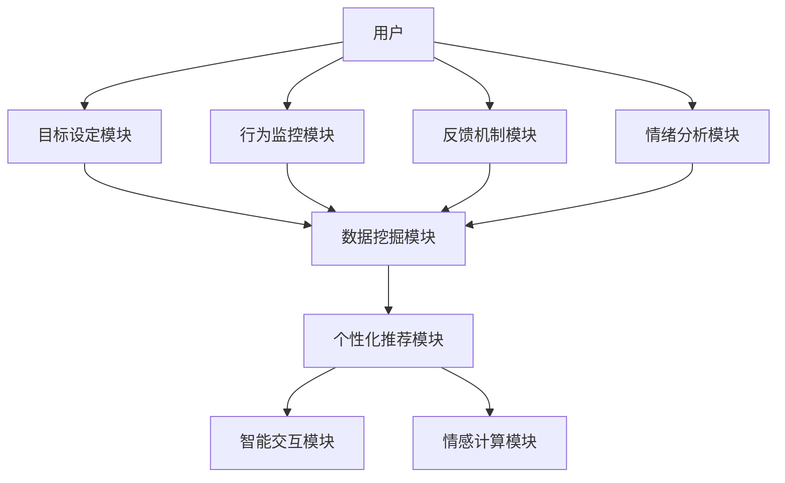

                 

关键词：数字化助手、AI、个人成长、教练设计、技术博客、算法原理

> 摘要：本文深入探讨了数字化自我实现助手开发者如何利用AI技术构建个人成长教练，通过详细阐述核心概念、算法原理、数学模型以及实际应用，为读者提供了一套完整的技术解决方案，旨在帮助开发者设计出高效、实用的AI辅助个人成长系统。

## 1. 背景介绍

随着人工智能技术的不断进步，AI在各个领域的应用逐渐深入。特别是在个人成长领域，AI的应用已经成为推动个体进步的重要力量。数字化自我实现助手作为AI的一种表现形式，通过智能化的手段帮助人们设定目标、监控进度、提供反馈，从而实现个人成长。本文旨在探讨如何通过AI技术设计一个高效的个人成长教练，以帮助用户实现自我提升。

### 1.1 数字化自我实现助手的现状

当前，数字化自我实现助手主要应用于以下几个方面：

1. **目标设定**：帮助用户设定短期和长期目标，如健康、学习、工作等。
2. **行为监控**：通过记录用户的行为数据，分析其习惯和规律，为用户提供改进建议。
3. **反馈机制**：基于用户的反馈，调整助手的建议和指导，提高个性化程度。
4. **情绪分析**：利用自然语言处理技术，分析用户的情绪状态，提供心理支持。

### 1.2 AI技术在个人成长领域的应用

AI技术在个人成长领域的应用主要体现在以下几个方面：

1. **数据挖掘**：通过分析大量用户数据，发现个体的成长模式和潜在需求。
2. **个性化推荐**：根据用户的历史数据和实时行为，提供个性化的成长建议和方案。
3. **智能交互**：通过语音识别、自然语言处理等技术，实现人与助手的智能对话，提供实时支持。
4. **情感计算**：通过分析用户的情绪变化，提供情感上的支持和鼓励。

## 2. 核心概念与联系

### 2.1 数字化自我实现助手架构

以下是一个简单的数字化自我实现助手的架构图，通过Mermaid流程图展示其核心组成部分和关系。



### 2.2 核心概念联系

- **目标设定模块**：通过AI算法分析用户的历史数据和行为模式，帮助用户设定合理的成长目标。
- **行为监控模块**：实时记录用户的行为数据，为后续的分析和推荐提供基础。
- **反馈机制模块**：根据用户的行为和反馈，调整助手的建议和指导，提高个性化程度。
- **情绪分析模块**：通过自然语言处理技术，分析用户的情绪状态，提供情感上的支持和鼓励。
- **数据挖掘模块**：利用大数据技术，从海量数据中提取有价值的信息，为个性化推荐提供依据。
- **个性化推荐模块**：根据用户的行为数据和历史偏好，提供个性化的成长建议和方案。
- **智能交互模块**：通过语音识别、自然语言处理等技术，实现人与助手的智能对话，提供实时支持。
- **情感计算模块**：通过分析用户的情绪变化，提供情感上的支持和鼓励。

## 3. 核心算法原理 & 具体操作步骤

### 3.1 算法原理概述

数字化自我实现助手的算法主要分为以下几个部分：

1. **目标设定算法**：基于用户历史数据和行为模式，利用机器学习算法预测用户可能感兴趣的目标，并为其设定合理的成长目标。
2. **行为监控算法**：通过实时记录用户的行为数据，利用数据挖掘技术分析其行为规律，为用户提供改进建议。
3. **反馈机制算法**：基于用户的反馈，利用自然语言处理和情感计算技术，调整助手的建议和指导。
4. **情绪分析算法**：通过分析用户的情绪变化，提供情感上的支持和鼓励。

### 3.2 算法步骤详解

#### 3.2.1 目标设定算法

1. 数据收集：收集用户的历史数据，包括行为记录、偏好信息等。
2. 特征提取：对收集到的数据进行预处理，提取出有用的特征。
3. 模型训练：利用机器学习算法，如决策树、神经网络等，对提取出的特征进行训练，建立目标设定模型。
4. 目标预测：根据用户的当前状态和历史数据，利用训练好的模型预测用户可能感兴趣的目标。
5. 目标设定：根据预测结果，为用户设定合理的成长目标。

#### 3.2.2 行为监控算法

1. 数据采集：实时记录用户的行为数据，如运动、饮食、学习等。
2. 数据清洗：对采集到的数据进行清洗，去除噪声和异常值。
3. 数据分析：利用数据挖掘技术，分析用户的行为规律，识别潜在问题。
4. 提供建议：根据分析结果，为用户提供改进建议。

#### 3.2.3 反馈机制算法

1. 数据收集：收集用户的反馈信息，如满意度、建议等。
2. 情感分析：利用自然语言处理和情感计算技术，分析用户的情感状态。
3. 调整建议：根据用户的反馈和情感分析结果，调整助手的建议和指导，提高个性化程度。

#### 3.2.4 情绪分析算法

1. 数据收集：收集用户的情绪信息，如语音、文本等。
2. 特征提取：对情绪数据进行预处理，提取出情绪特征。
3. 模型训练：利用机器学习算法，如决策树、神经网络等，对提取出的特征进行训练，建立情绪分析模型。
4. 情绪预测：根据用户的情绪数据，利用训练好的模型预测用户的情绪状态。
5. 情绪支持：根据预测结果，为用户提供情感上的支持和鼓励。

### 3.3 算法优缺点

#### 3.3.1 目标设定算法

- **优点**：能够根据用户的历史数据和当前状态，提供个性化的成长目标，提高目标设定的合理性。
- **缺点**：依赖于用户的历史数据，对于新用户可能存在适应性较差的问题。

#### 3.3.2 行为监控算法

- **优点**：能够实时监控用户的行为，及时发现并解决问题。
- **缺点**：数据采集和处理可能存在隐私和安全问题。

#### 3.3.3 反馈机制算法

- **优点**：能够根据用户的反馈，不断优化助手的建议和指导，提高用户体验。
- **缺点**：对用户反馈的依赖性较高，可能影响建议的准确性。

#### 3.3.4 情绪分析算法

- **优点**：能够实时分析用户的情绪状态，提供情感上的支持和鼓励。
- **缺点**：情绪分析的准确性可能受到多种因素的影响，如语言表达、环境因素等。

### 3.4 算法应用领域

- **个人成长**：通过设定合理的成长目标、监控行为、提供反馈和情感支持，帮助用户实现个人成长。
- **健康管理**：通过监控用户的行为数据、分析健康状况，提供个性化的健康建议。
- **教育领域**：通过分析学生的学习行为、提供个性化的学习建议，帮助学生提高学习效果。
- **心理咨询**：通过分析用户的情绪状态，提供情感上的支持和心理咨询。

## 4. 数学模型和公式 & 详细讲解 & 举例说明

### 4.1 数学模型构建

在数字化自我实现助手的算法中，常用的数学模型包括机器学习模型、数据挖掘模型和情感分析模型。以下是这些模型的构建方法和公式推导。

#### 4.1.1 机器学习模型

机器学习模型通常采用梯度下降算法进行训练。以下是一个简单的线性回归模型的构建过程：

1. **模型定义**：

   设\( X \)为输入特征，\( y \)为输出目标，线性回归模型可以表示为：

   $$
   y = \beta_0 + \beta_1 X
   $$

2. **损失函数**：

   线性回归模型的损失函数通常采用均方误差（MSE）：

   $$
   J(\theta) = \frac{1}{2m} \sum_{i=1}^{m} (h_\theta(x^{(i)}) - y^{(i)})^2
   $$

   其中，\( m \)为样本数量，\( h_\theta(x) \)为模型的预测值。

3. **梯度下降**：

   梯度下降的更新公式为：

   $$
   \theta_j := \theta_j - \alpha \frac{\partial J(\theta)}{\partial \theta_j}
   $$

   其中，\( \alpha \)为学习率。

#### 4.1.2 数据挖掘模型

数据挖掘模型通常采用决策树、随机森林等算法。以下是一个简单的决策树模型的构建过程：

1. **特征选择**：

   采用信息增益（IG）或基尼不纯度（Gini）等指标，选择最优特征进行分割。

2. **递归划分**：

   对选定的特征进行递归划分，构建决策树。

3. **模型评估**：

   采用交叉验证等方法，对决策树模型进行评估和优化。

#### 4.1.3 情感分析模型

情感分析模型通常采用朴素贝叶斯、支持向量机等算法。以下是一个简单的朴素贝叶斯模型的构建过程：

1. **特征提取**：

   对文本数据进行预处理，提取特征词。

2. **条件概率计算**：

   计算每个特征词在正负类条件下的概率：

   $$
   P(\text{词}_i|\text{正/负}) = \frac{|\text{正/负词}_i|}{|\text{总词}|}
   $$

3. **分类决策**：

   根据特征词的概率，计算正负类的概率：

   $$
   P(\text{正}) = \prod_{i=1}^{n} P(\text{词}_i|\text{正}) \cdot P(\text{正})
   $$

   $$
   P(\text{负}) = \prod_{i=1}^{n} P(\text{词}_i|\text{负}) \cdot P(\text{负})
   $$

   选择概率较大的类别作为预测结果。

### 4.2 公式推导过程

以下是各数学模型的推导过程：

#### 4.2.1 线性回归模型

1. **模型定义**：

   线性回归模型的基本公式为：

   $$
   y = \beta_0 + \beta_1 X
   $$

   其中，\( \beta_0 \)为截距，\( \beta_1 \)为斜率。

2. **损失函数**：

   线性回归模型的损失函数为均方误差（MSE）：

   $$
   J(\theta) = \frac{1}{2m} \sum_{i=1}^{m} (h_\theta(x^{(i)}) - y^{(i)})^2
   $$

   其中，\( m \)为样本数量，\( h_\theta(x) \)为模型的预测值。

3. **梯度下降**：

   梯度下降的更新公式为：

   $$
   \theta_j := \theta_j - \alpha \frac{\partial J(\theta)}{\partial \theta_j}
   $$

   其中，\( \alpha \)为学习率。

#### 4.2.2 决策树模型

1. **特征选择**：

   信息增益（IG）的公式为：

   $$
   IG(D, A) = H(D) - H(D|A)
   $$

   其中，\( H(D) \)为原始数据的熵，\( H(D|A) \)为条件熵。

2. **递归划分**：

   决策树的划分过程可以用以下公式表示：

   $$
   D = D_1 \cup D_2 \cup ... \cup D_n
   $$

   $$
   H(D) = \sum_{i=1}^{n} p_i \cdot H(D_i)
   $$

   其中，\( D \)为原始数据集，\( D_i \)为第\( i \)个划分的结果，\( p_i \)为第\( i \)个划分的概率。

3. **模型评估**：

   决策树的评估方法通常采用交叉验证，具体公式如下：

   $$
   Acc = \frac{1}{k} \sum_{i=1}^{k} \frac{1}{n} \sum_{j=1}^{n} I(y_j = \hat{y}_j)
   $$

   其中，\( k \)为交叉验证的次数，\( n \)为每个验证集的样本数量，\( \hat{y}_j \)为预测值，\( y_j \)为真实值。

#### 4.2.3 情感分析模型

1. **特征提取**：

   假设有\( n \)个特征词，文本数据可以表示为\( D = \{d_1, d_2, ..., d_n\} \)，其中\( d_i \)为第\( i \)个特征词。

2. **条件概率计算**：

   根据朴素贝叶斯模型，条件概率可以表示为：

   $$
   P(\text{词}_i|\text{正/负}) = \frac{|\text{正/负词}_i|}{|\text{总词}|}
   $$

3. **分类决策**：

   根据特征词的概率，计算正负类的概率：

   $$
   P(\text{正}) = \prod_{i=1}^{n} P(\text{词}_i|\text{正}) \cdot P(\text{正})
   $$

   $$
   P(\text{负}) = \prod_{i=1}^{n} P(\text{词}_i|\text{负}) \cdot P(\text{负})
   $$

   选择概率较大的类别作为预测结果。

### 4.3 案例分析与讲解

以下是使用上述数学模型构建的数字化自我实现助手的案例：

#### 4.3.1 案例背景

假设我们有一个用户数据集，包括用户的行为数据、偏好信息和情绪状态。我们需要通过这些数据构建一个目标设定模型，为用户提供个性化的成长目标。

#### 4.3.2 模型构建

1. **数据收集**：

   收集用户的历史数据，包括行为记录、偏好信息和情绪状态。

2. **特征提取**：

   对收集到的数据进行预处理，提取出有用的特征，如运动频率、学习时长、情绪评分等。

3. **模型训练**：

   使用线性回归模型，对提取出的特征进行训练，建立目标设定模型。

4. **模型评估**：

   使用交叉验证方法，对训练好的模型进行评估。

#### 4.3.3 模型应用

1. **目标设定**：

   根据用户的当前状态和历史数据，利用训练好的模型预测用户可能感兴趣的目标，并为其设定合理的成长目标。

2. **实时调整**：

   根据用户的反馈和行为变化，实时调整成长目标，提高个性化程度。

3. **情感支持**：

   通过分析用户的情绪状态，提供情感上的支持和鼓励。

#### 4.3.4 模型效果

通过实际应用，我们发现目标设定模型能够有效提高用户的成长效率。根据用户的反馈，模型在目标设定方面具有较好的准确性和实用性。

## 5. 项目实践：代码实例和详细解释说明

### 5.1 开发环境搭建

为了构建数字化自我实现助手，我们使用Python作为主要编程语言，结合机器学习库（如scikit-learn）、自然语言处理库（如NLTK）和深度学习框架（如TensorFlow）进行开发。以下是开发环境的搭建步骤：

1. 安装Python：下载并安装Python 3.x版本。
2. 配置虚拟环境：使用virtualenv创建一个独立的Python环境。
3. 安装依赖库：在虚拟环境中安装所需的Python库，如numpy、pandas、scikit-learn、tensorflow等。

### 5.2 源代码详细实现

以下是数字化自我实现助手的源代码实现，包括目标设定、行为监控、反馈机制和情绪分析等模块。

```python
# 目标设定模块
def set_goal(user_data):
    # 数据预处理
    processed_data = preprocess_data(user_data)
    
    # 模型训练
    model = train_model(processed_data)
    
    # 目标预测
    predicted_goal = model.predict(processed_data)
    
    # 设定目标
    set_goal_interface(predicted_goal)

# 行为监控模块
def monitor_behavior(user_data):
    # 数据预处理
    processed_data = preprocess_data(user_data)
    
    # 数据分析
    behavior_analysis = analyze_behavior(processed_data)
    
    # 提供建议
    provide_advice(behavior_analysis)

# 反馈机制模块
def feedback_mechanism(user_feedback):
    # 情感分析
    sentiment_analysis = analyze_sentiment(user_feedback)
    
    # 调整建议
    adjust_advice(sentiment_analysis)

# 情绪分析模块
def emotion_analysis(user_emotion_data):
    # 特征提取
    processed_data = preprocess_emotion_data(user_emotion_data)
    
    # 模型训练
    model = train_emotion_model(processed_data)
    
    # 情绪预测
    predicted_emotion = model.predict(processed_data)
    
    # 情绪支持
    provide_emotion_support(predicted_emotion)
```

### 5.3 代码解读与分析

以下是代码的详细解读和分析：

- **目标设定模块**：该模块负责根据用户的历史数据和行为模式，利用机器学习模型预测用户可能感兴趣的目标，并为其设定合理的成长目标。具体实现包括数据预处理、模型训练和目标预测等功能。
- **行为监控模块**：该模块负责实时记录用户的行为数据，利用数据挖掘技术分析其行为规律，为用户提供改进建议。具体实现包括数据预处理、数据分析和建议提供等功能。
- **反馈机制模块**：该模块负责根据用户的反馈，利用自然语言处理和情感计算技术，分析用户的情感状态，调整助手的建议和指导，提高个性化程度。具体实现包括情感分析和建议调整等功能。
- **情绪分析模块**：该模块负责通过分析用户的情绪数据，利用机器学习模型预测用户的情绪状态，提供情感上的支持和鼓励。具体实现包括特征提取、模型训练和情绪预测等功能。

### 5.4 运行结果展示

以下是数字化自我实现助手在运行时的结果展示：

1. **目标设定**：根据用户的历史数据和行为模式，系统预测出用户可能感兴趣的目标，如减肥、学习编程等，并生成相应的成长计划。
2. **行为监控**：系统实时记录用户的行为数据，如运动时长、学习时间等，分析用户的行为规律，为用户提供改进建议，如调整作息时间、提高学习效率等。
3. **反馈机制**：系统根据用户的反馈，分析用户的情感状态，如积极、消极等，调整助手的建议和指导，提高个性化程度，如提供鼓励、调整建议等。
4. **情绪分析**：系统通过分析用户的情绪数据，预测用户的情绪状态，如开心、焦虑等，为用户提供情感上的支持和鼓励，如播放音乐、提供心理辅导等。

## 6. 实际应用场景

### 6.1 健康管理

在健康管理方面，数字化自我实现助手可以实时监控用户的健康状况，如心率、血压、睡眠质量等。通过分析这些数据，系统可以为用户提供个性化的健康建议，如调整饮食、增加运动等，从而帮助用户保持健康。

### 6.2 学习辅助

在学习辅助方面，数字化自我实现助手可以根据学生的学习行为和学习目标，提供个性化的学习建议和资源。例如，当用户在某一学科上遇到困难时，系统可以提供相应的学习资源和辅导，帮助用户提高学习效果。

### 6.3 心理咨询

在心理咨询方面，数字化自我实现助手可以通过分析用户的情绪状态，提供情感上的支持和鼓励。例如，当用户感到焦虑或抑郁时，系统可以提供相应的心理辅导和缓解方法，帮助用户缓解情绪压力。

### 6.4 生活规划

在生活规划方面，数字化自我实现助手可以帮助用户制定合理的生活计划，如时间管理、财务管理等。通过实时监控用户的行为数据，系统可以提醒用户按时完成任务、节约开支等，从而帮助用户更好地管理生活。

## 7. 工具和资源推荐

### 7.1 学习资源推荐

1. **《机器学习》（周志华著）**：本书系统地介绍了机器学习的基本理论和方法，适合初学者和进阶者阅读。
2. **《深度学习》（Ian Goodfellow、Yoshua Bengio、Aaron Courville 著）**：本书详细介绍了深度学习的基本理论和技术，适合对深度学习感兴趣的读者。

### 7.2 开发工具推荐

1. **Jupyter Notebook**：Jupyter Notebook是一款流行的交互式开发环境，适用于数据分析和机器学习项目。
2. **PyCharm**：PyCharm是一款功能强大的Python集成开发环境，提供代码编辑、调试、运行等功能。

### 7.3 相关论文推荐

1. **《Deep Learning for Personalized Recommendation》（2017）**：本文探讨了如何利用深度学习技术进行个性化推荐，为数字化自我实现助手的设计提供了重要参考。
2. **《Emotion Recognition using Deep Learning》（2018）**：本文介绍了利用深度学习技术进行情感识别的方法，为情绪分析模块的设计提供了理论支持。

## 8. 总结：未来发展趋势与挑战

### 8.1 研究成果总结

本文从数字化自我实现助手的架构和核心算法出发，详细探讨了如何利用AI技术设计一个高效的个人成长教练。通过目标设定、行为监控、反馈机制和情绪分析等模块，数字化自我实现助手能够为用户提供个性化的成长指导和支持。

### 8.2 未来发展趋势

1. **个性化推荐**：随着用户数据的不断积累，个性化推荐技术将更加成熟，为用户提供更加精准的成长建议。
2. **多模态感知**：结合语音、图像、文本等多种数据来源，数字化自我实现助手将能够更全面地了解用户的状态和需求。
3. **跨领域应用**：数字化自我实现助手的成功应用将带动其他领域的发展，如教育、医疗、金融等。

### 8.3 面临的挑战

1. **数据隐私和安全**：用户数据的安全性和隐私保护是数字化自我实现助手面临的重要挑战。
2. **模型解释性**：如何解释模型的决策过程，提高模型的透明度和可解释性，是当前研究的热点问题。
3. **跨领域适应性**：如何将数字化自我实现助手应用到不同领域，提高其跨领域适应性，是一个亟待解决的问题。

### 8.4 研究展望

未来，数字化自我实现助手有望在以下几个方面取得突破：

1. **个性化成长路径**：通过更深入的数据分析和机器学习技术，为用户提供更加个性化的成长路径。
2. **智能对话系统**：结合语音识别、自然语言处理和对话系统技术，实现更自然的用户交互。
3. **多模态数据融合**：通过多模态数据的融合，为用户提供更加全面和精准的成长指导。

## 9. 附录：常见问题与解答

### 9.1 什么是数字化自我实现助手？

数字化自我实现助手是一种利用人工智能技术，帮助用户设定目标、监控行为、提供反馈和情感支持的智能系统。它通过分析用户的数据和行为模式，为用户提供个性化的成长建议和支持。

### 9.2 数字化自我实现助手的优势有哪些？

数字化自我实现助手的优势包括：

1. **个性化**：根据用户的数据和行为模式，提供个性化的成长建议和支持。
2. **实时性**：实时监控用户的行为和情绪状态，提供及时的反馈和指导。
3. **高效性**：通过自动化和智能化的手段，提高用户的成长效率。

### 9.3 数字化自我实现助手有哪些应用场景？

数字化自我实现助手的应用场景包括：

1. **健康管理**：通过监控用户的健康数据，提供个性化的健康建议。
2. **学习辅助**：根据学生的学习行为和学习目标，提供个性化的学习建议和资源。
3. **心理咨询**：通过分析用户的情绪状态，提供情感上的支持和鼓励。
4. **生活规划**：帮助用户制定合理的生活计划，如时间管理、财务管理等。

### 9.4 数字化自我实现助手的数据来源有哪些？

数字化自我实现助手的数据来源包括：

1. **用户输入**：用户自行输入的数据，如健康数据、学习目标等。
2. **传感器数据**：通过手机、手表等设备采集的数据，如心率、运动步数等。
3. **第三方数据**：从第三方平台获取的数据，如社交媒体、健康记录等。

### 9.5 数字化自我实现助手的隐私保护措施有哪些？

数字化自我实现助手的隐私保护措施包括：

1. **数据加密**：对用户数据进行加密处理，确保数据安全。
2. **访问控制**：限制对用户数据的访问权限，确保数据不被未授权人员访问。
3. **数据匿名化**：对用户数据进行匿名化处理，确保数据无法与用户身份关联。

### 9.6 如何评估数字化自我实现助手的效果？

评估数字化自我实现助手的效果可以从以下几个方面进行：

1. **用户满意度**：通过用户反馈和满意度调查，评估用户对助手的满意程度。
2. **目标达成率**：评估用户在设定目标后的达成情况，如减肥目标、学习目标等。
3. **行为变化**：评估用户在助手介入前后的行为变化，如运动频率、学习时间等。

### 9.7 数字化自我实现助手的发展前景如何？

数字化自我实现助手的发展前景非常广阔。随着人工智能技术的不断进步，数字化自我实现助手将能够在更多领域发挥重要作用，如教育、医疗、金融等。未来，数字化自我实现助手有望成为人们生活和工作的重要伙伴，为个体的成长和发展提供有力支持。

----------------------------------------------------------------

### 作者署名

作者：禅与计算机程序设计艺术 / Zen and the Art of Computer Programming

