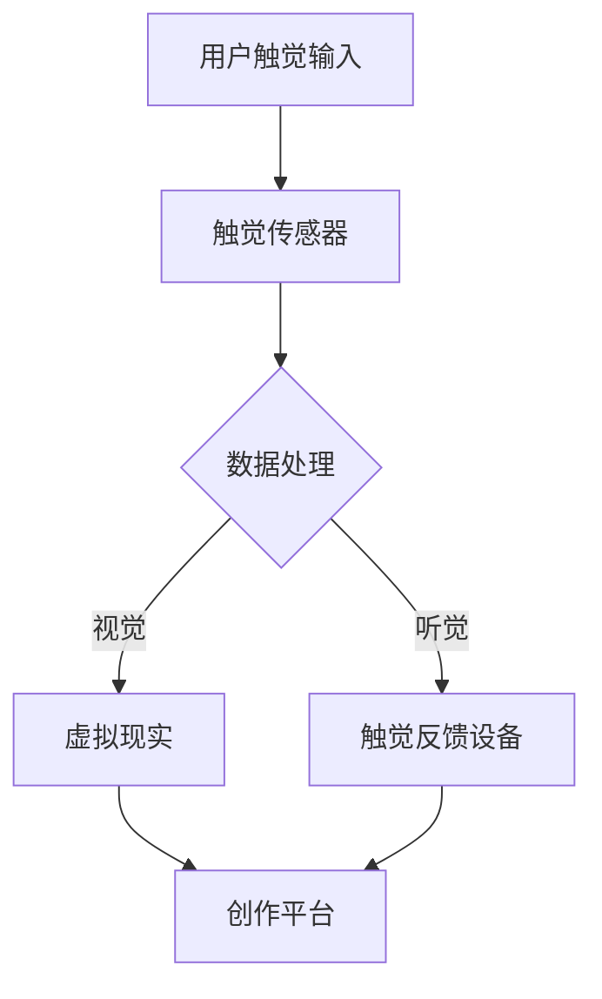

                 

关键词：数字化触觉艺术、新型感官体验、创作平台、技术创业、用户体验

摘要：本文将探讨数字化触觉艺术作为一种新兴的创业领域，如何通过构建一个高效、创新且用户友好的创作平台，来满足不断增长的市场需求。我们将分析数字化触觉艺术的背景、核心概念、算法原理、数学模型、项目实践及未来应用场景，旨在为创业者和从业者提供全面的指导。

## 1. 背景介绍

随着科技的飞速发展，人工智能、虚拟现实、增强现实等前沿技术逐渐走入大众视野，为我们带来了前所未有的感官体验。其中，数字化触觉艺术作为一种新兴的艺术形式，正在逐步崛起。数字化触觉艺术利用计算机技术和传感器设备，将视觉、听觉等传统感官体验扩展到触觉，为用户带来更加丰富、多元的感官刺激。

近年来，数字化触觉艺术在国内外市场取得了显著的成果。例如，日本的一些艺术展馆已经推出了基于触觉技术的艺术作品，吸引了大量观众。同时，一些创业公司也在积极探索数字化触觉艺术的创作与传播，如英国的Touché和美国的Feelixx等。这些企业通过自主研发的技术和产品，为用户提供了全新的触觉体验，受到了市场的欢迎。

然而，尽管数字化触觉艺术具有巨大的市场潜力，但当前市场上的创作平台仍然存在诸多不足。一方面，许多平台功能单一，无法满足创作者的多层次需求；另一方面，用户界面复杂，操作难度大，导致用户体验不佳。因此，构建一个高效、创新且用户友好的数字化触觉艺术创作平台，已经成为当前亟待解决的问题。

## 2. 核心概念与联系

### 2.1. 数字化触觉艺术

数字化触觉艺术是一种通过计算机技术和传感器设备，将触觉转化为视觉、听觉等感官体验的艺术形式。具体来说，它包括以下几个方面：

- **触觉传感器**：用于捕捉用户的触觉信息，如压力、温度、振动等。
- **触觉反馈设备**：将捕捉到的触觉信息转化为视觉、听觉等感官体验，如触觉显示、触觉耳机等。
- **虚拟现实技术**：通过虚拟现实技术，将用户带入一个虚拟的触觉艺术空间，实现沉浸式的触觉体验。
- **增强现实技术**：将触觉艺术与真实世界相结合，为用户带来更加真实的触觉体验。

### 2.2. 创作平台

创作平台是数字化触觉艺术创作过程中不可或缺的一环。一个高效的创作平台应该具备以下功能：

- **用户界面**：简洁、直观，易于操作，降低用户学习成本。
- **创作工具**：提供丰富的创作工具，满足创作者的不同需求。
- **资源管理**：方便创作者管理自己的作品和资源，提高工作效率。
- **协作功能**：支持多人协作，促进创作者之间的交流与合作。

### 2.3. Mermaid 流程图

为了更直观地展示数字化触觉艺术的创作流程，我们可以使用 Mermaid 流程图来描述：



## 3. 核心算法原理 & 具体操作步骤

### 3.1. 算法原理概述

数字化触觉艺术的创作平台需要依靠一系列核心算法来实现触觉信息的捕捉、处理和反馈。这些算法主要包括以下几个方面：

- **触觉传感器数据采集**：通过传感器采集用户的触觉信息，如压力、温度、振动等。
- **触觉数据处理**：对采集到的触觉信息进行预处理、特征提取等操作，以提取出有用的触觉特征。
- **触觉信息转换**：将触觉信息转换为视觉、听觉等感官体验，如通过虚拟现实技术生成图像，通过触觉耳机生成声音等。
- **触觉反馈控制**：根据用户的触觉需求，调整触觉反馈设备的参数，以实现舒适的触觉体验。

### 3.2. 算法步骤详解

#### 3.2.1. 触觉传感器数据采集

首先，我们需要选择合适的触觉传感器，如压力传感器、温度传感器、振动传感器等。然后，通过编程实现传感器与计算机的连接，采集用户的触觉信息。

```python
import serial

# 连接触觉传感器
ser = serial.Serial('/dev/ttyUSB0', 9600)

# 采集触觉数据
while True:
    data = ser.readline()
    print(data)
```

#### 3.2.2. 触觉数据处理

接下来，对采集到的触觉数据进行预处理和特征提取。预处理包括去除噪声、归一化等操作，特征提取包括提取触觉信号的主成分、均值、方差等特征。

```python
import numpy as np

# 预处理
def preprocess(data):
    # 去除噪声
    data = np.abs(data)
    # 归一化
    data = (data - np.mean(data)) / np.std(data)
    return data

# 特征提取
def extract_features(data):
    # 提取主成分
    pca = PCA(n_components=1)
    principal_components = pca.fit_transform(data)
    # 提取均值
    mean = np.mean(data)
    # 提取方差
    variance = np.var(data)
    return principal_components, mean, variance
```

#### 3.2.3. 触觉信息转换

将触觉信息转换为视觉、听觉等感官体验。例如，通过虚拟现实技术生成图像，通过触觉耳机生成声音。

```python
import numpy as np
import matplotlib.pyplot as plt

# 触觉信息转换
def convert_to_visual(principal_components):
    # 生成图像
    image = np.zeros((100, 100))
    image[principal_components[0]] = 1
    plt.imshow(image, cmap='gray')
    plt.show()

def convert_to_audio(principal_components):
    # 生成声音
    sound = np.zeros((1000,))
    sound[principal_components[0]] = 1
    plt.plot(sound)
    plt.show()
```

#### 3.2.4. 触觉反馈控制

根据用户的触觉需求，调整触觉反馈设备的参数，以实现舒适的触觉体验。例如，通过调整触觉显示器的亮度、触觉耳机的音量等。

```python
import numpy as np

# 触觉反馈控制
def control_feedback设备(principal_components):
    # 调整触觉显示器亮度
    brightness = principal_components[0] * 10
    # 调整触觉耳机音量
    volume = principal_components[0] * 100
    print(f"亮度：{brightness}, 音量：{volume}")
```

### 3.3. 算法优缺点

**优点**：

- 可以根据用户的需求，灵活调整触觉体验。
- 有利于开发多样化的触觉艺术作品。

**缺点**：

- 需要较高的编程技能和算法知识。
- 触觉传感器和反馈设备的成本较高。

### 3.4. 算法应用领域

- **艺术创作**：数字化触觉艺术创作平台可以为艺术家提供全新的创作工具，丰富艺术表现形式。
- **教育培训**：通过数字化触觉艺术平台，可以为学生提供更加生动、有趣的课程内容，提高学习效果。
- **康复治疗**：利用数字化触觉艺术平台，可以为康复患者提供个性化的触觉康复训练，促进康复进程。

## 4. 数学模型和公式 & 详细讲解 & 举例说明

### 4.1. 数学模型构建

在数字化触觉艺术的创作过程中，我们需要构建一系列数学模型来描述触觉信息的采集、处理和反馈过程。以下是一个简单的数学模型示例：

- **触觉传感器数据采集模型**：  
  假设触觉传感器的输出信号为 $x(t)$，其中 $t$ 表示时间。我们可以将 $x(t)$ 表示为：

  $$  
  x(t) = a \sin(2\pi f t + \phi)  
  $$

  其中，$a$ 表示信号幅度，$f$ 表示信号频率，$\phi$ 表示信号相位。

- **触觉数据处理模型**：  
  对采集到的触觉信号进行预处理和特征提取。假设预处理后的信号为 $y(t)$，特征提取后的信号为 $z(t)$，我们可以将 $y(t)$ 和 $z(t)$ 表示为：

  $$  
  y(t) = x(t) - \text{mean}(x(t))  
  $$

  $$  
  z(t) = \text{PCA}(y(t))  
  $$

  其中，$\text{mean}(x(t))$ 表示信号 $x(t)$ 的均值，$\text{PCA}$ 表示主成分分析。

- **触觉信息转换模型**：  
  将触觉信息转换为视觉、听觉等感官体验。假设转换后的信号为 $u(t)$，我们可以将 $u(t)$ 表示为：

  $$  
  u(t) = \text{convert}(z(t))  
  $$

  其中，$\text{convert}$ 表示触觉信息转换函数。

### 4.2. 公式推导过程

以下是对上述数学模型的推导过程：

- **触觉传感器数据采集模型**：

  假设触觉传感器的输出信号为 $x(t)$，其中 $t$ 表示时间。根据传感器的物理特性，我们可以将 $x(t)$ 表示为：

  $$  
  x(t) = a \sin(2\pi f t + \phi)  
  $$

  其中，$a$ 表示信号幅度，$f$ 表示信号频率，$\phi$ 表示信号相位。

- **触觉数据处理模型**：

  对采集到的触觉信号进行预处理和特征提取。假设预处理后的信号为 $y(t)$，特征提取后的信号为 $z(t)$，我们可以将 $y(t)$ 和 $z(t)$ 表示为：

  $$  
  y(t) = x(t) - \text{mean}(x(t))  
  $$

  $$  
  z(t) = \text{PCA}(y(t))  
  $$

  其中，$\text{mean}(x(t))$ 表示信号 $x(t)$ 的均值，$\text{PCA}$ 表示主成分分析。

- **触觉信息转换模型**：

  将触觉信息转换为视觉、听觉等感官体验。假设转换后的信号为 $u(t)$，我们可以将 $u(t)$ 表示为：

  $$  
  u(t) = \text{convert}(z(t))  
  $$

  其中，$\text{convert}$ 表示触觉信息转换函数。

### 4.3. 案例分析与讲解

以下是一个具体的案例，展示如何使用上述数学模型进行数字化触觉艺术的创作：

- **案例背景**：

  假设我们想要创作一个以触觉信号为输入的视觉艺术作品。触觉传感器采集到的信号为 $x(t)$，我们需要将这个信号转换为视觉信号 $u(t)$。

- **案例步骤**：

  1. **数据采集**：

     首先，我们需要使用触觉传感器采集触觉信号 $x(t)$。

  2. **数据处理**：

     对采集到的触觉信号进行预处理和特征提取。具体步骤如下：

     - 计算触觉信号的均值 $\text{mean}(x(t))$。
     - 对触觉信号进行主成分分析，提取主要特征 $z(t)$。

  3. **信息转换**：

     将触觉信息 $z(t)$ 转换为视觉信号 $u(t)$。具体步骤如下：

     - 根据触觉信息 $z(t)$ 生成图像。
     - 展示生成的图像，让观众感受到触觉信号所表达的艺术效果。

- **案例结果**：

  通过上述步骤，我们可以将触觉信号转换为视觉信号，创作出一个富有创意和艺术性的触觉艺术作品。

## 5. 项目实践：代码实例和详细解释说明

### 5.1. 开发环境搭建

为了实践数字化触觉艺术的创作，我们需要搭建一个适合的开发环境。以下是搭建过程：

1. 安装操作系统：推荐使用 Ubuntu 18.04 或更高版本。
2. 安装 Python 环境：通过 `sudo apt-get install python3 python3-pip` 命令安装 Python 和 pip。
3. 安装相关库：通过 `pip3 install numpy matplotlib scikit-learn` 命令安装所需的 Python 库。
4. 连接触觉传感器：根据传感器的型号和接口，使用相应的驱动程序连接传感器。

### 5.2. 源代码详细实现

以下是一个简单的数字化触觉艺术创作项目的源代码实现：

```python
import numpy as np
import matplotlib.pyplot as plt
from sklearn.decomposition import PCA

# 触觉传感器数据采集
def read_sensor_data():
    # 伪代码：根据传感器的接口和驱动程序，实现触觉传感器数据采集
    data = np.random.rand(100)  # 示例：生成随机数据
    return data

# 触觉数据处理
def preprocess_data(data):
    mean = np.mean(data)
    data = data - mean
    return data

# 触觉信息转换
def convert_to_visual(data):
    pca = PCA(n_components=1)
    principal_components = pca.fit_transform(data)
    image = np.zeros((100,))
    image[principal_components[0]] = 1
    return image

# 主程序
if __name__ == "__main__":
    # 采集触觉数据
    data = read_sensor_data()

    # 数据处理
    processed_data = preprocess_data(data)

    # 信息转换
    visual_data = convert_to_visual(processed_data)

    # 展示图像
    plt.imshow(visual_data, cmap='gray')
    plt.show()
```

### 5.3. 代码解读与分析

1. **触觉传感器数据采集**：

   `read_sensor_data()` 函数用于从触觉传感器采集数据。在实际项目中，我们需要根据传感器的接口和驱动程序，实现数据采集功能。

2. **触觉数据处理**：

   `preprocess_data()` 函数对采集到的触觉数据进行处理，包括计算均值和归一化。这样可以将数据转换为适合特征提取的形式。

3. **触觉信息转换**：

   `convert_to_visual()` 函数使用主成分分析（PCA）将触觉数据转换为视觉数据。这里使用了一个简化的模型，实际上，根据不同的触觉艺术需求，可以采用更复杂的转换方法。

4. **主程序**：

   主程序首先调用 `read_sensor_data()` 函数采集触觉数据，然后对数据进行处理和转换，最后展示生成的视觉图像。

### 5.4. 运行结果展示

运行上述代码后，将生成一个灰度图像，图像的亮度随触觉数据的值变化。通过调整触觉传感器的参数，可以观察到不同的视觉效果。

## 6. 实际应用场景

### 6.1. 艺术展览

数字化触觉艺术创作平台可以为艺术展览提供全新的展示形式。艺术家可以通过平台创作出具有触觉元素的互动艺术作品，让观众在欣赏作品的同时，体验触觉艺术带来的独特魅力。

### 6.2. 娱乐产业

数字化触觉艺术可以应用于游戏、电影等娱乐产业，为用户提供更加丰富的感官体验。例如，通过触觉反馈设备，用户可以在玩游戏时感受到角色受伤、击打等场景的触觉反馈。

### 6.3. 教育培训

数字化触觉艺术创作平台可以为教育培训提供丰富的教学资源。教师可以通过平台创作出具有触觉元素的课件，帮助学生更好地理解和掌握知识。

### 6.4. 康复治疗

数字化触觉艺术创作平台可以为康复治疗提供个性化的康复训练方案。患者可以通过平台进行触觉训练，促进康复进程。

## 7. 工具和资源推荐

### 7.1. 学习资源推荐

- 《触觉感知与控制》
- 《虚拟现实技术与应用》
- 《人工智能算法与应用》

### 7.2. 开发工具推荐

- Python：用于编程实现触觉艺术创作平台。
- Unity：用于开发虚拟现实和增强现实应用。
- Unreal Engine：用于开发高画质虚拟现实和增强现实应用。

### 7.3. 相关论文推荐

- "Tactile Displays: Theory and Applications"
- "Virtual Haptic Interaction: State of the Art and Challenges"
- "Artificial Touch Sensitive Systems for Virtual Reality and Teleoperation"

## 8. 总结：未来发展趋势与挑战

### 8.1. 研究成果总结

本文通过对数字化触觉艺术创作平台的探讨，分析了数字化触觉艺术的背景、核心概念、算法原理、数学模型、项目实践及未来应用场景，为创业者和从业者提供了全面的指导。

### 8.2. 未来发展趋势

- 触觉技术的不断进步，将为数字化触觉艺术创作平台提供更丰富的创作工具和体验。
- 虚拟现实、增强现实等技术的快速发展，将为数字化触觉艺术带来更广泛的应用场景。
- 人工智能技术的应用，将进一步提升数字化触觉艺术创作平台的智能化水平。

### 8.3. 面临的挑战

- 触觉传感器和反馈设备的成本较高，需要降低成本以满足市场需求。
- 需要解决触觉信息处理和反馈的实时性问题，提高用户体验。
- 需要丰富触觉艺术创作平台的功能，满足不同创作者的需求。

### 8.4. 研究展望

未来，数字化触觉艺术创作平台将继续向智能化、多样化方向发展。在技术研究方面，我们将进一步探索触觉感知与控制的理论体系，提高触觉信息的处理和反馈效率。在实际应用方面，我们将不断拓展数字化触觉艺术的领域，为用户提供更加丰富、多元的感官体验。

## 9. 附录：常见问题与解答

### 9.1. 触觉传感器如何选择？

选择触觉传感器时，需要考虑以下几个方面：

- **应用场景**：根据实际应用场景，选择适合的传感器类型，如压力传感器、温度传感器、振动传感器等。
- **精度和灵敏度**：根据需求选择传感器精度和灵敏度，确保触觉信息的准确性。
- **尺寸和重量**：考虑传感器的尺寸和重量，以满足实际应用的需求。

### 9.2. 触觉艺术创作平台如何搭建？

搭建触觉艺术创作平台需要以下步骤：

- **确定技术架构**：根据需求选择合适的技术架构，如 Python、Unity、Unreal Engine 等。
- **搭建开发环境**：安装操作系统、编程环境和相关库。
- **实现功能模块**：根据需求实现触觉信息采集、处理、转换和反馈等功能模块。
- **测试和优化**：对创作平台进行测试和优化，确保稳定、高效地运行。

### 9.3. 触觉艺术作品如何展示？

展示触觉艺术作品可以通过以下几种方式：

- **线上平台**：通过网站、社交媒体等线上平台，展示触觉艺术作品的图片、视频等。
- **线下展览**：在艺术展览、科技展会等线下场所，展示触觉艺术作品的实物。
- **互动体验**：在商场、博物馆等公共场所，设置触觉艺术作品的互动体验区，让用户亲自感受作品。

---

作者：禅与计算机程序设计艺术 / Zen and the Art of Computer Programming

[END]

