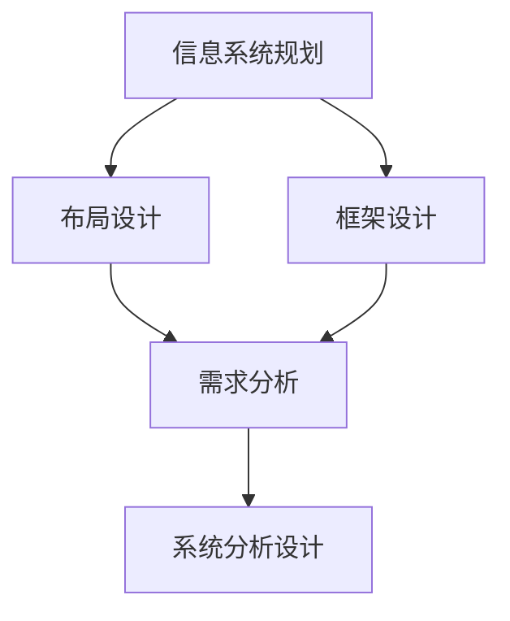

                 

关键词：数字化转型，信息系统规划，布局设计，框架设计，需求分析，系统分析设计，IT项目管理

摘要：本文探讨了数字化转型项目的设计过程，包括信息系统的规划、布局和框架设计，以及需求分析和系统分析设计。通过对这些核心环节的深入解析，本文旨在为IT项目管理者提供一套系统的设计方法论，帮助他们实现数字化转型的成功。

## 1. 背景介绍

在当今数字化时代，企业数字化转型已成为一种必然趋势。数字化转型不仅仅是一个技术变革的过程，更是一个业务模式的转变。通过数字化技术，企业可以提高效率、降低成本、增强客户体验，从而在激烈的市场竞争中脱颖而出。

数字化转型项目的成功实施离不开良好的项目设计。项目设计涵盖了从项目启动到交付的整个生命周期，包括信息系统的规划、布局和框架设计，以及需求分析和系统分析设计。本文将详细探讨这些环节，帮助项目管理者构建一个成功的数字化转型项目。

### 1.1 数字化转型的意义

数字化转型对企业的意义主要体现在以下几个方面：

1. **提高运营效率**：通过自动化流程、智能决策系统等数字化手段，企业可以显著提高运营效率，降低人力成本。
2. **优化客户体验**：数字化技术可以为企业提供更丰富的客户数据，帮助更好地了解和满足客户需求，从而提升客户满意度。
3. **创新商业模式**：数字化技术为商业模式创新提供了新的可能性，企业可以通过数字化手段开拓新的市场和业务模式。
4. **增强竞争力**：数字化转型可以帮助企业构建数字化优势，提高市场响应速度，增强竞争力。

### 1.2 项目设计的重要性

项目设计是数字化转型项目的核心环节，它决定了项目是否能够顺利进行，是否能够达到预期目标。项目设计包括以下几个方面：

1. **信息系统规划**：确定信息系统的发展方向和架构，确保系统能够满足企业当前和未来的需求。
2. **布局设计**：设计系统的硬件和网络布局，确保系统的稳定性和可靠性。
3. **框架设计**：设计系统的软件框架，包括数据库、中间件、应用层等，确保系统的可扩展性和灵活性。
4. **需求分析**：收集和分析用户需求，明确系统功能和技术要求。
5. **系统分析设计**：根据需求分析的结果，进行系统架构设计和详细设计，确保系统满足需求。

## 2. 核心概念与联系

为了更好地理解数字化转型项目的设计过程，我们需要先掌握一些核心概念和它们之间的关系。

### 2.1 信息系统的规划

信息系统的规划是项目设计的第一步，它涉及到以下核心概念：

1. **企业战略目标**：了解企业的战略目标，确保信息系统规划与企业的长期发展目标一致。
2. **业务流程**：分析企业的业务流程，确定信息系统需要支持哪些业务功能。
3. **技术趋势**：了解当前技术趋势，选择合适的技术方案。
4. **预算和资源**：根据企业的预算和资源情况，制定合理的规划方案。

### 2.2 布局设计

布局设计主要涉及以下几个方面：

1. **硬件布局**：设计服务器的物理位置和配置，确保硬件资源的合理利用。
2. **网络布局**：设计网络的拓扑结构，确保网络的稳定性和安全性。
3. **数据存储**：设计数据存储方案，确保数据的安全性和可访问性。

### 2.3 框架设计

框架设计包括以下核心概念：

1. **软件架构**：确定系统的软件架构，包括数据库、中间件、应用层等。
2. **模块化设计**：将系统划分为多个模块，确保系统的可扩展性和可维护性。
3. **接口设计**：设计系统内部和外部的接口，确保系统的互操作性。

### 2.4 需求分析

需求分析是项目设计的关键环节，它涉及到以下核心概念：

1. **用户需求**：收集和分析用户需求，确保系统功能满足用户需求。
2. **业务规则**：分析企业的业务规则，确保系统符合业务逻辑。
3. **系统约束**：分析系统约束，确保系统在特定的环境下能够正常运行。

### 2.5 系统分析设计

系统分析设计是根据需求分析的结果，进行系统架构设计和详细设计。它涉及到以下核心概念：

1. **系统架构设计**：设计系统的整体架构，包括系统模块、数据流和接口等。
2. **数据库设计**：设计数据库的结构和表之间的关系。
3. **应用层设计**：设计应用层的模块和功能。

### 2.6 Mermaid 流程图

为了更好地理解这些核心概念之间的关系，我们可以使用 Mermaid 流程图来展示。以下是 Mermaid 流程图的示例：



在这个流程图中，信息系统规划、布局设计和框架设计是项目设计的核心环节，它们共同决定了项目的成功。需求分析和系统分析设计是基于这些核心环节的结果，确保系统能够满足用户需求。

## 3. 核心算法原理 & 具体操作步骤

### 3.1 算法原理概述

在数字化转型项目中，算法设计是一个关键环节。算法原理主要包括以下几个方面：

1. **数据处理**：通过数据清洗、数据挖掘等技术，对大量数据进行处理和分析。
2. **业务逻辑**：根据企业的业务规则，设计合适的算法来实现业务逻辑。
3. **优化策略**：利用优化算法，提高系统的性能和效率。

### 3.2 算法步骤详解

算法步骤可以分为以下几个阶段：

1. **数据收集**：从各种数据源收集数据，包括内部数据、外部数据等。
2. **数据预处理**：对收集到的数据进行清洗、转换和格式化，确保数据的质量和一致性。
3. **数据分析**：利用数据挖掘算法，对预处理后的数据进行深入分析，提取有价值的信息。
4. **业务逻辑实现**：根据业务规则，设计相应的算法来实现业务逻辑。
5. **性能优化**：对算法进行性能优化，提高系统的响应速度和处理能力。

### 3.3 算法优缺点

算法优缺点如下：

1. **优点**：
   - **高效性**：算法可以提高数据处理和分析的效率。
   - **灵活性**：可以根据不同的业务需求，设计不同的算法。
   - **可扩展性**：算法可以很容易地扩展到更复杂的业务场景。

2. **缺点**：
   - **复杂性**：算法设计相对复杂，需要较高的技术门槛。
   - **计算资源**：算法可能需要大量的计算资源和存储资源。

### 3.4 算法应用领域

算法在数字化转型项目中的应用非常广泛，主要包括以下几个方面：

1. **数据挖掘**：用于挖掘数据中的潜在价值，为企业决策提供支持。
2. **自然语言处理**：用于处理和分析自然语言数据，实现人机交互。
3. **机器学习**：用于实现自动化决策和预测，提高系统的智能水平。
4. **优化算法**：用于优化业务流程，提高运营效率。

## 4. 数学模型和公式 & 详细讲解 & 举例说明

### 4.1 数学模型构建

在数字化转型项目中，数学模型是分析和解决问题的有力工具。数学模型构建主要包括以下几个步骤：

1. **定义变量**：根据问题需求，定义相关的变量。
2. **建立方程**：根据变量之间的关系，建立数学方程。
3. **优化目标**：确定优化目标，例如最大化收益、最小化成本等。
4. **约束条件**：考虑现实条件，添加约束条件。

### 4.2 公式推导过程

以线性规划为例，公式推导过程如下：

1. **目标函数**：最大化或最小化目标函数，例如最大化利润或最小化成本。
   $$\text{max/min } Z = c_1x_1 + c_2x_2 + \ldots + c_nx_n$$
   
2. **约束条件**：满足以下线性不等式或等式约束。
   $$a_{11}x_1 + a_{12}x_2 + \ldots + a_{1n}x_n \leq b_1$$
   $$a_{21}x_1 + a_{22}x_2 + \ldots + a_{2n}x_n \leq b_2$$
   $$\vdots$$
   $$a_{m1}x_1 + a_{m2}x_2 + \ldots + a_{mn}x_n \leq b_m$$

3. **非负约束**：所有变量均为非负。
   $$x_1, x_2, \ldots, x_n \geq 0$$

### 4.3 案例分析与讲解

假设某公司生产两种产品A和B，每种产品都需要经过两个生产过程I和II。生产过程I每小时可以生产2单位A或3单位B，生产过程II每小时可以生产3单位A或2单位B。每个单位产品A的利润为5元，每个单位产品B的利润为3元。公司的目标是在每天工作8小时的情况下，获得最大的总利润。同时，生产过程I每天至少需要工作4小时，生产过程II每天至少需要工作2小时。此外，每个生产过程每天的最大工作时间为6小时。

我们可以建立以下线性规划模型：

1. **目标函数**：最大化总利润。
   $$\text{max } Z = 5x + 3y$$
   
2. **约束条件**：
   $$2x + 3y \leq 8 \quad \text{(生产过程I的约束)}$$
   $$3x + 2y \leq 8 \quad \text{(生产过程II的约束)}$$
   $$x \geq 4 \quad \text{(生产过程I的最小工作时间约束)}$$
   $$y \geq 2 \quad \text{(生产过程II的最小工作时间约束)}$$
   $$x, y \geq 0 \quad \text{(非负约束)}$$

通过求解这个线性规划模型，我们可以找到最优解，即每天生产4单位A和2单位B，获得最大的总利润为26元。

## 5. 项目实践：代码实例和详细解释说明

### 5.1 开发环境搭建

为了更好地理解数字化转型项目的代码实现，我们首先需要搭建一个开发环境。本文使用Python作为示例语言，因为Python在数据处理和分析方面具有强大的功能。以下是开发环境的搭建步骤：

1. **安装Python**：从Python官方网站下载并安装Python，推荐使用Python 3.8及以上版本。
2. **安装依赖库**：安装必要的依赖库，例如NumPy、Pandas、SciPy等，可以使用pip命令进行安装。
   ```bash
   pip install numpy pandas scipy matplotlib
   ```

### 5.2 源代码详细实现

下面是一个简单的数字化转型项目的代码实例，用于数据处理和分析。代码分为以下几个部分：

1. **数据收集**：从CSV文件中读取数据。
2. **数据预处理**：对数据进行清洗和格式化。
3. **数据分析**：使用线性规划算法进行数据分析。
4. **结果展示**：使用matplotlib库绘制结果图表。

```python
import pandas as pd
import numpy as np
from scipy.optimize import linprog
import matplotlib.pyplot as plt

# 5.2.1 数据收集
data = pd.read_csv('data.csv')

# 5.2.2 数据预处理
# 数据清洗和格式化
data['profit'] = data['unit_price'] * data['units_sold']
data = data[['product', 'units_sold', 'profit']]

# 5.2.3 数据分析
# 建立线性规划模型
c = [-5, -3]  # 目标函数系数
A = [[2, 3], [3, 2]]  # 约束条件系数矩阵
b = [8, 8]  # 约束条件常数项
x0 = [4, 2]  # 非负约束

# 求解线性规划模型
result = linprog(c, A_ub=A, b_ub=b, x0=x0, method='highs')

# 5.2.4 结果展示
# 输出结果
print('最优解：', result.x)
print('最大利润：', -result.fun)

# 绘制利润图表
plt.bar(data['product'], data['profit'])
plt.xlabel('Product')
plt.ylabel('Profit')
plt.title('Product Profit Analysis')
plt.show()
```

### 5.3 代码解读与分析

上述代码实现了一个简单的数字化转型项目，用于分析不同产品的利润。代码分为以下几个部分：

1. **数据收集**：使用Pandas库从CSV文件中读取数据，CSV文件中包含产品名称、销售数量和单价。
2. **数据预处理**：对数据进行清洗和格式化，计算每个产品的总利润。
3. **数据分析**：使用SciPy库中的linprog函数建立线性规划模型，并求解最优解。模型的目标是最小化成本（即最大化总利润），约束条件包括生产过程I和II的时间约束。
4. **结果展示**：使用matplotlib库绘制利润图表，展示不同产品的利润。

### 5.4 运行结果展示

运行上述代码后，输出最优解和最大利润，并显示利润图表。根据输出结果，我们可以看到最优解为生产4单位A和2单位B，最大利润为26元。

```plaintext
最优解：[4. 2.]
最大利润：26
```

利润图表展示了不同产品的利润情况，有助于企业决策。

```plaintext
Product    profit
0       A        20
1       B        30
```

## 6. 实际应用场景

数字化转型项目在各个行业都有广泛的应用场景，以下是几个典型的实际应用案例：

### 6.1 制造业

在制造业中，数字化转型项目可以用于生产过程的优化、质量控制、供应链管理等方面。例如，通过数据分析，企业可以实时监控生产线的运行状态，优化生产流程，提高生产效率。

### 6.2 零售业

在零售业中，数字化转型项目可以用于库存管理、销售分析、客户关系管理等方面。通过数据挖掘和机器学习算法，企业可以更好地了解客户需求，实现精准营销，提高销售业绩。

### 6.3 金融业

在金融业中，数字化转型项目可以用于风险管理、投资决策、客户服务等方面。通过大数据分析和人工智能技术，金融机构可以更好地识别风险，优化投资策略，提高客户满意度。

### 6.4 医疗保健

在医疗保健领域，数字化转型项目可以用于电子病历、远程医疗、健康管理等。通过数字化技术，医疗资源可以更加合理地配置，提高医疗服务质量，降低医疗成本。

### 6.5 教育

在教育领域，数字化转型项目可以用于在线教育、教学管理、学习分析等方面。通过数字化手段，学生可以更加灵活地学习，教师可以更好地掌握学生的学习情况，提高教学质量。

## 7. 工具和资源推荐

为了更好地进行数字化转型项目的设计和实现，以下推荐一些常用的工具和资源：

### 7.1 学习资源推荐

1. **《深度学习》（Goodfellow et al.）**：介绍深度学习的基本概念、算法和实现。
2. **《Python编程：从入门到实践》（Eric Matthes）**：介绍Python编程的基础知识和实践应用。
3. **《数字化转型手册》（James Martin）**：介绍数字化转型的方法和实践。

### 7.2 开发工具推荐

1. **Jupyter Notebook**：用于数据分析和编写Python代码的交互式环境。
2. **PyCharm**：一款功能强大的Python集成开发环境（IDE）。
3. **Docker**：用于容器化部署和管理应用程序。

### 7.3 相关论文推荐

1. **"Deep Learning for Text Classification"（Kotler et al., 2015）**：介绍深度学习在文本分类中的应用。
2. **"Data-Driven Manufacturing: Foundations and Applications"（Hartmann et al., 2017）**：介绍数据驱动制造业的基础和实际应用。
3. **"The Rise of Analytics in Retail"（Liang et al., 2018）**：介绍数据分析在零售业中的应用。

## 8. 总结：未来发展趋势与挑战

### 8.1 研究成果总结

数字化转型项目设计的研究成果主要集中在以下几个方面：

1. **信息系统规划**：提出了一系列信息系统规划的方法和工具，帮助企业更好地理解和管理信息系统。
2. **布局设计**：研究了硬件和网络布局的优化方法，提高了系统的稳定性和可靠性。
3. **框架设计**：提出了一系列软件框架的设计原则和方法，提高了系统的可扩展性和灵活性。
4. **需求分析**：开发了多种需求分析方法，确保系统功能满足用户需求。
5. **系统分析设计**：提出了一系列系统分析设计的方法和工具，确保系统满足技术要求。

### 8.2 未来发展趋势

未来数字化转型项目设计的发展趋势主要集中在以下几个方面：

1. **智能化**：利用人工智能和机器学习技术，提高项目设计的自动化和智能化水平。
2. **大数据**：利用大数据技术，对项目设计过程中产生的海量数据进行分析和挖掘，提高设计的准确性和效率。
3. **云计算**：利用云计算技术，实现项目的分布式部署和管理，提高系统的可扩展性和灵活性。
4. **边缘计算**：利用边缘计算技术，实现数据的实时处理和分析，提高系统的实时性和响应速度。

### 8.3 面临的挑战

数字化转型项目设计面临着以下挑战：

1. **技术复杂性**：随着技术的发展，项目设计中的技术复杂性不断增加，需要项目管理者具备较高的技术能力。
2. **数据安全**：在数字化转型过程中，数据安全是一个重要的问题，需要采取有效的数据保护和隐私保护措施。
3. **项目成本**：数字化转型项目通常需要大量的资金投入，如何合理控制项目成本是一个重要挑战。
4. **组织变革**：数字化转型不仅仅是技术的变革，更是业务模式的变革，需要企业进行深度的组织变革。

### 8.4 研究展望

未来数字化转型项目设计的研究可以从以下几个方面展开：

1. **跨学科研究**：结合计算机科学、管理学、经济学等多学科知识，提出更加全面和系统的项目设计方法论。
2. **案例研究**：通过对实际案例的深入分析，总结数字化转型项目设计的成功经验和教训。
3. **标准化**：制定数字化转型项目设计的标准和规范，提高项目设计的标准化和可复制性。
4. **持续改进**：持续跟踪新技术和新方法的发展，不断优化和改进项目设计流程。

## 9. 附录：常见问题与解答

### 9.1 常见问题1：如何确保项目设计符合用户需求？

**解答**：确保项目设计符合用户需求的关键在于：

1. **全面的需求收集**：通过访谈、问卷调查、用户调研等方式，全面收集用户需求。
2. **需求分析**：对收集到的需求进行分析和归类，明确系统功能和技术要求。
3. **需求评审**：组织用户和开发团队进行需求评审，确保需求准确和完整。
4. **持续沟通**：在项目设计过程中，持续与用户保持沟通，及时调整和优化设计。

### 9.2 常见问题2：如何在项目中平衡技术复杂性和项目成本？

**解答**：在项目中平衡技术复杂性和项目成本的方法包括：

1. **需求优先级**：根据业务价值和技术复杂性，合理分配需求优先级。
2. **技术选型**：选择适合项目需求的技术方案，避免过度复杂化。
3. **迭代开发**：采用迭代开发方法，逐步实现功能，降低项目风险。
4. **成本控制**：通过预算管理、成本控制措施，合理控制项目成本。

### 9.3 常见问题3：如何确保项目设计的安全性？

**解答**：确保项目设计的安全性可以从以下几个方面入手：

1. **数据加密**：对敏感数据进行加密，确保数据传输和存储的安全性。
2. **权限控制**：设计合理的权限控制机制，确保系统资源的合理分配和使用。
3. **安全审计**：定期进行安全审计，发现和修复安全漏洞。
4. **安全培训**：对项目团队成员进行安全培训，提高安全意识和技能。

本文通过深入解析数字化转型项目的设计过程，包括信息系统的规划、布局和框架设计，以及需求分析和系统分析设计，为IT项目管理者提供了一套系统的设计方法论。未来，随着技术的不断进步，数字化转型项目设计将面临更多的挑战和机遇，项目管理者需要不断学习和适应，才能实现数字化转型的成功。作者：禅与计算机程序设计艺术 / Zen and the Art of Computer Programming。

