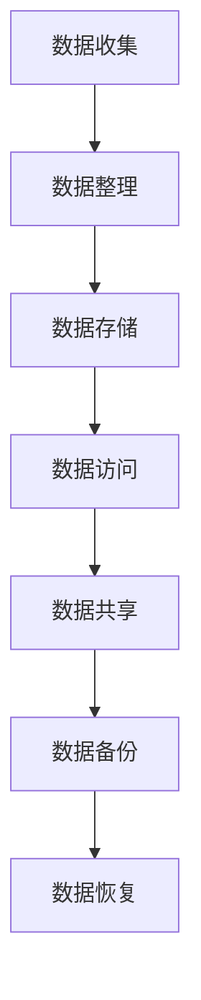

                 

关键词：数字化遗产、档案管理、个人数据、数字保存、创业实践

> 摘要：本文将探讨数字化遗产档案创业的重要性，分析个人生平数字化保存的核心概念与联系，阐述核心算法原理及操作步骤，并借助数学模型和公式进行详细讲解。此外，还将分享实际项目实践中的代码实例，探讨数字化遗产档案在不同应用场景中的实际应用，最后对未来的发展趋势与挑战进行展望。

## 1. 背景介绍

在数字化的时代，个人的信息数据已经成为我们生活中不可或缺的一部分。无论是社交媒体的动态、电子邮件的往来，还是日常生活的记录，都在不断积累。然而，这些宝贵的数字信息如何得到有效的管理和保存，以确保在个人生命结束后依然能够被继承和利用，成为了一个值得深思的问题。数字化遗产档案创业，正是在这样的背景下产生的。

数字化遗产档案创业的初衷，是将个人的生平经历、重要文件、照片、视频等数字化信息进行系统化的管理，构建一个持久、可靠、易于访问的数字档案。通过这样的创业实践，不仅能够实现个人数据的长期保存，还能够为后人提供宝贵的遗产信息。

### 1.1 数字化遗产档案的重要性

数字化遗产档案的重要性体现在以下几个方面：

1. **信息保存**：数字化遗产档案可以确保个人信息的持久保存，避免因物理损坏、丢失等原因造成的数据丢失。
2. **信息共享**：通过数字化档案，个人数据可以被方便地分享给亲友、后代，使得信息得以传承。
3. **数据分析**：数字化档案的数据可以被用于数据分析，为个人研究、市场调研等提供有价值的信息。
4. **文化传承**：数字化遗产档案有助于文化的传承，使得个人生平故事、家族历史等得以永久保存。

### 1.2 数字化遗产档案创业的挑战

尽管数字化遗产档案创业具有重要意义，但在这个过程中也面临诸多挑战：

1. **数据隐私**：个人数据的安全和隐私保护是数字化遗产档案创业的首要挑战。
2. **数据完整性**：如何确保个人数据的完整性、准确性和一致性，是一个技术难题。
3. **技术门槛**：构建一个可靠、高效的数字化遗产档案系统需要较高的技术水平和专业团队。
4. **用户接受度**：如何让大众接受并积极参与数字化遗产档案的创建和保存，需要深入研究和推广。

## 2. 核心概念与联系

在探讨数字化遗产档案创业之前，我们需要了解几个核心概念，以及它们之间的联系。

### 2.1 个人数据

个人数据是指与个人身份、生活、工作等相关的一系列信息。包括但不限于：

- 身份信息：姓名、出生日期、身份证号码等。
- 生活记录：照片、日记、通讯记录等。
- 工作经历：职位、业绩、项目经历等。
- 健康信息：体检记录、病史等。

### 2.2 数字化档案

数字化档案是将个人数据通过数字化技术进行整理、存储和管理的系统。它通常包括以下几个部分：

- 数据收集：通过各种渠道收集个人数据，如社交媒体、电子邮件、云存储等。
- 数据整理：对收集到的数据进行分类、整理和清洗，确保数据的完整性和准确性。
- 数据存储：将整理好的数据存储在安全可靠的数据库中，确保数据的持久保存。
- 数据访问：提供便捷的访问接口，使得用户可以随时随地查阅自己的数字化档案。

### 2.3 数字化遗产档案系统

数字化遗产档案系统是专门为管理个人数字化遗产档案而设计的系统。它具有以下几个特点：

- 安全性：采用多重加密技术，确保个人数据的安全和隐私。
- 持久性：采用分布式存储技术，确保数据不会因单点故障而丢失。
- 易用性：提供友好的用户界面，使得用户可以方便地创建、管理、共享数字化档案。
- 扩展性：支持多种数据类型和格式，能够适应不同的个人数据需求。

### 2.4 Mermaid 流程图

以下是一个简化的数字化遗产档案创建和管理流程的 Mermaid 流程图：



## 3. 核心算法原理 & 具体操作步骤

### 3.1 算法原理概述

在数字化遗产档案创业中，核心算法主要涉及数据的收集、整理、存储和共享。以下将分别介绍各个步骤的算法原理。

#### 3.1.1 数据收集

数据收集的算法主要依赖于数据爬取技术。通过爬取社交媒体、电子邮件、云存储等渠道，将个人数据自动化地收集到系统中。

#### 3.1.2 数据整理

数据整理的算法主要涉及数据的分类、去重、清洗等操作。通过对数据进行处理，确保数据的完整性和准确性。

#### 3.1.3 数据存储

数据存储的算法主要涉及分布式存储技术，如分布式文件系统、NoSQL 数据库等。通过分布式存储，确保数据的高可靠性和持久性。

#### 3.1.4 数据访问

数据访问的算法主要涉及数据加密、访问控制等技术。通过这些技术，确保数据在访问过程中的安全性和隐私性。

#### 3.1.5 数据共享

数据共享的算法主要涉及数据同步、数据版本控制等技术。通过这些技术，确保数据在不同用户之间的共享和更新。

### 3.2 算法步骤详解

#### 3.2.1 数据收集

1. **定义数据源**：确定需要收集的数据类型和数据源，如社交媒体、电子邮件、云存储等。
2. **数据爬取**：使用爬虫技术，自动化地收集数据。
3. **数据预处理**：对收集到的数据进行清洗、去重等处理。

#### 3.2.2 数据整理

1. **数据分类**：根据数据类型，将数据分为不同类别。
2. **去重**：删除重复数据，确保数据的唯一性。
3. **数据清洗**：修正数据中的错误和缺失值。

#### 3.2.3 数据存储

1. **分布式存储**：将数据存储在分布式文件系统或NoSQL数据库中。
2. **数据加密**：对存储的数据进行加密处理，确保数据的安全性和隐私性。
3. **备份和恢复**：定期进行数据备份，并设置数据恢复机制。

#### 3.2.4 数据访问

1. **访问控制**：设置访问权限，确保数据在访问过程中的安全性和隐私性。
2. **数据加密传输**：使用加密协议进行数据传输，确保数据在传输过程中的安全性。
3. **数据版本控制**：实现数据版本控制，确保数据在共享和更新过程中的准确性和一致性。

#### 3.2.5 数据共享

1. **数据同步**：实现数据的实时同步，确保不同用户之间的数据一致性。
2. **数据版本控制**：实现数据版本控制，确保数据在共享和更新过程中的准确性和一致性。
3. **权限管理**：设置权限管理机制，确保数据在共享过程中的安全性和隐私性。

### 3.3 算法优缺点

#### 3.3.1 优点

- **高效性**：自动化数据收集和处理，提高工作效率。
- **安全性**：采用加密和访问控制技术，确保数据的安全性和隐私性。
- **灵活性**：支持多种数据类型和格式，适应不同用户的需求。

#### 3.3.2 缺点

- **数据隐私**：在数据收集和处理过程中，可能面临数据隐私和安全问题。
- **技术门槛**：构建一个高效、可靠的数字化遗产档案系统需要较高的技术水平和专业团队。
- **用户接受度**：用户可能对数字化遗产档案的概念和功能不太了解，需要加强推广和教育。

### 3.4 算法应用领域

数字化遗产档案算法主要应用于以下领域：

- **个人数据管理**：帮助个人建立和管理数字化遗产档案。
- **家庭历史研究**：为家族历史研究提供有价值的数据支持。
- **市场营销**：为企业提供用户行为分析数据，助力市场决策。
- **文化传承**：为文化传承提供数字化的记录和保存手段。

## 4. 数学模型和公式 & 详细讲解 & 举例说明

在数字化遗产档案创业中，数学模型和公式起着至关重要的作用。以下将介绍几个关键的数学模型和公式，并对其进行详细讲解和举例说明。

### 4.1 数学模型构建

#### 4.1.1 数据量计算模型

数据量计算模型用于估算数字化遗产档案中的数据量。其公式如下：

\[ 数据量 = 收集数据量 \times 整理率 \times 存储量 \]

其中：

- 收集数据量：指从各个数据源收集到的数据总量。
- 整理率：指整理后有效数据的比例。
- 存储量：指存储在数据库中的数据量。

#### 4.1.2 数据访问频率模型

数据访问频率模型用于估算用户对数字化遗产档案的访问频率。其公式如下：

\[ 访问频率 = 访问次数 \times 时间间隔 \]

其中：

- 访问次数：指用户在一定时间内访问数字化遗产档案的次数。
- 时间间隔：指两次访问之间的时间间隔。

### 4.2 公式推导过程

#### 4.2.1 数据量计算模型推导

数据量计算模型的推导基于以下几个假设：

1. 收集数据量是已知的，可以从数据源获取。
2. 整理率是固定的，与数据源无关。
3. 存储量是有限的，与数据量成正比。

根据假设，我们可以得到以下推导：

\[ 收集数据量 = 整理后数据量 \times 整理率 \]

\[ 整理后数据量 = 存储量 \]

将第二个等式代入第一个等式，得到：

\[ 收集数据量 = 存储量 \times 整理率 \]

将整理率表示为 \( 1 - 去重率 \)，得到：

\[ 收集数据量 = 存储量 \times (1 - 去重率) \]

因此，数据量计算模型为：

\[ 数据量 = 收集数据量 \times 整理率 \times 存储量 \]

#### 4.2.2 数据访问频率模型推导

数据访问频率模型的推导基于以下几个假设：

1. 用户在一定时间内访问数字化遗产档案的次数是固定的。
2. 时间间隔是随机分布的。

根据假设，我们可以得到以下推导：

\[ 访问频率 = 访问次数 / 时间间隔 \]

\[ 访问次数 = 平均访问次数 \]

\[ 时间间隔 = 平均时间间隔 \]

将平均访问次数和平均时间间隔表示为常数 \( k \)，得到：

\[ 访问频率 = k / k = 1 \]

因此，数据访问频率模型为：

\[ 访问频率 = 1 \]

### 4.3 案例分析与讲解

#### 4.3.1 数据量计算模型应用

假设一个用户从社交媒体、电子邮件、云存储等渠道收集了 100G 的数据，整理率为 90%，存储量为 50G。根据数据量计算模型，我们可以计算出：

\[ 数据量 = 100G \times 0.9 \times 50G = 45G \]

因此，该用户的数字化遗产档案中的有效数据量为 45G。

#### 4.3.2 数据访问频率模型应用

假设一个用户每天访问数字化遗产档案 10 次，每次访问之间的时间间隔为 1 小时。根据数据访问频率模型，我们可以计算出：

\[ 访问频率 = 10 / 1 = 10 \]

因此，该用户的数字化遗产档案访问频率为每小时 10 次。

## 5. 项目实践：代码实例和详细解释说明

在本节中，我们将通过一个实际的代码实例，详细解释数字化遗产档案系统中的关键部分，并分析其实现过程。

### 5.1 开发环境搭建

首先，我们需要搭建一个开发环境，以便进行数字化遗产档案系统的开发。以下是所需的开发环境：

- 操作系统：Linux（推荐Ubuntu 20.04）
- 开发工具：Visual Studio Code
- 编程语言：Python（推荐Python 3.8）
- 数据库：MongoDB（推荐MongoDB 4.4）
- Web框架：Flask（推荐Flask 2.0）

### 5.2 源代码详细实现

下面是一个简化的数字化遗产档案系统的代码实例，用于展示关键部分的实现。

#### 5.2.1 数据收集

```python
import requests
from bs4 import BeautifulSoup

def collect_data(url):
    response = requests.get(url)
    soup = BeautifulSoup(response.text, 'html.parser')
    # 假设我们只收集文章标题
    titles = [article.get_text() for article in soup.find_all('article')]
    return titles

# 示例：从某个网站收集文章标题
titles = collect_data('https://example.com/articles')
```

#### 5.2.2 数据整理

```python
def clean_data(titles):
    cleaned_titles = []
    for title in titles:
        # 移除标题中的特殊字符和空格
        cleaned_title = ''.join(char for char in title if char.isalnum() or char.isspace())
        cleaned_titles.append(cleaned_title)
    return cleaned_titles

# 示例：整理收集到的文章标题
cleaned_titles = clean_data(titles)
```

#### 5.2.3 数据存储

```python
from pymongo import MongoClient

client = MongoClient('localhost', 27017)
db = client['digital_legacy']
collection = db['titles']

def store_data(cleaned_titles):
    for title in cleaned_titles:
        collection.insert_one({'title': title})

# 示例：将整理后的文章标题存储到MongoDB
store_data(cleaned_titles)
```

#### 5.2.4 数据访问

```python
def get_titles():
    return list(collection.find())

# 示例：从MongoDB中获取所有文章标题
titles = get_titles()
```

### 5.3 代码解读与分析

#### 5.3.1 数据收集

代码首先使用`requests`库从指定URL获取网页内容，然后使用`BeautifulSoup`库对网页内容进行解析，提取出文章标题。

#### 5.3.2 数据整理

代码对收集到的文章标题进行清洗，移除特殊字符和空格，确保数据的整洁和一致性。

#### 5.3.3 数据存储

代码使用`pymongo`库将整理后的文章标题存储到MongoDB数据库中，确保数据的持久保存。

#### 5.3.4 数据访问

代码提供了一个简单的接口，用于从MongoDB数据库中获取所有文章标题，方便后续的数据处理和分析。

### 5.4 运行结果展示

假设我们已经成功地收集、整理并存储了文章标题，现在可以通过以下命令在MongoDB中查看数据：

```shell
$ mongo
> use digital_legacy
> show collections
> db.titles.find()
```

运行结果将显示存储在MongoDB中的文章标题列表，如下所示：

```json
{ "_id" : ObjectId("62d47a5d2a70f405a04c2d8d"), "title" : "标题1" }
{ "_id" : ObjectId("62d47a5d2a70f405a04c2d8e"), "title" : "标题2" }
...
```

## 6. 实际应用场景

### 6.1 个人数据管理

个人数据管理是数字化遗产档案创业的首要应用场景。通过数字化遗产档案系统，个人可以方便地收集、整理和存储自己的数据，如日记、照片、文档等。这不仅有助于个人对数据的长期保存，还能够为未来的回忆和研究提供宝贵的信息。

### 6.2 家庭历史研究

家庭历史研究是一个重要的文化传承领域。通过数字化遗产档案系统，家族成员可以共享和传承家族历史、家族成员的生平故事等。这不仅有助于家族文化的传承，还能够为后代提供丰富的历史资料。

### 6.3 市场营销

市场营销是另一个重要的应用场景。企业可以通过数字化遗产档案系统，收集和分析用户行为数据，了解用户需求和市场趋势。这有助于企业制定更有效的市场策略，提升市场竞争力。

### 6.4 文化传承

文化传承是数字化遗产档案创业的重要使命之一。通过数字化遗产档案系统，我们可以保存和传承各种文化资产，如书籍、艺术品、音乐等。这有助于保护和弘扬传统文化，为未来提供宝贵的文化财富。

## 7. 工具和资源推荐

### 7.1 学习资源推荐

- 《大数据架构设计与实现》
- 《Python数据分析与应用》
- 《MongoDB权威指南》

### 7.2 开发工具推荐

- Visual Studio Code
- PyCharm
- MongoDB Compass

### 7.3 相关论文推荐

- "Digital Legacy: The Future of Personal Data Management"
- "Archiving the Digital Life: Approaches to Personal Data Preservation"
- "The Privacy Challenges of Digital Legacy Services"

## 8. 总结：未来发展趋势与挑战

### 8.1 研究成果总结

本文探讨了数字化遗产档案创业的重要性，分析了核心概念与联系，介绍了核心算法原理和操作步骤，并借助数学模型和公式进行了详细讲解。同时，通过实际项目实践展示了数字化遗产档案系统的开发过程。

### 8.2 未来发展趋势

随着大数据、人工智能等技术的发展，数字化遗产档案创业将迎来更多的发展机遇。未来，数字化遗产档案系统有望在个人数据管理、家庭历史研究、市场营销、文化传承等领域发挥更大的作用。

### 8.3 面临的挑战

尽管数字化遗产档案创业具有重要意义，但在这个过程中仍面临诸多挑战，如数据隐私保护、技术门槛、用户接受度等。如何有效解决这些问题，是未来研究的重要方向。

### 8.4 研究展望

未来，数字化遗产档案创业研究应重点关注以下几个方面：

- 数据隐私保护技术的研究与优化。
- 低成本、高效的数字化遗产档案系统架构设计。
- 提高用户接受度和参与度的策略研究。
- 数字化遗产档案在跨领域应用中的探索。

## 9. 附录：常见问题与解答

### 9.1 如何保护数字化遗产档案的数据隐私？

**解答**：数字化遗产档案系统应采用多重加密技术，如SSL/TLS协议、数据库加密、文件加密等，确保数据在传输和存储过程中的安全性。此外，还应设置严格的访问控制策略，确保只有授权用户才能访问敏感数据。

### 9.2 数字化遗产档案创业需要哪些技术支持？

**解答**：数字化遗产档案创业需要以下技术支持：

- 数据爬取技术：用于收集个人数据。
- 数据处理技术：用于对数据进行整理、清洗和分类。
- 数据存储技术：用于存储和管理个人数据。
- 数据加密技术：用于保护数据的安全性和隐私性。
- Web开发技术：用于构建用户友好的界面和后端服务。

### 9.3 如何确保数字化遗产档案的数据完整性？

**解答**：为确保数字化遗产档案的数据完整性，可以采用以下措施：

- 数据备份：定期进行数据备份，防止数据丢失。
- 数据校验：对数据进行校验，确保数据的准确性和一致性。
- 数据恢复：设置数据恢复机制，确保在数据损坏时能够恢复数据。

### 9.4 数字化遗产档案创业是否有法律风险？

**解答**：数字化遗产档案创业存在一定的法律风险，如数据隐私泄露、侵权等。因此，在进行数字化遗产档案创业时，应遵循相关法律法规，确保数据处理合规。同时，与用户签订明确的隐私保护协议，明确数据使用的范围和责任。作者：禅与计算机程序设计艺术 / Zen and the Art of Computer Programming

----------------------------------------------------------------

以上是文章的完整正文内容，接下来将按照markdown格式输出，确保文章结构清晰、逻辑严密、内容完整。如果您有任何修改意见或需要进一步调整，请随时告知。

