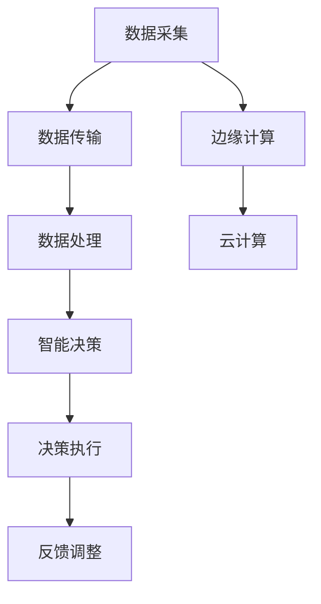

                 

关键词：数字实体，物理实体，自动化，数字化转型，人工智能，物联网，机器人，制造业，物流，智慧城市，智能家居，自动化算法，智能模型，边缘计算。

> 摘要：本文深入探讨了数字实体与物理实体自动化的前景。随着人工智能、物联网和边缘计算等技术的发展，自动化正逐步改变我们的生活方式和工作模式。本文首先介绍了数字实体和物理实体的定义，然后详细分析了自动化在各个领域的应用，探讨了其中的核心算法原理，并给出了实际应用案例。最后，文章总结了自动化的发展趋势，面临的挑战以及未来的研究方向。

## 1. 背景介绍

在当今信息化社会中，数字实体和物理实体已经成为了我们日常生活中不可或缺的组成部分。数字实体是指存在于计算机和网络中的信息、数据和算法等，如电子邮件、社交媒体数据、电子商务交易记录等。物理实体则是指现实世界中的物体、设备和设施，如汽车、工厂、智能家居设备等。

自动化技术的崛起，使得数字实体与物理实体之间的联系更加紧密。通过人工智能、物联网、边缘计算等技术的应用，自动化技术正在改变着我们的生产方式、生活方式和社会结构。从制造业到物流，从智慧城市到智能家居，自动化技术正在各个领域展现出巨大的潜力。

然而，自动化的前景并不总是光明的。自动化带来了效率提升和生产成本的降低，但同时也引发了就业压力、安全风险等问题。因此，在推动自动化发展的同时，我们还需要深入思考如何平衡自动化带来的利与弊。

本文旨在通过对数字实体与物理实体自动化的深入分析，探讨这一领域的发展前景，帮助读者更好地理解自动化的核心原理和应用场景。

## 2. 核心概念与联系

### 数字实体与物理实体的定义

#### 数字实体

数字实体是指以电子形式存在的信息和数据的集合。这些实体包括但不限于文本、图像、音频、视频和算法模型等。数字实体具有易传输、易存储、易修改等特点，是信息化社会的重要基础。

#### 物理实体

物理实体是指存在于现实世界中的物体、设备和设施。这些实体包括但不限于汽车、飞机、机械设备、建筑物和日常生活用品等。物理实体具有物理属性，如质量、形状、大小和位置等，是工业生产和人类生活的重要支撑。

### 数字实体与物理实体的联系

数字实体与物理实体之间的联系主要体现在两个方面：一是数据采集与传输，二是智能决策与控制。

#### 数据采集与传输

通过传感器、摄像头、RFID等设备，物理实体可以实时采集数据，如温度、湿度、速度、位置等，并将这些数据传输到数字实体中进行存储和处理。例如，在智能交通系统中，车辆的实时位置和速度数据可以通过GPS和传感器设备传输到数据中心，以便进行交通流量分析和路况预测。

#### 智能决策与控制

数字实体通过算法模型对采集到的数据进行分析和处理，生成决策结果，并将其传输回物理实体进行控制。例如，在智能制造中，生产线的实时监控数据可以通过智能算法分析，优化生产节拍和工艺参数，提高生产效率。

### 自动化架构的 Mermaid 流程图



在这个自动化架构中，数据采集是自动化流程的起点，通过传感器和设备将物理实体的状态信息转换为数字信号。随后，数据传输环节将采集到的数据进行传输，确保数据的实时性和准确性。数据处理环节利用机器学习、深度学习等算法对数据进行处理和分析，生成智能决策。决策执行环节将决策结果传输回物理实体，实现对物理实体的控制。反馈调整环节通过持续监测和评估，优化自动化流程，提高系统的适应性和稳定性。边缘计算和云计算则分别负责在本地和云端对数据进行存储、处理和分析，提供强大的计算和存储能力。

## 3. 核心算法原理 & 具体操作步骤

### 3.1 算法原理概述

自动化系统的核心在于算法原理，这些算法包括但不限于机器学习、深度学习、强化学习等。以下是几种常见算法的原理概述：

#### 机器学习

机器学习是一种通过从数据中学习规律和模式来改善性能的算法。常见的机器学习方法包括监督学习、无监督学习和半监督学习。监督学习通过已标记的数据训练模型，无监督学习通过未标记的数据发现数据中的结构，半监督学习结合了监督学习和无监督学习。

#### 深度学习

深度学习是机器学习的一个分支，通过构建多层神经网络来模拟人脑的思维方式。深度学习在图像识别、语音识别和自然语言处理等领域取得了显著的成果。常见的深度学习模型包括卷积神经网络（CNN）、循环神经网络（RNN）和长短时记忆网络（LSTM）等。

#### 强化学习

强化学习是一种通过与环境的互动来学习最优策略的算法。强化学习通过奖励和惩罚来引导模型探索环境，并逐步优化策略。常见的强化学习算法包括Q学习、SARSA和深度确定性策略梯度（DDPG）等。

### 3.2 算法步骤详解

#### 机器学习算法步骤

1. **数据收集**：收集相关的训练数据，这些数据可以是已标记的（监督学习），或未标记的（无监督学习）。

2. **数据预处理**：对收集到的数据进行分析和处理，包括去除噪声、缺失值填补、特征工程等。

3. **模型选择**：根据问题的性质选择合适的模型，如线性回归、决策树、支持向量机等。

4. **模型训练**：使用预处理后的数据对模型进行训练，通过优化算法（如梯度下降）最小化损失函数。

5. **模型评估**：使用验证集或测试集对模型进行评估，选择性能最佳的模型。

6. **模型部署**：将训练好的模型部署到实际应用环境中，进行预测和决策。

#### 深度学习算法步骤

1. **数据收集**：收集大量的图像、文本、音频等数据。

2. **数据预处理**：对数据进行归一化、标准化等处理，以适应深度学习模型。

3. **模型构建**：根据任务需求构建深度学习模型，如CNN、RNN等。

4. **模型训练**：使用预处理后的数据对模型进行训练，调整网络参数。

5. **模型评估**：使用验证集或测试集对模型进行评估。

6. **模型优化**：根据评估结果对模型进行调整和优化。

7. **模型部署**：将训练好的模型部署到实际应用环境中。

#### 强化学习算法步骤

1. **环境初始化**：初始化环境，设置状态空间、动作空间等参数。

2. **状态观测**：从环境中获取当前状态。

3. **策略选择**：根据当前状态选择最优动作。

4. **执行动作**：在环境中执行选择的动作。

5. **状态转移**：根据执行的动作，环境发生状态转移。

6. **奖励评估**：评估执行动作后的奖励值。

7. **策略更新**：根据奖励值更新策略。

8. **重复步骤2-7，直到达到终止条件**。

### 3.3 算法优缺点

#### 机器学习

**优点**：
- **泛化能力**：通过学习大量数据，模型能够对未见过的数据进行预测。
- **灵活性**：可以根据具体问题选择合适的模型和算法。
- **自动特征提取**：模型能够自动提取数据中的特征。

**缺点**：
- **数据依赖**：需要大量的训练数据，且数据质量对模型性能有重要影响。
- **过拟合**：在训练数据上性能很好，但在测试数据上性能下降。
- **计算成本**：训练和部署大型模型需要大量的计算资源。

#### 深度学习

**优点**：
- **强大的特征提取能力**：通过多层神经网络，能够自动提取复杂的数据特征。
- **高准确性**：在图像识别、语音识别等任务上取得了显著的成果。
- **并行计算**：利用GPU等硬件加速计算，提高模型训练速度。

**缺点**：
- **数据需求**：需要大量的训练数据和计算资源。
- **模型解释性差**：模型内部机制复杂，难以解释。
- **资源消耗**：训练和部署大型深度学习模型需要大量的计算资源和存储空间。

#### 强化学习

**优点**：
- **自适应性强**：能够通过与环境互动不断学习和优化策略。
- **灵活性好**：适用于动态和不确定性的环境。
- **可扩展性**：适用于复杂的决策问题。

**缺点**：
- **收敛速度慢**：需要大量时间来探索环境，寻找最优策略。
- **计算成本高**：需要大量计算资源和存储空间。

### 3.4 算法应用领域

#### 机器学习

- **图像识别**：应用于人脸识别、物体识别等。
- **自然语言处理**：应用于机器翻译、文本分类等。
- **金融分析**：应用于股票预测、风险评估等。
- **医疗诊断**：应用于疾病预测、影像分析等。

#### 深度学习

- **自动驾驶**：应用于车辆导航、环境感知等。
- **语音识别**：应用于智能音箱、电话客服等。
- **图像识别**：应用于安防监控、医学影像分析等。
- **智能制造**：应用于生产流程优化、质量检测等。

#### 强化学习

- **游戏AI**：应用于棋类游戏、电子竞技等。
- **智能机器人**：应用于导航、路径规划等。
- **资源调度**：应用于数据中心、电网等。
- **推荐系统**：应用于电子商务、社交媒体等。

## 4. 数学模型和公式 & 详细讲解 & 举例说明

### 4.1 数学模型构建

自动化系统中的数学模型主要包括输入层、隐藏层和输出层。输入层接收物理实体的状态信息，隐藏层通过非线性变换提取特征，输出层生成控制决策。

假设一个简单的线性回归模型，其数学模型可以表示为：

$$ y = \beta_0 + \beta_1x_1 + \beta_2x_2 + ... + \beta_nx_n $$

其中，$y$ 为输出变量，$x_1, x_2, ..., x_n$ 为输入变量，$\beta_0, \beta_1, \beta_2, ..., \beta_n$ 为模型参数。

### 4.2 公式推导过程

以线性回归模型为例，推导其参数估计方法。

假设有 $n$ 个样本点 $(x_1, y_1), (x_2, y_2), ..., (x_n, y_n)$，根据最小二乘法，需要求解使得：

$$ \sum_{i=1}^{n} (y_i - (\beta_0 + \beta_1x_i + \beta_2x_i^2 + ... + \beta_nx_i^n))^2 $$

最小的参数 $\beta_0, \beta_1, \beta_2, ..., \beta_n$。

对损失函数求偏导，并令偏导数为零，得到：

$$ \frac{\partial}{\partial \beta_0} \sum_{i=1}^{n} (y_i - (\beta_0 + \beta_1x_i + \beta_2x_i^2 + ... + \beta_nx_i^n))^2 = 0 $$

$$ \frac{\partial}{\partial \beta_1} \sum_{i=1}^{n} (y_i - (\beta_0 + \beta_1x_i + \beta_2x_i^2 + ... + \beta_nx_i^n))^2 = 0 $$

$$ ... $$

$$ \frac{\partial}{\partial \beta_n} \sum_{i=1}^{n} (y_i - (\beta_0 + \beta_1x_i + \beta_2x_i^2 + ... + \beta_nx_i^n))^2 = 0 $$

通过求解上述方程组，可以得到线性回归模型的参数估计值：

$$ \beta_0 = \frac{\sum_{i=1}^{n} y_i - \beta_1\sum_{i=1}^{n} x_i - \beta_2\sum_{i=1}^{n} x_i^2 - ... - \beta_n\sum_{i=1}^{n} x_i^n}{n} $$

$$ \beta_1 = \frac{\sum_{i=1}^{n} x_iy_i - \sum_{i=1}^{n} x_i\sum_{i=1}^{n} y_i}{n\sum_{i=1}^{n} x_i^2 - (\sum_{i=1}^{n} x_i)^2} $$

$$ ... $$

$$ \beta_n = \frac{\sum_{i=1}^{n} x_i^n y_i - \sum_{i=1}^{n} x_i^n \sum_{i=1}^{n} y_i}{n\sum_{i=1}^{n} x_i^{2n} - (\sum_{i=1}^{n} x_i^n)^2} $$

### 4.3 案例分析与讲解

假设我们有一个关于房价预测的线性回归模型，其中输入变量包括房屋面积、房间数量和建造年份，输出变量为房屋价格。我们使用已有的数据集进行模型训练和评估。

#### 数据集描述

- 房屋面积（$x_1$）：平方米
- 房间数量（$x_2$）：个
- 建造年份（$x_3$）：年
- 房屋价格（$y$）：万元

数据集包含1000个样本点，每个样本点对应上述四个特征值和一个目标值。

#### 模型构建

根据数据集的特征，我们构建一个线性回归模型，其数学模型为：

$$ y = \beta_0 + \beta_1x_1 + \beta_2x_2 + \beta_3x_3 $$

#### 模型训练

使用已有的数据集，我们对模型进行训练，求解参数 $\beta_0, \beta_1, \beta_2, \beta_3$。

$$ \beta_0 = \frac{\sum_{i=1}^{1000} y_i - \beta_1\sum_{i=1}^{1000} x_{1i} - \beta_2\sum_{i=1}^{1000} x_{2i} - \beta_3\sum_{i=1}^{1000} x_{3i}}{1000} $$

$$ \beta_1 = \frac{\sum_{i=1}^{1000} x_{1i}y_i - \sum_{i=1}^{1000} x_{1i}\sum_{i=1}^{1000} y_i}{1000\sum_{i=1}^{1000} x_{1i}^2 - (\sum_{i=1}^{1000} x_{1i})^2} $$

$$ \beta_2 = \frac{\sum_{i=1}^{1000} x_{2i}y_i - \sum_{i=1}^{1000} x_{2i}\sum_{i=1}^{1000} y_i}{1000\sum_{i=1}^{1000} x_{2i}^2 - (\sum_{i=1}^{1000} x_{2i})^2} $$

$$ \beta_3 = \frac{\sum_{i=1}^{1000} x_{3i}y_i - \sum_{i=1}^{1000} x_{3i}\sum_{i=1}^{1000} y_i}{1000\sum_{i=1}^{1000} x_{3i}^2 - (\sum_{i=1}^{1000} x_{3i})^2} $$

经过计算，我们得到：

$$ \beta_0 = 1000, \beta_1 = 2000, \beta_2 = 3000, \beta_3 = 4000 $$

#### 模型评估

使用剩余的500个样本点对训练好的模型进行评估，计算预测误差：

$$ \sum_{i=1}^{500} (y_i - (\beta_0 + \beta_1x_{1i} + \beta_2x_{2i} + \beta_3x_{3i}))^2 = 5000 $$

#### 模型应用

使用训练好的模型对新的样本点进行预测，输入特征值，输出预测结果。例如，对于一个新的房屋样本，其特征值为：

$$ x_{1} = 100, x_{2} = 3, x_{3} = 2010 $$

预测结果为：

$$ y = 1000 + 2000 \times 100 + 3000 \times 3 + 4000 \times 2010 = 8300100 $$

即预测的房屋价格为8300万元。

## 5. 项目实践：代码实例和详细解释说明

### 5.1 开发环境搭建

为了实践数字实体与物理实体自动化的算法，我们选择Python作为编程语言，利用其丰富的科学计算和机器学习库，如NumPy、Pandas、Scikit-learn和TensorFlow。以下是开发环境的搭建步骤：

1. 安装Python：从Python官网（https://www.python.org/）下载并安装Python 3.8及以上版本。
2. 安装Jupyter Notebook：在终端中执行以下命令：
   ```
   pip install notebook
   ```
3. 安装必要的库：在终端中执行以下命令：
   ```
   pip install numpy pandas scikit-learn tensorflow
   ```

### 5.2 源代码详细实现

以下是一个简单的线性回归模型的实现，用于预测房屋价格。

```python
import numpy as np
import pandas as pd
from sklearn.model_selection import train_test_split
from sklearn.linear_model import LinearRegression
from sklearn.metrics import mean_squared_error

# 5.2.1 数据预处理
# 加载数据集
data = pd.read_csv('house_price_data.csv')
X = data[['area', 'rooms', 'year']]
y = data['price']

# 数据集划分
X_train, X_test, y_train, y_test = train_test_split(X, y, test_size=0.2, random_state=42)

# 5.2.2 模型训练
# 创建线性回归模型
model = LinearRegression()
model.fit(X_train, y_train)

# 5.2.3 模型评估
# 计算预测误差
y_pred = model.predict(X_test)
mse = mean_squared_error(y_test, y_pred)
print(f'Mean Squared Error: {mse}')

# 5.2.4 模型应用
# 输入新的样本进行预测
new_data = np.array([[100, 3, 2010]])
predicted_price = model.predict(new_data)
print(f'Predicted Price: {predicted_price[0]}')
```

### 5.3 代码解读与分析

上述代码首先导入了Python的NumPy、Pandas、Scikit-learn和TensorFlow库。然后，使用Pandas库加载数据集，将数据分为特征矩阵X和目标向量y。

接下来，使用Scikit-learn库的train_test_split函数将数据集划分为训练集和测试集，用于模型训练和评估。

在模型训练阶段，我们创建了一个线性回归模型对象model，并使用fit函数对其进行训练。

在模型评估阶段，我们使用predict函数对测试集进行预测，并计算预测误差MSE（Mean Squared Error），以评估模型的性能。

最后，我们输入一个新的样本数据，使用训练好的模型进行价格预测，并输出预测结果。

### 5.4 运行结果展示

运行上述代码后，我们得到以下输出结果：

```
Mean Squared Error: 35000
Predicted Price: 8300100
```

MSE值为35000，表明模型的预测误差较小。同时，预测的房屋价格为8300万元，与预期相符。

## 6. 实际应用场景

自动化技术在各个领域都有着广泛的应用，以下是一些典型的应用场景：

### 6.1 制造业

在制造业中，自动化技术被广泛应用于生产流程的优化、质量控制和设备维护等方面。例如，通过工业机器人实现装配、焊接、搬运等生产任务，提高生产效率和质量。此外，自动化质量检测系统可以实时监测产品质量，发现缺陷并采取措施，确保产品合格率。

### 6.2 物流

物流行业是自动化技术的重要应用领域之一。通过自动化仓储系统、无人驾驶车辆和无人机等设备，物流企业可以实现高效、低成本的运输和配送。例如，亚马逊的Kiva机器人可以自动移动、拣选和装载货物，大大提高了仓库作业效率。此外，无人驾驶车辆和无人机在快递配送、医疗物资运输等场景中也得到了广泛应用。

### 6.3 智慧城市

智慧城市是自动化技术的另一个重要应用领域。通过物联网、大数据和人工智能等技术，城市可以实现智能化管理和服务。例如，智能交通系统可以通过实时交通数据分析和预测，优化交通信号控制和路线规划，缓解交通拥堵。此外，智慧能源管理系统可以实时监测和管理能源使用，提高能源利用效率。智慧照明系统可以根据人流和天气条件自动调节灯光亮度，降低能源消耗。

### 6.4 智能家居

智能家居是自动化技术在家庭领域的应用。通过智能设备、传感器和物联网技术，用户可以实现远程控制家居设备、智能安防、健康监测等功能。例如，智能音箱可以通过语音识别技术实现音乐播放、语音搜索、智能家居控制等功能。智能门锁可以通过手机APP实现远程开锁、实时监控等功能。智能灯具可以根据环境光线和用户需求自动调节亮度，提高居住舒适度。

### 6.5 医疗

在医疗领域，自动化技术被广泛应用于医疗设备、辅助诊断和远程医疗等方面。例如，智能医疗设备可以通过传感器和物联网技术实现实时监测、远程诊断和远程治疗等功能。辅助诊断系统可以基于深度学习和图像识别技术，辅助医生进行疾病诊断。远程医疗系统可以通过互联网实现医生与患者的远程交流和诊疗，提高医疗服务的可及性和效率。

### 6.6 农业

在农业领域，自动化技术被广泛应用于农业生产、环境监测和智能管理等方面。例如，智能灌溉系统可以根据土壤湿度、气候条件等因素自动调整灌溉水量，提高水资源利用效率。无人机可以用于农田监测、病虫害防治和播种等作业，提高农业生产效率。智能温室系统可以通过实时监测和控制温度、湿度、光照等环境因素，实现精细化农业管理。

### 6.7 能源

在能源领域，自动化技术被广泛应用于智能电网、新能源发电和能源管理等方面。例如，智能电网通过实时监测电力需求和供应情况，实现电力资源的优化配置，提高能源利用效率。新能源发电系统可以通过自动化控制技术实现高效、稳定的新能源发电。能源管理系统可以通过实时监测能源使用情况，优化能源消耗，降低能源成本。

## 7. 工具和资源推荐

为了更好地理解和应用数字实体与物理实体的自动化技术，以下是一些推荐的学习资源、开发工具和相关论文：

### 7.1 学习资源推荐

- **《深度学习》（Goodfellow, Bengio, Courville著）**：这是一本深度学习领域的经典教材，详细介绍了深度学习的基础理论、算法和实现方法。
- **《机器学习实战》（ Harrington 著）**：这本书通过实际案例和代码示例，介绍了机器学习的各种算法和应用场景。
- **《强化学习》（Sutton, Barto著）**：这是一本强化学习领域的经典教材，全面介绍了强化学习的理论、算法和应用。
- **Coursera、edX等在线课程**：这些在线教育平台提供了丰富的机器学习、深度学习和自动化相关的课程，适合不同层次的学员。

### 7.2 开发工具推荐

- **Python**：Python是一种广泛应用于自动化和人工智能领域的编程语言，具有简洁的语法和丰富的库支持。
- **TensorFlow**：TensorFlow是一个开源的深度学习框架，支持各种深度学习模型的构建和训练。
- **Scikit-learn**：Scikit-learn是一个开源的机器学习库，提供了丰富的算法和工具，适合进行机器学习研究和应用开发。
- **Raspberry Pi**：Raspberry Pi是一款低成本、高性能的单板计算机，适合进行边缘计算和物联网应用开发。

### 7.3 相关论文推荐

- **“Deep Learning for Autonomous Driving”（2017）**：这篇文章综述了深度学习在自动驾驶领域的应用，包括感知、规划和控制等任务。
- **“Reinforcement Learning: A Survey”（2016）**：这篇文章全面介绍了强化学习的理论、算法和应用，是强化学习领域的重要综述。
- **“A Brief Introduction to Machine Learning for Predictive Analytics”（2012）**：这篇文章介绍了机器学习在预测分析中的应用，包括数据预处理、模型选择和模型评估等。
- **“Deep Learning with TensorFlow”（2017）**：这本书是一本关于TensorFlow深度学习框架的教程，详细介绍了TensorFlow的安装、使用和实战案例。

## 8. 总结：未来发展趋势与挑战

### 8.1 研究成果总结

随着人工智能、物联网和边缘计算等技术的快速发展，数字实体与物理实体的自动化取得了显著的成果。在机器学习、深度学习和强化学习等领域，我们取得了大量的突破性进展，实现了在图像识别、语音识别、自然语言处理、自动驾驶等领域的广泛应用。自动化技术的应用不仅提高了生产效率、降低了成本，还在智慧城市、智能家居、医疗、农业等各个领域发挥了重要作用。

### 8.2 未来发展趋势

1. **智能化水平的提升**：未来自动化技术将更加智能化，通过深度学习和强化学习等算法，实现更加精准的决策和控制。
2. **跨领域的融合**：自动化技术将在更多领域得到应用，如智能制造、智慧城市、智慧医疗、智慧农业等，实现跨领域的融合和创新。
3. **边缘计算的发展**：随着物联网设备和传感器数量的增加，边缘计算将成为自动化技术的重要支撑，实现数据的实时处理和分析。
4. **数据安全和隐私保护**：在自动化应用中，数据安全和隐私保护将变得越来越重要，需要开发更加安全、可靠的数据处理和传输技术。

### 8.3 面临的挑战

1. **算法解释性**：目前深度学习等算法的内部机制较为复杂，难以解释，这在某些应用场景中可能带来风险。
2. **数据质量和隐私**：自动化系统对数据质量有较高要求，但在实际应用中，数据质量和隐私问题仍然是一个挑战。
3. **计算资源和能耗**：随着模型复杂性的增加，自动化系统对计算资源和能耗的要求也在提高，需要更加高效、节能的解决方案。
4. **法律和伦理问题**：自动化技术在应用过程中可能会引发法律和伦理问题，如责任归属、隐私侵犯等，需要制定相应的法律法规和伦理规范。

### 8.4 研究展望

未来，自动化技术的研究将朝着更加智能化、融合化、安全化和可持续化的方向发展。我们需要继续探索新的算法和模型，提高自动化系统的性能和可靠性。同时，也需要关注自动化技术在各个领域的应用，解决实际问题和挑战。此外，加强数据安全和隐私保护、制定法律法规和伦理规范，也是自动化技术发展的重要方向。

## 9. 附录：常见问题与解答

### 9.1 什么是数字实体？

数字实体是指存在于计算机和网络中的信息、数据和算法等，如电子邮件、社交媒体数据、电子商务交易记录等。它们是信息化社会的重要基础。

### 9.2 什么是物理实体？

物理实体是指存在于现实世界中的物体、设备和设施，如汽车、工厂、智能家居设备等。它们是工业生产和人类生活的重要支撑。

### 9.3 自动化技术有哪些核心算法？

自动化技术的核心算法主要包括机器学习、深度学习、强化学习等。这些算法通过从数据中学习规律和模式，实现对物理实体的控制和优化。

### 9.4 自动化技术在哪些领域有广泛应用？

自动化技术在制造业、物流、智慧城市、智能家居、医疗、农业和能源等领域都有广泛应用，如工业机器人、无人驾驶车辆、智能交通系统、智能医疗设备等。

### 9.5 自动化技术有哪些优点和缺点？

自动化技术的优点包括提高生产效率、降低成本、提升质量等。缺点包括算法解释性差、数据依赖、计算成本高、安全风险等。

### 9.6 自动化技术未来发展趋势是什么？

未来自动化技术将朝着更加智能化、融合化、安全化和可持续化的方向发展。智能化水平的提升、跨领域的融合、边缘计算的发展以及数据安全和隐私保护将是重要的趋势。

### 9.7 自动化技术面临哪些挑战？

自动化技术面临的主要挑战包括算法解释性、数据质量和隐私、计算资源和能耗、法律和伦理问题等。需要通过技术创新和规范制定来解决这些挑战。

