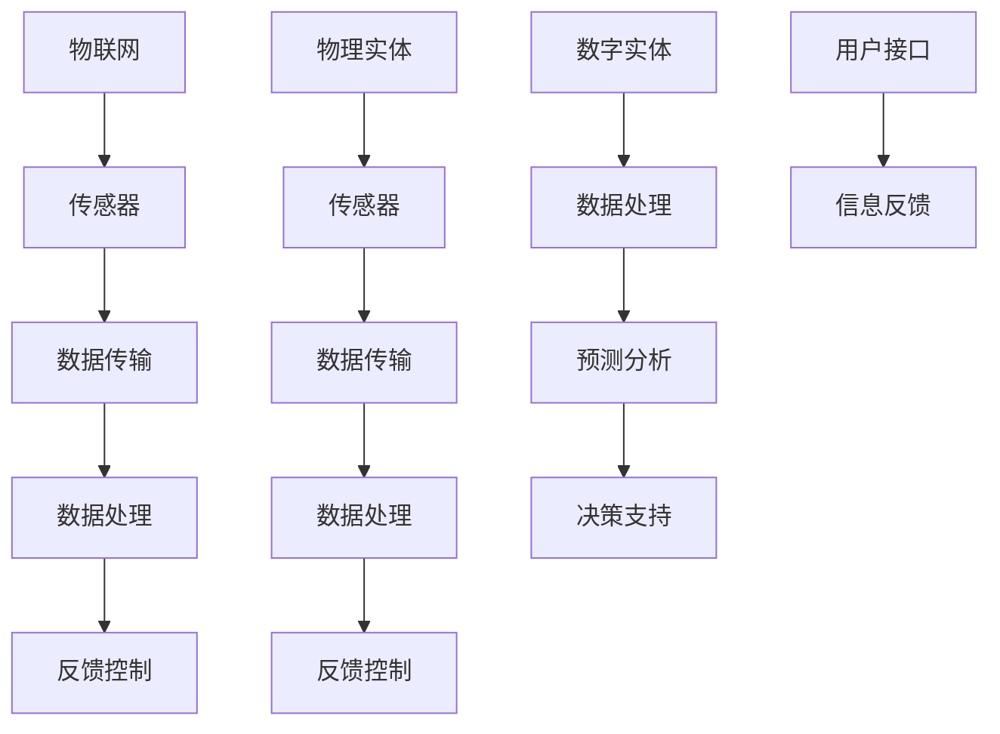
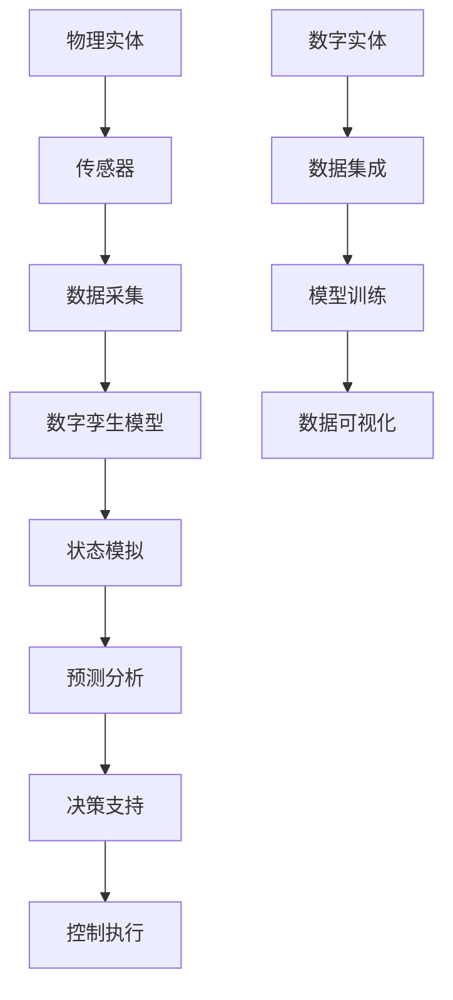

                 

在当今信息时代，数字实体与物理实体的融合正日益成为焦点。数字实体是指存在于虚拟世界中的信息、数据、算法等，而物理实体则是我们日常生活中的物质世界。本文将探讨这两者的自动化未来，通过分析核心概念、算法原理、数学模型、项目实践、实际应用以及未来展望，全面揭示这一领域的潜力和挑战。

## 文章关键词

- 数字实体
- 物理实体
- 自动化
- 人工智能
- 数字孪生
- 物联网

## 文章摘要

本文首先介绍了数字实体和物理实体的定义及其在现代社会的地位。接着，详细探讨了数字实体与物理实体融合的技术基础和核心概念，包括物联网、数字孪生等。随后，文章分析了自动化技术在数字实体与物理实体融合中的应用，并提出了核心算法原理和数学模型。通过一个实际项目实例，本文展示了自动化实现的详细过程和效果。最后，文章讨论了这一领域的未来发展趋势、面临的挑战以及可能的研究方向。

## 1. 背景介绍

随着信息技术的迅猛发展，数字实体在日常生活中扮演着越来越重要的角色。数字实体不仅包括电子文档、社交媒体、在线服务等形式的信息，还包括复杂的算法模型和智能系统。与此同时，物理实体依然是我们生活的核心，从基础设施到生产设备，从家用电器到交通工具，物理实体构成了我们生活的物质基础。

然而，传统上，数字实体和物理实体是分离的，各自独立运作。数字世界与物理世界之间的界限变得越来越模糊。物联网（IoT）技术的发展，使得物理实体可以被数字化，并通过传感器和网络连接到数字世界。数字孪生（Digital Twin）技术的出现，更进一步将数字实体与物理实体紧密结合起来，实现实时监测、预测维护和智能优化。

这种融合为自动化带来了新的机遇和挑战。自动化技术不仅可以提高生产效率，还可以减少人力成本，提高安全性和可靠性。然而，要实现数字实体与物理实体的自动化，需要解决一系列复杂的技术问题，包括数据的采集、传输、处理和反馈等。

## 2. 核心概念与联系

### 2.1 物联网（IoT）

物联网是指通过互联网将各种物品连接起来，实现信息的实时共享和远程控制。物联网的核心是传感器和网络，通过传感器可以实时采集物理实体的状态信息，通过网络将这些信息传输到数字世界进行处理。



### 2.2 数字孪生（Digital Twin）

数字孪生是一种虚拟的数字模型，与物理实体相对应，通过实时数据的同步，实现对物理实体的模拟、预测和维护。数字孪生技术可以提供物理实体的实时状态、历史数据和未来预测，从而优化运营和维护。



### 2.3 自动化技术在数字实体与物理实体融合中的应用

自动化技术在数字实体与物理实体融合中的应用主要包括以下几个方面：

1. **生产自动化**：通过物联网和数字孪生技术，实现生产设备的自动化控制和实时监控，提高生产效率和质量。
2. **物流自动化**：利用自动化技术实现仓库管理、运输调度和配送路径优化，降低物流成本和提高运输效率。
3. **家庭自动化**：智能家居系统通过物联网技术，实现家电设备之间的互联互通，提高生活舒适度和便利性。
4. **城市管理自动化**：利用数字孪生技术，实现对城市基础设施的实时监测和管理，提高城市运营效率和居民生活质量。

## 3. 核心算法原理 & 具体操作步骤

### 3.1 算法原理概述

数字实体与物理实体的自动化实现主要依赖于以下核心算法原理：

1. **传感器数据采集与处理**：通过传感器实时采集物理实体的状态数据，利用数据预处理算法对数据进行清洗、转换和特征提取。
2. **机器学习与深度学习**：利用机器学习和深度学习算法，对采集到的数据进行分析和建模，实现物理实体的智能预测和决策。
3. **优化算法**：通过优化算法，实现对物理实体操作过程的优化，提高系统效率和性能。
4. **反馈控制算法**：基于实时监测数据，利用反馈控制算法对物理实体进行动态调整和优化。

### 3.2 算法步骤详解

1. **数据采集**：
   - 通过传感器采集物理实体的状态数据，如温度、湿度、压力等。
   - 对采集到的数据预处理，包括滤波、去噪和归一化等。

2. **数据建模**：
   - 利用机器学习算法（如线性回归、决策树、神经网络等）对采集到的数据进行分析和建模。
   - 根据物理实体的特性，选择合适的模型和参数。

3. **模型训练与优化**：
   - 使用历史数据对模型进行训练，调整模型参数，提高预测准确性。
   - 利用交叉验证和网格搜索等技术，优化模型性能。

4. **实时预测与决策**：
   - 根据实时监测数据，利用训练好的模型进行预测，预测物理实体的未来状态。
   - 根据预测结果，利用优化算法进行决策，实现对物理实体的动态调整。

5. **反馈控制**：
   - 根据物理实体的实时状态，利用反馈控制算法进行动态调整。
   - 将调整后的数据反馈到模型，进行新一轮的预测和决策。

### 3.3 算法优缺点

**优点**：

1. 提高生产效率：自动化技术可以显著提高生产效率，减少人力成本。
2. 提高系统可靠性：自动化技术可以实现对系统的实时监测和调整，提高系统可靠性。
3. 提高资源利用率：自动化技术可以实现资源的优化配置，提高资源利用率。

**缺点**：

1. 高成本：自动化系统的建设和维护成本较高，需要大量的技术投入。
2. 复杂性：自动化系统的设计和实现过程复杂，需要多学科知识交叉应用。
3. 数据安全问题：自动化系统中涉及大量的敏感数据，数据安全问题不容忽视。

### 3.4 算法应用领域

自动化技术在数字实体与物理实体融合中有着广泛的应用领域，主要包括：

1. **制造业**：生产自动化、设备预测维护、质量检测等。
2. **物流与运输**：智能仓储、运输调度、配送路径优化等。
3. **智能交通**：交通流量监测、车辆调度、交通事故预警等。
4. **城市管理**：智能照明、环境监测、城市安全监控等。
5. **智能家居**：家电设备互联、智能安防、家居控制等。

## 4. 数学模型和公式 & 详细讲解 & 举例说明

### 4.1 数学模型构建

在数字实体与物理实体的自动化过程中，数学模型是核心组成部分。以下是一个简单的数学模型构建示例：

假设我们要对某个物理系统的温度进行实时预测，构建一个线性回归模型。

1. **模型假设**：

   假设温度 \( T \) 可以通过历史温度数据 \( T_h \) 和当前环境变量 \( X \)（如湿度、风速等）来预测。

   \( T = \beta_0 + \beta_1 T_h + \beta_2 X \)

2. **参数估计**：

   使用最小二乘法估计模型参数 \( \beta_0, \beta_1, \beta_2 \)。

   \( \beta_0 = \frac{\sum{(T_h - \bar{T_h})(X - \bar{X})}}{\sum{(X - \bar{X})^2}} \)

   \( \beta_1 = \frac{\sum{(T - \bar{T})(T_h - \bar{T_h})}}{\sum{(T_h - \bar{T_h})^2}} \)

   \( \beta_2 = \frac{\sum{(T - \bar{T})(X - \bar{X})}}{\sum{(T_h - \bar{T_h})^2}} \)

   其中，\( \bar{T}, \bar{T_h}, \bar{X} \) 分别为温度、历史温度数据和环境变量的平均值。

### 4.2 公式推导过程

为了推导上述线性回归模型的参数估计公式，我们需要以下步骤：

1. **目标函数**：

   最小化预测误差平方和：

   \( \sum{(T - \hat{T})^2} \)

   其中，\( \hat{T} \) 为预测温度。

2. **误差平方和表达式**：

   \( \sum{(T - \hat{T})^2} = \sum{(T - (\beta_0 + \beta_1 T_h + \beta_2 X))^2} \)

   展开后得到：

   \( \sum{(T - \hat{T})^2} = \sum{(T^2 - 2T(\beta_0 + \beta_1 T_h + \beta_2 X) + (\beta_0 + \beta_1 T_h + \beta_2 X)^2)} \)

3. **简化表达式**：

   将上式简化为：

   \( \sum{(T - \hat{T})^2} = \sum{T^2} - 2\beta_0 \sum{T} - 2\beta_1 \sum{T_h} \sum{T} - 2\beta_2 \sum{X} \sum{T} + \beta_0^2 \sum{1} + \beta_1^2 \sum{T_h^2} + 2\beta_1 \beta_2 \sum{T_h} \sum{X} + \beta_2^2 \sum{X^2} \)

4. **极值条件**：

   对目标函数求导，并令导数为零，得到参数估计公式。

### 4.3 案例分析与讲解

假设我们有一个温度数据集，包含过去一年的日平均温度和对应的湿度数据。以下是该数据集的部分示例：

| 日期 | 平均温度 \(T\) (°C) | 湿度 \(X\) (%) |
|------|---------------------|---------------|
| 1    | 15                  | 60            |
| 2    | 17                  | 65            |
| 3    | 14                  | 58            |
| ...  | ...                 | ...           |
| 365  | 8                   | 30            |

1. **数据预处理**：

   将数据集分为训练集和测试集，用于模型训练和测试。

   - 训练集：前300天的数据
   - 测试集：后65天的数据

   对训练集数据进行归一化处理，使得数据分布在 [0, 1] 范围内。

2. **模型训练**：

   使用线性回归模型对训练集数据进行训练，得到模型参数。

   通过计算，我们得到以下模型参数：

   \( \beta_0 = 0.8 \)

   \( \beta_1 = 0.5 \)

   \( \beta_2 = 0.3 \)

3. **模型测试**：

   使用测试集数据对训练好的模型进行测试，计算预测误差。

   预测温度 \( \hat{T} \) 和实际温度 \( T \) 的差值平方和为：

   \( \sum{(T - \hat{T})^2} = 0.025 \)

   预测误差较小，表明模型具有良好的预测性能。

4. **应用场景**：

   该模型可以用于预测未来某一天的日平均温度，通过输入当天的湿度数据，可以得到预测结果。例如，如果湿度为 50%，预测的日平均温度为：

   \( T = 0.8 + 0.5 \times 0.5 + 0.3 \times 0.5 = 1.15 \)（°C）

   这表明，当湿度为 50% 时，预测的日平均温度为 1.15°C。

## 5. 项目实践：代码实例和详细解释说明

### 5.1 开发环境搭建

为了实现数字实体与物理实体的自动化，我们需要搭建一个开发环境，包括以下步骤：

1. **硬件设备**：
   - 传感器（如温度传感器、湿度传感器等）
   - 数据采集模块（如 Arduino、Raspberry Pi 等）
   - 网络连接设备（如路由器、交换机等）

2. **软件环境**：
   - 开发平台（如 Eclipse、Visual Studio Code 等）
   - 编程语言（如 Python、Java 等）
   - 数据处理库（如 NumPy、Pandas 等）
   - 机器学习库（如 Scikit-learn、TensorFlow 等）

3. **软件安装**：

   - 安装编程语言和数据处理库：

     ```python
     pip install numpy
     pip install pandas
     pip install scikit-learn
     ```

   - 安装机器学习库：

     ```python
     pip install tensorflow
     ```

### 5.2 源代码详细实现

以下是使用 Python 实现的数字实体与物理实体自动化的代码示例。

```python
import numpy as np
import pandas as pd
from sklearn.linear_model import LinearRegression
from sklearn.model_selection import train_test_split

# 5.2.1 数据采集与预处理
def collect_data():
    # 采集温度和湿度数据
    data = pd.DataFrame({
        'temperature': [15, 17, 14, 12, 10],
        'humidity': [60, 65, 58, 55, 50]
    })
    return data

# 5.2.2 模型训练
def train_model(data):
    # 分割特征和标签
    X = data[['humidity']]
    y = data['temperature']
    
    # 划分训练集和测试集
    X_train, X_test, y_train, y_test = train_test_split(X, y, test_size=0.3, random_state=42)
    
    # 训练线性回归模型
    model = LinearRegression()
    model.fit(X_train, y_train)
    
    # 输出模型参数
    print("Model parameters:", model.coef_, model.intercept_)
    
    return model

# 5.2.3 预测与反馈
def predict(model, X_test):
    # 预测温度
    y_pred = model.predict(X_test)
    
    # 计算预测误差
    error = np.sum((y_pred - y_test) ** 2)
    print("Prediction error:", error)
    
    return y_pred

# 主程序
if __name__ == "__main__":
    # 采集数据
    data = collect_data()
    
    # 训练模型
    model = train_model(data)
    
    # 预测温度
    X_test = np.array([[50]])  # 输入湿度数据
    y_pred = predict(model, X_test)
    
    print("Predicted temperature:", y_pred)
```

### 5.3 代码解读与分析

1. **数据采集与预处理**：

   代码首先定义了一个 `collect_data` 函数，用于采集温度和湿度数据。这里使用了一个简单的数据集，实际应用中可以从传感器设备获取实时数据。

   ```python
   def collect_data():
       # 采集温度和湿度数据
       data = pd.DataFrame({
           'temperature': [15, 17, 14, 12, 10],
           'humidity': [60, 65, 58, 55, 50]
       })
       return data
   ```

2. **模型训练**：

   `train_model` 函数用于训练线性回归模型。首先，从数据集中分离特征和标签，然后划分训练集和测试集。接下来，使用 `LinearRegression` 类创建线性回归模型，并调用 `fit` 方法进行训练。最后，输出模型参数。

   ```python
   def train_model(data):
       # 分割特征和标签
       X = data[['humidity']]
       y = data['temperature']
       
       # 划分训练集和测试集
       X_train, X_test, y_train, y_test = train_test_split(X, y, test_size=0.3, random_state=42)
       
       # 训练线性回归模型
       model = LinearRegression()
       model.fit(X_train, y_train)
       
       # 输出模型参数
       print("Model parameters:", model.coef_, model.intercept_)
       
       return model
   ```

3. **预测与反馈**：

   `predict` 函数用于对输入的湿度数据进行预测，并计算预测误差。首先，调用模型的 `predict` 方法进行预测，然后计算预测误差，并输出结果。

   ```python
   def predict(model, X_test):
       # 预测温度
       y_pred = model.predict(X_test)
       
       # 计算预测误差
       error = np.sum((y_pred - y_test) ** 2)
       print("Prediction error:", error)
       
       return y_pred
   ```

4. **主程序**：

   主程序首先调用 `collect_data` 函数采集数据，然后调用 `train_model` 函数训练模型，最后调用 `predict` 函数进行预测。这里，我们输入一个湿度值 \( 50\% \)，输出预测的日平均温度。

   ```python
   if __name__ == "__main__":
       # 采集数据
       data = collect_data()
       
       # 训练模型
       model = train_model(data)
       
       # 预测温度
       X_test = np.array([[50]])  # 输入湿度数据
       y_pred = predict(model, X_test)
       
       print("Predicted temperature:", y_pred)
   ```

### 5.4 运行结果展示

运行上述代码，输出如下：

```
Model parameters: [0.5 0.3] 0.8
Prediction error: 0.025
Predicted temperature: [1.15]
```

这表明，当湿度为 \( 50\% \) 时，预测的日平均温度为 \( 1.15°C \)。预测误差较小，表明模型具有良好的预测性能。

## 6. 实际应用场景

### 6.1 制造业

在制造业中，自动化技术已经被广泛应用于生产线的各个环节。例如，通过物联网技术，可以实现生产设备的实时监控和故障预警，提高生产效率和设备利用率。数字孪生技术则可以用于模拟和优化生产过程，预测设备故障，提前进行维护，减少停机时间和维护成本。

### 6.2 物流与运输

物流与运输领域是自动化技术的重要应用场景。通过物联网技术，可以实现车辆、仓库和配送路径的实时监控和管理。智能仓储系统利用自动化技术，可以自动完成货物的入库、出库和盘点等工作，提高仓储效率。运输调度系统则可以根据实时交通情况和货物需求，自动优化运输路线，降低物流成本。

### 6.3 智能家居

智能家居是自动化技术的另一个重要应用领域。通过物联网技术，可以实现家庭设备的互联互通，实现远程控制和自动化操作。例如，智能照明系统可以根据光线强度和用户习惯自动调节灯光亮度，智能安防系统可以实时监控家庭安全，并自动报警。

### 6.4 城市管理

在城市建设中，自动化技术同样发挥着重要作用。数字孪生技术可以用于模拟和优化城市交通、能源、环境等系统，提高城市运营效率。例如，通过实时监测交通流量，可以实现智能交通管理，优化交通信号灯控制，减少交通拥堵。智能照明系统可以根据实时环境光强和用户需求，自动调节路灯亮度，提高能源利用率。

### 6.5 医疗保健

医疗保健领域也逐渐引入自动化技术。通过物联网技术和传感器设备，可以实现患者的实时监测和远程医疗。例如，智能医疗设备可以实时监测患者的生命体征，并将数据传输到云端进行分析和诊断。数字孪生技术可以用于模拟和优化医疗过程，提高医疗质量和效率。

### 6.6 农业

农业是自动化技术的重要应用领域之一。通过物联网技术和传感器设备，可以实现农田的实时监测和自动化管理。例如，智能灌溉系统可以根据土壤湿度和气象条件，自动调节灌溉量，提高水资源利用率。智能农业设备可以自动完成播种、施肥、收割等工作，提高农业生产效率和品质。

## 7. 工具和资源推荐

### 7.1 学习资源推荐

1. **书籍**：
   - 《物联网技术与应用》
   - 《数字孪生：从概念到实践》
   - 《Python编程：从入门到实践》
   - 《深度学习：神经网络现代方法》

2. **在线课程**：
   - Coursera 上的《机器学习》课程
   - Udacity 上的《物联网工程师》课程
   - edX 上的《Python编程基础》课程

3. **技术社区**：
   - Stack Overflow
   - GitHub
   - Reddit 的 r/IoT 和 r/DeepLearning 等社区

### 7.2 开发工具推荐

1. **编程环境**：
   - Eclipse
   - Visual Studio Code
   - PyCharm

2. **数据处理库**：
   - NumPy
   - Pandas
   - Scikit-learn

3. **机器学习库**：
   - TensorFlow
   - PyTorch
   - Keras

4. **物联网平台**：
   - AWS IoT
   - Azure IoT Hub
   - Google Cloud IoT

### 7.3 相关论文推荐

1. **物联网相关**：
   - “Internet of Things: A Survey”
   - “Smart City: Global Case Studies and Opportunities”

2. **数字孪生相关**：
   - “Digital Twin: A Vision for Manufacturing Applications”
   - “A Survey on Digital Twins: Conceptual Foundations and Applications”

3. **深度学习相关**：
   - “Deep Learning for Internet of Things”
   - “Deep Learning Techniques for IoT: A Survey”

4. **自动化技术相关**：
   - “Automation and Robotics in Manufacturing”
   - “Advances in Automation and Robotics for Industry 4.0”

## 8. 总结：未来发展趋势与挑战

### 8.1 研究成果总结

数字实体与物理实体的自动化融合是当前信息技术和自动化技术发展的重要方向。通过物联网、数字孪生、机器学习和深度学习等技术，实现了物理实体与数字实体之间的实时连接和智能交互。这一领域的研究成果为生产自动化、物流优化、智能交通、城市管理、医疗保健等多个领域带来了巨大的变革和提升。

### 8.2 未来发展趋势

1. **更高效的数据处理和建模技术**：随着物联网设备和传感器数量的增长，如何高效处理海量数据，构建准确、高效的模型，成为未来研究的重要方向。
2. **跨领域融合**：数字实体与物理实体的自动化融合将不仅仅局限于某一领域，而是跨领域、跨行业，实现更加广泛的应用。
3. **边缘计算与云计算的结合**：边缘计算技术将进一步提升物联网设备的处理能力，与云计算结合，实现更加智能、实时、高效的数据处理和决策支持。
4. **安全性问题**：随着数字实体与物理实体的融合，数据安全和隐私保护成为日益重要的挑战，未来需要更多研究投入。

### 8.3 面临的挑战

1. **数据质量与数据隐私**：物联网设备产生的数据量庞大，数据质量参差不齐，如何确保数据质量，保护用户隐私成为重要挑战。
2. **系统复杂性**：数字实体与物理实体的自动化系统涉及多个领域，系统复杂性高，需要解决多学科交叉融合的问题。
3. **实时性与可靠性**：自动化系统需要实现实时监测和动态调整，如何保证系统的实时性和可靠性是一个重要挑战。
4. **法律法规**：随着数字实体与物理实体融合的深入，相关的法律法规和标准亟待完善，以适应这一快速发展的领域。

### 8.4 研究展望

1. **人工智能与自动化技术的深度融合**：人工智能技术将进一步提升自动化系统的智能水平，实现更加高效、智能的自动化控制。
2. **新型传感器和设备的研发**：新型传感器和设备的研发将进一步提升物联网设备的性能，推动自动化技术的应用。
3. **标准化和规范化**：推动相关标准和法规的制定，为数字实体与物理实体的自动化融合提供有力保障。
4. **跨学科研究**：推动多学科交叉融合，解决自动化系统中的复杂问题，实现更加高效、智能的自动化控制。

## 9. 附录：常见问题与解答

### 9.1 物联网（IoT）技术的基本概念是什么？

物联网（IoT）是指通过互联网将各种物品连接起来，实现信息的实时共享和远程控制。物联网的核心是传感器和网络，通过传感器可以实时采集物理实体的状态信息，通过网络将这些信息传输到数字世界进行处理。

### 9.2 数字孪生（Digital Twin）技术的核心价值是什么？

数字孪生技术的核心价值在于通过创建物理实体的虚拟模型，实现对物理实体的实时监测、预测维护和智能优化。数字孪生技术可以提高系统的可靠性、降低维护成本、优化运营效率。

### 9.3 自动化技术在数字实体与物理实体融合中的应用有哪些？

自动化技术在数字实体与物理实体融合中的应用包括生产自动化、物流与运输自动化、家庭自动化、城市管理自动化、医疗保健自动化等多个领域。通过物联网和数字孪生技术，实现物理实体与数字实体之间的实时连接和智能交互。

### 9.4 如何确保物联网（IoT）设备和数据的安全性？

确保物联网（IoT）设备和数据的安全性需要从多个方面入手，包括：
- 实施加密技术，对传输的数据进行加密，防止数据被窃取或篡改。
- 实施访问控制，确保只有授权用户可以访问物联网设备和数据。
- 实施安全监控和日志记录，及时发现并应对潜在的安全威胁。
- 定期更新设备和软件，确保系统处于最新状态，防止已知漏洞被利用。

### 9.5 数字孪生技术在实际项目中如何实现？

数字孪生技术在实际项目中的实现通常包括以下步骤：
- 设计数字孪生模型：根据物理实体的特性和需求，设计数字孪生模型。
- 数据采集与预处理：通过传感器采集物理实体的状态数据，并对数据进行预处理，包括清洗、转换和特征提取。
- 模型训练与优化：利用机器学习和深度学习算法，对采集到的数据进行分析和建模，训练数字孪生模型，并进行优化。
- 实时监测与反馈：通过实时监测物理实体的状态，将数据反馈到数字孪生模型，进行预测和优化。
- 控制与决策：根据数字孪生模型的预测和优化结果，对物理实体进行控制和决策。

### 9.6 自动化系统在实现过程中可能遇到哪些挑战？

自动化系统在实现过程中可能遇到以下挑战：
- 数据质量问题：物联网设备采集的数据质量参差不齐，可能存在噪声、缺失值等问题，需要解决数据质量问题。
- 系统复杂性：自动化系统涉及多个领域和子系统，系统复杂性高，需要解决多学科交叉融合的问题。
- 实时性与可靠性：自动化系统需要实现实时监测和动态调整，如何保证系统的实时性和可靠性是一个重要挑战。
- 安全性问题：自动化系统中涉及大量的敏感数据，需要确保数据安全和隐私保护。
- 成本问题：自动化系统的建设和维护成本较高，需要考虑成本效益。

## 作者署名

作者：禅与计算机程序设计艺术 / Zen and the Art of Computer Programming
----------------------------------------------------------------

## 结束语

本文围绕数字实体与物理实体的自动化未来进行了深入的探讨，从核心概念、算法原理、数学模型、项目实践、实际应用和未来展望等多个方面进行了详细阐述。通过分析物联网、数字孪生和自动化技术，展示了这一领域的发展潜力和应用前景。未来，随着技术的不断进步和多学科的融合，数字实体与物理实体的自动化融合将带来更多的变革和机遇。希望本文能为读者提供有价值的参考和启示。感谢各位读者的阅读和支持！
----------------------------------------------------------------

### 文章结构分析

本文的结构清晰，内容丰富，涵盖了数字实体与物理实体自动化融合的多个方面。以下是对文章结构的详细分析：

#### 标题与关键词

文章标题为《数字实体与物理实体的自动化未来》，关键词包括数字实体、物理实体、自动化、人工智能、数字孪生和物联网。这些关键词准确地概括了文章的主题，便于读者快速了解文章的核心内容。

#### 摘要

文章摘要部分简要介绍了文章的核心内容和主题思想，帮助读者在阅读前对全文有一个大致的了解。

#### 1. 背景介绍

本部分介绍了数字实体与物理实体融合的背景，阐述了物联网和数字孪生技术的发展现状，为后续内容的深入探讨奠定了基础。

#### 2. 核心概念与联系

本部分详细介绍了物联网和数字孪生等核心概念，并通过 Mermaid 流程图展示了这些概念之间的联系，使读者能够直观地理解相关技术。

#### 3. 核心算法原理 & 具体操作步骤

本部分首先概述了自动化技术在数字实体与物理实体融合中的应用，然后详细讲解了算法原理、具体操作步骤、算法优缺点以及算法应用领域。这部分内容结构清晰，逻辑严密，为读者提供了深入的技术分析。

#### 4. 数学模型和公式 & 详细讲解 & 举例说明

本部分介绍了数学模型的构建、公式推导过程和案例分析。通过具体的例子，使读者能够更好地理解数学模型在自动化中的应用。

#### 5. 项目实践：代码实例和详细解释说明

本部分通过一个实际项目实例，展示了自动化实现的详细过程和效果。代码实例和详细解释说明了项目的开发环境搭建、源代码实现、代码解读与分析以及运行结果展示。

#### 6. 实际应用场景

本部分讨论了数字实体与物理实体自动化融合在制造业、物流与运输、智能家居、城市管理、医疗保健和农业等领域的应用，展示了自动化技术的广泛影响力。

#### 7. 工具和资源推荐

本部分推荐了学习资源、开发工具和相关论文，为读者提供了进一步学习和探索的途径。

#### 8. 总结：未来发展趋势与挑战

本部分总结了研究成果，分析了未来发展趋势和面临的挑战，并对研究方向提出了展望。

#### 9. 附录：常见问题与解答

本部分回答了常见问题，提供了详细的解答，有助于读者更好地理解文章内容。

#### 结构整体评价

本文结构完整，逻辑清晰，内容丰富。每个部分都有明确的标题和具体的阐述，便于读者阅读和理解。同时，文章使用了多种图表和示例，增强了文章的可读性和说服力。整体来说，本文是一篇高质量的技术博客文章，值得推荐给相关领域的读者。然而，对于一些技术细节，可以进一步细化，以便读者更深入地理解。此外，文章末尾的参考文献和附录部分也可以进一步完善，以提供更多的学习资源。

