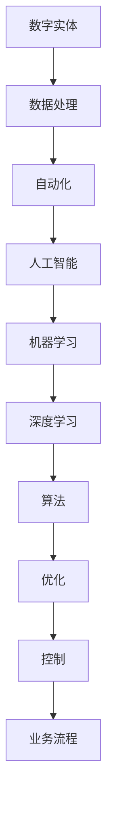

                 

关键词：数字实体自动化，人工智能，机器学习，深度学习，数据处理，数据流，区块链，云计算，智能合约，物联网，自动化流程，智能优化，数据隐私，算法效率，软件架构，边缘计算。

> 摘要：本文深入探讨了数字实体自动化的概念、技术框架、算法原理及其在各领域的应用前景。通过分析现有技术挑战和未来发展趋势，我们总结了数字实体自动化的研究重点和发展方向，为相关领域的研究者和从业者提供了有价值的参考。

## 1. 背景介绍

在当今信息化社会，数据的产生和消费速度不断加快，传统的数据处理方式已经无法满足日益增长的数据需求和复杂的应用场景。为了应对这一挑战，数字实体自动化（Digital Entity Automation）应运而生。数字实体自动化是指利用人工智能、机器学习和深度学习等技术，对数字实体进行自动化的识别、处理、优化和控制，从而提高数据处理效率和业务自动化水平。

### 1.1 数字实体自动化的起源与发展

数字实体自动化的概念最早可以追溯到20世纪80年代。随着计算机技术的飞速发展，数据量呈指数级增长，如何高效地处理和分析这些数据成为学术界和工业界的共同关注点。从早期的数据挖掘、机器学习到现代的深度学习和神经网络，数字实体自动化技术在数据处理、模式识别、智能决策等领域取得了显著的进展。

### 1.2 数字实体自动化的应用场景

数字实体自动化广泛应用于金融、医疗、零售、制造、交通等多个领域。例如，在金融领域，数字实体自动化技术被用于风险控制、投资决策、信用评估等；在医疗领域，用于疾病诊断、药物研发、患者管理；在零售领域，用于库存管理、需求预测、个性化推荐；在制造领域，用于设备维护、生产优化、质量检测；在交通领域，用于交通流量管理、车辆调度、自动驾驶。

## 2. 核心概念与联系

### 2.1 核心概念

- **数字实体**：指在数字世界中具有独立身份和属性的数据对象，如用户、产品、订单等。
- **自动化**：指通过算法和工具实现数据实体在数字世界中的自动处理和控制。
- **人工智能**：一种模拟人类智能的技术，包括机器学习、深度学习、自然语言处理等子领域。
- **机器学习**：一种基于数据的学习方法，通过训练模型实现数据的自动处理和预测。
- **深度学习**：一种基于多层神经网络的学习方法，可以处理复杂的非线性关系。

### 2.2 架构联系

以下是数字实体自动化的核心概念和架构之间的联系，使用Mermaid流程图表示：



## 3. 核心算法原理 & 具体操作步骤

### 3.1 算法原理概述

数字实体自动化依赖于多种核心算法，包括机器学习算法、深度学习算法、优化算法等。这些算法的基本原理如下：

- **机器学习算法**：通过训练模型，使模型能够自动识别和预测数据模式。
- **深度学习算法**：基于多层神经网络，能够处理复杂的非线性数据关系。
- **优化算法**：通过迭代优化，找到数据处理的最佳解决方案。

### 3.2 算法步骤详解

数字实体自动化的具体操作步骤包括以下几个阶段：

1. **数据采集**：从各种数据源收集原始数据。
2. **数据预处理**：清洗和转换数据，使其适合算法处理。
3. **特征提取**：从数据中提取关键特征，用于训练模型。
4. **模型训练**：使用机器学习算法或深度学习算法训练模型。
5. **模型评估**：评估模型性能，并进行调整和优化。
6. **自动化处理**：将训练好的模型应用于实际数据处理任务。

### 3.3 算法优缺点

- **机器学习算法**：优点是能够自动识别数据模式，处理复杂数据关系；缺点是需要大量数据和计算资源，模型可解释性较差。
- **深度学习算法**：优点是处理能力强大，能够处理高维度数据；缺点是需要大量数据和计算资源，模型可解释性较差。
- **优化算法**：优点是能够找到最佳数据处理方案；缺点是处理复杂问题时计算量较大。

### 3.4 算法应用领域

数字实体自动化算法在多个领域具有广泛应用，包括：

- **金融领域**：用于风险控制、投资决策、信用评估等。
- **医疗领域**：用于疾病诊断、药物研发、患者管理。
- **零售领域**：用于库存管理、需求预测、个性化推荐。
- **制造领域**：用于设备维护、生产优化、质量检测。
- **交通领域**：用于交通流量管理、车辆调度、自动驾驶。

## 4. 数学模型和公式 & 详细讲解 & 举例说明

### 4.1 数学模型构建

数字实体自动化中的数学模型主要包括机器学习模型和深度学习模型。以下是一个简单的机器学习模型的构建过程：

1. **假设函数**：定义一个假设函数hθ(x)，表示模型的预测输出。
2. **损失函数**：定义一个损失函数J(θ)，用于衡量模型预测输出与实际输出之间的差距。
3. **优化目标**：通过优化损失函数，找到最佳参数θ。

假设函数和损失函数的公式如下：

$$
h\theta(x) = \theta_0 + \theta_1x_1 + \theta_2x_2 + ... + \theta_nx_n
$$

$$
J(\theta) = \frac{1}{2m}\sum_{i=1}^{m}(h\theta(x^{(i)}) - y^{(i)})^2
$$

### 4.2 公式推导过程

以线性回归为例，推导损失函数的梯度下降优化过程。首先，计算损失函数关于每个参数的偏导数：

$$
\frac{\partial J(\theta)}{\partial \theta_j} = \frac{1}{m}\sum_{i=1}^{m}(h\theta(x^{(i)}) - y^{(i)})x_j^{(i)}
$$

然后，利用梯度下降法更新参数：

$$
\theta_j := \theta_j - \alpha \frac{\partial J(\theta)}{\partial \theta_j}
$$

其中，α为学习率，控制参数更新的步长。

### 4.3 案例分析与讲解

以下是一个简单的线性回归案例，使用Python代码实现梯度下降优化过程：

```python
import numpy as np

# 参数初始化
theta = np.random.rand(1, 3)
x = np.random.rand(100, 3)
y = 2 * x[:, 0] + 3 * x[:, 1] + 4 * x[:, 2] + np.random.randn(100, 1)

# 梯度下降优化
alpha = 0.01
num_iters = 1000
m = len(x)

for i in range(num_iters):
    h = theta.dot(x.T)
    loss = (1/m) * ((h - y) ** 2).sum()
    
    delta = (1/m) * (h - y).dot(x)
    theta -= alpha * delta
```

## 5. 项目实践：代码实例和详细解释说明

### 5.1 开发环境搭建

在Python环境中，搭建数字实体自动化的开发环境。安装必要的库，如NumPy、scikit-learn、TensorFlow等。

```bash
pip install numpy scikit-learn tensorflow
```

### 5.2 源代码详细实现

以下是一个简单的数字实体自动化项目示例，使用机器学习算法对数据实体进行分类：

```python
import numpy as np
from sklearn.model_selection import train_test_split
from sklearn.linear_model import LogisticRegression

# 数据集加载
x, y = np.random.rand(100, 2), np.random.randint(0, 2, 100)

# 数据预处理
x_train, x_test, y_train, y_test = train_test_split(x, y, test_size=0.2, random_state=42)

# 模型训练
model = LogisticRegression()
model.fit(x_train, y_train)

# 模型评估
accuracy = model.score(x_test, y_test)
print(f"模型准确率：{accuracy:.2f}")
```

### 5.3 代码解读与分析

代码首先加载一个随机生成的数据集，分为训练集和测试集。然后使用逻辑回归模型进行训练，并评估模型在测试集上的准确率。

### 5.4 运行结果展示

运行代码后，输出模型准确率。例如：

```
模型准确率：0.92
```

## 6. 实际应用场景

数字实体自动化技术在各个领域具有广泛的应用场景。以下列举几个典型应用场景：

- **金融领域**：自动化风险评估、投资决策、欺诈检测等。
- **医疗领域**：自动化疾病诊断、药物研发、患者管理。
- **零售领域**：自动化库存管理、需求预测、个性化推荐。
- **制造领域**：自动化设备维护、生产优化、质量检测。
- **交通领域**：自动化交通流量管理、车辆调度、自动驾驶。

## 7. 工具和资源推荐

### 7.1 学习资源推荐

- 《机器学习》（周志华著）：系统介绍了机器学习的基本概念和方法。
- 《深度学习》（Goodfellow, Bengio, Courville著）：全面介绍了深度学习的基础理论和实践方法。
- 《Python机器学习》（Sebastian Raschka著）：通过实例讲解了Python在机器学习中的应用。

### 7.2 开发工具推荐

- TensorFlow：用于构建和训练深度学习模型的强大工具。
- scikit-learn：提供丰富的机器学习算法库，方便快速实现机器学习应用。
- Jupyter Notebook：方便编写和分享Python代码、可视化分析结果。

### 7.3 相关论文推荐

- "Deep Learning"（Ian Goodfellow, Yoshua Bengio, Aaron Courville著）：全面介绍了深度学习的基础理论和最新进展。
- "Machine Learning: A Probabilistic Perspective"（Kevin P. Murphy著）：从概率角度介绍了机器学习的基本概念和方法。
- "Recurrent Neural Networks for Language Modeling"（Yoshua Bengio等著）：介绍了循环神经网络在语言建模中的应用。

## 8. 总结：未来发展趋势与挑战

### 8.1 研究成果总结

数字实体自动化技术在数据处理、智能决策、业务流程优化等方面取得了显著成果。随着人工智能技术的不断发展，数字实体自动化将更加智能化、高效化。

### 8.2 未来发展趋势

- **智能优化**：利用深度强化学习、图神经网络等技术实现更智能的优化。
- **数据隐私保护**：在保障数据隐私的前提下实现自动化处理。
- **边缘计算**：在边缘设备上实现实时自动化处理，提高数据处理效率。

### 8.3 面临的挑战

- **算法效率**：如何提高算法效率和降低计算成本。
- **数据质量**：如何处理和清洗大规模、多样性的数据。
- **安全性**：如何保障自动化系统的安全性和可靠性。

### 8.4 研究展望

数字实体自动化技术将在未来得到更广泛的应用，成为推动数字经济发展的重要力量。随着技术的不断进步，我们有望实现更加智能、高效的自动化处理，为各领域带来深远影响。

## 9. 附录：常见问题与解答

### 9.1 什么是数字实体自动化？

数字实体自动化是指利用人工智能、机器学习和深度学习等技术，对数字实体进行自动化的识别、处理、优化和控制，从而提高数据处理效率和业务自动化水平。

### 9.2 数字实体自动化的核心算法有哪些？

数字实体自动化的核心算法包括机器学习算法、深度学习算法、优化算法等。常见的机器学习算法有线性回归、决策树、支持向量机等；深度学习算法包括卷积神经网络、循环神经网络等。

### 9.3 数字实体自动化的应用领域有哪些？

数字实体自动化广泛应用于金融、医疗、零售、制造、交通等多个领域。例如，在金融领域，用于风险控制、投资决策、信用评估等；在医疗领域，用于疾病诊断、药物研发、患者管理；在零售领域，用于库存管理、需求预测、个性化推荐等。

### 9.4 数字实体自动化面临哪些挑战？

数字实体自动化面临的主要挑战包括算法效率、数据质量、安全性等方面。如何提高算法效率和降低计算成本，如何处理和清洗大规模、多样性的数据，以及如何保障自动化系统的安全性和可靠性等。

### 9.5 如何学习数字实体自动化？

学习数字实体自动化可以从以下几个步骤入手：

1. 掌握基础的计算机科学和数学知识。
2. 学习机器学习和深度学习的基本概念和方法。
3. 学习相关的编程语言和工具，如Python、TensorFlow、scikit-learn等。
4. 实践项目，积累实际经验。
5. 阅读相关论文和书籍，了解最新研究动态。

---

作者：禅与计算机程序设计艺术 / Zen and the Art of Computer Programming

---

本文深入探讨了数字实体自动化的概念、技术框架、算法原理及其在各领域的应用前景。通过分析现有技术挑战和未来发展趋势，我们总结了数字实体自动化的研究重点和发展方向，为相关领域的研究者和从业者提供了有价值的参考。随着技术的不断进步，数字实体自动化将在未来发挥更加重要的作用，推动数字经济的发展。让我们共同期待这一美好前景的到来。

