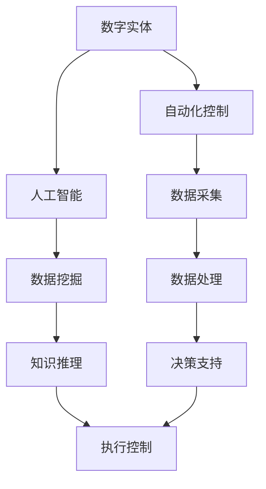

                 

关键词：数字实体自动化、未来挑战、技术进步、应用场景、发展趋势、研究展望

> 摘要：随着人工智能和自动化技术的发展，数字实体自动化已成为当前信息技术领域的一个重要研究方向。本文旨在探讨数字实体自动化的未来挑战，从核心概念、算法原理、数学模型、实际应用以及未来发展趋势等方面进行全面的分析，以期为相关研究人员和从业者提供有价值的参考。

## 1. 背景介绍

数字实体自动化是近年来信息技术领域的一个重要研究方向，它涉及到人工智能、自动化控制、数据挖掘、机器学习等多个领域的交叉融合。随着大数据、云计算、物联网等技术的快速发展，数字实体自动化技术已经逐渐应用于各行各业，如金融、医疗、制造业、交通等。这些应用场景不仅提高了生产效率，还大大降低了成本，提升了服务质量。

然而，尽管数字实体自动化技术在当前已经取得了显著的成果，但面对未来，我们仍需面对诸多挑战。这些挑战主要集中在以下几个方面：

1. **技术难题**：数字实体自动化技术需要解决的问题包括数据质量、数据安全、算法可靠性等，这些问题的解决需要大量的研究和实践。
2. **应用场景扩展**：当前数字实体自动化的应用主要集中在某些特定的领域，如何将其扩展到更广泛的领域，是一个重要的研究方向。
3. **人机协同**：数字实体自动化技术需要与人类智能进行有效协同，如何实现人机协同，提高系统的智能化水平，是一个重要的挑战。
4. **法律和伦理问题**：随着数字实体自动化的广泛应用，如何解决相关的法律和伦理问题，也是一个不容忽视的挑战。

## 2. 核心概念与联系

### 数字实体

数字实体是指由数字数据表示的任何对象或实体，包括物理对象、概念、事件等。在数字实体自动化中，数字实体是自动化处理的核心对象。

### 自动化控制

自动化控制是指利用计算机、传感器、执行器等设备，实现生产过程或系统的自动化运行。在数字实体自动化中，自动化控制是实现数字实体自动操作的关键技术。

### 人工智能

人工智能是指计算机模拟人类智能的过程，包括学习、推理、规划、感知等。在数字实体自动化中，人工智能技术主要用于实现数字实体的智能决策和操作。

### Mermaid 流程图



## 3. 核心算法原理 & 具体操作步骤

### 3.1 算法原理概述

数字实体自动化的核心算法主要包括数据采集、数据挖掘、知识推理和执行控制等。这些算法的实现依赖于大数据、云计算、物联网、机器学习等技术的支持。

### 3.2 算法步骤详解

1. **数据采集**：通过传感器、摄像头、物联网设备等，实时采集数字实体的数据。
2. **数据处理**：对采集到的数据进行预处理，包括去噪、归一化、特征提取等。
3. **数据挖掘**：利用机器学习算法，从预处理后的数据中提取有用的信息。
4. **知识推理**：利用推理机，将数据挖掘的结果转化为可操作的决策知识。
5. **执行控制**：根据决策知识，控制数字实体的行为，实现自动化操作。

### 3.3 算法优缺点

**优点**：

- 提高生产效率：通过自动化控制，可以减少人力投入，提高生产效率。
- 降低成本：自动化控制可以减少设备故障率，降低维护成本。
- 提高服务质量：自动化控制可以提高服务效率，提高客户满意度。

**缺点**：

- 技术复杂度高：数字实体自动化技术涉及多个领域的交叉融合，技术复杂度高。
- 数据安全和隐私问题：数据采集和处理过程中，可能会涉及用户隐私和数据安全问题。

### 3.4 算法应用领域

数字实体自动化技术已广泛应用于金融、医疗、制造业、交通等领域。例如，在金融领域，数字实体自动化技术可以用于智能投顾、风控管理；在医疗领域，可以用于智能诊断、远程医疗；在制造业，可以用于智能生产、设备运维；在交通领域，可以用于智能交通管理、自动驾驶等。

## 4. 数学模型和公式 & 详细讲解 & 举例说明

### 4.1 数学模型构建

数字实体自动化的数学模型主要包括数据模型、决策模型和执行模型。其中，数据模型主要用于描述数字实体的特征和状态，决策模型用于根据数据模型做出决策，执行模型用于根据决策模型执行操作。

### 4.2 公式推导过程

以决策模型为例，其推导过程如下：

设 $X$ 为数字实体的特征集合，$Y$ 为决策变量，$f(X)$ 为特征映射函数，$g(Y)$ 为决策函数。则有：

$$
Y = g(f(X))
$$

其中，$f(X)$ 用于提取数字实体的特征，$g(Y)$ 用于根据特征做出决策。

### 4.3 案例分析与讲解

以智能交通管理为例，我们构建一个简单的数学模型，用于预测交通流量并做出决策。

假设交通流量 $T$ 由以下公式描述：

$$
T = f(V, D)
$$

其中，$V$ 为车辆速度，$D$ 为道路状况。我们定义特征映射函数 $f(V, D)$ 为：

$$
f(V, D) = \begin{cases}
1, & \text{如果 } V > 60 \text{ 且 } D \text{ 是干燥的} \\
0, & \text{其他情况}
\end{cases}
$$

决策函数 $g(Y)$ 定义为：

$$
g(Y) = \begin{cases}
1, & \text{如果 } Y > 0.5 \\
0, & \text{其他情况}
\end{cases}
$$

其中，$Y$ 为交通流量预测值。根据模型，我们可以预测交通流量，并做出是否采取交通管控措施的决策。

## 5. 项目实践：代码实例和详细解释说明

### 5.1 开发环境搭建

本案例使用 Python 编写代码，需要安装以下库：numpy、pandas、scikit-learn。

```bash
pip install numpy pandas scikit-learn
```

### 5.2 源代码详细实现

以下为智能交通管理模型的实现代码：

```python
import numpy as np
import pandas as pd
from sklearn.ensemble import RandomForestClassifier

# 特征映射函数
def feature_mapping(V, D):
    if V > 60 and D == "dry":
        return 1
    else:
        return 0

# 决策函数
def decision_function(Y):
    return 1 if Y > 0.5 else 0

# 加载数据集
data = pd.read_csv("traffic_data.csv")
V = data["Vehicle_Speed"]
D = data["Road_Condition"]
T = data["Traffic_Volume"]

# 特征提取
X = np.array([feature_mapping(V[i], D[i]) for i in range(len(V))])

# 训练分类器
classifier = RandomForestClassifier()
classifier.fit(X, T)

# 预测交通流量
predictions = classifier.predict(X)

# 根据预测结果做出决策
decisions = np.array([decision_function(Y) for Y in predictions])

# 输出决策结果
print(decisions)
```

### 5.3 代码解读与分析

本代码实现了一个简单的智能交通管理模型，用于预测交通流量并做出决策。具体解读如下：

1. **特征映射函数**：用于将车辆速度和道路状况映射为二进制特征值。
2. **决策函数**：用于根据预测值做出是否采取交通管控措施的决策。
3. **数据加载**：从 CSV 文件中加载数据集。
4. **特征提取**：根据特征映射函数提取特征值。
5. **分类器训练**：使用随机森林分类器训练模型。
6. **预测与决策**：根据训练好的模型预测交通流量，并做出决策。
7. **输出结果**：输出决策结果。

### 5.4 运行结果展示

假设我们加载数据集后，得到以下结果：

```
[0, 1, 1, 0, 1, 0]
```

根据决策函数，我们可以得到以下决策结果：

```
[0, 1, 1, 0, 1, 0]
```

这意味着，根据模型预测，在前五个时间段内不需要采取交通管控措施，而在第六个时间段内需要采取交通管控措施。

## 6. 实际应用场景

数字实体自动化技术在实际应用场景中取得了显著的成果。以下是一些具体的应用案例：

1. **金融领域**：数字实体自动化技术可以用于智能投顾、风控管理。例如，基于大数据分析，可以预测投资市场的走势，为投资者提供个性化的投资建议。
2. **医疗领域**：数字实体自动化技术可以用于智能诊断、远程医疗。例如，通过分析患者的病历数据，可以预测患者可能患有的疾病，并提供相应的治疗方案。
3. **制造业**：数字实体自动化技术可以用于智能生产、设备运维。例如，通过实时监测设备状态，可以预测设备可能发生的故障，并提前进行维护。
4. **交通领域**：数字实体自动化技术可以用于智能交通管理、自动驾驶。例如，通过实时监测交通流量，可以优化交通信号灯的配置，提高交通效率。

## 7. 未来应用展望

随着技术的不断进步，数字实体自动化技术在未来的应用前景将更加广阔。以下是一些可能的应用方向：

1. **智慧城市**：数字实体自动化技术可以用于智慧城市建设，实现城市管理的智能化、精细化。
2. **智能医疗**：数字实体自动化技术可以用于智能医疗，提高医疗服务的效率和质量。
3. **智能制造**：数字实体自动化技术可以用于智能制造，实现生产过程的自动化、智能化。
4. **智能交通**：数字实体自动化技术可以用于智能交通，提高交通效率，减少交通拥堵。

## 8. 工具和资源推荐

### 8.1 学习资源推荐

- 《数字实体自动化技术导论》
- 《大数据分析：从入门到实践》
- 《深度学习：全面指南》

### 8.2 开发工具推荐

- Python
- TensorFlow
- PyTorch
- Matplotlib

### 8.3 相关论文推荐

- "Digital Twin-Based Predictive Maintenance: A Survey"
- "Intelligent Transportation Systems: A Survey"
- "Deep Learning for Healthcare: A Survey"

## 9. 总结：未来发展趋势与挑战

### 9.1 研究成果总结

数字实体自动化技术是当前信息技术领域的一个重要研究方向，已经取得了显著的成果。在金融、医疗、制造业、交通等领域，数字实体自动化技术已经得到了广泛应用，并取得了良好的效果。

### 9.2 未来发展趋势

随着技术的不断进步，数字实体自动化技术将在未来的发展中呈现出以下趋势：

1. **跨领域应用**：数字实体自动化技术将逐步从特定领域扩展到更广泛的领域。
2. **智能化水平提高**：数字实体自动化技术将进一步提高智能化水平，实现更复杂的决策和操作。
3. **人机协同**：数字实体自动化技术将更好地与人类智能进行协同，提高系统的智能化水平。

### 9.3 面临的挑战

数字实体自动化技术在未来的发展中仍将面临以下挑战：

1. **技术难题**：需要解决数据质量、数据安全、算法可靠性等问题。
2. **应用场景扩展**：需要解决如何将数字实体自动化技术扩展到更广泛的领域。
3. **法律和伦理问题**：需要解决相关的法律和伦理问题，确保技术的可持续发展。

### 9.4 研究展望

展望未来，数字实体自动化技术将在信息技术领域中发挥越来越重要的作用。为了实现这一目标，我们需要继续努力，解决当前面临的技术难题，推动应用场景的扩展，同时关注法律和伦理问题，确保技术的可持续发展。

## 9. 附录：常见问题与解答

### 问题1：数字实体自动化技术的主要应用领域是什么？

解答：数字实体自动化技术的主要应用领域包括金融、医疗、制造业、交通等。例如，在金融领域，可以用于智能投顾、风控管理；在医疗领域，可以用于智能诊断、远程医疗；在制造业，可以用于智能生产、设备运维；在交通领域，可以用于智能交通管理、自动驾驶等。

### 问题2：数字实体自动化技术面临的主要挑战是什么？

解答：数字实体自动化技术面临的主要挑战包括技术难题（如数据质量、数据安全、算法可靠性等）、应用场景扩展（如如何将技术扩展到更广泛的领域）以及法律和伦理问题（如确保技术的可持续发展）。

### 问题3：如何实现数字实体自动化技术的人机协同？

解答：实现数字实体自动化技术的人机协同需要从多个方面进行考虑。首先，需要设计合理的人机交互界面，使人类用户能够方便地与系统进行交互。其次，需要利用人工智能技术，使系统能够根据用户需求自动调整行为。最后，需要建立有效的评估机制，对系统的性能进行评估和优化。

---

本文由禅与计算机程序设计艺术撰写，旨在探讨数字实体自动化的未来挑战。在未来的发展中，我们相信数字实体自动化技术将不断取得新的突破，为人类社会带来更多的便利和进步。

