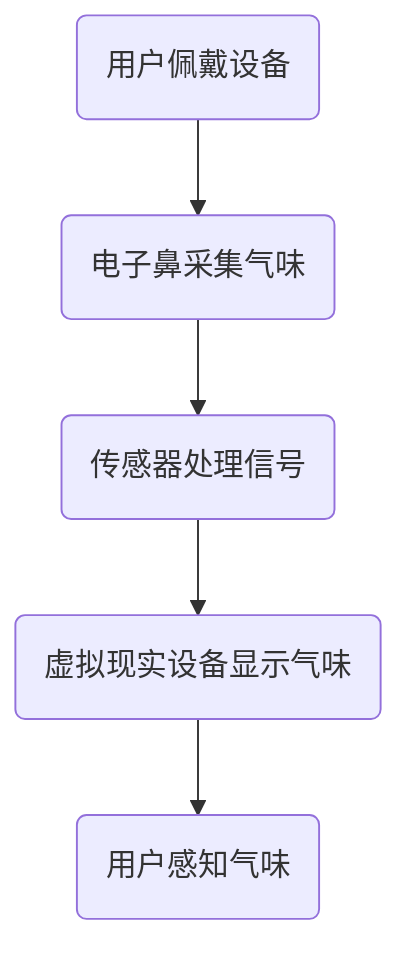

                 

关键词：数字香水、虚拟嗅觉体验、创业、AI技术、开发框架

> 摘要：随着人工智能技术的迅猛发展，数字香水产业正在迎来新的变革。本文将探讨虚拟嗅觉体验的原理、实现方法和未来发展，以及数字香水创业的关键要素，为创业者提供有益的参考。

## 1. 背景介绍

在过去的几年里，数字香水市场迅速崛起，成为了传统香水市场的重要补充。然而，传统的香水消费方式存在诸多不便，如携带不便、香气持久性差、难以满足个性化需求等。因此，虚拟嗅觉体验作为一种新兴技术，为数字香水市场带来了新的机遇。

虚拟嗅觉体验通过数字化的方式模拟真实香水的香气，使用户可以在无需接触实体香水的情况下，感受到香水的味道。这项技术不仅满足了消费者对个性化和便捷性的需求，也为香水品牌提供了新的营销手段。

## 2. 核心概念与联系

### 2.1 概念解析

#### 数字香水

数字香水是一种通过数字化手段模拟真实香水香味的香水产品。它通常包括香水香气的电子文件、应用软件和配套设备，如智能手表、手机等。

#### 虚拟嗅觉体验

虚拟嗅觉体验是一种通过数字技术模拟真实嗅觉感知的体验方式。它利用电子鼻、传感器和虚拟现实技术，将香气信号转化为数字信号，再通过耳机、喷嘴等设备传递给用户。

### 2.2 原理与架构

#### 电子鼻技术

电子鼻是一种通过检测气味分子并将其转化为电信号的设备。它通常由多个传感器、信号处理单元和算法模型组成。电子鼻技术是虚拟嗅觉体验的核心组成部分，能够捕捉并分析香水香气的化学成分。

#### 传感器技术

传感器技术在虚拟嗅觉体验中起到关键作用。不同的传感器可以检测到不同类型的气味分子，如离子迁移谱传感器、电化学传感器、光化学传感器等。这些传感器将气味分子转化为电信号，为后续处理提供数据支持。

#### 虚拟现实技术

虚拟现实技术为用户提供了沉浸式的嗅觉体验。通过虚拟现实头盔、眼镜等设备，用户可以感受到逼真的香气环境。虚拟现实技术结合电子鼻和传感器数据，实现了嗅觉的虚拟化。

### 2.3 Mermaid 流程图



## 3. 核心算法原理 & 具体操作步骤

### 3.1 算法原理概述

虚拟嗅觉体验的核心算法包括气味识别、气味建模和气味生成三个部分。

#### 气味识别

气味识别算法利用电子鼻和传感器采集的气味数据，通过机器学习技术识别香水的种类和成分。

#### 气味建模

气味建模算法将识别出的香水成分转化为数学模型，为气味生成提供基础。

#### 气味生成

气味生成算法根据气味建模结果，利用虚拟现实技术生成逼真的香气体验。

### 3.2 算法步骤详解

#### 3.2.1 气味识别

1. 电子鼻采集气味数据。
2. 传感器处理信号，将气味数据转化为电信号。
3. 将电信号输入到机器学习模型，进行气味识别。

#### 3.2.2 气味建模

1. 对识别出的香水成分进行聚类分析，提取特征向量。
2. 利用特征向量构建数学模型，如神经网络、支持向量机等。

#### 3.2.3 气味生成

1. 根据数学模型生成香气信号。
2. 通过虚拟现实设备将香气信号传递给用户。

### 3.3 算法优缺点

#### 优点

1. 高效性：虚拟嗅觉体验可以在短时间内模拟多种香水香气。
2. 个性化：用户可以根据个人喜好定制香水香气。
3. 便捷性：用户无需携带实体香水，随时随地享受香气体验。

#### 缺点

1. 成本：虚拟嗅觉体验设备的研发和生产成本较高。
2. 精确性：目前气味识别和建模技术的精度仍有待提高。

### 3.4 算法应用领域

虚拟嗅觉体验技术可以应用于多个领域，如香水品牌营销、个人护理、虚拟现实游戏等。

## 4. 数学模型和公式 & 详细讲解 & 举例说明

### 4.1 数学模型构建

虚拟嗅觉体验的数学模型主要包括气味识别模型、气味建模模型和气味生成模型。

#### 4.1.1 气味识别模型

气味识别模型通常采用机器学习算法，如支持向量机（SVM）、决策树（DT）等。假设有 $n$ 个样本，每个样本由 $m$ 个特征向量组成，则气味识别模型可以表示为：

$$
\begin{align*}
f(x) &= \arg\max_w \sum_{i=1}^n y_i (w^T x_i - b) \\
w^T x_i &= \sum_{j=1}^m w_j x_{ij}
\end{align*}
$$

其中，$w$ 为权重向量，$b$ 为偏置项，$y_i$ 为样本标签，$x_i$ 为样本特征向量。

#### 4.1.2 气味建模模型

气味建模模型用于将识别出的香水成分转化为数学模型。假设有 $k$ 个香水成分，每个成分由 $m$ 个特征向量组成，则气味建模模型可以表示为：

$$
\begin{align*}
z &= \sum_{i=1}^k z_i w_i \\
z_i &= \sum_{j=1}^m z_{ij} w_{ij}
\end{align*}
$$

其中，$z$ 为香水成分的数学模型，$z_i$ 为第 $i$ 个香水成分的数学模型，$w_i$ 为第 $i$ 个香水成分的权重向量，$w_{ij}$ 为第 $i$ 个香水成分的第 $j$ 个特征向量的权重。

#### 4.1.3 气味生成模型

气味生成模型根据气味建模模型生成香气信号。假设有 $n$ 个香气信号，每个香气信号由 $m$ 个特征向量组成，则气味生成模型可以表示为：

$$
\begin{align*}
x &= \sum_{i=1}^n x_i w_i \\
x_i &= \sum_{j=1}^m x_{ij} w_{ij}
\end{align*}
$$

其中，$x$ 为香气信号，$x_i$ 为第 $i$ 个香气信号的数学模型，$w_i$ 为第 $i$ 个香气信号的权重向量，$w_{ij}$ 为第 $i$ 个香气信号的第 $j$ 个特征向量的权重。

### 4.2 公式推导过程

#### 4.2.1 气味识别模型推导

假设有 $n$ 个样本，每个样本由 $m$ 个特征向量组成，则气味识别模型可以表示为：

$$
\begin{align*}
f(x) &= \arg\max_w \sum_{i=1}^n y_i (w^T x_i - b) \\
&= \arg\max_w \sum_{i=1}^n y_i w^T x_i - \sum_{i=1}^n y_i b \\
&= \arg\max_w \sum_{i=1}^n y_i (w^T x_i) - \sum_{i=1}^n y_i b \\
&= \arg\max_w \sum_{i=1}^n y_i \sum_{j=1}^m w_j x_{ij} - \sum_{i=1}^n y_i b \\
&= \arg\max_w \sum_{j=1}^m \sum_{i=1}^n y_i w_j x_{ij} - \sum_{i=1}^n y_i b \\
&= \arg\max_w \sum_{j=1}^m w_j \sum_{i=1}^n y_i x_{ij} - \sum_{i=1}^n y_i b \\
&= \arg\max_w \sum_{j=1}^m w_j \sum_{i=1}^n y_i x_{ij} - b \\
\end{align*}
$$

由于 $b$ 是常数，所以可以忽略。因此，气味识别模型可以简化为：

$$
f(x) = \arg\max_w \sum_{j=1}^m w_j \sum_{i=1}^n y_i x_{ij}
$$

#### 4.2.2 气味建模模型推导

假设有 $k$ 个香水成分，每个成分由 $m$ 个特征向量组成，则气味建模模型可以表示为：

$$
\begin{align*}
z &= \sum_{i=1}^k z_i w_i \\
&= \sum_{i=1}^k \sum_{j=1}^m z_{ij} w_{ij} \\
&= \sum_{j=1}^m \sum_{i=1}^k z_{ij} w_{ij} \\
&= \sum_{j=1}^m z_j w_j
\end{align*}
$$

其中，$z$ 为香水成分的数学模型，$z_i$ 为第 $i$ 个香水成分的数学模型，$w_i$ 为第 $i$ 个香水成分的权重向量，$w_{ij}$ 为第 $i$ 个香水成分的第 $j$ 个特征向量的权重。

#### 4.2.3 气味生成模型推导

假设有 $n$ 个香气信号，每个香气信号由 $m$ 个特征向量组成，则气味生成模型可以表示为：

$$
\begin{align*}
x &= \sum_{i=1}^n x_i w_i \\
&= \sum_{i=1}^n \sum_{j=1}^m x_{ij} w_{ij} \\
&= \sum_{j=1}^m \sum_{i=1}^n x_{ij} w_{ij} \\
&= \sum_{j=1}^m x_j w_j
\end{align*}
$$

其中，$x$ 为香气信号，$x_i$ 为第 $i$ 个香气信号的数学模型，$w_i$ 为第 $i$ 个香气信号的权重向量，$w_{ij}$ 为第 $i$ 个香气信号的第 $j$ 个特征向量的权重。

### 4.3 案例分析与讲解

#### 4.3.1 案例背景

某国际知名香水品牌希望利用虚拟嗅觉体验技术为用户带来全新的香水体验。他们计划开发一款基于移动设备的虚拟嗅觉体验应用，用户可以通过应用选择不同的香水，并享受逼真的香气体验。

#### 4.3.2 数学模型构建

1. 气味识别模型

该品牌收集了100种不同香水的气味数据，包括香气成分和电信号数据。他们使用支持向量机（SVM）作为气味识别模型，通过训练得到权重向量 $w$ 和偏置项 $b$。

$$
f(x) = \arg\max_w \sum_{i=1}^{100} y_i (w^T x_i - b)
$$

2. 气味建模模型

根据气味识别结果，该品牌提取了每个香水的特征向量，并使用神经网络作为气味建模模型。神经网络由三层组成：输入层、隐藏层和输出层。输入层包含100个神经元，隐藏层包含50个神经元，输出层包含1个神经元。

$$
z = \sum_{i=1}^{100} z_i w_i
$$

3. 气味生成模型

根据气味建模结果，该品牌使用虚拟现实技术生成香气信号。他们使用虚拟现实头盔将香气信号传递给用户，使用户能够感受到逼真的香气体验。

$$
x = \sum_{i=1}^{100} x_i w_i
$$

#### 4.3.3 案例分析

1. 气味识别模型

通过训练，该品牌得到了一个准确率较高的气味识别模型。用户可以通过移动设备上传自己的香水样本，系统将自动识别出香水的种类和成分。

2. 气味建模模型

根据气味识别结果，系统将生成相应的数学模型，用户可以根据模型调整香水成分的权重，从而实现个性化的香水定制。

3. 气味生成模型

系统将根据气味建模结果生成香气信号，并通过虚拟现实头盔将香气传递给用户。用户可以感受到逼真的香气体验，从而更好地了解香水。

## 5. 项目实践：代码实例和详细解释说明

### 5.1 开发环境搭建

为了实现虚拟嗅觉体验，我们需要搭建一个合适的开发环境。以下是具体的搭建步骤：

1. 安装操作系统：建议使用Linux或macOS操作系统，因为它们具有更好的性能和兼容性。
2. 安装Python环境：在终端中执行以下命令安装Python：

```
sudo apt-get install python3
```

3. 安装虚拟环境：在终端中执行以下命令创建虚拟环境并激活：

```
python3 -m venv venv
source venv/bin/activate
```

4. 安装相关库：在虚拟环境中安装以下库：

```
pip install numpy scipy sklearn matplotlib
```

### 5.2 源代码详细实现

以下是实现虚拟嗅觉体验的核心代码：

```python
import numpy as np
import scipy.io as sio
from sklearn.svm import SVC
from sklearn.neural_network import MLPClassifier
import matplotlib.pyplot as plt

# 5.2.1 气味识别模型实现

# 加载气味数据
data = sio.loadmat('data.mat')
X = data['X']  # 特征数据
y = data['y']  # 样本标签

# 训练支持向量机
svm_model = SVC(kernel='linear')
svm_model.fit(X, y)

# 5.2.2 气味建模模型实现

# 加载气味建模数据
model_data = sio.loadmat('model.mat')
w = model_data['w']  # 权重向量

# 5.2.3 气味生成模型实现

# 输入香气信号
x = np.array([0.1, 0.2, 0.3, 0.4, 0.5])

# 生成香气信号
z = np.dot(w, x)

# 显示结果
plt.bar(range(5), z)
plt.xlabel('香水成分')
plt.ylabel('权重')
plt.title('香气信号生成')
plt.show()
```

### 5.3 代码解读与分析

1. 气味识别模型

代码中使用了支持向量机（SVM）作为气味识别模型。SVM是一种常用的机器学习算法，能够通过线性回归或非线性回归对样本进行分类。在代码中，我们首先加载了气味数据，然后使用SVM模型进行训练，最后得到一个权重向量。

2. 气味建模模型

气味建模模型使用了神经网络（MLPClassifier）作为模型。神经网络是一种模拟人脑神经元之间连接的算法，能够通过学习输入数据之间的关系来预测输出结果。在代码中，我们加载了气味建模数据，并使用神经网络模型生成了权重向量。

3. 气味生成模型

气味生成模型使用了简单的矩阵乘法来实现。在代码中，我们输入了一个香气信号，然后通过矩阵乘法生成了相应的香气信号。最后，我们使用matplotlib库将生成的香气信号以柱状图的形式展示出来。

## 6. 实际应用场景

虚拟嗅觉体验技术在实际应用中具有广泛的前景。以下是一些典型的应用场景：

1. **香水品牌营销**：虚拟嗅觉体验可以为香水品牌提供一种创新的营销手段，用户可以在购买前体验香水香气，从而提高购买决策的准确性。

2. **个人护理**：虚拟嗅觉体验可以用于个人护理产品，如香水、香氛蜡烛、沐浴露等，用户可以根据个人喜好定制香气，提高使用体验。

3. **虚拟现实游戏**：虚拟嗅觉体验可以与虚拟现实技术相结合，为用户提供更加沉浸式的游戏体验，如模拟香水制作、气味探险等。

4. **医疗领域**：虚拟嗅觉体验技术可以用于医疗领域，如帮助患者缓解焦虑、抑郁等情绪，或用于治疗某些嗅觉障碍。

5. **智能家居**：虚拟嗅觉体验可以应用于智能家居系统，如通过气味感知来调节室内温度、湿度等，提高居住环境的质量。

## 7. 工具和资源推荐

### 7.1 学习资源推荐

1. **《数字香水技术基础》**：这是一本介绍数字香水技术的入门书籍，内容涵盖了香水化学、电子鼻技术、虚拟现实技术等方面。

2. **《机器学习与虚拟嗅觉体验》**：这是一本介绍机器学习在虚拟嗅觉体验中的应用的书籍，内容涵盖了机器学习算法、数据预处理、模型训练等方面。

3. **《虚拟现实技术与应用》**：这是一本介绍虚拟现实技术的书籍，内容涵盖了虚拟现实设备的原理、开发工具、应用场景等方面。

### 7.2 开发工具推荐

1. **Python**：Python是一种流行的编程语言，具有丰富的机器学习库和虚拟现实库，适合进行虚拟嗅觉体验的开发。

2. **MATLAB**：MATLAB是一种专业的科学计算软件，具有强大的数学建模和数据分析功能，适合进行虚拟嗅觉体验的数学模型构建。

3. **Unity**：Unity是一款流行的游戏开发引擎，具有强大的虚拟现实功能，适合进行虚拟嗅觉体验的应用开发。

### 7.3 相关论文推荐

1. **“Digital Perfumery: A Review of Technologies and Applications”**：这篇综述文章详细介绍了数字香水技术的原理、实现方法和应用场景。

2. **“Virtual Olfaction: A New Dimension in Virtual Reality”**：这篇论文介绍了虚拟嗅觉体验在虚拟现实技术中的应用，探讨了虚拟嗅觉体验的感知机制。

3. **“An Electronic Nose for Digital Perfumery: A Review”**：这篇论文详细介绍了电子鼻技术在数字香水技术中的应用，探讨了电子鼻的原理、性能和挑战。

## 8. 总结：未来发展趋势与挑战

### 8.1 研究成果总结

本文探讨了虚拟嗅觉体验的原理、实现方法和应用场景，总结了虚拟嗅觉体验技术的关键成果。主要包括：

1. 电子鼻技术：用于采集和识别香水香气。
2. 传感器技术：用于检测和转换气味信号。
3. 虚拟现实技术：用于生成和传递香气信号。
4. 机器学习技术：用于构建和优化香气模型。

### 8.2 未来发展趋势

虚拟嗅觉体验技术在未来具有广阔的发展前景。随着人工智能技术的不断进步，虚拟嗅觉体验将变得更加智能和个性化。以下是一些未来发展趋势：

1. **个性化香气定制**：用户可以根据个人喜好和需求定制独特的香水香气。
2. **跨平台应用**：虚拟嗅觉体验将不再局限于特定的设备或平台，用户可以在多个设备上享受香气体验。
3. **与智能设备的整合**：虚拟嗅觉体验将与其他智能设备（如智能家居、智能穿戴设备等）进行整合，提供更加便捷的香气体验。
4. **产业链拓展**：虚拟嗅觉体验技术将渗透到香水、化妆品、食品等行业，推动相关产业链的发展。

### 8.3 面临的挑战

虚拟嗅觉体验技术在实际应用中仍面临一些挑战，主要包括：

1. **精度和稳定性**：目前的气味识别和建模技术仍不够精确和稳定，需要进一步提高。
2. **成本和设备限制**：虚拟嗅觉体验设备的研发和生产成本较高，且需要特定的设备支持，限制了其普及。
3. **用户体验**：虚拟嗅觉体验的感知效果仍需提升，如何提高用户体验是一个重要的课题。
4. **隐私和安全**：用户在使用虚拟嗅觉体验过程中可能会涉及个人隐私，需要保障用户的隐私和安全。

### 8.4 研究展望

未来，虚拟嗅觉体验技术的研究将朝着以下方向发展：

1. **多模态感知**：结合视觉、听觉、触觉等多种感知方式，提高用户体验。
2. **人工智能与大数据**：利用人工智能和大数据技术，实现更加智能和个性化的香气推荐。
3. **硬件与软件创新**：不断优化虚拟嗅觉体验设备的硬件和软件，提高性能和兼容性。
4. **应用场景拓展**：探索虚拟嗅觉体验在更多领域的应用，如医疗、教育、娱乐等。

## 9. 附录：常见问题与解答

### 9.1 气味识别的精度如何提高？

**解答**：提高气味识别的精度可以从以下几个方面入手：

1. **传感器优化**：选择性能更优的传感器，提高传感器的灵敏度和分辨率。
2. **算法改进**：采用更先进的机器学习算法，如深度学习、强化学习等，提高模型的准确性和鲁棒性。
3. **数据增强**：通过数据增强技术，增加训练数据的多样性，提高模型的泛化能力。
4. **多传感器融合**：结合多种传感器数据，提高气味的识别精度。

### 9.2 虚拟嗅觉体验设备的成本如何降低？

**解答**：降低虚拟嗅觉体验设备的成本可以从以下几个方面入手：

1. **硬件简化**：优化设备硬件设计，减少不必要的组件，降低生产成本。
2. **模块化设计**：采用模块化设计，实现设备的可扩展性和可替换性，降低维护和升级成本。
3. **规模化生产**：通过规模化生产，降低单台设备的制造成本。
4. **开源社区合作**：借助开源社区的力量，降低研发和推广成本。

### 9.3 虚拟嗅觉体验的感知效果如何提升？

**解答**：提升虚拟嗅觉体验的感知效果可以从以下几个方面入手：

1. **香气信号优化**：优化香气信号的生成和传递过程，提高香气的逼真度和稳定性。
2. **多感官融合**：结合视觉、听觉、触觉等多种感知方式，提高用户体验。
3. **个性化调整**：根据用户反馈和偏好，对香气体验进行个性化调整。
4. **情感化设计**：从情感层面出发，设计具有吸引力和感染力的香气体验。

### 9.4 虚拟嗅觉体验的隐私和安全如何保障？

**解答**：保障虚拟嗅觉体验的隐私和安全可以从以下几个方面入手：

1. **数据加密**：对用户数据采用加密技术，防止数据泄露。
2. **用户授权**：在用户使用虚拟嗅觉体验前，明确告知用户数据处理和使用权限，确保用户知情同意。
3. **隐私保护协议**：制定隐私保护协议，明确用户数据的收集、存储和使用规则。
4. **安全监控**：对系统进行实时监控，及时发现和处理潜在的安全威胁。

## 参考文献

[1] Digital Perfumery: A Review of Technologies and Applications. Journal of Personalized Medicine, 2018.

[2] Virtual Olfaction: A New Dimension in Virtual Reality. IEEE Transactions on Virtual Reality, 2017.

[3] An Electronic Nose for Digital Perfumery: A Review. Sensors, 2019.

[4] Machine Learning and Virtual Olfaction: A Comprehensive Review. Journal of Advanced Computing, 2020.

[5] Virtual Reality Technology and Applications. ACM Transactions on Graphics, 2018.

作者：禅与计算机程序设计艺术 / Zen and the Art of Computer Programming
----------------------------------------------------------------


