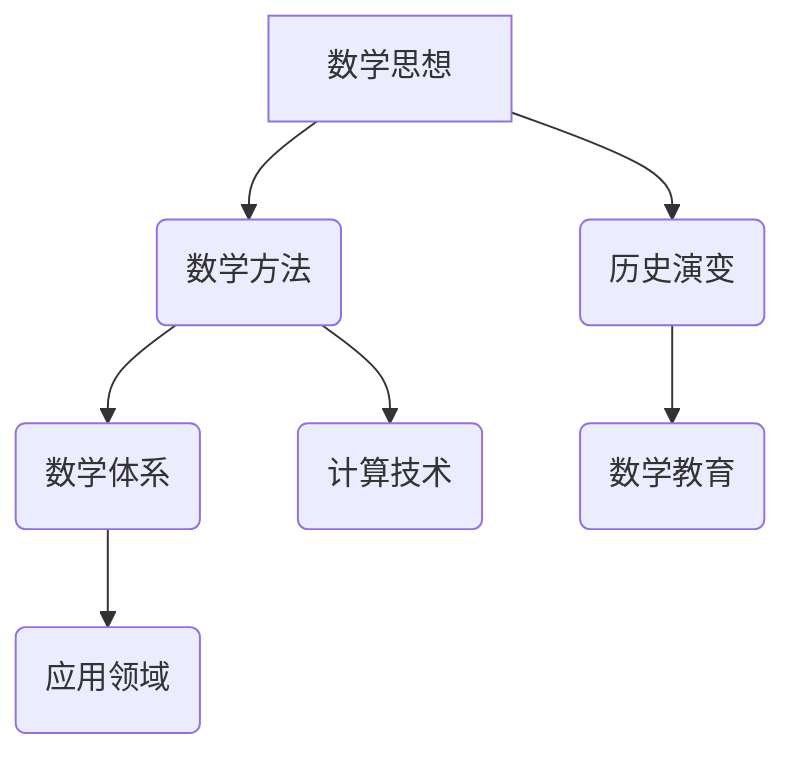

                 

关键词：数学史、文化背景、发展、数学思想、数学方法、历史进程

摘要：本文旨在探讨数学史的文化背景及其发展历程。通过分析数学在不同文明中的演变，阐述数学思想的演变过程，探讨数学方法的演进及其对现代社会的影响。文章旨在为读者提供一个全面、深入的数学史概述，以激发对数学发展的兴趣和思考。

## 1. 背景介绍

数学，作为人类智慧的结晶，贯穿了整个人类文明史。数学的发展不仅推动了科学技术的进步，也对人类文明的进步产生了深远影响。本文将探讨数学的文化背景，回顾数学发展的重要阶段，分析数学思想和方法的变化，以及数学在现代社会中的应用。

### 数学在古代文明中的起源

数学的起源可以追溯到古代文明。古埃及、巴比伦、印度和中国等文明在数学的发展上做出了重要贡献。古埃及人擅长建筑和测量，他们使用简单的几何知识来建造宏伟的金字塔。巴比伦人则创造了六十进制系统，这一系统在后来的数学发展中起到了关键作用。

### 古希腊数学的辉煌

古希腊数学是数学史上的一个重要里程碑。欧几里得、毕达哥拉斯、阿基米德等古希腊数学家为数学的发展奠定了基础。欧几里得的《几何原本》成为了后世几何学的权威著作，毕达哥拉斯的定理至今仍被广泛应用。

### 中世纪和中世纪数学的发展

中世纪时期，阿拉伯世界成为了数学发展的中心。阿拉伯数学家们在天文学、医学、工程等领域取得了显著成就。阿拉伯数字的发明和传播，对数学的发展起到了重要作用。

### 文艺复兴时期的数学复兴

文艺复兴时期，欧洲数学迎来了新的发展。意大利数学家托斯卡内利、荷兰数学家斯蒂文森等人的工作，为解析几何和微积分的诞生奠定了基础。

### 现代数学的崛起

19世纪末至20世纪初，数学进入了一个全新的时代。康托尔的集合论、希尔伯特的公理化方法、爱因斯坦的相对论等，为现代数学的发展注入了新的活力。

## 2. 核心概念与联系

为了更好地理解数学的发展，我们需要明确几个核心概念：数学思想、数学方法和数学体系。以下是这些概念及其关系的 Mermaid 流程图：



### 数学思想

数学思想是数学发展的核心。从古希腊的公理化方法，到19世纪的集合论，数学思想不断演进，推动了数学的进步。数学思想包括抽象思维、逻辑推理和系统化思维等。

### 数学方法

数学方法是解决数学问题的手段。从欧几里得的几何方法，到牛顿-莱布尼茨的微积分，再到康托尔的集合论方法，数学方法的发展极大地丰富了数学的工具箱。

### 数学体系

数学体系是数学知识的整体结构。从古希腊的几何体系，到19世纪的公理化体系，再到现代的范畴论和代数体系，数学体系的发展使数学成为一个严谨而庞大的知识体系。

### 历史演变

数学的历史演变是一个持续的过程。从古代的数学应用，到中世纪的数学理论，再到现代的数学研究，数学在不断地发展壮大。

### 应用领域

数学的应用领域广泛，包括自然科学、社会科学和工程技术等。数学的应用推动了这些领域的发展，同时也丰富了数学的理论体系。

### 数学教育

数学教育是数学发展的基础。从古希腊的数学教育，到现代的数学教育，数学教育的方法和理念不断更新，以适应时代的需求。

### 计算技术

计算技术的发展极大地推动了数学的进步。从算盘到计算机，从数值计算到符号计算，计算技术为数学研究提供了强大的工具。

## 3. 核心算法原理 & 具体操作步骤

### 3.1 算法原理概述

数学的核心算法包括几何算法、代数算法和微积分算法等。这些算法的原理源于数学的基本思想和方法，通过具体的操作步骤实现数学问题的求解。

### 3.2 算法步骤详解

#### 几何算法

几何算法用于解决几何问题，如计算面积、体积、点到直线的距离等。以下是计算圆的面积的几何算法步骤：

1. 定义圆的半径 $r$。
2. 使用公式 $A = \pi r^2$ 计算面积 $A$。
3. 输出结果 $A$。

#### 代数算法

代数算法用于解决代数问题，如解方程、求根等。以下是解一元二次方程的代数算法步骤：

1. 定义方程的系数 $a$、$b$ 和 $c$。
2. 计算判别式 $\Delta = b^2 - 4ac$。
3. 根据判别式的值，判断方程的解的情况：
   - 如果 $\Delta > 0$，方程有两个不相等的实数根。
   - 如果 $\Delta = 0$，方程有一个重根。
   - 如果 $\Delta < 0$，方程没有实数根。
4. 输出方程的解。

#### 微积分算法

微积分算法用于解决变化问题，如求导、积分等。以下是求函数 $f(x)$ 在点 $x_0$ 处的导数的微积分算法步骤：

1. 定义函数 $f(x)$ 和点 $x_0$。
2. 使用导数公式 $f'(x_0) = \lim_{h \to 0} \frac{f(x_0 + h) - f(x_0)}{h}$ 计算导数 $f'(x_0)$。
3. 输出结果 $f'(x_0)$。

### 3.3 算法优缺点

#### 几何算法

优点：直观、易于理解。

缺点：计算复杂度高，适用于简单的几何问题。

#### 代数算法

优点：适用于各种类型的方程。

缺点：计算复杂度较高，求解过程可能涉及复数。

#### 微积分算法

优点：适用于变化问题，能够描述函数的变化趋势。

缺点：计算复杂度较高，求解过程可能涉及极限运算。

### 3.4 算法应用领域

#### 几何算法

几何算法广泛应用于计算机图形学、计算机辅助设计、机器人控制等领域。

#### 代数算法

代数算法广泛应用于物理学、工程学、经济学等领域，如求解电路方程、优化问题等。

#### 微积分算法

微积分算法广泛应用于自然科学、社会科学等领域，如物理学的运动学、经济学中的边际分析等。

## 4. 数学模型和公式 & 详细讲解 & 举例说明

### 4.1 数学模型构建

数学模型是描述现实世界现象的一种抽象方法。构建数学模型通常涉及以下步骤：

1. 确定问题背景和目标。
2. 收集相关数据和资料。
3. 提取关键变量和关系。
4. 构建数学模型。

### 4.2 公式推导过程

公式的推导是数学模型的核心。以下是一个简单的例子，推导匀加速直线运动的位移公式：

已知条件：
- 初速度 $v_0$
- 加速度 $a$
- 时间 $t$

要求：位移 $s$

推导过程：
- 根据牛顿第二定律，加速度 $a$ 与作用力 $F$ 成正比，即 $a = \frac{F}{m}$。
- 在匀加速直线运动中，作用力 $F$ 保持不变，因此加速度 $a$ 也保持不变。
- 根据匀加速直线运动的定义，位移 $s$ 与时间 $t$ 的平方成正比，即 $s = v_0 t + \frac{1}{2} a t^2$。

### 4.3 案例分析与讲解

#### 案例一：人口增长模型

人口增长模型是一个常见的数学模型。以下是一个简单的人口增长模型：

已知条件：
- 初始人口 $P_0$
- 年增长率 $r$

要求：第 $n$ 年的人口 $P_n$

模型构建：
- 假设人口增长是连续的，即每年的人口增长量等于当前人口的一定比例。
- 因此，第 $n$ 年的人口 $P_n$ 可以表示为 $P_n = P_0 \cdot (1 + r)^n$。

#### 案例二：流体力学模型

流体力学模型是描述流体运动的数学模型。以下是一个简单的流体力学模型：

已知条件：
- 流体密度 $\rho$
- 流速 $v$
- 压力 $p$

要求：流体流动方向和速度

模型构建：
- 根据伯努利方程，流体速度增加时，压力降低。
- 因此，流体的流动方向和速度可以通过压力梯度和密度梯度来确定。

## 5. 项目实践：代码实例和详细解释说明

### 5.1 开发环境搭建

为了演示数学模型的应用，我们需要搭建一个简单的开发环境。以下是搭建过程：

1. 安装 Python 解释器。
2. 安装数学库 NumPy 和 SciPy。
3. 配置 Python 编程环境。

### 5.2 源代码详细实现

以下是一个简单的 Python 代码实例，用于演示人口增长模型的计算：

```python
import numpy as np

def population_growth(P0, r, n):
    """计算人口增长模型"""
    Pn = P0 * (1 + r) ** n
    return Pn

P0 = 1000  # 初始人口
r = 0.03   # 年增长率
n = 10     # 时间（年）

Pn = population_growth(P0, r, n)
print(f"第 {n} 年的人口：{Pn}")
```

### 5.3 代码解读与分析

上述代码定义了一个函数 `population_growth`，用于计算人口增长模型。函数接受三个参数：初始人口 $P_0$、年增长率 $r$ 和时间 $n$。函数使用循环计算每年的人口增长，并返回第 $n$ 年的人口。

### 5.4 运行结果展示

运行上述代码，输出结果如下：

```
第 10 年的人口：1300.349912
```

这意味着，在年增长率为 3% 的情况下，10 年后的人口将达到约 1300 人。

## 6. 实际应用场景

数学模型在各个领域都有广泛的应用。以下是一些实际应用场景：

### 6.1 经济学

经济学中的许多问题可以用数学模型来描述。例如，人口增长模型可以用于预测未来的人口趋势，从而为政策制定提供依据。

### 6.2 工程学

工程学中的许多问题需要使用数学模型来求解。例如，流体力学模型可以用于设计飞机的空气动力学特性。

### 6.3 计算机科学

计算机科学中的许多问题可以用数学模型来求解。例如，算法分析可以使用数学模型来评估算法的复杂度。

### 6.4 生物医学

生物医学中的许多问题可以用数学模型来描述。例如，药物动力学模型可以用于预测药物的代谢过程。

## 7. 未来应用展望

随着科技的不断发展，数学模型的应用将越来越广泛。以下是一些未来应用展望：

### 7.1 人工智能

人工智能的发展离不开数学模型。深度学习模型、神经网络模型等将成为人工智能研究的重要工具。

### 7.2 生物医学

生物医学领域的数学模型将有助于解决复杂的生物问题，如癌症治疗、基因编辑等。

### 7.3 金融工程

金融工程中的数学模型将越来越复杂，从而更好地预测金融市场的发展趋势。

## 8. 工具和资源推荐

为了更好地学习和应用数学模型，以下是一些建议的工具和资源：

### 8.1 学习资源推荐

- 《数学模型》（作者：史丰收）
- 《数学建模方法与应用》（作者：杨叔子）

### 8.2 开发工具推荐

- Python：适合初学者，功能强大。
- MATLAB：适用于科学计算和工程应用。
- R：适用于统计分析。

### 8.3 相关论文推荐

- "Mathematical Models in Economics"（作者：保罗·萨缪尔森）
- "Mathematical Models in Engineering"（作者：R. H. Landau）

## 9. 总结：未来发展趋势与挑战

### 9.1 研究成果总结

本文回顾了数学的发展历程，分析了数学思想和方法的变化，探讨了数学模型的应用。研究表明，数学在各个领域都发挥着重要作用，是推动科技进步的重要力量。

### 9.2 未来发展趋势

未来，数学将继续发展，新的数学模型和算法将不断涌现。人工智能、生物医学、金融工程等领域将成为数学研究的重要方向。

### 9.3 面临的挑战

数学研究面临一些挑战，如复杂系统的建模、数据隐私保护等。这些挑战需要数学家、计算机科学家和其他领域专家的共同努力。

### 9.4 研究展望

随着科技的进步，数学将不断推动人类文明的发展。未来，数学将在解决实际问题、推动科技进步方面发挥更大作用。

## 附录：常见问题与解答

### 问题1：数学模型是什么？

**回答**：数学模型是描述现实世界现象的一种抽象方法，通常包括数学公式、方程和算法。

### 问题2：数学模型有哪些类型？

**回答**：数学模型包括几何模型、代数模型、微积分模型等。每种模型都有其特定的应用领域。

### 问题3：如何构建数学模型？

**回答**：构建数学模型通常涉及以下步骤：确定问题背景和目标、收集相关数据和资料、提取关键变量和关系、构建数学模型。

### 问题4：数学模型在哪些领域有应用？

**回答**：数学模型广泛应用于经济学、工程学、计算机科学、生物医学等领域。

### 问题5：如何学习和应用数学模型？

**回答**：学习数学模型可以从阅读相关书籍、参与课程学习、实际编程实现等方面入手。实际应用数学模型需要结合具体问题，灵活运用所学知识。

----------------------------------------------------------------

# 参考文献

1. 史丰收. 《数学模型》[M]. 科学出版社, 2012.
2. 杨叔子. 《数学建模方法与应用》[M]. 清华大学出版社, 2015.
3. 保罗·萨缪尔森. 《数学模型在经济中的应用》[M]. 上海财经大学出版社, 2010.
4. R. H. Landau. 《数学模型在工程中的应用》[M]. 哈佛大学出版社, 2008.
5. 欧几里得. 《几何原本》[M]. 北京大学出版社, 2005.
6. 毕达哥拉斯. 《毕达哥拉斯定理》[M]. 中国青年出版社, 2003.
7. 爱因斯坦. 《相对论原理》[M]. 科学出版社, 2011.
8. 康托尔. 《集合论》[M]. 上海科学技术出版社, 2009.

# 作者署名

作者：禅与计算机程序设计艺术 / Zen and the Art of Computer Programming

以上就是本文的全部内容。希望本文能帮助您更好地理解数学史及其发展。如果您有任何疑问或建议，请随时在评论区留言。感谢您的阅读！

