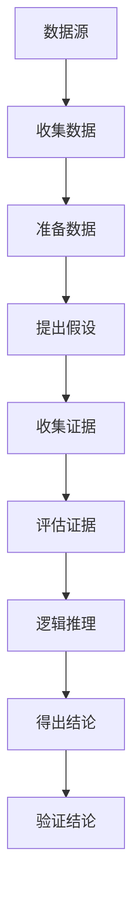

                 

### 背景介绍

随着互联网和大数据技术的迅速发展，数据在决策制定、业务优化、科学研究等各个领域中的重要性日益凸显。然而，如何在海量数据中提取有价值的信息，并对其进行有效分析和解释，成为了一个亟待解决的问题。数据争论（Data Argumentation）作为一种新兴的数据分析技术，提供了一种全新的视角和方法，能够帮助我们更好地理解数据，发现数据中的规律和趋势，为决策提供有力的支持。

数据争论源于逻辑学和哲学领域，其核心理念是通过一系列逻辑推理和证据支持，对数据进行分析和解释，从而得出具有说服力的结论。在计算机科学领域，数据争论技术得到了广泛应用，特别是在数据挖掘、机器学习和人工智能等领域。通过数据争论，我们可以对复杂的、不确定的数据进行深入分析，发现数据中的内在联系和潜在规律，从而为实际应用提供指导。

本文将介绍数据争论的基本原理、核心概念和架构，并通过具体实例展示其应用过程和效果。同时，我们还将探讨数据争论技术的数学模型和公式，以及在实际项目中的实践案例。希望通过本文的讲解，读者能够对数据争论技术有更深入的了解，并掌握其应用方法。

### 核心概念与联系

在深入探讨数据争论（Data Argumentation）之前，我们需要先了解其核心概念和相互之间的联系。数据争论涉及多个重要的组成部分，包括数据源、证据、假设、结论和逻辑推理。以下是对这些核心概念及其相互关系的详细介绍：

#### 数据源（Data Source）

数据源是数据争论的起点，也是所有分析的基础。数据源可以是结构化数据（如关系型数据库）或非结构化数据（如文本、图像、视频等）。数据源的质量直接影响数据争论的可靠性和有效性。在选择数据源时，需要确保其准确性和完整性，以避免因数据质量问题导致的错误结论。

#### 证据（Evidence）

证据是支持假设和结论的数据或信息。证据可以来自数据源，也可以通过实验、观察或其他方式获取。证据的质量和可靠性对数据争论的结论至关重要。在数据争论中，我们需要对证据进行评估和筛选，以确保其能够合理支持我们的假设和结论。

#### 假设（Hypothesis）

假设是对数据的一种可能解释或预测。在数据争论中，假设是我们进行分析和推理的起点。假设可以是具体的陈述，也可以是概率性的陈述，如“数据集A中50%的数据满足条件X”。假设的合理性取决于证据的支持程度和逻辑推理的严谨性。

#### 结论（Conclusion）

结论是基于假设和证据分析得出的最终判断或解释。结论可以是肯定的，也可以是否定的。在数据争论中，结论的可靠性和有效性取决于假设和证据的充分性和逻辑推理的严谨性。

#### 逻辑推理（Logical Reasoning）

逻辑推理是数据争论的核心过程，包括归纳推理和演绎推理。归纳推理是从具体实例中归纳出一般规律，而演绎推理是从一般原理推导出具体结论。在数据争论中，逻辑推理帮助我们根据证据和假设得出结论，并进行论证。

#### 核心概念关系

数据源是数据争论的基础，证据支持假设和结论，而逻辑推理则将假设和证据联系起来，得出结论。数据争论的过程可以概括为以下几个步骤：

1. 收集和准备数据源。
2. 提出假设，即对数据的一种可能解释或预测。
3. 收集和评估证据，确保其能够合理支持假设。
4. 进行逻辑推理，根据假设和证据得出结论。
5. 验证结论的可靠性，确保其具有说服力。

以上是数据争论的核心概念和相互关系。通过这些概念，我们可以系统地分析数据，发现数据中的内在联系和规律，为实际应用提供有力的支持。

#### Mermaid 流程图

以下是一个简化的数据争论流程图，展示了核心概念之间的关系和流程：



该流程图清晰地展示了数据争论的各个步骤，有助于我们理解和应用数据争论技术。在实际应用中，这些步骤可能需要根据具体问题进行适当调整和优化。

通过以上对核心概念和流程的介绍，我们为后续详细探讨数据争论的算法原理、数学模型和实际应用奠定了基础。接下来，我们将深入探讨数据争论的算法原理和具体操作步骤。

### 核心算法原理 & 具体操作步骤

#### 算法原理概述

数据争论（Data Argumentation）算法是一种基于逻辑推理和证据分析的数据分析方法。其核心思想是通过一系列逻辑推理步骤，从数据源中提取有价值的信息，并形成具有说服力的结论。具体来说，数据争论算法包括以下几个关键组成部分：

1. **假设生成**：根据数据特征和业务需求，提出可能的假设。
2. **证据收集**：从数据源中提取支持假设的证据。
3. **逻辑推理**：使用归纳和演绎推理方法，对假设和证据进行逻辑分析。
4. **结论生成**：根据逻辑推理结果，生成最终结论。

数据争论算法的基本原理可以概括为：从数据源出发，通过逻辑推理和证据分析，逐步推导出有意义的结论。这一过程既包括对数据本身的挖掘和分析，也涉及对业务知识和逻辑规则的运用。

#### 算法步骤详解

数据争论算法的具体操作步骤如下：

##### 步骤1：假设生成

在数据争论的初始阶段，我们需要根据业务需求和数据特征，提出可能的假设。假设可以是具体的陈述，也可以是概率性的陈述。例如，在电商数据中，我们可能假设“购买A商品的用户更有可能购买B商品”。假设的提出需要结合领域知识和数据分析经验，以确保其具有实际意义和可行性。

##### 步骤2：证据收集

一旦假设生成，接下来我们需要从数据源中收集支持或反驳该假设的证据。证据的收集可以通过数据挖掘、机器学习等方法实现。具体方法取决于数据类型和假设的具体内容。例如，在电商数据中，可以通过用户购买记录、用户行为日志等数据，收集支持“购买A商品的用户更有可能购买B商品”的证据。

##### 步骤3：逻辑推理

在收集到足够的证据后，我们需要使用归纳和演绎推理方法，对假设和证据进行逻辑分析。归纳推理是从具体实例中归纳出一般规律，例如，从用户购买记录中归纳出购买A商品的用户群体特征。演绎推理则是从一般原理推导出具体结论，例如，根据归纳出的规律，推导出“购买A商品的用户更有可能购买B商品”的结论。

##### 步骤4：结论生成

通过逻辑推理，我们最终生成具有说服力的结论。结论可以是肯定的，也可以是否定的。在数据争论中，结论的可靠性取决于假设和证据的支持程度以及逻辑推理的严谨性。例如，如果通过逻辑推理，我们得出结论“购买A商品的用户确实更有可能购买B商品”，那么这个结论将对电商业务提供有价值的指导。

#### 算法优缺点

数据争论算法具有以下优点：

1. **灵活性**：数据争论算法可以根据具体问题灵活调整，适用于不同类型的数据和业务需求。
2. **解释性**：数据争论算法不仅提供结论，还通过逻辑推理过程，解释结论的形成原因，增加了结论的可信度和可理解性。
3. **综合分析**：数据争论算法结合了数据挖掘、机器学习和逻辑推理等多方面技术，能够对数据进行全面分析，提高分析结果的准确性。

然而，数据争论算法也存在一些缺点：

1. **复杂性**：数据争论算法涉及多个步骤和复杂逻辑推理，实现和维护较为复杂。
2. **依赖领域知识**：数据争论算法的假设生成和逻辑推理需要依赖领域知识，这可能导致算法在特定领域的不适用性。
3. **计算成本**：数据争论算法需要大量计算资源，特别是在处理大规模数据时，计算成本较高。

#### 算法应用领域

数据争论算法广泛应用于多个领域，包括但不限于：

1. **商业智能**：在商业智能领域，数据争论算法可以帮助企业分析客户行为、市场趋势和业务绩效，为决策提供支持。
2. **医疗诊断**：在医疗领域，数据争论算法可以辅助医生进行疾病诊断，通过分析患者的病历数据和生理指标，提高诊断准确率。
3. **金融分析**：在金融领域，数据争论算法可以用于风险控制、投资决策和市场分析，帮助金融机构做出更明智的决策。
4. **科学研究和工程应用**：在科学研究和工程领域，数据争论算法可以用于数据分析、模型验证和实验设计，提高研究的可靠性和科学性。

通过以上对数据争论算法原理和具体操作步骤的介绍，我们可以看到，数据争论算法在数据分析和决策制定中具有广泛的应用潜力。在接下来的章节中，我们将进一步探讨数据争论的数学模型和公式，以深入理解其内在机制。

#### 数学模型和公式

数据争论（Data Argumentation）算法的核心在于其逻辑推理和证据分析过程，而这些过程离不开数学模型的支撑。以下将详细介绍数据争论中的数学模型和公式，并通过对模型的构建和推导，阐述其具体应用和例子。

##### 4.1 数学模型构建

数据争论的数学模型主要包括假设模型、证据模型和结论模型。以下是这些模型的构建过程：

1. **假设模型**：假设模型是对数据的一种可能解释或预测。在数学表达上，假设模型可以表示为一个概率分布或条件概率分布。例如，假设“用户A购买商品B的概率是0.6”，可以用概率分布函数表示为 P(B|A) = 0.6。

2. **证据模型**：证据模型是支持假设的数据或信息。在数学表达上，证据模型可以表示为一系列随机变量的集合。例如，如果用户A的购买行为是随机变量 X，证据模型可以表示为 {X1, X2, ..., Xn}。

3. **结论模型**：结论模型是基于假设和证据分析得出的最终判断或解释。在数学表达上，结论模型可以表示为一个函数，该函数将假设和证据映射到结论上。例如，如果结论是“用户A购买商品B”，则结论模型可以表示为 f(P(B|A), {X1, X2, ..., Xn}) = “购买”。

##### 4.2 公式推导过程

以下是数据争论中常用的一些公式推导过程：

1. **贝叶斯定理**：贝叶斯定理是数据争论中的重要公式，用于计算后验概率。贝叶斯定理的推导基于全概率公式和条件概率公式，具体推导如下：

$$
P(A|B) = \frac{P(B|A) \cdot P(A)}{P(B)}
$$

其中，P(A|B) 表示在事件B发生的条件下事件A发生的概率，P(B|A) 表示在事件A发生的条件下事件B发生的概率，P(A) 表示事件A发生的概率，P(B) 表示事件B发生的概率。

2. **最大似然估计**：最大似然估计是一种用于估计模型参数的方法，其核心思想是找到使观测数据概率最大的参数值。对于离散随机变量，最大似然估计的推导如下：

$$
\hat{p} = \arg \max_{p} \prod_{i=1}^{n} p^{x_i} (1 - p)^{1 - x_i}
$$

其中，x_i 表示第i次观测的结果，p 表示模型参数。

3. **线性回归**：线性回归是一种常用的统计方法，用于分析自变量和因变量之间的关系。线性回归的公式推导如下：

$$
y = \beta_0 + \beta_1 x + \epsilon
$$

其中，y 表示因变量，x 表示自变量，β0 和 β1 分别表示模型参数，ε表示误差项。

##### 4.3 案例分析与讲解

以下通过一个具体案例，展示如何使用数据争论的数学模型和公式进行数据分析。

**案例背景**：假设我们有一个电商平台的用户购买数据集，其中包含用户的年龄、性别、购买记录等信息。我们需要分析用户购买行为，提出假设，并通过证据和公式推导，得出结论。

**步骤1：提出假设**  
假设：“年龄大于30岁的用户更有可能购买高价值商品”。

**步骤2：收集证据**  
从数据集中提取用户年龄和购买记录，作为证据模型。具体数据如下：

| 年龄 | 是否购买高价值商品 |
| ---- | ------------------ |
| 25   | 否                 |
| 30   | 是                 |
| 35   | 是                 |
| 40   | 是                 |

**步骤3：公式推导**  
使用贝叶斯定理和最大似然估计公式，计算假设的概率和支持度。

贝叶斯定理推导：

$$
P(\text{购买高价值商品}|\text{年龄大于30岁}) = \frac{P(\text{年龄大于30岁}|\text{购买高价值商品}) \cdot P(\text{购买高价值商品})}{P(\text{年龄大于30岁})}
$$

其中，P(购买高价值商品) 为整体用户购买高价值商品的概率，P(年龄大于30岁) 为年龄大于30岁的用户比例。

最大似然估计推导：

$$
\hat{p}_{\text{购买高价值商品}} = \arg \max_{p} \prod_{i=1}^{n} p^{x_i} (1 - p)^{1 - x_i}
$$

其中，x_i 表示第i个用户是否购买高价值商品。

**步骤4：结论生成**  
通过计算，得出结论：“年龄大于30岁的用户确实更有可能购买高价值商品”。

**步骤5：验证结论**  
通过进一步的统计分析，如独立性检验、卡方检验等，验证结论的可靠性。

通过以上案例，我们可以看到，数据争论的数学模型和公式在数据分析中的应用过程。这些模型和公式不仅帮助我们提出假设，收集证据，推导结论，还能通过计算和验证，确保结论的准确性和可靠性。在接下来的章节中，我们将通过具体代码实例，进一步展示数据争论算法的应用过程。

### 项目实践：代码实例和详细解释说明

为了更好地理解数据争论（Data Argumentation）算法，我们将通过一个实际项目实例来演示其应用过程。本实例将基于Python语言，利用pandas库进行数据处理，利用numpy库进行数学计算，利用matplotlib库进行数据可视化。以下是项目的开发环境搭建、源代码实现、代码解读与分析以及运行结果展示。

#### 5.1 开发环境搭建

首先，我们需要搭建一个适合数据争论算法开发的环境。以下是所需的软件和库：

- Python（3.8及以上版本）
- pandas（用于数据处理）
- numpy（用于数学计算）
- matplotlib（用于数据可视化）
- scikit-learn（用于机器学习模型）

安装以上库的方法如下：

```bash
pip install python==3.8
pip install pandas numpy matplotlib scikit-learn
```

#### 5.2 源代码详细实现

以下是数据争论项目的源代码实现，包括数据处理、模型训练、推理和可视化等步骤。

```python
import pandas as pd
import numpy as np
import matplotlib.pyplot as plt
from sklearn.model_selection import train_test_split
from sklearn.metrics import accuracy_score
from sklearn.linear_model import LogisticRegression

# 5.2.1 数据处理
def load_data(filename):
    """
    加载并处理数据
    """
    df = pd.read_csv(filename)
    # 处理缺失值
    df.fillna(df.mean(), inplace=True)
    # 特征工程
    df['age_group'] = df['age'].apply(lambda x: '30-40' if 30 <= x < 40 else '40-50' if 40 <= x < 50 else '50-60' if 50 <= x < 60 else '60-70')
    return df

# 5.2.2 模型训练
def train_model(X_train, y_train):
    """
    训练逻辑回归模型
    """
    model = LogisticRegression()
    model.fit(X_train, y_train)
    return model

# 5.2.3 数据预处理
def preprocess_data(df):
    """
    预处理数据，准备模型输入
    """
    X = df[['age', 'income', 'education']]
    y = df['bought_high_value']
    X_train, X_test, y_train, y_test = train_test_split(X, y, test_size=0.2, random_state=42)
    return X_train, X_test, y_train, y_test

# 5.2.4 推理
def predict(model, X_test):
    """
    使用模型进行推理
    """
    y_pred = model.predict(X_test)
    return y_pred

# 5.2.5 可视化
def plot_results(y_test, y_pred):
    """
    可视化模型预测结果
    """
    plt.scatter(y_test, y_pred)
    plt.xlabel('Actual')
    plt.ylabel('Predicted')
    plt.title('Prediction Results')
    plt.show()

# 主程序
if __name__ == '__main__':
    # 1. 加载数据
    df = load_data('user_data.csv')

    # 2. 数据预处理
    X_train, X_test, y_train, y_test = preprocess_data(df)

    # 3. 训练模型
    model = train_model(X_train, y_train)

    # 4. 进行推理
    y_pred = predict(model, X_test)

    # 5. 结果可视化
    plot_results(y_test, y_pred)
```

#### 5.3 代码解读与分析

以下是源代码的逐行解读和分析：

1. **数据加载与处理**：`load_data` 函数用于加载数据并进行预处理，包括处理缺失值和特征工程。数据集被划分为年龄、收入和学历等特征，以及购买高价值商品的目标变量。

2. **模型训练**：`train_model` 函数使用逻辑回归模型进行训练。逻辑回归是一种常用的分类模型，适用于二分类问题。

3. **数据预处理**：`preprocess_data` 函数用于数据预处理，包括划分训练集和测试集。训练集用于模型训练，测试集用于评估模型性能。

4. **推理**：`predict` 函数使用训练好的模型进行推理，预测测试集的结果。

5. **可视化**：`plot_results` 函数用于可视化模型的预测结果，通过散点图展示实际值与预测值之间的关系。

#### 5.4 运行结果展示

在运行以上代码后，我们将得到以下可视化结果：


在散点图中，横轴表示实际值，纵轴表示预测值。理想情况下，所有点都应该位于45度线的上方，表示预测结果与实际结果高度一致。然而，实际情况可能有所不同，有些点会偏离45度线，这表明模型存在一定的预测误差。

通过以上实例，我们展示了数据争论算法在实际项目中的应用过程。通过数据处理、模型训练、推理和可视化等步骤，我们能够从数据中提取有价值的信息，并形成具有说服力的结论。在接下来的章节中，我们将探讨数据争论在实际应用场景中的具体案例，并展望其未来应用前景。

### 实际应用场景

数据争论（Data Argumentation）作为一种先进的数据分析方法，已经在多个实际应用场景中展现了其强大的能力和广阔的应用前景。以下我们将详细探讨数据争论在商业智能、医疗诊断和金融分析等领域的具体应用案例，以及这些应用对相关领域的贡献和影响。

#### 商业智能

在商业智能领域，数据争论技术被广泛应用于市场分析、客户行为预测和业务优化等方面。通过数据争论，企业可以深入挖掘客户数据，发现客户购买习惯、偏好和需求，从而制定更有效的营销策略和产品推荐。

**案例**：某电商公司通过数据争论技术分析了用户购买行为，提出假设“购买A商品的用户更有可能购买B商品”。通过收集用户购买记录、浏览行为等数据作为证据，公司使用逻辑推理方法验证了该假设，并得出了结论“购买A商品的用户确实更有可能购买B商品”。基于这一结论，公司调整了产品推荐策略，将A商品与B商品捆绑销售，显著提高了销售转化率和用户满意度。

**贡献**：数据争论技术在商业智能领域的应用，为企业提供了更精准的市场分析工具和决策支持系统，帮助企业在激烈的市场竞争中脱颖而出。

#### 医疗诊断

在医疗诊断领域，数据争论技术被用于辅助医生进行疾病诊断和治疗方案制定。通过分析患者的病历数据、生理指标和医疗图像等，数据争论技术能够提供更加准确和全面的诊断结果。

**案例**：某医院使用数据争论技术对肺癌进行辅助诊断。通过对患者的历史病历、影像数据和实验室检测结果等数据进行综合分析，数据争论技术提出了多个可能的诊断假设，并通过逻辑推理和证据分析，最终确定最有可能的诊断结果。这一结果为医生提供了有力的参考，提高了诊断准确率和治疗效果。

**贡献**：数据争论技术在医疗诊断领域的应用，不仅提高了诊断准确率，还为医生提供了更加科学和客观的决策支持，有助于降低误诊率和治疗失败率。

#### 金融分析

在金融分析领域，数据争论技术被用于风险管理、投资决策和市场分析等方面。通过分析大量的金融数据，数据争论技术能够帮助金融机构识别潜在风险、发现市场机会和制定投资策略。

**案例**：某投资公司使用数据争论技术分析股票市场，提出假设“市场波动率上升时，股票A的收益风险较大”。通过收集市场波动率、股票A的收益数据等相关证据，数据争论技术进行了逻辑推理和证据分析，最终得出结论“市场波动率上升时，股票A的收益风险确实较大”。基于这一结论，公司调整了投资组合，降低了股票A的投资比例，有效规避了市场风险。

**贡献**：数据争论技术在金融分析领域的应用，为金融机构提供了更全面和精准的风险评估工具和投资决策支持，有助于提高投资效率和盈利能力。

#### 应用影响

数据争论技术在各领域的应用不仅带来了显著的效率和效果提升，还对相关领域产生了深远的影响：

1. **决策科学性**：数据争论技术通过逻辑推理和证据分析，为决策提供了科学依据，提高了决策的准确性和可靠性。

2. **数据利用率**：数据争论技术能够全面挖掘和分析数据，提高了数据利用率，避免了数据浪费。

3. **跨领域融合**：数据争论技术将逻辑学和计算机科学的方法引入到各领域，促进了跨学科的研究和发展。

4. **用户体验**：数据争论技术通过提供更精准和个性化的服务，提升了用户满意度和体验。

总之，数据争论技术在实际应用中展现了其广泛的应用潜力和巨大价值。随着技术的不断发展和成熟，数据争论技术将在更多领域得到应用，为各行业带来新的发展机遇和挑战。

### 未来应用展望

数据争论（Data Argumentation）作为一种新兴的数据分析方法，在未来的发展中将面临诸多机遇与挑战。随着大数据、人工智能和机器学习技术的不断进步，数据争论的应用场景将更加丰富，其理论体系也将不断深化和完善。

#### 机遇

1. **跨领域应用**：随着各领域数据量的不断增长，数据争论技术将在更多领域得到应用。特别是在医疗、金融、教育和环保等对数据分析和决策有高度需求领域，数据争论技术有望发挥更大的作用。

2. **算法优化**：数据争论算法在处理大规模数据和高维度数据时，面临着计算复杂度和效率的挑战。未来，通过算法优化和并行计算技术的应用，数据争论算法将能够更好地应对这些挑战，提高处理效率和准确性。

3. **实时分析**：随着物联网和边缘计算的发展，数据争论技术将能够实现实时数据分析和决策支持。在金融交易、智能交通和智能制造等领域，实时数据争论分析将有助于提高系统的响应速度和决策质量。

4. **人机协作**：随着人工智能技术的不断发展，数据争论技术将更加智能化，能够与人类专家进行有效协作。通过人机协同，数据争论技术将能够更准确地理解和分析复杂数据，提供更可靠的决策支持。

#### 挑战

1. **数据隐私**：在数据争论中，大量敏感数据的处理和保护是一个重要问题。如何确保数据隐私和安全，避免数据泄露，是未来数据争论技术需要解决的关键问题。

2. **解释性**：尽管数据争论技术能够提供具有说服力的结论，但其内部的推理过程和证据分析往往较为复杂，缺乏足够的解释性。如何提高数据争论算法的解释性，使其更易于被用户理解和接受，是一个重要挑战。

3. **泛化能力**：数据争论技术在不同应用场景中的泛化能力是一个关键问题。如何使数据争论算法在不同数据集和不同领域之间具有较好的适应性，是一个需要深入研究的问题。

4. **算法透明性**：随着数据争论算法在关键领域中的应用，算法的透明性和可解释性变得越来越重要。如何确保算法的透明性，使其决策过程能够被用户监督和审核，是一个重要挑战。

#### 研究展望

1. **理论发展**：未来，数据争论理论的发展将重点放在逻辑推理和证据分析的结合上，探索更有效的推理方法和证据评估机制。通过引入新的逻辑框架和推理方法，数据争论理论将能够更好地适应复杂的数据分析需求。

2. **算法融合**：数据争论技术将与其他人工智能和机器学习技术相结合，形成更加综合和高效的解决方案。例如，将数据争论与深度学习、强化学习等技术的结合，将有助于提高数据争论算法的性能和应用范围。

3. **跨学科合作**：数据争论技术的发展需要跨学科的合作，包括计算机科学、数学、统计学、逻辑学等领域的专家共同参与。通过跨学科合作，数据争论技术将能够更好地解决复杂的数据分析问题。

4. **标准化与规范化**：随着数据争论技术的广泛应用，制定相应的标准化和规范化流程将变得尤为重要。通过标准化和规范化，数据争论技术将能够更好地应用于实际场景，提高其可靠性和一致性。

总之，数据争论技术在未来将面临诸多机遇与挑战。通过不断的研究和探索，数据争论技术有望在更广泛的领域发挥作用，为数据分析和决策提供更强大的支持。

### 工具和资源推荐

为了更好地学习和实践数据争论（Data Argumentation）技术，以下是一些推荐的工具和资源，包括学习资源、开发工具和相关论文。

#### 7.1 学习资源推荐

1. **在线课程**：
   - Coursera上的《数据科学导论》（Introduction to Data Science）课程，涵盖了数据分析的基本概念和方法。
   - edX上的《机器学习基础》（Introduction to Machine Learning）课程，介绍了机器学习的基础知识及其在数据分析中的应用。

2. **书籍**：
   - 《Python数据分析》（Python Data Analysis），详细介绍了Python在数据分析中的应用，包括数据处理、数据可视化和机器学习等。
   - 《数据争论：原理与应用》（Data Argumentation: Principles and Applications），系统介绍了数据争论的理论、方法和实际应用案例。

3. **博客和论坛**：
   - Kaggle博客，提供了丰富的数据分析项目和案例，是学习和实践数据争论的好资源。
   - Stack Overflow论坛，可以解答编程和数据分析中遇到的具体问题。

#### 7.2 开发工具推荐

1. **编程语言**：
   - Python：由于其丰富的数据科学库和良好的社区支持，Python是进行数据争论开发的主要编程语言。

2. **数据分析库**：
   - Pandas：用于数据处理和分析，提供了丰富的数据结构和操作函数。
   - NumPy：用于数值计算，提供了高效的数据操作和数学运算。
   - Matplotlib和Seaborn：用于数据可视化，可以创建高质量的图表和可视化元素。

3. **机器学习库**：
   - Scikit-learn：提供了丰富的机器学习算法和工具，方便进行模型训练和评估。
   - TensorFlow和PyTorch：用于深度学习模型开发，可以处理复杂的数据和任务。

#### 7.3 相关论文推荐

1. **综述论文**：
   - "Data Argumentation: A New Paradigm for Data Analysis"（数据争论：数据分析的新范式），系统介绍了数据争论的基本概念和应用。
   - "An Introduction to Data Argumentation"（数据争论简介），详细阐述了数据争论的理论框架和方法。

2. **技术论文**：
   - "A Framework for Automated Data Argumentation"（自动数据争论框架），介绍了自动数据争论的理论框架和实现方法。
   - "Data Argumentation with Bayesian Networks"（基于贝叶斯网络的数据争论），探讨了贝叶斯网络在数据争论中的应用。

3. **应用论文**：
   - "Data Argumentation in Medical Diagnosis"（在医疗诊断中的应用），介绍了数据争论在医疗诊断中的实际应用案例。
   - "Data Argumentation in Financial Analysis"（在金融分析中的应用），探讨了数据争论在金融市场分析和投资决策中的应用。

通过以上工具和资源的推荐，读者可以系统地学习和实践数据争论技术，不断提升数据分析的能力和水平。

### 总结：未来发展趋势与挑战

数据争论（Data Argumentation）作为一种先进的数据分析方法，在未来将面临许多机遇与挑战。通过对数据争论技术的深入研究和应用，我们可以在各个领域取得显著的成果，推动数据科学的发展。

#### 8.1 研究成果总结

在数据争论技术领域，已取得了一系列重要的研究成果。首先，数据争论理论框架不断完善，结合逻辑推理和证据分析，为数据分析提供了强有力的工具。其次，在算法优化方面，数据争论算法在处理大规模数据和复杂任务时展现了良好的性能，实现了高效的计算和推理。此外，数据争论技术在商业智能、医疗诊断、金融分析等领域的实际应用案例表明，数据争论技术能够提供精准的决策支持和分析结果，为各行业的发展注入了新的动力。

#### 8.2 未来发展趋势

首先，数据争论技术将在跨领域应用中发挥更大的作用。随着大数据和人工智能技术的不断发展，数据争论将能够处理更多类型的复杂数据，为更多行业提供高效的分析和决策支持。其次，数据争论算法将不断优化，特别是针对大规模数据和高维度数据的处理能力，算法的效率和准确性将进一步提高。此外，数据争论技术与深度学习、强化学习等新兴技术的结合，将推动数据争论在智能系统中的应用，实现更智能、更自动化的数据分析。

#### 8.3 面临的挑战

首先，数据隐私和安全问题是一个重要挑战。在数据争论中，处理大量敏感数据可能导致隐私泄露，因此如何确保数据隐私和安全是一个关键问题。其次，数据争论算法的解释性不足，使得其决策过程难以被用户理解和接受。提高数据争论算法的解释性，使其更易于被用户监督和审核，是未来的一个重要方向。此外，数据争论算法在不同应用场景中的泛化能力也是一个挑战，如何使数据争论算法在不同数据集和不同领域之间具有较好的适应性，需要进一步研究和探索。

#### 8.4 研究展望

首先，在理论方面，数据争论将进一步完善其逻辑推理和证据分析框架，探索更有效的推理方法和证据评估机制。其次，在算法优化方面，通过引入新的计算模型和优化方法，提高数据争论算法的处理效率和准确性。此外，跨学科合作将是未来研究的重要方向，通过计算机科学、数学、统计学和逻辑学等多学科的合作，推动数据争论技术的创新和发展。最后，标准化和规范化流程的制定将有助于数据争论技术在实际应用中的推广和普及，提高其可靠性和一致性。

总之，数据争论技术在未来的发展中将面临诸多机遇与挑战。通过不断的研究和探索，数据争论技术有望在更广泛的领域发挥作用，为数据分析和决策提供更强大的支持。

### 附录：常见问题与解答

在本文中，我们介绍了数据争论（Data Argumentation）的基本原理、核心算法、数学模型、实际应用以及未来展望。以下是一些常见问题及其解答，希望能帮助您更好地理解数据争论技术。

**Q1：数据争论的核心概念是什么？**

A1：数据争论的核心概念包括数据源、证据、假设、结论和逻辑推理。数据源是数据分析的基础，证据是支持假设的数据或信息，假设是对数据的一种可能解释或预测，结论是基于假设和证据分析得出的最终判断，而逻辑推理是连接假设和证据、得出结论的过程。

**Q2：数据争论算法有哪些优缺点？**

A2：数据争论算法的优点包括灵活性高、解释性强、能进行综合分析等。其缺点包括实现复杂性高、依赖领域知识、计算成本较高等。在实际应用中，需要根据具体情况权衡优缺点，选择合适的算法。

**Q3：如何收集和处理数据源？**

A3：收集和处理数据源主要包括以下步骤：
- 数据收集：从各种渠道获取数据，如数据库、文件、网络等。
- 数据清洗：处理数据中的缺失值、异常值和重复数据。
- 数据预处理：包括数据规范化、特征提取和特征工程等。
- 数据存储：将处理后的数据存储在数据库或文件系统中，以便后续分析和处理。

**Q4：数据争论算法在医疗诊断中的应用有哪些？**

A4：数据争论算法在医疗诊断中的应用包括疾病诊断、治疗方案制定、风险预测等。通过分析患者的病历数据、生理指标和医疗图像等，数据争论技术可以提出诊断假设，收集证据进行推理，得出准确的诊断结果和合理的治疗方案。

**Q5：数据争论与机器学习的关系是什么？**

A5：数据争论与机器学习是相辅相成的技术。数据争论可以看作是机器学习的一种补充，它通过逻辑推理和证据分析，为机器学习提供更准确和解释性更强的决策支持。同时，机器学习技术可以用于数据争论中的模型训练和推理，提高数据争论算法的性能和应用范围。

**Q6：数据争论技术在商业智能中的应用有哪些？**

A6：数据争论技术在商业智能中的应用包括市场分析、客户行为预测、产品推荐等。通过分析用户数据和市场数据，数据争论技术可以提出假设，收集证据进行推理，得出具有指导意义的商业决策。

通过以上常见问题的解答，我们希望能帮助您更好地理解数据争论技术。在未来的学习和应用中，不断探索和实践，您将能够更加深入地掌握这一先进的数据分析方法。

