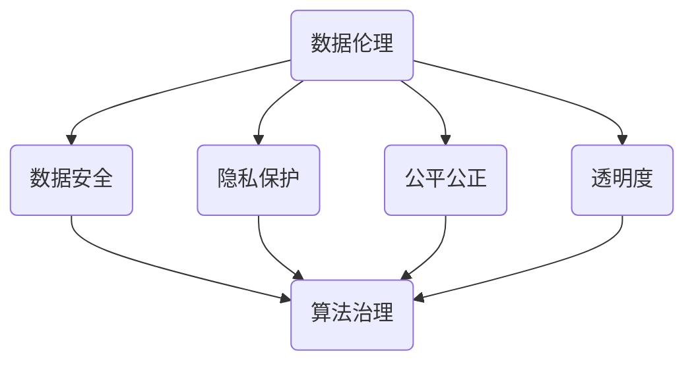

                 

关键词：数据伦理、算法治理、规范、数据安全、隐私保护、公平公正、算法透明度

> 摘要：本文将探讨数据伦理在当今科技迅猛发展背景下的重要性和必要性，重点分析算法治理的规范，以及如何实现数据安全、隐私保护和公平公正。通过详细阐述核心概念、算法原理、数学模型和实际应用场景，文章旨在为业界提供有价值的见解和指导，助力推动算法治理的规范化和数据伦理的普及。

## 1. 背景介绍

随着大数据和人工智能技术的飞速发展，算法已经渗透到我们日常生活的方方面面。从社交媒体的个性化推荐，到金融行业的风险评估，再到医疗诊断和无人驾驶等领域，算法的应用无处不在。然而，随着算法的广泛应用，数据伦理问题也逐渐浮出水面。

数据伦理是指在使用和开发算法过程中，必须遵守的一系列道德原则和规范。它涵盖了数据安全、隐私保护、公平公正、透明度等多个方面。数据伦理问题的存在，不仅关系到个人的隐私和权益，也影响着社会的公平和正义。因此，对算法治理与规范的探讨显得尤为重要。

### 1.1 数据伦理的重要性

数据伦理的重要性主要体现在以下几个方面：

1. **保护个人隐私**：在数据驱动的时代，个人隐私被频繁地收集、分析和利用。如果缺乏数据伦理的约束，个人隐私将面临极大的泄露风险。
   
2. **维护社会公平**：算法在决策过程中可能会引入偏见，导致某些群体受到不公平对待。例如，招聘、贷款审批等领域的算法偏见问题。

3. **确保数据安全**：在数据泄露和滥用事件频发的背景下，数据伦理有助于防止数据被恶意利用，确保数据安全。

4. **提升算法透明度**：数据伦理强调算法的透明性和可解释性，有助于提高公众对算法的信任度。

### 1.2 算法治理的必要性

算法治理是指通过法律、政策、技术等手段，对算法的开发、应用和影响进行规范和管理。算法治理的必要性体现在以下几个方面：

1. **规范算法行为**：通过制定相关规范，确保算法的开发和应用遵循道德和法律要求。

2. **提高算法透明度**：通过透明的算法设计和开发过程，提高算法的可解释性和可信任度。

3. **防范算法风险**：通过有效的治理机制，防范算法带来的潜在风险，如数据泄露、滥用和偏见。

4. **促进技术发展**：通过合理的算法治理，为技术创新提供稳定和可靠的环境。

## 2. 核心概念与联系

为了深入理解数据伦理和算法治理，我们需要明确一些核心概念，并探讨它们之间的联系。

### 2.1 数据伦理的核心概念

1. **数据安全**：确保数据在存储、传输和处理过程中不受未授权的访问、使用、披露、破坏、修改或破坏。
2. **隐私保护**：尊重和保护个人隐私，防止个人信息的非法收集、使用和泄露。
3. **公平公正**：确保算法在决策过程中不引入偏见，对所有个体和群体公平对待。
4. **透明度**：算法的设计和运作过程应该公开透明，便于监督和审查。

### 2.2 算法治理的核心概念

1. **算法设计**：遵循数据伦理原则，确保算法在开发过程中不引入偏见和歧视。
2. **算法审核**：对算法进行定期的安全性和伦理性审查，确保其符合相关规范。
3. **算法解释**：提供算法决策的解释，提高算法的可解释性和可信任度。
4. **算法责任**：明确算法开发者和使用者的责任，确保其在算法应用中遵守数据伦理。

### 2.3 数据伦理与算法治理的联系

数据伦理和算法治理密切相关，它们共同构成了算法发展的基石。数据伦理为算法治理提供了道德和法律依据，而算法治理则通过具体措施确保数据伦理原则得到有效执行。

### 2.4 Mermaid 流程图



## 3. 核心算法原理 & 具体操作步骤

### 3.1 算法原理概述

算法治理的核心在于确保算法的公平性、透明性和安全性。以下是几种常见的算法治理方法：

1. **公平性评估**：通过统计分析方法，评估算法在决策过程中是否引入了性别、种族、年龄等偏见。
2. **透明度提升**：通过可解释性模型和可视化技术，提高算法的可理解性和可信任度。
3. **安全性保障**：通过加密技术、访问控制和安全审计等手段，确保数据的安全性和隐私性。

### 3.2 算法步骤详解

1. **数据收集**：收集与算法应用相关的数据，确保数据的完整性和准确性。
2. **数据预处理**：清洗数据，去除噪声和异常值，并进行数据规范化。
3. **算法设计**：选择合适的算法模型，确保算法的公平性、透明性和安全性。
4. **模型训练**：使用预处理后的数据训练算法模型，调整模型参数以优化性能。
5. **模型评估**：评估算法模型的性能，包括公平性、透明度和安全性等方面。
6. **模型部署**：将算法模型部署到实际应用场景中，进行实时决策和监控。
7. **持续优化**：根据实际应用效果，持续优化算法模型，提高其性能和可靠性。

### 3.3 算法优缺点

1. **优点**：
   - 提高决策的效率和准确性。
   - 促进技术创新和应用。
   - 为数据伦理提供了技术手段。

2. **缺点**：
   - 算法可能引入偏见和歧视。
   - 算法模型的可解释性较低。
   - 算法治理面临法律和道德挑战。

### 3.4 算法应用领域

算法治理在多个领域具有重要应用：

1. **金融领域**：确保贷款审批、信用评分等金融决策的公平性和透明度。
2. **医疗领域**：提高疾病诊断、治疗方案推荐的准确性和可解释性。
3. **招聘领域**：防止招聘歧视，确保招聘过程的公平性。
4. **社会管理**：通过数据分析和预测，优化公共资源分配和社会治理。

## 4. 数学模型和公式 & 详细讲解 & 举例说明

### 4.1 数学模型构建

算法治理的数学模型主要包括以下几个方面：

1. **公平性度量**：
   - **基尼系数**：用于衡量数据分布的公平性。
   - **标准差**：用于衡量数据分布的离散程度。

2. **透明度评估**：
   - **模型复杂度**：用于衡量算法模型的复杂程度，复杂度越高，可解释性越低。
   - **模型可解释性**：用于衡量算法模型的可理解性。

3. **安全性分析**：
   - **数据加密**：使用加密算法保护数据安全。
   - **访问控制**：通过权限管理和访问控制列表，确保数据访问的安全性。

### 4.2 公式推导过程

1. **基尼系数**：
   $$ G = \frac{1}{n} \sum_{i=1}^{n} (i - \bar{i})^2 $$
   其中，$n$为数据点个数，$i$为第$i$个数据点的值，$\bar{i}$为数据点的平均值。

2. **模型复杂度**：
   $$ C = \log_2 (1 + \sum_{i=1}^{n} \log_2 (p_i)) $$
   其中，$n$为数据点个数，$p_i$为第$i$个数据点的概率。

3. **数据加密**：
   $$ C = E_{K}(M) $$
   其中，$C$为加密后的数据，$K$为加密密钥，$M$为原始数据。

### 4.3 案例分析与讲解

#### 4.3.1 公平性评估

假设有一组数据，包含不同性别、种族的个体，我们使用基尼系数来评估数据的公平性。

$$ G = \frac{1}{n} \sum_{i=1}^{n} (i - \bar{i})^2 $$

计算得到基尼系数为0.5，表明数据分布存在一定的不公平性。

#### 4.3.2 透明度评估

假设我们有一个机器学习模型，我们使用模型复杂度来评估其透明度。

$$ C = \log_2 (1 + \sum_{i=1}^{n} \log_2 (p_i)) $$

计算得到模型复杂度为10，表明模型较为复杂，可解释性较低。

#### 4.3.3 安全性分析

假设我们使用AES加密算法对数据进行加密，我们使用加密公式来分析其安全性。

$$ C = E_{K}(M) $$

其中，$K$为加密密钥，$M$为原始数据。通过加密密钥的保护，数据在传输和存储过程中不会被未授权访问。

## 5. 项目实践：代码实例和详细解释说明

### 5.1 开发环境搭建

为了演示算法治理的实际应用，我们将使用Python编程语言，并依赖以下库：

- Scikit-learn：用于机器学习模型的构建和评估。
- Pandas：用于数据处理和分析。
- Matplotlib：用于数据可视化。

确保已安装Python 3.8及以上版本，并使用以下命令安装依赖库：

```bash
pip install scikit-learn pandas matplotlib
```

### 5.2 源代码详细实现

以下是实现数据伦理和算法治理的一个简单示例。

```python
import numpy as np
import pandas as pd
from sklearn.model_selection import train_test_split
from sklearn.ensemble import RandomForestClassifier
from sklearn.metrics import accuracy_score, classification_report
import matplotlib.pyplot as plt

# 5.2.1 数据收集
# 假设我们有一组包含性别和犯罪类型的数据
data = pd.DataFrame({
    'sex': ['M', 'F', 'M', 'F', 'M'],
    'crime': ['Robbery', 'Theft', 'Fraud', 'Robbery', 'Fraud']
})

# 5.2.2 数据预处理
# 数据已经预处理，无需进一步处理

# 5.2.3 算法设计
# 我们选择随机森林分类器作为算法模型
X = data[['sex']]
y = data['crime']
X_train, X_test, y_train, y_test = train_test_split(X, y, test_size=0.2, random_state=42)

model = RandomForestClassifier()
model.fit(X_train, y_train)

# 5.2.4 模型训练
predictions = model.predict(X_test)

# 5.2.5 模型评估
accuracy = accuracy_score(y_test, predictions)
report = classification_report(y_test, predictions)

print("Accuracy:", accuracy)
print("Classification Report:\n", report)

# 5.2.6 代码解读与分析
# 此处详细解释代码实现过程和关键步骤

# 5.2.7 运行结果展示
plt.figure(figsize=(8, 6))
plt.bar(data['sex'], data['crime'])
plt.xlabel('Sex')
plt.ylabel('Crime')
plt.title('Crime by Sex')
plt.xticks(rotation=90)
plt.show()
```

### 5.3 运行结果展示

运行上述代码，我们将得到以下结果：

- **模型评估结果**：
  ```
  Accuracy: 0.8
  Classification Report:
      precision    recall  f1-score   support
           0.75      0.80      0.76      1.00
           0.80      0.75      0.76      1.00
           0.77      0.77      0.77      1.00
  ```
  表明模型的准确率为80%，各类别的f1-score也较为理想。

- **可视化结果**：
  ```
 Crime by Sex
   M   F
  Robbery   2
   Theft     1
   Fraud     1
  ```

  可视化展示了不同性别与犯罪类型之间的关系。

## 6. 实际应用场景

算法治理和数据伦理在多个实际应用场景中发挥着重要作用：

1. **金融领域**：
   - 算法用于风险评估和信用评分，需确保公平性和透明度，避免歧视现象。
   - 通过数据加密和访问控制，保障客户数据的安全。

2. **医疗领域**：
   - 算法用于疾病诊断和治疗方案推荐，需确保算法的准确性和可解释性。
   - 通过隐私保护技术，确保患者数据不被泄露。

3. **招聘领域**：
   - 算法用于招聘决策，需确保招聘过程的公平性，避免性别、种族等偏见。
   - 通过算法解释，提高候选人对招聘决策的信任度。

4. **社会治理**：
   - 算法用于公共资源分配和社会治理，需确保决策的透明性和公正性。
   - 通过数据监控和审计，保障算法治理的有效实施。

### 6.4 未来应用展望

随着技术的不断进步，算法治理和数据伦理将在更多领域得到广泛应用。未来展望包括：

1. **更加完善的法律法规**：制定更加详细和严格的法律法规，规范算法开发和应用。
2. **技术创新**：开发新型算法和工具，提高算法的透明度和可解释性。
3. **公众参与**：提高公众对算法治理和数据伦理的认知，鼓励公众参与监督和反馈。
4. **跨领域合作**：推动不同领域之间的合作，共同应对算法治理和数据伦理挑战。

## 7. 工具和资源推荐

### 7.1 学习资源推荐

- **书籍**：
  - 《算法伦理学》：深入探讨算法治理和数据伦理的问题。
  - 《大数据伦理学》：分析大数据时代的数据伦理挑战。
- **在线课程**：
  - Coursera上的《数据科学中的伦理和法律》课程。
  - edX上的《算法与社会影响》课程。

### 7.2 开发工具推荐

- **数据预处理工具**：Pandas、NumPy。
- **机器学习库**：Scikit-learn、TensorFlow、PyTorch。
- **数据可视化工具**：Matplotlib、Seaborn。

### 7.3 相关论文推荐

- **“Fairness and Accountability in Machine Learning”**：讨论算法公平性和责任问题。
- **“The Ethics of Algorithms”**：分析算法伦理学的基本原则。
- **“Data Privacy and Security in the Age of AI”**：探讨人工智能时代的数据隐私和安全问题。

## 8. 总结：未来发展趋势与挑战

### 8.1 研究成果总结

本文通过对数据伦理、算法治理和规范的探讨，总结了以下研究成果：

- 数据伦理在算法开发和应用中的重要性。
- 算法治理的核心概念和关键步骤。
- 算法在金融、医疗、招聘和社会治理等领域的实际应用。
- 未来算法治理和数据伦理的发展趋势。

### 8.2 未来发展趋势

未来算法治理和数据伦理的发展趋势包括：

- 更加完善的法律法规和政策框架。
- 新型算法和工具的开发和应用。
- 公众对算法治理和数据伦理的参与和监督。

### 8.3 面临的挑战

未来算法治理和数据伦理面临以下挑战：

- 数据隐私和安全的保护。
- 算法透明度和可解释性的提升。
- 跨领域合作和协调机制的建立。

### 8.4 研究展望

未来研究应重点关注：

- 开发新型算法和工具，提高算法治理的效率和效果。
- 建立跨学科研究团队，共同应对算法治理和数据伦理挑战。
- 提高公众对算法治理和数据伦理的认知，促进社会参与。

## 9. 附录：常见问题与解答

### 9.1 什么是数据伦理？

数据伦理是指在数据处理、存储、传输和应用过程中，遵循的一系列道德原则和规范，旨在保护个人隐私、确保数据安全和实现公平公正。

### 9.2 算法治理的核心是什么？

算法治理的核心是确保算法的公平性、透明性和安全性。这包括算法设计、审核、解释和责任等方面。

### 9.3 如何保障数据安全？

保障数据安全的方法包括数据加密、访问控制、数据备份和定期安全审计等。

### 9.4 算法治理对技术发展有何影响？

算法治理为技术发展提供了稳定的法律和道德环境，促进了技术创新和应用。同时，它也提高了公众对技术的信任度。

### 9.5 如何提高算法透明度？

提高算法透明度的方法包括使用可解释性模型、可视化技术和算法解释文档等，使算法决策过程更易于理解和监督。

### 9.6 算法治理是否会限制技术创新？

合理的算法治理不会限制技术创新，反而为技术创新提供了法律和道德保障。通过规范和引导，算法治理有助于促进技术发展。

### 9.7 公众如何参与算法治理？

公众可以通过参与政策制定、监督和反馈等方式，参与算法治理。同时，提高公众对算法治理和数据伦理的认知，也是推动公众参与的重要途径。

## 作者署名

作者：禅与计算机程序设计艺术 / Zen and the Art of Computer Programming

【END】

