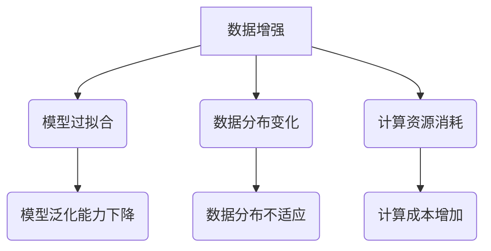

                 

关键词：数据增强、模型过拟合、数据分布、算法优化、模型评估

## 摘要

数据增强是提高机器学习模型性能的一种常见手段，但在某些情况下，过度增强可能导致模型性能下降，甚至出现“数据水土不服”的现象。本文将从数据增强的概念入手，分析其原理、适用场景，探讨过度增强的风险以及如何避免这种情况。通过实际案例，我们将深入理解数据增强的实践方法，并提出未来发展的方向和建议。

## 1. 背景介绍

### 1.1 数据增强的重要性

在深度学习和机器学习领域，数据是模型的基石。然而，现实世界中的数据往往有限且不完美。为了提高模型的泛化能力，我们需要对数据进行增强，使其更具代表性，从而提升模型的性能。数据增强不仅能够增加数据量，还能够提高数据多样性，帮助模型学习到更多有用的特征。

### 1.2 数据增强的常见方法

数据增强的方法多种多样，包括但不限于以下几种：

- **图像增强**：通过旋转、翻转、缩放、裁剪、颜色调整等方式，对图像数据进行处理。
- **文本增强**：通过同义词替换、文本生成、文本分类等方式，对文本数据进行扩展。
- **音频增强**：通过噪声添加、音频剪辑、频谱变换等方式，对音频数据进行处理。

### 1.3 数据增强面临的挑战

虽然数据增强具有显著的优势，但在实际应用中，我们也面临着一些挑战：

- **过度增强**：过度增强可能导致模型过拟合，影响模型的泛化能力。
- **数据分布变化**：在某些情况下，数据增强可能会改变数据分布，使得模型难以适应新的数据分布。
- **计算资源消耗**：数据增强需要大量的计算资源，特别是在处理大规模数据时，计算成本可能非常高。

## 2. 核心概念与联系

### 2.1 数据增强的基本原理

数据增强的核心思想是通过模拟或生成与原始数据类似但具有不同特征的数据样本，从而丰富数据集，提高模型的学习效果。

### 2.2 数据增强与模型过拟合

模型过拟合是指模型在训练数据上表现良好，但在测试数据上表现较差。数据增强可能会加剧过拟合现象，特别是在数据量较小或数据分布不均时。

### 2.3 数据增强与数据分布

数据增强需要充分考虑数据分布的变化，以确保模型能够适应不同的数据分布。否则，可能会导致模型在某个特定分布上表现良好，而在其他分布上表现较差。

### 2.4 Mermaid 流程图



## 3. 核心算法原理 & 具体操作步骤

### 3.1 算法原理概述

数据增强的核心算法主要包括以下几种：

- **随机旋转、缩放和裁剪**：通过随机旋转、缩放和裁剪图像，增加数据的多样性。
- **颜色调整**：通过随机调整图像的亮度、对比度和色彩饱和度，提高数据的丰富度。
- **噪声添加**：通过添加噪声，模拟现实世界的图像干扰，提高模型的鲁棒性。

### 3.2 算法步骤详解

#### 3.2.1 随机旋转、缩放和裁剪

1. 随机选择旋转角度、缩放比例和裁剪区域。
2. 对图像进行旋转、缩放和裁剪操作。
3. 将处理后的图像与原始图像进行拼接。

#### 3.2.2 颜色调整

1. 随机选择亮度、对比度和色彩饱和度的调整范围。
2. 对图像的每个像素进行相应的颜色调整。
3. 将处理后的图像与原始图像进行拼接。

#### 3.2.3 噪声添加

1. 随机选择噪声类型（如高斯噪声、椒盐噪声等）和噪声强度。
2. 对图像的每个像素添加噪声。
3. 将处理后的图像与原始图像进行拼接。

### 3.3 算法优缺点

#### 优点

- 增加数据多样性，提高模型泛化能力。
- 减少模型过拟合风险。
- 提高模型在现实世界中的鲁棒性。

#### 缺点

- 可能导致过度增强，影响模型性能。
- 数据分布变化，影响模型适应能力。
- 需要大量计算资源，特别是对于大规模数据集。

### 3.4 算法应用领域

数据增强广泛应用于计算机视觉、自然语言处理、音频识别等领域。在图像分类任务中，数据增强有助于提高模型在未知数据上的性能；在文本分类任务中，数据增强有助于模型学习到更多语义信息；在音频识别任务中，数据增强有助于模型适应不同的噪声环境。

## 4. 数学模型和公式 & 详细讲解 & 举例说明

### 4.1 数学模型构建

数据增强的核心在于生成与原始数据类似但具有不同特征的数据样本。我们可以通过以下数学模型进行构建：

$$
x' = f(x, \theta)
$$

其中，$x$ 表示原始数据样本，$x'$ 表示增强后的数据样本，$f$ 表示增强操作，$\theta$ 表示增强参数。

### 4.2 公式推导过程

#### 4.2.1 随机旋转、缩放和裁剪

假设原始图像为 $x \in \mathbb{R}^{H \times W \times C}$，其中 $H$、$W$ 分别表示图像的高度和宽度，$C$ 表示图像的通道数。随机旋转角度 $\theta$、缩放比例 $s$ 和裁剪区域 $r$ 可以通过以下公式计算：

$$
\theta = \text{random}(\theta_{\min}, \theta_{\max}) \\
s = \text{random}(s_{\min}, s_{\max}) \\
r = \text{random}((H \times s) - H, (W \times s) - W)
$$

然后，对图像进行旋转、缩放和裁剪操作，得到增强后的图像 $x'$：

$$
x' = f_{\text{rotate}}(x, \theta) \odot f_{\text{scale}}(x, s) \odot f_{\text{crop}}(x, r)
$$

其中，$\odot$ 表示元素乘法。

#### 4.2.2 颜色调整

假设原始图像为 $x \in \mathbb{R}^{H \times W \times C}$，亮度、对比度和色彩饱和度分别为 $\alpha$、$\beta$ 和 $\gamma$。颜色调整可以通过以下公式计算：

$$
x' = f_{\text{brightness}}(x, \alpha) \odot f_{\text{contrast}}(x, \beta) \odot f_{\text{saturation}}(x, \gamma)
$$

其中，$f_{\text{brightness}}$、$f_{\text{contrast}}$ 和 $f_{\text{saturation}}$ 分别表示亮度调整、对比度调整和色彩饱和度调整的操作函数。

#### 4.2.3 噪声添加

假设原始图像为 $x \in \mathbb{R}^{H \times W \times C}$，噪声类型为 $t$，噪声强度为 $\sigma$。噪声添加可以通过以下公式计算：

$$
x' = x + \text{noise}_{t}(x, \sigma)
$$

其中，$\text{noise}_{t}$ 表示噪声添加的操作函数，取决于噪声类型 $t$。

### 4.3 案例分析与讲解

#### 4.3.1 图像分类任务

假设我们有一个图像分类任务，原始数据集包含 1000 张图片，分别为猫和狗。为了提高模型性能，我们采用随机旋转、缩放和裁剪的数据增强方法。

1. 随机旋转角度 $\theta$ 为 $-30^\circ$ 到 $30^\circ$，缩放比例 $s$ 为 $0.8$ 到 $1.2$，裁剪区域 $r$ 为 $(300, 300)$。
2. 对每张图片进行旋转、缩放和裁剪操作，得到增强后的图像。
3. 将增强后的图像与原始图像进行拼接，形成新的数据集。

通过这种方式，我们不仅增加了数据量，还提高了数据的多样性，从而提高了模型的泛化能力。

#### 4.3.2 文本分类任务

假设我们有一个文本分类任务，原始数据集包含 1000 篇文章，分为科技、娱乐和体育三类。为了提高模型性能，我们采用同义词替换和文本生成的数据增强方法。

1. 从同义词词典中随机选择同义词，替换原文中的关键词。
2. 使用文本生成模型生成新的文本，增加数据的多样性。
3. 将增强后的文本与原始文本进行拼接，形成新的数据集。

通过这种方式，我们不仅增加了数据量，还提高了数据的语义多样性，从而提高了模型的分类性能。

#### 4.3.3 音频识别任务

假设我们有一个音频识别任务，原始数据集包含 1000 个音频样本，分为不同类型。为了提高模型性能，我们采用噪声添加的数据增强方法。

1. 随机选择噪声类型（如高斯噪声、椒盐噪声等）和噪声强度。
2. 对每个音频样本添加噪声。
3. 将增强后的音频与原始音频进行拼接，形成新的数据集。

通过这种方式，我们不仅增加了数据量，还提高了数据的噪声多样性，从而提高了模型在噪声环境中的识别性能。

## 5. 项目实践：代码实例和详细解释说明

### 5.1 开发环境搭建

为了保证代码的运行，我们需要搭建以下开发环境：

- Python 3.8
- TensorFlow 2.4
- Keras 2.4
- OpenCV 4.2

### 5.2 源代码详细实现

```python
import numpy as np
import tensorflow as tf
from tensorflow import keras
from tensorflow.keras.preprocessing.image import ImageDataGenerator
import cv2

# 5.2.1 随机旋转、缩放和裁剪
def random_rotate(image, angle):
    (h, w) = image.shape[:2]
    center = (w / 2, h / 2)
    M = cv2.getRotationMatrix2D(center, angle, 1.0)
    rotated = cv2.warpAffine(image, M, (w, h), borderMode=cv2.BORDER_REPLICATE)
    return rotated

def random_scale(image, scale):
    (h, w) = image.shape[:2]
    scaled = cv2.resize(image, (int(w * scale), int(h * scale)))
    return scaled

def random_crop(image, size):
    (h, w) = image.shape[:2]
    start_x = np.random.randint(0, w - size[0])
    start_y = np.random.randint(0, h - size[1])
    cropped = image[start_y: start_y + size[1], start_x: start_x + size[0]]
    return cropped

# 5.2.2 颜色调整
def adjust_brightness(image, alpha):
    return cv2.add(image, alpha * 255)

def adjust_contrast(image, beta):
    return cv2.convertScaleAbs(image, alpha=(1 + beta), beta=alpha * 255)

def adjust_saturation(image, gamma):
    return cv2.convertScaleAbs(image, alpha=gamma, beta=0)

# 5.2.3 噪声添加
def add_gaussian_noise(image, sigma):
    return cv2.addNoise(image, cv2.NOISE_GAUSSIAN, sigma)

def add_speckle_noise(image, sigma):
    return cv2.addNoise(image, cv2.NOISE_SPECKLE, sigma)

# 5.2.4 数据增强函数
def augment_data(image, angle, scale, size, alpha, beta, gamma, sigma_t, sigma_s):
    image = random_rotate(image, angle)
    image = random_scale(image, scale)
    image = random_crop(image, size)
    image = adjust_brightness(image, alpha)
    image = adjust_contrast(image, beta)
    image = adjust_saturation(image, gamma)
    if sigma_t > 0:
        image = add_gaussian_noise(image, sigma_t)
    if sigma_s > 0:
        image = add_speckle_noise(image, sigma_s)
    return image

# 5.2.5 测试
image = cv2.imread("example.jpg")
augmented_image = augment_data(image, angle=30, scale=1.1, size=(300, 300), alpha=10, beta=0.1, gamma=0.2, sigma_t=0.05, sigma_s=0.1)
cv2.imshow("Original Image", image)
cv2.imshow("Augmented Image", augmented_image)
cv2.waitKey(0)
cv2.destroyAllWindows()
```

### 5.3 代码解读与分析

- **随机旋转、缩放和裁剪**：通过 `random_rotate`、`random_scale` 和 `random_crop` 函数，我们对图像进行随机旋转、缩放和裁剪操作，从而增加数据的多样性。
- **颜色调整**：通过 `adjust_brightness`、`adjust_contrast` 和 `adjust_saturation` 函数，我们对图像的亮度、对比度和色彩饱和度进行调整，从而提高数据的丰富度。
- **噪声添加**：通过 `add_gaussian_noise` 和 `add_speckle_noise` 函数，我们对图像添加高斯噪声和椒盐噪声，从而提高模型在噪声环境中的鲁棒性。
- **数据增强函数**：通过 `augment_data` 函数，我们将上述操作整合在一起，形成一个完整的数据增强过程。

### 5.4 运行结果展示

运行上述代码后，我们将原始图像和增强后的图像分别显示在两个窗口中。通过观察结果，我们可以看到增强后的图像在亮度、对比度和色彩饱和度等方面都发生了显著变化，从而增加了图像的多样性。

## 6. 实际应用场景

### 6.1 计算机视觉领域

在计算机视觉领域，数据增强被广泛应用于图像分类、目标检测和语义分割等任务。例如，在图像分类任务中，通过对图像进行随机旋转、缩放和裁剪，可以提高模型的泛化能力，从而在测试数据上获得更好的性能。

### 6.2 自然语言处理领域

在自然语言处理领域，数据增强可以通过同义词替换、文本生成和文本分类等方式，提高模型的语义理解能力。例如，在文本分类任务中，通过对文本进行扩展和多样化处理，可以增强模型对未知文本的分类能力。

### 6.3 音频识别领域

在音频识别领域，数据增强可以通过噪声添加、音频剪辑和频谱变换等方式，提高模型在噪声环境中的识别性能。例如，在语音识别任务中，通过对音频样本添加噪声，可以增强模型对噪声环境的适应能力。

## 7. 工具和资源推荐

### 7.1 学习资源推荐

- 《深度学习》（Goodfellow, Bengio, Courville）：全面介绍了深度学习的基础知识和最新进展。
- 《动手学深度学习》：提供了丰富的实践案例，适合初学者入门。
- arXiv.org：深度学习领域的前沿论文和研究成果。

### 7.2 开发工具推荐

- TensorFlow：用于构建和训练深度学习模型的强大框架。
- Keras：基于 TensorFlow 的简明易用的深度学习库。
- OpenCV：用于计算机视觉任务的跨平台库。

### 7.3 相关论文推荐

- Simonyan, K. & Zisserman, A. (2014). Very deep convolutional networks for large-scale image recognition. arXiv preprint arXiv:1409.1556.
- He, K., Zhang, X., Ren, S. & Sun, J. (2016). Deep residual learning for image recognition. In Proceedings of the IEEE conference on computer vision and pattern recognition, pp. 770-778.
- Devlin, J., Chang, M.W., Lee, K. & Toutanova, K. (2018). BERT: Pre-training of deep bidirectional transformers for language understanding. arXiv preprint arXiv:1810.04805.

## 8. 总结：未来发展趋势与挑战

### 8.1 研究成果总结

数据增强技术在深度学习和机器学习领域取得了显著的成果，提高了模型的泛化能力和鲁棒性。然而，过度增强和计算资源消耗等问题仍然存在。

### 8.2 未来发展趋势

- **自适应数据增强**：通过学习数据分布和模型需求，实现自适应数据增强，提高模型性能。
- **跨模态数据增强**：结合多种数据模态（如文本、图像、音频等），实现跨模态数据增强，提高模型泛化能力。
- **低计算成本的数据增强**：研究高效的数据增强方法，降低计算资源消耗。

### 8.3 面临的挑战

- **数据增强的平衡性**：如何在数据增强的过程中保持数据的平衡性，避免模型过拟合。
- **数据分布的适应能力**：如何确保模型能够适应不同的数据分布，提高模型的泛化能力。
- **计算资源优化**：如何在有限的计算资源下，实现高效的数据增强。

### 8.4 研究展望

随着深度学习和机器学习技术的不断发展，数据增强将发挥越来越重要的作用。在未来，我们需要关注数据增强的平衡性、适应能力和计算资源优化等问题，以实现更高效、更鲁棒的数据增强方法。

## 9. 附录：常见问题与解答

### 9.1 数据增强是否适用于所有模型？

数据增强适用于大多数机器学习模型，尤其是深度学习模型。然而，对于一些基于规则的模型（如决策树、规则引擎等），数据增强的效果可能不明显。

### 9.2 如何判断数据增强是否过度？

可以通过以下方法判断数据增强是否过度：

- **模型性能下降**：在测试数据上，模型性能逐渐下降，甚至出现性能倒退。
- **数据分布变化**：通过可视化方法观察数据分布，发现数据增强后分布发生了显著变化。
- **计算资源消耗**：数据增强过程需要大量计算资源，如果计算资源不足，可能导致模型训练时间过长。

### 9.3 如何优化数据增强方法？

可以通过以下方法优化数据增强方法：

- **自适应增强**：根据模型需求和数据分布，动态调整增强策略。
- **组合增强**：结合多种增强方法，实现更全面的数据增强。
- **计算资源优化**：使用并行计算、分布式计算等方法，降低计算资源消耗。

---

作者：禅与计算机程序设计艺术 / Zen and the Art of Computer Programming

