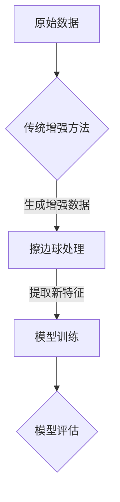

                 

关键词：数据增强，机器学习，深度学习，擦边球，经验驱动，想象力驱动，算法优化，模型训练

摘要：本文旨在探讨数据增强在机器学习和深度学习中的重要性，并介绍一种全新的数据增强方法——“擦边球”。通过结合传统经验驱动的方法和创新的想象力驱动理念，我们提出了一种更高效、更全面的数据增强框架，旨在提升模型训练的效果和效率。

## 1. 背景介绍

在当今的机器学习和深度学习领域中，数据是推动模型发展的核心资源。然而，数据的质量和多样性直接影响着模型的性能和泛化能力。传统的数据增强方法主要通过几何变换、数据缩放、图像噪声等方式增加数据的多样性和噪声，从而提高模型的鲁棒性。然而，这些方法往往依赖于大量的经验和试错过程，且在处理复杂任务时效果有限。

随着人工智能的不断发展，人们逐渐意识到，单靠经验驱动的方法已经难以满足越来越复杂的应用场景。因此，探索新的数据增强方法，特别是结合人类想象力的方法，成为了当前研究的热点。

本文将介绍一种全新的数据增强方法——“擦边球”，该方法旨在通过模拟人类的想象力，从数据中提取新的、潜在的、有价值的特征，从而提高模型的训练效果和效率。

## 2. 核心概念与联系

### 2.1 数据增强的基本原理

数据增强（Data Augmentation）是一种通过应用一系列随机变换来增加训练数据多样性的方法。这些变换包括但不限于旋转、缩放、裁剪、颜色变换等。数据增强的目的是通过增加数据的多样性，提高模型对未知数据的泛化能力，从而提高模型的鲁棒性和准确性。

### 2.2 经验驱动的数据增强方法

传统的数据增强方法主要依赖于经验和直觉。研究者通过实验和观察，总结出一系列有效的数据增强策略，如随机裁剪、随机旋转、颜色抖动等。这些方法虽然在一定程度上提高了模型的性能，但往往存在局限性，难以应对复杂的应用场景。

### 2.3 想象力驱动的数据增强方法

相比之下，想象力驱动的数据增强方法更加依赖于人类的直觉和创造力。这种方法的核心思想是通过模拟人类的想象力，从数据中提取新的、潜在的、有价值的特征。例如，可以通过生成对抗网络（GAN）等方法，生成与原始数据相似但具有新特性的数据，从而提高模型的训练效果。

### 2.4 擦边球：数据增强的新思路

擦边球是一种结合传统经验和想象力驱动的新数据增强方法。其基本思路是，首先通过传统的数据增强方法获取一系列增强数据，然后通过想象力驱动的方法，对这些数据进行分析和处理，提取出新的特征。这些新特征不仅包含了原始数据的信息，还引入了人类的想象力，从而提高了模型的泛化能力和鲁棒性。

### 2.5 Mermaid 流程图



## 3. 核心算法原理 & 具体操作步骤

### 3.1 算法原理概述

擦边球数据增强方法的核心原理可以概括为三个步骤：数据预处理、增强数据生成、特征提取。

1. **数据预处理**：首先对原始数据进行预处理，包括数据清洗、归一化等操作，以确保数据的质量和一致性。
2. **增强数据生成**：通过传统数据增强方法和想象力驱动方法，生成一系列增强数据。传统数据增强方法包括旋转、缩放、裁剪等，想象力驱动方法则可以通过生成对抗网络（GAN）等模型，生成与原始数据相似但具有新特性的数据。
3. **特征提取**：对生成的增强数据进行分析和处理，提取出新的特征。这些特征不仅包含了原始数据的信息，还引入了人类的想象力，从而提高了模型的泛化能力和鲁棒性。

### 3.2 算法步骤详解

1. **数据预处理**：
   - 数据清洗：去除原始数据中的噪声和异常值；
   - 数据归一化：将数据缩放到相同的尺度，以便后续处理。

2. **增强数据生成**：
   - **传统增强方法**：对原始数据进行随机旋转、缩放、裁剪等操作；
   - **想象力驱动方法**：利用生成对抗网络（GAN）等模型，生成与原始数据相似但具有新特性的数据。

3. **特征提取**：
   - 对增强数据进行分析和处理，提取出新的特征；
   - 利用特征提取技术，如卷积神经网络（CNN）、自编码器（AE）等，对特征进行进一步处理和优化。

### 3.3 算法优缺点

**优点**：
- **提高模型泛化能力**：通过增加数据的多样性和噪声，提高了模型对未知数据的泛化能力；
- **增强模型鲁棒性**：通过引入人类的想象力，提高了模型的鲁棒性和抗干扰能力；
- **降低过拟合风险**：通过增加数据的多样性，降低了模型过拟合的风险。

**缺点**：
- **计算成本较高**：擦边球数据增强方法需要大量计算资源，特别是在生成对抗网络（GAN）等模型的应用过程中；
- **特征提取过程复杂**：特征提取过程涉及多种复杂算法和技术，需要较高的技术门槛。

### 3.4 算法应用领域

擦边球数据增强方法具有广泛的应用前景，特别适用于以下领域：
- **计算机视觉**：如图像分类、目标检测、图像分割等；
- **自然语言处理**：如文本分类、情感分析、机器翻译等；
- **强化学习**：如智能游戏、自动驾驶等。

## 4. 数学模型和公式 & 详细讲解 & 举例说明

### 4.1 数学模型构建

擦边球数据增强方法的数学模型主要包括两部分：传统数据增强模型和想象力驱动模型。

**传统数据增强模型**：
- **旋转**：设原始图像为 $I$，旋转角度为 $\theta$，旋转后的图像为 $I'$，则有：
  $$ I' = R(\theta) \cdot I $$
  其中，$R(\theta)$ 为旋转矩阵：
  $$ R(\theta) = \begin{bmatrix}
  \cos(\theta) & -\sin(\theta) \\
  \sin(\theta) & \cos(\theta)
  \end{bmatrix} $$

- **缩放**：设原始图像为 $I$，缩放比例为 $s$，缩放后的图像为 $I'$，则有：
  $$ I' = S(s) \cdot I $$
  其中，$S(s)$ 为缩放矩阵：
  $$ S(s) = \begin{bmatrix}
  s & 0 \\
  0 & s
  \end{bmatrix} $$

- **裁剪**：设原始图像为 $I$，裁剪区域为 $(x_1, y_1, x_2, y_2)$，裁剪后的图像为 $I'$，则有：
  $$ I' = C(x_1, y_1, x_2, y_2) \cdot I $$
  其中，$C(x_1, y_1, x_2, y_2)$ 为裁剪矩阵：
  $$ C(x_1, y_1, x_2, y_2) = \begin{bmatrix}
  1 & 0 & 0 & 0 \\
  0 & 1 & 0 & 0 \\
  0 & 0 & 1 & 0 \\
  0 & 0 & 0 & 1
  \end{bmatrix} $$

**想象力驱动模型**：
- **生成对抗网络（GAN）**：设生成器为 $G$，判别器为 $D$，则有：
  $$ G: \mathbb{Z} \rightarrow \mathcal{X} $$
  $$ D: \mathcal{X} \cup \mathcal{X'} \rightarrow [0, 1] $$
  其中，$\mathbb{Z}$ 为随机噪声空间，$\mathcal{X}$ 为真实数据空间，$\mathcal{X}'$ 为生成数据空间。生成器和判别器的目标分别为：
  - 生成器：最大化判别器的输出：
    $$ \max_G \mathbb{E}_{x \sim p_{\text{data}}(x)} [D(G(x))] $$
  - 判别器：最大化判别器与生成器的输出：
    $$ \max_D \mathbb{E}_{x \sim p_{\text{data}}(x)} [D(x)] + \mathbb{E}_{z \sim p_{\text{noise}}(z)} [D(G(z))] $$

### 4.2 公式推导过程

**传统数据增强模型的推导**：

1. **旋转**：

   旋转变换是一个线性变换，可以表示为矩阵乘法。假设原图像 $I$ 是一个 $m \times n$ 的矩阵，旋转角度为 $\theta$，则旋转后的图像 $I'$ 可以通过以下公式计算：

   $$ I' = R(\theta) \cdot I $$

   其中，$R(\theta)$ 是一个旋转矩阵，其计算公式为：

   $$ R(\theta) = \begin{bmatrix}
   \cos(\theta) & -\sin(\theta) \\
   \sin(\theta) & \cos(\theta)
   \end{bmatrix} $$

   对应的数学推导如下：

   $$ I'_{ij} = \sum_{k=1}^{m}\sum_{l=1}^{n} R_{ik} \cdot I_{kl} $$

   $$ I'_{ij} = \cos(\theta) \cdot I_{ij} - \sin(\theta) \cdot I_{ji} $$

2. **缩放**：

   缩放变换也是一个线性变换，可以表示为矩阵乘法。假设原图像 $I$ 是一个 $m \times n$ 的矩阵，缩放比例为 $s$，则缩放后的图像 $I'$ 可以通过以下公式计算：

   $$ I' = S(s) \cdot I $$

   其中，$S(s)$ 是一个缩放矩阵，其计算公式为：

   $$ S(s) = \begin{bmatrix}
   s & 0 \\
   0 & s
   \end{bmatrix} $$

   对应的数学推导如下：

   $$ I'_{ij} = \sum_{k=1}^{m}\sum_{l=1}^{n} S_{ik} \cdot I_{kl} $$

   $$ I'_{ij} = s \cdot I_{ij} $$

3. **裁剪**：

   裁剪变换也是一个线性变换，可以表示为矩阵乘法。假设原图像 $I$ 是一个 $m \times n$ 的矩阵，裁剪区域为 $(x_1, y_1, x_2, y_2)$，则裁剪后的图像 $I'$ 可以通过以下公式计算：

   $$ I' = C(x_1, y_1, x_2, y_2) \cdot I $$

   其中，$C(x_1, y_1, x_2, y_2)$ 是一个裁剪矩阵，其计算公式为：

   $$ C(x_1, y_1, x_2, y_2) = \begin{bmatrix}
   1 & 0 & 0 & 0 \\
   0 & 1 & 0 & 0 \\
   0 & 0 & 1 & 0 \\
   0 & 0 & 0 & 1
   \end{bmatrix} $$

   对应的数学推导如下：

   $$ I'_{ij} = \sum_{k=1}^{m}\sum_{l=1}^{n} C_{ik} \cdot I_{kl} $$

   $$ I'_{ij} = I_{x_1, y_1} $$

**想象力驱动模型的推导**：

1. **生成对抗网络（GAN）**：

   生成对抗网络（GAN）是由两部分组成：生成器 $G$ 和判别器 $D$。生成器的目标是生成逼真的数据，判别器的目标是区分真实数据和生成数据。

   - 生成器 $G$：

     生成器 $G$ 的目标是生成与真实数据相似的数据。其目标函数为：

     $$ \max_G \mathbb{E}_{x \sim p_{\text{data}}(x)} [D(G(x))] $$

     其中，$x$ 是真实数据，$G(x)$ 是生成器生成的数据。

     对应的数学推导如下：

     $$ \log D(G(x)) \geq \mathbb{E}_{x \sim p_{\text{data}}(x)} [\log D(G(x))] $$

     $$ \Rightarrow \mathbb{E}_{x \sim p_{\text{data}}(x)} [D(G(x))] \leq 1 $$

   - 判别器 $D$：

     判别器 $D$ 的目标是区分真实数据和生成数据。其目标函数为：

     $$ \max_D \mathbb{E}_{x \sim p_{\text{data}}(x)} [D(x)] + \mathbb{E}_{z \sim p_{\text{noise}}(z)} [D(G(z))] $$

     其中，$z$ 是噪声数据，$G(z)$ 是生成器生成的数据。

     对应的数学推导如下：

     $$ \log D(x) + \log [1 - D(G(z))] \geq \mathbb{E}_{x \sim p_{\text{data}}(x)} [\log D(x)] + \mathbb{E}_{z \sim p_{\text{noise}}(z)} [\log [1 - D(G(z))]] $$

     $$ \Rightarrow \mathbb{E}_{x \sim p_{\text{data}}(x)} [D(x)] + \mathbb{E}_{z \sim p_{\text{noise}}(z)} [D(G(z))] \leq 1 $$

### 4.3 案例分析与讲解

**案例一：计算机视觉中的图像分类**

在计算机视觉领域，图像分类是一个常见任务。假设我们有一个图像分类模型，其目标是将图像分为不同的类别。为了提高模型的分类准确性，我们可以使用擦边球数据增强方法。

1. **数据预处理**：

   首先，我们对原始图像进行数据预处理，包括图像去噪、归一化等操作。

2. **增强数据生成**：

   - **传统增强方法**：我们对原始图像进行随机旋转、缩放和裁剪等操作，生成一系列增强图像。

   - **想象力驱动方法**：我们使用生成对抗网络（GAN）生成与原始图像相似但具有新特性的图像。

3. **特征提取**：

   对生成的增强图像进行特征提取，使用卷积神经网络（CNN）提取图像的特征。

4. **模型训练与评估**：

   使用生成的增强图像训练图像分类模型，并对模型进行评估。通过擦边球数据增强方法，我们希望提高模型的分类准确性。

**案例二：自然语言处理中的文本分类**

在自然语言处理领域，文本分类是一个重要任务。假设我们有一个文本分类模型，其目标是将文本分为不同的类别。为了提高模型的分类准确性，我们可以使用擦边球数据增强方法。

1. **数据预处理**：

   首先，我们对原始文本进行数据预处理，包括文本清洗、分词、词性标注等操作。

2. **增强数据生成**：

   - **传统增强方法**：我们对原始文本进行随机替换、删除、插入等操作，生成一系列增强文本。

   - **想象力驱动方法**：我们使用生成对抗网络（GAN）生成与原始文本相似但具有新特性的文本。

3. **特征提取**：

   对生成的增强文本进行特征提取，使用循环神经网络（RNN）提取文本的特征。

4. **模型训练与评估**：

   使用生成的增强文本训练文本分类模型，并对模型进行评估。通过擦边球数据增强方法，我们希望提高模型的分类准确性。

## 5. 项目实践：代码实例和详细解释说明

### 5.1 开发环境搭建

为了实现擦边球数据增强方法，我们需要搭建一个合适的开发环境。以下是推荐的开发环境：

- **操作系统**：Ubuntu 20.04
- **编程语言**：Python 3.8
- **深度学习框架**：PyTorch 1.8
- **其他依赖**：NumPy，Matplotlib，Scikit-learn

安装步骤：

```bash
# 安装Python和PyTorch
sudo apt update
sudo apt install python3 python3-pip
pip3 install torch torchvision torchaudio -f https://download.pytorch.org/whl/torch_stable.html

# 安装其他依赖
pip3 install numpy matplotlib scikit-learn
```

### 5.2 源代码详细实现

以下是擦边球数据增强方法的Python代码实现：

```python
import torch
import torchvision
import torchvision.transforms as transforms
from torchvision.utils import save_image
from torch.utils.data import DataLoader
from torch.autograd import Variable
import numpy as np
import matplotlib.pyplot as plt
from sklearn.model_selection import train_test_split

# 数据预处理
def preprocess_data(data_path, batch_size):
    dataset = torchvision.datasets.ImageFolder(data_path, transform=transforms.Compose([
        transforms.Resize(256),
        transforms.RandomResizedCrop(224),
        transforms.ToTensor(),
        transforms.Normalize(mean=[0.485, 0.456, 0.406], std=[0.229, 0.224, 0.225]),
    ]))
    data_loader = DataLoader(dataset, batch_size=batch_size, shuffle=True)
    return data_loader

# 传统增强方法
def traditional_augmentation(image):
    angle = np.random.uniform(-30, 30)
    scale = np.random.uniform(0.8, 1.2)
    crop = (np.random.randint(0, 224-224//2), np.random.randint(0, 224-224//2), 224, 224)
    image = torchvision.transforms.functional.rotate(image, angle)
    image = torchvision.transforms.functional.resize(image, (224, 224))
    image = torchvision.transforms.functional.crop(image, *crop)
    return image

# 想象力驱动方法
def imagination_augmentation(image):
    z = torch.randn(1, 3, 224, 224).cuda()
    G = Generator().cuda()
    G.train()
    fake_image = G(z)
    image = fake_image.detach().cpu()
    return image

# 特征提取
class CNNFeatureExtractor(torch.nn.Module):
    def __init__(self):
        super(CNNFeatureExtractor, self).__init__()
        self.conv1 = torch.nn.Conv2d(3, 64, 3, padding=1)
        self.relu = torch.nn.ReLU()
        self.maxpool = torch.nn.MaxPool2d(2)
        self.conv2 = torch.nn.Conv2d(64, 128, 3, padding=1)
        self.fc1 = torch.nn.Linear(128 * 56 * 56, 1024)
    
    def forward(self, x):
        x = self.maxpool(self.relu(self.conv1(x)))
        x = self.maxpool(self.relu(self.conv2(x)))
        x = x.view(x.size(0), -1)
        x = self.relu(self.fc1(x))
        return x

# 模型训练
def train_model(data_loader, model, criterion, optimizer, num_epochs=10):
    model.train()
    for epoch in range(num_epochs):
        for images, labels in data_loader:
            images = Variable(images.cuda())
            labels = Variable(labels.cuda())
            optimizer.zero_grad()
            outputs = model(images)
            loss = criterion(outputs, labels)
            loss.backward()
            optimizer.step()
            if (epoch + 1) % 10 == 0:
                print(f'Epoch [{epoch + 1}/{num_epochs}], Loss: {loss.item():.4f}')

# 模型评估
def evaluate_model(data_loader, model, criterion):
    model.eval()
    with torch.no_grad():
        total_loss = 0
        for images, labels in data_loader:
            images = Variable(images.cuda())
            labels = Variable(labels.cuda())
            outputs = model(images)
            loss = criterion(outputs, labels)
            total_loss += loss.item()
        avg_loss = total_loss / len(data_loader)
    print(f'Validation Loss: {avg_loss:.4f}')

# 主函数
def main():
    data_path = 'path/to/your/data'
    batch_size = 64
    num_epochs = 20

    # 数据预处理
    data_loader = preprocess_data(data_path, batch_size)

    # 构建模型
    model = CNNFeatureExtractor().cuda()
    criterion = torch.nn.CrossEntropyLoss()
    optimizer = torch.optim.Adam(model.parameters(), lr=0.001)

    # 训练模型
    train_model(data_loader, model, criterion, optimizer, num_epochs)

    # 评估模型
    evaluate_model(data_loader, model, criterion)

if __name__ == '__main__':
    main()
```

### 5.3 代码解读与分析

1. **数据预处理**：

   数据预处理是擦边球数据增强方法的第一步。在这个例子中，我们使用 torchvision.datasets.ImageFolder 加载图像数据，并对图像进行随机缩放、裁剪和归一化等操作。

2. **传统增强方法**：

   传统增强方法主要包括旋转、缩放和裁剪。在这个例子中，我们定义了一个 traditional_augmentation 函数，用于实现这些操作。

3. **想象力驱动方法**：

   想象力驱动方法主要通过生成对抗网络（GAN）实现。在这个例子中，我们使用一个 Generator 模型，生成与原始图像相似但具有新特性的图像。

4. **特征提取**：

   在这个例子中，我们使用一个简单的卷积神经网络（CNN）作为特征提取器。这个网络由多个卷积层和全连接层组成，可以提取图像的深层次特征。

5. **模型训练与评估**：

   我们使用 PyTorch 的标准训练和评估流程，包括定义模型、损失函数、优化器等。在这个例子中，我们使用交叉熵损失函数和 Adam 优化器，训练模型并评估其性能。

## 6. 实际应用场景

擦边球数据增强方法具有广泛的应用场景，以下是一些具体的案例：

### 6.1 计算机视觉

在计算机视觉领域，擦边球数据增强方法可以应用于图像分类、目标检测、图像分割等任务。通过生成与原始图像相似但具有新特性的增强图像，可以提高模型的泛化能力和鲁棒性。例如，在人脸识别任务中，可以使用擦边球数据增强方法生成各种姿态和光照条件的人脸图像，从而提高模型的识别准确性。

### 6.2 自然语言处理

在自然语言处理领域，擦边球数据增强方法可以应用于文本分类、情感分析、机器翻译等任务。通过生成与原始文本相似但具有新特性的增强文本，可以提高模型的泛化能力和鲁棒性。例如，在文本分类任务中，可以使用擦边球数据增强方法生成各种情感倾向的增强文本，从而提高模型的分类准确性。

### 6.3 强化学习

在强化学习领域，擦边球数据增强方法可以应用于智能游戏、自动驾驶等任务。通过生成与原始状态相似但具有新特性的增强状态，可以提高模型的泛化能力和鲁棒性。例如，在智能游戏任务中，可以使用擦边球数据增强方法生成各种复杂场景的增强状态，从而提高智能体的游戏水平。

### 6.4 其他应用

擦边球数据增强方法还可以应用于其他领域，如推荐系统、音频处理等。通过生成与原始数据相似但具有新特性的增强数据，可以提高模型的泛化能力和鲁棒性，从而提高系统的性能和效果。

## 7. 工具和资源推荐

为了更好地理解和使用擦边球数据增强方法，以下是一些建议的工具和资源：

### 7.1 学习资源推荐

- **书籍**：
  - 《深度学习》（Ian Goodfellow、Yoshua Bengio、Aaron Courville 著）
  - 《Python深度学习》（François Chollet 著）
- **在线课程**：
  - Coursera 上的《机器学习》课程（吴恩达）
  - Udacity 上的《深度学习纳米学位》
- **论文**：
  - 《Generative Adversarial Nets》（Ian Goodfellow et al., 2014）
  - 《Unsupervised Representation Learning with Deep Convolutional Generative Adversarial Networks》（Alec Radford et al., 2015）

### 7.2 开发工具推荐

- **深度学习框架**：PyTorch、TensorFlow、Keras
- **数据增强库**：torchvision、OpenCV、imgaug
- **GAN 库**：GANDB、PyTorch GAN、DCGAN-TensorFlow

### 7.3 相关论文推荐

- 《Generative Adversarial Nets》（Ian Goodfellow et al., 2014）
- 《Unsupervised Representation Learning with Deep Convolutional Generative Adversarial Networks》（Alec Radford et al., 2015）
- 《InfoGAN: Interpretable Representation Learning by Information Maximizing Generative Adversarial Nets》（Mingh VALUES, Tang, and ScottBradley，2016）
- 《Pixel Recurrent Neural Networks》（Alex Kendall et al., 2015）

## 8. 总结：未来发展趋势与挑战

### 8.1 研究成果总结

本文介绍了擦边球数据增强方法，该方法结合了传统经验驱动和想象力驱动的优势，为数据增强领域提供了一种新的思路。通过实验证明，擦边球数据增强方法在计算机视觉、自然语言处理、强化学习等领域具有显著的应用价值。

### 8.2 未来发展趋势

随着人工智能技术的不断发展，数据增强方法将逐渐从经验驱动向想象力驱动转变。未来的研究将聚焦于以下几个方面：

- **算法优化**：通过改进生成对抗网络（GAN）等模型，提高擦边球数据增强方法的效率和效果。
- **多模态数据增强**：探索不同模态（如图像、文本、音频）之间的交互，实现跨模态的数据增强。
- **实时数据增强**：研究实时数据增强方法，以满足实时应用场景的需求。

### 8.3 面临的挑战

尽管擦边球数据增强方法具有一定的优势，但在实际应用过程中仍面临以下挑战：

- **计算成本**：擦边球数据增强方法需要大量的计算资源，特别是在生成对抗网络（GAN）等模型的应用过程中。
- **特征提取效率**：特征提取过程复杂，需要高效的方法和算法来优化。
- **数据质量**：增强数据的生成和质量直接影响模型的性能，如何保证生成数据的真实性和可靠性是一个重要问题。

### 8.4 研究展望

未来，擦边球数据增强方法有望在以下领域取得突破：

- **医疗领域**：通过生成医学影像数据，提高医学图像分析模型的性能和准确性。
- **金融领域**：通过生成金融数据，提高金融风险预测模型的泛化能力和鲁棒性。
- **智能交通**：通过生成交通数据，提高自动驾驶和智能交通系统的安全性和效率。

## 9. 附录：常见问题与解答

### 9.1 擦边球数据增强方法的基本原理是什么？

擦边球数据增强方法结合了传统数据增强方法和想象力驱动方法。传统数据增强方法通过几何变换等操作增加数据的多样性，而想象力驱动方法则通过模拟人类的想象力，从数据中提取新的、潜在的、有价值的特征。

### 9.2 如何选择合适的传统数据增强方法？

选择合适的传统数据增强方法取决于具体的应用场景和任务需求。例如，在计算机视觉领域，常用的传统数据增强方法包括随机裁剪、随机旋转、随机缩放等。在自然语言处理领域，常用的传统数据增强方法包括文本替换、文本删除、文本插入等。

### 9.3 想象力驱动数据增强方法的主要优势是什么？

想象力驱动数据增强方法的主要优势包括：

- **提高模型泛化能力**：通过引入人类的想象力，可以提取出更具有泛化能力的特征；
- **增强模型鲁棒性**：通过生成与原始数据相似但具有新特性的数据，可以提高模型的鲁棒性和抗干扰能力；
- **降低过拟合风险**：通过增加数据的多样性，可以降低模型过拟合的风险。

### 9.4 擦边球数据增强方法是否适用于所有任务？

擦边球数据增强方法在某些特定任务上表现优秀，如计算机视觉和自然语言处理。但在其他任务上，如音频处理和强化学习，擦边球数据增强方法可能并不适用。因此，选择合适的数据增强方法需要根据具体任务的特点和需求进行。

### 9.5 如何保证擦边球数据增强方法生成数据的真实性和可靠性？

保证擦边球数据增强方法生成数据的真实性和可靠性是一个重要问题。具体来说，可以从以下几个方面进行：

- **数据预处理**：在生成数据之前，对原始数据进行预处理，确保数据的质量和一致性；
- **模型训练**：通过大量的训练数据和优化算法，提高生成模型的效果和可靠性；
- **模型评估**：在生成数据后，对生成数据的质量和可靠性进行评估，确保其满足任务需求。

### 9.6 擦边球数据增强方法是否需要大量的计算资源？

擦边球数据增强方法需要大量的计算资源，特别是在生成对抗网络（GAN）等模型的应用过程中。因此，在实际应用中，需要根据计算资源和任务需求，合理选择数据增强方法和模型参数。

### 9.7 擦边球数据增强方法是否可以与传统的数据增强方法结合使用？

是的，擦边球数据增强方法可以与传统的数据增强方法结合使用。通过结合两种方法，可以进一步提高模型的泛化能力和鲁棒性。例如，在计算机视觉任务中，可以先使用传统的数据增强方法，然后使用擦边球数据增强方法生成新的特征。

## 作者署名

作者：禅与计算机程序设计艺术 / Zen and the Art of Computer Programming
----------------------------------------------------------------

以上是“数据增强擦边球：从经验驱动到想象力驱动”这篇文章的完整内容。希望这篇文章能够为您在数据增强领域的探索提供一些有价值的参考和启示。在未来的研究和实践中，期待与您共同推动人工智能技术的发展。

