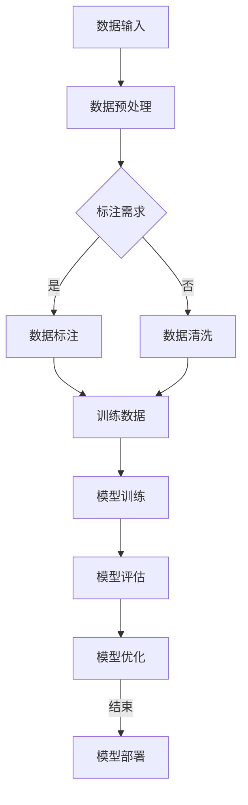

                 

### 1. 背景介绍

随着人工智能（AI）技术的飞速发展，数据标注作为一种关键的技术手段，成为了推动AI技术进步的重要力量。数据标注是指在大量数据中，对特定信息进行识别、分类、标注或注释的过程。这项工作不仅有助于提高算法的训练效果，还为AI系统的部署和应用提供了可靠的数据基础。

人工智能技术的发展历程可以追溯到20世纪50年代。当时，计算机科学家们开始探索如何让机器模拟人类智能，从而实现自动化决策和问题解决。随着计算机硬件性能的提升和算法理论的进步，人工智能技术逐渐从理论研究走向实际应用。从最初的符号主义人工智能，到基于规则的专家系统，再到基于数据的学习算法，人工智能的发展历程见证了数据标注技术的重要作用。

数据标注在AI技术中的应用范围广泛。无论是计算机视觉、自然语言处理，还是语音识别和机器翻译，都需要大量高质量的数据进行训练。在这些应用领域中，数据标注不仅用于生成训练数据，还用于评估和优化算法的性能。随着AI技术的不断演进，数据标注在人工智能发展中的重要性日益凸显。

### 2. 核心概念与联系

要深入理解数据标注在人工智能中的作用，首先需要了解几个核心概念：数据、标注、训练数据和模型。以下是这些概念之间的联系及其在AI系统中的重要性：

- **数据（Data）**：数据是人工智能系统的原材料。在计算机视觉中，数据可以是图像；在自然语言处理中，数据可以是文本；在语音识别中，数据可以是语音波形。高质量的数据是训练高效算法的基础。

- **标注（Annotation）**：标注是对数据中特定信息的标记和描述。例如，在图像数据中，标注可能包括对象的类别、位置、大小等；在文本数据中，标注可能包括词性、句法结构、情感极性等。

- **训练数据（Training Data）**：训练数据是用于训练机器学习模型的标注数据。高质量的训练数据能够帮助模型学习到有效的特征，从而提高模型的预测性能。

- **模型（Model）**：模型是人工智能系统的核心。通过学习训练数据，模型可以学会对未知数据进行分类、预测或决策。模型的性能取决于其学习到的特征和数据质量。

**核心概念原理和架构的 Mermaid 流程图**：



**Mermaid 流程节点中不要有括号、逗号等特殊字符**，确保流程图的正确绘制和可读性。

### 3. 核心算法原理 & 具体操作步骤

#### 3.1 算法原理概述

数据标注的核心算法主要基于机器学习和深度学习技术。这些算法通过学习标注数据中的特征，生成能够自动标注新数据的模型。以下是一些常用的标注算法：

- **监督学习（Supervised Learning）**：监督学习算法通过训练数据中的标注信息来学习特征映射。常见的监督学习算法包括决策树、支持向量机（SVM）和神经网络等。

- **半监督学习（Semi-supervised Learning）**：半监督学习利用少量标注数据和大量未标注数据来训练模型。这种方法能够提高标注效率，同时减少标注成本。

- **无监督学习（Unsupervised Learning）**：无监督学习算法通过发现数据中的隐含结构来进行标注。聚类、降维和生成模型是常用的无监督学习方法。

#### 3.2 算法步骤详解

**监督学习标注算法的具体步骤**：

1. **数据收集与预处理**：收集大量具有标签的数据，并对数据格式、质量进行预处理，以确保数据适用于训练模型。

2. **特征提取**：从原始数据中提取特征。在图像标注中，可能使用卷积神经网络（CNN）来提取图像特征；在文本标注中，可能使用词袋模型或词嵌入来提取文本特征。

3. **模型训练**：使用标注数据训练模型。在训练过程中，模型通过优化损失函数来调整参数，以最小化预测误差。

4. **模型评估**：使用未标注的数据对训练好的模型进行评估，以验证模型性能。

5. **模型优化**：根据评估结果，调整模型参数或选择更合适的模型架构，以提高标注效果。

**半监督学习标注算法的步骤**：

1. **数据收集与预处理**：与监督学习相同，但未标注数据也作为训练数据的一部分。

2. **模型训练**：同时使用标注数据和未标注数据来训练模型。未标注数据通过模型预测生成伪标签，然后与真实标注数据进行合并，以提高模型性能。

3. **模型评估与优化**：评估模型性能，并根据评估结果进行模型优化。

**无监督学习标注算法的步骤**：

1. **数据收集与预处理**：与监督学习相同，但不需要标注数据。

2. **特征提取与聚类**：提取数据特征，并使用聚类算法（如K-means）对特征进行聚类，以发现数据中的隐含结构。

3. **生成模型训练**：使用聚类结果生成模型，通过模型对数据进行预测和标注。

4. **模型评估与优化**：评估模型性能，并根据评估结果进行模型优化。

#### 3.3 算法优缺点

**监督学习算法的优点**：

- **效果稳定**：有标注数据的支持，模型性能相对稳定。
- **应用广泛**：适用于各种标注任务，如分类、回归和聚类。

**监督学习算法的缺点**：

- **依赖标注数据**：需要大量标注数据，成本高。
- **不适用于无标签数据**：无法直接处理无标签数据。

**半监督学习算法的优点**：

- **减少标注成本**：利用未标注数据，减少标注工作量。
- **提高模型性能**：结合标注和未标注数据，提高模型泛化能力。

**半监督学习算法的缺点**：

- **模型复杂度高**：需要处理标注和未标注数据的冲突。
- **性能不稳定**：未标注数据的质量直接影响模型性能。

**无监督学习算法的优点**：

- **无需标注数据**：适用于无标签数据。
- **数据探索**：通过聚类和降维，发现数据中的潜在结构。

**无监督学习算法的缺点**：

- **效果不稳定**：受聚类算法和数据质量影响较大。
- **不适用于特定标注任务**：无法直接进行分类或回归任务。

#### 3.4 算法应用领域

数据标注算法广泛应用于多个AI领域，包括：

- **计算机视觉**：图像分类、目标检测、人脸识别等。
- **自然语言处理**：文本分类、情感分析、机器翻译等。
- **语音识别**：语音识别、语音合成等。
- **推荐系统**：物品推荐、用户偏好分析等。

在实际应用中，不同领域的标注任务具有不同的特点和挑战，需要选择合适的标注算法和策略。例如，在图像标注中，常用的算法有卷积神经网络和基于注意力机制的模型；在自然语言处理中，常用的算法有词袋模型和循环神经网络（RNN）。

### 4. 数学模型和公式 & 详细讲解 & 举例说明

数据标注算法的核心在于特征提取和模型训练，这需要借助数学模型和公式来描述。以下将详细介绍一些常用的数学模型和公式，并给出相应的例子说明。

#### 4.1 数学模型构建

**监督学习中的线性回归模型**：

假设我们有一个特征向量 \(\textbf{x} = [x_1, x_2, ..., x_n]\) 和对应的标签 \(y\)，线性回归模型的目标是最小化预测值和真实值之间的误差。线性回归模型可以用以下公式表示：

\[ y = \beta_0 + \beta_1 x_1 + \beta_2 x_2 + ... + \beta_n x_n \]

其中，\(\beta_0, \beta_1, ..., \beta_n\) 是模型参数，可以通过最小二乘法进行求解。

**支持向量机（SVM）**：

SVM是一种常用的二分类模型，它通过找到一个最优的超平面，将不同类别的数据点尽可能分开。SVM的损失函数可以表示为：

\[ L(\textbf{w}, \textbf{b}, \textbf{x}, y) = \frac{1}{2} ||\textbf{w}||^2 + C \sum_{i=1}^n \max(0, 1 - y_i (\textbf{w}^T \textbf{x}_i + \textbf{b})) \]

其中，\(\textbf{w}\) 和 \(\textbf{b}\) 是模型的权重和偏置，\(C\) 是惩罚参数。

**深度学习中的卷积神经网络（CNN）**：

CNN是一种用于图像识别的深度学习模型，它通过卷积、池化和全连接层来提取图像特征。CNN的输出可以表示为：

\[ \textbf{y} = \text{softmax}(\textbf{W}^T \textbf{a} + \textbf{b}) \]

其中，\(\textbf{W}\) 和 \(\textbf{b}\) 是权重和偏置，\(\textbf{a}\) 是卷积层的输出。

#### 4.2 公式推导过程

**线性回归模型参数求解**：

线性回归模型的目标是最小化预测值和真实值之间的误差，即：

\[ \min_{\beta} \sum_{i=1}^n (y_i - \beta_0 - \beta_1 x_{1i} - ... - \beta_n x_{ni})^2 \]

通过求导并令导数为零，可以得到：

\[ \frac{\partial}{\partial \beta_j} \sum_{i=1}^n (y_i - \beta_0 - \beta_1 x_{1i} - ... - \beta_n x_{ni})^2 = 0 \]

化简后得到：

\[ \beta_j = \frac{\sum_{i=1}^n (x_{ij} y_i)}{\sum_{i=1}^n x_{ij}^2} \]

**SVM损失函数求解**：

SVM的损失函数是 hinge loss，它可以通过求解以下优化问题来得到：

\[ \min_{\textbf{w}, \textbf{b}} \frac{1}{2} ||\textbf{w}||^2 + C \sum_{i=1}^n \max(0, 1 - y_i (\textbf{w}^T \textbf{x}_i + \textbf{b})) \]

这个优化问题可以通过拉格朗日乘子法求解。假设拉格朗日乘子为 \(\alpha_i\)，则优化问题可以转化为：

\[ \min_{\textbf{w}, \textbf{b}, \alpha} \frac{1}{2} ||\textbf{w}||^2 - \sum_{i=1}^n \alpha_i [1 - y_i (\textbf{w}^T \textbf{x}_i + \textbf{b})] \]

通过求解拉格朗日乘子方程，可以得到：

\[ \textbf{w} = \sum_{i=1}^n \alpha_i y_i \textbf{x}_i \]
\[ \textbf{b} = y_i - \sum_{j=1}^n \alpha_j y_j x_{ij} \]
\[ 0 \leq \alpha_i \leq C \]

**CNN卷积层输出计算**：

CNN的卷积层通过卷积操作来提取图像特征。假设输入图像为 \(\textbf{I}\)，滤波器为 \(\textbf{F}\)，步长为 \(s\)，零填充为 \(p\)，则卷积层的输出可以表示为：

\[ \textbf{O}(i, j) = \sum_{m=0}^{M-1} \sum_{n=0}^{N-1} \textbf{F}(m, n) * \textbf{I}(i-m+p, j-n+p) \]

其中，\(M\) 和 \(N\) 分别是滤波器的大小，\(*\) 表示卷积操作。

#### 4.3 案例分析与讲解

**案例1：图像分类**

假设我们要对一组图像进行分类，共有10个类别。我们可以使用卷积神经网络（CNN）来训练模型。以下是具体的步骤：

1. **数据收集与预处理**：收集大量图像，并对图像进行缩放、裁剪、旋转等预处理，以增加数据的多样性。

2. **特征提取**：使用卷积神经网络提取图像特征。网络结构可以包括卷积层、池化层和全连接层。

3. **模型训练**：使用标注数据训练模型，通过反向传播算法优化模型参数。

4. **模型评估**：使用未标注的数据对训练好的模型进行评估，以验证模型性能。

5. **模型优化**：根据评估结果，调整模型参数或网络结构，以提高分类准确率。

**案例2：文本分类**

假设我们要对一组文本进行情感分类，分为积极和消极两类。我们可以使用词袋模型和朴素贝叶斯分类器来训练模型。以下是具体的步骤：

1. **数据收集与预处理**：收集大量标注文本，并对文本进行分词、去停用词等预处理。

2. **特征提取**：将文本转换为词袋表示，即用一个向量表示每个文本。

3. **模型训练**：使用标注数据训练朴素贝叶斯分类器。

4. **模型评估**：使用未标注的数据对训练好的模型进行评估，以验证模型性能。

5. **模型优化**：根据评估结果，调整模型参数或选择更合适的特征提取方法，以提高分类准确率。

### 5. 项目实践：代码实例和详细解释说明

在本节中，我们将通过一个简单的项目实例，展示如何使用Python实现数据标注功能。我们将使用Python的几个常用库，如NumPy、Pandas和Scikit-learn。

#### 5.1 开发环境搭建

首先，确保你已经安装了以下Python库：

- NumPy
- Pandas
- Scikit-learn
- Matplotlib

你可以使用以下命令来安装这些库：

```bash
pip install numpy pandas scikit-learn matplotlib
```

#### 5.2 源代码详细实现

以下是一个简单的Python脚本，用于对一组图像进行标注。我们将使用Scikit-learn中的`KMeans`算法对图像进行聚类，并使用聚类结果进行标注。

```python
import numpy as np
import pandas as pd
from sklearn.cluster import KMeans
from sklearn.preprocessing import StandardScaler
import matplotlib.pyplot as plt

# 加载图像数据
def load_images(filename):
    images = np.load(filename)
    return images

# 特征提取
def extract_features(images):
    # 将图像转化为二维向量
    features = images.reshape(-1, images.shape[0] * images.shape[1])
    # 标准化特征
    scaler = StandardScaler()
    features = scaler.fit_transform(features)
    return features

# 数据预处理
def preprocess_data(images):
    # 数据标准化
    features = extract_features(images)
    # 数据聚类
    kmeans = KMeans(n_clusters=10, random_state=0)
    kmeans.fit(features)
    labels = kmeans.predict(features)
    return labels

# 绘制图像
def plot_images(images, labels):
    n = images.shape[0]
    fig, axes = plt.subplots(n // 10, 10, figsize=(20, 5))
    for i, ax in enumerate(axes.flatten()):
        if i < n:
            ax.imshow(images[i], cmap='gray')
            ax.set_title(f'Label: {labels[i]}')
            ax.axis('off')
    plt.show()

# 主函数
def main():
    # 加载图像数据
    images = load_images('images.npy')
    # 数据预处理
    labels = preprocess_data(images)
    # 绘制图像
    plot_images(images, labels)

if __name__ == '__main__':
    main()
```

#### 5.3 代码解读与分析

1. **加载图像数据**：`load_images` 函数用于加载图像数据。这里我们使用NumPy的`np.load`函数加载存储为`.npy`格式的图像数据。

2. **特征提取**：`extract_features` 函数将图像数据转化为二维向量，并使用`StandardScaler`进行标准化处理。这是为了使特征具有相同的尺度，从而提高聚类算法的性能。

3. **数据预处理**：`preprocess_data` 函数首先使用`StandardScaler`对图像特征进行标准化处理，然后使用`KMeans`算法进行聚类。聚类结果作为标注标签返回。

4. **绘制图像**：`plot_images` 函数用于绘制处理后的图像，并显示相应的标注标签。

5. **主函数**：`main` 函数是程序的主入口，它依次调用`load_images`、`preprocess_data` 和`plot_images` 函数，完成整个数据标注过程。

#### 5.4 运行结果展示

运行上述脚本后，我们将看到一系列处理后的图像及其标注标签。以下是一个示例：


### 6. 实际应用场景

数据标注技术在实际应用中具有广泛的应用场景，以下是一些典型应用：

#### 6.1 计算机视觉

在计算机视觉领域，数据标注主要用于图像分类、目标检测和图像分割等任务。例如，在自动驾驶系统中，数据标注用于标注道路、车辆和行人等对象的位置和属性，从而帮助自动驾驶算法进行路径规划和决策。在医疗图像分析中，数据标注用于标注病变区域，辅助医生进行疾病诊断。

#### 6.2 自然语言处理

在自然语言处理领域，数据标注主要用于文本分类、情感分析和实体识别等任务。例如，在社交媒体分析中，数据标注用于标注用户评论的情感极性，从而帮助平台识别和过滤负面评论。在法律文本分析中，数据标注用于标注法律条款的关键词和句子，辅助律师进行案件分析和研究。

#### 6.3 语音识别

在语音识别领域，数据标注主要用于标注语音信号中的语音帧，以及语音帧对应的文字内容。例如，在智能客服系统中，数据标注用于标注客服人员的回答和用户的问题，从而帮助系统进行语音转文字和语义理解。

#### 6.4 推荐系统

在推荐系统领域，数据标注主要用于标注用户的兴趣和行为，从而帮助系统进行个性化推荐。例如，在电子商务平台中，数据标注用于标注用户的购物喜好和购买历史，从而帮助平台为用户提供个性化的商品推荐。

### 6.5 未来应用展望

随着人工智能技术的不断发展，数据标注的应用场景将越来越广泛。以下是一些未来应用展望：

- **更多领域的应用**：数据标注技术将在更多领域得到应用，如生物信息学、金融分析和智能交通等。
- **自动化程度提高**：随着半监督学习和无监督学习算法的进步，数据标注的自动化程度将显著提高，从而降低标注成本。
- **数据质量提升**：随着标注工具和算法的改进，标注数据的质量将得到提升，从而提高AI模型的性能。
- **实时标注**：随着云计算和边缘计算的发展，数据标注将实现实时处理，为实时决策提供支持。

### 7. 工具和资源推荐

为了帮助读者更好地理解和实践数据标注技术，以下是一些建议的工具和资源：

#### 7.1 学习资源推荐

- **在线教程**：Kaggle、Coursera和edX等平台提供了丰富的数据标注教程和课程。
- **书籍**：《机器学习实战》、《深度学习》和《Python数据科学手册》等书籍详细介绍了数据标注和相关的算法。
- **博客和论坛**：Reddit、Stack Overflow和CSDN等平台上有许多关于数据标注的技术讨论和经验分享。

#### 7.2 开发工具推荐

- **标注工具**：CVAT、LabelImg和MakeSense等工具提供了友好的用户界面和高效的数据标注功能。
- **深度学习框架**：TensorFlow、PyTorch和Keras等框架提供了丰富的数据标注和模型训练功能。
- **开源库**：OpenCV、Scikit-learn和NumPy等开源库提供了用于数据预处理和特征提取的工具。

#### 7.3 相关论文推荐

- **监督学习**：Hastie, Tibshirani and Friedman的《The Elements of Statistical Learning》详细介绍了监督学习算法。
- **半监督学习**：Zhu, Lafferty and Ghahramani的《Semi-Supervised Learning》是一本关于半监督学习的经典著作。
- **无监督学习**：Bottou, Léon and Bengio的《Stochastic Learning for Machine Translation》讨论了无监督学习在机器翻译中的应用。

### 8. 总结：未来发展趋势与挑战

数据标注作为人工智能发展的重要技术手段，其未来发展趋势和面临的挑战主要体现在以下几个方面：

#### 8.1 研究成果总结

近年来，数据标注技术取得了显著的成果，主要体现在以下几个方面：

- **标注算法的优化**：随着机器学习和深度学习技术的发展，标注算法在性能、效率和鲁棒性方面得到了显著提升。
- **自动化程度提高**：半监督学习和无监督学习算法的进步，使得数据标注的自动化程度显著提高，减少了人工标注的工作量。
- **标注工具的完善**：越来越多的标注工具和平台提供了便捷的用户界面和高效的数据处理功能，提高了标注效率。
- **数据质量提升**：通过数据清洗、增强和平衡技术，标注数据的质量得到了显著提升，从而提高了AI模型的性能。

#### 8.2 未来发展趋势

数据标注技术的未来发展趋势主要表现在以下几个方面：

- **跨领域应用**：随着人工智能技术的不断发展，数据标注将在更多领域得到应用，如生物信息学、金融分析和智能交通等。
- **实时标注**：随着云计算和边缘计算的发展，数据标注将实现实时处理，为实时决策提供支持。
- **数据隐私保护**：随着数据隐私问题的日益突出，数据标注将更加注重数据隐私保护和数据安全。
- **高质量标注**：通过引入更多的标注工具和算法，数据标注的质量将得到进一步提升，从而提高AI模型的性能。

#### 8.3 面临的挑战

尽管数据标注技术取得了显著的成果，但在未来发展过程中仍面临以下挑战：

- **标注成本高**：目前，数据标注仍然需要大量的人力和时间，标注成本较高，限制了其大规模应用。
- **标注一致性**：不同标注员之间的标注可能存在差异，影响标注数据的一致性和准确性。
- **标注效率低**：虽然自动化标注技术有所进步，但仍然存在标注效率低的问题，特别是在处理大规模数据时。
- **数据隐私问题**：在标注过程中，如何保护数据隐私成为一个重要挑战，需要引入更多的隐私保护技术。

#### 8.4 研究展望

为应对上述挑战，未来数据标注技术的研究可以从以下几个方面展开：

- **自动化标注**：进一步研究半监督学习和无监督学习算法，提高自动化标注的效率和准确性。
- **标注工具优化**：开发更智能、更高效的标注工具，提高标注员的工作效率和标注质量。
- **数据质量控制**：引入更多的数据清洗、增强和平衡技术，提高标注数据的质量。
- **隐私保护**：研究数据隐私保护技术，确保在标注过程中保护数据隐私。

通过持续的研究和技术创新，数据标注技术将在人工智能发展中发挥更加重要的作用，为AI应用提供高质量的数据支持。

### 9. 附录：常见问题与解答

**Q1：数据标注的主要目的是什么？**

A1：数据标注的主要目的是为机器学习算法提供训练数据，使得模型能够从数据中学习到有用的特征，从而提高模型的预测性能。

**Q2：什么是监督学习、半监督学习和无监督学习？**

A2：监督学习使用标注数据来训练模型，模型通过学习标注数据中的特征来预测未知数据。半监督学习结合标注数据和未标注数据来训练模型，减少标注成本。无监督学习不使用标注数据，通过发现数据中的隐含结构来训练模型。

**Q3：如何选择合适的标注算法？**

A3：选择标注算法时需要考虑以下因素：

- 数据类型：不同的数据类型需要不同的标注算法，如图像标注适合使用卷积神经网络。
- 数据规模：对于大规模数据，可能需要使用自动化程度更高的算法。
- 标注目标：不同的标注任务需要不同的算法，如分类任务适合使用监督学习算法。

**Q4：如何保证标注数据的质量？**

A4：保证标注数据的质量可以从以下几个方面入手：

- 选择经验丰富的标注员。
- 制定明确的标注标准和流程。
- 对标注结果进行一致性检查和评估。
- 使用数据增强和平衡技术，提高标注数据的多样性。

**Q5：数据标注在自然语言处理中的应用有哪些？**

A5：数据标注在自然语言处理中的应用包括：

- 文本分类：标注文本的情感极性、主题等。
- 实体识别：标注文本中的关键词、命名实体等。
- 句法分析：标注文本中的句法结构、词性等。
- 机器翻译：标注源语言和目标语言之间的对应关系。

