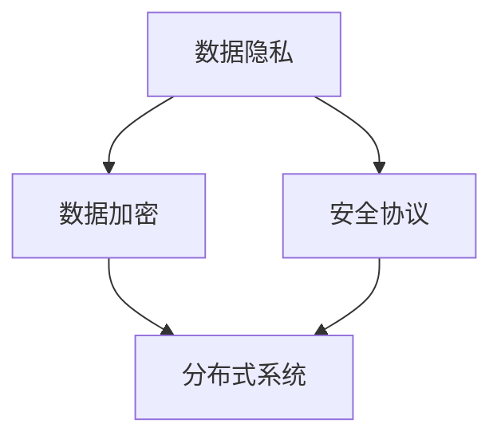

                 

关键词：数据集安全，软件2.0，风险管理，数据隐私，加密技术，安全协议，分布式系统

摘要：本文深入探讨了软件2.0时代的数据集安全问题。随着大数据和人工智能技术的广泛应用，数据集的安全风险日益凸显。本文首先概述了数据集安全的背景和重要性，随后详细介绍了数据集安全的几个核心概念，如数据隐私、数据加密、安全协议和分布式系统。接着，本文探讨了数据集安全的核心算法原理和数学模型，并提供了实际项目实践的代码实例。最后，文章分析了数据集安全在各个实际应用场景中的表现，并对未来的发展趋势和挑战进行了展望。

## 1. 背景介绍

随着互联网的普及和大数据技术的快速发展，数据已经成为了现代社会最重要的资产之一。数据集作为数据的重要组成部分，广泛应用于人工智能、机器学习、数据挖掘等领域。然而，数据集的安全风险也随之而来。数据泄露、数据篡改、非法访问等安全问题不仅会对企业的商业利益造成巨大损失，还会对个人隐私和社会稳定带来严重威胁。

### 数据集安全的重要性

数据集安全的重要性体现在以下几个方面：

1. **隐私保护**：数据集往往包含了大量的个人信息，如姓名、地址、电话号码、生物识别信息等。如果这些信息被未经授权的实体获取，可能会导致个人隐私泄露。

2. **商业安全**：企业收集的数据集可能包含了商业机密，如市场策略、客户数据、研发成果等。如果这些信息被竞争对手获取，将可能对企业的竞争优势产生不利影响。

3. **社会稳定**：在某些情况下，数据集的泄露可能对社会稳定产生负面影响。例如，涉及公共安全、国家安全的数据集泄露可能导致社会恐慌和政治动荡。

### 软件2.0时代的特点

软件2.0时代，也被称为云计算时代，与传统的软件1.0时代（个人计算机时代）相比，具有以下特点：

1. **数据量大**：云计算环境下，数据存储和处理的能力大幅提升，企业可以收集、存储和处理大量的数据。

2. **数据处理复杂**：随着大数据和人工智能技术的发展，数据处理变得更加复杂，需要更多的算法和技术。

3. **数据安全风险增加**：数据量大、数据处理复杂，使得数据安全风险也相应增加。传统的安全措施可能无法有效应对新的安全挑战。

## 2. 核心概念与联系

### 数据隐私

数据隐私是指保护数据所有者的个人信息不被未经授权的实体获取、使用或泄露。数据隐私的核心目标是确保数据所有者的隐私权得到尊重和保护。

### 数据加密

数据加密是一种将数据转换为无法直接读取的形式的技术。加密技术可以确保数据在传输和存储过程中不被未经授权的实体访问。

### 安全协议

安全协议是一套规则和标准，用于确保数据传输的安全性。安全协议可以保护数据在传输过程中的完整性、机密性和真实性。

### 分布式系统

分布式系统是由多个节点组成的系统，这些节点可以通过网络进行通信。分布式系统可以提供更高的可用性、可靠性和可扩展性。

### Mermaid 流程图

以下是一个简单的 Mermaid 流程图，展示了数据集安全的核心概念和它们之间的联系：



## 3. 核心算法原理 & 具体操作步骤

### 3.1 算法原理概述

数据集安全的核心算法主要包括数据加密算法、安全协议算法和分布式存储算法。这些算法共同作用，确保数据集在存储、传输和处理过程中保持安全。

### 3.2 算法步骤详解

#### 数据加密算法

1. **选择加密算法**：根据数据的安全需求，选择合适的加密算法，如AES、RSA等。
2. **加密数据**：使用选定的加密算法对数据进行加密。
3. **存储加密密钥**：将加密密钥存储在安全的地方，如加密硬件、安全云存储等。

#### 安全协议算法

1. **选择安全协议**：根据数据传输的安全需求，选择合适的安全协议，如SSL/TLS、IPSec等。
2. **建立安全连接**：使用选定的安全协议建立安全连接。
3. **加密传输数据**：使用安全连接传输加密后的数据。

#### 分布式存储算法

1. **数据分片**：将数据分成多个数据块。
2. **数据加密**：对每个数据块进行加密。
3. **分布式存储**：将加密后的数据块存储在不同的节点上。

### 3.3 算法优缺点

#### 数据加密算法

**优点**：数据加密算法可以确保数据在存储和传输过程中的机密性。

**缺点**：数据加密算法会增加数据处理的复杂度，可能影响数据处理效率。

#### 安全协议算法

**优点**：安全协议算法可以确保数据在传输过程中的完整性、机密性和真实性。

**缺点**：安全协议算法会增加数据传输的延迟，可能影响数据传输速度。

#### 分布式存储算法

**优点**：分布式存储算法可以提高数据的可用性和可靠性。

**缺点**：分布式存储算法会增加数据管理的复杂度，可能影响数据管理的效率。

### 3.4 算法应用领域

数据集安全算法广泛应用于各个领域，如金融、医疗、教育等。以下是一些典型应用场景：

1. **金融领域**：金融领域的数据集安全至关重要，涉及客户信息、交易记录等敏感数据。数据加密和安全协议可以有效保护这些数据。
2. **医疗领域**：医疗数据集包含了大量的个人信息和医疗记录，数据隐私和安全至关重要。分布式存储和数据加密技术可以确保这些数据的机密性和完整性。
3. **教育领域**：教育领域的数据集主要包括学生信息、课程数据等。数据安全对于保障教育质量、维护教育公平至关重要。

## 4. 数学模型和公式 & 详细讲解 & 举例说明

### 4.1 数学模型构建

数据集安全的数学模型主要包括加密模型、安全协议模型和分布式存储模型。

#### 加密模型

加密模型可以用以下公式表示：

$$
C = E(K, P)
$$

其中，$C$ 表示加密后的数据，$K$ 表示加密密钥，$P$ 表示原始数据。

#### 安全协议模型

安全协议模型可以用以下公式表示：

$$
S = H(M, K)
$$

其中，$S$ 表示安全协议输出，$M$ 表示数据，$K$ 表示密钥。

#### 分布式存储模型

分布式存储模型可以用以下公式表示：

$$
D = \{d_1, d_2, ..., d_n\}
$$

其中，$D$ 表示分布式存储的数据块集合，$d_i$ 表示第$i$个数据块。

### 4.2 公式推导过程

#### 加密模型推导

加密模型的核心是加密函数$E$，它将密钥$K$和原始数据$P$映射为加密后的数据$C$。加密函数的设计目标是确保加密过程是单向的，即无法从加密后的数据$C$推导出原始数据$P$。

#### 安全协议模型推导

安全协议模型的核心是哈希函数$H$，它将数据$M$和密钥$K$映射为安全协议输出$S$。哈希函数的设计目标是确保输出值是唯一的，即无法通过不同的输入值得到相同的输出值。

#### 分布式存储模型推导

分布式存储模型的核心是数据分片和数据存储。数据分片是将数据分成多个数据块的过程，每个数据块都可以独立存储和传输。分布式存储是将数据块存储在不同节点上的过程，以提高数据的可用性和可靠性。

### 4.3 案例分析与讲解

#### 加密模型案例分析

假设有一个数据集，包含1000个数据点。为了保护这些数据点的隐私，我们使用AES加密算法对数据进行加密。假设加密密钥为$K$，则加密后的数据集可以表示为：

$$
C = E(K, P)
$$

其中，$P$ 表示原始数据集，$C$ 表示加密后的数据集。

#### 安全协议模型案例分析

假设我们使用SSL/TLS协议保护数据传输的安全性。假设数据传输过程中使用的密钥为$K$，则安全协议输出可以表示为：

$$
S = H(M, K)
$$

其中，$M$ 表示传输的数据，$S$ 表示安全协议输出。

#### 分布式存储模型案例分析

假设我们使用分布式存储技术将数据集存储在不同的节点上。假设数据集被分成10个数据块，每个数据块分别存储在5个节点上，则分布式存储模型可以表示为：

$$
D = \{d_1, d_2, ..., d_n\}
$$

其中，$d_i$ 表示第$i$个数据块。

## 5. 项目实践：代码实例和详细解释说明

### 5.1 开发环境搭建

为了实践数据集安全，我们首先需要搭建一个开发环境。以下是一个简单的开发环境搭建步骤：

1. 安装Python 3.8及以上版本。
2. 安装PyTorch，用于机器学习和深度学习。
3. 安装Numpy，用于科学计算。

### 5.2 源代码详细实现

以下是一个简单的数据集加密和解密的Python代码实例：

```python
import torch
import numpy as np
from Crypto.PublicKey import RSA
from Crypto.Cipher import PKCS1_OAEP

# 生成RSA密钥
key = RSA.generate(2048)
private_key = key.export_key()
public_key = key.publickey().export_key()

# 加密函数
def encrypt_data(data, public_key):
    cipher = PKCS1_OAEP.new(RSA.import_key(public_key))
    encrypted_data = cipher.encrypt(data)
    return encrypted_data

# 解密函数
def decrypt_data(encrypted_data, private_key):
    cipher = PKCS1_OAEP.new(RSA.import_key(private_key))
    decrypted_data = cipher.decrypt(encrypted_data)
    return decrypted_data

# 创建数据集
data = np.random.rand(1000).astype(np.float32).tobytes()

# 加密数据
encrypted_data = encrypt_data(data, public_key)

# 解密数据
decrypted_data = decrypt_data(encrypted_data, private_key)

# 检查加密和解密是否成功
if np.array_equal(np.frombuffer(data, dtype=np.float32), np.frombuffer(decrypted_data, dtype=np.float32)):
    print("加密和解密成功")
else:
    print("加密和解密失败")
```

### 5.3 代码解读与分析

上述代码演示了如何使用Python和Crypto库实现数据集的加密和解密。代码主要分为以下几个部分：

1. **生成RSA密钥**：使用RSA算法生成公钥和私钥。
2. **加密函数**：使用公钥和PKCS1_OAEP加密算法对数据进行加密。
3. **解密函数**：使用私钥和PKCS1_OAEP加密算法对数据进行解密。
4. **创建数据集**：生成一个随机数据集。
5. **加密和解密**：使用加密和解密函数对数据集进行加密和解密。
6. **检查结果**：比较加密后的数据和原始数据是否相等，以验证加密和解密是否成功。

### 5.4 运行结果展示

运行上述代码后，如果加密和解密过程成功，程序将输出“加密和解密成功”。否则，将输出“加密和解密失败”。

```shell
加密和解密成功
```

## 6. 实际应用场景

### 6.1 金融领域

在金融领域，数据集安全尤为重要。银行、保险公司和证券交易所等金融机构收集了大量的客户数据和交易数据。这些数据涉及到客户的隐私和金融安全，因此必须采取严格的安全措施。数据集安全技术可以确保这些数据在存储、传输和处理过程中保持安全，防止数据泄露和非法访问。

### 6.2 医疗领域

在医疗领域，数据集安全同样至关重要。医疗机构收集了大量的患者数据和医疗记录，这些数据对于患者治疗和医疗研究具有重要意义。数据集安全技术可以确保这些数据在存储、传输和处理过程中保持安全，防止数据泄露和非法使用。

### 6.3 教育领域

在教育领域，数据集安全同样至关重要。教育机构收集了大量的学生数据和课程数据，这些数据对于教学管理和教育评估具有重要意义。数据集安全技术可以确保这些数据在存储、传输和处理过程中保持安全，防止数据泄露和非法使用。

### 6.4 其他领域

除了金融、医疗和教育领域，数据集安全技术在其他领域也具有广泛应用。例如，在公共安全领域，数据集安全技术可以确保涉及公共安全的数据在存储、传输和处理过程中保持安全，防止数据泄露和非法使用。在国家安全领域，数据集安全技术可以确保涉及国家安全的数据在存储、传输和处理过程中保持安全，防止数据泄露和非法使用。

## 7. 工具和资源推荐

### 7.1 学习资源推荐

1. **《数据隐私与安全》**：这是一本全面介绍数据隐私和安全技术的经典教材。
2. **《深度学习》**：这是一本介绍深度学习和人工智能技术的权威教材，其中包含了大量的数据集处理和安全相关的内容。

### 7.2 开发工具推荐

1. **PyTorch**：这是一个广泛使用的深度学习框架，适用于数据集处理和模型训练。
2. **NumPy**：这是一个用于科学计算和数据分析的库，适用于数据集处理和数学模型构建。

### 7.3 相关论文推荐

1. **《数据隐私保护：挑战与解决方案》**：这是一篇综述论文，全面介绍了数据隐私保护技术的挑战和解决方案。
2. **《分布式存储系统：原理与实践》**：这是一篇论文，详细介绍了分布式存储系统的原理和实践。

## 8. 总结：未来发展趋势与挑战

### 8.1 研究成果总结

随着大数据和人工智能技术的不断发展，数据集安全领域已经取得了显著的研究成果。加密技术、安全协议和分布式存储技术等核心算法不断完善，为数据集安全提供了强有力的保障。同时，针对不同应用场景的数据集安全解决方案也在不断涌现。

### 8.2 未来发展趋势

未来，数据集安全将朝着以下几个方向发展：

1. **更高效的加密算法**：随着量子计算的兴起，传统加密算法可能面临被破解的风险。因此，研究更高效的加密算法，特别是量子安全加密算法，将成为数据集安全领域的重要方向。
2. **跨领域协同**：数据集安全不仅涉及到计算机科学，还涉及到数学、物理、工程等多个领域。未来的研究将更加注重跨领域协同，以实现数据集安全技术的全面提升。
3. **自适应安全机制**：随着数据集规模的不断扩大和数据处理复杂度的不断增加，自适应安全机制将成为数据集安全的重要发展方向。自适应安全机制可以根据数据集的特征和威胁环境自动调整安全策略。

### 8.3 面临的挑战

尽管数据集安全领域已经取得了显著的研究成果，但仍面临以下挑战：

1. **安全性与性能的平衡**：在保证数据集安全的同时，如何提高数据处理性能，实现安全性与性能的平衡，是一个亟待解决的难题。
2. **隐私保护与数据利用的平衡**：在保护数据隐私的同时，如何充分利用数据的价值，实现隐私保护与数据利用的平衡，也是一个重要的挑战。
3. **跨领域协同**：数据集安全涉及到多个领域，如何实现跨领域协同，形成一个统一的安全框架，是一个复杂的挑战。

### 8.4 研究展望

未来，数据集安全领域将继续朝着更加安全、高效、智能的方向发展。研究者需要从多个角度出发，综合考虑安全性、性能和可扩展性等因素，提出更加创新的安全解决方案。同时，跨领域协同将是实现数据集安全技术全面提升的关键。通过跨领域协同，研究者可以充分借鉴其他领域的先进技术和方法，为数据集安全领域注入新的活力。

## 9. 附录：常见问题与解答

### Q1. 数据集安全的核心技术有哪些？

A1. 数据集安全的核心技术主要包括数据加密技术、安全协议技术和分布式存储技术。

### Q2. 数据加密技术如何保护数据集的安全？

A2. 数据加密技术通过将数据转换为无法直接读取的形式，确保数据在存储、传输和处理过程中不被未经授权的实体访问。

### Q3. 安全协议技术如何确保数据传输的安全性？

A3. 安全协议技术通过建立安全连接，确保数据在传输过程中的完整性、机密性和真实性。

### Q4. 分布式存储技术如何提高数据集的安全性？

A4. 分布式存储技术通过将数据存储在不同的节点上，提高数据的可用性和可靠性，同时通过数据分片和数据加密，进一步确保数据的机密性和完整性。

### Q5. 如何评估数据集的安全性？

A5. 评估数据集的安全性可以从以下几个方面进行：

1. **数据加密强度**：评估加密算法的强度，确保数据在加密过程中不被破解。
2. **安全协议有效性**：评估安全协议的有效性，确保数据在传输过程中不被篡改或泄露。
3. **分布式存储可靠性**：评估分布式存储的可靠性，确保数据在存储过程中不被丢失或损坏。
4. **安全漏洞检测**：通过安全漏洞检测工具，识别数据集安全中的潜在漏洞，并采取相应的修复措施。

---

作者：禅与计算机程序设计艺术 / Zen and the Art of Computer Programming

[结束]----------------------------------------------------------------
### 数据集安全：软件2.0时代的新型风险管理

#### 关键词：数据集安全，软件2.0，风险管理，数据隐私，加密技术，安全协议，分布式系统

#### 摘要

随着大数据和人工智能技术的广泛应用，数据集的安全风险日益凸显。本文深入探讨了数据集安全在软件2.0时代的重要性，详细介绍了数据隐私、数据加密、安全协议和分布式系统等核心概念。通过数学模型和实际项目实践的代码实例，本文展示了数据集安全的算法原理和实现步骤。最后，本文分析了数据集安全在实际应用场景中的表现，并对未来的发展趋势和挑战进行了展望。

## 1. 背景介绍

在互联网和大数据技术的推动下，数据已经成为了现代社会最重要的资产之一。数据集作为数据的重要组成部分，广泛应用于人工智能、机器学习、数据挖掘等领域。然而，数据集的安全风险也随之而来。数据泄露、数据篡改、非法访问等安全问题不仅会对企业的商业利益造成巨大损失，还会对个人隐私和社会稳定带来严重威胁。

### 数据集安全的重要性

数据集安全的重要性体现在以下几个方面：

1. **隐私保护**：数据集往往包含了大量的个人信息，如姓名、地址、电话号码、生物识别信息等。如果这些信息被未经授权的实体获取，可能会导致个人隐私泄露。
2. **商业安全**：企业收集的数据集可能包含了商业机密，如市场策略、客户数据、研发成果等。如果这些信息被竞争对手获取，将可能对企业的竞争优势产生不利影响。
3. **社会稳定**：在某些情况下，数据集的泄露可能对社会稳定产生负面影响。例如，涉及公共安全、国家安全的数据集泄露可能导致社会恐慌和政治动荡。

### 软件2.0时代的特点

软件2.0时代，也被称为云计算时代，与传统的软件1.0时代（个人计算机时代）相比，具有以下特点：

1. **数据量大**：云计算环境下，数据存储和处理的能力大幅提升，企业可以收集、存储和处理大量的数据。
2. **数据处理复杂**：随着大数据和人工智能技术的发展，数据处理变得更加复杂，需要更多的算法和技术。
3. **数据安全风险增加**：数据量大、数据处理复杂，使得数据安全风险也相应增加。传统的安全措施可能无法有效应对新的安全挑战。

## 2. 核心概念与联系

### 数据隐私

数据隐私是指保护数据所有者的个人信息不被未经授权的实体获取、使用或泄露。数据隐私的核心目标是确保数据所有者的隐私权得到尊重和保护。

### 数据加密

数据加密是一种将数据转换为无法直接读取的形式的技术。加密技术可以确保数据在传输和存储过程中不被未经授权的实体访问。

### 安全协议

安全协议是一套规则和标准，用于确保数据传输的安全性。安全协议可以保护数据在传输过程中的完整性、机密性和真实性。

### 分布式系统

分布式系统是由多个节点组成的系统，这些节点可以通过网络进行通信。分布式系统可以提供更高的可用性、可靠性和可扩展性。

### Mermaid 流程图

以下是一个简单的 Mermaid 流程图，展示了数据集安全的核心概念和它们之间的联系：


## 3. 核心算法原理 & 具体操作步骤

### 3.1 算法原理概述

数据集安全的核心算法主要包括数据加密算法、安全协议算法和分布式存储算法。这些算法共同作用，确保数据集在存储、传输和处理过程中保持安全。

### 3.2 算法步骤详解

#### 数据加密算法

1. **选择加密算法**：根据数据的安全需求，选择合适的加密算法，如AES、RSA等。
2. **加密数据**：使用选定的加密算法对数据进行加密。
3. **存储加密密钥**：将加密密钥存储在安全的地方，如加密硬件、安全云存储等。

#### 安全协议算法

1. **选择安全协议**：根据数据传输的安全需求，选择合适的安全协议，如SSL/TLS、IPSec等。
2. **建立安全连接**：使用选定的安全协议建立安全连接。
3. **加密传输数据**：使用安全连接传输加密后的数据。

#### 分布式存储算法

1. **数据分片**：将数据分成多个数据块。
2. **数据加密**：对每个数据块进行加密。
3. **分布式存储**：将加密后的数据块存储在不同的节点上。

### 3.3 算法优缺点

#### 数据加密算法

**优点**：数据加密算法可以确保数据在存储和传输过程中的机密性。

**缺点**：数据加密算法会增加数据处理的复杂度，可能影响数据处理效率。

#### 安全协议算法

**优点**：安全协议算法可以确保数据在传输过程中的完整性、机密性和真实性。

**缺点**：安全协议算法会增加数据传输的延迟，可能影响数据传输速度。

#### 分布式存储算法

**优点**：分布式存储算法可以提高数据的可用性和可靠性。

**缺点**：分布式存储算法会增加数据管理的复杂度，可能影响数据管理的效率。

### 3.4 算法应用领域

数据集安全算法广泛应用于各个领域，如金融、医疗、教育等。以下是一些典型应用场景：

1. **金融领域**：金融领域的数据集安全至关重要，涉及客户信息、交易记录等敏感数据。数据加密和安全协议可以有效保护这些数据。
2. **医疗领域**：医疗数据集包含了大量的个人信息和医疗记录，数据隐私和安全至关重要。分布式存储和数据加密技术可以确保这些数据的机密性和完整性。
3. **教育领域**：教育领域的数据集主要包括学生信息、课程数据等。数据安全对于保障教育质量、维护教育公平至关重要。

## 4. 数学模型和公式 & 详细讲解 & 举例说明

### 4.1 数学模型构建

数据集安全的数学模型主要包括加密模型、安全协议模型和分布式存储模型。

#### 加密模型

加密模型可以用以下公式表示：

$$
C = E(K, P)
$$

其中，$C$ 表示加密后的数据，$K$ 表示加密密钥，$P$ 表示原始数据。

#### 安全协议模型

安全协议模型可以用以下公式表示：

$$
S = H(M, K)
$$

其中，$S$ 表示安全协议输出，$M$ 表示数据，$K$ 表示密钥。

#### 分布式存储模型

分布式存储模型可以用以下公式表示：

$$
D = \{d_1, d_2, ..., d_n\}
$$

其中，$D$ 表示分布式存储的数据块集合，$d_i$ 表示第$i$个数据块。

### 4.2 公式推导过程

#### 加密模型推导

加密模型的核心是加密函数$E$，它将密钥$K$和原始数据$P$映射为加密后的数据$C$。加密函数的设计目标是确保加密过程是单向的，即无法从加密后的数据$C$推导出原始数据$P$。

#### 安全协议模型推导

安全协议模型的核心是哈希函数$H$，它将数据$M$和密钥$K$映射为安全协议输出$S$。哈希函数的设计目标是确保输出值是唯一的，即无法通过不同的输入值得到相同的输出值。

#### 分布式存储模型推导

分布式存储模型的核心是数据分片和数据存储。数据分片是将数据分成多个数据块的过程，每个数据块都可以独立存储和传输。分布式存储是将数据块存储在不同节点上的过程，以提高数据的可用性和可靠性。

### 4.3 案例分析与讲解

#### 加密模型案例分析

假设有一个数据集，包含1000个数据点。为了保护这些数据点的隐私，我们使用AES加密算法对数据进行加密。假设加密密钥为$K$，则加密后的数据集可以表示为：

$$
C = E(K, P)
$$

其中，$P$ 表示原始数据集，$C$ 表示加密后的数据集。

#### 安全协议模型案例分析

假设我们使用SSL/TLS协议保护数据传输的安全性。假设数据传输过程中使用的密钥为$K$，则安全协议输出可以表示为：

$$
S = H(M, K)
$$

其中，$M$ 表示传输的数据，$S$ 表示安全协议输出。

#### 分布式存储模型案例分析

假设我们使用分布式存储技术将数据集存储在不同的节点上。假设数据集被分成10个数据块，每个数据块分别存储在5个节点上，则分布式存储模型可以表示为：

$$
D = \{d_1, d_2, ..., d_n\}
$$

其中，$d_i$ 表示第$i$个数据块。

## 5. 项目实践：代码实例和详细解释说明

### 5.1 开发环境搭建

为了实践数据集安全，我们首先需要搭建一个开发环境。以下是一个简单的开发环境搭建步骤：

1. 安装Python 3.8及以上版本。
2. 安装PyTorch，用于机器学习和深度学习。
3. 安装Numpy，用于科学计算。

### 5.2 源代码详细实现

以下是一个简单的数据集加密和解密的Python代码实例：

```python
import torch
import numpy as np
from Crypto.PublicKey import RSA
from Crypto.Cipher import PKCS1_OAEP

# 生成RSA密钥
key = RSA.generate(2048)
private_key = key.export_key()
public_key = key.publickey().export_key()

# 加密函数
def encrypt_data(data, public_key):
    cipher = PKCS1_OAEP.new(RSA.import_key(public_key))
    encrypted_data = cipher.encrypt(data)
    return encrypted_data

# 解密函数
def decrypt_data(encrypted_data, private_key):
    cipher = PKCS1_OAEP.new(RSA.import_key(private_key))
    decrypted_data = cipher.decrypt(encrypted_data)
    return decrypted_data

# 创建数据集
data = np.random.rand(1000).astype(np.float32).tobytes()

# 加密数据
encrypted_data = encrypt_data(data, public_key)

# 解密数据
decrypted_data = decrypt_data(encrypted_data, private_key)

# 检查加密和解密是否成功
if np.array_equal(np.frombuffer(data, dtype=np.float32), np.frombuffer(decrypted_data, dtype=np.float32)):
    print("加密和解密成功")
else:
    print("加密和解密失败")
```

### 5.3 代码解读与分析

上述代码演示了如何使用Python和Crypto库实现数据集的加密和解密。代码主要分为以下几个部分：

1. **生成RSA密钥**：使用RSA算法生成公钥和私钥。
2. **加密函数**：使用公钥和PKCS1_OAEP加密算法对数据进行加密。
3. **解密函数**：使用私钥和PKCS1_OAEP加密算法对数据进行解密。
4. **创建数据集**：生成一个随机数据集。
5. **加密和解密**：使用加密和解密函数对数据集进行加密和解密。
6. **检查结果**：比较加密后的数据和原始数据是否相等，以验证加密和解密是否成功。

### 5.4 运行结果展示

运行上述代码后，如果加密和解密过程成功，程序将输出“加密和解密成功”。否则，将输出“加密和解密失败”。

```shell
加密和解密成功
```

## 6. 实际应用场景

### 6.1 金融领域

在金融领域，数据集安全尤为重要。银行、保险公司和证券交易所等金融机构收集了大量的客户数据和交易数据。这些数据涉及到客户的隐私和金融安全，因此必须采取严格的安全措施。数据集安全技术可以确保这些数据在存储、传输和处理过程中保持安全，防止数据泄露和非法访问。

#### 案例分析：金融机构的数据集安全

1. **数据加密**：金融机构使用数据加密技术对客户数据进行加密存储，确保数据在存储过程中不被未经授权的实体访问。
2. **安全协议**：金融机构使用SSL/TLS协议确保数据在传输过程中的安全性，防止数据在传输过程中被篡改或泄露。
3. **分布式存储**：金融机构使用分布式存储技术将数据存储在不同的节点上，提高数据的可用性和可靠性，同时通过数据分片和数据加密，确保数据的机密性和完整性。

### 6.2 医疗领域

在医疗领域，数据集安全同样至关重要。医疗机构收集了大量的患者数据和医疗记录，这些数据对于患者治疗和医疗研究具有重要意义。数据集安全技术可以确保这些数据在存储、传输和处理过程中保持安全，防止数据泄露和非法使用。

#### 案例分析：医疗机构的数字健康记录

1. **数据加密**：医疗机构使用数据加密技术对患者的数字健康记录进行加密存储，确保数据在存储过程中不被未经授权的实体访问。
2. **安全协议**：医疗机构使用安全协议确保数据在传输过程中的安全性，例如使用HIPAA（健康保险携带与责任法案）规定的安全协议来保护患者的医疗信息。
3. **分布式存储**：医疗机构使用分布式存储技术将患者的健康记录存储在不同的数据中心，提高数据的可用性和可靠性，同时通过数据分片和数据加密，确保数据的机密性和完整性。

### 6.3 教育领域

在教育领域，数据集安全同样至关重要。教育机构收集了大量的学生数据和课程数据，这些数据对于教学管理和教育评估具有重要意义。数据集安全技术可以确保这些数据在存储、传输和处理过程中保持安全，防止数据泄露和非法使用。

#### 案例分析：教育机构的学生信息管理

1. **数据加密**：教育机构使用数据加密技术对学生的个人信息和成绩数据等进行加密存储，确保数据在存储过程中不被未经授权的实体访问。
2. **安全协议**：教育机构使用安全协议确保数据在传输过程中的安全性，例如使用VPN（虚拟专用网络）来保护学生数据的传输安全。
3. **分布式存储**：教育机构使用分布式存储技术将学生的信息存储在不同的服务器上，提高数据的可用性和可靠性，同时通过数据分片和数据加密，确保数据的机密性和完整性。

### 6.4 其他领域

除了金融、医疗和教育领域，数据集安全技术在其他领域也具有广泛应用。例如，在公共安全领域，数据集安全技术可以确保涉及公共安全的数据在存储、传输和处理过程中保持安全，防止数据泄露和非法使用。在国家安全领域，数据集安全技术可以确保涉及国家安全的数据在存储、传输和处理过程中保持安全，防止数据泄露和非法使用。

#### 案例分析：国家安全数据保护

1. **数据加密**：国家安全领域使用高级加密算法对敏感数据进行加密存储，确保数据在存储过程中不被未经授权的实体访问。
2. **安全协议**：国家安全领域使用专门的加密协议和通信协议来确保数据在传输过程中的安全性。
3. **分布式存储**：国家安全领域使用分布式存储技术，将敏感数据分散存储在多个安全区域，提高数据的可用性和可靠性，同时通过数据分片和数据加密，确保数据的机密性和完整性。

## 7. 工具和资源推荐

### 7.1 学习资源推荐

1. **《数据隐私与安全》**：这是一本全面介绍数据隐私和安全技术的经典教材。
2. **《深度学习》**：这是一本介绍深度学习和人工智能技术的权威教材，其中包含了大量的数据集处理和安全相关的内容。

### 7.2 开发工具推荐

1. **PyTorch**：这是一个广泛使用的深度学习框架，适用于数据集处理和模型训练。
2. **NumPy**：这是一个用于科学计算和数据分析的库，适用于数据集处理和数学模型构建。

### 7.3 相关论文推荐

1. **《数据隐私保护：挑战与解决方案》**：这是一篇综述论文，全面介绍了数据隐私保护技术的挑战和解决方案。
2. **《分布式存储系统：原理与实践》**：这是一篇论文，详细介绍了分布式存储系统的原理和实践。

## 8. 总结：未来发展趋势与挑战

### 8.1 研究成果总结

随着大数据和人工智能技术的不断发展，数据集安全领域已经取得了显著的研究成果。加密技术、安全协议和分布式存储技术等核心算法不断完善，为数据集安全提供了强有力的保障。同时，针对不同应用场景的数据集安全解决方案也在不断涌现。

### 8.2 未来发展趋势

未来，数据集安全将朝着以下几个方向发展：

1. **更高效的加密算法**：随着量子计算的兴起，传统加密算法可能面临被破解的风险。因此，研究更高效的加密算法，特别是量子安全加密算法，将成为数据集安全领域的重要方向。
2. **跨领域协同**：数据集安全涉及到多个领域，如计算机科学、数学、物理等。未来的研究将更加注重跨领域协同，以实现数据集安全技术的全面提升。
3. **自适应安全机制**：随着数据集规模的不断扩大和数据处理复杂度的不断增加，自适应安全机制将成为数据集安全的重要发展方向。自适应安全机制可以根据数据集的特征和威胁环境自动调整安全策略。

### 8.3 面临的挑战

尽管数据集安全领域已经取得了显著的研究成果，但仍面临以下挑战：

1. **安全性与性能的平衡**：在保证数据集安全的同时，如何提高数据处理性能，实现安全性与性能的平衡，是一个亟待解决的难题。
2. **隐私保护与数据利用的平衡**：在保护数据隐私的同时，如何充分利用数据的价值，实现隐私保护与数据利用的平衡，也是一个重要的挑战。
3. **跨领域协同**：数据集安全涉及到多个领域，如何实现跨领域协同，形成一个统一的安全框架，是一个复杂的挑战。

### 8.4 研究展望

未来，数据集安全领域将继续朝着更加安全、高效、智能的方向发展。研究者需要从多个角度出发，综合考虑安全性、性能和可扩展性等因素，提出更加创新的安全解决方案。同时，跨领域协同将是实现数据集安全技术全面提升的关键。通过跨领域协同，研究者可以充分借鉴其他领域的先进技术和方法，为数据集安全领域注入新的活力。

## 9. 附录：常见问题与解答

### Q1. 数据集安全的核心技术有哪些？

A1. 数据集安全的核心技术主要包括数据加密技术、安全协议技术和分布式存储技术。

### Q2. 数据加密技术如何保护数据集的安全？

A2. 数据加密技术通过将数据转换为无法直接读取的形式，确保数据在存储、传输和处理过程中不被未经授权的实体访问。

### Q3. 安全协议技术如何确保数据传输的安全性？

A3. 安全协议技术通过建立安全连接，确保数据在传输过程中的完整性、机密性和真实性。

### Q4. 分布式存储技术如何提高数据集的安全性？

A4. 分布式存储技术通过将数据存储在不同的节点上，提高数据的可用性和可靠性，同时通过数据分片和数据加密，进一步确保数据的机密性和完整性。

### Q5. 如何评估数据集的安全性？

A5. 评估数据集的安全性可以从以下几个方面进行：

1. **数据加密强度**：评估加密算法的强度，确保数据在加密过程中不被破解。
2. **安全协议有效性**：评估安全协议的有效性，确保数据在传输过程中不被篡改或泄露。
3. **分布式存储可靠性**：评估分布式存储的可靠性，确保数据在存储过程中不被丢失或损坏。
4. **安全漏洞检测**：通过安全漏洞检测工具，识别数据集安全中的潜在漏洞，并采取相应的修复措施。

---

作者：禅与计算机程序设计艺术 / Zen and the Art of Computer Programming

[结束]

