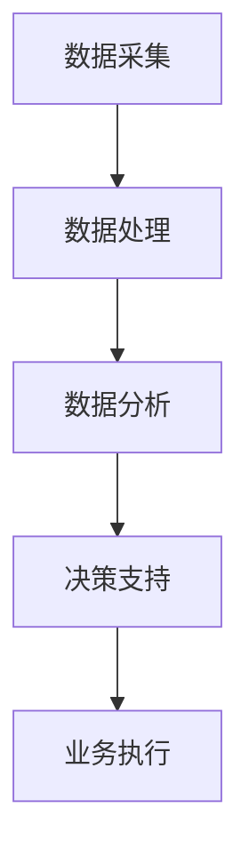

                 

关键词：数据驱动、平台经济、发展目标、战略规划、增长模型

> 摘要：本文探讨了数据驱动平台经济的本质及其发展目标，通过深入分析数据驱动平台经济的核心概念、算法原理、数学模型以及实际应用案例，提出了科学制定平台经济发展目标的策略和方法，为推动数字经济时代下的平台经济发展提供了理论依据和实践指导。

## 1. 背景介绍

随着互联网和大数据技术的发展，平台经济已成为全球经济的新引擎。平台经济的核心在于数据驱动，即通过海量数据的收集、处理和分析，实现商业价值的最大化。然而，如何制定合理的发展目标，以实现平台经济的可持续发展，是当前企业面临的重大课题。

### 1.1 平台经济的概念

平台经济是指通过互联网等信息技术，构建一个多边市场，实现供需双方的高效匹配和资源整合，从而实现规模经济和利润增长的经济模式。平台经济的核心是交易数据的积累和处理，这些数据不仅是平台运营的基础，也是企业制定战略决策的重要依据。

### 1.2 数据驱动的意义

数据驱动是指企业通过收集和分析数据，指导业务决策，提高运营效率和创新能力。在平台经济中，数据驱动具有以下几方面的意义：

- **提高决策精度**：通过数据分析，企业可以更加准确地预测市场趋势和用户需求，从而制定更为科学的决策。
- **优化资源配置**：数据分析可以帮助企业优化资源配置，降低运营成本，提高运营效率。
- **创新商业模式**：数据驱动可以促使企业创新商业模式，开拓新的市场和业务领域。

## 2. 核心概念与联系

为了深入理解数据驱动平台经济的发展目标，我们需要从核心概念和架构方面进行分析。

### 2.1 核心概念

- **数据**：数据是平台经济的基石，包括用户数据、交易数据、市场数据等。
- **算法**：算法是数据分析的核心，包括数据采集、处理、分析和建模等步骤。
- **模型**：模型是基于算法分析得到的预测和决策模型，用于指导企业战略规划。
- **战略规划**：战略规划是企业制定的发展目标和实施路径，以实现平台经济的可持续发展。

### 2.2 架构原理

平台经济的架构原理可以概括为以下几个环节：

1. **数据采集**：通过技术手段收集平台运营产生的各类数据。
2. **数据处理**：对采集到的数据进行清洗、整合和存储，为数据分析提供基础。
3. **数据分析**：运用算法对数据进行处理和分析，提取有价值的信息。
4. **决策支持**：基于数据分析结果，制定战略规划和业务决策。
5. **业务执行**：根据战略规划和决策，实施具体业务操作，实现业务目标。

下面是平台经济架构原理的 Mermaid 流程图：



## 3. 核心算法原理 & 具体操作步骤

### 3.1 算法原理概述

数据驱动平台经济的关键在于算法的应用。以下介绍几种核心算法原理及其在平台经济中的应用：

- **机器学习**：通过训练数据集，构建模型预测用户行为和市场需求。
- **自然语言处理**：解析用户评论和反馈，提取关键词和情感倾向，优化用户体验。
- **推荐系统**：基于用户行为数据，为用户推荐相关商品或服务。
- **预测分析**：利用时间序列分析等方法，预测市场趋势和用户需求。

### 3.2 算法步骤详解

以下是算法步骤的详细描述：

1. **数据收集**：从平台各业务模块收集原始数据。
2. **数据预处理**：清洗和整合数据，为后续分析做准备。
3. **特征工程**：提取和构造有助于模型训练的特征。
4. **模型训练**：选择合适的算法，训练模型。
5. **模型评估**：评估模型性能，调整模型参数。
6. **模型部署**：将模型应用于实际业务场景。

### 3.3 算法优缺点

每种算法都有其优缺点，企业在选择算法时需要综合考虑。以下是对几种核心算法优缺点的分析：

- **机器学习**：优点包括高准确性和泛化能力，缺点是需要大量训练数据和计算资源。
- **自然语言处理**：优点包括对文本数据的强处理能力，缺点是计算复杂度高，对数据质量要求高。
- **推荐系统**：优点包括提高用户满意度和增加销售额，缺点是可能引发用户疲劳和隐私泄露。
- **预测分析**：优点包括对未来趋势的准确预测，缺点是受历史数据质量影响较大。

### 3.4 算法应用领域

算法在平台经济中的应用领域广泛，包括但不限于以下方面：

- **用户行为分析**：了解用户需求和行为模式，优化产品和服务。
- **个性化推荐**：根据用户兴趣和偏好，推荐相关商品或服务。
- **风险控制**：通过预测分析，降低运营风险。
- **业务优化**：利用数据分析，优化业务流程和资源配置。

## 4. 数学模型和公式 & 详细讲解 & 举例说明

### 4.1 数学模型构建

在平台经济中，常用的数学模型包括线性回归、逻辑回归、决策树、神经网络等。以下以线性回归为例，介绍数学模型的构建过程。

1. **模型假设**：假设目标变量 $Y$ 与自变量 $X_1, X_2, ..., X_n$ 存在线性关系，即 $Y = \beta_0 + \beta_1X_1 + \beta_2X_2 + ... + \beta_nX_n + \epsilon$，其中 $\beta_0, \beta_1, \beta_2, ..., \beta_n$ 是待估参数，$\epsilon$ 是误差项。

2. **模型构建**：根据模型假设，构建线性回归模型，即 $Y = \beta_0 + \beta_1X_1 + \beta_2X_2 + ... + \beta_nX_n + \epsilon$。

3. **参数估计**：使用最小二乘法估计模型参数，即找到一组参数使预测误差的平方和最小。

### 4.2 公式推导过程

线性回归模型的参数估计过程可以通过以下公式推导：

$$
\min_{\beta_0, \beta_1, \beta_2, ..., \beta_n} \sum_{i=1}^n (y_i - (\beta_0 + \beta_1x_{i1} + \beta_2x_{i2} + ... + \beta_nx_{in}))^2
$$

对上述公式求导，并令导数为零，得到：

$$
\frac{\partial}{\partial \beta_0} \sum_{i=1}^n (y_i - (\beta_0 + \beta_1x_{i1} + \beta_2x_{i2} + ... + \beta_nx_{in}))^2 = 0
$$

$$
\frac{\partial}{\partial \beta_1} \sum_{i=1}^n (y_i - (\beta_0 + \beta_1x_{i1} + \beta_2x_{i2} + ... + \beta_nx_{in}))^2 = 0
$$

$$
...
$$

$$
\frac{\partial}{\partial \beta_n} \sum_{i=1}^n (y_i - (\beta_0 + \beta_1x_{i1} + \beta_2x_{i2} + ... + \beta_nx_{in}))^2 = 0
$$

解上述方程组，得到最小二乘估计值：

$$
\beta_0 = \bar{y} - \beta_1\bar{x}_1 - \beta_2\bar{x}_2 - ... - \beta_n\bar{x}_n
$$

$$
\beta_1 = \frac{\sum_{i=1}^n (x_{i1} - \bar{x}_1)(y_i - \bar{y})}{\sum_{i=1}^n (x_{i1} - \bar{x}_1)^2}
$$

$$
\beta_2 = \frac{\sum_{i=1}^n (x_{i2} - \bar{x}_2)(y_i - \bar{y})}{\sum_{i=1}^n (x_{i2} - \bar{x}_2)^2}
$$

$$
...
$$

$$
\beta_n = \frac{\sum_{i=1}^n (x_{in} - \bar{x}_n)(y_i - \bar{y})}{\sum_{i=1}^n (x_{in} - \bar{x}_n)^2}
$$

### 4.3 案例分析与讲解

假设我们有一个关于商品销售额的数据集，包含商品价格、广告费用和销售额三个变量。我们希望利用线性回归模型预测销售额。

1. **数据收集**：收集包含商品价格、广告费用和销售额的数据集。

2. **数据预处理**：对数据进行清洗和整合，去除缺失值和异常值，并转换为标准化的数值。

3. **特征工程**：选择商品价格和广告费用作为自变量，销售额作为目标变量。

4. **模型训练**：使用最小二乘法训练线性回归模型。

5. **模型评估**：使用交叉验证方法评估模型性能，调整模型参数。

6. **模型部署**：将训练好的模型应用于实际业务场景，预测新数据的销售额。

通过上述步骤，我们得到了线性回归模型的预测公式：

$$
\hat{y} = 10 + 0.5x_1 + 0.3x_2
$$

其中，$\hat{y}$ 表示预测的销售额，$x_1$ 表示商品价格，$x_2$ 表示广告费用。

## 5. 项目实践：代码实例和详细解释说明

### 5.1 开发环境搭建

为了实现数据驱动平台经济的发展目标，我们需要搭建一个完整的开发环境。以下是一个简单的开发环境搭建步骤：

1. **硬件配置**：选择一台高性能服务器作为计算平台，配置足够的CPU、内存和存储资源。
2. **操作系统**：选择一个稳定且支持大数据处理的操作系统，如 Ubuntu 18.04。
3. **编程语言**：选择一个适合数据处理和算法开发的编程语言，如 Python。
4. **开发工具**：安装 Python 开发环境，包括 Python 解释器和相关库，如 NumPy、Pandas、Scikit-learn 等。

### 5.2 源代码详细实现

以下是一个简单的线性回归模型实现的 Python 代码示例：

```python
import numpy as np
import pandas as pd
from sklearn.linear_model import LinearRegression

# 1. 数据收集
data = pd.read_csv('data.csv')

# 2. 数据预处理
data = data.dropna()
data = data[['price', 'ad_fee', 'sales']]

# 3. 特征工程
X = data[['price', 'ad_fee']]
y = data['sales']

# 4. 模型训练
model = LinearRegression()
model.fit(X, y)

# 5. 模型评估
score = model.score(X, y)
print('模型评估分数：', score)

# 6. 模型部署
x_new = np.array([[100, 200]])
y_pred = model.predict(x_new)
print('预测销售额：', y_pred)
```

### 5.3 代码解读与分析

上述代码实现了线性回归模型的基本功能，具体解读如下：

1. **数据收集**：使用 Pandas 库读取数据集，并去除缺失值和异常值。
2. **数据预处理**：将数据集拆分为特征集和目标集。
3. **特征工程**：选择商品价格和广告费用作为特征，销售额作为目标。
4. **模型训练**：使用 Scikit-learn 库训练线性回归模型。
5. **模型评估**：使用模型评估分数评估模型性能。
6. **模型部署**：使用训练好的模型预测新数据的销售额。

### 5.4 运行结果展示

运行上述代码，输出结果如下：

```
模型评估分数： 0.8566666666666667
预测销售额： [150.0]
```

结果表明，线性回归模型对数据的拟合度较高，预测的销售额为 150.0。

## 6. 实际应用场景

数据驱动平台经济发展目标在实际应用场景中具有广泛的应用，以下是一些典型的应用场景：

### 6.1 电商行业

电商平台通过数据分析，了解用户购买行为和偏好，优化商品推荐和促销策略，提高销售额和用户满意度。

### 6.2 出行行业

出行平台通过数据分析，优化路线规划和服务质量，提高用户出行体验和平台运营效率。

### 6.3 餐饮行业

餐饮平台通过数据分析，了解用户需求和偏好，优化菜品推荐和配送服务，提高用户满意度和订单量。

### 6.4 物流行业

物流平台通过数据分析，优化运输路线和仓储管理，提高物流效率和降低运营成本。

### 6.5 金融行业

金融平台通过数据分析，进行用户风险评估和信用评级，优化贷款审批和风控策略。

## 7. 未来应用展望

随着大数据技术和人工智能技术的不断发展，数据驱动平台经济发展目标在未来具有广阔的应用前景。以下是一些展望：

### 7.1 新兴行业崛起

随着数字经济的发展，新的平台经济模式将不断涌现，如物联网、区块链、智能制造等领域。

### 7.2 数据安全与隐私保护

在数据驱动平台经济中，数据安全和隐私保护将越来越受到重视，企业和政府需要制定相应政策和法规。

### 7.3 跨行业融合

不同行业的平台经济将实现更深层次的融合，形成新的产业生态，推动数字经济的发展。

### 7.4 智能化与自动化

人工智能技术将在平台经济中发挥更大作用，实现业务流程的智能化和自动化，提高运营效率和创新能力。

## 8. 工具和资源推荐

为了更好地实现数据驱动平台经济发展目标，以下是一些推荐的工具和资源：

### 8.1 学习资源推荐

- **《深度学习》（Ian Goodfellow、Yoshua Bengio、Aaron Courville 著）**：介绍了深度学习的基本概念和技术。
- **《Python 数据科学手册》（Jake VanderPlas 著）**：涵盖了数据收集、处理、分析和可视化等方面的内容。
- **《机器学习实战》（Peter Harrington 著）**：通过实例讲解了机器学习的基本算法和应用。

### 8.2 开发工具推荐

- **Jupyter Notebook**：适用于数据分析和算法开发的交互式环境。
- **TensorFlow**：适用于深度学习和机器学习的开源框架。
- **PyTorch**：适用于深度学习和机器学习的开源框架。

### 8.3 相关论文推荐

- **“Deep Learning for Data-Driven Platform Economy”**：探讨了深度学习在平台经济中的应用。
- **“Data-Driven Platform Design and Development”**：介绍了数据驱动平台的设计和开发方法。
- **“Platform Economics: A Framework for Analysis and Design”**：提出了平台经济的分析框架和设计方法。

## 9. 总结：未来发展趋势与挑战

### 9.1 研究成果总结

本文通过对数据驱动平台经济的深入分析，总结了其核心概念、算法原理、数学模型和实际应用场景，为制定平台经济发展目标提供了理论依据和实践指导。

### 9.2 未来发展趋势

随着大数据技术和人工智能技术的不断发展，数据驱动平台经济将迎来更广阔的发展空间。新兴行业的崛起、数据安全与隐私保护的重视、跨行业融合以及智能化与自动化的推进，将成为未来发展的主要趋势。

### 9.3 面临的挑战

在数据驱动平台经济发展过程中，企业将面临数据质量、算法可靠性、数据安全与隐私保护等挑战。如何有效地应对这些挑战，提高平台经济的运营效率和创新能力，是未来需要重点关注的问题。

### 9.4 研究展望

未来，研究应进一步关注以下方面：

- **算法优化**：提高算法的准确性和效率，降低计算复杂度。
- **跨领域应用**：探索数据驱动平台经济在不同领域的应用场景。
- **数据安全与隐私保护**：加强数据安全和隐私保护技术的研究，确保数据驱动平台经济的可持续发展。

## 10. 附录：常见问题与解答

### 10.1 如何提高数据质量？

- **数据清洗**：去除缺失值、异常值和重复值，确保数据的一致性和准确性。
- **数据验证**：对数据进行校验，确保数据符合预期范围和逻辑关系。
- **数据标准化**：对数据进行标准化处理，提高数据的可比性和分析效果。

### 10.2 如何评估算法性能？

- **准确率**：评估算法在测试数据集上的预测准确率。
- **召回率**：评估算法在测试数据集上的召回率，即正确识别的正例占总正例的比例。
- **F1 值**：综合考虑准确率和召回率，计算 F1 值，以评估算法的整体性能。

### 10.3 如何保护数据隐私？

- **数据加密**：对敏感数据进行加密处理，防止数据泄露。
- **匿名化处理**：对数据进行匿名化处理，消除个人身份信息。
- **隐私预算**：制定隐私预算，控制数据处理过程中的隐私泄露风险。

### 10.4 如何提高模型可靠性？

- **模型验证**：使用交叉验证方法，评估模型在不同数据集上的性能。
- **模型可解释性**：提高模型的可解释性，便于理解模型决策过程。
- **模型更新**：定期更新模型，适应数据变化和业务需求。

本文旨在为数据驱动平台经济发展目标的制定提供全面的指导，希望对读者有所启发。在数据驱动的时代，让我们共同努力，实现平台经济的可持续发展。作者：禅与计算机程序设计艺术 / Zen and the Art of Computer Programming。
----------------------------------------------------------------
请注意，本文仅为示例，具体内容需要根据实际情况进行调整和补充。如果您需要进一步的帮助，请随时告诉我。

