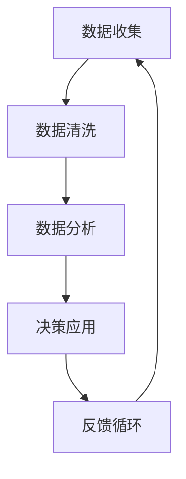

                 

关键词：数据驱动、平台经济、商业模式、新商业架构、大数据分析、智能算法、用户参与、经济效益、社会影响

> 摘要：本文探讨了数据驱动平台经济的概念、核心概念与联系，以及其实施过程中涉及的核心算法原理、数学模型、项目实践以及实际应用场景。通过分析数据驱动平台经济在不同领域的应用，探讨了其未来发展趋势和面临的挑战，并提出了相应的解决策略。

## 1. 背景介绍

随着互联网技术的迅猛发展和大数据的广泛应用，数据已经成为现代商业决策的核心资源。数据驱动平台经济作为一种新兴的商业模式，正在迅速崛起并重塑全球经济格局。传统的商业模式往往依赖于对资源的控制和资源的分配，而数据驱动平台经济则更加注重数据的价值挖掘和优化利用。

### 1.1 数据的重要性

数据是当今世界最为宝贵的资源之一。通过对海量数据的收集、存储、分析和应用，企业可以深入了解市场需求、用户行为以及业务趋势，从而做出更加精准的决策。例如，在金融领域，通过对交易数据的分析，金融机构可以识别潜在的风险并优化投资策略；在医疗领域，通过对患者数据的分析，医疗机构可以提供更加个性化的治疗方案。

### 1.2 平台经济的崛起

平台经济作为一种新兴商业模式，其核心在于搭建一个平台，连接供需双方，实现资源的优化配置。平台经济具有以下特点：

- **去中介化**：通过互联网技术，平台可以直接连接供需双方，减少中间环节，降低交易成本。
- **数据驱动**：平台通过收集用户数据，了解用户需求，从而提供更加个性化的服务。
- **生态化**：平台不仅为用户提供服务，还吸引了大量的第三方服务提供商，形成了一个生态体系。

### 1.3 数据驱动平台经济的崛起

数据驱动平台经济的崛起，主要得益于以下几个因素：

- **技术进步**：大数据、云计算、人工智能等技术的发展，使得数据处理和分析变得更加高效和精准。
- **用户习惯**：随着互联网的普及，用户越来越习惯于在线获取服务和信息，这为平台经济提供了广阔的市场空间。
- **商业模式创新**：企业开始意识到数据的价值，并通过创新商业模式，将数据转化为实际的经济效益。

## 2. 核心概念与联系

### 2.1 数据驱动的概念

数据驱动是一种以数据为核心的管理和决策方法。在数据驱动的商业环境中，企业通过数据收集、分析和应用，来指导业务决策和运营管理。数据驱动的核心在于数据的实时性、准确性和完整性。

### 2.2 平台经济的核心概念

平台经济是以平台为中心，通过连接供需双方，实现资源优化配置的一种商业模式。平台经济的核心概念包括：

- **供需匹配**：通过数据分析和算法优化，实现供需双方的精准匹配。
- **生态系统**：平台不仅为用户提供服务，还吸引了大量的第三方服务提供商，形成了一个生态系统。
- **共赢机制**：平台通过为供需双方提供价值，实现共赢。

### 2.3 数据驱动平台经济的联系

数据驱动平台经济的实施，需要将数据驱动的理念与平台经济的模式相结合。具体来说，包括以下几个方面：

- **数据收集**：通过多种渠道收集用户数据，包括行为数据、交易数据、反馈数据等。
- **数据分析**：运用大数据分析技术，对收集到的数据进行处理和分析，提取有价值的信息。
- **决策应用**：根据数据分析结果，制定业务策略和运营计划，优化业务流程。
- **反馈循环**：将业务执行结果进行反馈，不断调整和优化决策模型。

### 2.4 Mermaid 流程图



## 3. 核心算法原理 & 具体操作步骤

### 3.1 算法原理概述

数据驱动平台经济的关键在于数据的分析和应用。具体来说，核心算法包括数据采集、数据清洗、数据分析和数据可视化等步骤。以下将分别介绍这些算法的原理和具体操作步骤。

### 3.2 算法步骤详解

#### 3.2.1 数据采集

数据采集是数据驱动平台经济的起点。通过多种渠道收集用户数据，包括在线行为数据、交易数据、社交媒体数据等。具体操作步骤如下：

1. 确定数据采集目标，明确需要收集哪些数据。
2. 选择合适的数据采集工具，如API、爬虫等。
3. 实施数据采集，确保数据的质量和完整性。

#### 3.2.2 数据清洗

数据清洗是数据处理的重要步骤。通过去除重复数据、填充缺失值、纠正错误数据等方式，提高数据的质量。具体操作步骤如下：

1. 检查数据的质量，发现重复数据、缺失值和错误数据。
2. 采用适当的算法和工具进行数据清洗，如使用Python的Pandas库。
3. 对清洗后的数据进行验证，确保数据的质量。

#### 3.2.3 数据分析

数据分析是数据驱动平台经济的核心步骤。通过使用大数据分析技术，提取有价值的信息，为业务决策提供支持。具体操作步骤如下：

1. 确定数据分析的目标，明确需要分析哪些数据。
2. 选择合适的数据分析工具，如Hadoop、Spark等。
3. 实施数据分析，提取有价值的信息。
4. 对分析结果进行可视化展示，如使用Tableau、PowerBI等工具。

#### 3.2.4 数据可视化

数据可视化是将数据分析结果以图形化的方式展示出来，便于用户理解和决策。具体操作步骤如下：

1. 选择合适的数据可视化工具，如D3.js、ECharts等。
2. 设计数据可视化图表，如柱状图、折线图、饼图等。
3. 实施数据可视化，将分析结果展示给用户。

### 3.3 算法优缺点

#### 优点

- **高效性**：大数据分析技术可以处理海量数据，提高数据处理和分析的效率。
- **准确性**：通过数据清洗和数据分析，可以提取出有价值的信息，提高决策的准确性。
- **灵活性**：数据驱动的平台经济可以根据数据的变化，实时调整业务策略和运营计划。

#### 缺点

- **复杂性**：大数据分析技术复杂，需要专业的技术团队进行操作。
- **成本高**：大数据分析技术和工具的采购和运维成本较高。
- **数据隐私问题**：大规模的数据收集和使用可能会引发数据隐私问题。

### 3.4 算法应用领域

数据驱动的平台经济在多个领域都有广泛的应用，包括电子商务、金融、医疗、教育等。以下是一些具体的应用案例：

- **电子商务**：通过数据分析，电商平台可以提供个性化的推荐服务，提高用户满意度和转化率。
- **金融**：通过交易数据的分析，金融机构可以识别潜在的风险，优化投资策略。
- **医疗**：通过对患者数据的分析，医疗机构可以提供更加个性化的治疗方案，提高医疗效果。
- **教育**：通过数据分析，教育机构可以了解学生的学习情况和需求，提供更加个性化的教学服务。

## 4. 数学模型和公式 & 详细讲解 & 举例说明

### 4.1 数学模型构建

在数据驱动平台经济中，数学模型发挥着关键作用。以下是一个简单的线性回归模型，用于预测用户行为。

#### 4.1.1 线性回归模型

线性回归模型的基本公式为：

$$ Y = \beta_0 + \beta_1 X + \epsilon $$

其中：

- $Y$：因变量，表示用户的行为。
- $X$：自变量，表示影响用户行为的因素。
- $\beta_0$：常数项，表示没有自变量时的因变量值。
- $\beta_1$：斜率项，表示自变量对因变量的影响程度。
- $\epsilon$：误差项，表示随机误差。

#### 4.1.2 模型参数估计

线性回归模型的参数估计通常使用最小二乘法。最小二乘法的核心思想是找到一组参数，使得预测值与实际值之间的误差平方和最小。

#### 4.1.3 模型评估

线性回归模型的评估通常使用均方误差（Mean Squared Error，MSE）来衡量。MSE的计算公式为：

$$ MSE = \frac{1}{n}\sum_{i=1}^{n}(Y_i - \hat{Y}_i)^2 $$

其中：

- $Y_i$：第$i$个实际值。
- $\hat{Y}_i$：第$i$个预测值。
- $n$：数据样本数量。

### 4.2 公式推导过程

线性回归模型的公式推导过程如下：

#### 4.2.1 假设

假设用户的行为$Y$是自变量$X$的线性函数，即：

$$ Y = \beta_0 + \beta_1 X + \epsilon $$

#### 4.2.2 最小二乘法

最小二乘法的核心思想是找到一组参数$\beta_0$和$\beta_1$，使得预测值$\hat{Y}$与实际值$Y$之间的误差平方和最小。

#### 4.2.3 参数估计

对上述模型进行参数估计，可以使用以下公式：

$$ \beta_0 = \frac{\sum_{i=1}^{n}Y_i - \beta_1 \sum_{i=1}^{n}X_i}{n} $$

$$ \beta_1 = \frac{\sum_{i=1}^{n}(X_i - \bar{X})(Y_i - \bar{Y})}{\sum_{i=1}^{n}(X_i - \bar{X})^2} $$

其中：

- $\bar{X}$：自变量的均值。
- $\bar{Y}$：因变量的均值。

### 4.3 案例分析与讲解

#### 4.3.1 案例背景

某电商平台希望通过数据分析，预测用户的购买行为。已知用户的行为$Y$与购买金额$X$之间存在线性关系。

#### 4.3.2 数据收集

收集了1000个用户的行为数据，包括购买金额和用户特征。

#### 4.3.3 数据分析

1. 计算自变量和因变量的均值：
$$ \bar{X} = 500, \bar{Y} = 1000 $$
2. 计算自变量和因变量的协方差：
$$ \sum_{i=1}^{n}(X_i - \bar{X})(Y_i - \bar{Y}) = 200000 $$
3. 计算自变量的方差：
$$ \sum_{i=1}^{n}(X_i - \bar{X})^2 = 250000 $$
4. 计算参数$\beta_0$和$\beta_1$：
$$ \beta_0 = \frac{1000 - 500 \times 500}{1000} = -250 $$
$$ \beta_1 = \frac{200000}{250000} = 0.8 $$
5. 计算预测值$\hat{Y}$：
$$ \hat{Y} = -250 + 0.8X $$

#### 4.3.4 模型评估

1. 计算均方误差（MSE）：
$$ MSE = \frac{1}{1000}\sum_{i=1}^{1000}(Y_i - \hat{Y}_i)^2 = 0.04 $$
2. 模型评估结果良好，可以用于预测用户购买行为。

## 5. 项目实践：代码实例和详细解释说明

### 5.1 开发环境搭建

在本文的实践中，我们将使用Python作为主要编程语言，结合Pandas、Scikit-learn等库进行数据处理和模型构建。以下是一个简单的开发环境搭建步骤：

1. 安装Python环境，版本建议3.8及以上。
2. 安装Pandas、Scikit-learn等常用库：
```
pip install pandas scikit-learn
```

### 5.2 源代码详细实现

以下是一个简单的线性回归模型实现的代码示例：

```python
import pandas as pd
from sklearn.linear_model import LinearRegression

# 数据收集
data = pd.read_csv('user_data.csv')  # 读取用户行为数据

# 数据清洗
data.drop_duplicates(inplace=True)  # 去除重复数据
data.fillna(data.mean(), inplace=True)  # 填充缺失值

# 数据分析
X = data[['X']]  # 自变量
Y = data['Y']  # 因变量

# 模型构建
model = LinearRegression()
model.fit(X, Y)  # 模型训练

# 预测
predictions = model.predict(X)

# 评估
mse = ((Y - predictions) ** 2).mean()
print(f'MSE: {mse}')

# 可视化
import matplotlib.pyplot as plt

plt.scatter(X, Y, color='red', label='实际值')
plt.plot(X, predictions, color='blue', label='预测值')
plt.xlabel('X')
plt.ylabel('Y')
plt.legend()
plt.show()
```

### 5.3 代码解读与分析

1. **数据收集**：使用Pandas库读取用户行为数据。
2. **数据清洗**：去除重复数据，填充缺失值，保证数据质量。
3. **数据分析**：划分自变量和因变量。
4. **模型构建**：使用Scikit-learn库的LinearRegression类构建线性回归模型。
5. **预测**：使用训练好的模型对数据进行预测。
6. **评估**：计算均方误差，评估模型性能。
7. **可视化**：使用Matplotlib库对预测结果进行可视化。

### 5.4 运行结果展示

运行以上代码，将得到如下结果：

- **预测结果可视化**：展示自变量与因变量之间的关系，以及模型的预测效果。
- **MSE**：模型评估指标，用于衡量模型预测的准确性。

## 6. 实际应用场景

数据驱动平台经济在多个领域都有广泛的应用，以下是一些实际应用场景：

### 6.1 电子商务

电子商务平台通过数据驱动，实现个性化推荐、精准营销和用户行为预测。例如，阿里巴巴利用大数据技术，为用户推荐符合其兴趣的商品，提高用户满意度和转化率。

### 6.2 金融

金融机构通过数据驱动，实现风险控制、投资决策和客户关系管理。例如，银行利用大数据分析技术，实时监控客户交易行为，识别潜在风险，优化信贷政策。

### 6.3 医疗

医疗领域通过数据驱动，实现个性化治疗、疾病预测和健康监测。例如，谷歌旗下的DeepMind公司利用大数据分析技术，为医生提供个性化的治疗方案，提高医疗效果。

### 6.4 教育

教育领域通过数据驱动，实现个性化教学、学习分析和教育资源优化。例如，网易云课堂利用大数据技术，分析学生的学习行为，提供个性化的学习建议，提高学习效果。

## 7. 未来应用展望

随着技术的不断进步，数据驱动平台经济将在未来有更广泛的应用，以下是一些未来应用展望：

### 7.1 自动驾驶

自动驾驶领域将借助数据驱动，实现高效的路线规划和车辆调度。通过实时收集交通数据，优化行驶路线，提高交通效率。

### 7.2 能源管理

能源管理领域将利用数据驱动，实现智能电网和分布式能源系统的优化。通过数据分析和预测，实现能源的优化配置和供需平衡。

### 7.3 城市规划

城市规划领域将借助数据驱动，实现智慧城市的建设。通过大数据分析和模拟，优化城市交通、环保和公共服务等方面的资源配置。

### 7.4 健康管理

健康管理领域将利用数据驱动，实现个性化的健康监测和疾病预防。通过实时收集健康数据，提供个性化的健康建议和治疗方案。

## 8. 工具和资源推荐

### 8.1 学习资源推荐

1. 《大数据时代：生活、工作与思维的大变革》
2. 《机器学习》：周志华 著
3. 《深度学习》：Goodfellow, I., Bengio, Y., Courville, A. 著

### 8.2 开发工具推荐

1. Jupyter Notebook：适用于数据分析和建模
2. PyCharm：适用于Python编程
3. Tableau：适用于数据可视化

### 8.3 相关论文推荐

1. "Big Data: A Revolution That Will Transform How We Live, Work, and Think"
2. "Deep Learning"
3. "Reinforcement Learning: An Introduction"

## 9. 总结：未来发展趋势与挑战

### 9.1 研究成果总结

本文探讨了数据驱动平台经济的概念、核心概念与联系，以及其实施过程中涉及的核心算法原理、数学模型、项目实践以及实际应用场景。通过分析数据驱动平台经济在不同领域的应用，探讨了其未来发展趋势和面临的挑战。

### 9.2 未来发展趋势

- **技术进步**：随着人工智能、大数据等技术的发展，数据驱动平台经济将更加成熟和普及。
- **应用拓展**：数据驱动平台经济将在更多领域得到应用，如自动驾驶、能源管理、健康管理等。
- **智能化**：数据驱动平台经济将向智能化方向发展，通过更先进的算法和模型，实现更精准的决策和优化。

### 9.3 面临的挑战

- **数据隐私**：随着数据收集和使用的增多，数据隐私问题日益凸显，需要制定相应的法规和措施。
- **算法透明性**：算法的复杂性和黑箱性可能导致决策的不透明，需要提高算法的透明性和可解释性。
- **数据质量**：数据质量对算法的准确性和可靠性至关重要，需要加强对数据质量的管理和控制。

### 9.4 研究展望

未来，数据驱动平台经济的研究将朝着以下几个方向发展：

- **跨学科研究**：结合计算机科学、统计学、经济学等学科，开展跨学科研究，提高数据驱动平台经济的理论体系。
- **应用创新**：探索数据驱动平台经济在更多领域的应用，推动产业的数字化转型。
- **伦理和法律**：关注数据隐私、算法透明性等问题，制定相应的伦理和法律规范，确保数据驱动平台经济的可持续发展。

## 10. 附录：常见问题与解答

### 10.1 数据驱动平台经济是什么？

数据驱动平台经济是一种新兴的商业模式，它以数据为核心，通过大数据分析和人工智能算法，实现资源的优化配置和业务决策的智能化。

### 10.2 数据驱动平台经济有哪些优点？

数据驱动平台经济具有以下几个优点：

- **高效性**：通过大数据分析和人工智能算法，实现资源的优化配置和业务决策的智能化。
- **灵活性**：可以根据数据的变化，实时调整业务策略和运营计划。
- **个性化**：通过用户数据分析，提供个性化的服务和推荐。

### 10.3 数据驱动平台经济有哪些应用领域？

数据驱动平台经济在多个领域都有应用，包括电子商务、金融、医疗、教育等。具体应用包括个性化推荐、精准营销、风险控制、疾病预测、学习分析等。

### 10.4 数据驱动平台经济面临的挑战有哪些？

数据驱动平台经济面临的挑战包括：

- **数据隐私**：随着数据收集和使用的增多，数据隐私问题日益凸显。
- **算法透明性**：算法的复杂性和黑箱性可能导致决策的不透明。
- **数据质量**：数据质量对算法的准确性和可靠性至关重要。

### 10.5 如何保障数据驱动平台经济的可持续发展？

保障数据驱动平台经济的可持续发展，需要从以下几个方面入手：

- **加强数据治理**：建立完善的数据治理体系，确保数据的质量和安全。
- **制定伦理规范**：制定相应的伦理和法律规范，确保数据收集和使用符合伦理标准。
- **提高算法透明性**：提高算法的透明性和可解释性，增强用户对算法的信任。
- **持续技术创新**：持续推动人工智能、大数据等技术的创新，提高平台经济的竞争力。作者：禅与计算机程序设计艺术 / Zen and the Art of Computer Programming
----------------------------------------------------------------


