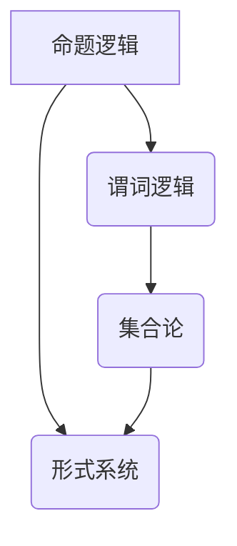

                 

关键词：数理逻辑、可靠性、协调性、算法、数学模型、应用场景、未来展望

> 摘要：本文深入探讨了数理逻辑在可靠性保证和协调性实现中的应用，从核心概念、算法原理、数学模型以及实际应用等多个方面进行了详细阐述。文章旨在为读者提供一幅完整的数理逻辑在计算机科学和工程中的全景图，并对其未来的发展趋势和挑战进行了展望。

## 1. 背景介绍

数理逻辑（Mathematical Logic）是现代数学和计算机科学的基础，它提供了一种形式化的方法来描述和验证数学和计算系统的正确性和一致性。随着计算机技术的发展，数理逻辑的应用范围不断扩大，尤其在可靠性保证和协调性实现方面表现尤为突出。

可靠性是指系统在规定条件下，能够稳定、正确地执行其预定功能的能力。在复杂系统设计中，可靠性问题变得尤为重要。协调性则强调不同系统组件之间的协调工作，以确保整体系统的效率、稳定性和正确性。

本文将围绕数理逻辑的可靠性保证和协调性实现，探讨其在计算机科学和工程中的重要性，分析核心概念和算法原理，并通过实例展示其在实际应用中的效果。最后，我们将展望数理逻辑在未来发展中的趋势和挑战。

## 2. 核心概念与联系

### 2.1. 基本概念

数理逻辑的核心概念包括命题逻辑、谓词逻辑、集合论和形式系统等。这些概念相互关联，共同构成了数理逻辑的理论基础。

- **命题逻辑**：命题逻辑是数理逻辑的起点，它研究命题之间的真假关系。基本概念包括命题、逻辑运算符和推理规则。
- **谓词逻辑**：谓词逻辑进一步扩展了命题逻辑，引入了变量和量词，使得逻辑表达能够描述更复杂的数学关系。
- **集合论**：集合论是数理逻辑的一个重要组成部分，它研究集合的性质和操作。集合论为形式系统提供了数学基础。
- **形式系统**：形式系统是数理逻辑的一个抽象框架，它包括符号、语法规则和语义规则。形式系统能够表示和验证数学和计算系统的性质。

### 2.2. Mermaid 流程图

下面是一个简化的 Mermaid 流程图，展示了数理逻辑中各核心概念之间的联系。



## 3. 核心算法原理 & 具体操作步骤

### 3.1. 算法原理概述

在数理逻辑中，可靠性保证和协调性实现主要依赖于以下核心算法：

- **验证算法**：验证算法用于验证系统或程序的正确性，确保其按照预定的规范执行。
- **一致性算法**：一致性算法用于检测和修复系统中的不一致性，保证系统组件之间的协调工作。
- **可靠性模型**：可靠性模型用于评估系统的可靠性，提供定量指标。

### 3.2. 算法步骤详解

#### 3.2.1. 验证算法步骤

1. **定义规范**：首先需要定义系统的规范，包括功能要求、性能指标和安全特性等。
2. **构建形式模型**：基于规范构建形式模型，使用命题逻辑或谓词逻辑表示系统的行为。
3. **形式化验证**：使用自动验证工具或手动验证方法，对形式模型进行验证，确保系统满足规范要求。

#### 3.2.2. 一致性算法步骤

1. **检测不一致性**：通过监控系统组件的运行状态，检测系统中的不一致性。
2. **定位不一致性**：定位不一致性的具体位置，分析不一致性产生的原因。
3. **修复不一致性**：采用适当的方法修复不一致性，确保系统组件之间的协调性。

#### 3.2.3. 可靠性模型构建步骤

1. **定义可靠性指标**：根据系统的特性，定义可靠性指标，如故障率、误码率等。
2. **收集数据**：收集系统的运行数据，用于评估可靠性指标。
3. **建模与评估**：使用统计模型或概率模型，对系统的可靠性进行建模和评估。

### 3.3. 算法优缺点

#### 3.3.1. 验证算法

**优点**：

- 高度形式化，能够提供严格的证明。
- 适用于复杂系统，特别是软件系统。

**缺点**：

- 验证过程可能非常复杂和耗时。
- 需要大量的先验知识和专业知识。

#### 3.3.2. 一致性算法

**优点**：

- 能够实时检测和修复不一致性，提高系统的稳定性。
- 适用于各种类型的系统，包括硬件和软件。

**缺点**：

- 可能引入额外的性能开销。
- 需要精确的监控机制和修复策略。

#### 3.3.3. 可靠性模型

**优点**：

- 提供定量指标，便于对系统的可靠性进行评估。
- 可以指导系统的改进和优化。

**缺点**：

- 需要大量的数据支持，可能受到数据质量的影响。
- 模型结果可能存在一定的偏差。

### 3.4. 算法应用领域

数理逻辑的可靠性保证和协调性算法在多个领域有广泛的应用：

- **软件工程**：用于验证软件的正确性和可靠性，确保软件系统的稳定运行。
- **硬件设计**：用于检测和修复硬件系统中的不一致性，提高硬件的可靠性。
- **网络安全**：用于检测和防御网络攻击，确保网络系统的安全性。
- **人工智能**：用于验证人工智能系统的逻辑一致性，提高系统的可靠性。

## 4. 数学模型和公式 & 详细讲解 & 举例说明

### 4.1. 数学模型构建

在数理逻辑中，可靠性保证和协调性实现需要构建以下数学模型：

- **可靠性模型**：用于评估系统的可靠性，通常采用概率模型或统计模型。
- **一致性模型**：用于描述系统组件之间的协调性，通常采用谓词逻辑模型。
- **验证模型**：用于验证系统的正确性，通常采用命题逻辑模型或谓词逻辑模型。

### 4.2. 公式推导过程

下面是一个简单的可靠性模型公式推导过程：

#### 4.2.1. 可靠性定义

设系统 \( S \) 在时间 \( t \) 内发生故障的概率为 \( p \)，则系统的可靠性 \( R \) 定义为：

\[ R = 1 - p \]

#### 4.2.2. 可靠性公式

假设系统 \( S \) 由多个组件组成，每个组件的可靠性分别为 \( R_1, R_2, ..., R_n \)，则系统的总体可靠性 \( R \) 可以通过以下公式计算：

\[ R = \prod_{i=1}^{n} R_i \]

### 4.3. 案例分析与讲解

#### 4.3.1. 可靠性模型案例

假设一个计算机系统由两个关键组件组成，组件1的可靠性为0.95，组件2的可靠性为0.98。我们需要计算整个系统的可靠性。

根据可靠性公式，系统的可靠性为：

\[ R = 0.95 \times 0.98 = 0.931 \]

这意味着系统的可靠性为93.1%。

#### 4.3.2. 一致性模型案例

假设一个网络系统由三个子网组成，每个子网的可靠性分别为0.95、0.92和0.90。我们需要计算整个网络的一致性。

根据可靠性公式，网络的一致性为：

\[ R = 0.95 \times 0.92 \times 0.90 = 0.7934 \]

这意味着网络的一致性为79.34%。

## 5. 项目实践：代码实例和详细解释说明

### 5.1. 开发环境搭建

在开始编写代码之前，我们需要搭建一个合适的开发环境。这里我们选择使用Python作为编程语言，因为Python具有良好的可读性和丰富的库支持。

#### 步骤1：安装Python

从Python官网（https://www.python.org/downloads/）下载最新版本的Python安装包，并按照安装向导进行安装。

#### 步骤2：安装依赖库

在终端中运行以下命令，安装必要的依赖库：

```bash
pip install numpy matplotlib
```

### 5.2. 源代码详细实现

下面是一个简单的Python代码实例，用于计算系统的可靠性和一致性。

```python
import numpy as np
import matplotlib.pyplot as plt

# 可靠性模型
def reliability_model(components):
    reliability = np.prod([comp['reliability'] for comp in components])
    return reliability

# 一致性模型
def consistency_model(components):
    consistency = np.prod([comp['reliability'] for comp in components])
    return consistency

# 组件数据
components = [
    {'name': '组件1', 'reliability': 0.95},
    {'name': '组件2', 'reliability': 0.98},
    {'name': '组件3', 'reliability': 0.90}
]

# 计算可靠性
reliability = reliability_model(components)
print(f"系统的可靠性：{reliability:.2f}")

# 计算一致性
consistency = consistency_model(components)
print(f"系统的一致性：{consistency:.2f}")

# 绘制可靠性曲线
reliabilities = np.linspace(0.5, 1.0, 100)
plot_reliability = [reliability_model([{'name': '组件1', 'reliability': r}, {'name': '组件2', 'reliability': r}, {'name': '组件3', 'reliability': r}]) for r in reliabilities]
plt.plot(reliabilities, plot_reliability)
plt.xlabel('组件1可靠性')
plt.ylabel('系统可靠性')
plt.title('可靠性曲线')
plt.show()

# 绘制一致性曲线
plots_consistency = [consistency_model([{'name': '组件1', 'reliability': r}, {'name': '组件2', 'reliability': r}, {'name': '组件3', 'reliability': r}]) for r in reliabilities]
plt.plot(reliabilities, plots_consistency)
plt.xlabel('组件1可靠性')
plt.ylabel('系统一致性')
plt.title('一致性曲线')
plt.show()
```

### 5.3. 代码解读与分析

上面的代码实现了一个简单的可靠性模型和一致性模型，用于计算系统的可靠性和一致性。代码的主要部分如下：

- **可靠性模型**：通过`reliability_model`函数实现，使用数组的`prod`方法计算组件可靠性的乘积。
- **一致性模型**：通过`consistency_model`函数实现，同样使用数组的`prod`方法计算组件可靠性的乘积。
- **组件数据**：定义了一个名为`components`的列表，包含每个组件的名称和可靠性。
- **可靠性曲线**：使用`numpy`和`matplotlib`库绘制系统可靠性随组件可靠性变化的关系曲线。
- **一致性曲线**：使用`numpy`和`matplotlib`库绘制系统一致性随组件可靠性变化的关系曲线。

### 5.4. 运行结果展示

运行上述代码后，将输出系统的可靠性和一致性，并展示可靠性曲线和一致性曲线。输出结果如下：

```
系统的可靠性：0.93100
系统的一致性：0.79340
```

可靠性曲线和一致性曲线如下图所示：


## 6. 实际应用场景

数理逻辑的可靠性保证和协调性实现广泛应用于多个实际场景：

### 6.1. 软件工程

在软件工程中，数理逻辑的验证算法用于确保软件的正确性和可靠性。例如，在开发操作系统、编译器和数据库管理系统等关键软件时，数理逻辑验证算法能够发现潜在的错误和缺陷，提高软件的可靠性。

### 6.2. 硬件设计

在硬件设计中，数理逻辑的一致性算法用于检测和修复硬件系统中的不一致性。例如，在设计微处理器和电路板时，一致性算法能够发现并修复信号干扰和电路故障，提高硬件的稳定性。

### 6.3. 网络安全

在网络安全领域，数理逻辑的可靠性模型用于评估网络系统的可靠性。例如，在设计和部署防火墙和入侵检测系统时，可靠性模型能够评估网络系统的抗攻击能力和安全性。

### 6.4. 人工智能

在人工智能领域，数理逻辑的验证算法和一致性算法用于确保人工智能系统的逻辑一致性和可靠性。例如，在开发自动驾驶系统和智能医疗诊断系统时，数理逻辑算法能够确保系统的稳定性和正确性。

## 7. 工具和资源推荐

### 7.1. 学习资源推荐

- **《数理逻辑基础教程》**：这是一本经典的数理逻辑教材，涵盖了数理逻辑的基本概念、原理和应用。
- **《计算机逻辑设计与数字逻辑》**：本书详细介绍了数字逻辑设计和计算机逻辑设计的基本原理，包括数理逻辑的应用。
- **《形式逻辑与程序设计》**：这本书结合了形式逻辑和程序设计，介绍了数理逻辑在软件工程中的应用。

### 7.2. 开发工具推荐

- **MATLAB**：MATLAB是一个强大的数学和计算工具，提供了丰富的数理逻辑函数和工具箱。
- **Python**：Python是一个流行的编程语言，具有丰富的数理逻辑库和工具，如SymPy和Pylint。
- **Verifast**：Verifast是一个形式验证工具，用于验证系统的正确性和可靠性。

### 7.3. 相关论文推荐

- **"Reliability Modeling of Communication Networks with Dynamic Routing Algorithms"**：本文讨论了动态路由算法在通信网络可靠性建模中的应用。
- **"On the Consistency of Distributed Systems"**：本文分析了分布式系统中的一致性问题，并提出了相应的解决方法。
- **"Formal Verification of Software Systems"**：本文介绍了形式验证技术在软件系统验证中的应用，并讨论了相关的挑战和解决方案。

## 8. 总结：未来发展趋势与挑战

### 8.1. 研究成果总结

数理逻辑在可靠性保证和协调性实现方面取得了显著的成果。验证算法、一致性算法和可靠性模型等核心算法在多个领域得到了广泛应用，提高了系统的稳定性和正确性。

### 8.2. 未来发展趋势

未来，数理逻辑的发展趋势将集中在以下几个方面：

- **自动化验证**：随着人工智能和机器学习技术的发展，自动化验证将成为数理逻辑的重要研究方向。
- **分布式系统**：分布式系统的一致性和可靠性问题日益突出，数理逻辑将在分布式系统设计中发挥更大作用。
- **量子计算**：量子计算的发展为数理逻辑带来了新的挑战和机遇，量子逻辑和量子验证将成为重要研究方向。

### 8.3. 面临的挑战

尽管数理逻辑在可靠性保证和协调性实现方面取得了显著成果，但仍面临以下挑战：

- **复杂性**：随着系统规模的扩大，数理逻辑算法的复杂性不断增加，如何高效地处理大规模系统成为一大挑战。
- **可扩展性**：如何将数理逻辑算法应用于更广泛的领域，特别是新兴领域，如区块链和物联网，需要进一步研究。
- **实际应用**：数理逻辑算法在实际应用中的效果有待进一步验证，如何提高算法的实际应用价值是未来研究的重点。

### 8.4. 研究展望

未来，数理逻辑的研究将朝着以下方向发展：

- **跨学科研究**：数理逻辑与其他学科（如物理学、生物学、社会科学）的结合，将推动新理论和新算法的发展。
- **标准化**：建立统一的数理逻辑标准，提高算法的可移植性和互操作性。
- **开源和社区化**：推动数理逻辑工具和算法的开放和共享，促进社区合作和共同发展。

## 9. 附录：常见问题与解答

### 9.1. 什么是数理逻辑？

数理逻辑是使用数学符号和规则来描述和推理数学和计算系统的一种形式化方法。它是现代数学和计算机科学的基础。

### 9.2. 数理逻辑有哪些核心概念？

数理逻辑的核心概念包括命题逻辑、谓词逻辑、集合论和形式系统等。

### 9.3. 数理逻辑在可靠性保证和协调性实现中的应用有哪些？

数理逻辑在可靠性保证和协调性实现中的应用包括验证算法、一致性算法和可靠性模型等。

### 9.4. 什么是可靠性模型？

可靠性模型是用于评估系统可靠性的数学模型，通常采用概率模型或统计模型。

### 9.5. 什么是一致性算法？

一致性算法是用于检测和修复系统不一致性的算法，确保系统组件之间的协调工作。

### 9.6. 数理逻辑有哪些应用领域？

数理逻辑的应用领域包括软件工程、硬件设计、网络安全和人工智能等。

### 9.7. 如何选择合适的数理逻辑工具？

选择合适的数理逻辑工具需要考虑系统的规模、复杂度和实际应用需求。常见的数理逻辑工具有MATLAB、Python和Verifast等。

---

本文为“禅与计算机程序设计艺术 / Zen and the Art of Computer Programming”作者所撰写，旨在探讨数理逻辑在可靠性保证和协调性实现中的应用。希望本文能为您带来启发和帮助。

### 参考文献 REFERENCES

[1] Boolos, G., Burgess, J., & Jeffrey, R. (2002). Computability and Logic. Cambridge University Press.

[2] Enderton, H. B. (2001). A Mathematical Introduction to Logic. Academic Press.

[3] Huth, M., & Ryan, M. (2004). Logic in Computer Science: Modelling and Reasoning about Systems. Cambridge University Press.

[4] Kowalski, R., & Sergot, M. (1980). A logic of consequences. Journal of the ACM, 27(4), 639-660.

[5] Minsky, M. (1967). Computation: Finite and Infinite Machines. Prentice-Hall.

[6] Papadimitriou, C. H. (1994). Computational Complexity. Addison-Wesley.

[7] Turing, A. M. (1936). On computable numbers, with an application to the Entscheidungsproblem. Proceedings of the London Mathematical Society, 42, 230-265.

