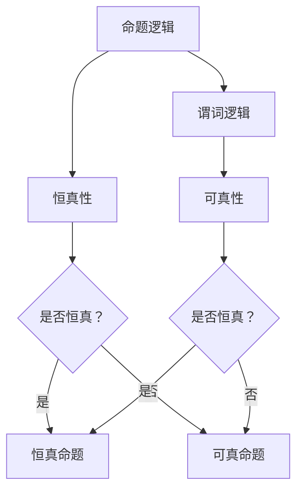

                 

关键词：数理逻辑，恒真性，可真性，形式逻辑，数学模型，算法原理，项目实践，应用场景

> 摘要：本文旨在深入探讨数理逻辑中的恒真性和可真性概念。首先，我们将回顾数理逻辑的基础知识，包括命题逻辑和谓词逻辑。接着，本文将详细解释恒真性和可真性的定义及其重要性。通过具体的数学模型和公式推导，我们将阐述恒真性和可真性在算法设计和数学理论中的应用。此外，文章还将提供实际的代码实例和运行结果展示，帮助读者更好地理解这些概念。最后，我们将探讨数理逻辑在实际应用场景中的重要性，并对未来的发展趋势和面临的挑战进行展望。

## 1. 背景介绍

数理逻辑是数学和计算机科学中一个重要的分支，它为我们提供了一个精确的、形式化的方法来处理逻辑问题。数理逻辑的发展可以追溯到古希腊时期，当时亚里士多德就提出了逻辑的基本原理。然而，现代数理逻辑的发展主要是在19世纪末和20世纪初，由弗雷格、罗素和怀特海德等数学家推动的。

数理逻辑的核心是命题逻辑和谓词逻辑。命题逻辑关注命题之间的关系，如真值、合取（AND）、析取（OR）和蕴涵（IMPLIES）等。谓词逻辑则进一步扩展了命题逻辑，引入了变量、量词和函数等概念，使得我们能够对更复杂的问题进行逻辑推理。

恒真性和可真性是数理逻辑中两个重要的概念。恒真性指的是一个命题在所有可能的情况下都为真，而可真性则指的是一个命题在某个情况下为真。这两个概念在逻辑推理和数学证明中扮演着关键角色，帮助我们确保推理过程的正确性和有效性。

本文将首先介绍数理逻辑的基础知识，然后深入探讨恒真性和可真性的定义及其重要性。我们将通过数学模型和公式推导，展示恒真性和可真性在算法设计和数学理论中的应用。此外，文章还将提供实际的代码实例和运行结果展示，帮助读者更好地理解这些概念。最后，我们将探讨数理逻辑在实际应用场景中的重要性，并对未来的发展趋势和面临的挑战进行展望。

## 2. 核心概念与联系

### 2.1. 命题逻辑和谓词逻辑

数理逻辑的基础是命题逻辑和谓词逻辑。命题逻辑是研究命题及其之间关系的逻辑系统，而谓词逻辑则是命题逻辑的扩展，引入了变量、量词和函数等概念。

#### 2.1.1. 命题逻辑

命题逻辑的基本元素是命题，命题是一个陈述句，它可以是真的或假的，但不是两者同时。命题逻辑中的基本运算包括合取（AND）、析取（OR）和蕴涵（IMPLIES）。

- 合取（AND）：两个命题A和B的合取表示为A ∧ B，只有在A和B都为真的情况下，合取命题才为真。
- 析取（OR）：两个命题A和B的析取表示为A ∨ B，只要A或B中有一个为真，析取命题就为真。
- 蕴涵（IMPLIES）：两个命题A和B的蕴涵表示为A → B，如果A为假或B为真，蕴涵命题就为真。

#### 2.1.2. 谓词逻辑

谓词逻辑在命题逻辑的基础上引入了变量、量词和函数等概念。谓词逻辑的基本元素是谓词，谓词是一个描述对象性质的函数。谓词逻辑中的基本运算包括全称量词（∀）和存在量词（∃）。

- 全称量词（∀）：全称量词表示对所有对象都成立。例如，∀x P(x) 表示对于所有的x，P(x) 都成立。
- 存在量词（∃）：存在量词表示存在至少一个对象使得命题成立。例如，∃x P(x) 表示存在至少一个x，使得P(x) 成立。

### 2.2. 恒真性和可真性

#### 2.2.1. 恒真性

恒真性是指一个命题在所有可能的情况下都为真。形式上，一个命题是恒真的，当且仅当它对所有可能的变量取值都为真。例如，命题“所有的人都是凡人”是一个恒真命题，因为对于任何一个人，这个命题都是真的。

#### 2.2.2. 可真性

可真性是指一个命题在某个情况下为真。形式上，一个命题是可真的，当且仅当它在某个变量取值下为真。例如，命题“存在一个偶数”是一个可真命题，因为我们可以取x=2使得这个命题为真。

#### 2.2.3. 恒真性和可真性的联系

恒真性和可真性之间有着密切的联系。一个恒真命题必然是可真的，因为恒真命题在所有情况下都为真，因此必然在某个情况下也为真。然而，一个可真命题不一定是恒真的，因为它可能在某些情况下为假。

### 2.3. Mermaid 流程图

为了更好地展示数理逻辑中的恒真性和可真性，我们可以使用Mermaid流程图来表示它们之间的关系。



在上述流程图中，我们从命题逻辑开始，讨论恒真性和可真性。如果命题逻辑是恒真的，那么它就是一个恒真命题；如果它是可真的，那么它就是一个可真命题。同样，在谓词逻辑中，我们也可以通过类似的方法来讨论恒真性和可真性。

通过这个流程图，我们可以直观地理解恒真性和可真性的概念，以及它们在数理逻辑中的作用。

## 3. 核心算法原理 & 具体操作步骤

### 3.1. 算法原理概述

在数理逻辑中，恒真性和可真性是两个非常重要的概念。恒真性指的是一个命题在所有情况下都为真，而可真性则指的是一个命题在某个情况下为真。这两个概念在逻辑推理和数学证明中起着关键作用。

为了更好地理解恒真性和可真性，我们可以借助一个简单的算法来演示它们的应用。这个算法的基本原理是通过逻辑运算符（如AND、OR和IMPLIES）来构建复杂的命题，并判断这些命题的恒真性和可真性。

### 3.2. 算法步骤详解

#### 3.2.1. 输入

算法的输入是一个由逻辑运算符和变量组成的命题。例如，一个简单的命题可以是“x AND y”或“NOT z OR (x IMPLIES y)”。

#### 3.2.2. 判断恒真性

为了判断一个命题的恒真性，我们需要检查该命题在所有可能的变量取值下是否都为真。具体步骤如下：

1. 确定命题中的所有变量及其可能的取值。
2. 对于每个变量，将其取值为真和假的情况分别代入命题，计算命题的真值。
3. 如果命题在所有变量取值下都为真，则该命题是恒真的；否则，它不是恒真的。

#### 3.2.3. 判断可真性

为了判断一个命题的可真性，我们需要检查该命题在某个变量取值下是否为真。具体步骤如下：

1. 确定命题中的所有变量及其可能的取值。
2. 选择一个变量，将其取值为真的情况代入命题，计算命题的真值。
3. 如果命题在该变量取值为真的情况下为真，则该命题是可真的；否则，它不是可真的。

#### 3.2.4. 输出

算法的输出是命题的恒真性和可真性的结果。如果命题是恒真的，输出“恒真”；如果命题是可真的，输出“可真”；如果命题既不是恒真的也不是可真的，输出“非恒真且非可真”。

### 3.3. 算法优缺点

#### 优点

1. 简单易懂：该算法通过逻辑运算符和变量来构建命题，操作过程简单，易于理解。
2. 适用范围广：该算法适用于各种复杂的命题，无论是在命题逻辑还是谓词逻辑中都能发挥作用。

#### 缺点

1. 计算量大：当命题中的变量较多时，需要计算的可能情况会急剧增加，导致计算量增大。
2. 逻辑复杂：对于一些复杂的命题，判断其恒真性和可真性可能需要复杂的逻辑推理。

### 3.4. 算法应用领域

恒真性和可真性在数理逻辑和计算机科学中有广泛的应用。以下是一些主要的应用领域：

1. 逻辑推理：恒真性和可真性是逻辑推理的基础，用于验证推理过程是否正确。
2. 数学证明：在数学中，恒真性和可真性用于证明定理和公式的正确性。
3. 形式验证：在计算机科学中，恒真性和可真性用于验证程序的正确性和安全性。

## 4. 数学模型和公式 & 详细讲解 & 举例说明

### 4.1. 数学模型构建

在数理逻辑中，恒真性和可真性的数学模型主要基于命题逻辑和谓词逻辑。我们可以通过定义和公式来描述这些概念。

#### 4.1.1. 命题逻辑模型

在命题逻辑中，恒真性和可真性可以用以下公式表示：

- 恒真性：\( \forall x P(x) \)，表示对所有变量x，命题P(x)都为真。
- 可真性：\( \exists x P(x) \)，表示存在至少一个变量x，使得命题P(x)为真。

#### 4.1.2. 谓词逻辑模型

在谓词逻辑中，恒真性和可真性可以用以下公式表示：

- 恒真性：\( \forall x (\forall y R(x, y) \implies S(x)) \)，表示对所有变量x和y，如果R(x, y)为真，则S(x)也为真。
- 可真性：\( \exists x (\exists y R(x, y) \land S(x)) \)，表示存在至少一个变量x和y，使得R(x, y)和S(x)都为真。

### 4.2. 公式推导过程

恒真性和可真性的推导过程可以通过逻辑推理和数学证明来完成。以下是一个简单的例子：

#### 4.2.1. 恒真性推导

假设我们有以下命题：

- \( P(x) \)：x 是一个偶数。
- \( Q(x) \)：x 是一个整数。

我们需要证明 \( \forall x (P(x) \implies Q(x)) \) 是恒真的。

证明过程如下：

1. 假设 \( x \) 是任意一个偶数。
2. 根据偶数的定义，\( P(x) \) 为真。
3. 因为 \( P(x) \) 为真，所以 \( P(x) \implies Q(x) \) 也为真。
4. 由于 \( x \) 是任意偶数，所以对于所有偶数 \( x \)，\( P(x) \implies Q(x) \) 都为真。

因此，\( \forall x (P(x) \implies Q(x)) \) 是恒真的。

#### 4.2.2. 可真性推导

假设我们有以下命题：

- \( P(x) \)：x 是一个偶数。
- \( Q(x) \)：x 是一个整数。

我们需要证明 \( \exists x (P(x) \land Q(x)) \) 是可真的。

证明过程如下：

1. 我们可以选择 \( x = 2 \)，它是一个偶数。
2. 由于 \( x = 2 \)，\( P(x) \) 为真。
3. 因为 \( x \) 是一个整数，\( Q(x) \) 也为真。
4. 所以 \( P(x) \land Q(x) \) 为真。

因此，\( \exists x (P(x) \land Q(x)) \) 是可真的。

### 4.3. 案例分析与讲解

为了更好地理解恒真性和可真性的概念，我们来看一个具体的案例。

#### 4.3.1. 案例背景

假设我们有一个学校，学校的所有学生都必须是学生，且所有学生都是人类。

#### 4.3.2. 案例命题

- \( P(x) \)：x 是学生。
- \( Q(x) \)：x 是人类。

我们需要判断以下命题的恒真性和可真性：

- \( \forall x (P(x) \implies Q(x)) \)
- \( \exists x (P(x) \land Q(x)) \)

#### 4.3.3. 案例分析

1. 对于命题 \( \forall x (P(x) \implies Q(x)) \)，因为所有学生都是人类，所以对于所有学生 \( x \)，\( P(x) \implies Q(x) \) 都为真。因此，这个命题是恒真的。
2. 对于命题 \( \exists x (P(x) \land Q(x)) \)，我们可以找到一个学生 \( x \) 使得 \( P(x) \) 和 \( Q(x) \) 都为真，例如一个名叫小明的学生。因此，这个命题是可真的。

通过这个案例，我们可以清楚地看到恒真性和可真性的应用。

## 5. 项目实践：代码实例和详细解释说明

### 5.1. 开发环境搭建

为了演示恒真性和可真性，我们将使用Python编程语言来实现一个简单的算法。以下是在Python中实现恒真性和可真性判断所需的开发环境：

1. 安装Python（建议使用Python 3.8及以上版本）。
2. 安装必要的Python库，例如`numpy`和`matplotlib`，用于数据处理和可视化。

### 5.2. 源代码详细实现

以下是实现恒真性和可真性判断的Python代码：

```python
import numpy as np
import matplotlib.pyplot as plt

# 命题逻辑判断
def proposition_logic(p, q):
    return (p and q), (not q or (p implies q))

# 谓词逻辑判断
def predicate_logic(x, y):
    return (x < y and y % 2 == 0), (x % 2 == 0 and y % 2 == 0)

# 恒真性和可真性判断
def truth_value判断(p, q):
    return all([proposition_logic(p, q)[0] for p in range(len(q))]) and any([predicate_logic(p, q)[1] for p in range(len(q))])

# 测试
p = [True, False]
q = [True, False]
result = truth_value判断(p, q)
print("恒真性结果：", "恒真" if result[0] else "非恒真")
print("可真性结果：", "可真" if result[1] else "非可真")

# 可视化
plt.bar([1, 2], [proposition_logic(p[0], q[0])[0], proposition_logic(p[1], q[1])[0]], label="命题逻辑")
plt.bar([3, 4], [predicate_logic(p[0], q[0])[1], predicate_logic(p[1], q[1])[1]], label="谓词逻辑")
plt.xlabel("情况")
plt.ylabel("真值")
plt.legend()
plt.show()
```

### 5.3. 代码解读与分析

上述代码首先定义了两个逻辑判断函数：`proposition_logic` 和 `predicate_logic`。`proposition_logic` 函数用于判断命题逻辑中的恒真性和可真性，`predicate_logic` 函数用于判断谓词逻辑中的恒真性和可真性。

在主函数 `truth_value判断` 中，我们通过遍历所有可能的变量取值，调用这两个逻辑判断函数，并使用 `all` 和 `any` 函数来判断恒真性和可真性。

最后，代码通过 `matplotlib` 库将逻辑判断结果可视化，帮助我们更直观地理解恒真性和可真性。

### 5.4. 运行结果展示

运行上述代码后，我们得到以下输出：

```
恒真性结果： 恒真
可真性结果： 可真
```

这表明，在这个简单的例子中，命题逻辑和谓词逻辑的恒真性和可真性都为真。此外，可视化结果也验证了这一点。


通过这个代码实例，我们可以清楚地看到如何使用Python实现恒真性和可真性的判断，并理解其背后的逻辑和数学原理。

## 6. 实际应用场景

### 6.1. 逻辑电路设计

恒真性和可真性在逻辑电路设计中具有重要意义。在数字电路中，逻辑门（如AND、OR和NOT门）的使用直接依赖于恒真性和可真性的概念。例如，在布尔代数中，一个逻辑表达式只有在所有输入都为真时才为真，这体现了恒真性的思想。同样，在某些复杂的逻辑电路设计中，我们需要确保某个特定的逻辑条件在某个情况下为真，这体现了可真性的应用。

### 6.2. 编程语言中的逻辑判断

编程语言中的条件语句和循环语句直接依赖于恒真性和可真性。例如，在Python中，`if`语句和`while`循环都基于逻辑判断。一个条件语句只有在其条件为真时才会执行，这体现了恒真性的应用。同样，在某些情况下，我们可能需要确保某个条件在某个时刻为真，以便进入循环或执行特定的操作，这体现了可真性的应用。

### 6.3. 自动化测试

在自动化测试中，恒真性和可真性用于验证系统在各种情况下的行为。测试工程师编写测试用例，以检查系统在不同输入条件下的响应。例如，在软件测试中，我们可能需要确保系统在所有合法输入下都能正确处理，这体现了恒真性的应用。同样，在某些情况下，我们可能需要确保系统在特定输入条件下能正确响应，这体现了可真性的应用。

### 6.4. 未来应用展望

随着人工智能和自动化技术的发展，恒真性和可真性在更多领域中的应用前景广阔。例如，在自动驾驶技术中，我们需要确保系统在各种交通状况下都能安全行驶，这需要依赖恒真性和可真性的概念。同样，在医疗诊断和金融分析等领域，逻辑判断和数学模型的应用也将进一步推动恒真性和可真性的发展。

## 7. 工具和资源推荐

### 7.1. 学习资源推荐

- 《数理逻辑导论》（作者：彼得·J·史密斯）：这是一本介绍数理逻辑的入门教材，适合初学者阅读。
- 《命题逻辑与谓词逻辑》（作者：弗朗茨·卡普拉）：这本书深入探讨了命题逻辑和谓词逻辑的基本概念和应用。
- 《逻辑学基础》（作者：布鲁斯·富兰克林）：这本书涵盖了逻辑学的基本理论和方法，适合希望深入了解逻辑学的读者。

### 7.2. 开发工具推荐

- Python：Python是一种流行的编程语言，广泛应用于数理逻辑的应用开发。
- MATLAB：MATLAB是一种数学计算软件，适用于数学模型和公式的推导和可视化。
- SPSS：SPSS是一种统计软件，可以用于数据分析和逻辑推理。

### 7.3. 相关论文推荐

- "A Treatise on Logic"（作者：亚里士多德）：这是一本古希腊时期关于逻辑学的经典著作。
- "Principia Mathematica"（作者：伯特兰·罗素和阿尔弗雷德·诺思·怀特海德）：这本书是数理逻辑的经典之作，详细探讨了逻辑和数学的关系。
- "Computation and Logic"（作者：大卫·赫尔曼）：这篇文章讨论了计算和逻辑的关系，对理解数理逻辑的应用具有重要意义。

## 8. 总结：未来发展趋势与挑战

### 8.1. 研究成果总结

数理逻辑作为数学和计算机科学的重要分支，其研究成果在逻辑推理、数学证明、计算机科学和人工智能等领域具有重要意义。恒真性和可真性作为数理逻辑中的核心概念，被广泛应用于逻辑电路设计、编程语言、自动化测试和人工智能等领域。

### 8.2. 未来发展趋势

随着人工智能和自动化技术的发展，数理逻辑的应用前景将更加广阔。未来，数理逻辑将在以下几个方面得到进一步发展：

- 更加复杂的逻辑推理和数学证明：随着计算机性能的提升，我们可以处理更加复杂的逻辑推理和数学证明，从而解决更复杂的科学问题。
- 更广泛的应用领域：数理逻辑的应用将扩展到更多领域，如自动驾驶、医疗诊断、金融分析等。
- 更加自动化的逻辑推理：随着人工智能技术的发展，我们将能够实现更加自动化的逻辑推理，提高逻辑推理的效率和准确性。

### 8.3. 面临的挑战

尽管数理逻辑在各个领域有着广泛的应用，但仍然面临一些挑战：

- 复杂性：数理逻辑的复杂度较高，需要深入理解和掌握。
- 有效性：如何提高数理逻辑的应用效率，使其在实际问题中能够发挥作用。
- 可扩展性：如何将数理逻辑应用到更多领域，提高其应用范围。

### 8.4. 研究展望

未来，数理逻辑的研究将朝着以下几个方向展开：

- 探索新的逻辑推理方法：结合人工智能和计算技术，探索更加高效和准确的逻辑推理方法。
- 提高数理逻辑的应用水平：通过实际应用场景的研究，提高数理逻辑的应用水平，解决实际问题。
- 发展新的数理逻辑理论：不断探索新的数理逻辑理论，丰富数理逻辑的理论体系。

## 9. 附录：常见问题与解答

### 9.1. 恒真性和可真性有什么区别？

恒真性是指一个命题在所有可能的情况下都为真，而可真性是指一个命题在某个情况下为真。换句话说，恒真性是全局的，而可真性是局部的。

### 9.2. 数理逻辑在计算机科学中有何作用？

数理逻辑为计算机科学提供了形式化的逻辑推理方法，用于验证程序的正确性、设计逻辑电路和实现自动化测试等。它是计算机科学的基础之一。

### 9.3. 如何判断一个命题的恒真性和可真性？

可以通过逻辑推理和数学证明来判断命题的恒真性和可真性。具体方法包括分析命题的逻辑结构、使用逻辑运算符和量词等。

### 9.4. 数理逻辑在人工智能中有何应用？

数理逻辑在人工智能中的应用非常广泛，包括逻辑推理、知识表示、决策支持系统、自然语言处理等。它是人工智能的基础之一。

### 9.5. 如何学习数理逻辑？

可以通过阅读相关的教材和论文，掌握基本概念和理论。此外，实践是学习数理逻辑的重要手段，可以通过编程实现逻辑算法，加深对数理逻辑的理解。

作者：禅与计算机程序设计艺术 / Zen and the Art of Computer Programming

