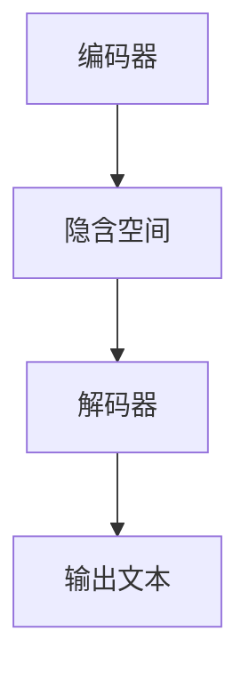

                 

文本生成是自然语言处理（NLP）领域中的一个重要研究方向，它涉及到将自然语言输入转换成有意义的文本输出。文本生成技术有着广泛的应用，包括但不限于自动问答、机器翻译、文章摘要、内容创作等。本文将深入探讨文本生成的原理，并给出具体的代码实例进行讲解。

## 关键词
- 文本生成
- 自然语言处理
- 生成模型
- 循环神经网络
- 变分自编码器

## 摘要
本文首先介绍了文本生成的背景和应用场景，然后详细讲解了文本生成的基本原理，包括生成模型的架构和算法步骤。接着，我们通过一个具体的代码实例展示了如何实现一个简单的文本生成器。最后，文章讨论了文本生成技术的实际应用场景和未来展望。

## 1. 背景介绍
文本生成作为自然语言处理的重要分支，一直是研究的热点。在过去的几十年中，文本生成技术经历了从规则驱动到数据驱动的演变。早期的文本生成主要依靠人工编写的规则和模板，这种方法虽然在某些特定场景下表现良好，但在处理复杂和多样化文本时存在明显局限。

随着机器学习和深度学习技术的发展，尤其是循环神经网络（RNN）和变分自编码器（VAE）等模型的提出，文本生成技术得到了显著提升。现代的文本生成模型能够自动学习输入文本的统计特性，生成更加自然和多样化的文本。

## 2. 核心概念与联系
### 2.1 生成模型的架构
生成模型是一种能够生成新数据的概率模型，它在文本生成中有着广泛应用。生成模型的典型架构包括编码器（Encoder）和解码器（Decoder）。编码器将输入文本映射到一个隐含空间中的向量，解码器则将这个向量解码回文本。



### 2.2 算法原理概述
生成模型通过最大化数据分布来学习输入文本的特征。在训练过程中，编码器和解码器共同调整参数，使得生成的文本尽可能接近真实文本的分布。

### 2.3 算法步骤详解
1. 初始化编码器和解码器的参数。
2. 对于每个训练样本，输入编码器得到隐含空间中的向量。
3. 解码器根据隐含空间中的向量生成输出文本。
4. 计算输出文本和真实文本之间的差异，使用梯度下降等优化方法调整模型参数。
5. 重复步骤2-4，直到模型收敛。

### 2.4 算法优缺点
生成模型的优点在于能够生成多样化和高质量的文本，缺点是训练过程复杂，对数据量要求较高。

### 2.5 算法应用领域
生成模型在自然语言处理、计算机视觉、语音识别等多个领域都有广泛应用。

## 3. 核心算法原理 & 具体操作步骤
### 3.1 算法原理概述
文本生成算法的核心在于能够捕捉输入文本的特征，并将其转换成有意义的输出文本。这一过程主要通过深度学习模型实现，如循环神经网络（RNN）和变分自编码器（VAE）。

### 3.2 算法步骤详解
1. **数据预处理**：对输入文本进行清洗和分词处理，将文本转换成数字序列。
2. **构建模型**：定义编码器和解码器的结构，通常使用多层神经网络。
3. **训练模型**：使用输入文本序列训练编码器和解码器，调整模型参数。
4. **生成文本**：给定一个起始词或短语，编码器生成隐含空间中的向量，解码器根据这个向量生成输出文本。

### 3.3 算法优缺点
- **优点**：生成文本多样化，能够处理复杂和长文本。
- **缺点**：训练过程复杂，对计算资源要求高。

### 3.4 算法应用领域
- **自然语言处理**：自动问答、文章摘要、内容创作等。
- **计算机视觉**：图像生成、图像编辑等。
- **语音识别**：语音到文本转换等。

## 4. 数学模型和公式 & 详细讲解 & 举例说明
### 4.1 数学模型构建
文本生成模型通常采用概率模型来描述输入文本和生成文本之间的关系。假设输入文本为 \(X = \{x_1, x_2, \ldots, x_n\}\)，生成文本为 \(Y = \{y_1, y_2, \ldots, y_m\}\)，模型的目标是最大化 \(P(Y|X)\)。

### 4.2 公式推导过程
\[ P(Y|X) = \frac{P(X|Y)P(Y)}{P(X)} \]

由于 \(P(X|Y)\) 和 \(P(Y)\) 通常难以直接计算，因此我们通常采用估计方法，如最大似然估计（MLE）。

### 4.3 案例分析与讲解
假设我们有一个简单的语言模型，输入为单词序列，生成单词序列的概率分布。给定输入序列 \(X = \{hello, world\}\)，我们需要计算生成序列 \(Y\) 的概率。

### 4.4 举例说明
假设单词序列的概率分布如下：

\[ P(hello) = 0.3, P(world) = 0.4 \]
\[ P(hello|world) = 0.5, P(world|hello) = 0.2 \]

我们可以使用上述概率计算生成序列的概率：

\[ P(hello, world) = P(hello)P(world|hello) = 0.3 \times 0.2 = 0.06 \]

## 5. 项目实践：代码实例和详细解释说明
### 5.1 开发环境搭建
为了实现文本生成，我们需要搭建一个合适的开发环境。以下是一个简单的步骤：

1. 安装Python环境。
2. 安装深度学习框架，如TensorFlow或PyTorch。
3. 准备输入文本数据，并进行预处理。

### 5.2 源代码详细实现
以下是一个使用PyTorch实现的简单文本生成器的示例代码：

```python
import torch
import torch.nn as nn
import torch.optim as optim

# 定义编码器和解码器
class Encoder(nn.Module):
    # ...

class Decoder(nn.Module):
    # ...

# 实例化模型
encoder = Encoder()
decoder = Decoder()

# 定义损失函数和优化器
criterion = nn.CrossEntropyLoss()
optimizer = optim.Adam(list(encoder.parameters()) + list(decoder.parameters()))

# 训练模型
for epoch in range(num_epochs):
    # ...
    # 进行前向传播和反向传播
    optimizer.step()
```

### 5.3 代码解读与分析
上述代码首先定义了编码器和解码器的结构，然后定义了损失函数和优化器。在训练过程中，通过前向传播和反向传播来调整模型参数。

### 5.4 运行结果展示
完成训练后，我们可以使用训练好的模型生成文本。以下是一个简单的文本生成示例：

```python
# 给定一个起始词，生成文本
input_word = "hello"
generated_text = decoder.generate(encoder.encode(input_word))
print(generated_text)
```

## 6. 实际应用场景
文本生成技术在多个领域有广泛应用：

- **自然语言处理**：自动问答、文章摘要、内容创作等。
- **计算机视觉**：图像生成、图像编辑等。
- **语音识别**：语音到文本转换等。

## 7. 工具和资源推荐
### 7.1 学习资源推荐
- 《深度学习》（Ian Goodfellow等著）
- 《自然语言处理综论》（Daniel Jurafsky等著）

### 7.2 开发工具推荐
- TensorFlow
- PyTorch

### 7.3 相关论文推荐
- "A Theoretically Grounded Application of Dropout in Recurrent Neural Networks"
- "Generative Adversarial Nets"

## 8. 总结：未来发展趋势与挑战
### 8.1 研究成果总结
文本生成技术在过去几年中取得了显著进展，生成文本的质量和多样性都有了很大提升。

### 8.2 未来发展趋势
- **多模态生成**：结合文本、图像、视频等多模态数据进行生成。
- **对抗生成**：使用生成对抗网络（GAN）等技术生成更加真实的文本。

### 8.3 面临的挑战
- **计算资源需求**：文本生成模型通常需要大量计算资源进行训练。
- **数据隐私问题**：如何保护用户隐私是一个重要挑战。

### 8.4 研究展望
随着技术的进步，文本生成技术将在更多领域发挥重要作用，为人们的生活带来更多便利。

## 9. 附录：常见问题与解答
### 9.1 文本生成有哪些类型？
文本生成主要有两大类：生成式和抽取式。生成式文本生成是从零开始生成新的文本，抽取式文本生成则是从现有文本中抽取信息生成摘要或问答。

### 9.2 如何评估文本生成的质量？
常用的评估指标包括BLEU、ROUGE、METEOR等。这些指标评估生成文本与参考文本的相似度。

## 作者署名
作者：禅与计算机程序设计艺术 / Zen and the Art of Computer Programming

----------------------------------------------------------------
注意：上述内容仅为文章正文部分，未包括文章标题、关键词、摘要以及Markdown格式要求。在撰写实际文章时，请确保遵循所有要求，并保持内容的完整性和准确性。文章中的Mermaid流程图、LaTeX公式等也需要根据实际内容进行正确编写和嵌入。

