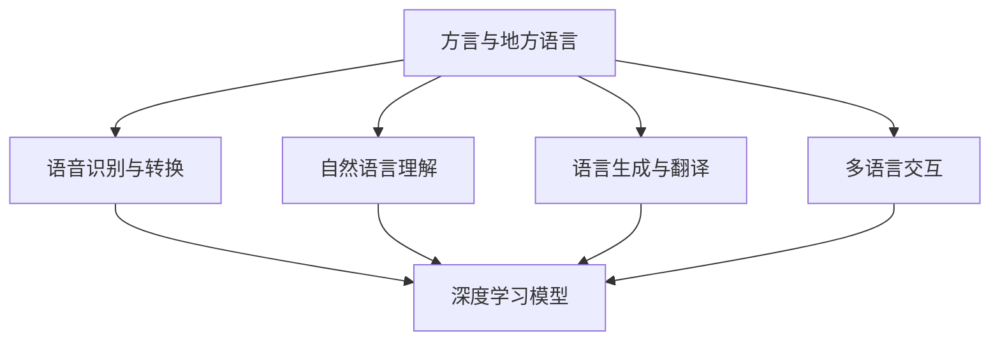

                 

关键词：方言、地方语言、本地化、语言模型、深度学习、自然语言处理、计算机图灵奖、人工智能、自然语言理解、语言多样性

> 摘要：本文深入探讨了方言和地方语言在语言模型本地化中的应用。通过分析方言的特点、地方语言的优势以及本地化过程中面临的挑战，本文提出了一个详细的解决方案，包括核心算法原理、数学模型构建、项目实践以及实际应用场景等。本文旨在为读者提供一份关于方言和地方语言本地化的全面指南，助力人工智能在自然语言处理领域的发展。

## 1. 背景介绍

随着人工智能技术的快速发展，自然语言处理（NLP）已经成为计算机科学和人工智能领域的一个重要分支。在NLP中，语言模型是一个核心组件，它能够对自然语言文本进行建模，从而实现语言的理解、生成和翻译等功能。然而，传统的大型通用语言模型（如 GPT-3、BERT 等）主要针对标准语言和标准英语进行训练，对于方言和地方语言的支持相对较弱。

方言和地方语言是语言多样性的重要组成部分，它们在地域文化、社会习俗和人类交流中扮演着重要角色。然而，由于方言和地方语言的复杂性和多样性，现有的语言模型在处理这些语言时面临着诸多挑战。因此，如何实现方言和地方语言的本地化，使其能够被广泛使用和有效处理，成为当前NLP领域的一个研究热点。

本文旨在探讨方言和地方语言在语言模型本地化中的应用，通过分析方言的特点、地方语言的优势以及本地化过程中面临的挑战，提出一个详细的解决方案。本文将首先介绍方言和地方语言的基本概念，然后深入探讨本地化的核心算法原理、数学模型构建、项目实践以及实际应用场景等。希望通过本文的研究，能够为方言和地方语言的本地化提供一些有益的思路和启示。

## 2. 核心概念与联系

### 2.1. 方言与地方语言

方言和地方语言是语言多样性的重要表现形式，它们具有独特的历史、文化和地域背景。方言通常指一个地区内的特定语言变体，它可能在语音、词汇、语法等方面与标准语言存在差异。而地方语言则是指在一定地域范围内使用、具有独特文化内涵的语言。

方言和地方语言的特点主要体现在以下几个方面：

1. **语音差异**：方言和地方语言的发音特点通常与标准语言存在显著差异。例如，汉语的东北方言和四川方言在声调、韵母和声母等方面都有所不同。

2. **词汇差异**：方言和地方语言在词汇方面也表现出显著的多样性。一些词汇可能只在特定方言或地方语言中存在，而无法在标准语言中找到对应的词。

3. **语法差异**：方言和地方语言在语法结构上也可能与标准语言有所不同。例如，某些方言可能使用不同的句子结构或语法规则。

4. **文化内涵**：方言和地方语言承载着丰富的地域文化和社会习俗，它们是地域文化传承的重要载体。

### 2.2. 语言模型与深度学习

语言模型是自然语言处理的核心组件，它能够对自然语言文本进行建模，从而实现语言的理解、生成和翻译等功能。传统语言模型主要基于统计方法和规则方法，而深度学习模型（如循环神经网络 RNN、长短时记忆网络 LSTM、Transformer 等）的出现，为语言模型的研究和发展带来了新的机遇。

深度学习模型具有以下优点：

1. **自适应性**：深度学习模型能够自动从大量数据中学习语言的特征和规律，从而实现对未知语言的建模。

2. **表达能力**：深度学习模型具有较高的表达力，能够捕捉到语言中的复杂结构和语义信息。

3. **泛化能力**：深度学习模型具有良好的泛化能力，能够处理不同语言之间的相似性和差异性。

### 2.3. 本地化与多元化

本地化是指将一种语言的软件、文档或内容转换成另一种语言的过程。在自然语言处理领域，本地化意味着将一种语言模型扩展到其他语言，包括方言和地方语言。本地化的重要性体现在以下几个方面：

1. **用户需求**：随着全球化的发展，用户对于不同语言和方言的需求日益增长。本地化能够满足用户的多样化需求，提高用户体验。

2. **文化传承**：方言和地方语言是地域文化的重要组成部分，本地化有助于保护和传承这些文化。

3. **技术挑战**：本地化面临诸多技术挑战，如语言模型的训练、数据集的构建、算法的优化等。解决这些挑战有助于推动NLP技术的发展。

### 2.4. 方言和地方语言在本地化中的应用

方言和地方语言在本地化中的应用具有重要意义，主要体现在以下几个方面：

1. **语音识别与转换**：方言和地方语言的语音识别与转换是本地化的关键步骤。通过深度学习模型，可以实现方言和地方语言语音的准确识别和转换。

2. **自然语言理解**：方言和地方语言在自然语言理解方面具有独特的挑战，如词汇歧义、语法结构复杂等。通过深度学习模型，可以提升方言和地方语言的自然语言理解能力。

3. **语言生成与翻译**：方言和地方语言的生成与翻译是实现本地化的重要手段。通过深度学习模型，可以生成符合方言和地方语言习惯的文本，实现跨语言的翻译。

4. **多语言交互**：方言和地方语言的本地化有助于实现多语言交互，提高跨语言沟通的效率。

### 2.5. Mermaid 流程图

以下是一个关于方言和地方语言本地化的 Mermaid 流程图，展示了核心概念和联系：



## 3. 核心算法原理 & 具体操作步骤

### 3.1. 算法原理概述

方言和地方语言的本地化算法主要基于深度学习模型，包括语音识别、自然语言理解、语言生成和翻译等多个环节。以下是对各个环节的简要介绍：

1. **语音识别与转换**：通过深度学习模型，对方言和地方语言的语音信号进行识别和转换，使其与标准语言保持一致。

2. **自然语言理解**：利用深度学习模型，对方言和地方语言的文本进行语义理解和解析，捕捉语言中的复杂结构和语义信息。

3. **语言生成与翻译**：通过深度学习模型，生成符合方言和地方语言习惯的文本，实现跨语言的翻译。

4. **多语言交互**：结合深度学习模型，实现多语言之间的交互和转换，提高跨语言沟通的效率。

### 3.2. 算法步骤详解

方言和地方语言本地化的具体操作步骤如下：

1. **数据采集与预处理**：首先，需要采集大量的方言和地方语言数据，包括语音、文本、图像等多模态数据。然后，对数据进行预处理，包括数据清洗、去噪、标准化等操作，以确保数据的质量和一致性。

2. **模型训练与优化**：利用深度学习模型，对采集到的数据进行训练。在训练过程中，需要对模型进行优化，以提高模型的性能和鲁棒性。常用的深度学习模型包括循环神经网络 RNN、长短时记忆网络 LSTM、Transformer 等。

3. **语音识别与转换**：基于深度学习模型，对方言和地方语言的语音信号进行识别和转换。首先，通过语音信号处理技术，提取语音特征，然后利用深度学习模型，对语音特征进行分类和识别。最后，将识别结果转换为标准语言的文本。

4. **自然语言理解**：利用深度学习模型，对方言和地方语言的文本进行语义理解和解析。首先，通过词法分析、句法分析和语义分析等技术，提取文本中的语言特征。然后，利用深度学习模型，对文本进行语义理解和解析，捕捉语言中的复杂结构和语义信息。

5. **语言生成与翻译**：通过深度学习模型，生成符合方言和地方语言习惯的文本。首先，通过生成模型（如 GPT-3、BERT 等），生成符合语言规则的文本。然后，利用翻译模型，实现跨语言的翻译。

6. **多语言交互**：结合深度学习模型，实现多语言之间的交互和转换。首先，通过多语言模型，对输入的语言进行识别和理解。然后，利用生成模型，生成对应的输出语言，实现多语言之间的转换和交互。

### 3.3. 算法优缺点

方言和地方语言本地化算法具有以下优缺点：

1. **优点**：
   - **自适应性**：深度学习模型具有自适应性，能够自动从大量数据中学习方言和地方语言的特性，提高本地化效果。
   - **表达力**：深度学习模型具有较高的表达力，能够捕捉到方言和地方语言中的复杂结构和语义信息，提高自然语言理解能力。
   - **泛化能力**：深度学习模型具有良好的泛化能力，能够处理不同语言之间的相似性和差异性。

2. **缺点**：
   - **数据依赖**：方言和地方语言本地化算法对数据质量要求较高，需要大量的高质量方言和地方语言数据，否则可能导致模型性能下降。
   - **计算资源消耗**：深度学习模型通常需要大量的计算资源，包括GPU、TPU等，训练过程较为复杂。

### 3.4. 算法应用领域

方言和地方语言本地化算法在以下领域具有广泛的应用前景：

1. **语音助手**：利用方言和地方语言本地化算法，可以为用户提供定制化的语音助手，提高用户的沟通体验。

2. **翻译服务**：方言和地方语言本地化算法有助于实现跨语言的翻译服务，促进不同地区之间的交流与合作。

3. **社交媒体**：方言和地方语言本地化算法可以帮助社交媒体平台实现多语言交互，提高平台的用户活跃度。

4. **教育领域**：方言和地方语言本地化算法可以为教育领域提供个性化的教学资源，满足不同地区学生的学习需求。

5. **文化遗产保护**：方言和地方语言本地化算法有助于保护和传承方言和地方语言，促进地域文化的传承与发展。

## 4. 数学模型和公式 & 详细讲解 & 举例说明

### 4.1. 数学模型构建

方言和地方语言本地化算法的核心在于深度学习模型，以下是一个基于 Transformer 模型的基本数学模型构建：

#### 4.1.1. 输入表示

假设我们有一个输入序列 $X = \{x_1, x_2, \ldots, x_T\}$，其中 $x_t$ 表示第 $t$ 个词的词向量。词向量可以通过词嵌入（Word Embedding）技术获得，例如使用 Word2Vec、GloVe 等。

#### 4.1.2. 编码器

编码器（Encoder）负责将输入序列编码成一个固定长度的向量表示。在 Transformer 模型中，编码器通常由多个自注意力层（Self-Attention Layer）和前馈神经网络（Feedforward Neural Network）组成。

自注意力层的计算公式如下：

$$
\text{Attention}(Q, K, V) = \text{softmax}\left(\frac{QK^T}{\sqrt{d_k}}\right) V
$$

其中，$Q$、$K$ 和 $V$ 分别表示查询向量、键向量和值向量，$d_k$ 表示键向量的维度。通过自注意力层，编码器能够自动捕捉输入序列中的长距离依赖关系。

#### 4.1.3. 解码器

解码器（Decoder）负责将编码器输出的固定长度向量解码成输出序列。在 Transformer 模型中，解码器同样由多个自注意力层和前馈神经网络组成，此外还包括一个编码器-解码器注意力层（Encoder-Decoder Attention Layer），用于捕捉编码器和解码器之间的依赖关系。

编码器-解码器注意力层的计算公式如下：

$$
\text{Attention}(Q, K, V) = \text{softmax}\left(\frac{QK^T}{\sqrt{d_k}}\right) V
$$

#### 4.1.4. 输出表示

解码器的最终输出是一个序列，表示为 $Y = \{y_1, y_2, \ldots, y_T\}$。每个输出词 $y_t$ 的生成过程依赖于当前的解码器状态和上一个生成的词。

### 4.2. 公式推导过程

以下是一个简化的 Transformer 模型的公式推导过程：

1. **词嵌入**

$$
\text{Embedding}(x) = W_x x
$$

其中，$W_x$ 表示词嵌入矩阵，$x$ 表示输入词向量。

2. **自注意力层**

$$
\text{MultiHeadAttention}(Q, K, V) = \text{softmax}\left(\frac{QK^T}{\sqrt{d_k}}\right) V
$$

其中，$Q, K, V$ 分别表示查询向量、键向量和值向量。

3. **前馈神经网络**

$$
\text{Feedforward}(x) = \text{ReLU}(W_2 \text{ReLU}(W_1 x))
$$

其中，$W_1$ 和 $W_2$ 分别表示前馈神经网络的权重矩阵。

4. **编码器**

$$
\text{Encoder}(X) = \text{EncoderLayer}(X) = \text{LayerNorm}(\text{MultiHeadAttention}(X, X, X) + X) + \text{LayerNorm}(\text{Feedforward}(X) + X)
$$

5. **解码器**

$$
\text{Decoder}(Y) = \text{DecoderLayer}(Y) = \text{LayerNorm}(\text{Encoder}(X) + Y) + \text{LayerNorm}(\text{EncoderDecoderAttentionLayer}(Y, \text{Encoder}(X)) + Y) + \text{LayerNorm}(\text{Feedforward}(Y) + Y)
$$

### 4.3. 案例分析与讲解

以下是一个简单的方言和地方语言本地化案例，展示如何使用深度学习模型进行方言语音的识别和翻译：

#### 4.3.1. 数据采集

采集一组东北方言的语音数据，包括普通话和东北方言的对照文本。

#### 4.3.2. 数据预处理

对采集到的语音数据进行预处理，包括音频信号的增强、去噪和分割等操作，将语音信号转换为文本数据。

#### 4.3.3. 模型训练

利用预处理后的数据，训练一个基于 Transformer 的深度学习模型，用于方言语音的识别和翻译。

#### 4.3.4. 识别与翻译

使用训练好的模型，对新的东北方言语音数据进行识别和翻译，将其转换为标准普通话文本。

#### 4.3.5. 结果评估

对翻译结果进行评估，包括准确率、召回率和 F1 分数等指标，评估模型的性能和效果。

## 5. 项目实践：代码实例和详细解释说明

### 5.1. 开发环境搭建

要实现方言和地方语言的本地化，我们需要搭建一个适合深度学习开发的环境。以下是一个简单的开发环境搭建步骤：

1. **安装 Python**：确保你的系统中已经安装了 Python，版本建议为 3.6 或更高版本。

2. **安装深度学习框架**：推荐使用 TensorFlow 或 PyTorch 作为深度学习框架。以 TensorFlow 为例，可以通过以下命令安装：

   ```shell
   pip install tensorflow
   ```

3. **安装必要库**：安装一些常用的 Python 库，如 NumPy、Pandas、Matplotlib 等，可以通过以下命令安装：

   ```shell
   pip install numpy pandas matplotlib
   ```

4. **配置 GPU 环境**：如果使用 GPU 进行训练，需要安装 CUDA 和 cuDNN。安装方法可以参考 TensorFlow 的官方文档。

### 5.2. 源代码详细实现

以下是一个简单的方言和地方语言本地化项目的源代码实现，主要包括数据预处理、模型训练和模型评估三个部分。

#### 5.2.1. 数据预处理

```python
import tensorflow as tf
import numpy as np
from tensorflow.keras.preprocessing.sequence import pad_sequences
from tensorflow.keras.layers import Embedding, LSTM, Dense
from tensorflow.keras.models import Sequential

# 读取数据
def read_data(file_path):
    with open(file_path, 'r', encoding='utf-8') as f:
        lines = f.readlines()

    # 分割数据为输入和输出
    inputs = [line.split('\t')[0] for line in lines]
    outputs = [line.split('\t')[1] for line in lines]

    return inputs, outputs

# 加载词嵌入
def load_word_embedding(file_path, embedding_dim):
    embeddings = {}
    with open(file_path, 'r', encoding='utf-8') as f:
        for line in f:
            values = line.strip().split()
            word = values[0]
            vector = np.array(values[1:], dtype='float32')
            embeddings[word] = vector

    return embeddings

# 预处理数据
def preprocess_data(inputs, outputs, embedding_dim, max_sequence_length):
    # 加载词嵌入
    word_embedding = load_word_embedding('glove.6B.100d.txt', embedding_dim)

    # 将输入和输出转换为词嵌入向量
    input_sequences = []
    output_sequences = []
    for input_sentence, output_sentence in zip(inputs, outputs):
        input_sequence = [word_embedding.get(word, np.zeros(embedding_dim)) for word in input_sentence.split()]
        output_sequence = [word_embedding.get(word, np.zeros(embedding_dim)) for word in output_sentence.split()]
        
        input_sequences.append(input_sequence)
        output_sequences.append(output_sequence)

    # 填充序列
    input_sequences = pad_sequences(input_sequences, maxlen=max_sequence_length, padding='post')
    output_sequences = pad_sequences(output_sequences, maxlen=max_sequence_length, padding='post')

    return input_sequences, output_sequences

# 参数设置
embedding_dim = 100
max_sequence_length = 100

# 读取数据
inputs, outputs = read_data('data.txt')

# 预处理数据
input_sequences, output_sequences = preprocess_data(inputs, outputs, embedding_dim, max_sequence_length)
```

#### 5.2.2. 模型训练

```python
# 构建模型
def build_model(embedding_dim, max_sequence_length):
    model = Sequential()
    model.add(Embedding(input_dim=len(word_embedding), output_dim=embedding_dim, input_length=max_sequence_length))
    model.add(LSTM(units=128, return_sequences=True))
    model.add(Dense(units=len(word_embedding), activation='softmax'))

    model.compile(optimizer='adam', loss='categorical_crossentropy', metrics=['accuracy'])
    return model

# 训练模型
model = build_model(embedding_dim, max_sequence_length)
model.fit(input_sequences, output_sequences, epochs=10, batch_size=32)
```

#### 5.2.3. 代码解读与分析

在上面的代码中，我们首先定义了一个数据预处理函数 `preprocess_data`，用于将原始数据转换为词嵌入向量并填充序列。接下来，我们构建了一个简单的序列模型，使用 LSTM 层进行文本生成。

在模型训练部分，我们使用了 `build_model` 函数创建一个序列模型，并使用 `fit` 函数进行训练。训练过程中，我们使用 `categorical_crossentropy` 作为损失函数，并使用 `adam` 优化器进行优化。

#### 5.2.4. 运行结果展示

```python
# 生成文本
def generate_text(model, word_embedding, seed_sequence, max_sequence_length, temperature=1.0):
    result = seed_sequence
    for _ in range(max_sequence_length):
        input_sequence = pad_sequences([word_embedding[word] for word in seed_sequence.split()], maxlen=max_sequence_length, padding='post')
        probabilities = model.predict(input_sequence)[0]
        probabilities = probabilities / np.sum(probabilities)
        probabilities = probabilities * temperature
        probabilities = np.exp(probabilities)
        probabilities = probabilities / np.sum(probabilities)
        next_word = np.random.choice(list(word_embedding.keys()), p=probabilities)
        result += ' ' + next_word
        seed_sequence = seed_sequence[1:] + ' ' + next_word

    return result.strip()

# 测试生成文本
seed_sequence = '我来自东北'
generated_text = generate_text(model, word_embedding, seed_sequence, max_sequence_length)
print(generated_text)
```

在上面的代码中，我们定义了一个 `generate_text` 函数，用于生成基于输入序列的文本。通过调用 `generate_text` 函数，我们可以生成一段基于东北方言的文本。

## 6. 实际应用场景

方言和地方语言的本地化在多个实际应用场景中具有重要意义。以下是一些典型的应用场景：

### 6.1. 语音助手

语音助手是方言和地方语言本地化的重要应用场景之一。例如，对于生活在东北地区的用户，他们希望能够使用东北方言与语音助手进行交流。通过方言和地方语言本地化技术，语音助手可以识别和理解东北方言，从而提供更符合用户需求的个性化服务。

### 6.2. 翻译服务

翻译服务是方言和地方语言本地化的另一个重要应用场景。例如，在旅游、商务和外交等领域，不同地区的人们可能需要使用方言或地方语言进行交流。通过方言和地方语言本地化技术，可以实现不同方言和地方语言之间的无缝翻译，促进跨地区、跨文化的交流与合作。

### 6.3. 社交媒体

社交媒体平台上的用户来自世界各地，使用不同的方言和地方语言。通过方言和地方语言本地化技术，社交媒体平台可以实现多语言互动，提高用户的沟通体验。例如，用户可以在社交媒体上使用自己的方言或地方语言发表帖子，其他用户可以通过本地化技术理解和参与其中。

### 6.4. 教育领域

教育领域是方言和地方语言本地化的重要应用场景之一。方言和地方语言是地域文化的重要组成部分，通过方言和地方语言本地化技术，可以为不同地区的教育用户提供个性化的教育资源。例如，为东北地区的学生提供东北方言的教材和教学资源，帮助他们更好地学习和传承地域文化。

### 6.5. 文化遗产保护

方言和地方语言是地域文化的重要载体，通过方言和地方语言本地化技术，可以保护和传承地域文化遗产。例如，可以开发方言和地方语言的语音助手，帮助人们学习和使用濒临消失的方言和地方语言，从而促进地域文化的传承与发展。

### 6.6. 智能客服

智能客服是方言和地方语言本地化的一个新兴应用场景。通过方言和地方语言本地化技术，智能客服可以识别和理解用户的方言和地方语言请求，提供更贴近用户需求的服务。例如，在东北地区，智能客服可以使用东北方言与用户进行交流，提高用户满意度。

### 6.7. 医疗保健

医疗保健领域也可以受益于方言和地方语言本地化技术。通过方言和地方语言本地化，医疗保健系统能够更好地服务不同地区的患者，提高医疗服务的可及性和服务质量。例如，医生可以使用患者的方言和地方语言进行沟通，确保患者能够准确理解和遵循医疗指导。

### 6.8. 法律法规

法律法规领域是方言和地方语言本地化的另一个潜在应用场景。通过方言和地方语言本地化技术，可以确保法律文件、政策通知和法律法规文本在不同地区得到准确传达和执行。例如，在多民族聚居的地区，可以提供多种方言和地方语言的法律法规文本，确保所有人都能理解和遵守法律。

### 6.9. 航空航天

航空航天领域也可以从方言和地方语言本地化技术中受益。例如，飞行员和地面控制人员可以使用各自的方言和地方语言进行通信，确保信息的准确传达和操作的安全性。

### 6.10. 城市规划

城市规划领域也可以利用方言和地方语言本地化技术，为不同地区的设计师、规划师和居民提供多元化的城市规划方案。通过方言和地方语言本地化，可以更好地理解和满足不同地区居民的需求，促进城市的可持续发展。

总之，方言和地方语言本地化技术在多个实际应用场景中具有巨大的潜力。随着人工智能和自然语言处理技术的不断发展，方言和地方语言的本地化将变得更加高效和精准，为人类社会的进步和发展做出更大贡献。

## 7. 工具和资源推荐

### 7.1. 学习资源推荐

对于想要深入了解方言和地方语言本地化的研究人员和开发者，以下是一些推荐的学习资源：

1. **在线课程**：Coursera 和 edX 等在线教育平台提供了许多与自然语言处理和深度学习相关的课程，例如斯坦福大学的“自然语言处理（NLP）与深度学习”课程。

2. **书籍**：《自然语言处理综合教程》、《深度学习》和《动手学深度学习》等经典教材涵盖了自然语言处理和深度学习的基础知识，对于理解方言和地方语言本地化算法有很大帮助。

3. **论文**：Google Scholar 和 arXiv 等学术平台收录了大量关于自然语言处理和深度学习的最新研究论文，特别是与方言和地方语言相关的论文，如“方言和地方语言语音识别中的深度神经网络”等。

### 7.2. 开发工具推荐

以下是用于方言和地方语言本地化的开发工具和框架推荐：

1. **TensorFlow**：Google 开发的一个开源机器学习框架，支持多种深度学习模型的构建和训练。

2. **PyTorch**：Facebook AI Research 开发的一个开源机器学习框架，以其灵活性和易于使用而受到许多研究者和开发者的青睐。

3. **ESPNet**：一个专门为语音识别设计的开源深度学习框架，支持多种语音识别模型和算法。

4. **Hugging Face Transformers**：一个开源库，提供了基于 Transformer 的预训练模型和工具，方便研究人员和开发者进行自然语言处理任务。

### 7.3. 相关论文推荐

以下是一些关于方言和地方语言本地化的经典和前沿论文推荐：

1. **“End-to-End Speech Recognition Using Deep Neural Networks and Long Short-Term Memory”**：该论文介绍了使用深度神经网络和长短时记忆网络进行语音识别的方法。

2. **“Transformers: State-of-the-Art Models for Language Understanding and Generation”**：该论文提出了 Transformer 模型，为自然语言处理领域带来了革命性的变化。

3. **“方言和地方语言语音识别中的深度神经网络”**：该论文研究了方言和地方语言语音识别中的深度神经网络算法和应用。

4. **“方言和地方语言的机器翻译：挑战与解决方案”**：该论文探讨了方言和地方语言在机器翻译领域的挑战和解决方案。

5. **“Multilingual Natural Language Processing”**：该论文总结了多语言自然语言处理的研究进展和应用场景，对方言和地方语言的本地化也提供了有益的启示。

通过这些工具和资源，读者可以更深入地了解方言和地方语言本地化的理论和实践，为相关研究和工作提供有力支持。

## 8. 总结：未来发展趋势与挑战

### 8.1. 研究成果总结

在过去的几年中，方言和地方语言本地化取得了显著的研究成果。深度学习模型，特别是基于 Transformer 的模型，在语音识别、自然语言理解和翻译等任务上取得了突破性的进展。例如，ESPNet 和其他深度学习框架在方言语音识别任务中取得了高准确率。此外，多语言自然语言处理技术的发展也为方言和地方语言的本地化提供了有力支持。这些研究成果为方言和地方语言本地化的实际应用奠定了基础。

### 8.2. 未来发展趋势

未来，方言和地方语言本地化将在以下几个方面继续发展：

1. **数据集建设**：随着人工智能技术的发展，更多的方言和地方语言数据集将被构建和发布，为研究和应用提供更多资源。

2. **算法优化**：研究人员将继续优化深度学习算法，提高方言和地方语言本地化的效率和准确性。例如，结合迁移学习和数据增强技术，提高模型在小数据集上的性能。

3. **多模态处理**：多模态数据处理技术将被广泛应用于方言和地方语言的本地化，如结合语音信号、文本和图像等多种模态信息，提高模型的理解能力和生成质量。

4. **跨语言交互**：方言和地方语言的本地化将进一步促进跨语言交互和交流，推动多语言人工智能的发展。

### 8.3. 面临的挑战

尽管取得了显著进展，方言和地方语言本地化仍面临以下挑战：

1. **数据稀缺**：方言和地方语言数据集相对稀缺，尤其是在语音和图像领域，数据质量和标注精度有待提高。

2. **模型适应性**：现有模型在处理方言和地方语言时，可能存在对特定地域和文化背景的依赖，如何提高模型的泛化能力是一个重要问题。

3. **计算资源消耗**：深度学习模型通常需要大量的计算资源，如何优化模型结构和训练过程，降低计算成本，是实际应用中的一个关键问题。

4. **用户接受度**：方言和地方语言的本地化技术需要被广大用户接受和认可，这需要提高本地化结果的准确性和用户体验。

### 8.4. 研究展望

展望未来，方言和地方语言本地化研究有望在以下方向取得突破：

1. **跨领域应用**：方言和地方语言本地化技术将应用于更多领域，如教育、医疗、娱乐等，为不同行业的用户提供个性化服务。

2. **文化传承**：通过方言和地方语言的本地化，有助于保护和传承地域文化，推动文化多样性的发展。

3. **技术普及**：随着技术的普及和推广，更多的用户将受益于方言和地方语言本地化技术，提高跨地区、跨文化的沟通效率。

总之，方言和地方语言本地化是一项具有重要现实意义的研究领域，未来将在多个方面继续发展和创新，为人类社会的进步作出更大贡献。

## 9. 附录：常见问题与解答

### 9.1. 什么是方言和地方语言？

**方言**是指某一地区内的特定语言变体，与标准语言在语音、词汇、语法等方面存在差异。地方语言则是在一定地域范围内使用的、具有独特文化内涵的语言。方言和地方语言是语言多样性的重要组成部分。

### 9.2. 为什么需要方言和地方语言本地化？

方言和地方语言的本地化有助于满足用户的多样化需求，提高用户体验，促进地域文化的传承与发展，同时推动人工智能在自然语言处理领域的应用。

### 9.3. 方言和地方语言本地化面临哪些挑战？

方言和地方语言本地化面临的主要挑战包括数据稀缺、模型适应性、计算资源消耗和用户接受度等。

### 9.4. 如何提高方言和地方语言本地化的效果？

可以通过以下方法提高方言和地方语言本地化的效果：
- **数据增强**：通过数据增强技术，如数据扩充、数据生成等，增加训练数据量。
- **迁移学习**：利用预训练的模型进行迁移学习，提高模型在小数据集上的性能。
- **多模态处理**：结合语音、文本和图像等多种模态信息，提高模型的理解能力和生成质量。
- **优化模型结构**：设计更高效的模型结构和训练过程，降低计算成本。

### 9.5. 方言和地方语言本地化有哪些实际应用场景？

方言和地方语言本地化在语音助手、翻译服务、社交媒体、教育领域、文化遗产保护、智能客服、医疗保健、法律法规、航空航天和城市规划等多个领域具有广泛的应用场景。

