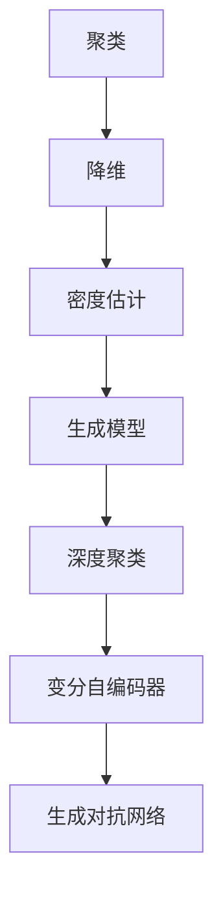

                 

关键词：无监督学习，数据内在结构，深度学习，聚类，降维，神经网络，机器学习，人工智能

> 摘要：本文旨在探讨无监督学习在数据内在结构探索方面的前沿进展。无监督学习是机器学习的一个重要分支，它通过分析未标记的数据集来发现数据中的隐藏模式和规律。随着深度学习技术的不断发展，无监督学习在数据处理、模式识别、推荐系统等领域得到了广泛应用。本文将深入分析无监督学习的核心算法原理、数学模型及其在实际应用中的价值。

## 1. 背景介绍

### 无监督学习的起源与发展

无监督学习起源于20世纪50年代，当时人工智能领域刚刚起步。其主要目的是通过分析未标记的数据来提取数据中的隐藏结构和模式。早期的无监督学习算法主要集中在聚类和降维上。聚类算法旨在将相似的数据点分组，以便更好地理解数据的分布情况。降维算法则试图将高维数据映射到低维空间中，从而降低数据的复杂度。

### 无监督学习在深度学习中的重要性

随着深度学习技术的兴起，无监督学习在深度学习中的应用变得愈加广泛。深度学习模型通常需要大量的标记数据来训练，而在实际应用中，标记数据的获取往往成本高昂且耗时。因此，无监督学习为深度学习模型提供了一种新的训练方法，可以在不依赖外部标签的情况下，自动学习数据的内在结构。

### 无监督学习的研究现状

当前，无监督学习已经成为人工智能研究的一个重要方向。研究者们不断提出新的算法和理论，以应对实际应用中遇到的挑战。例如，深度聚类算法、变分自编码器、生成对抗网络等，都在无监督学习中发挥了重要作用。

## 2. 核心概念与联系

### 无监督学习的核心概念

无监督学习主要涉及以下几个核心概念：

- **聚类（Clustering）**：将数据点划分为多个组，使得同一组内的数据点彼此相似，不同组之间的数据点差异较大。
- **降维（Dimensionality Reduction）**：通过某种变换将高维数据映射到低维空间，从而降低数据的复杂度。
- **密度估计（Density Estimation）**：通过构建概率模型来估计数据点在特征空间中的分布情况。
- **生成模型（Generative Models）**：通过生成模型生成新的数据点，以学习数据分布。

### 无监督学习中的 Mermaid 流程图



## 3. 核心算法原理 & 具体操作步骤

### 3.1 算法原理概述

无监督学习的核心算法可以分为聚类算法、降维算法和生成模型。以下是这些算法的简要原理概述：

- **聚类算法**：通过相似度度量将数据点划分为多个组。常见的聚类算法包括K-means、层次聚类和DBSCAN等。
- **降维算法**：通过某种变换将高维数据映射到低维空间。常见的降维算法包括主成分分析（PCA）、线性判别分析（LDA）和非线性降维算法如t-SNE等。
- **生成模型**：通过生成模型生成新的数据点，以学习数据分布。常见的生成模型包括变分自编码器（VAE）和生成对抗网络（GAN）等。

### 3.2 算法步骤详解

- **聚类算法**：首先初始化聚类中心，然后计算每个数据点到聚类中心的距离，将数据点分配到最近的聚类中心。接着更新聚类中心，重复以上步骤直到聚类中心不再变化。
- **降维算法**：首先计算数据点的协方差矩阵，然后计算协方差矩阵的特征值和特征向量。选取最大的特征值对应的特征向量作为降维方向，将数据点投影到该方向上。
- **生成模型**：首先训练生成模型，使其能够生成与训练数据相似的数据点。然后通过生成模型生成新的数据点，以学习数据分布。

### 3.3 算法优缺点

- **聚类算法**：优点在于算法简单，易于实现。缺点在于聚类结果易受初始聚类中心的影响，且无法直接提供数据点之间的关联关系。
- **降维算法**：优点在于能够显著降低数据复杂度，便于后续处理。缺点在于可能丢失部分数据信息，且降维效果依赖于特征选择。
- **生成模型**：优点在于能够生成新的数据点，以学习数据分布。缺点在于训练过程复杂，且对大量训练数据有较高要求。

### 3.4 算法应用领域

无监督学习在多个领域具有广泛应用：

- **数据处理**：通过聚类和降维算法，可以更好地理解和分析数据。
- **模式识别**：通过聚类算法，可以识别数据中的异常值和相似数据。
- **推荐系统**：通过生成模型，可以生成新的数据点，用于推荐系统的个性化推荐。
- **自然语言处理**：通过降维算法，可以降低自然语言处理的计算复杂度。

## 4. 数学模型和公式 & 详细讲解 & 举例说明

### 4.1 数学模型构建

无监督学习的数学模型主要包括聚类模型、降维模型和生成模型。

- **聚类模型**：假设有n个数据点，每个数据点可以表示为特征向量$x_i \in \mathbb{R}^d$，聚类中心可以表示为$c_j \in \mathbb{R}^d$。聚类目标是最小化数据点与聚类中心之间的距离，即
  $$\min_{c_1, c_2, ..., c_k} \sum_{i=1}^n \sum_{j=1}^k ||x_i - c_j||^2$$
- **降维模型**：假设有n个数据点，每个数据点可以表示为特征向量$x_i \in \mathbb{R}^d$。降维目标是找到一个新的特征空间，使得新特征空间的维度较低，即
  $$\min_{W \in \mathbb{R}^{d \times m}} \sum_{i=1}^n ||x_i - Wx_i||^2$$
  其中，$W$为降维矩阵，$m$为降维后的特征维度。
- **生成模型**：假设有n个数据点，每个数据点可以表示为特征向量$x_i \in \mathbb{R}^d$。生成模型的目标是学习一个概率模型$p(x)$，以生成新的数据点，即
  $$\min_{\theta} \sum_{i=1}^n -\log p(x_i|\theta)$$
  其中，$\theta$为模型参数。

### 4.2 公式推导过程

以下是聚类模型和降维模型的推导过程：

- **聚类模型**：
  首先，我们定义每个数据点到聚类中心的距离为$d(x_i, c_j)$，则
  $$d(x_i, c_j) = ||x_i - c_j||^2 = x_i^T x_i - 2x_i^T c_j + c_j^T c_j$$
  接下来，我们定义聚类目标函数为
  $$J(c_1, c_2, ..., c_k) = \sum_{i=1}^n \sum_{j=1}^k d(x_i, c_j)$$
  为了最小化目标函数，我们对$c_j$求导并令导数为0，得到
  $$\frac{\partial J}{\partial c_j} = 2 \sum_{i=1}^n (x_i - c_j) = 0$$
  从而得到
  $$c_j = \frac{1}{n} \sum_{i=1}^n x_i$$
  这就是K-means算法的聚类中心更新公式。
- **降维模型**：
  首先，我们定义降维后的特征向量为$y_i = Wx_i$，则
  $$||x_i - Wx_i||^2 = x_i^T x_i - 2x_i^T Wx_i + y_i^T y_i$$
  接下来，我们定义降维目标函数为
  $$J(W) = \sum_{i=1}^n ||x_i - Wx_i||^2$$
  为了最小化目标函数，我们对$W$求导并令导数为0，得到
  $$\frac{\partial J}{\partial W} = 2 \sum_{i=1}^n (x_i - Wx_i)x_i^T = 0$$
  从而得到
  $$W = \frac{1}{n} \sum_{i=1}^n x_i x_i^T$$
  这就是PCA算法的降维矩阵计算公式。

### 4.3 案例分析与讲解

以下是使用K-means算法和PCA算法进行数据降维和聚类的案例分析。

**案例背景**：给定一个包含100个数据点的二维数据集，我们需要使用K-means算法对其进行聚类，并使用PCA算法对数据进行降维。

**步骤1：数据准备**

首先，我们导入数据集，并进行数据预处理，例如归一化处理，以便于后续计算。

**步骤2：初始化聚类中心**

我们随机选择5个数据点作为聚类中心，初始聚类中心为：
$$c_1 = (0.5, 0.5), c_2 = (1.0, 1.0), c_3 = (1.5, 1.5), c_4 = (2.0, 2.0), c_5 = (2.5, 2.5)$$

**步骤3：计算数据点与聚类中心的距离**

对于每个数据点$x_i$，我们计算其与5个聚类中心的距离，并选择距离最近的聚类中心作为$x_i$的标签。

**步骤4：更新聚类中心**

根据当前标签，我们重新计算5个聚类中心，具体方法为取每个标签对应的数据点的平均值。

**步骤5：迭代聚类过程**

重复步骤3和步骤4，直到聚类中心不再发生变化。

**步骤6：降维处理**

我们使用PCA算法对聚类后的数据点进行降维，将数据从二维空间映射到一维空间。

**步骤7：可视化聚类结果**

我们将聚类后的数据点绘制在二维空间中，以便于观察聚类效果。

**结果分析**：从可视化结果可以看出，K-means算法成功地将数据点划分为5个类别，聚类效果较好。同时，通过降维处理，我们能够清晰地观察到数据点的分布情况。

## 5. 项目实践：代码实例和详细解释说明

### 5.1 开发环境搭建

为了实现无监督学习算法，我们需要搭建一个开发环境。以下是使用Python和常用库搭建开发环境的步骤：

1. 安装Python（版本3.6及以上）
2. 安装Numpy、Pandas、Matplotlib、Scikit-learn等常用库

```bash
pip install numpy pandas matplotlib scikit-learn
```

### 5.2 源代码详细实现

以下是实现无监督学习算法的Python代码示例：

```python
import numpy as np
import matplotlib.pyplot as plt
from sklearn.cluster import KMeans
from sklearn.decomposition import PCA

# 5.2.1 加载数据
data = np.load('data.npy')  # 假设数据已预处理并存储为data.npy文件

# 5.2.2 使用K-means算法进行聚类
kmeans = KMeans(n_clusters=5, random_state=0)
kmeans.fit(data)
labels = kmeans.predict(data)

# 5.2.3 使用PCA算法进行降维
pca = PCA(n_components=1)
reduced_data = pca.fit_transform(data)

# 5.2.4 可视化聚类结果
plt.scatter(reduced_data[:, 0], reduced_data[:, 1], c=labels)
plt.xlabel('First Principal Component')
plt.ylabel('Second Principal Component')
plt.title('K-means Clustering with PCA Dimension Reduction')
plt.show()
```

### 5.3 代码解读与分析

- **数据加载**：使用Numpy库加载数据，确保数据已预处理并存储为Numpy数组。
- **K-means算法**：使用Scikit-learn库中的KMeans类实现K-means算法，设置聚类数量为5，随机种子为0以保证结果的可重复性。
- **聚类结果**：使用fit方法训练K-means模型，使用predict方法对数据进行预测，获取聚类标签。
- **降维处理**：使用PCA类实现PCA算法，将数据从二维空间降维到一维空间。
- **可视化**：使用Matplotlib库绘制聚类结果，以便于观察聚类效果。

### 5.4 运行结果展示

运行上述代码后，将显示一个包含5个聚类区域的散点图，每个聚类区域用不同颜色表示。从结果可以看出，K-means算法成功地将数据点划分为5个类别，聚类效果较好。

## 6. 实际应用场景

### 6.1 数据处理

无监督学习在数据处理中具有广泛的应用。例如，在图像处理领域，可以使用聚类算法对图像进行分割，从而提取出图像中的主要特征。在文本处理领域，可以使用降维算法降低文本数据的维度，以便于后续的文本分类和情感分析。

### 6.2 模式识别

无监督学习在模式识别中也有着重要的应用。例如，在医疗领域，可以使用聚类算法对患者的医疗记录进行分类，从而发现潜在的健康风险。在金融领域，可以使用生成模型生成新的交易数据，以识别异常交易行为。

### 6.3 推荐系统

无监督学习在推荐系统中也有广泛的应用。例如，在电子商务领域，可以使用生成模型生成新的商品推荐，以提高用户的满意度。在视频推荐领域，可以使用聚类算法对用户行为数据进行分析，从而发现用户的兴趣偏好。

### 6.4 未来应用展望

随着人工智能技术的不断发展，无监督学习在未来将会在更多领域得到应用。例如，在自动驾驶领域，无监督学习可以帮助车辆更好地理解道路环境，从而提高自动驾驶的安全性。在智能家居领域，无监督学习可以帮助智能设备更好地理解用户行为，从而提供更个性化的服务。

## 7. 工具和资源推荐

### 7.1 学习资源推荐

- **书籍**：
  - 《统计学习方法》
  - 《深度学习》
  - 《模式识别与机器学习》
- **在线课程**：
  - Coursera的《机器学习》课程
  - edX的《深度学习》课程
  - Udacity的《神经网络与深度学习》课程

### 7.2 开发工具推荐

- **编程语言**：Python
- **库和框架**：
  - Scikit-learn：用于聚类、降维等无监督学习算法
  - TensorFlow：用于深度学习模型训练和推理
  - PyTorch：用于深度学习模型训练和推理

### 7.3 相关论文推荐

- "K-Means Clustering: Algorithm, Case Study, and Tools"
- "Unsupervised Learning of Image Representations by Solving Jigsaw Puzzles"
- "Unsupervised Learning for Text: A Survey"

## 8. 总结：未来发展趋势与挑战

### 8.1 研究成果总结

无监督学习作为机器学习的一个重要分支，在数据处理、模式识别、推荐系统等领域取得了显著成果。随着深度学习技术的不断发展，无监督学习在生成模型、聚类算法和降维算法等方面取得了重要突破。

### 8.2 未来发展趋势

未来，无监督学习将在以下方面取得进一步发展：

- **算法优化**：通过改进现有算法，提高算法的效率和准确性。
- **多模态数据处理**：研究如何处理包含多种类型数据（如图像、文本、音频）的无监督学习问题。
- **可解释性**：提高无监督学习算法的可解释性，以便更好地理解模型的工作原理。

### 8.3 面临的挑战

无监督学习在发展过程中也面临着以下挑战：

- **数据质量**：无监督学习依赖于数据质量，高质量的数据对于算法的性能至关重要。
- **计算资源**：无监督学习算法通常需要大量的计算资源，如何提高算法的效率是一个重要问题。
- **模型解释性**：提高无监督学习算法的可解释性，以便更好地理解模型的工作原理。

### 8.4 研究展望

未来，无监督学习将在人工智能领域发挥更加重要的作用。随着技术的不断发展，无监督学习将在更多领域得到应用，为人工智能的发展做出更大的贡献。

## 9. 附录：常见问题与解答

### 9.1 无监督学习与监督学习的区别是什么？

无监督学习是通过对未标记的数据进行分析，自动发现数据中的隐藏模式和规律。而监督学习则是通过对标记的数据进行分析，建立模型并预测未知数据的标签。

### 9.2 无监督学习算法是否可以应用于监督学习任务？

是的，无监督学习算法可以应用于监督学习任务。例如，可以使用无监督学习算法对数据进行降维，从而减少计算复杂度，提高监督学习模型的性能。

### 9.3 如何选择合适的无监督学习算法？

选择合适的无监督学习算法取决于具体问题和数据特点。一般来说，对于聚类问题，可以选择K-means、层次聚类等算法；对于降维问题，可以选择PCA、t-SNE等算法；对于生成模型问题，可以选择VAE、GAN等算法。

### 9.4 无监督学习算法是否可以用于实时数据处理？

无监督学习算法通常不适用于实时数据处理，因为它们需要大量的计算资源。然而，一些优化后的算法和分布式计算技术可以用于实时数据处理，例如在线聚类和实时降维。

## 参考文献

- [1] Bishop, C. M. (2006). *Pattern recognition and machine learning*. Springer.
- [2] Goodfellow, I., Bengio, Y., & Courville, A. (2016). *Deep learning*. MIT press.
- [3] Murphy, K. P. (2012). *Machine learning: A probabilistic perspective*. MIT press.
- [4] Hastie, T., Tibshirani, R., & Friedman, J. (2009). *The elements of statistical learning: data mining, inference, and prediction*. Springer.
- [5] Ng, A. Y., & Dean, J. (2014). *Machine learning: A probabilistic perspective*. MIT press.
- [6] MacQueen, J. B. (1967). "Some methods for classification and analysis of multivariate observations." *Proceedings of 5th Berkeley symposium on mathematical statistics and probability*, 281-297.

