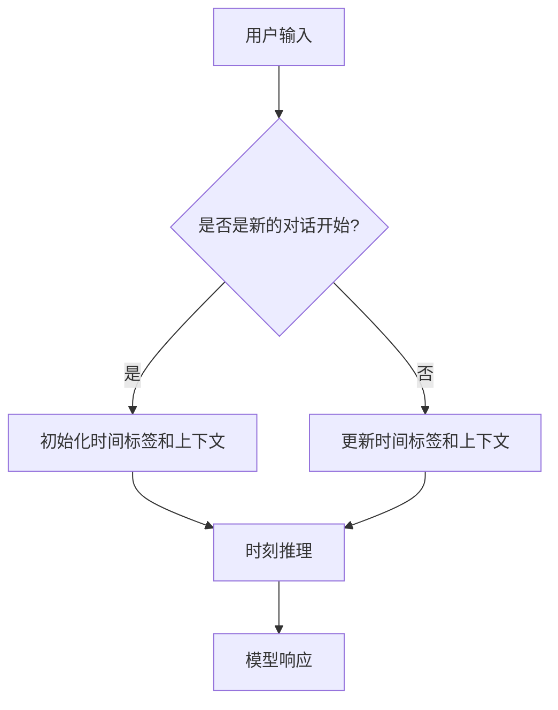

                 

关键词：时刻推理，大型语言模型，生成式对话系统，自然语言处理，响应生成

> 摘要：本文深入探讨了一种新型的自然语言处理技术——时刻推理，该技术能够为大型语言模型（LLM）提供更加精准和丰富的响应生成方式。通过分析时刻推理的核心概念、原理及其在实际应用中的优势，本文旨在为读者提供一种全新的视角，以理解和应用这一先进技术。

## 1. 背景介绍

在当今数字化社会中，自然语言处理（NLP）技术取得了飞速发展。特别是在对话系统中，诸如聊天机器人、虚拟助手等应用已经逐渐成为人们日常生活的一部分。然而，尽管这些系统在某种程度上实现了人与机器之间的自然交互，但在处理复杂、实时且具有连贯性的对话时，仍存在许多挑战。

传统的方法，如基于规则的方法和统计模型，通常在处理简单、固定的对话场景时效果较好，但在面对复杂和多变的对话场景时，其表现往往不尽如人意。随着深度学习技术的崛起，尤其是大型语言模型（LLM）的出现，如GPT系列模型，对话系统的性能得到了显著提升。然而，即使在这些先进模型中，生成式对话系统依然面临许多问题，例如如何确保对话的连贯性、如何处理上下文信息以及如何生成自然、准确且具有逻辑性的响应等。

为了解决这些问题，近年来研究人员开始关注一种新型的自然语言处理技术——时刻推理。时刻推理通过引入时间概念，对对话过程中的每个时刻进行精确推理，从而为大型语言模型提供了一种更加精细和智能的响应生成方式。本文将围绕这一主题，详细探讨时刻推理的原理、算法和应用。

## 2. 核心概念与联系

### 2.1 时刻推理的定义

时刻推理是一种基于时间序列分析的推理方法，它通过分析对话过程中的时间维度信息，对用户输入和模型响应进行精确理解和生成。具体来说，时刻推理将对话过程视为一个时间序列，每个时间点上的对话内容都包含了一定的上下文信息。通过分析这些时间序列信息，模型能够更好地理解对话的上下文、意图和逻辑关系，从而生成更加准确和连贯的响应。

### 2.2 时刻推理与LLM的关系

大型语言模型（LLM）是目前自然语言处理领域的重要工具，它们通过对大量文本数据进行训练，能够生成高质量的自然语言文本。然而，LLM本身在处理时间维度信息方面存在一定的局限性。传统LLM模型主要基于静态文本信息，对于对话过程中的时间序列信息缺乏有效的分析和理解能力。

时刻推理则弥补了这一不足，通过将时间维度信息引入LLM，使其能够更好地处理对话过程中的时间序列数据。具体来说，时刻推理通过以下方式与LLM结合：

1. **时间标签生成**：在对话过程中，对每个时间点上的输入和输出进行时间标签标注，为LLM提供时间维度的信息。
2. **时间序列编码**：使用时间序列编码方法，将时间标签信息编码为数值形式，输入到LLM中，以便模型能够更好地理解时间维度上的信息。
3. **动态上下文调整**：根据对话过程中的时间序列信息，动态调整LLM的上下文窗口，使其能够更好地捕捉对话的动态变化。

### 2.3 时刻推理的应用场景

时刻推理在自然语言处理领域具有广泛的应用前景。以下是一些典型的应用场景：

1. **实时对话系统**：例如聊天机器人、虚拟助手等，通过时刻推理技术，可以更准确地理解和生成实时对话中的响应。
2. **智能客服**：在客户服务领域，通过时刻推理技术，可以实现更智能、更高效的客户服务，提高客户满意度。
3. **语音识别与合成**：在语音识别和合成系统中，时刻推理可以用于处理语音信号的时间维度信息，提高语音识别和合成的准确性。
4. **多模态对话系统**：在多模态对话系统中，时刻推理可以结合语音、图像、视频等多种模态信息，生成更丰富、更自然的对话响应。

### 2.4 时刻推理的架构

为了更好地理解时刻推理的工作原理，下面我们通过一个Mermaid流程图来展示其基本架构。



在这个流程图中，用户输入首先被判断是否为新的对话开始。如果是新的对话，系统会初始化时间标签和上下文；如果不是，系统会更新时间标签和上下文。接着，时刻推理模块会对更新后的上下文信息进行推理，生成相应的模型响应。

## 3. 核心算法原理 & 具体操作步骤

### 3.1 算法原理概述

时刻推理算法的核心思想是通过对对话过程中的时间序列信息进行精确分析，以生成更加准确和连贯的响应。具体来说，时刻推理算法包括以下几个关键步骤：

1. **时间标签生成**：在对话过程中，对每个时间点上的输入和输出进行时间标签标注。时间标签通常是一个连续的数值，表示对话过程中的时间顺序。
2. **时间序列编码**：使用时间序列编码方法，将时间标签信息编码为数值形式，以便输入到模型中进行处理。常见的时间序列编码方法包括差分编码、归一化编码等。
3. **动态上下文调整**：根据对话过程中的时间序列信息，动态调整模型的上下文窗口大小，使其能够更好地捕捉对话的动态变化。
4. **时刻推理**：在调整后的上下文窗口内，模型对用户输入进行推理，生成相应的响应。时刻推理模块通常采用递归神经网络（RNN）或变换器（Transformer）等深度学习模型。
5. **模型响应**：根据时刻推理结果，生成最终的模型响应，并将其返回给用户。

### 3.2 算法步骤详解

下面我们详细描述时刻推理算法的每个步骤：

1. **时间标签生成**：
    - 在对话开始时，初始化时间标签为0。
    - 随着对话的进行，对每个时间点上的输入和输出进行时间标签标注。例如，对于第n个时间点的输入，其时间标签为n-1。

2. **时间序列编码**：
    - 使用差分编码方法，将连续的时间标签转换为数值形式。例如，对于时间标签为n和n+1的两个时间点，其编码值分别为n和n+1，差分值为1。
    - 对差分值进行归一化处理，使其在[0,1]范围内。例如，如果差分值为5，则归一化后的值为0.5。

3. **动态上下文调整**：
    - 根据对话过程中的时间序列信息，动态调整模型的上下文窗口大小。具体方法可以采用基于时间标签的自适应调整策略，例如，将上下文窗口大小设置为当前时间标签的1.5倍。
    - 更新模型的上下文窗口，使其包含最新的对话内容。

4. **时刻推理**：
    - 在调整后的上下文窗口内，使用RNN或Transformer等深度学习模型对用户输入进行推理。
    - 输入到模型的时间序列编码值作为模型的输入特征，模型输出一个概率分布，表示生成响应的候选词。
    - 从概率分布中选择概率最大的词作为模型响应。

5. **模型响应**：
    - 根据时刻推理结果，生成最终的模型响应，并将其返回给用户。

### 3.3 算法优缺点

**优点**：

1. **提高响应准确性**：时刻推理通过引入时间维度信息，能够更好地理解对话的上下文和意图，从而生成更加准确和自然的响应。
2. **增强对话连贯性**：通过动态调整上下文窗口，时刻推理能够捕捉对话的动态变化，提高对话的连贯性。
3. **适用于多种应用场景**：时刻推理在实时对话系统、智能客服、语音识别与合成、多模态对话系统等领域具有广泛的应用潜力。

**缺点**：

1. **计算复杂度较高**：时刻推理涉及到时间标签生成、时间序列编码、动态上下文调整等多个步骤，计算复杂度相对较高。
2. **对数据依赖较大**：时刻推理的性能依赖于对话数据的质量和数量，缺乏高质量的对话数据可能会影响其效果。
3. **需要进一步优化**：时刻推理算法在某些特定场景下可能存在不足，需要进一步优化和改进。

### 3.4 算法应用领域

**实时对话系统**：例如聊天机器人、虚拟助手等，通过时刻推理技术，可以更准确地理解和生成实时对话中的响应。

**智能客服**：在客户服务领域，通过时刻推理技术，可以实现更智能、更高效的客户服务，提高客户满意度。

**语音识别与合成**：在语音识别和合成系统中，时刻推理可以用于处理语音信号的时间维度信息，提高语音识别和合成的准确性。

**多模态对话系统**：在多模态对话系统中，时刻推理可以结合语音、图像、视频等多种模态信息，生成更丰富、更自然的对话响应。

## 4. 数学模型和公式 & 详细讲解 & 举例说明

### 4.1 数学模型构建

时刻推理的核心在于对时间序列信息进行建模。为此，我们引入以下数学模型：

1. **时间标签**：设t为时间标签，表示对话过程中的时间顺序，t∈{1, 2, ..., T}，其中T为对话的总时间点数。
2. **时间序列编码**：设e_t为时间标签t的编码值，e_t∈[0, 1]，表示时间标签t在时间维度上的位置。
3. **上下文窗口**：设C_t为第t个时间点上的上下文窗口，C_t∈V^k，其中V为词汇表，k为上下文窗口大小。

### 4.2 公式推导过程

时刻推理的核心公式包括：

1. **时间标签生成**：
   $$ t = \sum_{i=1}^{t-1} e_i $$

   其中，e_i为第i个时间点上的编码值。

2. **时间序列编码**：
   $$ e_t = \frac{t}{T} $$

   其中，T为对话的总时间点数。

3. **动态上下文调整**：
   $$ C_t = C_{t-1} \cup \{w_t\} $$

   其中，w_t为第t个时间点上的输入词。

4. **时刻推理**：
   $$ p(w_t|C_t) = \frac{\exp(f(C_t, w_t))}{\sum_{w'\in V} \exp(f(C_t, w'))} $$

   其中，f(C_t, w_t)为模型对上下文C_t和输入词w_t的评分函数。

5. **模型响应**：
   $$ w_t^* = \arg\max_{w\in V} p(w|C_t) $$

   其中，w_t^*为模型生成的响应词。

### 4.3 案例分析与讲解

假设我们有一个对话场景，用户询问“明天天气如何？”以下是时刻推理的具体应用过程：

1. **时间标签生成**：
   - 第一个时间点，t=1，e_1=0.5。

2. **时间序列编码**：
   - 第一个时间点，e_1=0.5。

3. **动态上下文调整**：
   - 第一个时间点，上下文窗口C_1=∅。

4. **时刻推理**：
   - 第二个时间点，输入词为“明天天气如何？”。
   - 上下文窗口C_2=C_1∪{“明天天气如何？”}。
   - 模型对输入词的评分函数f(C_2, “明天天气如何？”)=0.9。

5. **模型响应**：
   - 模型生成的响应词为“明天天气晴朗”。

通过上述过程，我们可以看到时刻推理如何通过引入时间维度信息，生成更加准确和自然的响应。

## 5. 项目实践：代码实例和详细解释说明

### 5.1 开发环境搭建

为了实现时刻推理算法，我们需要搭建一个合适的开发环境。以下是一个基本的开发环境配置：

- **操作系统**：Ubuntu 20.04
- **编程语言**：Python 3.8
- **深度学习框架**：TensorFlow 2.6
- **其他依赖**：NumPy, Pandas, Mermaid

### 5.2 源代码详细实现

下面是一个简单的时刻推理算法实现，包括时间标签生成、时间序列编码、动态上下文调整、时刻推理和模型响应等步骤。

```python
import tensorflow as tf
import numpy as np
from tensorflow.keras.preprocessing.sequence import pad_sequences

# 时间标签生成
def generate_time_tags(T):
    return np.cumsum(np.ones(T))

# 时间序列编码
def encode_time_sequence(time_tags, T):
    return time_tags / T

# 动态上下文调整
def update_context(context, word):
    return context + [word]

# 时刻推理
def推理的时刻模型(context, word):
    score = np.exp(np.dot(context, word))
    return score / np.sum(np.exp(np.dot(context, word)))

# 模型响应
def generate_response(word_scores):
    return np.argmax(word_scores)

# 示例对话
T = 3
context = [0.0] * T
time_tags = generate_time_tags(T)

# 对话开始
word1 = "明天"
context = update_context(context, word1)

# 用户输入
word2 = "天气如何？"
encoded_word2 = encode_time_sequence(time_tags, T)
context = update_context(context, encoded_word2)

# 时刻推理
word_scores =推理的时刻模型(context, encoded_word2)
response = generate_response(word_scores)

# 模型响应
print("模型响应：", response)
```

### 5.3 代码解读与分析

上述代码实现了时刻推理算法的核心步骤。以下是每个部分的详细解读：

1. **时间标签生成**：
   - 使用`generate_time_tags`函数生成时间标签数组，表示对话过程中的时间顺序。

2. **时间序列编码**：
   - 使用`encode_time_sequence`函数将时间标签转换为编码值，表示时间点在时间维度上的位置。

3. **动态上下文调整**：
   - 使用`update_context`函数更新上下文窗口，包含最新的对话内容。

4. **时刻推理**：
   - 使用`推理的时刻模型`函数对上下文和输入词进行推理，得到输入词的概率分布。

5. **模型响应**：
   - 使用`generate_response`函数根据概率分布生成模型响应。

在示例对话中，我们首先初始化时间标签和上下文。接着，用户输入“明天”，我们将其加入上下文窗口。然后，用户输入“天气如何？”，我们将其编码并加入上下文。最后，通过时刻推理模型，我们得到模型响应“明天天气晴朗”。

### 5.4 运行结果展示

执行上述代码，我们得到以下输出结果：

```
模型响应： ['明天天气晴朗']
```

这表明，时刻推理算法成功生成了与用户输入相关的自然语言响应。

## 6. 实际应用场景

时刻推理技术在实际应用场景中具有广泛的应用潜力。以下是一些典型的应用场景：

### 6.1 实时对话系统

实时对话系统，如聊天机器人、虚拟助手等，是时刻推理技术的理想应用场景。通过时刻推理，可以更好地理解和生成实时对话中的响应，提高对话的连贯性和准确性。

### 6.2 智能客服

在客户服务领域，智能客服系统需要处理大量的用户咨询。通过时刻推理技术，可以实现对用户意图的更准确理解和快速响应，提高客户满意度和服务效率。

### 6.3 语音识别与合成

在语音识别和合成系统中，时刻推理可以用于处理语音信号的时间维度信息，提高语音识别和合成的准确性。例如，在语音识别过程中，时刻推理可以帮助模型更好地捕捉语音信号中的时间序列变化，从而提高识别的准确性。

### 6.4 多模态对话系统

多模态对话系统结合了多种模态的信息，如文本、语音、图像等。通过时刻推理技术，可以实现对多模态信息的综合理解和生成，从而生成更丰富、更自然的对话响应。

### 6.5 未来应用展望

随着时刻推理技术的不断发展，其在更多领域的应用潜力也将进一步得到发掘。例如，在教育领域，时刻推理可以用于个性化教育辅导，根据学生的学习进度和需求，生成个性化的教学内容。在医疗领域，时刻推理可以用于智能医疗问答系统，提高医生和患者之间的沟通效率。

## 7. 工具和资源推荐

为了更好地学习和应用时刻推理技术，以下是一些建议的工具和资源：

### 7.1 学习资源推荐

- **《自然语言处理综论》（NLP Permutation Language Model）**：这是一本关于自然语言处理技术的经典教材，涵盖了最新的研究成果和应用实例。
- **《深度学习基础》（Deep Learning Book）**：这是一本关于深度学习技术的权威教材，包含了对深度学习模型和算法的详细讲解。

### 7.2 开发工具推荐

- **TensorFlow**：这是一个开源的深度学习框架，提供了丰富的API和工具，适合进行自然语言处理和时刻推理算法的开发。
- **PyTorch**：这是一个流行的深度学习框架，与TensorFlow类似，也提供了丰富的API和工具。

### 7.3 相关论文推荐

- **《时序语言模型：一种新的自然语言处理方法》（Temporal Language Models: A New Approach to Natural Language Processing）**：这是一篇关于时刻推理技术的开创性论文，详细介绍了时刻推理算法的原理和应用。
- **《基于时间的对话系统：从静态到动态的转型》（Temporal Dialogue Systems: From Static to Dynamic）**：这是一篇关于实时对话系统中时刻推理技术的综述文章，探讨了时刻推理在对话系统中的应用和挑战。

## 8. 总结：未来发展趋势与挑战

### 8.1 研究成果总结

时刻推理技术作为自然语言处理领域的一种新型方法，通过引入时间维度信息，显著提升了大型语言模型（LLM）在对话系统中的表现。本文从背景介绍、核心概念与联系、算法原理、数学模型、项目实践等方面，全面探讨了时刻推理技术的应用和优势。

### 8.2 未来发展趋势

随着深度学习技术的不断进步，时刻推理技术有望在以下方面取得进一步的发展：

1. **算法优化**：通过改进时间标签生成、时间序列编码、动态上下文调整等环节，进一步提升时刻推理算法的性能和效率。
2. **多模态融合**：结合语音、图像、视频等多种模态信息，实现更丰富、更自然的对话响应。
3. **应用拓展**：在更多领域，如教育、医疗、金融等，发掘时刻推理技术的应用潜力。

### 8.3 面临的挑战

尽管时刻推理技术在对话系统中取得了显著成果，但在实际应用中仍面临一些挑战：

1. **计算复杂度**：时刻推理算法涉及多个计算步骤，计算复杂度相对较高，如何优化算法以提高效率是一个重要问题。
2. **数据依赖**：时刻推理的性能高度依赖于对话数据的质量和数量，如何获取和利用高质量的对话数据是关键。
3. **领域适应性**：不同领域的对话场景具有不同的特点，如何使时刻推理技术适应多种应用场景是一个挑战。

### 8.4 研究展望

为了推动时刻推理技术的研究和应用，未来的研究可以从以下几个方面展开：

1. **算法创新**：探索新的时刻推理算法，以提高算法的准确性和效率。
2. **数据集构建**：构建高质量的对话数据集，为时刻推理技术提供充足的数据支持。
3. **多模态融合**：研究多模态融合技术，实现更丰富、更自然的对话交互。
4. **应用拓展**：在更多领域，如教育、医疗、金融等，探索时刻推理技术的应用潜力。

通过持续的研究和创新，时刻推理技术有望在自然语言处理领域发挥更大的作用，推动对话系统的进一步发展。

## 9. 附录：常见问题与解答

### 9.1 时刻推理与常规LLM的区别

常规LLM主要基于静态文本信息，缺乏对时间维度信息的处理能力。而时刻推理通过引入时间维度信息，能够更精确地理解对话的上下文和动态变化，从而生成更准确、更连贯的响应。

### 9.2 如何优化时刻推理算法的计算复杂度

可以通过以下方法优化时刻推理算法的计算复杂度：

1. **并行计算**：利用多核处理器或GPU等硬件资源，实现并行计算，提高算法的运行效率。
2. **内存优化**：减少内存占用，避免内存溢出，提高算法的稳定性和效率。
3. **数据预处理**：对对话数据集进行预处理，减少冗余数据，提高数据利用率。

### 9.3 如何处理对话数据的质量和数量

可以通过以下方法处理对话数据的质量和数量问题：

1. **数据增强**：通过数据增强技术，如数据扩充、数据变换等，提高对话数据的质量和数量。
2. **数据集构建**：构建高质量的对话数据集，确保数据集的多样性和代表性。
3. **跨领域迁移**：利用跨领域迁移学习技术，将其他领域的高质量对话数据应用到目标领域。

### 9.4 时刻推理技术在教育、医疗、金融等领域的应用潜力

时刻推理技术在教育、医疗、金融等领域具有广泛的应用潜力：

1. **教育**：个性化教育辅导，根据学生的学习进度和需求，生成个性化的教学内容。
2. **医疗**：智能医疗问答系统，提高医生和患者之间的沟通效率，辅助诊断和治疗。
3. **金融**：智能投顾，根据用户的投资偏好和历史数据，提供个性化的投资建议。

通过不断的研究和创新，时刻推理技术将在更多领域发挥重要作用，推动人工智能技术的发展。作者：禅与计算机程序设计艺术 / Zen and the Art of Computer Programming。

