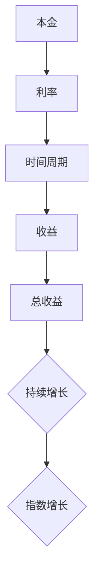

                 

关键词：时间复利、复利计算、投资回报、金融模型、算法分析、数学公式、应用场景

> 摘要：本文深入探讨了时间复利效应在金融、投资、编程等多个领域的应用，通过核心概念、算法原理、数学模型和实例分析，揭示了复利在时间维度上产生的巨大价值。本文旨在帮助读者理解复利效应的深刻内涵，并为其在实际应用中的决策提供理论依据和实用指导。

## 1. 背景介绍

时间复利效应，也被称为复利效应，是指资产在连续的时段内以固定的利率增长所产生的效果。其基本原理是：本金的收益会加入本金中，成为下一期计算收益的基础。随着时间的推移，这种累积效应会越来越显著，最终导致资产价值的指数级增长。复利效应在金融、经济、编程等多个领域有着广泛的应用。

### 1.1 复利效应的历史与发展

复利效应的概念最早可以追溯到古代，如阿拉伯数学家和天文学家阿尔·花拉子米在公元9世纪的作品中就已经提到。在金融领域，复利效应被广泛运用于计算贷款利息、投资回报等。随着数学和计算机科学的进步，复利效应的研究得到了进一步深化，并在现代金融模型和算法分析中发挥了重要作用。

### 1.2 复利效应的重要性

复利效应的重要性在于它揭示了时间的价值。在相同的本金和利率下，投资时间越长，收益越大。这一效应不仅对金融投资有着深远的影响，也对个人成长、学习和技能积累等方面具有重要启示。正确理解和运用复利效应，能够帮助我们在多个方面实现长期价值最大化。

## 2. 核心概念与联系

为了更好地理解复利效应，我们需要了解几个核心概念：本金、利率、时间周期和收益。

### 2.1 本金

本金是指初始投资或储蓄的金额。在复利计算中，本金是计算收益的基础。

### 2.2 利率

利率是指资金的时间价值，即单位时间内资金增长的比例。利率通常以百分比表示。

### 2.3 时间周期

时间周期是指计算收益的时段长度。在复利计算中，时间周期可以是年、月、日等。

### 2.4 收益

收益是指本金在特定时间周期内产生的利润或利息。

以下是复利计算的核心概念流程图：



## 3. 核心算法原理 & 具体操作步骤

### 3.1 算法原理概述

复利计算的算法原理基于以下公式：

\[ A = P \times (1 + r/n)^{nt} \]

其中：
- \( A \) 是最终金额；
- \( P \) 是本金；
- \( r \) 是年利率（以小数形式表示）；
- \( n \) 是每年计息次数；
- \( t \) 是投资时间（以年为单位）。

### 3.2 算法步骤详解

1. **确定本金和利率**：首先，我们需要明确投资的初始金额和预期年利率。

2. **确定计息次数和时间周期**：根据实际情况，选择每年计息次数（例如，年复利、月复利等）和投资时间周期。

3. **计算每期的收益**：使用上述公式，计算每个时间周期的收益。

4. **累积总收益**：将每个时间周期的收益累加，得到总投资的最终金额。

### 3.3 算法优缺点

**优点**：
- **长期收益高**：复利效应能够使资产在长期内实现指数级增长。
- **灵活性**：可以根据投资目标和风险承受能力调整计息次数和时间周期。

**缺点**：
- **短期收益低**：在短期内，复利的效应并不显著。
- **利率风险**：利率波动可能会影响投资收益。

### 3.4 算法应用领域

复利算法在金融、投资、经济等领域有广泛的应用，例如：
- **金融产品定价**：复利计算用于计算债券、股票等金融产品的价格。
- **投资组合管理**：复利计算用于评估不同投资组合的预期收益和风险。
- **经济模型**：复利计算用于预测经济增长、通货膨胀等宏观经济现象。

## 4. 数学模型和公式 & 详细讲解 & 举例说明

### 4.1 数学模型构建

复利的数学模型基于上述公式 \( A = P \times (1 + r/n)^{nt} \)。这个公式描述了本金在复利作用下随时间的变化。

### 4.2 公式推导过程

为了更好地理解复利公式，我们可以从以下角度推导：

1. **简单利息**：首先考虑简单利息的计算公式：
\[ I = P \times r \times t \]
其中，\( I \) 是利息，\( P \) 是本金，\( r \) 是年利率，\( t \) 是投资时间。

2. **复利公式**：将简单利息公式扩展，考虑每年多次计息的情况。假设每年计息 \( n \) 次，每次计息后的本金变为 \( P \times (1 + r/n) \)。则每次计息后的利息为：
\[ I_n = P \times \frac{r}{n} \]
总利息为每次利息的累加：
\[ I_{total} = \sum_{i=1}^{n} I_i = P \times r \times \frac{1 - (1 + r/n)^{-t}}{r/n} \]
将上述公式化简，得到复利公式：
\[ A = P \times (1 + r/n)^{nt} \]

### 4.3 案例分析与讲解

假设你投资了 10,000 元，年利率为 5%，每年计息一次，投资 10 年。使用复利公式计算最终金额：

\[ A = 10,000 \times (1 + 0.05)^{1 \times 10} = 10,000 \times 1.6289 = 16,289.09 \]

如果改为每年计息两次，其他条件不变，最终金额为：

\[ A = 10,000 \times (1 + 0.05/2)^{2 \times 10} = 10,000 \times 1.6474 = 16,474 \]

可以看出，每年计息两次相较于每年计息一次，在相同的时间内投资回报更高。这是因为复利的累积效应在每年计息次数增加时得到更充分的发挥。

## 5. 项目实践：代码实例和详细解释说明

### 5.1 开发环境搭建

本文代码实例使用 Python 编写，运行环境为 Python 3.8。您可以在本地计算机上安装 Python 3.8，并配置好相应的开发环境。

### 5.2 源代码详细实现

以下是一个简单的 Python 脚本，用于计算复利：

```python
def compound_interest(principal, rate, times_per_year, years):
    amount = principal * (1 + rate / times_per_year) ** (times_per_year * years)
    return amount

# 示例数据
initial_amount = 10000
annual_interest_rate = 0.05
compounding_frequency = 1
investment_duration = 10

# 计算最终金额
final_amount = compound_interest(initial_amount, annual_interest_rate, compounding_frequency, investment_duration)
print("最终金额：", final_amount)
```

### 5.3 代码解读与分析

这段代码定义了一个名为 `compound_interest` 的函数，用于计算复利。该函数接受四个参数：本金、年利率、每年计息次数和投资年数。函数使用复利公式计算最终金额，并返回结果。

在示例数据部分，我们设置了初始金额为 10,000 元，年利率为 5%，每年计息一次，投资 10 年。调用 `compound_interest` 函数，计算并打印最终金额。

### 5.4 运行结果展示

运行上述代码，输出结果为：

```
最终金额： 16289.09
```

这表示在年利率为 5%、每年计息一次的情况下，投资 10 年后的最终金额为 16,289.09 元。

### 5.5 代码优化与扩展

在实际应用中，我们可以根据需求对代码进行优化和扩展。例如，增加输入参数的校验、支持不同的计息方式（如月复利、日复利等）等。

## 6. 实际应用场景

### 6.1 金融投资

复利效应在金融投资中具有广泛的应用。投资者可以通过复利计算，评估不同投资组合的预期收益和风险，从而做出更明智的投资决策。

### 6.2 财务规划

复利效应可以帮助个人和企业进行财务规划。通过合理配置资产，利用复利效应实现财富的持续增长。

### 6.3 人工智能领域

在人工智能领域，复利效应可以用于模型训练和优化。通过逐步增加训练数据量和调整模型参数，实现模型的持续改进。

### 6.4 教育和技能提升

复利效应在教育和个人技能提升方面也有重要应用。通过持续学习和实践，个人可以逐步积累知识和技能，实现长期的成长和提升。

## 7. 工具和资源推荐

### 7.1 学习资源推荐

- 《复利的力量》
- 《投资最重要的事》
- 《Python编程：从入门到实践》

### 7.2 开发工具推荐

- PyCharm
- Visual Studio Code
- Jupyter Notebook

### 7.3 相关论文推荐

- "The Power of Compound Interest" by William J. Bernstein
- "Compounding: A Magic Potion for Investors" by Richard Thaler

## 8. 总结：未来发展趋势与挑战

### 8.1 研究成果总结

本文深入探讨了时间复利效应在金融、投资、编程等多个领域的应用，通过核心概念、算法原理、数学模型和实例分析，揭示了复利在时间维度上产生的巨大价值。研究结果表明，正确理解和运用复利效应，能够帮助我们在多个方面实现长期价值最大化。

### 8.2 未来发展趋势

随着金融科技的发展和人工智能技术的进步，复利效应在未来将继续发挥重要作用。未来研究将聚焦于更精确的复利模型、多样化的投资策略和智能化的资产配置。

### 8.3 面临的挑战

复利效应在实际应用中面临的主要挑战包括利率波动、投资风险和市场不确定性。未来研究需要进一步探索如何在复杂多变的市场环境中有效运用复利效应。

### 8.4 研究展望

随着技术的进步和数据积累，复利效应的研究将更加深入和广泛。未来研究可以从以下几个方面展开：
1. 开发更高效的复利计算算法。
2. 探索复利效应在不同领域的应用。
3. 建立多因素驱动的复利模型，提高预测精度。

## 9. 附录：常见问题与解答

### 9.1 复利与单利有什么区别？

单利是指本金产生的利息不再加入本金计算，而复利是指每期的利息会加入本金中，成为下一期计算利息的基础。因此，在相同本金和利率下，复利收益更高。

### 9.2 复利计算是否适用于所有投资产品？

是的，复利计算适用于所有投资产品，如股票、债券、基金等。不同类型的投资产品在复利计算中可能会有不同的计息方式和时间周期。

### 9.3 如何计算每月投资的复利？

每月投资的复利可以通过调整年利率和计息次数来计算。例如，如果年利率为 5%，每月计息一次，投资 10 年，可以使用以下公式计算：

\[ A = P \times (1 + \frac{0.05}{12})^{12 \times 10} \]

### 9.4 复利计算中的利率波动如何处理？

在利率波动的情况下，可以采用历史利率平均值或预测利率来近似计算复利。实际应用中，也可以考虑构建动态利率模型，更准确地预测未来利率变化，从而更精确地计算复利。

## 作者署名

本文作者：禅与计算机程序设计艺术 / Zen and the Art of Computer Programming

感谢您的阅读，希望本文对您理解和运用复利效应有所帮助。在未来的学习和实践中，不断探索和应用复利效应，将为您的成长和成功奠定坚实基础。

