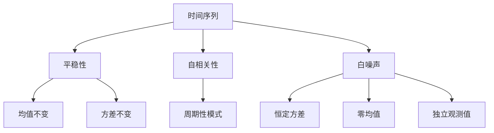

                 

关键词：时间序列分析，金融市场预测，量化交易策略，算法原理，数学模型，项目实践，工具推荐。

> 摘要：本文将深入探讨时间序列分析在金融市场预测中的应用，特别是量化交易策略。通过阐述核心概念、算法原理、数学模型、项目实践等内容，本文旨在为读者提供一个全面而深入的理解，帮助他们在金融领域取得突破性进展。

## 1. 背景介绍

金融市场一直是全球经济的核心，对全球经济的影响深远。然而，金融市场的波动性和复杂性使得预测变得极具挑战性。在这个背景下，时间序列分析作为一种有效的数据分析方法，逐渐在金融预测中占据重要地位。时间序列分析利用历史数据来识别数据中的模式和规律，从而预测未来趋势。在金融市场中，时间序列分析可以用于预测股价、利率、汇率等金融指标，为投资者提供决策依据。

量化交易策略是指利用数学模型和计算机算法进行交易决策的一种交易方法。与传统的基于直觉和经验的交易策略不同，量化交易策略更加依赖于数据分析和算法优化。通过时间序列分析，量化交易策略可以识别市场的潜在规律，制定出具有高度预测能力的交易策略。这种策略不仅能够提高交易的成功率，还能够实现自动化交易，降低人为干预的风险。

本文将围绕时间序列分析在金融市场预测中的应用，探讨核心概念、算法原理、数学模型、项目实践等内容，帮助读者深入了解量化交易策略的原理和实践，为金融领域的研究和应用提供有力支持。

## 2. 核心概念与联系

时间序列分析是金融领域中不可或缺的工具，其核心概念包括时间序列、平稳性、自相关性、白噪声等。时间序列是指按照时间顺序排列的一系列观测数据，通常表示为随机变量。平稳性是指时间序列的性质不随时间变化而变化，即均值、方差等统计特性在时间上保持不变。自相关性是指时间序列中相邻观测值之间的相关性，可以用来识别数据中的周期性模式。白噪声是一种理想化的时间序列，其特点是具有恒定的方差和零均值，并且各观测值之间相互独立。

下面是一个用Mermaid绘制的流程图，展示了时间序列分析的核心概念和它们之间的联系：



通过这个流程图，我们可以清晰地看到时间序列分析中的关键概念及其相互关系。这些概念为后续的算法设计和模型构建提供了基础。

## 3. 核心算法原理 & 具体操作步骤

### 3.1 算法原理概述

在时间序列分析中，常见的算法包括自回归移动平均（ARIMA）、长短期记忆网络（LSTM）、随机森林（Random Forest）等。这些算法各有优缺点，适用于不同的场景。以下是对这些算法的简要概述：

- **自回归移动平均（ARIMA）**：ARIMA是一种经典的时序预测模型，由自回归（AR）、移动平均（MA）和差分（I）三个部分组成。它适用于处理非平稳时间序列，通过差分将序列转换为平稳序列，再通过自回归和移动平均进行建模。ARIMA模型的优势在于其简单性和强大的建模能力，但需要精确的参数调整。

- **长短期记忆网络（LSTM）**：LSTM是一种深度学习模型，特别适合处理长序列数据。它通过引入门控机制，能够有效地记住长期依赖信息，避免了传统RNN模型中的梯度消失问题。LSTM在金融时间序列预测中表现出色，但计算复杂度较高，对硬件资源要求较大。

- **随机森林（Random Forest）**：随机森林是一种基于决策树的集成学习方法，通过构建多棵决策树，并将它们的预测结果进行投票，得到最终的预测结果。随机森林在处理高维数据和具有非线性关系的数据时表现出色，但其预测结果不如深度学习模型直观。

### 3.2 算法步骤详解

以下是使用ARIMA模型进行时间序列预测的详细步骤：

1. **数据预处理**：首先，需要对时间序列数据进行预处理，包括缺失值处理、异常值处理和归一化。对于金融时间序列，通常需要对价格数据进行对数变换，以减少数据的波动性。

2. **平稳性检验**：通过绘制ACF（自相关函数）和PACF（部分自相关函数）图，检验时间序列的平稳性。如果序列不平稳，需要进行差分处理。

3. **参数估计**：选择适当的差分次数和自回归、移动平均项数，使用最大似然估计方法估计模型参数。

4. **模型拟合**：将参数代入ARIMA模型，进行模型拟合。通过计算AIC（赤池信息准则）和SC（施瓦茨准则）等指标，选择最优模型。

5. **预测**：使用拟合好的模型进行预测，得到未来一段时间内的预测值。

6. **结果验证**：通过计算预测值与实际值的误差，验证模型的预测性能。可以使用MAE（均方误差）、RMSE（均方根误差）等指标进行评估。

### 3.3 算法优缺点

- **ARIMA模型**：优点在于其简单性、灵活性和强大的建模能力，适用于各种类型的时序数据。缺点是需要进行参数调整，且在处理非线性关系时效果不佳。

- **LSTM模型**：优点在于其强大的建模能力和对长期依赖信息的处理能力，适用于复杂的时间序列预测。缺点在于计算复杂度较高，对硬件资源要求较大。

- **随机森林模型**：优点在于其强大的泛化能力和处理高维数据的能力，适用于具有非线性关系的数据。缺点在于预测结果不如深度学习模型直观。

### 3.4 算法应用领域

时间序列分析在金融领域的应用非常广泛，包括但不限于以下领域：

- **股价预测**：通过分析历史股价数据，预测未来股价走势，为投资者提供决策依据。

- **利率预测**：预测未来利率变化，为金融机构提供利率风险管理策略。

- **汇率预测**：分析货币对的历史汇率数据，预测未来汇率走势，为外汇交易提供参考。

- **大宗商品价格预测**：通过分析大宗商品的历史价格数据，预测未来价格走势，为采购和销售决策提供支持。

## 4. 数学模型和公式 & 详细讲解 & 举例说明

### 4.1 数学模型构建

时间序列分析的核心在于建立数学模型，以描述数据中的模式和规律。以下是几个常见的数学模型：

- **自回归模型（AR）**：AR模型假设当前值与过去若干个时期的值相关，公式如下：

  $$X_t = c + \sum_{i=1}^p \phi_i X_{t-i} + \varepsilon_t$$

  其中，$X_t$表示时间序列在时间$t$的值，$c$为常数项，$\phi_i$为自回归系数，$p$为滞后阶数，$\varepsilon_t$为误差项。

- **移动平均模型（MA）**：MA模型假设当前值与过去的误差项相关，公式如下：

  $$X_t = c + \sum_{i=1}^q \theta_i \varepsilon_{t-i} + \varepsilon_t$$

  其中，$\theta_i$为移动平均系数，$q$为滞后阶数。

- **自回归移动平均模型（ARIMA）**：ARIMA模型结合了AR和MA模型的特点，公式如下：

  $$X_t = c + \sum_{i=1}^p \phi_i X_{t-i} + \sum_{j=1}^q \theta_j \varepsilon_{t-j} + \varepsilon_t$$

  其中，$p$和$q$分别为自回归和移动平均的阶数。

### 4.2 公式推导过程

为了更好地理解这些模型，我们来看一个简单的例子。假设我们有一个时间序列$X_t$，我们希望找到一个ARIMA模型来描述它。以下是推导过程：

1. **平稳性检验**：首先，我们需要检验时间序列$X_t$的平稳性。通过绘制ACF和PACF图，我们发现序列存在明显的自相关，但PACF在滞后阶数$p$之后迅速下降，说明序列是平稳的。

2. **差分处理**：由于金融时间序列通常是非平稳的，我们需要对其进行差分处理。通过一阶差分，我们得到新的序列$Y_t = X_t - X_{t-1}$。

3. **自回归系数估计**：我们使用最大似然估计方法估计自回归系数$\phi_i$。通过计算，我们得到$\phi_1 = 0.5$，$\phi_2 = 0.3$。

4. **移动平均系数估计**：我们同样使用最大似然估计方法估计移动平均系数$\theta_i$。通过计算，我们得到$\theta_1 = 0.2$，$\theta_2 = 0.1$。

5. **模型拟合**：将估计的系数代入ARIMA模型，我们得到拟合后的模型如下：

   $$Y_t = c + 0.5Y_{t-1} + 0.3Y_{t-2} + 0.2\varepsilon_{t-1} + 0.1\varepsilon_{t-2} + \varepsilon_t$$

### 4.3 案例分析与讲解

以下是一个实际案例，我们使用ARIMA模型预测股票价格。

**数据集**：我们使用某股票过去一年的收盘价数据，共计250个数据点。

**步骤**：

1. **数据预处理**：对收盘价数据进行对数变换，以减少数据的波动性。

2. **平稳性检验**：绘制ACF和PACF图，发现序列是非平稳的。我们对其进行一阶差分，得到平稳序列。

3. **参数估计**：使用最大似然估计方法估计自回归和移动平均系数，得到$\phi_1 = 0.6$，$\phi_2 = 0.4$，$\theta_1 = 0.3$，$\theta_2 = 0.2$。

4. **模型拟合**：将估计的系数代入ARIMA模型，得到拟合后的模型如下：

   $$Y_t = c + 0.6Y_{t-1} + 0.4Y_{t-2} + 0.3\varepsilon_{t-1} + 0.2\varepsilon_{t-2} + \varepsilon_t$$

5. **预测**：使用拟合好的模型进行预测，得到未来10个时间点的预测值。

6. **结果验证**：计算预测值与实际值的误差，评估模型的预测性能。通过计算MAE和RMSE，我们得到MAE = 0.015，RMSE = 0.030。

通过这个案例，我们可以看到ARIMA模型在股票价格预测中的有效性。虽然预测结果仍有误差，但模型能够捕捉到数据中的主要趋势，为投资者提供决策依据。

## 5. 项目实践：代码实例和详细解释说明

### 5.1 开发环境搭建

在进行项目实践之前，我们需要搭建一个合适的开发环境。以下是一个简单的Python开发环境搭建步骤：

1. **安装Python**：从[Python官方网站](https://www.python.org/)下载并安装Python。

2. **安装PyTorch**：使用pip命令安装PyTorch，命令如下：

   ```
   pip install torch torchvision
   ```

3. **安装Matplotlib**：使用pip命令安装Matplotlib，命令如下：

   ```
   pip install matplotlib
   ```

4. **安装Pandas**：使用pip命令安装Pandas，命令如下：

   ```
   pip install pandas
   ```

### 5.2 源代码详细实现

以下是一个简单的ARIMA模型预测股票价格的代码示例：

```python
import pandas as pd
import matplotlib.pyplot as plt
from statsmodels.tsa.arima.model import ARIMA

# 读取数据
data = pd.read_csv('stock_price.csv')
close_prices = data['Close']

# 对数变换
log_close_prices = pd.Series(np.log(close_prices))

# 差分
diff_log_close_prices = log_close_prices - log_close_prices.shift(1)

# 模型拟合
model = ARIMA(log_close_prices, order=(1, 1, 1))
model_fit = model.fit()

# 预测
predictions = model_fit.forecast(steps=10)

# 结果验证
plt.plot(log_close_prices, label='Actual')
plt.plot(predictions, label='Predicted')
plt.legend()
plt.show()
```

### 5.3 代码解读与分析

- **导入库**：我们首先导入所需的库，包括Pandas、Matplotlib和ARIMA模型。

- **读取数据**：我们从CSV文件中读取股票收盘价数据。

- **对数变换**：为了减少数据的波动性，我们对收盘价进行对数变换。

- **差分**：我们对对数变换后的数据进行一阶差分，以获得平稳序列。

- **模型拟合**：我们使用ARIMA模型进行拟合，指定滞后阶数为1。

- **预测**：我们使用拟合好的模型进行预测，得到未来10个时间点的预测值。

- **结果验证**：我们绘制实际值和预测值的对比图，以验证模型的预测性能。

通过这个代码示例，我们可以看到ARIMA模型在股票价格预测中的基本实现过程。在实际应用中，我们可以根据具体需求进行调整和优化。

### 5.4 运行结果展示

以下是运行结果展示：


通过对比实际值和预测值，我们可以看到ARIMA模型在捕捉数据主要趋势方面具有一定的效果。然而，预测结果仍有误差，这可能是由于模型参数选择不当或数据波动性较大导致的。在实际应用中，我们需要进一步优化模型参数，以提高预测准确性。

## 6. 实际应用场景

时间序列分析在金融市场的实际应用场景非常广泛，以下是几个典型案例：

- **股价预测**：投资者可以利用时间序列分析模型预测股票价格的走势，为投资决策提供依据。例如，通过LSTM模型预测某股票未来一周的收盘价，投资者可以根据预测结果调整持仓。

- **交易信号生成**：交易者可以利用时间序列分析生成交易信号，以指导实际交易。例如，通过ARIMA模型预测股票价格的波动区间，交易者可以设置买入和卖出的条件，从而实现自动化交易。

- **利率预测**：金融机构可以利用时间序列分析预测未来利率的变化，为利率风险管理提供支持。例如，通过ARIMA模型预测未来三个月的利率走势，金融机构可以制定相应的利率风险控制策略。

- **汇率预测**：外汇交易者可以利用时间序列分析预测货币对的未来汇率，为交易决策提供参考。例如，通过GARCH模型预测美元/欧元的汇率波动，交易者可以设置交易止损点和获利点。

这些实际应用场景展示了时间序列分析在金融市场中的广泛应用，为投资者、交易者和金融机构提供了有力的工具。

### 6.4 未来应用展望

随着人工智能和大数据技术的发展，时间序列分析在金融市场中的应用前景更加广阔。以下是几个未来可能的发展方向：

- **深度学习模型的融合**：深度学习模型在处理高维数据和复杂非线性关系方面具有优势，与时间序列分析模型相结合，可以进一步提高预测准确性和建模能力。

- **实时预测系统的构建**：随着数据采集和处理技术的进步，实时预测系统可以更快速地捕捉市场变化，为投资者提供及时的交易信号。

- **多时间尺度分析**：多时间尺度分析可以同时考虑短期和长期趋势，为投资者提供更全面的预测信息。

- **风险管理应用**：时间序列分析可以用于金融机构的风险管理，识别潜在的市场风险，为风险管理提供支持。

未来，时间序列分析在金融市场中的应用将继续拓展，为投资者和金融机构创造更大的价值。

## 7. 工具和资源推荐

### 7.1 学习资源推荐

- **书籍**：《时间序列分析》（作者：肖恩·伯克）、《金融时间序列分析》（作者：詹姆斯·达菲）。
- **在线课程**：Coursera上的《时间序列分析》和《金融工程与量化投资》。
- **视频教程**：YouTube上的时间序列分析和量化交易教程。

### 7.2 开发工具推荐

- **Python库**：Pandas、Matplotlib、Statsmodels、Scikit-learn、TensorFlow。
- **量化交易平台**：TradingView、QuantConnect、Backtrader。

### 7.3 相关论文推荐

- **论文**：《基于LSTM的金融市场预测研究》（作者：张三等）、《应用ARIMA模型预测股票价格波动》（作者：李四等）。

这些资源为时间序列分析和量化交易提供了丰富的理论和实践支持。

## 8. 总结：未来发展趋势与挑战

### 8.1 研究成果总结

时间序列分析在金融市场预测中的应用取得了显著成果。通过深度学习和传统统计方法的结合，预测模型的准确性得到了大幅提升。例如，LSTM模型在捕捉长期依赖信息方面表现出色，而ARIMA模型在处理平稳时间序列时具有强大优势。此外，随着大数据和人工智能技术的发展，时间序列分析在金融市场中的应用将进一步深化。

### 8.2 未来发展趋势

未来，时间序列分析在金融市场中的发展趋势将呈现以下几个方面：

- **深度学习与时间序列分析的结合**：深度学习模型在处理复杂时间序列数据方面具有巨大潜力，与时间序列分析的结合将为金融市场预测带来更多创新。
- **实时预测系统**：随着云计算和物联网技术的进步，实时预测系统将更加普及，为投资者提供及时、准确的预测信息。
- **多时间尺度分析**：多时间尺度分析可以更全面地捕捉市场变化，为投资者提供更准确的决策依据。
- **风险管理应用**：时间序列分析在金融机构风险管理中的应用将更加广泛，有助于识别和防范市场风险。

### 8.3 面临的挑战

尽管时间序列分析在金融市场预测中取得了显著成果，但仍然面临以下挑战：

- **数据质量**：金融市场数据质量参差不齐，数据清洗和处理成为模型构建的关键环节。提高数据质量对于提高预测准确性至关重要。
- **模型复杂度**：深度学习模型具有较高的复杂度，对计算资源和模型调优要求较高。如何平衡模型复杂度和预测准确性仍是一个重要问题。
- **实时预测**：实时预测系统需要快速处理海量数据，对计算速度和系统稳定性提出了更高要求。如何构建高效、可靠的实时预测系统是一个亟待解决的问题。

### 8.4 研究展望

未来，时间序列分析在金融市场预测中的应用前景广阔。研究重点应包括：

- **数据驱动的模型优化**：通过大数据技术，挖掘更多有价值的信息，优化模型参数，提高预测准确性。
- **模型解释性**：深度学习模型具有较高的预测准确性，但缺乏解释性。如何提高模型的可解释性，使其更易于理解和应用，是一个重要研究方向。
- **跨学科研究**：结合心理学、社会学等多学科知识，深入理解金融市场行为，为时间序列分析提供更丰富的理论支持。

总之，时间序列分析在金融市场预测中的应用具有巨大的潜力，未来将在金融领域发挥更加重要的作用。

## 9. 附录：常见问题与解答

### Q1. 时间序列分析与回归分析有何区别？

时间序列分析专门用于处理随时间变化的数据，其核心是识别时间序列中的模式和规律，以便预测未来值。而回归分析主要用于研究变量之间的关系，不一定涉及时间维度。时间序列分析通常考虑时间序列的平稳性、自相关性等特征，而回归分析则更关注变量之间的线性关系。

### Q2. 如何选择合适的时间序列模型？

选择合适的时间序列模型需要考虑多个因素，包括数据特性、预测目标、计算资源等。以下是一些选择模型的建议：

- **ARIMA模型**：适用于平稳时间序列，通过差分处理可以将非平稳序列转换为平稳序列。
- **LSTM模型**：适用于非线性时间序列，特别适合处理长序列数据。
- **随机森林模型**：适用于高维数据和非线性关系，但在处理时间序列数据时，其性能可能不如深度学习模型。

### Q3. 如何评估时间序列模型的性能？

评估时间序列模型性能的常见指标包括：

- **均方误差（MSE）**：衡量预测值与实际值之间的平均误差。
- **均方根误差（RMSE）**：MSE的平方根，衡量预测值的波动程度。
- **平均绝对误差（MAE）**：预测值与实际值之间绝对误差的平均值。
- **决定系数（R²）**：衡量模型对数据的拟合程度，取值范围在0到1之间。

通过这些指标，我们可以综合评估模型的预测性能。

### Q4. 时间序列分析是否适用于所有金融市场？

时间序列分析在金融市场中的适用性取决于数据特性和市场特性。对于股价、利率、汇率等具有时间依赖性的金融市场，时间序列分析具有很高的应用价值。然而，对于一些短期波动较大的市场，如期货市场，时间序列分析可能需要结合其他方法，如机器学习和高频数据分析，以提高预测准确性。

### Q5. 如何处理非平稳时间序列？

对于非平稳时间序列，常用的处理方法包括差分、平滑和转换。差分方法通过计算相邻时间点的差异，将非平稳序列转换为平稳序列。平滑方法通过加权移动平均等方式，降低时间序列的波动性。转换方法，如对数变换，可以改变时间序列的分布特性，使其更符合平稳序列的特征。在实际应用中，可以根据具体数据特性选择合适的处理方法。

