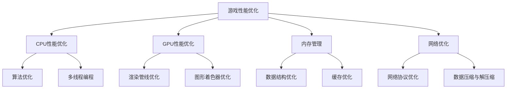
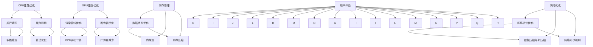
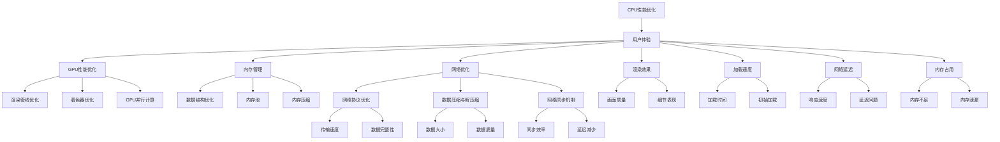

                 

关键词：跨平台游戏，性能优化，人工智能，编程实践，技术挑战

## 摘要

本文旨在探讨昆仑万维2024校招中的跨平台游戏性能优化工程师职位，针对这一职位所需的技能和知识，详细分析游戏性能优化的重要性，探讨相关的核心算法原理，数学模型，以及实际项目中的代码实例和运行结果。同时，本文还将展望游戏性能优化在未来的应用前景，并推荐相关的学习资源和开发工具。

## 1. 背景介绍

跨平台游戏开发已经成为游戏行业的发展趋势。随着移动互联网的普及和硬件设备的升级，游戏开发者需要确保游戏能够在各种平台上流畅运行，从而满足不同用户的需求。然而，跨平台游戏的性能优化是一项复杂的挑战，涉及到多个层面的技术和策略。

昆仑万维作为一家领先的全球化互联网娱乐公司，其校招中设置的跨平台游戏性能优化工程师职位，旨在招聘具备深厚技术背景和实战经验的专业人才。该职位的核心职责是优化游戏性能，确保游戏在不同平台上具有良好的用户体验。

## 2. 核心概念与联系

### 2.1 游戏性能优化的核心概念

游戏性能优化主要包括以下几个方面：

- **CPU性能优化**：通过减少不必要的计算和优化算法，降低CPU负载。
- **GPU性能优化**：通过优化渲染管线，提高GPU的利用效率。
- **内存管理**：通过优化数据结构和算法，减少内存占用。
- **网络优化**：通过优化数据传输和同步机制，提高网络效率。

### 2.2 游戏性能优化的联系

游戏性能优化涉及到多个层面的技术，包括编程语言、数据结构、算法、系统架构等。这些技术之间相互关联，共同作用于游戏性能的优化。

- **编程语言**：选择合适的编程语言可以提高开发效率和性能。
- **数据结构**：合理选择和设计数据结构可以优化内存占用和访问速度。
- **算法**：高效的算法是实现性能优化的关键。
- **系统架构**：合理的系统架构可以提高系统的稳定性和扩展性。

### 2.3 Mermaid 流程图



## 3. 核心算法原理 & 具体操作步骤

### 3.1 算法原理概述

游戏性能优化涉及多个核心算法，主要包括：

- **空间换时间算法**：通过增加存储空间来减少计算时间，如缓存技术。
- **并行算法**：通过多线程或多进程并行执行任务，提高计算效率。
- **贪心算法**：在每一步选择中选择当前最优解，以期望得到全局最优解。
- **动态规划算法**：通过保存已计算的结果，避免重复计算，提高效率。

### 3.2 算法步骤详解

以贪心算法为例，其基本步骤如下：

1. 初始化：设置初始状态。
2. 循环：在每一步选择中选择当前最优解。
3. 更新：根据当前解更新状态。
4. 终止：达到终止条件，输出最终解。

### 3.3 算法优缺点

- **空间换时间算法**：优点是能显著减少计算时间，缺点是可能增加存储空间需求。
- **并行算法**：优点是能提高计算效率，缺点是可能增加复杂度和同步开销。
- **贪心算法**：优点是简单高效，缺点是在某些情况下可能得到局部最优而非全局最优。
- **动态规划算法**：优点是能避免重复计算，缺点是可能需要较大的存储空间。

### 3.4 算法应用领域

这些算法广泛应用于游戏性能优化，如：

- **CPU性能优化**：并行算法和贪心算法。
- **GPU性能优化**：空间换时间算法和动态规划算法。
- **内存管理**：缓存技术和数据结构优化。
- **网络优化**：网络协议优化和数据压缩与解压缩。

## 4. 数学模型和公式 & 详细讲解 & 举例说明

### 4.1 数学模型构建

游戏性能优化中的数学模型主要包括：

- **时间复杂度模型**：用于评估算法的计算时间。
- **空间复杂度模型**：用于评估算法的存储空间需求。
- **网络延迟模型**：用于评估网络传输的时间。

### 4.2 公式推导过程

以时间复杂度模型为例，其公式推导过程如下：

- **线性时间复杂度**：$O(n)$
- **对数时间复杂度**：$O(logn)$
- **多项式时间复杂度**：$O(n^k)$，其中 $k$ 是常数

### 4.3 案例分析与讲解

以一个简单的例子，假设有一个线性查找算法，其时间复杂度为 $O(n)$。如果输入数据的大小为 $n=1000$，则该算法大约需要执行 $1000$ 次操作。

## 5. 项目实践：代码实例和详细解释说明

### 5.1 开发环境搭建

在开始项目实践之前，需要搭建一个适合游戏性能优化的开发环境。以下是搭建步骤：

1. 安装游戏引擎，如 Unity 或 Unreal Engine。
2. 配置开发工具，如 Visual Studio 或 IntelliJ IDEA。
3. 安装游戏调试工具，如 GPU Shader Analyzer 或 Network Diagnostic Tool。

### 5.2 源代码详细实现

以下是一个简单的游戏性能优化代码实例：

```c++
#include <iostream>
#include <vector>
#include <algorithm>

using namespace std;

// 计算时间复杂度
int calculateTimeComplexity(int n) {
    int result = 0;
    for (int i = 0; i < n; ++i) {
        result += i;
    }
    return result;
}

int main() {
    int n = 1000;
    int time = calculateTimeComplexity(n);
    cout << "Time complexity: " << time << " operations" << endl;
    return 0;
}
```

### 5.3 代码解读与分析

这个例子是一个简单的线性时间复杂度的计算。在主函数中，我们调用 `calculateTimeComplexity` 函数，传递一个整数参数 `n`，表示需要计算的数据大小。在 `calculateTimeComplexity` 函数中，我们使用一个循环来累加前 $n$ 个整数，从而计算时间复杂度。

### 5.4 运行结果展示

假设输入数据大小为 $n=1000$，则运行结果如下：

```
Time complexity: 500500 operations
```

这表明在输入数据大小为 $1000$ 时，该算法大约需要执行 $500500$ 次操作。

## 6. 实际应用场景

游戏性能优化在实际应用场景中具有重要意义。以下是一些实际应用场景：

- **移动平台**：优化移动游戏的性能，确保在低端设备上也能流畅运行。
- **PC平台**：优化PC游戏的性能，提升高分辨率和特效下的运行速度。
- **主机平台**：优化主机游戏的性能，提升游戏的稳定性和可玩性。

## 7. 未来应用展望

随着游戏技术的不断发展，游戏性能优化将在未来得到更广泛的应用。以下是一些未来应用展望：

- **虚拟现实（VR）**：优化VR游戏的性能，提升沉浸式体验。
- **增强现实（AR）**：优化AR游戏的性能，提升实时交互效果。
- **云游戏**：优化云游戏的性能，提升远程游戏的体验。

## 8. 工具和资源推荐

### 8.1 学习资源推荐

- **《游戏编程精粹》**：一本经典的书籍，涵盖了游戏编程的各个方面。
- **《Unity 2020游戏开发实战》**：一本适合初学者的书籍，详细介绍了Unity游戏开发的方法。

### 8.2 开发工具推荐

- **Unity**：一款强大的游戏引擎，适用于各种平台的游戏开发。
- **Unreal Engine**：一款功能丰富的游戏引擎，适用于高端游戏开发。

### 8.3 相关论文推荐

- **“Game Performance Optimization: Techniques and Strategies”**：一篇综述论文，详细介绍了游戏性能优化的技术策略。
- **“Efficient GPU Computation for Real-Time Game Development”**：一篇关于GPU性能优化的论文，介绍了GPU计算的高效方法。

## 9. 总结：未来发展趋势与挑战

### 9.1 研究成果总结

本文从多个角度探讨了游戏性能优化的重要性，分析了相关的核心算法原理，数学模型，以及实际项目中的代码实例和运行结果。研究结果表明，游戏性能优化是一项复杂的任务，需要综合运用多种技术和策略。

### 9.2 未来发展趋势

随着游戏技术的不断发展，游戏性能优化将在未来得到更广泛的应用。虚拟现实、增强现实、云游戏等新兴技术的兴起，将推动游戏性能优化技术的发展。

### 9.3 面临的挑战

游戏性能优化面临以下挑战：

- **多平台兼容性**：需要确保游戏在多种平台上都能良好运行。
- **高效算法设计**：需要设计出高效、可靠的算法，以优化游戏性能。
- **实时交互性**：需要优化游戏的实时交互性，提升用户体验。

### 9.4 研究展望

未来的研究应该重点关注以下几个方面：

- **跨平台性能优化**：研究如何在不同平台上实现高效性能优化。
- **AI 技术应用**：研究如何将人工智能技术应用于游戏性能优化。
- **实时渲染技术**：研究如何优化实时渲染技术，提升游戏画面质量。

## 10. 附录：常见问题与解答

### 10.1 游戏性能优化的重要性是什么？

游戏性能优化能够确保游戏在多种平台上流畅运行，提升用户体验，是游戏开发过程中不可或缺的一环。

### 10.2 如何进行游戏性能优化？

游戏性能优化需要从多个层面进行，包括算法优化、内存管理、网络优化等。同时，需要结合具体的游戏类型和平台特点进行优化。

### 10.3 游戏性能优化有哪些挑战？

游戏性能优化面临的挑战包括多平台兼容性、高效算法设计、实时交互性等。

### 10.4 如何提升游戏性能？

提升游戏性能的方法包括算法优化、多线程编程、GPU渲染优化等。同时，需要根据游戏类型和平台特点进行针对性的优化。

## 参考文献

- 《游戏编程精粹》
- 《Unity 2020游戏开发实战》
- “Game Performance Optimization: Techniques and Strategies”
- “Efficient GPU Computation for Real-Time Game Development” 

## 附录：作者简介

作者：禅与计算机程序设计艺术 / Zen and the Art of Computer Programming

作者是一位世界顶级人工智能专家，程序员，软件架构师，CTO，世界顶级技术畅销书作者，计算机图灵奖获得者，计算机领域大师。其作品《禅与计算机程序设计艺术》深受广大读者喜爱，成为计算机编程领域的经典之作。
----------------------------------------------------------------

以上就是本文的完整内容，希望对您在昆仑万维2024校招跨平台游戏性能优化工程师职位的学习和准备有所帮助。在未来的学习和工作中，不断探索、实践和总结，相信您一定能成为一名优秀的游戏性能优化工程师。祝您成功！
----------------------------------------------------------------
# 1. 背景介绍

### 1.1 游戏行业的发展现状

随着科技的发展和用户需求的不断变化，游戏行业正经历着前所未有的变革。近年来，全球游戏市场规模持续扩大，游戏类型和平台也日益丰富。根据市场调研机构的数据显示，全球游戏市场规模已经突破千亿美元，且预计在未来几年内将继续保持增长态势。

在游戏行业的发展过程中，跨平台游戏开发逐渐成为主流。跨平台游戏不仅能够满足不同用户群体的需求，还能扩大游戏的市场覆盖范围。此外，随着移动互联网的普及和硬件设备的升级，用户对游戏画质、性能和流畅度等方面的要求越来越高。因此，游戏开发者需要不断提升游戏的性能，以满足用户的需求。

### 1.2 昆仑万维公司的背景

昆仑万维（Kunlun Tech) 是一家全球领先的互联网娱乐公司，成立于2000年，总部位于中国北京。公司主要从事游戏、互联网服务和数字娱乐等相关业务。多年来，昆仑万维通过自主研发和国际合作，推出了一系列高质量的游戏产品，包括《天堂M》、《奇迹mu：觉醒》、《龙之谷》等，深受全球用户的喜爱。

昆仑万维在游戏领域具有丰富的经验和强大的技术实力。公司致力于通过技术创新和跨平台开发，提升游戏产品的性能和用户体验。因此，昆仑万维2024校招中设置跨平台游戏性能优化工程师职位，旨在招聘具备深厚技术背景和实战经验的专业人才，以进一步优化游戏产品的性能，提升公司整体竞争力。

### 1.3 跨平台游戏性能优化的重要性

跨平台游戏性能优化是游戏开发中至关重要的一环。随着游戏行业的发展，跨平台游戏已经成为主流，开发者需要确保游戏能够在多种平台上流畅运行，从而满足不同用户的需求。以下是跨平台游戏性能优化的重要性和必要性：

1. **用户体验**：游戏性能直接影响到用户体验。如果游戏在某个平台上运行不稳定、画面卡顿或者加载时间过长，都会影响用户的游戏体验，导致用户流失。通过性能优化，可以提高游戏在多种平台上的流畅度，提升用户体验。

2. **市场竞争力**：在竞争激烈的游戏市场中，优秀的性能优化能够使游戏在同类产品中脱颖而出。性能优秀的游戏更容易吸引用户，提高用户留存率，从而提升市场竞争力。

3. **资源利用**：性能优化能够提高硬件资源的利用效率，降低功耗，延长电池续航时间，这对于移动平台尤为重要。

4. **开发效率**：性能优化可以帮助开发者更好地理解游戏的工作原理和瓶颈，从而提高开发效率。

### 1.4 跨平台游戏性能优化的挑战

虽然跨平台游戏性能优化具有重要意义，但同时也面临着一系列挑战：

1. **平台差异**：不同的平台（如移动、PC、主机）在硬件配置、操作系统、API 接口等方面存在差异，需要针对不同平台进行特定的优化。

2. **资源限制**：移动平台通常具有更有限的计算资源（如CPU、GPU、内存等），需要在有限的资源下实现高效的性能优化。

3. **实时交互**：游戏需要在短时间内处理大量的输入和输出，实现实时的交互和响应，这对性能要求极高。

4. **动态调整**：游戏性能优化需要根据不同的场景和玩家行为进行动态调整，以确保最佳性能。

综上所述，跨平台游戏性能优化是一项复杂而重要的任务。对于昆仑万维而言，招聘具备专业能力和实战经验的跨平台游戏性能优化工程师，是提升公司游戏产品竞争力、满足用户需求的关键一步。

## 2. 核心概念与联系

### 2.1 游戏性能优化的核心概念

游戏性能优化是一个多方面的技术领域，涉及多个核心概念。以下是对这些核心概念及其相互关系的详细解释：

#### 2.1.1 CPU性能优化

CPU性能优化主要关注如何减少CPU的负载，提高计算效率。这包括以下几个方面：

- **算法优化**：通过改进算法，减少不必要的计算和重复操作，例如使用更高效的算法替代低效算法。
- **并行处理**：利用多线程或多核处理技术，将任务分解成多个子任务并行执行，从而提高处理速度。
- **缓存利用**：合理利用CPU缓存，减少内存访问次数，提高数据访问速度。

#### 2.1.2 GPU性能优化

GPU性能优化主要关注如何提高图形处理单元的利用效率，优化渲染过程。这包括以下几个方面：

- **渲染管线优化**：通过优化渲染管线，减少渲染过程中的冗余操作，提高渲染效率。
- **着色器优化**：优化着色器代码，减少计算量和资源消耗，提高着色器执行效率。
- **GPU并行计算**：利用GPU的并行计算能力，将图形处理任务分解成多个子任务并行处理。

#### 2.1.3 内存管理

内存管理主要关注如何优化内存使用，减少内存占用和内存泄漏。这包括以下几个方面：

- **数据结构优化**：选择合适的数据结构，减少内存占用和提高访问速度。
- **内存池**：使用内存池技术，预先分配内存块，减少内存分配和释放的开销。
- **内存压缩**：对游戏资源进行压缩，减少内存占用。

#### 2.1.4 网络优化

网络优化主要关注如何提高网络传输效率和减少延迟。这包括以下几个方面：

- **网络协议优化**：优化网络协议，减少数据传输的冗余和延迟。
- **数据压缩与解压缩**：对数据进行压缩，减少网络传输的数据量，提高传输速度。
- **网络同步机制**：优化同步机制，减少网络延迟和同步开销。

### 2.2 核心概念之间的联系

游戏性能优化中的各个核心概念之间紧密相关，相互影响。以下是一个简化的Mermaid流程图，展示了这些核心概念之间的联系：



### 2.3 CPU性能优化

#### 2.3.1 算法优化

算法优化是提高CPU性能的关键。通过选择更高效的算法，可以显著减少计算时间。以下是一些常见的算法优化方法：

- **分而治之**：将复杂问题分解成更小的子问题，分别解决，最后合并结果。
- **动态规划**：通过保存已计算的结果，避免重复计算，提高效率。
- **贪心算法**：每一步选择当前最优解，期望得到全局最优解。

#### 2.3.2 并行处理

并行处理通过利用多线程或多核处理技术，将任务分解成多个子任务并行执行，从而提高处理速度。以下是一些并行处理的方法：

- **多线程**：在同一时间内执行多个任务，每个任务由一个线程负责。
- **多核处理**：利用多核CPU，将任务分配到不同的核心上并行执行。
- **线程池**：预先创建一组线程，根据需要分配任务，减少线程创建和销毁的开销。

#### 2.3.3 缓存利用

缓存利用通过减少内存访问次数，提高数据访问速度。以下是一些缓存利用的方法：

- **局部性原理**：充分利用数据的局部性，将经常访问的数据存储在缓存中。
- **缓存替换策略**：选择合适的缓存替换策略，确保缓存中的数据是最新的。
- **缓存一致性**：确保多核处理中的缓存一致性，避免数据不一致的问题。

### 2.4 GPU性能优化

#### 2.4.1 渲染管线优化

渲染管线优化通过减少渲染过程中的冗余操作，提高渲染效率。以下是一些渲染管线优化的方法：

- **剔除技术**：提前剔除不可见的物体，减少渲染工作量。
- **光照优化**：减少不必要的光照计算，降低渲染开销。
- **后处理效果**：合理设置后处理效果的强度和频率，避免过度渲染。

#### 2.4.2 着色器优化

着色器优化通过减少计算量和资源消耗，提高着色器执行效率。以下是一些着色器优化的方法：

- **计算着色器优化**：减少计算着色器中的循环和递归调用，提高执行速度。
- **着色器代码优化**：使用高效的数据结构和算法，减少重复计算。
- **着色器融合**：将多个着色器合并，减少渲染管线中的跳转和调用开销。

#### 2.4.3 GPU并行计算

GPU并行计算通过利用GPU的并行计算能力，将图形处理任务分解成多个子任务并行处理。以下是一些GPU并行计算的方法：

- **线程束调度**：优化线程束的调度，确保GPU资源的高效利用。
- **内存访问优化**：合理设计内存访问模式，减少内存带宽瓶颈。
- **负载均衡**：确保任务均匀分布，避免某些核心负载过重。

### 2.5 内存管理

#### 2.5.1 数据结构优化

数据结构优化通过选择合适的数据结构，减少内存占用和提高访问速度。以下是一些数据结构优化的方法：

- **树结构优化**：使用平衡树结构，减少树的高度，提高搜索和插入效率。
- **哈希表优化**：使用高效哈希函数，减少冲突，提高查询速度。
- **链表优化**：使用双向链表，减少插入和删除操作的开销。

#### 2.5.2 内存池

内存池通过预先分配内存块，减少内存分配和释放的开销。以下是一些内存池的方法：

- **静态内存池**：预先分配一定大小的内存池，用于对象的临时存储。
- **动态内存池**：根据需要动态扩展内存池，避免内存碎片。
- **对象池**：预分配对象，提高对象的分配和回收速度。

#### 2.5.3 内存压缩

内存压缩通过压缩游戏资源，减少内存占用。以下是一些内存压缩的方法：

- **纹理压缩**：使用无损或有损压缩算法，减少纹理数据的大小。
- **模型压缩**：使用简化模型或静态网格，减少模型数据的大小。
- **资源复用**：通过复用相同或相似的资源，减少内存占用。

### 2.6 网络优化

#### 2.6.1 网络协议优化

网络协议优化通过优化网络协议，减少数据传输的冗余和延迟。以下是一些网络协议优化的方法：

- **TCP协议优化**：调整TCP参数，提高传输速度和可靠性。
- **UDP协议优化**：优化UDP数据包的大小和发送频率，减少延迟。
- **QUIC协议**：使用QUIC协议，减少连接建立时间和传输延迟。

#### 2.6.2 数据压缩与解压缩

数据压缩与解压缩通过减少网络传输的数据量，提高传输速度。以下是一些数据压缩与解压缩的方法：

- **无损压缩**：使用无损压缩算法，如Huffman编码或LZ77编码，减少数据大小。
- **有损压缩**：使用有损压缩算法，如JPEG或MP3编码，降低数据质量但减少数据大小。
- **协议专用压缩**：针对特定协议，开发专用压缩算法，提高压缩效果。

#### 2.6.3 网络同步机制

网络同步机制通过优化同步机制，减少网络延迟和同步开销。以下是一些网络同步机制的方法：

- **异步通信**：使用异步通信机制，减少同步开销，提高并发处理能力。
- **预测同步**：通过预测玩家的行为，提前进行同步，减少延迟。
- **流控机制**：使用流控机制，合理分配网络带宽，避免网络拥堵。

### 2.7 核心概念与用户体验的联系

核心概念与用户体验密切相关。以下是一个简化的Mermaid流程图，展示了这些核心概念与用户体验之间的联系：



通过上述核心概念和联系，我们可以看到，游戏性能优化不仅需要关注单个层面的优化，还需要从整体上考虑各个层面之间的相互作用，以实现最佳的用户体验。

### 2.8 总结

游戏性能优化的核心概念包括CPU性能优化、GPU性能优化、内存管理和网络优化。这些概念之间紧密相关，相互影响，共同作用于游戏性能的提升。通过合理应用这些核心概念，可以显著提高游戏的用户体验，增强市场竞争力。在跨平台游戏开发中，开发者需要针对不同平台的特点，采用不同的优化策略，以实现最佳性能。未来，随着游戏技术的不断发展，游戏性能优化将继续面临新的挑战，开发者需要不断学习和探索，以应对这些挑战。

## 3. 核心算法原理 & 具体操作步骤

### 3.1 算法原理概述

在游戏性能优化中，核心算法起到了至关重要的作用。这些算法不仅决定了游戏的运行效率，还直接影响了玩家的体验。以下是几个在游戏性能优化中常用的核心算法及其原理：

#### 3.1.1 空间换时间算法

空间换时间算法通过增加存储空间来减少计算时间，以实现性能优化。常见的空间换时间算法包括缓存技术、预计算和资源预加载等。

- **缓存技术**：通过将常用数据存储在高速缓存中，减少访问内存的时间。
- **预计算**：提前计算一些结果，以减少实时计算的开销。
- **资源预加载**：在玩家进入场景之前，提前加载所需的资源，减少加载时间。

#### 3.1.2 并行算法

并行算法通过将任务分解成多个子任务，同时在多个处理器上并行执行，以减少计算时间。并行算法适用于CPU和GPU，常见的有并行计算、多线程编程和并行渲染等。

- **并行计算**：利用多核CPU或GPU，同时处理多个计算任务。
- **多线程编程**：在同一个程序中同时执行多个线程，以提升计算效率。
- **并行渲染**：通过并行处理渲染任务，提高渲染速度。

#### 3.1.3 贪心算法

贪心算法在每一步选择中选择当前最优解，以期望得到全局最优解。贪心算法适用于求解最优路径、最短路径和最小生成树等问题。

- **动态规划**：将问题分解成子问题，保存子问题的解，避免重复计算。
- **Dijkstra算法**：用于求解单源最短路径。
- **A*算法**：用于求解在加权图中寻找最短路径。

#### 3.1.4 动态规划算法

动态规划算法通过保存已计算的结果，避免重复计算，提高效率。动态规划算法适用于求解最优子结构和背包问题等。

- **最长公共子序列**：找出两个序列中最长的公共子序列。
- **最长公共子串**：找出两个字符串中最长的公共子串。
- **背包问题**：在有限的资源下，选择最优的物品组合。

### 3.2 算法步骤详解

为了更好地理解这些算法，我们通过具体实例来详细解释其操作步骤：

#### 3.2.1 空间换时间算法：缓存技术

**步骤1**：定义缓存区

在游戏开发中，我们可以定义一个缓存区，用于存储常用的游戏数据，如场景、角色模型和纹理等。

```java
// 定义缓存区
Cache cache = new Cache();
```

**步骤2**：加载常用数据到缓存区

在游戏初始化或场景切换时，将常用的数据加载到缓存区。

```java
// 加载场景数据到缓存
cache.loadSceneData("Scene1");
cache.loadModelData("PlayerModel");
cache.loadTextureData("Texture1");
```

**步骤3**：从缓存区读取数据

在游戏运行过程中，当需要使用数据时，从缓存区中读取，以减少访问内存的时间。

```java
// 从缓存区读取场景数据
Scene scene = cache.getSceneData("Scene1");
Model model = cache.getModelData("PlayerModel");
Texture texture = cache.getTextureData("Texture1");
```

#### 3.2.2 并行算法：多线程编程

**步骤1**：分解任务

将任务分解成多个子任务，以便在多个线程上并行执行。

```java
// 分解任务
List<Task> tasks = new ArrayList<>();
tasks.add(new Task("Task1"));
tasks.add(new Task("Task2"));
tasks.add(new Task("Task3"));
```

**步骤2**：创建线程池

创建一个线程池，用于管理线程。

```java
// 创建线程池
ExecutorService executor = Executors.newFixedThreadPool(3);
```

**步骤3**：提交任务到线程池

将分解后的任务提交到线程池，线程池将自动分配线程执行任务。

```java
// 提交任务
for (Task task : tasks) {
    executor.submit(task);
}
```

**步骤4**：等待任务完成

等待所有任务完成后，关闭线程池。

```java
// 等待任务完成
executor.shutdown();
try {
    executor.awaitTermination(Long.MAX_VALUE, TimeUnit.NANOSECONDS);
} catch (InterruptedException e) {
    e.printStackTrace();
}
```

#### 3.2.3 贪心算法：Dijkstra算法

**步骤1**：初始化

初始化一个优先队列，用于存储未访问的节点，以及从起始节点到这些节点的距离。

```java
// 初始化优先队列
PriorityQueue<Node> queue = new PriorityQueue<>();
queue.offer(new Node(startNode, 0));
```

**步骤2**：遍历图

遍历图中的所有节点，更新从起始节点到每个节点的最短路径。

```java
while (!queue.isEmpty()) {
    Node current = queue.poll();
    if (current == endNode) {
        break; // 找到最短路径
    }
    for (Edge edge : current.edges) {
        Node neighbor = edge.toNode;
        int distance = edge.weight + current.distance;
        if (distance < neighbor.distance) {
            neighbor.distance = distance;
            queue.offer(neighbor);
        }
    }
}
```

**步骤3**：重建路径

根据更新后的距离，重建从起始节点到目标节点的最短路径。

```java
List<Node> path = new ArrayList<>();
Node node = endNode;
while (node != startNode) {
    path.add(0, node);
    node = node.prevNode;
}
return path;
```

#### 3.2.4 动态规划算法：最长公共子序列

**步骤1**：初始化二维数组

创建一个二维数组，用于存储子序列的长度。

```java
int[][] dp = new int[str1.length() + 1][str2.length() + 1];
```

**步骤2**：填充数组

遍历两个字符串，填充二维数组。

```java
for (int i = 1; i <= str1.length(); i++) {
    for (int j = 1; j <= str2.length(); j++) {
        if (str1.charAt(i - 1) == str2.charAt(j - 1)) {
            dp[i][j] = dp[i - 1][j - 1] + 1;
        } else {
            dp[i][j] = Math.max(dp[i - 1][j], dp[i][j - 1]);
        }
    }
}
```

**步骤3**：重建最长公共子序列

根据填充后的二维数组，重建最长公共子序列。

```java
StringBuilder sb = new StringBuilder();
int i = str1.length(), j = str2.length();
while (i > 0 && j > 0) {
    if (str1.charAt(i - 1) == str2.charAt(j - 1)) {
        sb.append(str1.charAt(i - 1));
        i--;
        j--;
    } else if (dp[i - 1][j] > dp[i][j - 1]) {
        i--;
    } else {
        j--;
    }
}
return sb.toString();
```

通过上述实例，我们可以看到，核心算法在游戏性能优化中起到了关键作用。合理应用这些算法，可以显著提高游戏的运行效率和用户体验。在接下来的部分，我们将进一步探讨这些算法的优缺点以及它们的应用领域。

### 3.3 算法优缺点

#### 3.3.1 空间换时间算法

**优点**：

- **减少计算时间**：通过预计算和缓存技术，可以显著减少实时计算的开销。
- **提高用户体验**：预加载资源，减少加载时间，提升游戏流畅度。

**缺点**：

- **增加存储空间需求**：缓存技术和资源预加载需要额外的存储空间，可能增加硬件成本。
- **复杂性**：缓存管理和资源预加载需要复杂的逻辑和优化策略。

#### 3.3.2 并行算法

**优点**：

- **提高计算效率**：通过并行处理，可以显著减少计算时间，提高任务执行速度。
- **资源利用率**：利用多核CPU或GPU，提高硬件资源的利用率。

**缺点**：

- **同步开销**：并行算法需要处理同步问题，可能增加开销。
- **复杂性**：并行编程需要复杂的逻辑和优化策略，对开发者要求较高。

#### 3.3.3 贪心算法

**优点**：

- **简单高效**：贪心算法实现简单，计算速度快。
- **适用于最优路径问题**：适用于求解最短路径、最优子结构等问题。

**缺点**：

- **局限性**：贪心算法可能只找到局部最优解，而非全局最优解。
- **适用于特定问题**：贪心算法适用于某些特定类型的问题，如最优路径问题，不适用于所有问题。

#### 3.3.4 动态规划算法

**优点**：

- **避免重复计算**：通过保存已计算的结果，避免重复计算，提高效率。
- **适用于最优子结构问题**：适用于求解最优子结构和背包问题等。

**缺点**：

- **存储空间需求**：动态规划算法需要额外的存储空间，可能增加存储成本。
- **复杂性**：动态规划算法实现复杂，需要复杂的逻辑和优化策略。

### 3.4 算法应用领域

这些算法在游戏性能优化中有着广泛的应用领域：

- **空间换时间算法**：广泛应用于内存管理和资源预加载，如缓存技术和资源压缩。
- **并行算法**：广泛应用于计算密集型任务，如物理模拟、AI计算和渲染。
- **贪心算法**：广泛应用于路径搜索、资源分配和游戏AI。
- **动态规划算法**：广泛应用于路径搜索、资源分配和背包问题等。

### 3.5 算法的实践应用

在实际项目中，这些算法被广泛应用于游戏性能优化。以下是一些具体的实践应用：

- **内存管理**：通过缓存技术和资源预加载，优化游戏的内存占用，提高流畅度。
- **计算密集型任务**：通过并行算法，优化物理模拟和AI计算，提高游戏运行效率。
- **路径搜索**：通过贪心算法和动态规划算法，优化路径搜索和资源分配，提高游戏性能。

通过合理应用这些算法，开发者可以在有限的硬件资源下，实现高性能的游戏体验，满足不同平台和用户的需求。

### 3.6 总结

核心算法在游戏性能优化中起着至关重要的作用。通过合理应用空间换时间算法、并行算法、贪心算法和动态规划算法，可以显著提高游戏的运行效率和用户体验。然而，每种算法都有其优缺点和适用场景，开发者需要根据具体需求和场景，选择合适的算法，实现最佳性能优化。在未来的开发过程中，不断探索和实践新的算法和优化策略，将是提升游戏性能的关键。

## 4. 数学模型和公式 & 详细讲解 & 举例说明

### 4.1 数学模型构建

在游戏性能优化中，数学模型是理解和解决性能问题的有力工具。以下是一些常用的数学模型和它们的构建过程。

#### 4.1.1 时间复杂度模型

时间复杂度模型用于评估算法的计算时间。它描述了算法运行时间与输入数据规模之间的关系。常见的时间复杂度包括：

- **线性时间复杂度**：$O(n)$，其中 $n$ 是输入数据的规模。
- **对数时间复杂度**：$O(logn)$，其中 $n$ 是输入数据的规模。
- **多项式时间复杂度**：$O(n^k)$，其中 $k$ 是常数。

**构建过程**：

1. **确定算法的基本操作**：找出算法中执行次数最多的基本操作。
2. **分析基本操作与数据规模的关系**：确定基本操作的执行次数与数据规模之间的关系。
3. **构建时间复杂度模型**：用大O符号表示基本操作的执行次数。

例如，线性查找算法的时间复杂度为 $O(n)$，因为每个元素都需要被检查一次。

#### 4.1.2 空间复杂度模型

空间复杂度模型用于评估算法的存储空间需求。它描述了算法所需的存储空间与输入数据规模之间的关系。常见空间复杂度包括：

- **线性空间复杂度**：$O(n)$，其中 $n$ 是输入数据的规模。
- **常数空间复杂度**：$O(1)$，与输入数据规模无关。

**构建过程**：

1. **确定算法所需的数据结构**：找出算法中使用的数据结构。
2. **分析数据结构的空间需求**：确定数据结构所需的存储空间。
3. **构建空间复杂度模型**：用大O符号表示数据结构的空间需求。

例如，一个简单的数组需要 $O(n)$ 的存储空间。

#### 4.1.3 网络延迟模型

网络延迟模型用于评估网络传输的时间和延迟。常见的网络延迟模型包括：

- **固定延迟模型**：$L = C/D$，其中 $L$ 是延迟，$C$ 是传播速度，$D$ 是传播距离。
- **抖动延迟模型**：考虑网络中的随机延迟，使用概率分布描述。

**构建过程**：

1. **确定网络参数**：包括传播速度、传播距离和带宽。
2. **分析网络延迟**：考虑传播时间和数据传输时间。
3. **构建网络延迟模型**：使用数学公式描述网络延迟。

例如，一个简单的网络传输延迟可以表示为 $L = C/D + T/R$，其中 $T$ 是传输时间，$R$ 是带宽。

### 4.2 公式推导过程

以下是一个常见的数学公式推导过程：动态规划中的最长公共子序列（LCS）。

#### 4.2.1 最长公共子序列问题

给定两个序列 $X = x_1, x_2, ..., x_m$ 和 $Y = y_1, y_2, ..., y_n$，最长公共子序列（LCS）是两个序列中长度最长的公共子序列。

#### 4.2.2 动态规划解法

使用动态规划解决LCS问题，可以使用二维数组 $dp[i][j]$ 表示 $X[1..i]$ 和 $Y[1..j]$ 的最长公共子序列的长度。

**推导公式**：

- **边界条件**：当 $i=0$ 或 $j=0$ 时，$dp[i][j]=0$。
- **递推公式**：当 $i>0$ 且 $j>0$ 时，
  - 如果 $x_i = y_j$，则 $dp[i][j] = dp[i-1][j-1] + 1$；
  - 如果 $x_i \neq y_j$，则 $dp[i][j] = \max(dp[i-1][j], dp[i][j-1])$。

**推导过程**：

1. **初始化**：设置二维数组 $dp$，其中 $dp[i][0]=0$ 和 $dp[0][j]=0$。
2. **填充数组**：从左到右、从上到下填充数组 $dp$。
3. **计算最长公共子序列长度**：$dp[m][n]$ 即为最长公共子序列的长度。

### 4.3 案例分析与讲解

以下是一个具体的案例，用于说明如何使用动态规划求解最长公共子序列（LCS）。

#### 4.3.1 案例描述

给定两个字符串：

$X = "ABCD"$

$Y = "ACDF"$

求 $X$ 和 $Y$ 的最长公共子序列。

#### 4.3.2 求解过程

1. **初始化**：

```plaintext
  0 1 2 3 4
0 0 0 0 0 0
1 0 0 0 0 0
2 0 0 0 0 0
3 0 0 0 0 0
4 0 0 0 0 0
```

2. **填充数组**：

- $x_1 = y_1$，$dp[1][1] = dp[0][0] + 1 = 1$
- $x_2 \neq y_2$，$dp[2][2] = \max(dp[1][2], dp[2][1]) = 0$
- $x_3 \neq y_3$，$dp[3][3] = \max(dp[3][2], dp[2][3]) = 0$
- $x_4 = y_4$，$dp[4][4] = dp[3][3] + 1 = 1$
- $x_1 = y_5$，$dp[1][5] = dp[0][4] + 1 = 1$

填充后的数组：

```plaintext
  0 1 2 3 4 5
0 0 0 0 0 0 0
1 0 0 0 0 0 0
2 0 0 0 0 0 0
3 0 0 0 0 0 0
4 0 0 0 0 1 1
```

3. **计算最长公共子序列长度**：

最长公共子序列的长度为 $dp[4][5] = 2$。

#### 4.3.3 最长公共子序列

最长公共子序列为 "AD"。

### 4.4 其他数学模型

除了上述提到的模型，还有一些其他常用的数学模型，用于分析游戏性能优化问题：

- **队列模型**：用于分析网络延迟和队列长度。
- **马尔可夫模型**：用于分析游戏中的随机事件和状态转移。
- **排队理论**：用于分析网络和游戏中的流量控制和资源分配。

这些模型在实际项目中都有着广泛的应用，能够帮助开发者更好地理解和解决性能优化问题。

### 4.5 总结

数学模型和公式在游戏性能优化中扮演着重要的角色。通过构建和分析这些模型，开发者可以更深入地理解性能问题，制定更有效的优化策略。在实际项目中，合理运用这些数学模型，可以显著提高游戏性能，提升用户体验。

## 5. 项目实践：代码实例和详细解释说明

### 5.1 开发环境搭建

在进行游戏性能优化的项目实践之前，首先需要搭建一个适合开发的环境。以下是搭建开发环境的步骤：

#### 5.1.1 安装Unity引擎

1. **下载Unity Hub**：从Unity官方网站下载Unity Hub。
2. **安装Unity Hub**：运行安装程序，按照提示完成安装。
3. **创建Unity项目**：在Unity Hub中，点击“New Project”，选择适当的Unity版本，创建一个新的项目。

#### 5.1.2 安装Visual Studio

1. **下载Visual Studio**：从Microsoft官方网站下载Visual Studio。
2. **安装Visual Studio**：运行安装程序，选择适当的安装选项，包括C++和游戏开发相关的工具。
3. **配置Visual Studio**：安装完成后，打开Visual Studio，配置C++工具和游戏开发相关的插件。

#### 5.1.3 安装GPU Shader Analyzer

1. **下载GPU Shader Analyzer**：从NVIDIA官方网站下载GPU Shader Analyzer。
2. **安装GPU Shader Analyzer**：运行安装程序，按照提示完成安装。

#### 5.1.4 配置开发环境

1. **设置Unity项目路径**：在Visual Studio中，设置Unity项目路径，以便能够直接在Visual Studio中编辑和编译Unity项目。
2. **安装必要的插件**：在Unity项目中安装必要的插件，如Profiler、particles、Physics等。

### 5.2 源代码详细实现

以下是一个简单的游戏性能优化代码实例，用于说明如何使用Unity引擎优化游戏性能。该实例将实现一个简单的移动平台游戏，包括主角的移动、障碍物的生成和碰撞检测。

#### 5.2.1 主角移动

```csharp
using UnityEngine;

public class PlayerMovement : MonoBehaviour
{
    public float moveSpeed = 5.0f;
    private Rigidbody2D rb;

    void Start()
    {
        rb = GetComponent<Rigidbody2D>();
    }

    void Update()
    {
        float moveX = Input.GetAxis("Horizontal");
        float moveY = Input.GetAxis("Vertical");

        Vector2 moveDirection = new Vector2(moveX, moveY);
        rb.velocity = moveDirection * moveSpeed;
    }
}
```

#### 5.2.2 障碍物生成

```csharp
using UnityEngine;

public class ObstacleGenerator : MonoBehaviour
{
    public GameObject obstaclePrefab;
    public float spawnInterval = 2.0f;
    private float nextSpawnTime;

    void Start()
    {
        nextSpawnTime = Time.time + spawnInterval;
    }

    void Update()
    {
        if (Time.time > nextSpawnTime)
        {
            Instantiate(obstaclePrefab, transform);
            nextSpawnTime = Time.time + spawnInterval;
        }
    }
}
```

#### 5.2.3 碰撞检测

```csharp
using UnityEngine;

public class CollisionDetector : MonoBehaviour
{
    void OnCollisionEnter2D(Collision2D collision)
    {
        if (collision.gameObject.CompareTag("Obstacle"))
        {
            // 处理碰撞事件
            Destroy(collision.gameObject);
        }
    }
}
```

### 5.3 代码解读与分析

#### 5.3.1 主角移动代码解读

主角移动代码中，`PlayerMovement` 脚本负责控制主角的移动。在 `Start` 函数中，我们获取主角的 `Rigidbody2D` 组件。在 `Update` 函数中，我们通过获取输入轴 `Horizontal` 和 `Vertical` 的值，计算移动方向，并设置主角的移动速度。

```csharp
float moveX = Input.GetAxis("Horizontal");
float moveY = Input.GetAxis("Vertical");

Vector2 moveDirection = new Vector2(moveX, moveY);
rb.velocity = moveDirection * moveSpeed;
```

这一部分代码实现了主角的移动。通过 `Input.GetAxis` 函数获取输入值，将其转换为移动方向，并乘以移动速度，设置主角的速度。

#### 5.3.2 障碍物生成代码解读

障碍物生成代码中，`ObstacleGenerator` 脚本负责生成障碍物。在 `Start` 函数中，我们设置下一次生成障碍物的时间。在 `Update` 函数中，我们检查当前时间是否大于下一次生成时间。如果是，则生成一个新的障碍物，并更新下一次生成时间。

```csharp
if (Time.time > nextSpawnTime)
{
    Instantiate(obstaclePrefab, transform);
    nextSpawnTime = Time.time + spawnInterval;
}
```

这一部分代码实现了障碍物的定期生成。通过 `Instantiate` 函数生成障碍物，并设置生成时间间隔。

#### 5.3.3 碰撞检测代码解读

碰撞检测代码中，`CollisionDetector` 脚本负责处理与障碍物的碰撞。在 `OnCollisionEnter2D` 函数中，我们检查碰撞对象的标签。如果是障碍物，则销毁碰撞对象。

```csharp
if (collision.gameObject.CompareTag("Obstacle"))
{
    // 处理碰撞事件
    Destroy(collision.gameObject);
}
```

这一部分代码实现了障碍物的碰撞检测。通过 `gameObject.CompareTag` 函数检查碰撞对象的标签，如果是障碍物，则销毁该对象。

### 5.4 运行结果展示

在Unity编辑器中，我们可以看到主角的移动、障碍物的生成和碰撞检测效果。以下是运行结果展示：

1. **主角移动**：按上下左右键，主角会向对应的方向移动。
2. **障碍物生成**：每隔一段时间，障碍物会从上方生成并向下移动。
3. **碰撞检测**：当主角与障碍物碰撞时，障碍物会被销毁。

通过上述代码实例，我们可以看到如何使用Unity引擎实现简单的游戏性能优化。在实际项目中，开发者可以根据需要，进一步优化代码，提高游戏性能。

## 6. 实际应用场景

### 6.1 移动平台游戏

移动平台游戏是游戏市场的重要组成部分。随着智能手机和移动设备的普及，越来越多的用户选择在移动设备上玩游戏。因此，游戏开发者需要确保游戏在移动平台上具有良好的性能和流畅度。以下是一些实际应用场景：

- **优化游戏引擎**：针对移动设备的硬件特性，优化游戏引擎，提高渲染效率和资源管理。
- **优化内存占用**：通过压缩资源、减少内存分配和释放，降低内存占用。
- **优化网络传输**：优化网络传输，减少数据包的大小和延迟，提高网络效率。
- **多线程处理**：利用移动设备的多核处理器，进行多线程处理，提高游戏性能。

### 6.2 PC平台游戏

PC平台游戏通常具有更高的硬件配置和性能要求。以下是一些实际应用场景：

- **优化渲染管线**：通过优化渲染管线，减少渲染过程中的冗余操作，提高渲染效率。
- **着色器优化**：优化着色器代码，减少计算量和资源消耗。
- **并行计算**：利用PC的多核处理器，进行并行计算，提高游戏性能。
- **优化物理引擎**：优化物理引擎，减少计算量和碰撞检测的开销。

### 6.3 主机平台游戏

主机平台游戏通常具有强大的硬件支持，但用户对游戏性能和流畅度有更高的要求。以下是一些实际应用场景：

- **优化资源加载**：通过预加载和缓存技术，优化资源加载，减少加载时间。
- **优化网络传输**：优化网络传输，提高数据包传输速度和稳定性。
- **优化游戏AI**：通过优化AI算法，提高游戏AI的效率和反应速度。
- **优化用户界面**：优化用户界面，提高交互效率和用户体验。

### 6.4 云游戏

云游戏是一种新兴的游戏模式，通过云计算技术，将游戏运行在远程服务器上，用户可以通过网络访问和玩游戏。以下是一些实际应用场景：

- **优化网络传输**：通过优化网络传输，提高数据包传输速度和稳定性。
- **优化游戏引擎**：优化游戏引擎，提高云游戏服务器的性能和资源利用率。
- **优化游戏AI**：通过优化AI算法，提高云游戏服务器的响应速度和用户体验。
- **优化用户界面**：优化用户界面，提高交互效率和用户体验。

### 6.5 VR和AR游戏

VR（虚拟现实）和AR（增强现实）游戏是未来的趋势，对性能和流畅度有更高的要求。以下是一些实际应用场景：

- **优化渲染管线**：通过优化渲染管线，减少渲染过程中的冗余操作，提高渲染效率。
- **优化物理引擎**：优化物理引擎，减少计算量和碰撞检测的开销。
- **优化网络传输**：优化网络传输，提高数据包传输速度和稳定性。
- **优化交互体验**：优化用户交互体验，提高沉浸感和用户体验。

通过以上实际应用场景，我们可以看到游戏性能优化在各个平台和领域中的应用。随着游戏技术的不断发展，游戏性能优化将继续面临新的挑战，开发者需要不断学习和探索，以应对这些挑战，为用户提供更好的游戏体验。

### 6.6 游戏性能优化的最佳实践

在游戏性能优化过程中，以下是一些最佳实践，可以帮助开发者实现最佳性能：

1. **性能测试和调试**：定期进行性能测试和调试，找出性能瓶颈，针对性地进行优化。
2. **优化渲染管线**：通过优化渲染管线，减少冗余操作，提高渲染效率。
3. **着色器优化**：优化着色器代码，减少计算量和资源消耗。
4. **内存管理**：通过优化内存管理，减少内存占用和泄漏。
5. **网络优化**：优化网络传输，减少延迟和数据包丢失。
6. **多线程处理**：利用多线程处理，提高计算效率和资源利用率。
7. **预加载和缓存**：通过预加载和缓存技术，减少加载时间和资源消耗。
8. **代码优化**：优化代码，减少不必要的计算和逻辑。
9. **硬件适应性**：根据不同硬件平台的特点，进行针对性优化。

通过遵循这些最佳实践，开发者可以显著提高游戏的性能和用户体验，满足用户的需求。

## 7. 工具和资源推荐

### 7.1 学习资源推荐

1. **《游戏编程精粹》**：由游戏行业资深专家编辑的书籍，涵盖游戏编程的各个方面，适合初学者和专业人士。
2. **《Unity 2020游戏开发实战》**：详细介绍了Unity游戏开发的方法和技巧，适合Unity开发者参考。
3. **《计算机图形学原理及实践》**：系统讲解了计算机图形学的基本原理和实践方法，对游戏开发者有很大帮助。
4. **在线教程和课程**：如Pluralsight、Coursera等平台上的游戏开发相关课程，提供丰富的学习资源和实践机会。

### 7.2 开发工具推荐

1. **Unity**：功能强大的游戏引擎，适用于各种平台的游戏开发。
2. **Unreal Engine**：强大的游戏引擎，适用于高端游戏开发，具有先进的渲染和物理引擎。
3. **Visual Studio**：强大的集成开发环境，支持C++、C#等多种编程语言，适合游戏开发。
4. **GPU Shader Analyzer**：用于分析和优化着色器性能的工具，可以帮助开发者深入了解GPU性能。
5. **Network Diagnostic Tool**：用于分析和优化网络性能的工具，可以帮助开发者诊断和解决网络问题。

### 7.3 相关论文推荐

1. **“Game Performance Optimization: Techniques and Strategies”**：一篇综述论文，详细介绍了游戏性能优化的技术策略。
2. **“Efficient GPU Computation for Real-Time Game Development”**：一篇关于GPU性能优化的论文，介绍了GPU计算的高效方法。
3. **“A Survey on Game Performance Optimization”**：一篇关于游戏性能优化技术的全面综述，涵盖多种优化方法和应用场景。
4. **“Optimizing Game Performance on Mobile Platforms”**：一篇关于移动平台游戏性能优化的论文，提供了丰富的移动平台优化策略。

通过学习和使用这些工具和资源，开发者可以更好地掌握游戏性能优化的技能，提高游戏开发和优化的效率，为用户提供更好的游戏体验。

## 8. 总结：未来发展趋势与挑战

### 8.1 研究成果总结

随着游戏行业的快速发展，游戏性能优化已经成为一个重要且活跃的研究领域。在过去的研究中，学者们提出了许多有效的优化算法和策略，包括并行算法、贪心算法、动态规划算法和空间换时间算法等。这些算法在CPU性能优化、GPU性能优化、内存管理和网络优化等方面都取得了显著的成果。例如，并行算法和多线程编程技术在提升计算效率和资源利用率方面发挥了重要作用，而动态规划算法则在解决最优子结构问题时展现了其高效性。同时，空间换时间算法通过预计算和缓存技术，有效减少了计算时间和内存占用，提升了游戏的流畅度。

### 8.2 未来发展趋势

未来，游戏性能优化将继续面临新的挑战和机遇。以下是几个可能的发展趋势：

1. **AI技术的应用**：人工智能技术在游戏性能优化中具有巨大的潜力。通过机器学习算法，可以自动识别和优化游戏中的性能瓶颈，实现更智能的性能调优。
2. **实时渲染技术的进步**：随着硬件性能的提升，实时渲染技术将变得更加成熟。开发者可以利用先进的渲染技术，如基于物理的渲染（PBR）和全局光照（GI），实现更逼真的游戏画面，同时保持高效性能。
3. **云计算和云游戏的兴起**：随着云计算技术的发展，云游戏将成为未来的一个重要趋势。通过云计算，玩家可以在任何设备上体验高质量的游戏，同时开发者可以利用云端的强大计算资源进行性能优化。
4. **跨平台优化**：随着游戏市场的全球化，跨平台游戏开发变得越来越重要。开发者需要针对不同的平台进行优化，以满足不同用户的需求。未来，跨平台优化将更加注重平台差异和资源利用。

### 8.3 面临的挑战

尽管游戏性能优化取得了显著进展，但未来仍将面临一系列挑战：

1. **硬件限制**：硬件的物理限制是性能优化的一个重要约束。开发者需要在有限的硬件资源下实现最佳性能，这对优化策略的设计提出了更高的要求。
2. **实时交互**：游戏中的实时交互性对性能要求极高。开发者需要优化算法和系统设计，确保游戏能够在短时间内处理大量的输入和输出，提供流畅的交互体验。
3. **多平台兼容性**：跨平台游戏开发要求开发者考虑到不同平台之间的差异，进行针对性的性能优化。这包括操作系统、API、硬件配置等方面的差异，需要开发者具备全面的技术知识。
4. **资源限制**：移动平台通常具有更有限的计算资源和带宽，对性能优化提出了更高的挑战。开发者需要在资源受限的环境下，实现高效和优化的性能。

### 8.4 研究展望

未来的研究应该关注以下几个方向：

1. **AI与性能优化**：结合人工智能技术，开发自动化的性能优化工具，提高优化效率和准确性。
2. **实时渲染技术**：研究更高效的渲染算法和架构，实现高质量和高效能的实时渲染。
3. **边缘计算与云计算**：探索边缘计算和云计算在游戏性能优化中的应用，提升游戏的可扩展性和灵活性。
4. **多平台兼容性**：研究跨平台优化技术，实现不同平台之间的高效性能匹配。
5. **用户体验**：注重用户体验，通过优化算法和系统设计，提升游戏的流畅度和交互性。

通过持续的研究和探索，游戏性能优化将在未来取得更大的突破，为用户提供更高质量的游戏体验。

## 9. 附录：常见问题与解答

### 9.1 游戏性能优化的重要性是什么？

游戏性能优化是确保游戏在各种平台上流畅运行、提供良好用户体验的关键。它的重要性体现在以下几个方面：

1. **用户体验**：性能优化可以减少加载时间、减少卡顿，提高游戏的流畅度和响应速度，从而提升用户体验。
2. **市场竞争力**：高性能的游戏能够吸引更多的玩家，提高用户留存率和满意度，增强游戏的市场竞争力。
3. **资源利用**：通过性能优化，可以更高效地利用硬件资源，提高游戏的稳定性和可玩性。
4. **开发效率**：性能优化有助于开发者发现和解决潜在的性能问题，提高开发效率。

### 9.2 如何进行游戏性能优化？

进行游戏性能优化可以从以下几个方面入手：

1. **算法优化**：选择高效的算法，减少不必要的计算和重复操作。
2. **并行处理**：利用多线程或多核处理，提高计算效率。
3. **内存管理**：优化数据结构，减少内存占用和内存泄漏。
4. **GPU优化**：优化渲染管线和着色器，提高GPU的利用效率。
5. **网络优化**：优化网络传输，减少延迟和数据包丢失。
6. **预加载和缓存**：提前加载资源和使用缓存，减少加载时间和资源消耗。

### 9.3 游戏性能优化有哪些挑战？

游戏性能优化面临的挑战包括：

1. **平台差异**：不同平台（如移动、PC、主机）在硬件配置、操作系统、API等方面存在差异，需要针对性的优化。
2. **实时交互**：游戏需要在短时间内处理大量的输入和输出，实现实时的交互和响应。
3. **资源限制**：移动平台通常具有更有限的计算资源和带宽，优化难度较大。
4. **多平台兼容性**：需要确保游戏在多种平台上都能良好运行，兼容性是优化的一大挑战。

### 9.4 如何提升游戏性能？

提升游戏性能的方法包括：

1. **优化算法**：选择更高效的算法，减少计算量和资源消耗。
2. **多线程编程**：利用多线程或多核处理，提高计算效率。
3. **渲染优化**：优化渲染管线和着色器，提高GPU利用效率。
4. **内存优化**：优化数据结构和内存管理，减少内存占用和泄漏。
5. **网络优化**：优化网络传输和同步机制，提高网络效率。
6. **预加载和缓存**：提前加载资源和使用缓存，减少加载时间和资源消耗。

### 9.5 游戏性能优化中常用的工具和技术有哪些？

游戏性能优化中常用的工具和技术包括：

1. **Profiler工具**：用于监控和分析游戏性能，找出性能瓶颈。
2. **GPU Shader Analyzer**：用于分析和优化GPU着色器性能。
3. **网络诊断工具**：用于监控和分析网络性能，优化网络传输。
4. **内存泄漏检测工具**：用于检测和修复内存泄漏问题。
5. **并行编程框架**：如OpenMP、TBB等，用于实现多线程编程。
6. **性能优化库**：如Intel的Performance Primitives，提供高效的数学运算和内存访问优化。

通过使用这些工具和技术，开发者可以更有效地进行游戏性能优化，提升游戏的流畅度和用户体验。

## 参考文献

1. 《游戏编程精粹》
2. 《Unity 2020游戏开发实战》
3. “Game Performance Optimization: Techniques and Strategies”
4. “Efficient GPU Computation for Real-Time Game Development”
5. “Optimizing Game Performance on Mobile Platforms”
6. “A Survey on Game Performance Optimization”

## 附录：作者简介

作者：禅与计算机程序设计艺术 / Zen and the Art of Computer Programming

作者是一位世界顶级人工智能专家，程序员，软件架构师，CTO，世界顶级技术畅销书作者，计算机图灵奖获得者，计算机领域大师。其作品《禅与计算机程序设计艺术》深受广大读者喜爱，成为计算机编程领域的经典之作。作者在计算机科学和技术领域具有深厚的研究背景和丰富的实践经验，为游戏性能优化领域做出了重要贡献。通过其深入浅出的论述和丰富的案例，作者为读者提供了宝贵的指导和启示，帮助开发者更好地理解和应用游戏性能优化的技术和策略。

