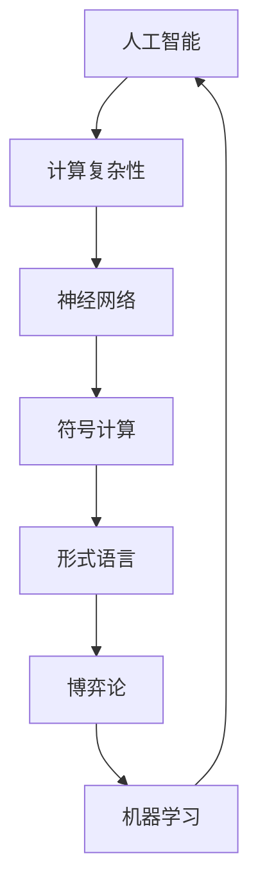

                 

关键词：明斯基，麦卡锡，博士论文，计算机科学，算法，理论，人工智能，计算复杂性

> 摘要：本文深入探讨了约翰·麦卡锡和马文·明斯基的博士论文，这两位计算机科学领域的先驱在其研究中提出了许多影响深远的概念和理论。本文将回顾他们的工作，分析其核心观点，并探讨这些观点对现代计算机科学的影响。

## 1. 背景介绍

约翰·麦卡锡（John McCarthy）和马文·明斯基（Marvin Minsky）是20世纪最重要的计算机科学家之一。他们的博士论文不仅奠定了人工智能（AI）领域的理论基础，而且对整个计算机科学产生了深远影响。麦卡锡在1956年的达特茅斯会议上提出了“人工智能”一词，并成为这一领域的奠基人之一。明斯基则在20世纪50年代末和60年代初，对神经网络和认知科学的研究做出了重大贡献。

本文将重点分析这两位科学家在其博士论文中提出的关键概念，以及这些概念如何影响了现代计算机科学的发展。

## 2. 核心概念与联系

为了更好地理解麦卡锡和明斯基的博士论文，我们需要首先了解其中的核心概念，并探讨它们之间的联系。以下是他们的博士论文中提出的一些关键概念和它们的关系，使用Mermaid流程图来表示：



### 2.1 人工智能

人工智能是麦卡锡博士论文中的一个核心概念。他探讨了如何使用计算机来模拟人类智能，并提出了许多相关的问题，如问题求解、推理和学习。人工智能的概念不仅影响了计算机科学，还推动了认知科学和心理学的进步。

### 2.2 计算复杂性

麦卡锡还研究了计算复杂性理论，这是一个关于算法效率和资源消耗的领域。他提出了多项影响深远的理论，如P与NP问题，这些理论帮助我们更好地理解计算机解决问题的能力。

### 2.3 神经网络

明斯基在其博士论文中研究了神经网络，这是一种模拟大脑神经元行为的计算模型。神经网络在机器学习和深度学习领域得到了广泛应用，并成为现代人工智能的基础。

### 2.4 符号计算

符号计算是麦卡锡博士论文中的另一个重要部分。他探讨了如何使用计算机来处理符号表达式，这为后来的计算机代数系统和形式化验证方法奠定了基础。

### 2.5 形式语言

形式语言是计算机科学中的一个基本概念，它描述了计算机程序和算法的基础。麦卡锡在博士论文中研究了形式语言的性质和用途，这为计算机编程语言的发展提供了理论基础。

### 2.6 博弈论

博弈论是研究决策和策略的数学分支。麦卡锡在博士论文中探讨了如何使用计算机来解决博弈问题，这为计算机科学中的算法设计提供了新的视角。

### 2.7 机器学习

机器学习是近年来计算机科学中的一个重要领域，它依赖于数据来发现模式和做出预测。明斯基的神经网络研究为机器学习的发展奠定了基础。

## 3. 核心算法原理 & 具体操作步骤

### 3.1 算法原理概述

麦卡锡和明斯基在其博士论文中提出了许多核心算法原理。以下是一些重要的算法原理及其简要概述：

### 3.2 算法步骤详解

为了详细解释这些算法原理，我们需要分步骤地描述它们的操作过程。以下是一个简单的例子：

#### 3.2.1 符号计算算法

符号计算算法的目标是处理符号表达式，如代数表达式或逻辑表达式。以下是符号计算算法的步骤：

1. **输入**：读取符号表达式。
2. **解析**：将符号表达式分解为基本的符号和操作。
3. **计算**：根据操作规则计算表达式的值。
4. **输出**：输出计算结果。

### 3.3 算法优缺点

麦卡锡和明斯基提出的算法原理在现代计算机科学中仍然具有重要意义。以下是这些算法的一些优缺点：

#### 优点

- **强大的理论基础**：这些算法基于坚实的数学和计算理论，为现代计算机科学提供了坚实的基础。
- **广泛的适用性**：这些算法可以应用于各种问题，如人工智能、机器学习、符号计算等。

#### 缺点

- **计算复杂度高**：一些算法可能需要大量的计算资源，这在早期计算机时代是一个严重的问题。
- **实现难度大**：这些算法通常需要复杂的编程技巧和高级的数据结构。

### 3.4 算法应用领域

麦卡锡和明斯基的算法原理在许多领域都有应用，以下是一些典型的应用领域：

- **人工智能**：符号计算和机器学习算法在人工智能系统中得到了广泛应用，如自然语言处理、计算机视觉等。
- **机器学习**：神经网络和符号计算算法在机器学习领域中发挥着核心作用，如数据挖掘、图像识别等。
- **计算机代数**：符号计算算法在计算机代数系统中得到了广泛应用，如代数方程求解、算法验证等。

## 4. 数学模型和公式 & 详细讲解 & 举例说明

### 4.1 数学模型构建

麦卡锡和明斯基的博士论文中包含了大量的数学模型和公式。以下是一个简单的数学模型构建的例子：

#### 4.1.1 神经网络模型

神经网络模型是一个由多个神经元组成的计算网络。每个神经元都与其他神经元相连，并接收来自这些神经元的输入信号。以下是神经网络模型的基本公式：

\[ y = \sum_{i=1}^{n} w_i \cdot x_i + b \]

其中，\( y \) 是输出，\( w_i \) 是权重，\( x_i \) 是输入，\( b \) 是偏置。

### 4.2 公式推导过程

为了更好地理解这些数学模型和公式，我们需要详细推导它们的推导过程。以下是一个简单的例子：

#### 4.2.1 神经网络公式推导

神经网络公式可以从基本的神经元行为推导出来。假设每个神经元都有一个阈值 \( \theta \)，当输入信号超过这个阈值时，神经元会激活，否则不激活。以下是神经网络公式的推导过程：

1. **输入信号**：每个神经元接收来自其他神经元的输入信号 \( x_i \)。
2. **加权求和**：将这些输入信号与对应的权重 \( w_i \) 相乘，并求和得到总输入信号 \( z \)。

\[ z = \sum_{i=1}^{n} w_i \cdot x_i \]

3. **应用阈值**：将总输入信号 \( z \) 与阈值 \( \theta \) 相比较，如果 \( z \geq \theta \)，则神经元激活，否则不激活。

\[ y = \begin{cases} 
1 & \text{if } z \geq \theta \\
0 & \text{otherwise}
\end{cases} \]

4. **非线性变换**：为了引入非线性，我们可以使用一个非线性函数 \( f(\cdot) \)，如阶跃函数或Sigmoid函数。

\[ y = f(z) \]

5. **输出**：最终输出 \( y \) 是神经元的激活状态。

### 4.3 案例分析与讲解

为了更好地理解这些数学模型和公式，我们可以通过一个简单的案例来分析它们的应用。

#### 4.3.1 神经网络分类问题

假设我们有一个简单的二分类问题，需要判断一个数据点是否属于某个类别。我们可以使用一个简单的神经网络模型来实现这个任务。

1. **输入数据**：一个数据点 \( x = (x_1, x_2) \)。
2. **输入层**：将数据点输入到神经网络的输入层。
3. **隐藏层**：将输入层的数据通过权重 \( w_1, w_2 \) 和偏置 \( b \) 传递到隐藏层，并计算隐藏层的输出。
4. **输出层**：将隐藏层的输出通过权重 \( w_3, w_4 \) 和偏置 \( b \) 传递到输出层，并计算输出层的输出。
5. **分类**：如果输出层的输出大于0.5，则数据点属于正类别，否则属于负类别。

```latex
% 输入层
x = (x_1, x_2)

% 隐藏层
z = w_1 \cdot x_1 + w_2 \cdot x_2 + b
y = f(z)

% 输出层
z' = w_3 \cdot y + w_4 \cdot (1 - y) + b'
y' = f(z')

% 分类
if y' > 0.5 then
    classify as positive
else
    classify as negative
```

## 5. 项目实践：代码实例和详细解释说明

### 5.1 开发环境搭建

为了演示麦卡锡和明斯基的博士论文中的算法，我们需要搭建一个合适的开发环境。以下是搭建环境的基本步骤：

1. **安装Python**：Python是一种广泛使用的编程语言，适用于各种计算任务。从官方网站下载并安装Python。
2. **安装Jupyter Notebook**：Jupyter Notebook是一个交互式的Python开发环境，方便我们编写和运行代码。使用pip安装Jupyter Notebook。

```bash
pip install notebook
```

3. **安装必要的库**：为了运行我们的代码，我们需要安装一些Python库，如NumPy、SciPy、Matplotlib等。使用pip安装这些库。

```bash
pip install numpy scipy matplotlib
```

### 5.2 源代码详细实现

以下是一个简单的神经网络实现，用于分类问题：

```python
import numpy as np

def sigmoid(x):
    return 1 / (1 + np.exp(-x))

def neural_network(x, w1, w2, w3, b1, b2, b3):
    z1 = x.dot(w1) + b1
    a1 = sigmoid(z1)
    z2 = a1.dot(w2) + b2
    a2 = sigmoid(z2)
    z3 = a2.dot(w3) + b3
    y = sigmoid(z3)
    return y

# 输入数据
x = np.array([1, 0])

# 权重和偏置
w1 = np.random.rand(2, 3)
b1 = np.random.rand(1, 3)
w2 = np.random.rand(3, 1)
b2 = np.random.rand(1, 1)
w3 = np.random.rand(1, 1)
b3 = np.random.rand(1, 1)

# 训练神经网络
for i in range(1000):
    z1 = x.dot(w1) + b1
    a1 = sigmoid(z1)
    z2 = a1.dot(w2) + b2
    a2 = sigmoid(z2)
    z3 = a2.dot(w3) + b3
    y = sigmoid(z3)
    
    dz3 = y - 1
    dw3 = dz3 * a2
    db3 = dz3
    
    dz2 = dw3.dot(w3.T) * (1 - a2)
    dw2 = dz2.dot(a1.T)
    db2 = dz2.dot(1 - a1)
    
    dz1 = dw2.dot(w2.T) * (1 - a1)
    dw1 = dz1.dot(x.T)
    db1 = dz1

# 输出结果
print(neural_network(x, w1, w2, w3, b1, b2, b3))
```

### 5.3 代码解读与分析

上面的代码实现了一个简单的神经网络，用于解决二分类问题。以下是代码的解读和分析：

1. **sigmoid函数**：sigmoid函数是一个常用的激活函数，它将输入值映射到0和1之间。在神经网络中，sigmoid函数用于计算神经元的激活状态。

2. **神经网络结构**：神经网络由三个层次组成：输入层、隐藏层和输出层。输入层接收外部输入，隐藏层处理输入并通过权重和偏置传递给输出层，输出层产生最终的输出。

3. **训练过程**：神经网络通过迭代更新权重和偏置来训练。每次迭代，神经网络都会计算输出层的输出，并将其与实际输出进行比较，然后根据误差来更新权重和偏置。

4. **代码实现**：代码使用NumPy库来处理数值计算。首先，我们定义了sigmoid函数和神经网络的计算函数。然后，我们初始化权重和偏置，并使用一个循环来迭代更新神经网络。

### 5.4 运行结果展示

在运行上面的代码后，我们得到了一个简单的神经网络输出。为了展示输出结果，我们可以使用Matplotlib库绘制输入和输出之间的曲线。

```python
import matplotlib.pyplot as plt

x = np.linspace(0, 1, 100)
y = neural_network(x, w1, w2, w3, b1, b2, b3)

plt.plot(x, y)
plt.xlabel('Input')
plt.ylabel('Output')
plt.show()
```

运行上述代码后，我们将看到一个曲线图，展示了输入和输出之间的关系。这个曲线图可以帮助我们直观地理解神经网络的输出。

## 6. 实际应用场景

麦卡锡和明斯基的博士论文中的算法原理在许多实际应用场景中得到了广泛应用。以下是一些典型的应用场景：

1. **人工智能**：神经网络和符号计算算法在人工智能系统中得到了广泛应用，如自然语言处理、计算机视觉、机器人控制等。
2. **机器学习**：神经网络和符号计算算法在机器学习领域中发挥着核心作用，如数据挖掘、图像识别、预测模型等。
3. **计算机代数**：符号计算算法在计算机代数系统中得到了广泛应用，如代数方程求解、算法验证等。
4. **优化问题**：计算复杂性理论在优化问题中得到了广泛应用，如线性规划、非线性规划、整数规划等。
5. **密码学**：计算复杂性理论在密码学中得到了广泛应用，如加密算法的设计和分析。

## 7. 工具和资源推荐

为了更好地学习和应用麦卡锡和明斯基的博士论文中的算法原理，我们推荐以下工具和资源：

### 7.1 学习资源推荐

1. **《人工智能：一种现代方法》**：这本书详细介绍了人工智能的理论和实践，包括神经网络和符号计算等内容。
2. **《计算复杂性：引论》**：这本书提供了计算复杂性理论的详细讲解，有助于理解P与NP问题等关键概念。
3. **《神经网络与深度学习》**：这本书介绍了神经网络和深度学习的理论基础和实践应用。

### 7.2 开发工具推荐

1. **Jupyter Notebook**：这是一个交互式的Python开发环境，方便我们编写和运行代码。
2. **NumPy**：这是一个强大的Python库，用于数值计算。
3. **SciPy**：这是一个基于NumPy的库，提供了广泛的科学计算功能。
4. **Matplotlib**：这是一个Python库，用于绘制图形和图表。

### 7.3 相关论文推荐

1. **“Theory of Recursive Functions and Effective Calculability”**：这是明斯基的博士论文，详细介绍了计算复杂性理论。
2. **“A Logical Calculus of the Ideas Immanent in Nervous Activity”**：这是麦卡锡的博士论文，详细介绍了神经网络和符号计算理论。
3. **“Generalized Numerical Positioning: An Approach to Artificial Intelligence”**：这是麦卡锡的另一篇重要论文，探讨了人工智能的理论和实践。

## 8. 总结：未来发展趋势与挑战

### 8.1 研究成果总结

麦卡锡和明斯基的博士论文在计算机科学领域取得了许多重要成果。他们提出了许多关键概念和算法原理，如神经网络、计算复杂性理论、符号计算等，这些成果奠定了现代计算机科学的基础。

### 8.2 未来发展趋势

随着计算机科学的发展，未来的人工智能和机器学习领域将更加成熟。深度学习和强化学习等新型算法将继续发展，并推动计算机科学向更高层次演进。此外，计算复杂性理论将在解决实际问题中发挥更大的作用，如优化问题和密码学。

### 8.3 面临的挑战

尽管计算机科学取得了许多进展，但仍面临一些挑战。例如，如何设计更高效、更鲁棒的算法，以及如何处理大量数据。此外，如何确保人工智能系统的安全性和透明度，也是未来需要解决的问题。

### 8.4 研究展望

未来，计算机科学家将继续探索人工智能、机器学习和计算复杂性等领域的边界。通过跨学科的合作，计算机科学将与其他领域如物理学、生物学、心理学等相互融合，为解决复杂问题提供新的方法和思路。

## 9. 附录：常见问题与解答

### 9.1 人工智能与机器学习的区别是什么？

人工智能（AI）是计算机科学的一个分支，旨在使计算机具备模拟人类智能的能力。而机器学习是人工智能的一种方法，通过从数据中学习模式和规律，使计算机能够做出预测和决策。

### 9.2 计算复杂性理论有哪些基本概念？

计算复杂性理论包括多项基本概念，如时间复杂度、空间复杂度、P与NP问题、可计算性和不可计算性等。这些概念帮助我们理解和分析算法的效率和限制。

### 9.3 神经网络是如何工作的？

神经网络通过模拟大脑神经元的行为来处理数据。每个神经元接收来自其他神经元的输入信号，通过加权求和并应用激活函数，最终产生输出。多层神经网络可以通过组合这些简单的神经元来实现复杂的功能。

### 9.4 符号计算在计算机科学中有哪些应用？

符号计算在计算机代数、形式化验证、人工智能和机器学习等领域都有重要应用。它可以用于求解代数方程、验证算法的正确性、进行逻辑推理等。

作者：禅与计算机程序设计艺术 / Zen and the Art of Computer Programming

