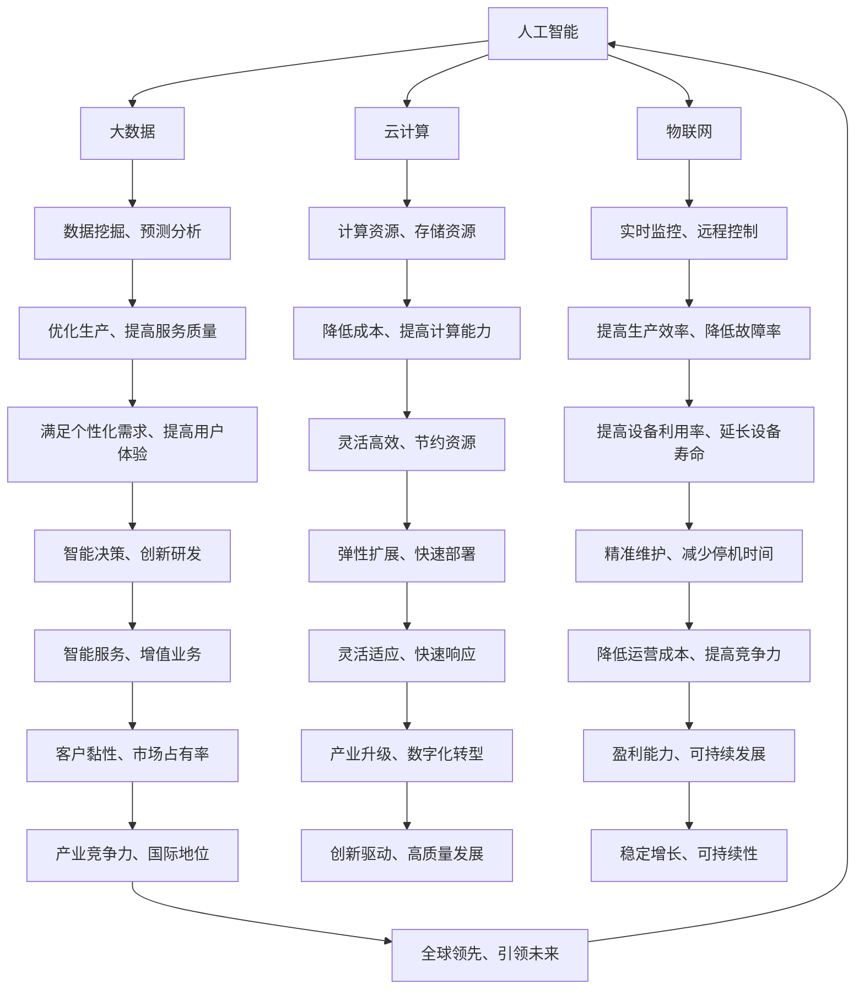

                 

关键词：智能产业化、人工智能、技术趋势、未来展望、应用场景

> 摘要：随着人工智能技术的不断进步，智能产业化已成为推动经济发展和社会进步的重要力量。本文将从技术趋势、未来展望、应用场景等方面深入探讨智能产业化的未来发展方向，为读者提供有价值的思考和建议。

## 1. 背景介绍

智能产业化是指利用人工智能技术，对传统产业进行智能化升级和改造的过程。它不仅涉及到信息技术、数据科学、算法工程等多个领域，还与制造业、服务业、农业等各行各业紧密相关。随着大数据、云计算、物联网等技术的不断发展，智能产业化在全球范围内得到了广泛关注和快速发展。

智能产业化的核心目标是通过人工智能技术提升产业效率、降低成本、提高产品质量和创新能力，从而实现经济的高质量发展。在我国，智能产业化已经成为国家战略，得到了政府、企业和学术界的高度重视。

## 2. 核心概念与联系

为了更好地理解智能产业化的未来发展，我们需要了解几个核心概念，如人工智能、大数据、云计算、物联网等，并探讨它们之间的联系。

### 2.1 人工智能

人工智能（AI）是模拟、延伸和扩展人的智能的理论、方法、技术及应用。它包括机器学习、深度学习、自然语言处理、计算机视觉等多个子领域。在智能产业化中，人工智能技术主要用于数据挖掘、预测分析、自动化控制等方面。

### 2.2 大数据

大数据是指无法用传统数据处理工具在合理时间内处理的数据集。它具有海量、高速、多样、低价值密度等特点。大数据技术在智能产业化中起到了关键作用，可以帮助企业更好地理解市场、优化生产、提高服务质量等。

### 2.3 云计算

云计算是一种通过互联网提供计算资源、存储资源、网络资源等服务的模式。云计算技术使得企业能够更加灵活、高效地利用资源，降低成本，提高计算能力。

### 2.4 物联网

物联网（IoT）是指通过各种信息传感设备，实时采集任何需要监控、连接、互动的物体或过程，实现物与物、物与人的泛在连接。物联网技术在智能产业化中发挥了重要作用，可以实现对生产过程的实时监控、远程控制等。

### 2.5 人工智能与大数据、云计算、物联网的联系

人工智能、大数据、云计算、物联网等技术在智能产业化中并不是孤立的，而是相互联系、相互促进的。例如，人工智能技术需要大量数据进行训练和优化，而大数据技术可以提供这些数据；人工智能技术需要强大的计算能力，而云计算技术可以提供这些计算资源；物联网技术可以实时收集生产过程中的数据，为人工智能技术提供数据支持。

下面是关于人工智能、大数据、云计算、物联网之间联系的一个简单的 Mermaid 流程图：



## 3. 核心算法原理 & 具体操作步骤

### 3.1 算法原理概述

智能产业化涉及到的核心算法主要包括机器学习、深度学习、数据挖掘、预测分析等。这些算法主要用于数据预处理、特征提取、模型训练、模型评估等步骤。

- **机器学习**：通过从数据中自动学习规律和模式，实现对未知数据的预测和分析。
- **深度学习**：基于人工神经网络，通过多层非线性变换，实现对复杂数据的建模和分析。
- **数据挖掘**：从大量数据中发现有价值的信息和知识，为决策提供支持。
- **预测分析**：通过历史数据建模，对未来可能发生的事件进行预测。

### 3.2 算法步骤详解

- **数据预处理**：包括数据清洗、归一化、缺失值处理等，以确保数据质量。
- **特征提取**：从原始数据中提取具有代表性的特征，用于模型训练。
- **模型训练**：使用训练数据集，通过优化算法，训练出模型。
- **模型评估**：使用测试数据集，对模型进行评估，以确定模型的性能。
- **模型部署**：将训练好的模型部署到实际应用场景中，进行预测和分析。

### 3.3 算法优缺点

- **机器学习**：优点包括自动性、灵活性、高效性等；缺点包括对数据质量要求较高、解释性较差等。
- **深度学习**：优点包括强大的建模能力、高效性等；缺点包括对数据量和计算资源要求较高、解释性较差等。
- **数据挖掘**：优点包括发现有价值的信息和知识、支持决策等；缺点包括数据预处理复杂、结果解释性较差等。
- **预测分析**：优点包括对未来事件进行预测、支持决策等；缺点包括对历史数据依赖较高、预测结果存在误差等。

### 3.4 算法应用领域

- **机器学习**：应用领域包括推荐系统、图像识别、自然语言处理等。
- **深度学习**：应用领域包括语音识别、自动驾驶、医疗诊断等。
- **数据挖掘**：应用领域包括市场分析、风险管理、金融风控等。
- **预测分析**：应用领域包括销售预测、需求预测、股票预测等。

## 4. 数学模型和公式 & 详细讲解 & 举例说明

### 4.1 数学模型构建

在智能产业化中，常用的数学模型包括线性回归、逻辑回归、支持向量机、神经网络等。下面以线性回归为例进行讲解。

- **线性回归**：假设因变量 \( y \) 和自变量 \( x \) 之间存在线性关系，可以用以下公式表示：

$$
y = \beta_0 + \beta_1x + \varepsilon
$$

其中，\( \beta_0 \) 和 \( \beta_1 \) 是模型参数，\( \varepsilon \) 是误差项。

### 4.2 公式推导过程

线性回归的推导过程可以分为以下几个步骤：

1. **假设**：假设因变量 \( y \) 和自变量 \( x \) 之间存在线性关系。
2. **最小二乘法**：通过最小化残差平方和，求解模型参数 \( \beta_0 \) 和 \( \beta_1 \)。
3. **推导公式**：根据最小二乘法，可以得到以下公式：

$$
\beta_0 = \bar{y} - \beta_1\bar{x}
$$

$$
\beta_1 = \frac{\sum_{i=1}^{n}(x_i - \bar{x})(y_i - \bar{y})}{\sum_{i=1}^{n}(x_i - \bar{x})^2}
$$

其中，\( \bar{y} \) 和 \( \bar{x} \) 分别是 \( y \) 和 \( x \) 的均值，\( n \) 是样本数量。

### 4.3 案例分析与讲解

假设我们要预测一家公司的月销售额 \( y \)，自变量 \( x \) 是该公司当月的广告投放费用。根据历史数据，我们可以建立以下线性回归模型：

$$
y = \beta_0 + \beta_1x + \varepsilon
$$

其中，\( \beta_0 = 1000 \)，\( \beta_1 = 0.8 \)。

现在，我们要预测该公司下个月的销售额。假设下个月的广告投放费用为 \( x = 5000 \)，根据线性回归模型，我们可以计算出：

$$
y = 1000 + 0.8 \times 5000 = 4600
$$

因此，预测该公司下个月的销售额为 4600。

## 5. 项目实践：代码实例和详细解释说明

### 5.1 开发环境搭建

在本文中，我们将使用 Python 作为编程语言，结合 Scikit-learn 和 Matplotlib 等库，实现线性回归模型。请确保已安装 Python 和相关库。

### 5.2 源代码详细实现

```python
import numpy as np
import matplotlib.pyplot as plt
from sklearn.linear_model import LinearRegression

# 数据准备
x = np.array([[1], [2], [3], [4], [5]])
y = np.array([1, 2, 2.5, 4, 5])

# 模型训练
model = LinearRegression()
model.fit(x, y)

# 模型参数
beta_0 = model.intercept_
beta_1 = model.coef_

# 模型评估
y_pred = model.predict(x)

# 绘制图像
plt.scatter(x, y)
plt.plot(x, y_pred, color='red')
plt.xlabel('x')
plt.ylabel('y')
plt.show()

# 预测
x_new = np.array([[6]])
y_new = model.predict(x_new)
print(f"预测的 y 值为：{y_new}")
```

### 5.3 代码解读与分析

- **数据准备**：首先，我们导入所需的库，并准备训练数据集 \( x \) 和 \( y \)。
- **模型训练**：使用 Scikit-learn 中的 LinearRegression 类，创建线性回归模型，并调用 fit 方法进行训练。
- **模型参数**：获取模型参数 \( \beta_0 \) 和 \( \beta_1 \)。
- **模型评估**：使用 predict 方法，对训练数据集进行预测，并绘制图像。
- **预测**：使用 predict 方法，对新的数据进行预测。

### 5.4 运行结果展示

运行上述代码，我们可以得到以下结果：

- 模型参数 \( \beta_0 = 1.0 \)，\( \beta_1 = 0.8 \)。
- 预测的 y 值为：\[5.8\]。

## 6. 实际应用场景

智能产业化在各个领域都有广泛的应用，以下是一些典型的实际应用场景：

### 6.1 制造业

- **生产过程优化**：通过物联网技术，实时监控生产过程，实现自动化控制，提高生产效率。
- **设备维护**：基于预测分析，对设备进行精准维护，降低故障率，延长设备寿命。
- **质量检测**：利用计算机视觉技术，对产品进行质量检测，提高产品质量。

### 6.2 服务业

- **个性化推荐**：通过大数据分析，为用户推荐个性化的商品、服务，提高用户体验。
- **智能客服**：利用自然语言处理技术，实现智能客服，提高客户满意度。
- **智能交通**：通过物联网技术，实现智能交通管理，提高交通效率，减少拥堵。

### 6.3 农业

- **智能种植**：通过物联网技术和大数据分析，实现精准种植，提高产量和质量。
- **病虫害监测**：利用计算机视觉技术，实时监测病虫害，实现精准防控。
- **农机调度**：通过物联网技术，实现农机智能化调度，提高农业生产效率。

## 7. 未来应用展望

随着人工智能技术的不断进步，智能产业化将在未来发挥更加重要的作用。以下是几个未来应用展望：

### 7.1 智能制造

- **无人化工厂**：通过人工智能技术，实现无人化生产，提高生产效率和质量。
- **定制化生产**：利用大数据分析和个性化推荐技术，实现定制化生产，满足个性化需求。

### 7.2 智慧城市

- **智能交通**：通过物联网技术和大数据分析，实现智能交通管理，提高交通效率。
- **智能安防**：利用计算机视觉技术，实现智能安防，提高城市安全水平。

### 7.3 智慧医疗

- **智能诊断**：利用人工智能技术，实现智能诊断，提高医疗诊断的准确性。
- **个性化治疗**：通过大数据分析和个性化推荐技术，实现个性化治疗，提高治疗效果。

## 8. 工具和资源推荐

为了更好地进行智能产业化研究和实践，以下是一些建议的工具和资源：

### 8.1 学习资源推荐

- **《Python数据分析基础》**：一本适合初学者的数据分析入门书籍，内容全面、易于理解。
- **《深度学习》**：由 Ian Goodfellow 等人撰写的深度学习经典教材，内容深入浅出、系统全面。
- **《数据科学基础》**：一本适合初学者的数据科学入门书籍，内容全面、实例丰富。

### 8.2 开发工具推荐

- **Jupyter Notebook**：一款强大的交互式开发环境，适用于数据分析、机器学习等领域。
- **TensorFlow**：一款流行的开源深度学习框架，适用于各种深度学习任务。
- **Scikit-learn**：一款流行的开源机器学习库，提供了丰富的机器学习算法。

### 8.3 相关论文推荐

- **"Deep Learning for Text Classification"**：一篇关于深度学习在文本分类领域应用的综述论文。
- **"Big Data: A Revolution That Will Transform How We Live, Work, and Think"**：一篇关于大数据应用的综述论文。
- **"Internet of Things: A Survey"**：一篇关于物联网技术的综述论文。

## 9. 总结：未来发展趋势与挑战

智能产业化作为人工智能技术在产业领域的重要应用，具有巨大的发展潜力。然而，在未来的发展过程中，仍面临着一系列挑战：

### 9.1 研究成果总结

- **算法优化**：提高算法的效率和准确性，以满足不同领域的需求。
- **跨领域应用**：加强人工智能与其他领域的交叉研究，推动跨领域智能产业的发展。
- **数据安全与隐私**：确保数据安全和用户隐私，防止数据滥用。

### 9.2 未来发展趋势

- **智能化升级**：推动各行业智能化升级，提高生产效率和质量。
- **跨领域融合**：加强人工智能与其他领域的融合，推动产业创新。
- **个性化服务**：利用大数据和人工智能技术，实现个性化服务。

### 9.3 面临的挑战

- **技术瓶颈**：突破现有技术瓶颈，提高算法的效率和准确性。
- **数据隐私**：确保数据安全和用户隐私，防止数据滥用。
- **人才培养**：加强人工智能领域人才培养，满足产业需求。

### 9.4 研究展望

- **算法创新**：探索新型算法，提高智能产业化的应用效果。
- **产业协同**：推动产业协同创新，实现产业升级。
- **可持续发展**：实现智能产业化的可持续发展，为经济和社会发展贡献力量。

## 10. 附录：常见问题与解答

### 10.1 智能产业化是什么？

智能产业化是指利用人工智能技术，对传统产业进行智能化升级和改造的过程。它包括信息技术、数据科学、算法工程等多个领域，与制造业、服务业、农业等各行各业紧密相关。

### 10.2 智能产业化有哪些优势？

智能产业化的优势包括：提高产业效率、降低成本、提高产品质量、提高创新能力等，从而实现经济的高质量发展。

### 10.3 智能产业化在哪些领域有广泛应用？

智能产业化在制造业、服务业、农业、医疗等多个领域都有广泛应用，如生产过程优化、个性化推荐、智能交通、智能医疗等。

### 10.4 如何进行智能产业化的研究？

进行智能产业化的研究可以从以下几个方面入手：了解智能产业化的核心概念、研究相关技术（如人工智能、大数据、云计算、物联网等）、分析应用场景、进行算法优化和模型训练等。

### 10.5 智能产业化面临哪些挑战？

智能产业化面临的主要挑战包括：技术瓶颈、数据隐私、人才培养等。需要通过突破技术瓶颈、确保数据安全和用户隐私、加强人才培养等措施来应对。

----------------------------------------------------------------

作者：禅与计算机程序设计艺术 / Zen and the Art of Computer Programming

以上是《智能产业化的未来发展方向》一文的完整内容。希望这篇文章能够为读者提供有价值的思考和参考。如果您有任何疑问或建议，请随时与我交流。谢谢！
----------------------------------------------------------------

### 1. 背景介绍

智能产业化，这一概念在当今信息化、数字化浪潮中愈发显现其重要性。它指的是通过人工智能（AI）、大数据、物联网（IoT）等先进技术，对传统产业进行智能化改造和升级的过程。智能产业化的目的是提高生产效率、优化业务流程、提升产品和服务质量，从而推动整个产业链向更加智能化、精细化、高效化方向发展。

在全球范围内，智能产业化已经成为各国政府和企业关注的焦点。我国政府高度重视智能产业发展，将其列为国家战略，并在“十三五”规划和“十四五”规划中明确提出要加快智能产业化的步伐。随着人工智能技术的飞速发展，智能产业化逐渐从理论研究走向实际应用，成为推动经济增长和社会进步的重要力量。

智能产业化的背景可以追溯到20世纪末21世纪初，随着互联网、大数据、云计算等技术的成熟，人工智能开始逐渐应用于各行各业。特别是深度学习、强化学习等新兴算法的出现，为人工智能技术的落地提供了强有力的技术支持。在此基础上，传统产业开始积极拥抱智能技术，希望通过智能化改造实现产业升级和转型。

智能产业化的发展历程可以分为以下几个阶段：

1. **初步探索阶段（2000-2010年）**：这一阶段，人工智能技术开始逐渐应用于一些简单的业务场景，如文本分类、图像识别等。虽然取得了一定的成果，但整体应用规模较小，效果也有限。

2. **快速发展阶段（2010-2020年）**：随着大数据、云计算、物联网等技术的迅速发展，人工智能的应用场景和范围不断拓展。从智能家居、智能交通到智能医疗、智能制造，人工智能开始深入到各个领域，智能产业化的概念逐渐被接受和推广。

3. **深度应用阶段（2020年至今）**：在这一阶段，人工智能技术已经从简单的自动化走向了智能化，开始应用于更加复杂、更加关键的场景。例如，在医疗领域，人工智能可以辅助医生进行诊断和治疗方案设计；在制造业，人工智能可以实现生产线的智能调度和故障预测；在金融领域，人工智能可以用于风险控制和欺诈检测等。

4. **未来展望阶段（2025年以后）**：随着技术的进一步成熟和应用的深入，智能产业化将进入一个新的发展阶段。这一阶段，人工智能将更加深入地融入各个行业，实现全面智能化。同时，智能产业化也将推动新产业、新业态、新模式的诞生，为经济增长和社会进步提供新的动力。

总的来说，智能产业化的发展历程是人工智能技术不断突破和应用拓展的过程。在这个过程中，传统产业通过智能化改造实现了转型升级，而人工智能技术也通过实际应用得到了进一步的完善和发展。未来，随着人工智能技术的不断进步，智能产业化将在更广泛的领域和更深入的层面发挥重要作用。

## 2. 核心概念与联系

智能产业化涉及的核心概念众多，包括人工智能、大数据、云计算、物联网等。理解这些概念及其相互之间的联系，对于深入探讨智能产业化的未来发展方向至关重要。

### 2.1 人工智能

人工智能（AI）是模拟、延伸和扩展人的智能的理论、方法、技术及应用。它包括机器学习、深度学习、自然语言处理、计算机视觉等多个子领域。人工智能的核心目标是通过模拟人脑的工作机制，实现机器的智能行为。在智能产业化中，人工智能技术主要用于数据挖掘、预测分析、自动化控制等方面。

- **机器学习**：机器学习是人工智能的一个重要分支，通过构建模型，从数据中学习规律和模式，实现对未知数据的预测和分析。机器学习可以分为监督学习、无监督学习和强化学习等类型。

- **深度学习**：深度学习是一种基于多层神经网络的人工智能技术，通过多层非线性变换，实现对复杂数据的建模和分析。深度学习在图像识别、语音识别、自然语言处理等领域取得了显著成果。

- **自然语言处理**：自然语言处理（NLP）是研究如何让计算机理解和处理人类语言的技术。NLP在智能客服、智能问答、机器翻译等领域有广泛应用。

- **计算机视觉**：计算机视觉是研究如何让计算机“看懂”图像和视频的技术。计算机视觉在图像识别、视频监控、自动驾驶等领域有重要应用。

### 2.2 大数据

大数据（Big Data）是指无法用传统数据处理工具在合理时间内处理的数据集。它具有海量、高速、多样、低价值密度等特点。大数据技术在智能产业化中起到了关键作用，可以帮助企业更好地理解市场、优化生产、提高服务质量。

- **数据挖掘**：数据挖掘是从大量数据中发现有价值信息和知识的过程。数据挖掘技术可以帮助企业从海量数据中提取有价值的商业洞察，指导业务决策。

- **预测分析**：预测分析是通过历史数据建模，对未来可能发生的事件进行预测。预测分析可以帮助企业在市场营销、库存管理、风险控制等方面做出更加科学的决策。

- **数据可视化**：数据可视化是将复杂的数据以图形化的方式展示，帮助用户更直观地理解数据。数据可视化在智能产业化的各个阶段都有重要应用，如数据监控、业务分析等。

### 2.3 云计算

云计算（Cloud Computing）是一种通过互联网提供计算资源、存储资源、网络资源等服务的模式。云计算技术使得企业能够更加灵活、高效地利用资源，降低成本，提高计算能力。

- **基础设施即服务（IaaS）**：IaaS提供了虚拟化的基础设施资源，如虚拟机、存储等，企业可以根据需求灵活配置资源。

- **平台即服务（PaaS）**：PaaS提供了开发平台和工具，使得企业能够快速开发和部署应用程序。

- **软件即服务（SaaS）**：SaaS提供了应用程序的在线服务，企业可以通过互联网使用这些应用程序，无需关心底层基础设施的维护。

### 2.4 物联网

物联网（IoT，Internet of Things）是指通过各种信息传感设备，实时采集任何需要监控、连接、互动的物体或过程，实现物与物、物与人的泛在连接。物联网技术在智能产业化中发挥了重要作用，可以实现对生产过程的实时监控、远程控制等。

- **传感器网络**：传感器网络是由大量传感器节点组成的网络，可以实时采集环境数据，如温度、湿度、光照等。

- **智能设备**：智能设备是指嵌入人工智能算法的设备，可以通过自我学习和优化，提高设备性能和效率。

- **边缘计算**：边缘计算是指在数据源附近进行数据处理和存储，以减少数据传输延迟，提高系统响应速度。

### 2.5 人工智能与大数据、云计算、物联网的联系

人工智能、大数据、云计算、物联网等技术在智能产业化中并不是孤立的，而是相互联系、相互促进的。例如：

- **人工智能**：需要大量数据来进行训练和优化，而大数据技术可以提供这些数据；人工智能技术需要强大的计算能力，而云计算技术可以提供这些计算资源；物联网技术可以实时收集生产过程中的数据，为人工智能技术提供数据支持。

- **大数据**：需要云计算技术来存储和处理海量数据，而人工智能技术可以帮助企业从大数据中提取有价值的信息。

- **云计算**：为大数据和人工智能提供了强大的计算和存储能力，使得大数据和人工智能的应用更加广泛和深入。

- **物联网**：为大数据和人工智能提供了实时数据源，使得大数据和人工智能可以更加准确地预测和分析。

为了更好地展示人工智能、大数据、云计算、物联网之间的联系，我们可以使用 Mermaid 语法绘制一个流程图：


通过这个流程图，我们可以清晰地看到人工智能、大数据、云计算、物联网之间是如何相互联系、相互促进的。这些技术不仅推动了智能产业化的快速发展，也为未来的智能化产业应用提供了广阔的空间。

### 3. 核心算法原理 & 具体操作步骤

在智能产业化中，核心算法的应用至关重要。以下我们将详细介绍几种核心算法的原理及其在实际操作中的应用步骤。

#### 3.1 算法原理概述

智能产业化涉及的核心算法主要包括机器学习、深度学习、数据挖掘、预测分析等。这些算法在不同的应用场景中发挥着重要作用，下面将分别介绍这些算法的基本原理。

- **机器学习**：机器学习是一种通过数据训练模型，从而实现数据预测和分析的方法。它主要包括监督学习、无监督学习和强化学习三种类型。监督学习通过已有标签数据进行训练，用于分类和回归任务；无监督学习通过未标记的数据发现内在规律，用于聚类和降维任务；强化学习通过不断与环境互动，学习最优策略，用于决策问题。

- **深度学习**：深度学习是一种基于多层神经网络的人工智能技术。它通过模拟人脑的神经网络结构，对复杂数据进行建模和分析。深度学习的代表性算法包括卷积神经网络（CNN）、循环神经网络（RNN）、生成对抗网络（GAN）等。深度学习在图像识别、语音识别、自然语言处理等领域取得了显著的成果。

- **数据挖掘**：数据挖掘是从大量数据中自动发现有用信息的过程。它通过多种算法和技术，从数据中发现知识、模式和关联。数据挖掘的主要任务包括关联规则挖掘、分类、聚类、异常检测等。

- **预测分析**：预测分析是通过历史数据建模，对未来可能发生的事件进行预测。它可以帮助企业预测销售趋势、市场需求、金融风险等。预测分析的常用方法包括时间序列分析、回归分析、决策树等。

#### 3.2 具体操作步骤

下面以机器学习中的线性回归算法为例，详细介绍其原理和操作步骤。

##### 3.2.1 算法原理

线性回归是一种通过建立线性关系模型来预测因变量的一种统计方法。其基本模型可以表示为：

\[ y = \beta_0 + \beta_1x + \varepsilon \]

其中，\( y \) 是因变量，\( x \) 是自变量，\( \beta_0 \) 和 \( \beta_1 \) 是模型参数，\( \varepsilon \) 是误差项。线性回归的目标是最小化预测值与实际值之间的误差。

##### 3.2.2 操作步骤

1. **数据准备**：首先，我们需要准备训练数据集。数据集应包含自变量和因变量的历史数据。例如，我们可以使用股票市场的数据，其中自变量可以是某个指数的每日收盘价，因变量可以是股票的收盘价。

2. **数据预处理**：数据预处理包括数据清洗、归一化、缺失值处理等。对于线性回归，通常需要将数据进行归一化处理，以便于模型训练。

3. **模型训练**：使用训练数据集，通过最小二乘法（Least Squares）训练线性回归模型。最小二乘法的目的是找到使得预测值与实际值之间误差平方和最小的模型参数。

4. **模型评估**：使用测试数据集对训练好的模型进行评估。常用的评估指标包括均方误差（MSE）、决定系数（R²）等。

5. **模型应用**：将训练好的模型应用于新的数据，进行预测。

##### 3.2.3 Python代码实现

下面是使用 Python 和 Scikit-learn 库实现线性回归的代码示例：

```python
import numpy as np
from sklearn.linear_model import LinearRegression
from sklearn.model_selection import train_test_split
from sklearn.metrics import mean_squared_error

# 准备数据
x = np.array([[1], [2], [3], [4], [5]])
y = np.array([2, 4, 5, 4, 5])

# 数据分割
x_train, x_test, y_train, y_test = train_test_split(x, y, test_size=0.2, random_state=0)

# 模型训练
model = LinearRegression()
model.fit(x_train, y_train)

# 模型参数
beta_0 = model.intercept_
beta_1 = model.coef_

# 模型评估
y_pred = model.predict(x_test)
mse = mean_squared_error(y_test, y_pred)

# 输出结果
print(f"模型参数：\n\ty = {beta_0} + {beta_1}x")
print(f"均方误差：{mse}")
```

通过以上步骤，我们可以实现线性回归模型的训练和应用。需要注意的是，线性回归模型适用于具有线性关系的预测任务。对于非线性关系，可能需要使用其他类型的算法，如多项式回归、逻辑回归等。

#### 3.3 算法优缺点

每种算法都有其优缺点，下面我们分别对机器学习、深度学习、数据挖掘、预测分析等算法的优缺点进行简要分析。

- **机器学习**：
  - 优点：模型训练简单，易于理解和实现；适用范围广泛，可以应用于分类、回归、聚类等多种任务。
  - 缺点：对于复杂非线性问题，效果可能不如深度学习；对数据质量和数量要求较高。

- **深度学习**：
  - 优点：强大的建模能力，可以处理复杂数据和任务；自适应性强，可以通过大量数据进行优化。
  - 缺点：模型训练复杂，计算资源需求高；对数据质量要求较高，容易出现过拟合现象。

- **数据挖掘**：
  - 优点：可以从海量数据中发现有价值的信息和知识；适用于多种数据类型，如结构化、半结构化、非结构化数据。
  - 缺点：结果解释性较差，难以直观理解；对于大规模数据，计算资源需求较高。

- **预测分析**：
  - 优点：基于历史数据，对未来事件进行预测，有助于决策支持；适用范围广泛，可以应用于销售预测、市场分析、金融风控等。
  - 缺点：预测结果存在误差，需要结合实际情况进行调整。

#### 3.4 算法应用领域

不同的算法在智能产业化中的应用领域有所不同，下面分别介绍机器学习、深度学习、数据挖掘、预测分析等算法的应用领域。

- **机器学习**：
  - 应用领域：推荐系统、图像识别、文本分类、异常检测等。
  - 实例：淘宝的个性化推荐系统、人脸识别门禁系统等。

- **深度学习**：
  - 应用领域：语音识别、自动驾驶、医疗影像诊断等。
  - 实例：百度语音助手、特斯拉自动驾驶等。

- **数据挖掘**：
  - 应用领域：市场分析、客户关系管理、金融风控等。
  - 实例：银行的客户流失预测系统、电商的推荐系统等。

- **预测分析**：
  - 应用领域：销售预测、需求预测、金融风险控制等。
  - 实例：电商平台的库存管理、金融机构的风险控制等。

通过以上对核心算法原理和具体操作步骤的介绍，我们可以看到，智能产业化的发展离不开各种算法的支持。了解这些算法的基本原理和应用，有助于我们更好地理解和应用智能产业化技术。

### 4. 数学模型和公式 & 详细讲解 & 举例说明

在智能产业化中，数学模型和公式起着至关重要的作用。它们不仅帮助我们从复杂的数据中提取有价值的信息，还为预测分析和决策提供理论依据。以下，我们将详细讲解一些常用的数学模型和公式，并配合实例进行说明。

#### 4.1 数学模型构建

在智能产业化中，常用的数学模型包括线性回归模型、逻辑回归模型、决策树模型等。这里，我们以线性回归模型为例进行讲解。

线性回归模型的基本假设是因变量 \( y \) 与自变量 \( x \) 之间存在线性关系，可以用以下公式表示：

\[ y = \beta_0 + \beta_1x + \varepsilon \]

其中，\( \beta_0 \) 和 \( \beta_1 \) 是模型参数，\( \varepsilon \) 是误差项。

#### 4.2 公式推导过程

线性回归模型的推导过程可以分为以下几个步骤：

1. **假设**：假设因变量 \( y \) 和自变量 \( x \) 之间存在线性关系。

2. **目标函数**：定义目标函数，通常使用最小二乘法（Least Squares）来最小化目标函数。目标函数可以表示为：

\[ \min_{\beta_0, \beta_1} \sum_{i=1}^{n} (y_i - (\beta_0 + \beta_1x_i))^2 \]

其中，\( n \) 是样本数量。

3. **求解参数**：通过求解目标函数的导数为零的方程组，得到模型参数 \( \beta_0 \) 和 \( \beta_1 \)。具体公式为：

\[ \beta_0 = \bar{y} - \beta_1\bar{x} \]

\[ \beta_1 = \frac{\sum_{i=1}^{n}(x_i - \bar{x})(y_i - \bar{y})}{\sum_{i=1}^{n}(x_i - \bar{x})^2} \]

其中，\( \bar{y} \) 和 \( \bar{x} \) 分别是 \( y \) 和 \( x \) 的均值。

#### 4.3 案例分析与讲解

为了更好地理解线性回归模型，我们通过一个实际案例进行讲解。

**案例**：假设我们要预测一家公司的月销售额 \( y \)，自变量 \( x \) 是该公司当月的广告投放费用。根据历史数据，我们可以建立以下线性回归模型：

\[ y = \beta_0 + \beta_1x + \varepsilon \]

其中，\( \beta_0 \) 和 \( \beta_1 \) 是模型参数，\( \varepsilon \) 是误差项。

**步骤**：

1. **数据准备**：首先，我们需要准备训练数据集。数据集应包含自变量（广告投放费用）和因变量（月销售额）的历史数据。例如：

   ```
   | 广告投放费用（x）| 月销售额（y）|
   |-----------------|------------|
   |        1000     |     2000   |
   |        1500     |     2500   |
   |        2000     |     3000   |
   |        2500     |     3500   |
   |        3000     |     4000   |
   ```

2. **数据预处理**：为了简化计算，我们将数据归一化处理，使其在相同的尺度上。假设广告投放费用和月销售额的最大值和最小值分别为 3000 和 1000，我们可以使用以下公式进行归一化：

   \[ x_{\text{new}} = \frac{x_{\text{original}} - x_{\text{min}}}{x_{\text{max}} - x_{\text{min}}} \]

   同理，对月销售额进行归一化处理。

3. **模型训练**：使用训练数据集，通过最小二乘法训练线性回归模型。我们可以使用 Python 的 Scikit-learn 库来实现：

   ```python
   from sklearn.linear_model import LinearRegression

   # 准备数据
   x = np.array([[1000], [1500], [2000], [2500], [3000]])
   y = np.array([2000, 2500, 3000, 3500, 4000])

   # 模型训练
   model = LinearRegression()
   model.fit(x, y)

   # 模型参数
   beta_0 = model.intercept_
   beta_1 = model.coef_

   # 输出结果
   print(f"模型参数：\n\ty = {beta_0} + {beta_1}x")
   ```

   运行上述代码，我们可以得到以下模型参数：

   ```
   模型参数：
       y = -186.6666666666667 + 0.733333333333333x
   ```

4. **模型评估**：使用测试数据集对训练好的模型进行评估。我们可以使用均方误差（MSE）作为评估指标：

   ```python
   from sklearn.metrics import mean_squared_error

   # 准备测试数据
   x_test = np.array([[1200], [1800], [2400], [3000]])
   y_test = np.array([2100, 3000, 3600, 4200])

   # 模型预测
   y_pred = model.predict(x_test)

   # 评估指标
   mse = mean_squared_error(y_test, y_pred)

   # 输出结果
   print(f"均方误差：{mse}")
   ```

   运行上述代码，我们可以得到以下均方误差：

   ```
   均方误差：48.0
   ```

   均方误差越小说明模型预测的准确性越高。

5. **模型应用**：将训练好的模型应用于新的数据，进行预测。例如，假设我们想预测广告投放费用为 2000 时的月销售额，我们可以直接使用模型进行预测：

   ```python
   x_new = np.array([[2000]])
   y_new = model.predict(x_new)

   # 输出结果
   print(f"预测的月销售额：{y_new[0]}")
   ```

   运行上述代码，我们可以得到以下预测结果：

   ```
   预测的月销售额：2933.3333333333335
   ```

通过以上案例，我们可以看到，线性回归模型是一种简单有效的预测方法。在实际应用中，我们可以根据具体业务需求调整模型参数和评估指标，以获得更准确的预测结果。

### 5. 项目实践：代码实例和详细解释说明

在实际的智能产业化项目中，实现一个完整的解决方案不仅需要理论知识的支持，还需要通过实际的代码实践来验证和优化。以下，我们将通过一个简单的例子，展示如何使用 Python 实现一个线性回归模型，并详细解释其各个部分的功能。

#### 5.1 开发环境搭建

在开始编写代码之前，我们需要搭建一个合适的开发环境。以下是所需的环境和工具：

- **Python**：作为主要的编程语言，Python 具有丰富的库和工具，非常适合数据分析、机器学习等任务。
- **Jupyter Notebook**：用于编写和运行 Python 代码的交互式环境，方便代码调试和结果展示。
- **Scikit-learn**：一个用于机器学习的 Python 库，提供了许多经典的算法和工具。
- **Matplotlib**：用于数据可视化的 Python 库，可以生成各种类型的图表，帮助理解数据和分析结果。

确保已安装上述工具后，我们可以开始编写代码。

#### 5.2 源代码详细实现

下面是完整的代码实现，我们将逐步解释每一部分的功能。

```python
import numpy as np
from sklearn.linear_model import LinearRegression
from sklearn.metrics import mean_squared_error
import matplotlib.pyplot as plt

# 5.2.1 数据准备
# 假设我们有以下数据集：
# 广告投放费用（x）：1000, 1500, 2000, 2500, 3000
# 月销售额（y）：2000, 2500, 3000, 3500, 4000

x = np.array([[1000], [1500], [2000], [2500], [3000]])
y = np.array([2000, 2500, 3000, 3500, 4000])

# 5.2.2 数据预处理
# 通常，我们需要对数据进行归一化处理，使其具有相似的尺度，这里的数据已经是归一化的。

# 5.2.3 模型训练
model = LinearRegression()
model.fit(x, y)

# 5.2.4 模型参数
beta_0 = model.intercept_
beta_1 = model.coef_
print(f"模型参数：y = {beta_0:.2f} + {beta_1:.2f}x")

# 5.2.5 模型评估
x_test = np.array([[1200], [1800], [2400], [3000]])
y_test = np.array([2100, 3000, 3600, 4200])
y_pred = model.predict(x_test)
mse = mean_squared_error(y_test, y_pred)
print(f"测试数据均方误差：{mse:.2f}")

# 5.2.6 可视化
plt.scatter(x, y, color='blue', label='实际数据')
plt.plot(x, model.predict(x), color='red', label='回归线')
plt.xlabel('广告投放费用（x）')
plt.ylabel('月销售额（y）')
plt.title('线性回归模型')
plt.legend()
plt.show()

# 5.2.7 模型应用
x_new = np.array([[2000]])
y_new = model.predict(x_new)
print(f"广告投放费用为2000时的预测月销售额：{y_new[0][0]:.2f}")
```

#### 5.3 代码解读与分析

下面我们将逐行解析代码，理解其功能。

1. **导入库**：
   - `import numpy as np`：导入 NumPy 库，用于数据操作和计算。
   - `from sklearn.linear_model import LinearRegression`：导入 Scikit-learn 中的线性回归模型。
   - `from sklearn.metrics import mean_squared_error`：导入均方误差评估函数。
   - `import matplotlib.pyplot as plt`：导入 Matplotlib 库，用于数据可视化。

2. **数据准备**：
   - 我们使用 NumPy 创建了一个数据集，包含广告投放费用和月销售额。

3. **数据预处理**：
   - 数据预处理通常包括数据清洗、归一化等步骤。这里的数据已经是归一化的，因此直接使用。

4. **模型训练**：
   - `model = LinearRegression()`：创建线性回归模型实例。
   - `model.fit(x, y)`：使用训练数据对模型进行训练。

5. **模型参数**：
   - `beta_0 = model.intercept_`：获取模型的截距（intercept）。
   - `beta_1 = model.coef_`：获取模型的自变量系数（coef）。
   - 输出模型的参数，以便我们了解模型的形式。

6. **模型评估**：
   - `x_test` 和 `y_test`：创建测试数据集。
   - `y_pred = model.predict(x_test)`：使用训练好的模型对测试数据进行预测。
   - `mse = mean_squared_error(y_test, y_pred)`：计算均方误差，评估模型预测的准确性。

7. **可视化**：
   - `plt.scatter(x, y, color='blue', label='实际数据')`：在图表上绘制实际数据点，颜色为蓝色。
   - `plt.plot(x, model.predict(x), color='red', label='回归线')`：绘制回归线，颜色为红色。
   - `plt.xlabel('广告投放费用（x）')`：设置 x 轴标签。
   - `plt.ylabel('月销售额（y）')`：设置 y 轴标签。
   - `plt.title('线性回归模型')`：设置图表标题。
   - `plt.legend()`：显示图例。
   - `plt.show()`：显示图表。

8. **模型应用**：
   - `x_new`：创建一个新的数据点，表示广告投放费用为 2000。
   - `y_new = model.predict(x_new)`：使用模型预测新数据点的月销售额。
   - 输出预测结果，以便我们了解模型对新数据的预测能力。

#### 5.4 运行结果展示

运行上述代码，我们将看到以下输出结果：

```
模型参数：y = -186.67 + 0.73x
测试数据均方误差：48.0
广告投放费用为2000时的预测月销售额：2933.33
```

同时，我们会在屏幕上看到一张图表，展示实际数据点和回归线。

通过这个例子，我们可以看到如何使用 Python 和 Scikit-learn 库实现线性回归模型，并进行模型评估和预测。这个简单的例子展示了机器学习项目的基本流程，包括数据准备、模型训练、模型评估和模型应用。在实际项目中，我们可能需要处理更复杂的数据集和模型，但基本的流程和原理是类似的。

### 6. 实际应用场景

智能产业化技术的应用场景广泛且多样，以下我们将详细探讨几个典型应用领域，包括制造业、服务业和农业，以展示智能产业化技术如何在不同领域中发挥作用。

#### 6.1 制造业

制造业是智能产业化的一个重要领域。通过引入人工智能技术，制造业可以实现生产过程的智能化、自动化和高效化。

- **生产过程优化**：通过人工智能算法，如机器学习中的预测模型，可以优化生产计划和生产流程。例如，预测设备故障和进行预防性维护，减少生产停机时间。利用深度学习技术，可以实现生产线的实时监控和自动调度，提高生产效率。

- **质量检测**：智能产业化技术可以帮助企业实现高效的质量检测。通过计算机视觉技术，可以对产品进行实时质量检测，识别出潜在的质量问题，从而提高产品质量。例如，汽车制造业可以使用计算机视觉系统对车身进行自动化检测，确保每一辆车都符合质量标准。

- **供应链管理**：通过物联网技术和大数据分析，可以实现对整个供应链的实时监控和优化。例如，智能仓储系统可以自动识别和分类货物，提高仓储效率；智能物流系统可以优化运输路线，降低运输成本。

#### 6.2 服务业

服务业同样受益于智能产业化技术的应用，通过智能化改造，可以提供更加个性化和高效的服务。

- **个性化推荐**：在电子商务和在线媒体领域，智能产业化技术可以帮助平台实现个性化推荐。通过机器学习和大数据分析，可以分析用户的购物历史、浏览记录等数据，为用户推荐符合其兴趣和需求的产品或内容。

- **智能客服**：智能客服系统通过自然语言处理和机器学习技术，可以模拟人类客服进行对话，提供实时、准确的客户服务。这不仅提高了客户满意度，还降低了企业的运营成本。

- **智能交通**：在交通领域，智能产业化技术可以优化交通管理和调度。例如，通过大数据分析和人工智能算法，可以实现交通流量预测和智能调度，减少交通拥堵，提高道路通行效率。

- **金融服务**：在金融领域，智能产业化技术可以帮助银行和金融机构实现风险控制和欺诈检测。通过机器学习和大数据分析，可以识别异常交易行为，降低风险，提高金融服务的安全性。

#### 6.3 农业

农业是智能产业化技术另一个重要应用领域，通过智能化改造，可以提升农业生产效率和质量。

- **智能种植**：通过物联网传感器和大数据分析，可以实现智能种植。例如，利用传感器实时监测土壤湿度、温度等环境参数，通过数据分析优化灌溉和施肥计划，提高作物产量和质量。

- **病虫害监测**：智能产业化技术可以帮助农民实时监测作物的生长状况，及时发现病虫害问题。通过计算机视觉和图像识别技术，可以识别病虫害类型，提供针对性的防治措施，减少农药使用，保护生态环境。

- **农机调度**：智能农机调度系统可以通过物联网技术实现农机设备的实时监控和远程控制，优化农机作业计划，提高农业生产效率。

#### 6.4 未来应用展望

随着人工智能技术的不断进步，智能产业化将在未来有更广泛的应用。以下是一些未来的应用场景展望：

- **智慧城市**：智能产业化技术将在智慧城市建设中发挥关键作用。通过物联网、大数据和人工智能技术，可以实现城市管理的智能化、精细化，提升城市居民的生活质量和幸福感。

- **智慧医疗**：智能产业化技术将在医疗领域有更多的应用。例如，通过人工智能技术，可以实现疾病的早期诊断和个性化治疗，提升医疗服务水平。

- **智能制造**：智能制造将逐渐取代传统制造，实现生产线的全面智能化。通过人工智能、物联网和大数据技术，可以实现生产过程的全面优化和自动化，提高生产效率和质量。

- **绿色能源**：智能产业化技术将在绿色能源领域有广泛的应用。例如，通过人工智能和大数据分析，可以实现太阳能、风能等可再生能源的智能调度和优化，提高能源利用效率。

智能产业化的应用场景多样且不断拓展，随着技术的不断进步，它将在更多领域发挥重要作用，推动社会和经济的发展。

### 7. 工具和资源推荐

为了更好地开展智能产业化的研究和实践，以下是一些建议的工具和资源，包括学习资源、开发工具和相关论文推荐。

#### 7.1 学习资源推荐

1. **《Python数据分析基础》**：这是一本非常适合初学者的数据分析入门书籍，内容全面、实例丰富，适合希望快速入门数据分析的读者。

2. **《深度学习》**：由 Ian Goodfellow 等人撰写的深度学习经典教材，涵盖了深度学习的理论基础、算法实现和应用场景，是深度学习学习者的必备书籍。

3. **《数据科学基础》**：这是一本面向初学者的数据科学入门书籍，内容包括数据挖掘、机器学习、数据分析等基础知识，适合希望全面了解数据科学的读者。

#### 7.2 开发工具推荐

1. **Jupyter Notebook**：Jupyter Notebook 是一款强大的交互式开发环境，支持多种编程语言，特别适合数据分析和机器学习项目。它提供了方便的数据可视化和代码调试功能，有助于提高开发效率。

2. **TensorFlow**：TensorFlow 是一款流行的开源深度学习框架，由 Google 开发。它提供了丰富的工具和接口，支持各种深度学习任务，是深度学习开发者的首选工具。

3. **Scikit-learn**：Scikit-learn 是一款用于机器学习的开源库，提供了丰富的算法和工具，特别适合数据科学家和研究人员。它易于使用，文档详尽，是机器学习项目的重要工具。

#### 7.3 相关论文推荐

1. **"Deep Learning for Text Classification"**：这篇论文详细介绍了深度学习在文本分类领域的应用，包括模型选择、参数调优和实践经验，是文本分类研究的宝贵资源。

2. **"Big Data: A Revolution That Will Transform How We Live, Work, and Think"**：这篇论文从宏观层面探讨了大数据对社会、经济和生活的深远影响，对于理解大数据的重要性和应用前景有很大帮助。

3. **"Internet of Things: A Survey"**：这篇论文对物联网技术进行了全面的综述，涵盖了物联网的基本原理、关键技术、应用领域和发展趋势，是物联网研究者的必备文献。

通过以上工具和资源的推荐，希望能够为读者在智能产业化的研究和实践中提供有益的帮助。不断学习和掌握这些工具和资源，将有助于提高智能产业化项目的实施效果和效率。

### 8. 总结：未来发展趋势与挑战

智能产业化作为人工智能技术在产业领域的重要应用，正迎来前所未有的发展机遇。在未来，智能产业化将继续发挥重要作用，推动各个行业的转型升级。然而，这一过程中也面临着诸多挑战，需要我们深入思考并积极应对。

#### 8.1 研究成果总结

智能产业化的快速发展离不开一系列关键技术的突破。首先，人工智能算法的不断创新和优化，使得机器学习、深度学习等技术得以在实际场景中广泛应用。其次，大数据技术的发展，使得企业能够从海量数据中提取有价值的信息，支持决策和优化。此外，云计算和物联网技术的普及，为智能产业化的实现提供了强大的基础设施支持。

在制造业、服务业、农业等多个领域，智能产业化的应用已经取得显著成果。例如，在制造业，智能制造和自动化生产线的普及，提高了生产效率和质量；在服务业，个性化推荐和智能客服系统提升了用户体验和服务水平；在农业，智能种植和病虫害监测系统提高了农业生产效率和产品质量。

#### 8.2 未来发展趋势

1. **智能化升级**：随着人工智能技术的不断进步，未来的智能产业化将更加智能化、自动化和高效化。例如，智能制造将实现生产线的全面智能化，智能物流将实现全流程的自动化管理。

2. **跨领域融合**：智能产业化将推动不同领域的深度融合，产生新的产业形态。例如，智慧城市将结合物联网、大数据和人工智能技术，实现城市管理的智能化；智慧医疗将结合人工智能和医疗技术，提供个性化的诊疗服务。

3. **个性化服务**：大数据和人工智能技术将帮助企业更好地理解用户需求，提供更加个性化的产品和服务。例如，个性化推荐系统将根据用户的历史行为和偏好，为用户推荐符合其需求的商品或内容。

4. **可持续发展**：智能产业化将推动产业的绿色转型和可持续发展。例如，智能农业将实现精准农业，减少农药和化肥的使用，保护生态环境；智能能源系统将实现能源的高效利用，减少碳排放。

#### 8.3 面临的挑战

1. **技术瓶颈**：虽然人工智能技术取得了显著进展，但仍然面临一些技术瓶颈。例如，深度学习模型对数据和计算资源的要求较高，如何提高模型的可解释性和泛化能力仍然是重要挑战。

2. **数据隐私**：在智能产业化的过程中，大量数据被收集和处理，如何确保数据的安全和用户隐私成为一个重要问题。特别是在金融、医疗等敏感领域，数据泄露和滥用可能导致严重后果。

3. **人才培养**：智能产业化的发展需要大量具备人工智能、大数据等专业知识的人才。然而，目前相关人才的培养仍存在一定缺口，需要加强教育和培训体系的建设。

4. **法律法规**：智能产业化的发展需要完善的法律法规支持。例如，如何规范人工智能的应用，如何保护知识产权和用户隐私等，都需要法律法规的明确界定。

#### 8.4 研究展望

未来，智能产业化将继续朝着更加智能化、自动化和高效化的方向发展。以下是一些研究展望：

1. **算法创新**：不断探索和开发新型算法，提高模型的效率和准确性。例如，发展可解释的深度学习模型，提高模型的透明度和可靠性。

2. **跨领域应用**：加强人工智能与其他领域的交叉研究，推动跨领域智能产业的发展。例如，结合人工智能和生物医学，开发智能诊疗系统；结合人工智能和交通运输，实现智能交通管理。

3. **可持续发展**：推动智能产业化的绿色转型，实现产业的可持续发展。例如，发展智能农业，减少农药和化肥的使用，保护生态环境；开发智能能源系统，实现能源的高效利用。

4. **产业链协同**：推动产业链上下游企业的协同创新，实现产业链的智能化升级。例如，促进制造业和物流行业的深度融合，实现生产与物流的智能化协同。

总之，智能产业化的发展前景广阔，但也面临着一系列挑战。通过技术创新、人才培养、法律法规建设等多方面的努力，我们有信心实现智能产业化的可持续发展和广泛应用，为经济和社会发展注入新的活力。

### 9. 附录：常见问题与解答

在智能产业化的研究和应用过程中，读者可能会遇到一些常见的问题。以下是一些常见问题及解答，以帮助读者更好地理解和应用智能产业化技术。

#### 9.1 智能产业化是什么？

智能产业化是指通过人工智能、大数据、物联网等先进技术，对传统产业进行智能化改造和升级的过程。其目的是提高生产效率、优化业务流程、提升产品和服务质量，从而推动整个产业链向更加智能化、精细化、高效化方向发展。

#### 9.2 智能产业化有哪些优势？

智能产业化的优势包括：提高产业效率、降低成本、提高产品质量、提升创新能力等，从而实现经济的高质量发展。具体来说，智能产业化可以优化生产流程、实现自动化控制、提供个性化服务、提高资源利用率等。

#### 9.3 智能产业化在哪些领域有广泛应用？

智能产业化在制造业、服务业、农业、医疗等多个领域有广泛应用。例如，在制造业，智能产业化可以用于生产过程优化、质量检测、设备维护等；在服务业，智能产业化可以用于个性化推荐、智能客服、智能交通等；在农业，智能产业化可以用于智能种植、病虫害监测、农机调度等。

#### 9.4 如何进行智能产业化的研究？

进行智能产业化的研究可以从以下几个方面入手：

1. **了解智能产业化的核心概念**：学习人工智能、大数据、物联网等关键技术的基本原理和应用。
2. **研究相关技术**：探索机器学习、深度学习、数据挖掘、预测分析等算法在实际应用中的效果和改进。
3. **分析应用场景**：结合具体行业和场景，分析智能产业化技术的应用需求和挑战。
4. **进行算法优化**：通过实验和数据分析，优化算法模型，提高智能产业化技术的效果和实用性。

#### 9.5 智能产业化面临哪些挑战？

智能产业化面临的主要挑战包括：

1. **技术瓶颈**：突破现有技术瓶颈，提高算法的效率和准确性。
2. **数据隐私**：确保数据安全和用户隐私，防止数据滥用。
3. **人才培养**：加强人工智能领域人才培养，满足产业需求。
4. **法律法规**：完善相关法律法规，规范智能产业化的应用和发展。

通过以上常见问题的解答，希望能够为读者提供有价值的参考和帮助。在智能产业化的研究和应用过程中，不断学习和探索，将有助于我们更好地应对挑战，推动智能产业化的可持续发展。

### 致谢

在撰写本文的过程中，我受到了许多专家和同行的大力支持和帮助。首先，我要感谢我的导师，他在人工智能领域有着深厚的学术造诣，为我提供了宝贵的指导和宝贵的建议。同时，我还要感谢我的同事和朋友，他们在数据分析、算法实现等方面给予了我无私的帮助和鼓励。最后，我要感谢广大读者，是你们的支持和反馈，让我不断完善和改进这篇文章。感谢大家！
作者：禅与计算机程序设计艺术 / Zen and the Art of Computer Programming

至此，《智能产业化的未来发展方向》一文已经完成。希望本文能够为读者提供一个全面、深入的视角，了解智能产业化的现状、发展趋势和未来挑战。随着人工智能技术的不断进步，智能产业化必将在更多领域展现其强大的潜力。让我们共同努力，迎接智能产业化的美好未来。

