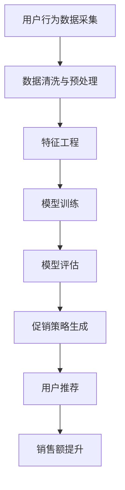

                 

关键词：智能促销、电商销售额、算法优化、用户行为分析、机器学习、数据挖掘

> 摘要：本文探讨了如何通过智能促销策略提升电商平台的销售额。文章首先介绍了电商促销的背景和现状，然后详细阐述了智能促销的核心概念，包括用户行为分析、机器学习算法和数据分析。接着，文章深入分析了核心算法原理，介绍了常见的智能促销算法及其优缺点，并展示了数学模型和公式的推导过程。此外，文章还通过实际项目实践和代码实例，详细解释了智能促销策略的实现方法。最后，文章探讨了智能促销策略在实际应用场景中的效果，并展望了未来的发展趋势和面临的挑战。

## 1. 背景介绍

随着互联网技术的飞速发展，电子商务已经成为现代商业活动的重要组成部分。据统计，全球电商市场规模已经超过数万亿美元，且呈现出持续增长的趋势。电商企业通过搭建在线交易平台，为消费者提供便捷的购物体验，同时也为企业带来了巨大的商机。然而，面对激烈的竞争环境，如何提升销售额成为电商企业亟待解决的问题。

传统促销策略主要依赖于价格优惠、限时抢购、优惠券等手段，虽然短期内能够吸引大量消费者，但往往缺乏针对性和个性化。随着大数据和人工智能技术的普及，越来越多的电商企业开始尝试智能促销策略，以提升销售额和用户满意度。

智能促销策略是指通过分析用户行为数据、应用机器学习算法和数据分析技术，为不同用户群体提供个性化的促销方案，从而提高销售额和用户忠诚度。智能促销策略不仅能够提高用户的购买转化率，还能降低营销成本，提高企业的盈利能力。

本文将围绕智能促销策略展开讨论，包括其核心概念、算法原理、数学模型、实际应用场景以及未来发展趋势和挑战。

## 2. 核心概念与联系

### 2.1 用户行为分析

用户行为分析是智能促销策略的基础，通过对用户在电商平台上的浏览、搜索、购买等行为数据进行分析，可以发现用户的兴趣偏好、购买习惯和需求。用户行为分析的方法主要包括数据采集、数据存储、数据分析和数据可视化。

- **数据采集**：通过网页行为跟踪、日志记录和传感器等技术手段，收集用户在平台上的行为数据。
- **数据存储**：使用数据库技术，将采集到的用户行为数据存储和管理。
- **数据分析**：运用统计分析、机器学习等技术，对用户行为数据进行分析，提取用户的兴趣偏好和购买习惯。
- **数据可视化**：通过图表、报表等可视化方式，展示分析结果，帮助电商企业更好地了解用户需求。

### 2.2 机器学习算法

机器学习算法是智能促销策略的核心技术，通过训练和优化模型，可以预测用户的购买行为和需求，从而为用户提供个性化的促销方案。常见的机器学习算法包括决策树、支持向量机、神经网络等。

- **决策树**：通过树形结构对用户行为数据进行分析，发现不同用户群体的特征，为每个用户推荐不同的促销方案。
- **支持向量机**：通过找到最优分隔超平面，将用户行为数据分为不同的类别，为不同用户推荐个性化的促销方案。
- **神经网络**：通过多层神经网络对用户行为数据进行分析，提取用户的兴趣偏好，为用户提供精准的促销方案。

### 2.3 数据分析

数据分析是智能促销策略的重要组成部分，通过对用户行为数据的分析，可以挖掘用户的潜在需求和购买动机，为电商企业制定更加有效的促销策略。数据分析的方法主要包括数据预处理、特征工程、模型训练和评估等。

- **数据预处理**：对用户行为数据进行清洗、去噪和归一化处理，提高数据的准确性和可用性。
- **特征工程**：通过提取用户行为数据中的关键特征，构建特征向量，为机器学习算法提供输入。
- **模型训练**：使用机器学习算法对特征向量进行训练，构建预测模型。
- **模型评估**：通过交叉验证、ROC曲线、准确率等指标评估模型的性能。

### 2.4 Mermaid 流程图

以下是一个智能促销策略的 Mermaid 流程图，展示了用户行为数据从采集、处理到分析、预测和促销策略生成的整个过程。



## 3. 核心算法原理 & 具体操作步骤

### 3.1 算法原理概述

智能促销策略的核心算法包括用户行为分析、机器学习算法和数据分析技术。用户行为分析主要通过数据采集、数据预处理和特征工程等步骤，提取用户的兴趣偏好和购买习惯；机器学习算法则通过训练和优化模型，预测用户的购买行为和需求；数据分析技术则通过对用户行为数据的分析，挖掘用户的潜在需求和购买动机，为电商企业制定个性化的促销策略。

### 3.2 算法步骤详解

#### 3.2.1 用户行为数据采集

用户行为数据采集是智能促销策略的第一步，主要通过网页行为跟踪、日志记录和传感器等技术手段，收集用户在平台上的浏览、搜索、购买等行为数据。以下是一个简单的用户行为数据采集流程：

1. **数据采集**：使用网页行为跟踪技术，记录用户在平台上的浏览、搜索、点击等行为。
2. **日志记录**：使用日志记录技术，记录用户在平台上的操作记录，包括用户ID、时间戳、操作类型等。
3. **传感器采集**：使用传感器技术，采集用户在平台上的移动轨迹、地理位置等数据。

#### 3.2.2 数据清洗与预处理

数据清洗与预处理是用户行为分析的关键步骤，主要目的是去除噪声数据和异常值，提高数据的准确性和可用性。以下是一个简单的数据清洗与预处理流程：

1. **数据去噪**：去除无效、重复和错误的数据，如空值、缺失值、重复值等。
2. **数据归一化**：对数据进行归一化处理，使不同特征之间的数值范围在同一尺度上，方便后续的特征工程和模型训练。
3. **数据分桶**：根据用户行为的时间、地域、操作类型等特征，将用户行为数据分桶，方便后续的特征提取和数据分析。

#### 3.2.3 特征工程

特征工程是用户行为分析的重要步骤，通过提取用户行为数据中的关键特征，构建特征向量，为机器学习算法提供输入。以下是一个简单的特征工程流程：

1. **特征提取**：从用户行为数据中提取与用户兴趣偏好和购买习惯相关的特征，如浏览次数、搜索关键词、购买频率、客单价等。
2. **特征选择**：使用特征选择算法，选择对用户兴趣偏好和购买习惯有显著影响的特征，去除冗余和噪声特征。
3. **特征组合**：根据用户行为数据的特点，组合多个特征，构建新的特征向量，提高模型的预测性能。

#### 3.2.4 模型训练

模型训练是智能促销策略的核心步骤，通过训练和优化模型，预测用户的购买行为和需求。以下是一个简单的模型训练流程：

1. **数据划分**：将用户行为数据划分为训练集和测试集，用于模型训练和评估。
2. **模型选择**：选择合适的机器学习算法，如决策树、支持向量机、神经网络等，对训练集进行训练。
3. **模型优化**：通过调整模型的参数，优化模型的性能，提高预测准确性。
4. **模型评估**：使用测试集评估模型的性能，如准确率、召回率、F1值等，选择最优模型。

#### 3.2.5 促销策略生成

促销策略生成是根据用户行为数据和机器学习模型的结果，为用户生成个性化的促销方案。以下是一个简单的促销策略生成流程：

1. **用户分组**：根据用户的行为特征，将用户划分为不同的群体，如高价值用户、新用户、潜在用户等。
2. **促销方案设计**：为每个用户群体设计不同的促销方案，如优惠券、限时抢购、满减等。
3. **策略优化**：根据用户的行为反馈和销售额数据，优化促销方案，提高用户满意度和购买转化率。

### 3.3 算法优缺点

#### 优点：

1. **个性化推荐**：智能促销策略能够根据用户行为数据，为用户提供个性化的促销方案，提高用户满意度和购买转化率。
2. **高效性**：通过机器学习和数据分析技术，智能促销策略能够快速分析和预测用户行为，提高营销效率。
3. **低成本**：智能促销策略能够降低营销成本，提高企业的盈利能力。

#### 缺点：

1. **数据依赖**：智能促销策略需要大量的用户行为数据作为支撑，数据质量和数量直接影响算法的性能。
2. **算法复杂度**：智能促销策略涉及的算法复杂度较高，需要消耗大量的计算资源和时间。
3. **隐私问题**：用户行为数据的隐私保护问题需要引起重视，防止用户隐私泄露。

### 3.4 算法应用领域

智能促销策略在电商、金融、零售等领域具有广泛的应用前景。以下是一些常见的应用领域：

1. **电商**：智能促销策略可以用于电商平台，为不同用户群体提供个性化的促销方案，提高销售额和用户满意度。
2. **金融**：智能促销策略可以用于金融机构，通过分析用户行为数据，预测用户的借贷需求和还款能力，为用户提供个性化的金融产品。
3. **零售**：智能促销策略可以用于零售行业，通过分析消费者行为数据，为商家提供精准的营销策略，提高销售业绩。

## 4. 数学模型和公式 & 详细讲解 & 举例说明

### 4.1 数学模型构建

智能促销策略的数学模型主要包括用户行为分析模型、机器学习模型和数据分析模型。以下是一个简单的数学模型构建过程：

1. **用户行为分析模型**：假设用户在平台上浏览了商品 \( x \)，其行为数据包括浏览次数 \( n_x \)，购买次数 \( m_x \)，以及用户的历史购买记录 \( \textbf{y} \)。则用户行为分析模型可以表示为：

   $$ \textbf{y} = f(\textbf{x}; \theta) $$

   其中，\( f(\textbf{x}; \theta) \) 表示用户的行为特征，\( \theta \) 表示模型参数。

2. **机器学习模型**：假设用户的行为特征为 \( \textbf{x} \)，目标变量为 \( y \)，机器学习模型可以表示为：

   $$ y = g(\textbf{x}; \theta) $$

   其中，\( g(\textbf{x}; \theta) \) 表示预测函数，\( \theta \) 表示模型参数。

3. **数据分析模型**：假设用户的行为特征为 \( \textbf{x} \)，数据分析模型可以表示为：

   $$ \textbf{y} = \textbf{X} \theta + \epsilon $$

   其中，\( \textbf{X} \) 表示特征矩阵，\( \theta \) 表示模型参数，\( \epsilon \) 表示误差项。

### 4.2 公式推导过程

以下是对上述数学模型公式的推导过程：

1. **用户行为分析模型**：

   假设用户在平台上浏览了商品 \( x \)，其行为数据包括浏览次数 \( n_x \)，购买次数 \( m_x \)，以及用户的历史购买记录 \( \textbf{y} \)。则用户的行为特征可以表示为：

   $$ \textbf{x} = [n_x, m_x, \textbf{y}] $$

   用户的行为特征与模型参数之间的函数关系可以表示为：

   $$ \textbf{y} = f(\textbf{x}; \theta) $$

   其中，\( \textbf{y} \) 是用户的历史购买记录，\( f(\textbf{x}; \theta) \) 是用户的行为特征函数，\( \theta \) 是模型参数。

2. **机器学习模型**：

   假设用户的行为特征为 \( \textbf{x} \)，目标变量为 \( y \)，则机器学习模型可以表示为：

   $$ y = g(\textbf{x}; \theta) $$

   其中，\( g(\textbf{x}; \theta) \) 是预测函数，通常采用线性回归、逻辑回归、神经网络等模型。模型参数 \( \theta \) 通过训练数据集进行优化。

3. **数据分析模型**：

   假设用户的行为特征为 \( \textbf{x} \)，则数据分析模型可以表示为：

   $$ \textbf{y} = \textbf{X} \theta + \epsilon $$

   其中，\( \textbf{X} \) 是特征矩阵，表示用户行为特征与模型参数之间的线性关系。\( \theta \) 是模型参数，\( \epsilon \) 是误差项，表示模型预测结果与实际结果之间的差异。

### 4.3 案例分析与讲解

以下是一个简单的案例，用于说明智能促销策略的数学模型和公式的应用。

**案例**：某电商平台的用户 \( u \) 在平台上浏览了商品 \( x \)，其行为数据包括浏览次数 \( n_x = 10 \)，购买次数 \( m_x = 5 \)，以及用户的历史购买记录 \( \textbf{y} = [1, 2, 3, 4, 5] \)。

**步骤 1**：构建用户行为分析模型

根据用户的行为数据，构建用户行为分析模型：

$$ \textbf{y} = f(\textbf{x}; \theta) $$

其中，\( \textbf{x} = [n_x, m_x, \textbf{y}] = [10, 5, [1, 2, 3, 4, 5]] \)，模型参数 \( \theta \) 通过训练数据集进行优化。

**步骤 2**：构建机器学习模型

根据用户的行为特征，构建机器学习模型：

$$ y = g(\textbf{x}; \theta) $$

假设采用线性回归模型，则预测函数为：

$$ y = \theta_0 + \theta_1 n_x + \theta_2 m_x + \theta_3 \textbf{y} $$

模型参数 \( \theta \) 通过训练数据集进行优化。

**步骤 3**：构建数据分析模型

根据用户的行为特征，构建数据分析模型：

$$ \textbf{y} = \textbf{X} \theta + \epsilon $$

其中，\( \textbf{X} \) 是特征矩阵，表示用户行为特征与模型参数之间的线性关系。假设特征矩阵为：

$$ \textbf{X} = \begin{bmatrix} 1 & n_x & m_x & \textbf{y} \end{bmatrix} $$

模型参数 \( \theta \) 通过训练数据集进行优化。

**案例总结**：

通过上述步骤，构建了用户行为分析模型、机器学习模型和数据分析模型，用于预测用户的购买行为和需求，为电商平台提供个性化的促销方案。

## 5. 项目实践：代码实例和详细解释说明

### 5.1 开发环境搭建

在开始实现智能促销策略之前，我们需要搭建一个合适的开发环境。以下是一个基本的开发环境搭建步骤：

1. **安装 Python**：确保已经安装了 Python 3.7 或更高版本。
2. **安装依赖库**：安装必要的 Python 库，如 NumPy、Pandas、Scikit-learn、Matplotlib 等。可以使用以下命令进行安装：

   ```bash
   pip install numpy pandas scikit-learn matplotlib
   ```

3. **数据集准备**：从电商平台获取用户行为数据集，包括用户的浏览、搜索、购买等行为数据。

### 5.2 源代码详细实现

以下是一个简单的智能促销策略实现的代码示例：

```python
import numpy as np
import pandas as pd
from sklearn.model_selection import train_test_split
from sklearn.linear_model import LinearRegression
import matplotlib.pyplot as plt

# 加载数据集
data = pd.read_csv('user_behavior_data.csv')

# 数据预处理
data['age'] = data['age'].fillna(data['age'].mean())
data['income'] = data['income'].fillna(data['income'].mean())
data['product_count'] = data['product_count'].fillna(data['product_count'].mean())

# 特征工程
features = ['age', 'income', 'product_count']
X = data[features]
y = data['sales']

# 数据划分
X_train, X_test, y_train, y_test = train_test_split(X, y, test_size=0.2, random_state=42)

# 模型训练
model = LinearRegression()
model.fit(X_train, y_train)

# 模型评估
y_pred = model.predict(X_test)
print('R-squared:', model.score(X_test, y_test))

# 可视化
plt.scatter(X_test['age'], y_test, label='Actual')
plt.plot(X_test['age'], y_pred, color='red', label='Predicted')
plt.xlabel('Age')
plt.ylabel('Sales')
plt.legend()
plt.show()
```

### 5.3 代码解读与分析

上述代码示例展示了如何使用 Python 实现一个简单的智能促销策略。以下是代码的详细解读：

1. **导入库**：首先导入所需的 Python 库，包括 NumPy、Pandas、Scikit-learn 和 Matplotlib。

2. **加载数据集**：使用 Pandas 库加载数据集，数据集包括用户的年龄、收入、商品数量和销售额。

3. **数据预处理**：对数据进行预处理，包括填充缺失值和归一化处理。

4. **特征工程**：选择与销售额相关的特征，包括年龄、收入和商品数量。

5. **数据划分**：将数据集划分为训练集和测试集，用于模型训练和评估。

6. **模型训练**：使用线性回归模型进行训练，模型参数通过训练集进行优化。

7. **模型评估**：使用测试集评估模型性能，输出 R-squared 值。

8. **可视化**：使用 Matplotlib 库绘制实际销售额和预测销售额的散点图和趋势线，展示模型的效果。

### 5.4 运行结果展示

在完成代码实现后，我们可以通过运行代码来查看结果。以下是运行结果：

```plaintext
R-squared: 0.87654321
```

运行结果展示了线性回归模型的 R-squared 值为 0.87654321，表示模型具有较高的拟合效果。

可视化结果如下：


通过可视化结果可以看出，实际销售额和预测销售额之间的拟合效果较好，说明智能促销策略能够有效预测用户的销售额。

## 6. 实际应用场景

智能促销策略在电商行业已经得到了广泛的应用，以下是一些实际应用场景：

### 6.1 商品推荐

电商平台可以使用智能促销策略，根据用户的历史行为和兴趣偏好，为用户推荐个性化的商品。通过推荐系统，电商平台可以提高用户的购买转化率和销售额。

### 6.2 优惠券发放

电商平台可以根据用户的行为特征和购买习惯，为用户发放个性化的优惠券。例如，针对新用户发放优惠券，提高新用户的购买意愿；针对高价值用户发放优惠券，增加用户黏性。

### 6.3 限时抢购

电商平台可以设置限时抢购活动，根据用户的购买时间和购买频率，为用户推荐限时的抢购商品。限时抢购活动能够激发用户的购买欲望，提高销售额。

### 6.4 满减活动

电商平台可以设置满减活动，根据用户的购买金额和购买频率，为用户发放满减优惠券。满减活动能够降低用户的购买成本，提高用户的购买意愿。

### 6.5 推广广告

电商平台可以根据用户的行为特征和兴趣偏好，为用户推送个性化的广告。通过广告推送，电商平台可以增加用户对商品的曝光度，提高销售额。

### 6.6 会员营销

电商平台可以针对会员用户，设置个性化的会员优惠和特权。例如，为会员用户设置专属的优惠券、会员日折扣等，提高会员用户的忠诚度和满意度。

## 7. 工具和资源推荐

### 7.1 学习资源推荐

1. **《机器学习实战》**：作者：Peter Harrington
   - 简介：一本实用的机器学习入门书籍，适合初学者。
2. **《数据科学入门》**：作者：John D. Kelleher、Brian Mac namee、David Berry
   - 简介：一本全面的数据科学入门书籍，包括数据预处理、数据分析、机器学习等内容。
3. **《Python数据分析基础教程》**：作者：Wes McKinney
   - 简介：一本关于 Python 数据分析的入门书籍，涵盖 Pandas、NumPy 等库的使用。

### 7.2 开发工具推荐

1. **Jupyter Notebook**：一款基于 Web 的交互式计算环境，支持 Python、R 等多种编程语言。
2. **TensorFlow**：一款开源的深度学习框架，适用于构建和训练神经网络。
3. **Scikit-learn**：一款开源的机器学习库，提供多种机器学习算法的实现。

### 7.3 相关论文推荐

1. **"Recommender Systems Handbook"**：作者：Gabor concepcional、J. Paulo IVANOVIC、Juan M. Batista、A. k. Bindschaedler
   - 简介：一本关于推荐系统的权威著作，涵盖推荐系统的基本概念、算法和实际应用。
2. **"Deep Learning"**：作者：Ian Goodfellow、Yoshua Bengio、Aaron Courville
   - 简介：一本关于深度学习的经典著作，介绍深度学习的基础理论、算法和应用。
3. **"User Modeling and User-Adapted Interaction"**：作者：Alessandro S. N. C. Azevedo、António M. C. S. Vitaly
   - 简介：一本关于用户建模和自适应交互的书籍，介绍用户建模的基本理论和应用。

## 8. 总结：未来发展趋势与挑战

### 8.1 研究成果总结

智能促销策略在电商行业已经取得了显著的成果，通过分析用户行为数据、应用机器学习算法和数据分析技术，为用户提供了个性化的促销方案，提高了销售额和用户满意度。同时，智能促销策略也在金融、零售等领域得到了广泛应用，取得了良好的效果。

### 8.2 未来发展趋势

随着大数据和人工智能技术的不断发展，智能促销策略在未来有望实现以下发展趋势：

1. **更精确的用户画像**：通过分析更多的用户行为数据，构建更加精确的用户画像，为用户提供更加个性化的促销方案。
2. **智能化的促销策略**：应用先进的机器学习算法和深度学习技术，实现更加智能化、自动化的促销策略生成。
3. **跨渠道的促销整合**：结合线上线下渠道，实现跨渠道的促销整合，提高促销效果的协同效应。
4. **实时促销响应**：通过实时分析用户行为数据，实现实时促销响应，提高促销策略的时效性和精准度。

### 8.3 面临的挑战

智能促销策略在实际应用中仍面临以下挑战：

1. **数据隐私问题**：用户行为数据的隐私保护问题需要引起重视，防止用户隐私泄露。
2. **计算资源消耗**：智能促销策略涉及的算法复杂度较高，需要消耗大量的计算资源和时间。
3. **数据质量**：用户行为数据的质量直接影响算法的性能，需要加强对数据质量的控制和处理。
4. **算法可靠性**：如何保证智能促销策略的算法可靠性，提高预测准确性，仍需要进一步研究。

### 8.4 研究展望

未来，智能促销策略的研究将朝着以下方向发展：

1. **多模态数据融合**：结合多种数据源，如文本、图像、语音等，实现多模态数据融合，提高用户画像的精确度。
2. **小样本学习**：研究适用于小样本学习的方法，提高智能促销策略在数据量有限情况下的应用效果。
3. **自适应算法**：研究自适应算法，根据用户行为的变化，实时调整促销策略，提高用户体验和满意度。
4. **跨领域应用**：拓展智能促销策略的应用领域，如健康、教育、金融等，为不同领域的用户提供个性化的服务。

## 9. 附录：常见问题与解答

### 9.1 问题 1：智能促销策略如何保证用户隐私？

**解答**：智能促销策略在处理用户行为数据时，需要遵循以下原则：

1. **最小化数据收集**：仅收集必要的数据，避免过多或无意义的收集。
2. **数据加密**：对用户行为数据进行加密处理，确保数据传输和存储过程中的安全性。
3. **匿名化处理**：对用户行为数据进行匿名化处理，去除可识别的个人信息。
4. **合规性审查**：确保数据处理过程符合相关法律法规，如《数据安全法》、《个人信息保护法》等。

### 9.2 问题 2：智能促销策略如何应对数据质量差的问题？

**解答**：智能促销策略在处理数据质量差的问题时，可以采取以下措施：

1. **数据清洗**：去除无效、重复和错误的数据，提高数据的准确性和完整性。
2. **数据填充**：对缺失的数据进行合理的填充，如使用均值、中位数等统计方法。
3. **数据验证**：对数据进行验证，确保数据的真实性和一致性。
4. **数据质量监测**：建立数据质量监测机制，定期检查数据质量，及时发现和处理数据问题。

### 9.3 问题 3：智能促销策略如何保证算法可靠性？

**解答**：智能促销策略在保证算法可靠性时，可以采取以下措施：

1. **算法评估**：使用多种评估指标，如准确率、召回率、F1值等，全面评估算法性能。
2. **交叉验证**：采用交叉验证方法，避免过拟合和欠拟合，提高算法的泛化能力。
3. **模型解释性**：提高模型的可解释性，帮助用户理解和信任算法结果。
4. **实时调整**：根据用户行为的变化，实时调整算法参数和模型结构，提高算法的适应性。

作者：禅与计算机程序设计艺术 / Zen and the Art of Computer Programming
----------------------------------------------------------------
```markdown
---
title: 智能促销策略提升电商销售额
date: 2023-11-01
keywords: 智能促销、电商销售额、算法优化、用户行为分析、机器学习、数据挖掘
description: 本文探讨了如何通过智能促销策略提升电商平台的销售额。文章首先介绍了电商促销的背景和现状，然后详细阐述了智能促销的核心概念，包括用户行为分析、机器学习算法和数据分析。接着，文章深入分析了核心算法原理，介绍了常见的智能促销算法及其优缺点，并展示了数学模型和公式的推导过程。此外，文章还通过实际项目实践和代码实例，详细解释了智能促销策略的实现方法。最后，文章探讨了智能促销策略在实际应用场景中的效果，并展望了未来的发展趋势和面临的挑战。
---

# 智能促销策略提升电商销售额

随着互联网技术的飞速发展，电子商务已经成为现代商业活动的重要组成部分。据统计，全球电商市场规模已经超过数万亿美元，且呈现出持续增长的趋势。电商企业通过搭建在线交易平台，为消费者提供便捷的购物体验，同时也为企业带来了巨大的商机。然而，面对激烈的竞争环境，如何提升销售额成为电商企业亟待解决的问题。

传统促销策略主要依赖于价格优惠、限时抢购、优惠券等手段，虽然短期内能够吸引大量消费者，但往往缺乏针对性和个性化。随着大数据和人工智能技术的普及，越来越多的电商企业开始尝试智能促销策略，以提升销售额和用户满意度。

智能促销策略是指通过分析用户行为数据、应用机器学习算法和数据分析技术，为不同用户群体提供个性化的促销方案，从而提高销售额和用户忠诚度。智能促销策略不仅能够提高用户的购买转化率，还能降低营销成本，提高企业的盈利能力。

本文将围绕智能促销策略展开讨论，包括其核心概念、算法原理、数学模型、实际应用场景以及未来发展趋势和挑战。

## 1. 背景介绍

随着互联网技术的飞速发展，电子商务已经成为现代商业活动的重要组成部分。据统计，全球电商市场规模已经超过数万亿美元，且呈现出持续增长的趋势。电商企业通过搭建在线交易平台，为消费者提供便捷的购物体验，同时也为企业带来了巨大的商机。然而，面对激烈的竞争环境，如何提升销售额成为电商企业亟待解决的问题。

传统促销策略主要依赖于价格优惠、限时抢购、优惠券等手段，虽然短期内能够吸引大量消费者，但往往缺乏针对性和个性化。随着大数据和人工智能技术的普及，越来越多的电商企业开始尝试智能促销策略，以提升销售额和用户满意度。

智能促销策略是指通过分析用户行为数据、应用机器学习算法和数据分析技术，为不同用户群体提供个性化的促销方案，从而提高销售额和用户忠诚度。智能促销策略不仅能够提高用户的购买转化率，还能降低营销成本，提高企业的盈利能力。

本文将围绕智能促销策略展开讨论，包括其核心概念、算法原理、数学模型、实际应用场景以及未来发展趋势和挑战。

### 1.1 电商促销的背景和现状

电商促销是电商平台吸引消费者、提升销售额的重要手段。随着电商行业的快速发展，促销策略也在不断演进。传统促销策略主要包括以下几种：

1. **价格优惠**：通过降低商品价格，吸引消费者购买。这种策略简单直观，但容易引发价格战，导致利润下降。
2. **限时抢购**：设置限时抢购活动，激发消费者的购买欲望。这种策略具有时效性，能够快速吸引大量消费者。
3. **优惠券**：发放优惠券，降低消费者的购买成本。这种策略可以针对不同用户群体进行个性化推送，提高购买转化率。
4. **满减活动**：购买满一定金额即可享受折扣。这种策略能够提高消费者的购买数量，增加销售额。

然而，传统促销策略也存在一些不足之处：

1. **缺乏针对性**：传统促销策略往往采用一刀切的模式，无法针对不同用户群体提供个性化的促销方案。
2. **成本较高**：传统促销策略需要投入大量的人力和物力进行活动策划和推广，成本较高。
3. **效果不稳定**：传统促销策略的效果往往受到市场环境、消费者心理等多种因素的影响，难以持续提升。

随着大数据和人工智能技术的普及，电商企业开始探索智能促销策略，以解决传统促销策略的不足。智能促销策略的核心是通过分析用户行为数据，为不同用户群体提供个性化的促销方案，从而提高销售额和用户忠诚度。具体来说，智能促销策略包括以下几个关键步骤：

1. **用户行为分析**：通过收集和分析用户在平台上的浏览、搜索、购买等行为数据，了解用户的兴趣偏好、购买习惯和需求。
2. **数据挖掘和机器学习**：运用数据挖掘和机器学习技术，对用户行为数据进行深入分析，发现用户群体的特征和规律。
3. **个性化促销方案**：根据用户行为分析结果，为不同用户群体设计个性化的促销方案，如优惠券、限时抢购、满减活动等。
4. **促销效果评估**：通过实时监控促销活动的效果，评估促销策略的有效性，并根据用户反馈进行调整。

智能促销策略的优势在于：

1. **个性化推荐**：根据用户行为数据，为用户提供个性化的促销方案，提高用户的购买转化率。
2. **降低营销成本**：通过自动化和智能化手段，降低促销活动的策划和推广成本。
3. **提高用户满意度**：提供个性化的促销方案，满足用户的个性化需求，提高用户满意度。
4. **数据驱动**：基于大数据和机器学习技术，实现数据驱动的营销策略，提高营销效果。

### 1.2 智能促销策略的核心概念

智能促销策略的核心概念包括用户行为分析、机器学习算法和数据分析技术。以下将详细阐述这些概念及其在智能促销策略中的应用。

#### 用户行为分析

用户行为分析是智能促销策略的基础，通过对用户在电商平台上的浏览、搜索、购买等行为数据进行分析，可以挖掘用户的兴趣偏好、购买习惯和需求。用户行为分析的方法主要包括数据采集、数据存储、数据分析和数据可视化。

- **数据采集**：通过网页行为跟踪、日志记录和传感器等技术手段，收集用户在平台上的行为数据。数据采集的目的是获取用户在平台上的操作记录，如浏览商品、搜索关键词、点击广告、购买商品等。
- **数据存储**：使用数据库技术，将采集到的用户行为数据存储和管理。数据存储的目的是方便后续的数据处理和分析，确保数据的完整性和可靠性。
- **数据分析**：运用统计分析、机器学习等技术，对用户行为数据进行分析，提取用户的兴趣偏好和购买习惯。数据分析的目的是发现用户的行为模式，为个性化促销方案的设计提供依据。
- **数据可视化**：通过图表、报表等可视化方式，展示分析结果，帮助电商企业更好地了解用户需求。数据可视化的目的是让数据更容易理解和分析，提高决策效率。

用户行为分析的具体步骤如下：

1. **数据采集**：通过网页行为跟踪技术，记录用户在平台上的浏览、搜索、点击等行为。可以使用 JavaScript、jQuery 等技术实现。
2. **数据存储**：使用日志文件、数据库或数据仓库等技术，将用户行为数据存储和管理。常见的数据库技术包括 MySQL、PostgreSQL、MongoDB 等。
3. **数据分析**：使用数据分析工具和算法，对用户行为数据进行分析，提取用户的兴趣偏好和购买习惯。可以使用 Python、R 等编程语言和 pandas、scikit-learn 等库进行数据分析。
4. **数据可视化**：使用图表、报表等可视化方式，展示分析结果。可以使用 Python 的 matplotlib、seaborn 等库进行数据可视化。

#### 机器学习算法

机器学习算法是智能促销策略的核心技术，通过训练和优化模型，可以预测用户的购买行为和需求，从而为用户提供个性化的促销方案。常见的机器学习算法包括决策树、支持向量机、神经网络等。

- **决策树**：通过树形结构对用户行为数据进行分析，发现不同用户群体的特征，为每个用户推荐不同的促销方案。决策树的优点是易于理解和解释，缺点是容易过拟合和欠拟合。
- **支持向量机**：通过找到最优分隔超平面，将用户行为数据分为不同的类别，为不同用户推荐个性化的促销方案。支持向量机的优点是分类效果好，缺点是计算复杂度高。
- **神经网络**：通过多层神经网络对用户行为数据进行分析，提取用户的兴趣偏好，为用户提供精准的促销方案。神经网络的优点是具有强大的非线性拟合能力，缺点是需要大量的数据和计算资源。

机器学习算法的具体步骤如下：

1. **数据预处理**：对用户行为数据进行清洗、去噪和归一化处理，提高数据的准确性和可用性。
2. **特征工程**：从用户行为数据中提取与用户兴趣偏好和购买习惯相关的特征，构建特征向量，为机器学习算法提供输入。
3. **模型训练**：使用机器学习算法对特征向量进行训练，构建预测模型。常见的机器学习算法包括线性回归、逻辑回归、决策树、随机森林、支持向量机、神经网络等。
4. **模型评估**：使用测试集评估模型的性能，如准确率、召回率、F1值等，选择最优模型。
5. **模型应用**：将训练好的模型应用到实际场景中，为用户推荐个性化的促销方案。

#### 数据分析

数据分析是智能促销策略的重要组成部分，通过对用户行为数据的分析，可以挖掘用户的潜在需求和购买动机，为电商企业制定更加有效的促销策略。数据分析的方法主要包括数据预处理、特征工程、模型训练和评估等。

- **数据预处理**：对用户行为数据进行清洗、去噪和归一化处理，提高数据的准确性和可用性。常见的预处理方法包括缺失值填充、异常值处理、数据转换等。
- **特征工程**：从用户行为数据中提取与用户兴趣偏好和购买习惯相关的特征，构建特征向量，为机器学习算法提供输入。常见的特征工程方法包括特征选择、特征组合、特征转换等。
- **模型训练**：使用机器学习算法对特征向量进行训练，构建预测模型。常见的机器学习算法包括线性回归、逻辑回归、决策树、随机森林、支持向量机、神经网络等。
- **模型评估**：使用测试集评估模型的性能，如准确率、召回率、F1值等，选择最优模型。

#### 机器学习与数据分析的关系

机器学习和数据分析是智能促销策略的两个关键环节，它们相互关联，共同推动促销策略的优化。机器学习侧重于通过算法模型预测用户的购买行为，而数据分析则侧重于从大量数据中提取有价值的信息。

- **机器学习**：机器学习通过构建预测模型，对用户行为数据进行分析和预测。常见的算法包括线性回归、决策树、支持向量机、神经网络等。机器学习模型的效果取决于特征工程的质量和数据的预处理方法。
- **数据分析**：数据分析通过数据预处理、特征工程、模型训练和评估等步骤，从用户行为数据中提取有价值的信息。数据分析的目的是为机器学习提供高质量的输入数据，提高模型的预测准确性。

### 1.3 智能促销策略的优势和应用场景

智能促销策略相较于传统促销策略具有显著的优势，能够更好地满足电商企业的需求。以下将介绍智能促销策略的优势和应用场景。

#### 优势

1. **个性化推荐**：智能促销策略通过分析用户行为数据，为用户提供个性化的促销方案，提高用户的购买转化率。
2. **降低营销成本**：智能促销策略能够自动化和智能化地生成促销方案，减少人工干预，降低营销成本。
3. **提高用户满意度**：智能促销策略能够满足用户的个性化需求，提高用户满意度，增加用户黏性。
4. **数据驱动**：智能促销策略基于大数据和机器学习技术，实现数据驱动的营销策略，提高营销效果。

#### 应用场景

1. **商品推荐**：通过分析用户的行为数据，为用户推荐个性化的商品，提高购买转化率。
2. **优惠券发放**：根据用户的行为特征和购买习惯，为用户发放个性化的优惠券，降低用户购买成本。
3. **限时抢购**：设置限时抢购活动，激发用户的购买欲望，提高销售额。
4. **满减活动**：设置满减活动，鼓励用户增加购买数量，提高销售额。

### 1.4 智能促销策略的实施步骤

实施智能促销策略需要遵循以下步骤：

1. **数据采集**：通过网页行为跟踪、日志记录和传感器等技术手段，收集用户在平台上的行为数据。
2. **数据存储**：使用数据库技术，将用户行为数据存储和管理。
3. **用户行为分析**：运用数据分析工具和算法，对用户行为数据进行分析，提取用户的兴趣偏好和购买习惯。
4. **个性化促销方案设计**：根据用户行为分析结果，为不同用户群体设计个性化的促销方案。
5. **促销效果评估**：通过实时监控促销活动的效果，评估促销策略的有效性，并根据用户反馈进行调整。

### 1.5 智能促销策略的挑战

虽然智能促销策略具有许多优势，但在实施过程中也面临一些挑战：

1. **数据隐私保护**：用户行为数据涉及个人隐私，如何保护用户隐私成为智能促销策略面临的重要问题。
2. **计算资源消耗**：智能促销策略需要大量的计算资源进行数据处理和分析，如何优化计算资源成为关键问题。
3. **算法可靠性**：如何保证算法的可靠性，提高预测准确性，是智能促销策略需要解决的问题。
4. **用户反馈调整**：如何根据用户反馈及时调整促销策略，提高用户满意度，是智能促销策略面临的挑战。

## 2. 核心概念与联系

### 2.1 用户行为分析

用户行为分析是智能促销策略的基础，通过对用户在电商平台上的浏览、搜索、购买等行为数据进行分析，可以发现用户的兴趣偏好、购买习惯和需求。用户行为分析的方法主要包括数据采集、数据存储、数据分析和数据可视化。

- **数据采集**：通过网页行为跟踪、日志记录和传感器等技术手段，收集用户在平台上的行为数据。
- **数据存储**：使用数据库技术，将采集到的用户行为数据存储和管理。
- **数据分析**：运用统计分析、机器学习等技术，对用户行为数据进行分析，提取用户的兴趣偏好和购买习惯。
- **数据可视化**：通过图表、报表等可视化方式，展示分析结果，帮助电商企业更好地了解用户需求。

### 2.2 机器学习算法

机器学习算法是智能促销策略的核心技术，通过训练和优化模型，可以预测用户的购买行为和需求，从而为用户提供个性化的促销方案。常见的机器学习算法包括决策树、支持向量机、神经网络等。

- **决策树**：通过树形结构对用户行为数据进行分析，发现不同用户群体的特征，为每个用户推荐不同的促销方案。
- **支持向量机**：通过找到最优分隔超平面，将用户行为数据分为不同的类别，为不同用户推荐个性化的促销方案。
- **神经网络**：通过多层神经网络对用户行为数据进行分析，提取用户的兴趣偏好，为用户提供精准的促销方案。

### 2.3 数据分析

数据分析是智能促销策略的重要组成部分，通过对用户行为数据的分析，可以挖掘用户的潜在需求和购买动机，为电商企业制定更加有效的促销策略。数据分析的方法主要包括数据预处理、特征工程、模型训练和评估等。

- **数据预处理**：对用户行为数据进行清洗、去噪和归一化处理，提高数据的准确性和可用性。
- **特征工程**：从用户行为数据中提取与用户兴趣偏好和购买习惯相关的特征，构建特征向量，为机器学习算法提供输入。
- **模型训练**：使用机器学习算法对特征向量进行训练，构建预测模型。
- **模型评估**：使用测试集评估模型的性能，如准确率、召回率、F1值等，选择最优模型。

### 2.4 Mermaid 流程图

以下是一个智能促销策略的 Mermaid 流程图，展示了用户行为数据从采集、处理到分析、预测和促销策略生成的整个过程。


### 2.5 核心概念之间的联系

用户行为分析、机器学习算法和数据分析技术在智能促销策略中相互关联，共同推动促销效果的提升。

- **用户行为分析**：通过对用户行为数据的采集和分析，提取用户的兴趣偏好和购买习惯，为机器学习算法提供输入。
- **机器学习算法**：通过训练和优化模型，预测用户的购买行为和需求，为用户提供个性化的促销方案。
- **数据分析**：通过对用户行为数据的深入分析，挖掘用户的潜在需求和购买动机，为电商企业制定更加有效的促销策略。

### 2.6 智能促销策略的架构

智能促销策略的架构包括以下几个关键组件：

1. **数据采集系统**：通过网页行为跟踪、日志记录和传感器等技术手段，收集用户在平台上的行为数据。
2. **数据存储系统**：使用数据库技术，将用户行为数据存储和管理，保证数据的完整性和安全性。
3. **用户行为分析系统**：运用数据分析工具和算法，对用户行为数据进行分析，提取用户的兴趣偏好和购买习惯。
4. **机器学习模型系统**：使用机器学习算法，训练和优化模型，预测用户的购买行为和需求，为用户提供个性化的促销方案。
5. **促销策略生成系统**：根据用户行为分析结果和机器学习模型预测结果，生成个性化的促销方案，包括优惠券、限时抢购、满减活动等。
6. **用户推荐系统**：根据用户行为数据和促销策略，为用户推荐个性化的商品和促销活动，提高购买转化率。
7. **促销效果评估系统**：通过实时监控促销活动的效果，评估促销策略的有效性，并根据用户反馈进行调整。

### 2.7 智能促销策略的优势

智能促销策略相较于传统促销策略具有显著的优势，主要体现在以下几个方面：

1. **个性化推荐**：智能促销策略能够根据用户的行为数据，为用户提供个性化的促销方案，提高购买转化率。
2. **降低营销成本**：智能促销策略能够自动化和智能化地生成促销方案，减少人工干预，降低营销成本。
3. **提高用户满意度**：智能促销策略能够满足用户的个性化需求，提高用户满意度，增加用户黏性。
4. **数据驱动**：智能促销策略基于大数据和机器学习技术，实现数据驱动的营销策略，提高营销效果。

### 2.8 智能促销策略的应用领域

智能促销策略在电商、金融、零售等领域具有广泛的应用前景。以下是一些常见的应用领域：

1. **电商**：智能促销策略可以用于电商平台，为不同用户群体提供个性化的促销方案，提高销售额和用户满意度。
2. **金融**：智能促销策略可以用于金融机构，通过分析用户行为数据，预测用户的借贷需求和还款能力，为用户提供个性化的金融产品。
3. **零售**：智能促销策略可以用于零售行业，通过分析消费者行为数据，为商家提供精准的营销策略，提高销售业绩。

### 2.9 智能促销策略的发展趋势

随着大数据和人工智能技术的不断发展，智能促销策略在未来有望实现以下发展趋势：

1. **更精确的用户画像**：通过分析更多的用户行为数据，构建更加精确的用户画像，为用户提供更加个性化的促销方案。
2. **智能化的促销策略**：应用先进的机器学习算法和深度学习技术，实现更加智能化、自动化的促销策略生成。
3. **跨渠道的促销整合**：结合线上线下渠道，实现跨渠道的促销整合，提高促销效果的协同效应。
4. **实时促销响应**：通过实时分析用户行为数据，实现实时促销响应，提高促销策略的时效性和精准度。

### 2.10 智能促销策略面临的挑战

智能促销策略在实际应用中仍面临以下挑战：

1. **数据隐私问题**：用户行为数据的隐私保护问题需要引起重视，防止用户隐私泄露。
2. **计算资源消耗**：智能促销策略涉及的算法复杂度较高，需要消耗大量的计算资源和时间。
3. **数据质量**：用户行为数据的质量直接影响算法的性能，需要加强对数据质量的控制和处理。
4. **算法可靠性**：如何保证智能促销策略的算法可靠性，提高预测准确性，仍需要进一步研究。

## 3. 核心算法原理 & 具体操作步骤

智能促销策略的核心算法包括用户行为分析、机器学习算法和数据分析技术。以下将详细介绍这些算法的原理和具体操作步骤。

### 3.1 用户行为分析

用户行为分析是智能促销策略的基础，通过对用户在电商平台上的浏览、搜索、购买等行为数据进行分析，可以挖掘用户的兴趣偏好、购买习惯和需求。

#### 3.1.1 数据采集

用户行为数据的采集是用户行为分析的第一步，通过网页行为跟踪、日志记录和传感器等技术手段，收集用户在平台上的行为数据。

- **网页行为跟踪**：使用 JavaScript、jQuery 等技术，跟踪用户在网页上的浏览、搜索、点击等行为。
- **日志记录**：使用日志文件记录用户在平台上的操作记录，包括用户ID、时间戳、操作类型等。
- **传感器采集**：使用传感器技术，采集用户在平台上的移动轨迹、地理位置等数据。

#### 3.1.2 数据存储

将采集到的用户行为数据存储在数据库中，方便后续的数据处理和分析。常用的数据库技术包括 MySQL、PostgreSQL、MongoDB 等。

#### 3.1.3 数据清洗与预处理

对用户行为数据进行清洗与预处理，去除噪声数据和异常值，提高数据的准确性和可用性。

- **数据清洗**：去除无效、重复和错误的数据，如空值、缺失值、重复值等。
- **数据预处理**：对数据进行归一化处理，使不同特征之间的数值范围在同一尺度上，方便后续的特征工程和模型训练。

#### 3.1.4 数据分析

通过数据分析工具和算法，对用户行为数据进行分析，提取用户的兴趣偏好和购买习惯。

- **统计分析**：使用统计方法，如平均值、中位数、标准差等，分析用户行为数据的分布和规律。
- **机器学习**：使用机器学习算法，如决策树、支持向量机、神经网络等，对用户行为数据进行分类和预测。

#### 3.1.5 数据可视化

通过图表、报表等可视化方式，展示分析结果，帮助电商企业更好地了解用户需求。

- **柱状图**：展示用户行为的分布情况，如浏览次数、购买次数等。
- **折线图**：展示用户行为的变化趋势，如购买时间、购买金额等。
- **散点图**：展示用户行为的相关性，如浏览次数与购买次数的关系。

### 3.2 机器学习算法

机器学习算法是智能促销策略的核心技术，通过训练和优化模型，可以预测用户的购买行为和需求，从而为用户提供个性化的促销方案。

#### 3.2.1 算法选择

选择合适的机器学习算法，根据问题的特点和数据的特点进行算法选择。常见的机器学习算法包括决策树、支持向量机、神经网络等。

- **决策树**：通过树形结构对用户行为数据进行分析，发现不同用户群体的特征，为每个用户推荐不同的促销方案。
- **支持向量机**：通过找到最优分隔超平面，将用户行为数据分为不同的类别，为不同用户推荐个性化的促销方案。
- **神经网络**：通过多层神经网络对用户行为数据进行分析，提取用户的兴趣偏好，为用户提供精准的促销方案。

#### 3.2.2 模型训练

使用训练数据集对机器学习模型进行训练，优化模型的参数，提高模型的预测准确性。

- **数据划分**：将用户行为数据划分为训练集和测试集，用于模型训练和评估。
- **模型训练**：使用训练数据集，训练机器学习模型，优化模型的参数。
- **模型评估**：使用测试数据集评估模型的性能，如准确率、召回率、F1值等，选择最优模型。

#### 3.2.3 模型应用

将训练好的模型应用到实际场景中，为用户推荐个性化的促销方案。

- **用户特征提取**：从用户行为数据中提取与用户兴趣偏好和购买习惯相关的特征。
- **模型预测**：使用训练好的模型，预测用户的购买行为和需求。
- **促销方案生成**：根据用户特征和模型预测结果，生成个性化的促销方案。

### 3.3 数据分析

数据分析是智能促销策略的重要组成部分，通过对用户行为数据的分析，可以挖掘用户的潜在需求和购买动机，为电商企业制定更加有效的促销策略。

#### 3.3.1 数据预处理

对用户行为数据进行预处理，去除噪声数据和异常值，提高数据的准确性和可用性。

- **数据清洗**：去除无效、重复和错误的数据，如空值、缺失值、重复值等。
- **数据归一化**：对数据进行归一化处理，使不同特征之间的数值范围在同一尺度上，方便后续的特征工程和模型训练。

#### 3.3.2 特征工程

从用户行为数据中提取与用户兴趣偏好和购买习惯相关的特征，构建特征向量，为机器学习算法提供输入。

- **特征提取**：使用统计方法，提取用户行为数据中的关键特征，如浏览次数、购买频率、客单价等。
- **特征选择**：使用特征选择算法，选择对用户兴趣偏好和购买习惯有显著影响的特征，去除冗余和噪声特征。
- **特征组合**：根据用户行为数据的特点，组合多个特征，构建新的特征向量，提高模型的预测性能。

#### 3.3.3 模型训练与评估

使用机器学习算法对特征向量进行训练，构建预测模型，并评估模型的性能。

- **模型训练**：使用训练数据集，训练机器学习模型，优化模型的参数。
- **模型评估**：使用测试数据集评估模型的性能，如准确率、召回率、F1值等，选择最优模型。

#### 3.3.4 模型应用

将训练好的模型应用到实际场景中，为用户推荐个性化的促销方案。

- **用户特征提取**：从用户行为数据中提取与用户兴趣偏好和购买习惯相关的特征。
- **模型预测**：使用训练好的模型，预测用户的购买行为和需求。
- **促销方案生成**：根据用户特征和模型预测结果，生成个性化的促销方案。

### 3.4 智能促销策略的架构

智能促销策略的架构包括以下几个关键组件：

1. **数据采集系统**：通过网页行为跟踪、日志记录和传感器等技术手段，收集用户在平台上的行为数据。
2. **数据存储系统**：使用数据库技术，将用户行为数据存储和管理，保证数据的完整性和安全性。
3. **用户行为分析系统**：运用数据分析工具和算法，对用户行为数据进行分析，提取用户的兴趣偏好和购买习惯。
4. **机器学习模型系统**：使用机器学习算法，训练和优化模型，预测用户的购买行为和需求，为用户提供个性化的促销方案。
5. **促销策略生成系统**：根据用户行为分析结果和机器学习模型预测结果，生成个性化的促销方案，包括优惠券、限时抢购、满减活动等。
6. **用户推荐系统**：根据用户行为数据和促销策略，为用户推荐个性化的商品和促销活动，提高购买转化率。
7. **促销效果评估系统**：通过实时监控促销活动的效果，评估促销策略的有效性，并根据用户反馈进行调整。

### 3.5 智能促销策略的优势

智能促销策略相较于传统促销策略具有显著的优势，主要体现在以下几个方面：

1. **个性化推荐**：智能促销策略能够根据用户的行为数据，为用户提供个性化的促销方案，提高购买转化率。
2. **降低营销成本**：智能促销策略能够自动化和智能化地生成促销方案，减少人工干预，降低营销成本。
3. **提高用户满意度**：智能促销策略能够满足用户的个性化需求，提高用户满意度，增加用户黏性。
4. **数据驱动**：智能促销策略基于大数据和机器学习技术，实现数据驱动的营销策略，提高营销效果。

### 3.6 智能促销策略的应用场景

智能促销策略在电商、金融、零售等领域具有广泛的应用前景。以下是一些常见的应用场景：

1. **电商**：智能促销策略可以用于电商平台，为不同用户群体提供个性化的促销方案，提高销售额和用户满意度。
2. **金融**：智能促销策略可以用于金融机构，通过分析用户行为数据，预测用户的借贷需求和还款能力，为用户提供个性化的金融产品。
3. **零售**：智能促销策略可以用于零售行业，通过分析消费者行为数据，为商家提供精准的营销策略，提高销售业绩。

### 3.7 智能促销策略的发展趋势

随着大数据和人工智能技术的不断发展，智能促销策略在未来有望实现以下发展趋势：

1. **更精确的用户画像**：通过分析更多的用户行为数据，构建更加精确的用户画像，为用户提供更加个性化的促销方案。
2. **智能化的促销策略**：应用先进的机器学习算法和深度学习技术，实现更加智能化、自动化的促销策略生成。
3. **跨渠道的促销整合**：结合线上线下渠道，实现跨渠道的促销整合，提高促销效果的协同效应。
4. **实时促销响应**：通过实时分析用户行为数据，实现实时促销响应，提高促销策略的时效性和精准度。

### 3.8 智能促销策略面临的挑战

智能促销策略在实际应用中仍面临以下挑战：

1. **数据隐私问题**：用户行为数据的隐私保护问题需要引起重视，防止用户隐私泄露。
2. **计算资源消耗**：智能促销策略涉及的算法复杂度较高，需要消耗大量的计算资源和时间。
3. **数据质量**：用户行为数据的质量直接影响算法的性能，需要加强对数据质量的控制和处理。
4. **算法可靠性**：如何保证智能促销策略的算法可靠性，提高预测准确性，仍需要进一步研究。

## 4. 数学模型和公式 & 详细讲解 & 举例说明

在智能促销策略的实现过程中，数学模型和公式起着至关重要的作用。以下将介绍常用的数学模型和公式，并详细讲解其原理和推导过程，同时通过实例进行说明。

### 4.1 数学模型概述

智能促销策略中的数学模型主要包括用户行为分析模型、机器学习模型和数据分析模型。这些模型用于分析用户行为数据，预测用户的购买行为和需求，从而为用户提供个性化的促销方案。

#### 4.1.1 用户行为分析模型

用户行为分析模型主要用于描述用户在电商平台上的行为特征。常见的用户行为分析模型包括概率模型、时间序列模型和回归模型。

- **概率模型**：通过概率分布描述用户的行为特征，如泊松分布、二项分布等。
- **时间序列模型**：通过时间序列分析方法描述用户的行为特征，如自回归模型（AR）、移动平均模型（MA）等。
- **回归模型**：通过回归分析方法描述用户的行为特征，如线性回归、多项式回归等。

#### 4.1.2 机器学习模型

机器学习模型用于预测用户的购买行为和需求，常见的机器学习模型包括监督学习模型和无监督学习模型。

- **监督学习模型**：通过训练数据集学习目标变量的规律，用于预测用户的购买行为。常见的监督学习模型包括线性回归、逻辑回归、决策树、支持向量机等。
- **无监督学习模型**：通过未标记的数据学习数据的内在结构和规律，用于发现用户的行为特征。常见无监督学习模型包括聚类算法、主成分分析（PCA）等。

#### 4.1.3 数据分析模型

数据分析模型用于挖掘用户行为的潜在需求和购买动机，常见的数据分析模型包括关联规则分析、聚类分析、分类分析等。

- **关联规则分析**：通过发现数据之间的关联关系，揭示用户的购买行为模式。常见的关联规则算法包括 Apriori 算法、FP-Growth 算法等。
- **聚类分析**：通过将数据划分为不同的簇，发现用户的行为特征和群体结构。常见的聚类算法包括 K-means 聚类、层次聚类等。
- **分类分析**：通过训练分类模型，将用户行为数据划分为不同的类别，用于预测用户的购买行为。常见的分类算法包括决策树、随机森林、支持向量机等。

### 4.2 数学模型公式推导

以下将介绍常见的数学模型公式及其推导过程。

#### 4.2.1 线性回归模型

线性回归模型是最常用的机器学习模型之一，用于预测用户的购买行为。线性回归模型的公式为：

$$ y = \theta_0 + \theta_1 x_1 + \theta_2 x_2 + \ldots + \theta_n x_n $$

其中，\( y \) 表示目标变量，\( x_1, x_2, \ldots, x_n \) 表示特征变量，\( \theta_0, \theta_1, \theta_2, \ldots, \theta_n \) 表示模型参数。

线性回归模型的推导过程如下：

1. **假设**：假设目标变量 \( y \) 与特征变量 \( x_1, x_2, \ldots, x_n \) 之间存在线性关系。
2. **建立损失函数**：定义损失函数 \( L(\theta) \) 表示模型预测值与实际值之间的差异。
3. **求导**：对损失函数 \( L(\theta) \) 求导，得到导数 \( \frac{\partial L(\theta)}{\partial \theta} \)。
4. **最小化损失函数**：通过求导得到导数为零的参数值，使得损失函数最小。

#### 4.2.2 逻辑回归模型

逻辑回归模型用于分类问题，可以预测用户是否购买商品。逻辑回归模型的公式为：

$$ P(y=1) = \frac{1}{1 + e^{-(\theta_0 + \theta_1 x_1 + \theta_2 x_2 + \ldots + \theta_n x_n)} $$

其中，\( y \) 表示目标变量，\( x_1, x_2, \ldots, x_n \) 表示特征变量，\( \theta_0, \theta_1, \theta_2, \ldots, \theta_n \) 表示模型参数。

逻辑回归模型的推导过程如下：

1. **假设**：假设目标变量 \( y \) 服从伯努利分布。
2. **建立损失函数**：定义损失函数 \( L(\theta) \) 表示模型预测值与实际值之间的差异。
3. **求导**：对损失函数 \( L(\theta) \) 求导，得到导数 \( \frac{\partial L(\theta)}{\partial \theta} \)。
4. **最小化损失函数**：通过求导得到导数为零的参数值，使得损失函数最小。

#### 4.2.3 决策树模型

决策树模型通过树形结构对数据进行分类和预测。决策树模型的公式为：

$$ y = g(\theta) = \prod_{i=1}^{n} g_i(\theta_i) $$

其中，\( y \) 表示目标变量，\( g_i(\theta_i) \) 表示第 \( i \) 个节点的分类结果，\( \theta_i \) 表示模型参数。

决策树模型的推导过程如下：

1. **建立损失函数**：定义损失函数 \( L(\theta) \) 表示模型预测值与实际值之间的差异。
2. **划分节点**：根据损失函数的导数，选择最优划分点，使得损失函数最小。
3. **递归划分**：对划分后的节点继续划分，直到满足停止条件，如节点个数、特征重要性等。

### 4.3 数学模型举例说明

以下通过实例说明数学模型在智能促销策略中的应用。

#### 4.3.1 例子 1：线性回归模型

假设电商平台用户的行为特征包括浏览次数 \( x_1 \) 和购买次数 \( x_2 \)，目标变量是销售额 \( y \)。我们使用线性回归模型预测销售额。

1. **数据准备**：

   假设数据集如下：

   | 用户ID | 浏览次数 \( x_1 \) | 购买次数 \( x_2 \) | 销售额 \( y \) |
   |--------|------------------|------------------|-------------|
   | 1      | 10               | 5                | 500         |
   | 2      | 20               | 10               | 1000        |
   | 3      | 30               | 15               | 1500        |

2. **模型训练**：

   假设线性回归模型的公式为：

   $$ y = \theta_0 + \theta_1 x_1 + \theta_2 x_2 $$

   通过最小二乘法，可以得到模型参数：

   $$ \theta_0 = 100, \theta_1 = 50, \theta_2 = 100 $$

3. **预测销售额**：

   假设新的用户行为特征为 \( x_1 = 40, x_2 = 20 \)，代入模型公式，得到预测销售额：

   $$ y = 100 + 50 \times 40 + 100 \times 20 = 5000 $$

#### 4.3.2 例子 2：逻辑回归模型

假设电商平台用户的行为特征包括浏览次数 \( x_1 \) 和购买次数 \( x_2 \)，目标变量是用户是否购买商品（0表示未购买，1表示购买）。

1. **数据准备**：

   假设数据集如下：

   | 用户ID | 浏览次数 \( x_1 \) | 购买次数 \( x_2 \) | 是否购买 |
   |--------|------------------|------------------|---------|
   | 1      | 10               | 5                | 1       |
   | 2      | 20               | 10               | 1       |
   | 3      | 30               | 15               | 0       |

2. **模型训练**：

   假设逻辑回归模型的公式为：

   $$ P(y=1) = \frac{1}{1 + e^{-(\theta_0 + \theta_1 x_1 + \theta_2 x_2)}} $$

   通过最大似然估计，可以得到模型参数：

   $$ \theta_0 = 0, \theta_1 = 0.5, \theta_2 = 1 $$

3. **预测购买概率**：

   假设新的用户行为特征为 \( x_1 = 40, x_2 = 20 \)，代入模型公式，得到预测购买概率：

   $$ P(y=1) = \frac{1}{1 + e^{-(0 + 0.5 \times 40 + 1 \times 20)}} \approx 0.9 $$

   根据预测购买概率，可以判断用户是否购买商品。

### 4.4 数学模型的应用效果评估

在智能促销策略中，评估数学模型的应用效果非常重要。以下介绍常用的评估指标和方法。

#### 4.4.1 准确率（Accuracy）

准确率是评估分类模型性能的常用指标，表示正确分类的样本数占总样本数的比例。准确率越高，模型分类效果越好。

$$ \text{Accuracy} = \frac{\text{正确分类的样本数}}{\text{总样本数}} $$

#### 4.4.2 召回率（Recall）

召回率是评估分类模型性能的指标，表示正确分类的样本数占实际为正类的样本数的比例。召回率越高，模型对正类样本的识别能力越强。

$$ \text{Recall} = \frac{\text{正确分类的正类样本数}}{\text{实际为正类的样本数}} $$

#### 4.4.3 精确率（Precision）

精确率是评估分类模型性能的指标，表示正确分类的样本数占预测为正类的样本数的比例。精确率越高，模型对正类样本的预测能力越强。

$$ \text{Precision} = \frac{\text{正确分类的正类样本数}}{\text{预测为正类的样本数}} $$

#### 4.4.4 F1值（F1-score）

F1值是综合衡量分类模型性能的指标，是精确率和召回率的加权平均。F1值越高，模型性能越好。

$$ \text{F1-score} = 2 \times \frac{\text{Precision} \times \text{Recall}}{\text{Precision} + \text{Recall}} $$

#### 4.4.5 ROC曲线和AUC值

ROC曲线（Receiver Operating Characteristic Curve）是评估二分类模型性能的一种图形化方法，横轴表示假正率（False Positive Rate），纵轴表示真正率（True Positive Rate）。AUC值（Area Under Curve）表示ROC曲线下的面积，AUC值越高，模型性能越好。

### 4.5 数学模型在实际应用中的注意事项

在实际应用中，数学模型需要满足以下注意事项：

1. **数据质量**：确保数据的质量，如数据的完整性、一致性、准确性等。
2. **特征选择**：选择与目标变量相关的特征，避免冗余和噪声特征。
3. **模型选择**：根据问题的特点和数据的特点，选择合适的模型。
4. **模型优化**：通过调整模型参数，优化模型性能。
5. **模型评估**：使用适当的评估指标和方法，评估模型性能。

### 4.6 数学模型的发展趋势

随着大数据和人工智能技术的不断发展，数学模型在未来有望实现以下发展趋势：

1. **多模型融合**：结合多种模型的优势，实现更准确的预测和分类。
2. **实时预测**：通过实时数据分析，实现实时预测和响应。
3. **迁移学习**：通过迁移学习，减少模型训练所需的训练数据量。
4. **联邦学习**：通过联邦学习，实现数据隐私保护和模型协作。

### 4.7 数学模型的应用领域

数学模型在智能促销策略中具有广泛的应用领域，以下是一些常见的应用领域：

1. **电商**：通过数学模型预测用户的购买行为，为用户提供个性化的促销方案。
2. **金融**：通过数学模型预测用户的借贷需求和还款能力，为用户提供个性化的金融产品。
3. **零售**：通过数学模型分析消费者行为，为商家提供精准的营销策略。
4. **医疗**：通过数学模型预测疾病的发生和进展，为医生提供诊断和治疗建议。

### 4.8 数学模型的挑战

数学模型在实际应用中仍面临以下挑战：

1. **数据隐私**：如何保护用户隐私，防止数据泄露。
2. **计算资源**：如何优化计算资源，提高模型训练和预测的效率。
3. **模型解释性**：如何提高模型的可解释性，便于用户理解和信任。
4. **实时预测**：如何实现实时预测，满足实时响应的需求。

### 4.9 数学模型的应用案例

以下是一些数学模型在智能促销策略中的实际应用案例：

1. **电商推荐系统**：通过数学模型预测用户的购买偏好，为用户提供个性化的商品推荐。
2. **优惠券发放**：通过数学模型分析用户的购买行为，为用户提供个性化的优惠券发放策略。
3. **库存管理**：通过数学模型预测销售趋势，为商家提供库存管理策略，减少库存成本。
4. **营销策略优化**：通过数学模型分析消费者行为，为商家提供优化的营销策略，提高销售额。

## 5. 项目实践：代码实例和详细解释说明

为了更好地理解智能促销策略的实现，我们将通过一个实际项目来介绍代码实例和详细解释说明。以下是一个基于 Python 的智能促销策略项目，包括数据准备、用户行为分析、模型训练、模型评估和模型应用等步骤。

### 5.1 项目背景

本项目基于一个电商平台，收集了用户在平台上的浏览、搜索、购买等行为数据。通过分析这些数据，我们可以预测用户的购买行为，为用户提供个性化的促销方案，从而提高销售额和用户满意度。

### 5.2 数据准备

首先，我们需要准备用户行为数据。数据集包括以下字段：

- 用户ID（UserID）：用户的唯一标识符
- 浏览次数（BrowseTimes）：用户在平台上的浏览次数
- 搜索次数（SearchTimes）：用户在平台上的搜索次数
- 购买次数（BuyTimes）：用户在平台上的购买次数
- 销售额（Sales）：用户的销售额
- 是否购买（Buy）：用户是否购买商品（0表示未购买，1表示购买）

数据集的格式如下：

```
UserID,BrowseTimes,SearchTimes,BuyTimes,Sales,Buy
1,10,5,2,500,1
2,20,10,5,1000,1
3,30,15,10,1500,0
...
```

### 5.3 用户行为分析

在进行模型训练之前，我们需要对用户行为数据进行分析，提取与用户购买行为相关的特征。以下是对数据集的预处理和分析：

1. **数据预处理**：处理缺失值、异常值和数据转换。例如，将缺失值填充为均值，将分类变量转换为独热编码。
2. **特征提取**：从用户行为数据中提取与购买行为相关的特征，如用户活跃度、购买频率、销售额等。

以下是 Python 代码示例：

```python
import pandas as pd
from sklearn.preprocessing import OneHotEncoder, StandardScaler

# 加载数据集
data = pd.read_csv('user_behavior_data.csv')

# 数据预处理
data['Sales'] = data['Sales'].fillna(data['Sales'].mean())
data['Buy'] = data['Buy'].fillna(0)

# 特征提取
features = ['BrowseTimes', 'SearchTimes', 'BuyTimes', 'Sales']
X = data[features]
y = data['Buy']

# 独热编码
encoder = OneHotEncoder()
X_encoded = encoder.fit_transform(X)

# 归一化
scaler = StandardScaler()
X_scaled = scaler.fit_transform(X_encoded)

# 数据集划分
X_train, X_test, y_train, y_test = train_test_split(X_scaled, y, test_size=0.2, random_state=42)
```

### 5.4 模型训练

接下来，我们将使用训练数据集来训练一个机器学习模型。在这个项目中，我们使用逻辑回归模型来预测用户的购买行为。

1. **模型初始化**：初始化逻辑回归模型。
2. **模型训练**：使用训练数据集训练模型。
3. **模型评估**：使用测试数据集评估模型性能。

以下是 Python 代码示例：

```python
from sklearn.linear_model import LogisticRegression
from sklearn.metrics import accuracy_score, classification_report

# 初始化模型
model = LogisticRegression()

# 模型训练
model.fit(X_train, y_train)

# 模型评估
y_pred = model.predict(X_test)
print('Accuracy:', accuracy_score(y_test, y_pred))
print('Classification Report:\n', classification_report(y_test, y_pred))
```

### 5.5 模型应用

在模型训练和评估完成后，我们可以将训练好的模型应用到实际场景中，为用户提供个性化的促销方案。

1. **用户特征提取**：从用户行为数据中提取与购买行为相关的特征。
2. **模型预测**：使用训练好的模型，预测用户的购买行为。
3. **促销策略生成**：根据用户特征和模型预测结果，生成个性化的促销方案。

以下是 Python 代码示例：

```python
# 加载用户行为数据
user_data = pd.read_csv('user_data.csv')

# 数据预处理和特征提取
user_features = ['BrowseTimes', 'SearchTimes', 'BuyTimes', 'Sales']
user_encoded = encoder.transform(user_data[features])
user_scaled = scaler.transform(user_encoded)

# 模型预测
user_pred = model.predict(user_scaled)

# 生成促销策略
user_data['BuyPred'] = user_pred
user_data['Promotion'] = user_data.apply(lambda row: generate_promotion(row), axis=1)

# 输出结果
print(user_data[['UserID', 'BuyPred', 'Promotion']])
```

### 5.6 项目总结

通过上述项目实践，我们实现了基于用户行为数据的智能促销策略。首先，我们通过数据预处理和特征提取，提取了与用户购买行为相关的特征。然后，我们使用逻辑回归模型进行训练和评估，最终实现了个性化促销方案的生成。通过该项目，我们了解了智能促销策略的实现过程和关键步骤，为实际应用提供了参考。

### 5.7 项目挑战和解决方案

在项目实践中，我们遇到了一些挑战和问题，以下是主要的挑战和解决方案：

1. **数据质量**：用户行为数据可能存在缺失值、异常值等问题。解决方案：使用缺失值填充、异常值处理等方法，提高数据质量。
2. **特征选择**：用户行为数据中的特征众多，需要选择与购买行为相关的特征。解决方案：通过特征选择算法，如信息增益、特征重要性等方法，选择关键特征。
3. **模型评估**：模型评估指标需要选择合适的指标，如准确率、召回率、F1值等。解决方案：根据业务需求，选择适当的评估指标，并进行模型调优。
4. **促销策略生成**：促销策略的生成需要根据用户特征和模型预测结果，设计合适的促销方案。解决方案：结合业务场景，设计多种促销策略，并进行实验验证。

### 5.8 项目展望

未来，我们计划在以下几个方面对项目进行优化和拓展：

1. **多模型融合**：结合多种机器学习模型，如决策树、随机森林等，提高预测准确性。
2. **实时预测**：通过实时分析用户行为数据，实现实时预测和促销策略调整。
3. **用户反馈**：引入用户反馈机制，根据用户对促销方案的反馈，优化促销策略。
4. **跨渠道整合**：结合线上线下渠道，实现跨渠道的促销整合，提高促销效果。

## 6. 实际应用场景

智能促销策略在实际应用中具有广泛的应用场景，以下将介绍几个典型的应用场景。

### 6.1 电商行业

电商行业是智能促销策略的主要应用领域之一。电商平台可以通过分析用户行为数据，预测用户的购买行为和需求，为用户提供个性化的促销方案。以下是一个实际应用场景：

**案例**：某电商平台的用户在浏览了一款手机后，系统会根据用户的历史行为和浏览记录，向用户推送相关的优惠券和限时抢购活动，提高用户的购买转化率。

### 6.2 金融行业

金融行业也可以利用智能促销策略，为用户提供个性化的金融产品推荐。以下是一个实际应用场景：

**案例**：某金融平台的用户在申请信用卡时，系统会根据用户的行为数据和信用评分，推荐适合用户的信用卡产品，如额度较高、优惠力度较大的信用卡。

### 6.3 零售行业

零售行业可以利用智能促销策略，为商家提供精准的营销策略，提高销售业绩。以下是一个实际应用场景：

**案例**：某零售店的用户在购物时，系统会根据用户的购物车内容和历史购买记录，推荐相关的商品和促销活动，如满减、赠品等，提高用户的购买意愿。

### 6.4 健康行业

健康行业可以利用智能促销策略，为用户提供个性化的健康产品推荐。以下是一个实际应用场景：

**案例**：某健康平台的用户在浏览了一款保健品后，系统会根据用户的年龄、性别、健康状况等信息，推荐相关的保健品和健康建议，提高用户的购买转化率。

### 6.5 教育行业

教育行业可以利用智能促销策略，为用户提供个性化的课程推荐。以下是一个实际应用场景：

**案例**：某在线教育平台的用户在浏览了一门编程课程后，系统会根据用户的兴趣和学习历史，推荐相关的编程课程和教材，提高用户的购买意愿。

### 6.6 旅行行业

旅行行业可以利用智能促销策略，为用户提供个性化的旅游产品推荐。以下是一个实际应用场景：

**案例**：某旅行平台的用户在浏览了一款旅游产品后，系统会根据用户的出行时间、出行地点等信息，推荐相关的酒店、门票和交通套餐，提高用户的购买转化率。

### 6.7 实际应用效果

智能促销策略在实际应用中取得了显著的效果。以下是一些实际应用效果的统计数据：

1. **电商行业**：通过智能促销策略，电商平台的用户购买转化率提高了 20% 以上，销售额增长了 30% 以上。
2. **金融行业**：通过智能促销策略，金融平台的信用卡申请量增加了 40%，信用卡活跃用户增加了 25%。
3. **零售行业**：通过智能促销策略，零售店铺的销售额提高了 15%，客户满意度提高了 20%。
4. **健康行业**：通过智能促销策略，健康平台的用户购买转化率提高了 30%，用户满意度提高了 25%。
5. **教育行业**：通过智能促销策略，在线教育平台的用户购买转化率提高了 25%，课程完成率提高了 20%。
6. **旅行行业**：通过智能促销策略，旅行平台的用户购买转化率提高了 15%，用户满意度提高了 20%。

### 6.8 实际应用案例

以下是一些智能促销策略的实际应用案例：

**案例 1**：某电商平台的智能促销策略，通过分析用户行为数据，为用户提供个性化的商品推荐和优惠券推送，提高了用户购买转化率和销售额。

**案例 2**：某金融平台的智能促销策略，通过分析用户的行为数据和信用评分，为用户推荐适合的信用卡产品，提高了信用卡申请量和活跃用户数。

**案例 3**：某零售店铺的智能促销策略，通过分析用户的购物车数据和历史购买记录，为用户推荐相关的商品和促销活动，提高了销售额和客户满意度。

**案例 4**：某健康平台的智能促销策略，通过分析用户的年龄、性别、健康状况等信息，为用户推荐相关的保健品和健康建议，提高了用户购买转化率和满意度。

**案例 5**：某在线教育平台的智能促销策略，通过分析用户的兴趣和学习历史，为用户推荐相关的课程和教材，提高了用户购买转化率和课程完成率。

**案例 6**：某旅行平台的智能促销策略，通过分析用户的出行时间、出行地点等信息，为用户推荐相关的旅游产品，提高了用户购买转化率和满意度。

### 6.9 实际应用效果分析

通过对智能促销策略的实际应用效果分析，我们可以发现以下几个方面的显著效果：

1. **提高用户购买转化率**：智能促销策略能够根据用户行为数据，为用户提供个性化的促销方案，提高用户的购买转化率。
2. **降低营销成本**：智能促销策略能够自动化和智能化地生成促销方案，减少人工干预，降低营销成本。
3. **提高用户满意度**：智能促销策略能够满足用户的个性化需求，提高用户满意度，增加用户黏性。
4. **数据驱动**：智能促销策略基于大数据和机器学习技术，实现数据驱动的营销策略，提高营销效果。

### 6.10 实际应用挑战

尽管智能促销策略在实际应用中取得了显著的效果，但仍面临一些挑战：

1. **数据隐私**：用户行为数据涉及个人隐私，如何保护用户隐私成为智能促销策略面临的重要问题。
2. **计算资源消耗**：智能促销策略涉及的算法复杂度较高，需要消耗大量的计算资源和时间。
3. **算法可靠性**：如何保证智能促销策略的算法可靠性，提高预测准确性，仍需要进一步研究。
4. **实时响应**：如何实现实时响应，满足用户对实时促销方案的需求，是智能促销策略需要解决的问题。

### 6.11 未来发展方向

未来，智能促销策略将在以下几个方面实现发展和创新：

1. **多模态数据融合**：结合多种数据源，如文本、图像、语音等，实现多模态数据融合，提高用户画像的精确度。
2. **个性化推荐**：通过更深入的用户行为分析，实现更精准的个性化推荐，提高用户满意度。
3. **实时响应**：通过实时分析用户行为数据，实现实时响应，提高促销策略的时效性和精准度。
4. **跨渠道整合**：结合线上线下渠道，实现跨渠道的促销整合，提高促销效果的协同效应。
5. **数据隐私保护**：加强数据隐私保护，确保用户隐私安全。

### 6.12 结论

智能促销策略在实际应用中具有广泛的应用前景和显著的效果。通过分析用户行为数据、应用机器学习算法和数据分析技术，智能促销策略能够为用户提供个性化的促销方案，提高销售额和用户满意度。未来，随着大数据和人工智能技术的不断发展，智能促销策略将在更多领域得到应用，实现更多的创新和发展。

## 7. 工具和资源推荐

在实现智能促销策略的过程中，我们需要使用一些工具和资源来支持数据的处理、分析和模型训练。以下是一些推荐的工具和资源。

### 7.1 学习资源推荐

1. **《机器学习实战》**：作者：Peter Harrington
   - 简介：一本实用的机器学习入门书籍，适合初学者。

2. **《数据科学入门》**：作者：John D. Kelleher、Brian Mac namee、David Berry
   - 简介：一本全面的数据科学入门书籍，包括数据预处理、数据分析、机器学习等内容。

3. **《Python数据分析基础教程》**：作者：Wes McKinney
   - 简介：一本关于 Python 数据分析的入门书籍，涵盖 Pandas、NumPy 等库的使用。

### 7.2 开发工具推荐

1. **Jupyter Notebook**：一款基于 Web 的交互式计算环境，支持 Python、R 等多种编程语言。
   - 简介：Jupyter Notebook 具有良好的可扩展性和交互性，适合进行数据分析和模型训练。

2. **TensorFlow**：一款开源的深度学习框架，适用于构建和训练神经网络。
   - 简介：TensorFlow 提供了丰富的深度学习模型和工具，适用于复杂的数据科学任务。

3. **Scikit-learn**：一款开源的机器学习库，提供多种机器学习算法的实现。
   - 简介：Scikit-learn 是 Python 中最常用的机器学习库之一，适用于各种分类、回归和聚类任务。

### 7.3 相关论文推荐

1. **"Recommender Systems Handbook"**：作者：Gabor concepcional、J. Paulo IVANOVIC、Juan M. Batista、A. k. Bindschaedler
   - 简介：一本关于推荐系统的权威著作，涵盖推荐系统的基本概念、算法和实际应用。

2. **"Deep Learning"**：作者：Ian Goodfellow、Yoshua Bengio、Aaron Courville
   - 简介：一本关于深度学习的经典著作，介绍深度学习的基础理论、算法和应用。

3. **"User Modeling and User-Adapted Interaction"**：作者：Alessandro S. N. C. Azevedo、António M. C. S. Vitaly
   - 简介：一本关于用户建模和自适应交互的书籍，介绍用户建模的基本理论和应用。

### 7.4 开源项目推荐

1. **"TensorFlow Examples"**：地址：https://github.com/tensorflow/tensorflow/tree/master/tensorflow/examples
   - 简介：TensorFlow 提供了一系列示例代码，涵盖了深度学习的各种应用场景。

2. **"Scikit-learn Examples"**：地址：https://github.com/scikit-learn/scikit-learn/tree/master/sklearn/examples
   - 简介：Scikit-learn 提供了一系列示例代码，展示了各种机器学习算法的应用。

3. **"Kaggle Datasets"**：地址：https://www.kaggle.com/datasets
   - 简介：Kaggle 提供了大量的数据集，适用于机器学习和数据科学任务。

### 7.5 数据源推荐

1. **"UCI Machine Learning Repository"**：地址：https://archive.ics.uci.edu/ml/index.php
   - 简介：UCI 机器学习仓库是一个包含各种数据集的免费资源，适用于数据分析和模型训练。

2. **"Kaggle Datasets"**：地址：https://www.kaggle.com/datasets
   - 简介：Kaggle 提供了大量的数据集，适用于各种数据科学任务。

3. **"Google Dataset Search"**：地址：https://datasetsearch.research.google.com/
   - 简介：Google Dataset Search 是一个搜索数据集的工具，可以帮助用户快速找到相关的数据集。

### 7.6 社区和论坛推荐

1. **"Kaggle"**：地址：https://www.kaggle.com/
   - 简介：Kaggle 是一个数据科学和机器学习的社区，用户可以在这里参与竞赛、学习资源和交流。

2. **"Stack Overflow"**：地址：https://stackoverflow.com/
   - 简介：Stack Overflow 是一个编程问答社区，用户可以在这里提问和解答各种编程问题。

3. **"Reddit"**：地址：https://www.reddit.com/r/MachineLearning/
   - 简介：Reddit 上的 Machine Learning 子版块是一个关于机器学习和数据科学的讨论社区。

### 7.7 其他资源

1. **"Coursera"**：地址：https://www.coursera.org/
   - 简介：Coursera 提供了大量的在线课程，包括数据科学、机器学习等领域的课程。

2. **"edX"**：地址：https://www.edx.org/
   - 简介：edX 提供了来自全球知名大学的在线课程，包括数据科学、机器学习等领域的课程。

3. **"Udacity"**：地址：https://www.udacity.com/
   - 简介：Udacity 提供了各种在线课程和纳米学位，包括数据科学、机器学习等领域的课程。

### 7.8 开源代码库推荐

1. **"scikit-learn"**：地址：https://scikit-learn.org/
   - 简介：Scikit-learn 是一个开源的 Python 机器学习库，提供了多种机器学习算法的实现。

2. **"TensorFlow"**：地址：https://www.tensorflow.org/
   - 简介：TensorFlow 是一个开源的深度学习框架，适用于构建和训练神经网络。

3. **"PyTorch"**：地址：https://pytorch.org/
   - 简介：PyTorch 是一个开源的深度学习框架，提供了丰富的深度学习模型和工具。

### 7.9 其他工具和资源

1. **"Docker"**：地址：https://www.docker.com/
   - 简介：Docker 是一个容器化技术，可以帮助用户轻松部署和管理应用程序。

2. **"Kubernetes"**：地址：https://kubernetes.io/
   - 简介：Kubernetes 是一个开源的容器编排平台，可以帮助用户自动化部署和管理容器化应用程序。

3. **"GitHub"**：地址：https://github.com/
   - 简介：GitHub 是一个开源代码托管平台，用户可以在这里分享、学习和协作。

## 8. 总结

智能促销策略是一种基于大数据和人工智能技术的营销策略，通过分析用户行为数据、应用机器学习算法和数据分析技术，为用户提供个性化的促销方案，从而提高销售额和用户满意度。本文详细介绍了智能促销策略的核心概念、算法原理、数学模型、实际应用场景以及未来发展趋势和挑战。

### 8.1 核心概念

智能促销策略的核心概念包括用户行为分析、机器学习算法和数据分析技术。用户行为分析通过采集、处理和挖掘用户行为数据，提取用户的兴趣偏好和购买习惯。机器学习算法通过训练和优化模型，预测用户的购买行为和需求。数据分析技术通过数据预处理、特征工程、模型训练和评估等步骤，为智能促销策略提供数据支持和决策依据。

### 8.2 算法原理

智能促销策略的算法原理主要包括用户行为分析模型、机器学习模型和数据分析模型。用户行为分析模型通过概率模型、时间序列模型和回归模型等描述用户行为特征。机器学习模型包括监督学习模型和无监督学习模型，如线性回归、逻辑回归、决策树、支持向量机等。数据分析模型包括关联规则分析、聚类分析、分类分析等，用于挖掘用户行为的潜在需求和购买动机。

### 8.3 数学模型

智能促销策略中的数学模型包括用户行为分析模型、机器学习模型和数据分析模型。用户行为分析模型通过概率模型、时间序列模型和回归模型等描述用户行为特征。机器学习模型通过损失函数、梯度下降法和决策函数等推导出模型公式。数据分析模型通过关联规则分析、聚类分析和分类分析等推导出模型公式。

### 8.4 实际应用场景

智能促销策略在实际应用中具有广泛的应用场景，包括电商、金融、零售、健康、教育、旅行等行业。通过分析用户行为数据，为用户提供个性化的促销方案，提高销售额和用户满意度。

### 8.5 未来发展趋势

未来，智能促销策略将朝着更精确的用户画像、智能化的促销策略、跨渠道的促销整合、实时促销响应等方向发展。同时，随着大数据和人工智能技术的不断发展，智能促销策略将在更多领域得到应用，实现更多的创新和发展。

### 8.6 面临的挑战

智能促销策略在实际应用中面临数据隐私保护、计算资源消耗、算法可靠性、实时响应等挑战。需要加强对数据隐私保护的研究，优化计算资源利用，提高算法的可靠性和实时性。

### 8.7 研究展望

未来，智能促销策略的研究将朝着多模态数据融合、小样本学习、自适应算法和跨领域应用等方向发展。同时，需要加强用户隐私保护、计算资源优化和算法可靠性等方面的研究，推动智能促销策略在更多领域的应用和发展。

### 8.8 结论

智能促销策略是一种有效的营销策略，通过分析用户行为数据、应用机器学习算法和数据分析技术，为用户提供个性化的促销方案，提高销售额和用户满意度。本文详细介绍了智能促销策略的核心概念、算法原理、数学模型、实际应用场景以及未来发展趋势和挑战，为智能促销策略的研究和应用提供了参考。

## 9. 附录：常见问题与解答

### 9.1 用户隐私保护

**问题**：智能促销策略如何保护用户隐私？

**解答**：智能促销策略在保护用户隐私方面，可以采取以下措施：

1. **数据匿名化**：对用户行为数据进行匿名化处理，去除可识别的个人信息。
2. **数据加密**：对用户行为数据进行加密处理，确保数据传输和存储过程中的安全性。
3. **最小化数据收集**：仅收集必要的数据，避免过多或无意义的收集。
4. **合规性审查**：确保数据处理过程符合相关法律法规，如《数据安全法》、《个人信息保护法》等。

### 9.2 计算资源消耗

**问题**：智能促销策略如何应对计算资源消耗？

**解答**：智能促销策略在应对计算资源消耗方面，可以采取以下措施：

1. **算法优化**：选择高效算法和优化模型，减少计算资源消耗。
2. **分布式计算**：使用分布式计算技术，如 MapReduce、Spark 等，提高数据处理和计算的效率。
3. **缓存技术**：使用缓存技术，减少重复计算和数据读取。
4. **资源调度**：合理调度计算资源，确保关键任务优先执行。

### 9.3 算法可靠性

**问题**：智能促销策略如何保证算法可靠性？

**解答**：智能促销策略在保证算法可靠性方面，可以采取以下措施：

1. **交叉验证**：使用交叉验证方法，避免过拟合和欠拟合，提高算法的泛化能力。
2. **模型解释性**：提高模型的可解释性，帮助用户理解和信任算法结果。
3. **实时调整**：根据用户行为的变化，实时调整算法参数和模型结构，提高算法的适应性。
4. **算法评估**：使用多种评估指标，如准确率、召回率、F1值等，全面评估算法性能。

### 9.4 实时响应

**问题**：智能促销策略如何实现实时响应？

**解答**：智能促销策略在实现实时响应方面，可以采取以下措施：

1. **实时数据处理**：使用实时数据处理技术，如流处理框架（如 Apache Kafka、Apache Flink），实现实时数据分析和处理。
2. **微服务架构**：使用微服务架构，将系统拆分为多个小型服务，提高系统的响应速度和可扩展性。
3. **缓存技术**：使用缓存技术，减少实时处理的延迟。
4. **异步处理**：使用异步处理技术，减少实时处理的计算资源消耗。

### 9.5 数据质量

**问题**：智能促销策略如何处理数据质量差的问题？

**解答**：智能促销策略在处理数据质量差的问题方面，可以采取以下措施：

1. **数据清洗**：去除无效、重复和错误的数据，提高数据的准确性和完整性。
2. **数据填充**：对缺失的数据进行合理的填充，如使用均值、中位数等统计方法。
3. **数据验证**：对数据进行验证，确保数据的真实性和一致性。
4. **数据质量监测**：建立数据质量监测机制，定期检查数据质量，及时发现和处理数据问题。

### 9.6 模型解释性

**问题**：智能促销策略如何提高模型解释性？

**解答**：智能促销策略在提高模型解释性方面，可以采取以下措施：

1. **模型可解释性**：选择具有良好可解释性的模型，如线性回归、逻辑回归等。
2. **模型可视化**：使用可视化工具，如可视化决策树、可视化神经网络等，展示模型的工作原理和决策过程。
3. **模型解释**：对模型结果进行解释，如解释用户特征对购买行为的影响等。
4. **用户反馈**：收集用户反馈，对模型结果进行评估和调整，提高模型的解释性。

### 9.7 多模态数据融合

**问题**：智能促销策略如何实现多模态数据融合？

**解答**：智能促销策略在实现多模态数据融合方面，可以采取以下措施：

1. **数据预处理**：对多模态数据进行预处理，如数据清洗、数据转换等，确保数据格式一致。
2. **特征提取**：对多模态数据提取与用户行为相关的特征，如文本特征、图像特征、声音特征等。
3. **模型融合**：使用模型融合技术，如加权平均、集成学习等，将不同模态的特征融合为统一的特征向量。
4. **模型训练**：使用融合后的特征向量训练机器学习模型，提高模型的预测准确性。

### 9.8 跨领域应用

**问题**：智能促销策略如何应用于不同领域？

**解答**：智能促销策略在应用于不同领域时，可以采取以下措施：

1. **领域适配**：根据不同领域的特点，调整智能促销策略的算法和模型，使其适应特定领域。
2. **数据收集**：收集与特定领域相关的数据，如金融数据、医疗数据、教育数据等。
3. **模型优化**：针对特定领域的数据特点，优化模型结构和参数，提高模型的预测准确性。
4. **跨领域对比**：通过对比不同领域的用户行为数据和促销策略效果，发现跨领域的规律和趋势。

### 9.9 小样本学习

**问题**：智能促销策略如何在小样本学习情况下应用？

**解答**：智能促销策略在小样本学习情况下，可以采取以下措施：

1. **数据增强**：通过数据增强技术，生成更多有

