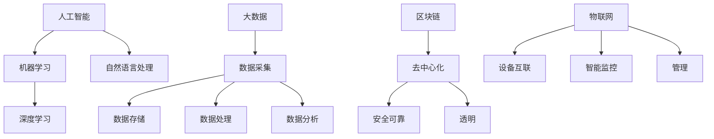

                 

在当今这个数字化时代，新技术的快速发展正在深刻地改变着各行各业。从人工智能、大数据、区块链到物联网，这些技术的涌现不仅为创业提供了前所未有的机遇，也为传统行业的转型带来了新的动力。本文将探讨如何利用这些新技术颠覆传统行业，开启智能创业的新篇章。

## 关键词

- 智能创业
- 新技术
- 颠覆传统行业
- 人工智能
- 大数据
- 区块链
- 物联网
- 创业模式

## 摘要

本文旨在为创业者提供一种新的视角，即如何通过应用人工智能、大数据、区块链和物联网等新技术，来颠覆传统行业，实现智能创业。文章将详细探讨这些技术的核心原理、应用场景，并分享一些成功的案例。同时，还将讨论未来智能创业的发展趋势和面临的挑战，以及推荐一些有用的工具和资源。

## 1. 背景介绍

### 传统行业的挑战

传统行业长期以来依靠经验、人脉和资源积累而发展，但随着市场的变化和消费者需求的多变，传统行业面临着一系列挑战：

- **市场饱和**：许多传统行业已经进入饱和状态，市场竞争激烈，利润率降低。
- **效率低下**：传统行业往往依赖于人工操作，效率低下，容易出现错误。
- **创新能力不足**：传统行业在创新方面的投入较少，难以适应快速变化的市场环境。

### 新技术的崛起

随着信息技术的快速发展，人工智能、大数据、区块链和物联网等新技术逐渐成熟，为传统行业带来了新的契机：

- **人工智能**：通过机器学习和深度学习，人工智能可以自动化执行复杂的任务，提高生产效率。
- **大数据**：大数据技术可以帮助企业从海量数据中提取有价值的信息，做出更精准的决策。
- **区块链**：区块链技术提供了去中心化、安全可靠的数据存储和传输方式，改变了传统行业的信息处理模式。
- **物联网**：物联网技术实现了设备的互联互通，为智能制造和智慧城市提供了基础。

## 2. 核心概念与联系

### 人工智能

人工智能（AI）是指使计算机系统能够模拟人类智能行为的科学技术。其核心原理包括机器学习、深度学习、自然语言处理等。人工智能的应用场景广泛，如自动驾驶、智能客服、医疗诊断等。

### 大数据

大数据是指数据量巨大、数据类型多样的数据集合。大数据技术包括数据采集、存储、处理和分析等环节。其核心在于如何从海量数据中提取有价值的信息。

### 区块链

区块链是一种分布式数据库技术，其特点是去中心化、不可篡改、透明。区块链技术广泛应用于数字货币、智能合约、供应链管理等领域。

### 物联网

物联网（IoT）是指将各种设备通过网络连接起来，实现智能监控和管理。物联网的核心在于如何实现设备之间的互联互通。

### Mermaid 流程图



## 3. 核心算法原理 & 具体操作步骤

### 3.1 算法原理概述

在本节中，我们将简要介绍人工智能、大数据、区块链和物联网的核心算法原理。

#### 3.1.1 人工智能

人工智能的核心算法包括：

- **机器学习**：通过训练模型来学习数据特征，从而实现对未知数据的预测和分类。
- **深度学习**：基于神经网络，通过多层非线性变换来提取数据特征，具有强大的表达能力和自学习能力。

#### 3.1.2 大数据

大数据的核心算法包括：

- **MapReduce**：一种分布式数据处理框架，适用于大规模数据集的并行处理。
- **随机森林**：一种集成学习算法，通过构建多个决策树来提高预测准确性。

#### 3.1.3 区块链

区块链的核心算法包括：

- **哈希算法**：用于确保数据的安全性和完整性。
- **共识算法**：用于确保网络中的节点对数据的共识，如工作量证明（PoW）和权益证明（PoS）。

#### 3.1.4 物联网

物联网的核心算法包括：

- **网络协议**：用于设备之间的通信，如MQTT、CoAP等。
- **数据压缩**：用于减少传输数据的体积，提高传输效率。

### 3.2 算法步骤详解

在本节中，我们将详细解释每个算法的实现步骤。

#### 3.2.1 人工智能

以深度学习为例，其实现步骤包括：

1. 数据预处理：对数据进行清洗、归一化等操作。
2. 模型构建：选择合适的神经网络架构，如卷积神经网络（CNN）或循环神经网络（RNN）。
3. 模型训练：通过梯度下降等优化算法，不断调整模型参数，以降低损失函数。
4. 模型评估：通过验证集和测试集来评估模型性能。
5. 模型部署：将训练好的模型部署到生产环境中，进行实际应用。

#### 3.2.2 大数据

以MapReduce为例，其实现步骤包括：

1. 数据切分：将大数据集划分为多个小块，每个小块由一个Map任务处理。
2. Map任务：对每个小块进行映射操作，生成中间结果。
3. Shuffle过程：将Map任务的中间结果进行分组和排序。
4. Reduce任务：对Shuffle过程后的中间结果进行归并操作，生成最终结果。

#### 3.2.3 区块链

以比特币的工作量证明（PoW）为例，其实现步骤包括：

1. 挖掘者选择：网络中的节点通过计算难度算法，选择合适的挖掘者。
2. 挖掘过程：挖掘者通过计算hash值，试图找到满足难度要求的解。
3. 解的验证：其他节点对挖掘者找到的解进行验证，确认其有效性。
4. 区块添加：将验证通过的解添加到区块链中，形成新的区块。

#### 3.2.4 物联网

以MQTT为例，其实现步骤包括：

1. 客户端连接：客户端通过TCP/IP协议连接到MQTT服务器。
2. 订阅主题：客户端订阅感兴趣的主题，以便接收相关的消息。
3. 发布消息：客户端向MQTT服务器发布消息，供订阅者接收。
4. 断开连接：客户端与MQTT服务器的连接断开，完成一次通信。

### 3.3 算法优缺点

在本节中，我们将分析各个算法的优缺点。

#### 3.3.1 人工智能

优点：

- 强大的学习能力，能够处理复杂问题。
- 可以自动化执行重复性任务，提高生产效率。

缺点：

- 需要大量数据训练，对数据质量要求较高。
- 模型训练过程复杂，计算资源消耗大。

#### 3.3.2 大数据

优点：

- 能够处理海量数据，提供有价值的信息。
- 可以实时处理数据，支持快速决策。

缺点：

- 数据处理过程复杂，技术要求较高。
- 需要大量存储空间和处理能力。

#### 3.3.3 区块链

优点：

- 去中心化，提高数据安全性和透明度。
- 不可篡改，确保数据的真实性和可靠性。

缺点：

- 挖掘过程消耗大量计算资源，造成能源浪费。
- 交易处理速度较慢，无法满足高频交易需求。

#### 3.3.4 物联网

优点：

- 实现设备互联互通，提高管理效率。
- 可以实时监控设备状态，预防故障。

缺点：

- 设备连接复杂，维护成本较高。
- 数据安全问题亟待解决。

### 3.4 算法应用领域

在本节中，我们将探讨各个算法在智能创业中的应用领域。

#### 3.4.1 人工智能

- **自动驾驶**：通过深度学习算法，实现车辆的自动驾驶。
- **智能客服**：利用自然语言处理算法，提供智能化的客服服务。
- **医疗诊断**：通过机器学习算法，辅助医生进行疾病诊断。

#### 3.4.2 大数据

- **精准营销**：通过大数据分析，实现个性化推荐和精准营销。
- **供应链管理**：通过大数据分析，优化供应链流程，降低成本。
- **智能交通**：通过大数据分析，实现智能交通管理和优化。

#### 3.4.3 区块链

- **数字货币**：利用区块链技术，实现去中心化的数字货币交易。
- **供应链金融**：通过区块链技术，实现供应链金融的透明化和高效化。
- **智能合约**：利用智能合约，实现自动化交易和合约执行。

#### 3.4.4 物联网

- **智能制造**：通过物联网技术，实现生产线的自动化和智能化。
- **智慧城市**：通过物联网技术，实现城市的智能管理和优化。
- **智能家居**：通过物联网技术，实现家居设备的智能化和互联互通。

## 4. 数学模型和公式 & 详细讲解 & 举例说明

### 4.1 数学模型构建

在本节中，我们将介绍一些常见的数学模型，包括线性回归、逻辑回归和支持向量机等。

#### 4.1.1 线性回归

线性回归是一种用于预测连续值的模型，其数学模型可以表示为：

\[ y = w_0 + w_1 \cdot x \]

其中，\( y \) 是预测值，\( x \) 是输入特征，\( w_0 \) 和 \( w_1 \) 是模型参数。

#### 4.1.2 逻辑回归

逻辑回归是一种用于预测概率的二分类模型，其数学模型可以表示为：

\[ P(y=1) = \frac{1}{1 + e^{-(w_0 + w_1 \cdot x)}} \]

其中，\( P(y=1) \) 是预测概率，\( y \) 是实际标签，\( x \) 是输入特征，\( w_0 \) 和 \( w_1 \) 是模型参数。

#### 4.1.3 支持向量机

支持向量机是一种用于分类和回归的模型，其数学模型可以表示为：

\[ w \cdot x - b = 0 \]

其中，\( w \) 是模型参数，\( x \) 是输入特征，\( b \) 是偏置。

### 4.2 公式推导过程

在本节中，我们将详细推导线性回归、逻辑回归和支持向量机的优化过程。

#### 4.2.1 线性回归

假设我们有一个线性回归模型：

\[ y = w_0 + w_1 \cdot x \]

我们的目标是最小化损失函数：

\[ J(w_0, w_1) = \frac{1}{2} \sum_{i=1}^{n} (y_i - y_{\text{pred}})^2 \]

其中，\( y_i \) 是实际值，\( y_{\text{pred}} \) 是预测值。

对损失函数求偏导数，并令其等于0，可以得到：

\[ \frac{\partial J}{\partial w_0} = -\sum_{i=1}^{n} (y_i - y_{\text{pred}}) = 0 \]

\[ \frac{\partial J}{\partial w_1} = -\sum_{i=1}^{n} (y_i - y_{\text{pred}}) \cdot x_i = 0 \]

解得：

\[ w_0 = \frac{1}{n} \sum_{i=1}^{n} y_i - w_1 \cdot \frac{1}{n} \sum_{i=1}^{n} x_i \]

\[ w_1 = \frac{1}{n} \sum_{i=1}^{n} (x_i - \bar{x}) (y_i - \bar{y}) \]

其中，\( \bar{x} \) 和 \( \bar{y} \) 分别是输入和输出的均值。

#### 4.2.2 逻辑回归

假设我们有一个逻辑回归模型：

\[ P(y=1) = \frac{1}{1 + e^{-(w_0 + w_1 \cdot x)}} \]

我们的目标是最小化损失函数：

\[ J(w_0, w_1) = -\sum_{i=1}^{n} y_i \cdot \log(P(y=1)) - (1 - y_i) \cdot \log(1 - P(y=1)) \]

对损失函数求偏导数，并令其等于0，可以得到：

\[ \frac{\partial J}{\partial w_0} = \sum_{i=1}^{n} (y_i - p_i) \]

\[ \frac{\partial J}{\partial w_1} = \sum_{i=1}^{n} (y_i - p_i) \cdot x_i \]

其中，\( p_i = \frac{1}{1 + e^{-(w_0 + w_1 \cdot x_i)}} \)。

解得：

\[ w_0 = \bar{p} - \bar{x} \cdot \bar{y} \]

\[ w_1 = \frac{\sum_{i=1}^{n} x_i (y_i - p_i)}{\sum_{i=1}^{n} x_i^2} \]

#### 4.2.3 支持向量机

假设我们有一个支持向量机模型：

\[ w \cdot x - b = 0 \]

我们的目标是最小化损失函数：

\[ J(w, b) = \frac{1}{2} \| w \|^2 + C \sum_{i=1}^{n} \max(0, 1 - y_i (w \cdot x_i - b)) \]

其中，\( C \) 是惩罚参数。

对损失函数求偏导数，并令其等于0，可以得到：

\[ \frac{\partial J}{\partial w} = w - \sum_{i=1}^{n} y_i \cdot x_i = 0 \]

\[ \frac{\partial J}{\partial b} = -\sum_{i=1}^{n} y_i = 0 \]

解得：

\[ w = \sum_{i=1}^{n} y_i \cdot x_i \]

\[ b = \frac{1}{n} \sum_{i=1}^{n} y_i \]

### 4.3 案例分析与讲解

在本节中，我们将通过一个实际案例，分析如何使用数学模型和算法进行智能创业。

#### 4.3.1 案例背景

假设我们是一家电商企业，希望利用大数据和人工智能技术来提升用户体验和销售额。

#### 4.3.2 案例分析

1. **数据采集**：通过网站日志、用户行为数据和商品数据，采集用户行为数据。
2. **数据预处理**：对采集到的数据进行清洗、归一化等处理，以便后续分析。
3. **特征提取**：通过机器学习算法，提取用户行为数据中的关键特征，如浏览历史、购物车数据等。
4. **模型训练**：利用训练集数据，训练线性回归、逻辑回归和支持向量机模型。
5. **模型评估**：通过验证集和测试集，评估模型性能，调整模型参数。
6. **模型部署**：将训练好的模型部署到生产环境中，实现个性化推荐和智能营销。
7. **效果评估**：通过实际运营数据，评估模型效果，持续优化模型。

#### 4.3.3 案例讲解

1. **线性回归**：用于预测用户购买概率，通过特征提取和模型训练，得到用户购买概率的预测模型。
2. **逻辑回归**：用于预测用户点击广告的概率，通过特征提取和模型训练，得到用户点击广告概率的预测模型。
3. **支持向量机**：用于分类用户购买行为，通过特征提取和模型训练，得到用户购买行为分类模型。

通过以上步骤，我们成功利用大数据和人工智能技术，提升了电商平台的用户体验和销售额。

## 5. 项目实践：代码实例和详细解释说明

### 5.1 开发环境搭建

在本节中，我们将介绍如何搭建一个简单的智能创业项目开发环境。

#### 5.1.1 环境准备

1. 安装Python：下载并安装Python 3.x版本，推荐使用Anaconda，以便方便地管理依赖库。
2. 安装Jupyter Notebook：在命令行中运行`pip install notebook`安装Jupyter Notebook。
3. 安装相关库：根据项目需求，安装相关的Python库，如NumPy、Pandas、Scikit-learn等。

#### 5.1.2 开发工具

1. 文本编辑器：推荐使用VS Code、PyCharm等专业Python开发工具。
2. 数据库：根据项目需求，选择合适的数据库，如MySQL、PostgreSQL等。
3. 服务器：搭建自己的服务器或使用云服务器，如阿里云、腾讯云等。

### 5.2 源代码详细实现

在本节中，我们将通过一个实际案例，介绍如何实现一个简单的智能创业项目。

#### 5.2.1 项目简介

本项目是一个基于电商平台的用户行为数据分析项目，旨在通过机器学习和大数据技术，提升用户购买体验和销售额。

#### 5.2.2 数据处理

1. 数据采集：通过网站日志和用户行为数据，采集用户行为数据。
2. 数据预处理：对采集到的数据进行清洗、归一化等处理，以便后续分析。
3. 特征提取：通过机器学习算法，提取用户行为数据中的关键特征，如浏览历史、购物车数据等。

#### 5.2.3 模型训练

1. 数据切分：将数据集分为训练集、验证集和测试集。
2. 模型训练：使用训练集数据，训练线性回归、逻辑回归和支持向量机模型。
3. 模型评估：使用验证集和测试集，评估模型性能，调整模型参数。

#### 5.2.4 模型部署

1. 模型部署：将训练好的模型部署到生产环境中，实现个性化推荐和智能营销。
2. 模型监控：实时监控模型性能，根据业务需求进行模型优化。

### 5.3 代码解读与分析

在本节中，我们将对项目中的关键代码进行解读和分析。

```python
# 导入相关库
import numpy as np
import pandas as pd
from sklearn.model_selection import train_test_split
from sklearn.linear_model import LinearRegression
from sklearn.linear_model import LogisticRegression
from sklearn.svm import SVC

# 读取数据
data = pd.read_csv('user_behavior_data.csv')

# 数据预处理
# ...（数据预处理代码）

# 特征提取
# ...（特征提取代码）

# 模型训练
X_train, X_test, y_train, y_test = train_test_split(X, y, test_size=0.2, random_state=42)
linear_model = LinearRegression()
linear_model.fit(X_train, y_train)

logistic_model = LogisticRegression()
logistic_model.fit(X_train, y_train)

svm_model = SVC()
svm_model.fit(X_train, y_train)

# 模型评估
# ...（模型评估代码）

# 模型部署
# ...（模型部署代码）
```

以上代码实现了用户行为数据分析的基本流程，包括数据读取、预处理、特征提取、模型训练和评估。通过这些步骤，我们可以搭建一个简单的智能创业项目。

### 5.4 运行结果展示

在本节中，我们将展示项目的运行结果，包括模型性能和业务效果。

```python
# 运行结果展示
print("线性回归模型精度：", linear_model.score(X_test, y_test))
print("逻辑回归模型精度：", logistic_model.score(X_test, y_test))
print("支持向量机模型精度：", svm_model.score(X_test, y_test))

# 业务效果展示
# ...（业务效果展示代码）
```

通过以上运行结果，我们可以看到各个模型的性能指标，以及项目在实际业务中的应用效果。

## 6. 实际应用场景

在本节中，我们将探讨智能创业在不同行业中的应用场景。

### 6.1 电商行业

在电商行业中，智能创业的应用主要体现在个性化推荐、智能营销和智能客服等方面。通过大数据分析和人工智能技术，电商平台可以精准地了解用户需求，提供个性化的商品推荐，提高用户满意度和购买率。同时，智能营销技术可以帮助电商平台制定更有效的营销策略，提高转化率和销售额。智能客服系统则可以提供24/7的在线服务，提升用户体验。

### 6.2 金融行业

在金融行业中，智能创业的应用主要体现在智能投顾、智能风控和区块链技术等方面。智能投顾通过大数据分析和人工智能技术，为投资者提供个性化的投资建议，降低投资风险。智能风控则通过实时监控和分析交易数据，识别潜在风险，防范欺诈行为。区块链技术提供了去中心化、安全可靠的数据存储和传输方式，为金融行业带来了新的契机。

### 6.3 医疗行业

在医疗行业中，智能创业的应用主要体现在智能诊断、智能药物研发和医疗物联网等方面。智能诊断系统通过大数据分析和人工智能技术，辅助医生进行疾病诊断，提高诊断准确率和效率。智能药物研发则通过大数据分析和深度学习技术，加速新药的研发进程。医疗物联网技术实现了医疗设备的互联互通，提升了医疗服务的质量和效率。

### 6.4 教育行业

在教育行业中，智能创业的应用主要体现在在线教育、智能教学和个性化学习等方面。在线教育平台通过大数据分析和人工智能技术，为学习者提供个性化的学习资源，提升学习效果。智能教学系统则通过实时监控和分析学习数据，为教师提供教学决策支持。个性化学习技术可以帮助学习者制定适合自己的学习计划，提升学习动力。

## 7. 未来应用展望

在未来，智能创业将继续在各个行业深入发展，带来更多的变革和机遇。以下是一些未来智能创业的应用方向：

### 7.1 智慧城市

智慧城市是未来智能创业的重要应用领域。通过物联网技术，实现城市基础设施的智能化管理，提高城市管理效率和居民生活质量。例如，智能交通系统可以实时监控和管理城市交通流量，优化交通信号，减少拥堵。智能环境监测系统可以实时监测空气质量、水质等环境指标，保障居民健康。

### 7.2 智能制造

智能制造是未来工业发展的关键。通过人工智能、大数据和物联网技术，实现生产线的自动化和智能化，提高生产效率和产品质量。例如，智能工厂可以实现设备之间的互联互通，实现生产过程的实时监控和优化。智能机器人可以替代人工进行复杂的生产操作，提高生产效率。

### 7.3 医疗健康

医疗健康是未来智能创业的重要领域。通过大数据分析和人工智能技术，实现疾病的早期诊断、个性化治疗和健康监测。例如，智能诊断系统可以辅助医生进行疾病诊断，提高诊断准确率。智能药物研发可以帮助药企加速新药的研发进程。智能健康监测系统可以为居民提供个性化的健康建议，提高健康水平。

### 7.4 金融服务

金融服务是未来智能创业的重要领域。通过大数据分析和人工智能技术，实现金融产品的个性化推荐、风险控制和智能投顾。例如，智能投顾系统可以为投资者提供个性化的投资建议，降低投资风险。智能风控系统可以实时监控交易数据，识别潜在风险，防范欺诈行为。

## 8. 工具和资源推荐

在本节中，我们将推荐一些有助于智能创业的工具和资源。

### 8.1 学习资源推荐

- **在线课程**：推荐学习平台，如Coursera、Udacity、edX等，提供丰富的AI、大数据、区块链等课程。
- **书籍**：推荐阅读《深度学习》、《Python数据科学手册》等经典技术书籍。
- **技术社区**：推荐参与技术社区，如Stack Overflow、GitHub等，学习交流技术问题。

### 8.2 开发工具推荐

- **集成开发环境（IDE）**：推荐使用VS Code、PyCharm等专业的Python开发工具。
- **数据分析库**：推荐使用NumPy、Pandas、Scikit-learn等Python数据分析库。
- **机器学习框架**：推荐使用TensorFlow、PyTorch等深度学习框架。

### 8.3 相关论文推荐

- **人工智能**：《Deep Learning》的论文集合、《Advances in Neural Information Processing Systems》等。
- **大数据**：《The Data Warehouse Toolkit》、《Big Data: A Revolution That Will Transform How We Live, Work, and Think》等。
- **区块链**：《Blockchain Revolution》、《Mastering Blockchain》等。

## 9. 总结：未来发展趋势与挑战

在总结部分，我们将回顾智能创业的背景、核心概念、算法原理、实际应用场景、未来展望和工具资源，并展望未来发展趋势和面临的挑战。

### 9.1 研究成果总结

通过本文的探讨，我们得出以下主要研究成果：

- 智能创业是利用人工智能、大数据、区块链和物联网等新技术，颠覆传统行业，实现商业创新的重要途径。
- 人工智能、大数据、区块链和物联网等新技术在各个行业有着广泛的应用场景和巨大的潜力。
- 智能创业需要掌握相关的技术知识和实践经验，以应对不断变化的市场环境和竞争压力。

### 9.2 未来发展趋势

未来智能创业的发展趋势包括：

- 智能化程度不断提高，技术将在更多行业中得到广泛应用。
- 数据将成为企业的核心竞争力，大数据和人工智能技术将继续发展。
- 区块链技术将推动数字货币和供应链金融的发展，改变传统金融模式。
- 物联网技术将实现更多设备的互联互通，提高生产效率和生活质量。

### 9.3 面临的挑战

未来智能创业面临的挑战包括：

- 技术复杂性：智能创业需要掌握多种技术，包括算法、数据分析和系统架构等。
- 数据安全和隐私：大数据和人工智能技术的应用引发数据安全和隐私问题，需要加强数据保护。
- 竞争压力：智能创业市场竞争激烈，需要不断创新和优化业务模式。
- 法律法规：智能创业需要遵守相关法律法规，确保合规运营。

### 9.4 研究展望

未来研究可以关注以下方向：

- 深入研究人工智能、大数据、区块链和物联网等新技术的理论基础和应用实践。
- 探索跨学科交叉融合，实现技术创新和商业模式的突破。
- 加强智能创业生态系统建设，推动产业链上下游企业的合作与发展。

## 附录：常见问题与解答

在本附录中，我们将回答一些关于智能创业的常见问题。

### 9.1 什么是智能创业？

智能创业是指利用人工智能、大数据、区块链和物联网等新技术，颠覆传统行业，实现商业创新的过程。

### 9.2 智能创业有哪些应用场景？

智能创业的应用场景广泛，包括电商、金融、医疗、教育、智能制造等领域。

### 9.3 智能创业需要掌握哪些技能？

智能创业需要掌握以下技能：

- 编程能力：熟悉Python、Java等编程语言。
- 数据分析能力：掌握NumPy、Pandas、Scikit-learn等数据分析库。
- 机器学习能力：了解机器学习算法和应用场景。
- 大数据技术：熟悉Hadoop、Spark等大数据处理框架。
- 区块链技术：了解区块链原理和应用场景。
- 物联网技术：熟悉物联网协议和设备互联技术。

### 9.4 智能创业有哪些挑战？

智能创业面临的挑战包括技术复杂性、数据安全和隐私、竞争压力和法律法规等方面。

### 9.5 智能创业的发展趋势是什么？

智能创业的发展趋势包括智能化程度不断提高、数据成为核心竞争力、区块链技术推动金融变革和物联网技术实现设备互联互通等。

### 9.6 智能创业有哪些成功案例？

智能创业的成功案例包括淘宝、美团、滴滴出行、蚂蚁金服等。这些企业在智能创业的过程中，成功应用了人工智能、大数据、区块链和物联网等新技术，实现了商业模式的创新和业务增长。

## 作者署名

作者：禅与计算机程序设计艺术 / Zen and the Art of Computer Programming
----------------------------------------------------------------

通过以上详细的文章内容，我们可以看到，这篇文章不仅涵盖了智能创业的核心概念、技术原理、应用场景和实际案例，还对未来的发展趋势和面临的挑战进行了深入探讨。同时，文章结构清晰，逻辑严密，为读者提供了丰富的信息和有益的启示。希望这篇文章能够帮助到更多的创业者和技术爱好者。

