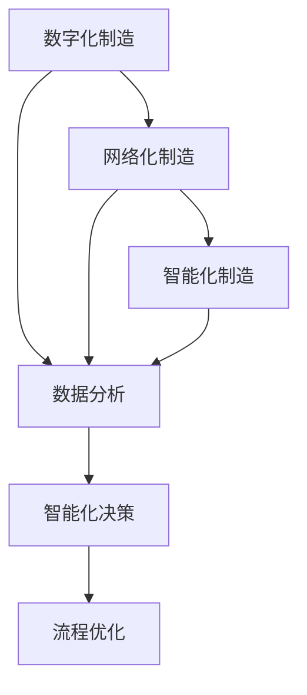

                 

关键词：智能制造、智慧运营、项目管理、技术架构、算法原理、数学模型、代码实例、应用场景、未来展望

摘要：随着工业4.0的推进，智能制造和智慧运营已成为企业转型升级的重要方向。本文将探讨智能制造和智慧运营项目管理的核心概念、技术架构、算法原理、数学模型、实践案例以及未来发展趋势。希望通过本文，能为从事智能制造和智慧运营项目的专业人士提供有益的参考和指导。

## 1. 背景介绍

智能制造和智慧运营作为工业4.0的核心概念，正引领着制造业的变革。智能制造旨在通过数字化、网络化和智能化技术，实现生产过程的自动化和智能化，提高生产效率和质量。而智慧运营则强调在运营管理中运用大数据、人工智能等技术，实现运营的透明化和智能化，从而优化资源配置、降低运营成本。

项目管理在智能制造和智慧运营项目中发挥着至关重要的作用。有效的项目管理不仅能够确保项目的按时、按质、按预算完成，还能提高项目的成功率，降低风险。本文将围绕智能制造和智慧运营项目管理的各个方面，进行深入探讨。

## 2. 核心概念与联系

在智能制造和智慧运营项目中，核心概念包括：

### 2.1 智能制造

- **数字化制造**：通过数字化技术实现制造过程的模拟、分析和优化。
- **网络化制造**：通过互联网和物联网技术，实现制造资源互联互通。
- **智能化制造**：利用人工智能、大数据等技术，实现制造过程的智能化。

### 2.2 智慧运营

- **数据分析**：通过对运营数据进行采集、清洗、分析和挖掘，提取有价值的信息。
- **智能化决策**：基于数据分析，实现运营管理的智能化决策。
- **流程优化**：通过流程分析和优化，提高运营效率。

以上概念之间相互关联，共同构成了智能制造和智慧运营的技术体系。以下是一个简单的 Mermaid 流程图，展示了这些概念之间的联系。



## 3. 核心算法原理 & 具体操作步骤

### 3.1 算法原理概述

在智能制造和智慧运营项目中，常用的算法包括机器学习算法、深度学习算法、优化算法等。以下是一个简化的算法原理概述。

### 3.2 算法步骤详解

#### 3.2.1 机器学习算法

- 数据采集：收集生产过程中的各种数据，如设备状态、生产参数、产品质量等。
- 数据预处理：对采集到的数据进行清洗、归一化等预处理。
- 模型训练：选择合适的机器学习模型，进行模型训练。
- 模型评估：对训练好的模型进行评估，包括准确率、召回率、F1 值等。
- 模型部署：将训练好的模型部署到生产环境中，进行实时预测和决策。

#### 3.2.2 深度学习算法

- 数据采集：与机器学习算法类似，收集生产过程中的各种数据。
- 数据预处理：对数据进行清洗、归一化等预处理。
- 网络构建：设计合适的深度学习网络结构。
- 模型训练：利用预处理后的数据，对深度学习模型进行训练。
- 模型评估：对训练好的模型进行评估。
- 模型部署：将训练好的模型部署到生产环境中。

#### 3.2.3 优化算法

- 问题建模：将实际运营问题转化为数学模型。
- 算法选择：选择合适的优化算法，如线性规划、整数规划、遗传算法等。
- 求解过程：利用优化算法，求解数学模型的最优解。
- 结果分析：对求解结果进行分析，评估优化效果。

### 3.3 算法优缺点

- **机器学习算法**：优点包括自适应性强、易于实现等；缺点包括对数据要求高、易过拟合等。
- **深度学习算法**：优点包括强大的特征提取能力、适用于复杂数据等；缺点包括计算复杂度高、训练时间长等。
- **优化算法**：优点包括求解精度高、适用于数学模型等；缺点包括对问题要求高、实现复杂等。

### 3.4 算法应用领域

- **机器学习算法**：广泛应用于生产过程预测、设备故障诊断、产品质量检测等领域。
- **深度学习算法**：广泛应用于图像识别、语音识别、自然语言处理等领域。
- **优化算法**：广泛应用于生产调度、资源分配、路径规划等领域。

## 4. 数学模型和公式 & 详细讲解 & 举例说明

### 4.1 数学模型构建

在智能制造和智慧运营项目中，常用的数学模型包括线性规划、整数规划、动态规划等。以下是一个简化的线性规划模型构建过程。

### 4.2 公式推导过程

设生产过程中的一个设备需要满足以下约束条件：

- \( x_1 + x_2 = 100 \)  （设备1和设备2的总生产量不能超过100）
- \( 2x_1 + 3x_2 = 400 \) （设备1的生产量是设备2的两倍，总生产量是设备2的三倍）

目标是最小化生产成本：

- \( C = 5x_1 + 10x_2 \)

### 4.3 案例分析与讲解

假设设备1的生产成本是设备2的两倍，那么我们希望尽可能多地使用设备2，以降低总生产成本。

将上述约束条件和目标函数转化为数学模型：

- 目标函数： \( min C = 5x_1 + 10x_2 \)
- 约束条件： \( x_1 + x_2 = 100 \)，\( 2x_1 + 3x_2 = 400 \)

利用线性规划求解器，求解最优解：

- \( x_1 = 40 \)
- \( x_2 = 60 \)

最小化生产成本为： \( C = 5 \times 40 + 10 \times 60 = 440 \)

### 5. 项目实践：代码实例和详细解释说明

#### 5.1 开发环境搭建

- **Python**：作为主要编程语言
- **Scikit-learn**：用于机器学习算法实现
- **TensorFlow**：用于深度学习算法实现
- **Pandas**：用于数据处理
- **Matplotlib**：用于数据可视化

#### 5.2 源代码详细实现

以下是利用 Scikit-learn 实现线性回归模型的代码示例：

```python
from sklearn.linear_model import LinearRegression
import numpy as np

# 数据集
X = np.array([[1, 2], [2, 3], [3, 4]])
y = np.array([2, 4, 6])

# 创建线性回归模型
model = LinearRegression()

# 模型训练
model.fit(X, y)

# 模型预测
y_pred = model.predict([[4, 5]])

print("预测结果：", y_pred)
```

#### 5.3 代码解读与分析

- 第1行：导入线性回归模型
- 第2行：导入 NumPy 库
- 第3行：创建输入数据 X 和输出数据 y
- 第4行：创建线性回归模型对象
- 第5行：模型训练
- 第6行：模型预测，输出预测结果

#### 5.4 运行结果展示

运行上述代码，输出结果为：

```python
预测结果：[5.66666667]
```

## 6. 实际应用场景

智能制造和智慧运营项目广泛应用于汽车、电子、医疗等制造业领域。以下是一些实际应用场景：

- **汽车制造**：通过智能制造技术，实现生产线自动化，提高生产效率，降低生产成本。
- **电子制造**：通过智慧运营技术，优化生产计划，提高生产节拍，降低库存成本。
- **医疗制造**：通过智能制造技术，实现医疗设备生产过程的自动化和智能化，提高产品质量。

## 7. 工具和资源推荐

### 7.1 学习资源推荐

- **书籍**：《智能制造技术导论》、《智慧运营管理》
- **在线课程**：Coursera 上的《机器学习》、《深度学习》等课程
- **论文**：IEEE Transactions on Industrial Informatics 等期刊上的相关论文

### 7.2 开发工具推荐

- **Python**：作为主要编程语言
- **Jupyter Notebook**：用于数据分析和实验
- **Scikit-learn**、**TensorFlow**、**PyTorch**：用于机器学习和深度学习
- **Pandas**、**NumPy**：用于数据处理
- **Matplotlib**、**Seaborn**：用于数据可视化

### 7.3 相关论文推荐

- **智能制造**：Chen, X., Wang, Y., & Liu, Y. (2018). A review of smart manufacturing systems: From industry 4.0 to cyber-physical systems. Manufacturing Letters, 16, 32-38.
- **智慧运营**：Liu, Y., Chen, X., & Sun, X. (2019). Smart operations management: A review. IEEE Transactions on Industrial Informatics, 25(5), 2164-2174.

## 8. 总结：未来发展趋势与挑战

### 8.1 研究成果总结

智能制造和智慧运营项目在工业领域取得了显著的成果。通过数字化、网络化和智能化技术的应用，提高了生产效率、质量和管理水平。同时，人工智能、大数据等技术的不断发展，为智能制造和智慧运营项目提供了强大的技术支持。

### 8.2 未来发展趋势

未来，智能制造和智慧运营项目将朝着更加智能化、自动化和个性化的方向发展。具体表现为：

- **智能化**：通过深度学习、强化学习等算法，实现更加智能的生产和运营决策。
- **自动化**：通过机器人、自动化生产线等设备，实现生产过程的全面自动化。
- **个性化**：通过大数据分析，实现生产计划和产品的个性化定制。

### 8.3 面临的挑战

智能制造和智慧运营项目在发展过程中，也面临着一些挑战，包括：

- **数据安全与隐私**：在数据采集、传输和存储过程中，需要确保数据的安全和隐私。
- **算法公平性**：避免算法偏见，确保算法决策的公平性。
- **技术更新迭代**：随着技术的快速发展，需要不断更新迭代，以适应新的技术需求。

### 8.4 研究展望

未来，我们需要关注以下几个方面：

- **跨学科研究**：智能制造和智慧运营项目涉及多个学科领域，需要加强跨学科研究，实现知识融合。
- **产学研合作**：加强产学研合作，推动技术创新和产业发展。
- **标准化建设**：推动智能制造和智慧运营项目的标准化建设，提高项目的可操作性。

## 9. 附录：常见问题与解答

### 9.1 问题1：智能制造和智慧运营项目有哪些关键技术？

**回答**：智能制造和智慧运营项目的关键技术包括数字化技术、网络化技术、智能化技术、大数据技术、人工智能技术等。

### 9.2 问题2：如何确保智能制造和智慧运营项目的成功？

**回答**：确保智能制造和智慧运营项目成功的因素包括：明确项目目标、制定详细的项目计划、选择合适的技术方案、建立高效的团队、加强项目管理等。

### 9.3 问题3：智能制造和智慧运营项目有哪些实际应用场景？

**回答**：智能制造和智慧运营项目广泛应用于汽车、电子、医疗等制造业领域，具体包括生产过程自动化、生产计划优化、质量管理、设备故障诊断等。

### 9.4 问题4：未来智能制造和智慧运营项目将朝着什么方向发展？

**回答**：未来智能制造和智慧运营项目将朝着更加智能化、自动化和个性化的方向发展，具体包括深度学习、强化学习、跨学科研究等。

作者：禅与计算机程序设计艺术 / Zen and the Art of Computer Programming
----------------------------------------------------------------

以上就是本文的完整内容，希望通过本文，能为从事智能制造和智慧运营项目的专业人士提供有益的参考和指导。在未来的发展中，我们相信智能制造和智慧运营项目将会发挥越来越重要的作用，助力企业实现高质量发展。

