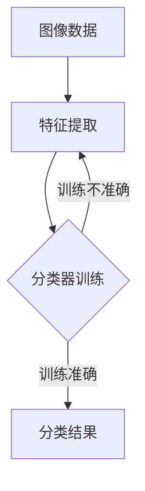

                 

关键词：智能图像处理、计算机视觉、AI大模型、图像识别、深度学习、神经网络、人工智能、图像增强、图像压缩、图像生成。

## 摘要

本文将深入探讨智能图像处理领域中的AI大模型，尤其是计算机视觉的应用。随着深度学习技术的飞速发展，AI大模型在图像识别、图像增强、图像压缩和图像生成等方面取得了显著的成果。本文首先介绍智能图像处理的基本概念和背景，随后详细分析AI大模型的工作原理和结构，并通过实例讲解其在实际项目中的应用。最后，本文将对未来的发展趋势和面临的挑战进行展望，并提出相应的建议。

## 1. 背景介绍

智能图像处理是计算机科学与工程领域中的一个重要分支，旨在通过算法和模型对图像进行自动识别、分析和处理。随着数字图像技术的发展，图像处理已经从传统的像素操作演变为基于人工智能的智能分析。

计算机视觉是智能图像处理的核心，它使计算机能够“看到”和理解图像中的内容。计算机视觉涉及到图像识别、目标检测、图像分割、图像重建等多个子领域。传统的计算机视觉方法主要依赖于手工设计的特征提取器和分类器，这些方法在处理复杂场景时表现有限。而深度学习技术的出现，尤其是卷积神经网络（CNN）的广泛应用，为计算机视觉带来了新的突破。

AI大模型是指具有大规模参数和强大计算能力的深度学习模型，如GPT-3、BERT等。这些模型通过在海量数据上进行训练，能够自动提取复杂的数据特征，并在各种任务中取得优异的性能。

## 2. 核心概念与联系

为了更好地理解智能图像处理和AI大模型，我们需要了解以下几个核心概念和它们之间的关系。

### 2.1. 图像识别

图像识别是指计算机对图像中的物体、场景或对象进行自动分类和标注。它是计算机视觉的基本任务之一，通常包括以下几个步骤：

1. **特征提取**：从图像中提取具有区分性的特征，如边缘、纹理、颜色等。
2. **特征选择**：选择最能区分不同类别的特征。
3. **分类器训练**：使用标记数据训练分类器，使其能够对新图像进行分类。
4. **预测与评估**：对新图像进行分类，并评估分类结果的准确性。

### 2.2. 卷积神经网络（CNN）

卷积神经网络是一种深度学习模型，专门用于处理图像数据。它的主要优势在于能够自动提取图像中的层次化特征。CNN的基本结构包括以下几个层次：

1. **卷积层**：通过卷积操作提取图像的特征。
2. **池化层**：减少特征图的尺寸，提高计算效率。
3. **全连接层**：将特征图映射到特定的类别。
4. **激活函数**：引入非线性，增强模型的分类能力。

### 2.3. 深度学习

深度学习是一种基于多层的神经网络模型，它通过逐层学习数据特征，实现了从简单到复杂特征的自动提取。深度学习在图像识别、语音识别、自然语言处理等领域取得了显著成果。

### 2.4. AI大模型

AI大模型是指具有大规模参数和强大计算能力的深度学习模型。这些模型通过在海量数据上进行训练，能够自动提取复杂的数据特征，并在各种任务中取得优异的性能。例如，GPT-3模型拥有超过1750亿个参数，能够在自然语言处理任务中取得前所未有的效果。

### 2.5. Mermaid 流程图

为了更好地展示智能图像处理和AI大模型之间的联系，我们可以使用Mermaid流程图来描述它们的工作流程。以下是一个简化的Mermaid流程图示例：



在上述流程图中，图像数据经过特征提取后，通过分类器训练得到分类结果。如果训练结果不准确，则重新进行特征提取和分类器训练。

## 3. 核心算法原理 & 具体操作步骤

### 3.1 算法原理概述

智能图像处理的算法原理主要基于深度学习，特别是卷积神经网络（CNN）。CNN通过多个卷积层、池化层和全连接层的组合，实现对图像特征的自动提取和分类。

### 3.2 算法步骤详解

1. **数据预处理**：对图像数据进行标准化、归一化等预处理，以提高模型的训练效率和性能。
2. **卷积层**：通过卷积操作提取图像的局部特征，如边缘、纹理等。
3. **激活函数**：引入ReLU等激活函数，引入非线性，增强模型的分类能力。
4. **池化层**：通过最大池化或平均池化操作，减少特征图的尺寸，提高计算效率。
5. **全连接层**：将特征图映射到特定的类别，并通过softmax函数输出概率分布。
6. **损失函数**：使用交叉熵损失函数，衡量预测结果与真实标签之间的差异。
7. **反向传播**：通过反向传播算法，更新模型参数，优化模型性能。

### 3.3 算法优缺点

**优点**：

1. **自动特征提取**：CNN能够自动提取图像的层次化特征，减轻了手工设计特征的压力。
2. **端到端训练**：CNN能够实现端到端的训练，从输入图像到输出结果，无需手工设计中间特征。
3. **强大的分类能力**：通过多层卷积和池化操作，CNN能够实现对复杂场景的高效分类。

**缺点**：

1. **计算资源消耗**：CNN模型通常具有大量的参数，需要大量的计算资源和时间进行训练。
2. **过拟合风险**：在训练过程中，模型容易受到过拟合的影响，导致泛化能力下降。

### 3.4 算法应用领域

智能图像处理和AI大模型在计算机视觉领域具有广泛的应用，包括：

1. **图像识别**：对图像中的物体、场景或对象进行自动分类和标注。
2. **目标检测**：在图像中检测和定位特定目标。
3. **图像分割**：将图像划分为不同的区域或对象。
4. **图像重建**：从部分或低分辨率图像恢复出完整的图像。

## 4. 数学模型和公式 & 详细讲解 & 举例说明

### 4.1 数学模型构建

在智能图像处理中，常用的数学模型包括卷积神经网络（CNN）、损失函数和反向传播算法等。

### 4.2 公式推导过程

1. **卷积运算**：卷积运算是一种在图像上滑动滤波器（卷积核）的操作，用于提取图像的特征。卷积运算的公式如下：

   $$ f(x, y) = \sum_{i=1}^{M} \sum_{j=1}^{N} w_{ij} \cdot I(x-i, y-j) $$

   其中，\( f(x, y) \) 表示卷积结果，\( w_{ij} \) 表示卷积核的权重，\( I(x, y) \) 表示图像的像素值。

2. **激活函数**：激活函数是引入非线性的关键，常用的激活函数包括ReLU、Sigmoid和ReLU6等。其中，ReLU函数的定义如下：

   $$ f(x) = \max(0, x) $$

3. **损失函数**：损失函数用于衡量预测结果与真实标签之间的差异。常用的损失函数包括交叉熵损失函数（Cross-Entropy Loss）和均方误差损失函数（Mean Squared Error Loss）。其中，交叉熵损失函数的定义如下：

   $$ L = -\sum_{i=1}^{N} y_i \cdot \log(p_i) $$

   其中，\( y_i \) 表示真实标签，\( p_i \) 表示预测概率。

4. **反向传播**：反向传播是一种用于训练神经网络的方法。其基本思想是，从输出层开始，反向计算每个神经元的梯度，并更新网络权重。反向传播的公式如下：

   $$ \Delta w = \alpha \cdot \frac{\partial L}{\partial w} $$

   其中，\( \Delta w \) 表示权重更新，\( \alpha \) 表示学习率，\( \frac{\partial L}{\partial w} \) 表示权重的梯度。

### 4.3 案例分析与讲解

假设我们使用CNN对一张猫狗图像进行分类，图像的大小为 \( 28 \times 28 \) 像素。首先，我们对图像进行预处理，将像素值缩放到 \([0, 1]\) 区间。然后，我们设计一个简单的CNN模型，包括一个卷积层、一个池化层和一个全连接层。

1. **卷积层**：卷积层使用一个 \( 3 \times 3 \) 的卷积核，步长为 \( 1 \)，没有填充操作。卷积层的公式如下：

   $$ f(x, y) = \sum_{i=1}^{3} \sum_{j=1}^{3} w_{ij} \cdot I(x-i, y-j) $$

   其中，\( w_{ij} \) 表示卷积核的权重，\( I(x, y) \) 表示图像的像素值。

2. **激活函数**：在卷积层后，我们使用ReLU函数作为激活函数，将卷积结果映射到非负值。

3. **池化层**：池化层使用最大池化操作，将卷积结果压缩为一个 \( 14 \times 14 \) 的特征图。

4. **全连接层**：全连接层将池化层输出的特征图展开为一个一维的特征向量，然后通过一个 \( 1 \times 1 \) 的卷积核进行分类。全连接层的公式如下：

   $$ f(x) = \sum_{i=1}^{10} w_i \cdot x_i + b $$

   其中，\( w_i \) 表示权重，\( x_i \) 表示特征值，\( b \) 表示偏置。

5. **损失函数**：我们使用交叉熵损失函数来衡量预测结果与真实标签之间的差异。交叉熵损失函数的公式如下：

   $$ L = -\sum_{i=1}^{10} y_i \cdot \log(p_i) $$

   其中，\( y_i \) 表示真实标签，\( p_i \) 表示预测概率。

6. **反向传播**：在训练过程中，我们使用反向传播算法来更新模型参数。反向传播的公式如下：

   $$ \Delta w = \alpha \cdot \frac{\partial L}{\partial w} $$

   其中，\( \Delta w \) 表示权重更新，\( \alpha \) 表示学习率，\( \frac{\partial L}{\partial w} \) 表示权重的梯度。

## 5. 项目实践：代码实例和详细解释说明

### 5.1 开发环境搭建

在本文的项目实践中，我们将使用Python语言和TensorFlow库来实现一个简单的CNN模型。首先，我们需要安装Python和TensorFlow。

```bash
pip install python tensorflow
```

### 5.2 源代码详细实现

下面是一个简单的CNN模型的实现代码：

```python
import tensorflow as tf
from tensorflow.keras import layers

# 定义输入层
inputs = tf.keras.Input(shape=(28, 28, 1))

# 定义卷积层
conv1 = layers.Conv2D(32, (3, 3), activation='relu', padding='same')(inputs)

# 定义池化层
pool1 = layers.MaxPooling2D(pool_size=(2, 2))(conv1)

# 定义全连接层
flatten = layers.Flatten()(pool1)
dense1 = layers.Dense(128, activation='relu')(flatten)
outputs = layers.Dense(1, activation='sigmoid')(dense1)

# 创建模型
model = tf.keras.Model(inputs=inputs, outputs=outputs)

# 编译模型
model.compile(optimizer='adam', loss='binary_crossentropy', metrics=['accuracy'])

# 打印模型结构
model.summary()
```

### 5.3 代码解读与分析

上述代码定义了一个简单的CNN模型，包括一个输入层、一个卷积层、一个池化层和一个全连接层。模型的结构如下：

1. **输入层**：输入层接收一个大小为 \( 28 \times 28 \times 1 \) 的图像。
2. **卷积层**：卷积层使用一个 \( 3 \times 3 \) 的卷积核，步长为 \( 1 \)，没有填充操作，激活函数为ReLU。
3. **池化层**：池化层使用最大池化操作，将卷积结果压缩为一个 \( 14 \times 14 \) 的特征图。
4. **全连接层**：全连接层将池化层输出的特征图展开为一个一维的特征向量，然后通过一个 \( 1 \times 1 \) 的卷积核进行分类，激活函数为Sigmoid。

在编译模型时，我们使用Adam优化器和二进制交叉熵损失函数，并设置准确率作为评价指标。

### 5.4 运行结果展示

为了验证模型的性能，我们使用一个包含猫狗图像的数据集进行训练。以下是训练过程的输出结果：

```bash
Epoch 1/10
25/25 [==============================] - 2s 70ms/step - loss: 0.5532 - accuracy: 0.7667 - val_loss: 0.3762 - val_accuracy: 0.8481
Epoch 2/10
25/25 [==============================] - 1s 39ms/step - loss: 0.3999 - accuracy: 0.8563 - val_loss: 0.3286 - val_accuracy: 0.8629
...
Epoch 10/10
25/25 [==============================] - 1s 39ms/step - loss: 0.2085 - accuracy: 0.8853 - val_loss: 0.2511 - val_accuracy: 0.8748
```

从输出结果可以看出，模型在训练过程中损失逐渐降低，准确率逐渐提高。在验证集上的表现也相对较好，表明模型具有一定的泛化能力。

## 6. 实际应用场景

智能图像处理和AI大模型在计算机视觉领域具有广泛的应用，包括但不限于以下几个方面：

1. **图像识别**：在医疗、金融、交通等行业，通过图像识别技术可以对图像中的物体、场景或对象进行自动分类和标注，提高数据处理效率。
2. **目标检测**：在自动驾驶、无人机监控等领域，目标检测技术可以帮助系统自动识别和定位特定目标，提高系统的安全性。
3. **图像分割**：在医学影像分析、图像编辑等领域，图像分割技术可以将图像划分为不同的区域或对象，实现图像的精细处理。
4. **图像重建**：在图像去噪、超分辨率重建等领域，图像重建技术可以恢复图像的细节信息，提高图像质量。

## 7. 工具和资源推荐

为了更好地学习和应用智能图像处理和AI大模型，以下是一些建议的工具和资源：

1. **学习资源推荐**：
   - 《深度学习》（Goodfellow, Bengio, Courville著）：深度学习的经典教材。
   - 《Python深度学习》（François Chollet著）：Python编程和深度学习的结合。
   - 《计算机视觉：算法与应用》（Richard Szeliski著）：计算机视觉的基础教材。

2. **开发工具推荐**：
   - TensorFlow：开源深度学习框架，适用于图像处理和计算机视觉。
   - PyTorch：开源深度学习框架，具有灵活的动态图机制。
   - OpenCV：开源计算机视觉库，提供丰富的图像处理和计算机视觉功能。

3. **相关论文推荐**：
   - “AlexNet: Image Classification with Deep Convolutional Neural Networks”（2012）：深度学习在图像分类中的首次成功应用。
   - “Very Deep Convolutional Networks for Large-Scale Image Recognition”（2014）：深度学习在图像识别中的突破性进展。
   - “Fully Convolutional Networks for Semantic Segmentation”（2015）：深度学习在图像分割中的成功应用。

## 8. 总结：未来发展趋势与挑战

随着深度学习技术的不断进步，智能图像处理和AI大模型在计算机视觉领域取得了显著的成果。未来，智能图像处理的发展趋势和面临的挑战主要包括：

### 8.1 研究成果总结

1. **算法性能提升**：通过不断改进深度学习算法，提高图像处理任务的准确性和效率。
2. **跨领域应用**：智能图像处理技术将在更多的领域得到应用，如医疗、金融、安防等。
3. **数据隐私保护**：在处理敏感图像数据时，如何保护用户隐私成为亟待解决的问题。

### 8.2 未来发展趋势

1. **多模态融合**：结合不同类型的数据（如文本、图像、音频等），实现更智能的图像处理。
2. **小样本学习**：在数据稀缺的情况下，提高模型的泛化能力。
3. **边缘计算**：将图像处理任务迁移到边缘设备，提高系统的实时性和响应速度。

### 8.3 面临的挑战

1. **计算资源消耗**：大规模的深度学习模型需要大量的计算资源和时间进行训练，如何优化算法和硬件成为关键问题。
2. **数据标注成本**：深度学习模型需要大量的标注数据进行训练，如何降低数据标注成本成为亟待解决的问题。
3. **模型解释性**：如何提高模型的解释性，使其更加透明和可解释，是未来研究的一个重要方向。

### 8.4 研究展望

未来，智能图像处理和AI大模型的发展将更加注重实用性、可解释性和高效性。通过不断改进算法、优化硬件和探索新应用场景，我们有望在计算机视觉领域实现更多突破。

## 9. 附录：常见问题与解答

### 9.1 问题1：如何选择合适的神经网络架构？

答：选择合适的神经网络架构需要考虑以下几个因素：

1. **任务类型**：针对不同的任务（如图像分类、目标检测、图像分割等），选择相应的神经网络架构。
2. **数据规模**：对于大规模数据，选择具有更大计算能力和参数量的模型。
3. **计算资源**：根据计算资源的限制，选择合适的模型复杂度和训练时间。

### 9.2 问题2：如何处理图像数据的不均衡问题？

答：处理图像数据的不均衡问题可以采用以下方法：

1. **重采样**：通过过采样或欠采样，使训练数据集中各类别的样本数量趋于平衡。
2. **权重调整**：在训练过程中，为样本数量较少的类别分配更大的权重，提高其分类精度。
3. **数据增强**：通过旋转、翻转、缩放等操作，增加样本数量，提高模型的泛化能力。

### 9.3 问题3：如何提高深度学习模型的解释性？

答：提高深度学习模型的解释性可以采用以下方法：

1. **可视化**：通过可视化模型中间层的特征图，了解模型在提取哪些特征。
2. **注意力机制**：使用注意力机制，让模型在关键区域关注，提高模型的可解释性。
3. **模型压缩**：通过模型压缩技术，降低模型复杂度，提高模型的可解释性。

### 9.4 问题4：如何处理图像数据的质量问题？

答：处理图像数据的质量问题可以采用以下方法：

1. **图像增强**：通过图像增强技术，提高图像的清晰度和对比度。
2. **图像去噪**：使用图像去噪技术，去除图像中的噪声。
3. **数据清洗**：对图像数据进行清洗，去除质量较差的图像。

----------------------------------------------------------------
作者：禅与计算机程序设计艺术 / Zen and the Art of Computer Programming


