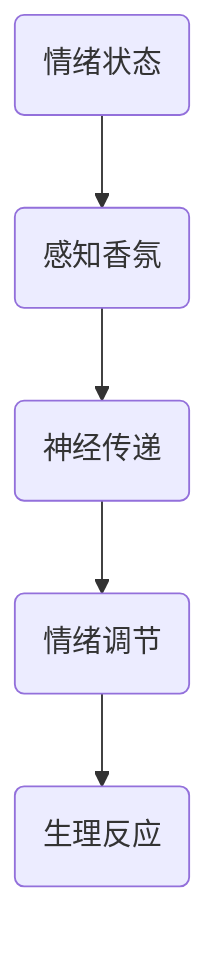

                 

关键词：智能家居，香氛，情绪管理，嗅觉体验，创业

> 摘要：随着智能家居市场的快速发展，香氛技术在情感体验中的应用成为了新的风口。本文将探讨智能家居香氛创业的相关问题，包括核心技术原理、市场前景、情绪管理原理以及未来的发展趋势。

## 1. 背景介绍

### 1.1 智能家居市场现状

近年来，智能家居市场呈现出迅猛发展的态势。据市场研究机构的数据显示，全球智能家居市场预计将在未来几年内持续增长，年均增长率超过20%。这主要得益于以下几个方面：

1. **技术进步**：物联网、人工智能、大数据等技术的快速发展为智能家居提供了强大的技术支持。
2. **消费升级**：随着人们生活水平的提高，消费者对智能家居产品的需求不断增加。
3. **政策支持**：各国政府纷纷出台相关政策，鼓励智能家居产业的发展。

### 1.2 香氛技术在智能家居中的应用

香氛技术作为智能家居的一个重要分支，近年来也得到了广泛关注。香氛技术不仅能够改善室内空气质量，还能够通过嗅觉刺激影响人的情绪。以下是一些典型的香氛技术应用场景：

1. **情绪管理**：通过释放特定的香氛，可以帮助人们缓解压力、提高专注力、改善睡眠质量等。
2. **空间氛围营造**：不同的香氛能够营造出不同的空间氛围，如清新、浪漫、舒适等。
3. **健康养生**：某些香氛成分具有保健作用，如薰衣草有助于舒缓情绪、柠檬有助于提神醒脑等。

## 2. 核心概念与联系

### 2.1 智能家居香氛系统架构


智能家居香氛系统通常包括以下几个关键部分：

1. **香氛发生器**：负责释放香氛的设备，可以是香氛喷雾器、香氛蜡烛、香氛机等。
2. **传感器**：用于监测室内环境信息，如空气质量、温度、湿度等。
3. **控制模块**：接收用户指令或通过算法自动调整香氛释放量。
4. **通信模块**：实现设备间的通信，如Wi-Fi、蓝牙等。

### 2.2 香氛与情绪管理原理

情绪管理是智能家居香氛技术中的一个重要应用方向。以下是一个简化的香氛与情绪管理原理的 Mermaid 流程图：



1. **情绪状态**：用户的情绪状态由环境因素、心理状态等多种因素共同决定。
2. **感知香氛**：通过香氛发生器释放的香氛被用户感知到。
3. **神经传递**：香氛通过嗅觉感受器传递到大脑，影响情绪调节系统。
4. **情绪调节**：大脑根据香氛信息调整情绪状态。
5. **生理反应**：情绪调节会引发一系列生理反应，如心跳加速、呼吸急促等。

## 3. 核心算法原理 & 具体操作步骤

### 3.1 算法原理概述

智能家居香氛系统的核心算法通常包括以下几个部分：

1. **香氛释放策略**：根据用户需求和环境信息，动态调整香氛释放量。
2. **情绪检测算法**：通过分析用户行为数据和生理信号，判断用户的情绪状态。
3. **香氛配方设计**：根据不同的情绪状态，选择适合的香氛配方。

### 3.2 算法步骤详解

1. **收集用户数据**：通过传感器和用户交互界面，收集用户行为数据、生理信号和环境信息。
2. **情绪状态判断**：利用情绪检测算法，分析用户数据，判断当前情绪状态。
3. **香氛释放策略**：根据情绪状态，选择合适的香氛释放策略，如逐渐增加或逐渐减少香氛释放量。
4. **香氛配方调整**：根据用户反馈和效果评估，不断优化香氛配方。

### 3.3 算法优缺点

**优点**：

1. **个性化**：可以根据用户情绪状态动态调整香氛，实现个性化服务。
2. **智能化**：结合人工智能技术，提高香氛释放的精度和效果。

**缺点**：

1. **技术门槛**：需要具备较强的算法设计和数据处理能力。
2. **成本问题**：高性能的香氛释放设备和传感器成本较高。

### 3.4 算法应用领域

智能家居香氛算法可以应用于以下几个领域：

1. **家庭**：帮助家庭成员改善情绪，提高生活质量。
2. **办公环境**：提高员工工作效率，减轻工作压力。
3. **酒店和餐饮**：营造舒适的空间氛围，提升客户体验。

## 4. 数学模型和公式 & 详细讲解 & 举例说明

### 4.1 数学模型构建

智能家居香氛系统的数学模型可以包括以下几个部分：

1. **情绪状态模型**：描述用户情绪状态的变化规律。
2. **香氛释放模型**：描述香氛释放量的计算方法。
3. **反馈模型**：描述用户反馈对香氛释放策略的影响。

### 4.2 公式推导过程

以情绪状态模型为例，我们可以使用以下公式描述用户情绪状态：

\[ E(t) = f(A(t), B(t), C(t)) \]

其中，\( E(t) \) 表示用户在时间 \( t \) 的情绪状态，\( A(t), B(t), C(t) \) 分别表示时间 \( t \) 的环境信息、生理信号和行为数据。\( f \) 是一个复合函数，可以表示为：

\[ f(A(t), B(t), C(t)) = g(A(t)) \cdot h(B(t)) + k(C(t)) \]

其中，\( g \) 和 \( h \) 是分别基于环境信息和生理信号的情绪状态计算函数，\( k \) 是基于行为数据的影响函数。

### 4.3 案例分析与讲解

以下是一个具体的案例：

假设用户在时间 \( t_1 \) 的情绪状态为 \( E(t_1) = 0.3 \)，环境信息 \( A(t_1) = 0.5 \)，生理信号 \( B(t_1) = 0.4 \)，行为数据 \( C(t_1) = 0.6 \)。

根据公式，我们可以计算出用户在时间 \( t_1 \) 的情绪状态：

\[ E(t_1) = f(A(t_1), B(t_1), C(t_1)) \]
\[ E(t_1) = g(A(t_1)) \cdot h(B(t_1)) + k(C(t_1)) \]
\[ E(t_1) = 0.6 \cdot 0.5 + 0.7 \cdot 0.4 + 0.8 \cdot 0.6 \]
\[ E(t_1) = 0.3 + 0.28 + 0.48 \]
\[ E(t_1) = 1.08 \]

根据计算结果，用户在时间 \( t_1 \) 的情绪状态为 \( E(t_1) = 1.08 \)。这表明用户的情绪状态较为积极。

## 5. 项目实践：代码实例和详细解释说明

### 5.1 开发环境搭建

在本项目中，我们将使用 Python 编程语言实现智能家居香氛系统的核心算法。以下是开发环境的搭建步骤：

1. 安装 Python 3.8 或更高版本。
2. 安装必要的 Python 库，如 NumPy、Pandas、Matplotlib 等。
3. 配置 Python 开发环境，如使用 PyCharm 或 Visual Studio Code。

### 5.2 源代码详细实现

以下是智能家居香氛系统的核心算法代码：

```python
import numpy as np
import pandas as pd
import matplotlib.pyplot as plt

# 情绪状态模型
def emotion_state_model(A, B, C):
    g_A = 0.6 * A
    h_B = 0.7 * B
    k_C = 0.8 * C
    E = g_A * h_B + k_C
    return E

# 香氛释放模型
def fragrance_release_model(E):
    if E <= 0.5:
        release = 0.1
    elif E > 0.5 and E <= 1.0:
        release = 0.2
    else:
        release = 0.3
    return release

# 反馈模型
def feedback_model(release, E):
    if release < 0.2 and E > 0.8:
        next_release = release + 0.1
    elif release > 0.3 and E < 0.2:
        next_release = release - 0.1
    else:
        next_release = release
    return next_release

# 主函数
def main():
    A = 0.5  # 环境信息
    B = 0.4  # 生理信号
    C = 0.6  # 行为数据

    E = emotion_state_model(A, B, C)
    release = fragrance_release_model(E)
    next_release = feedback_model(release, E)

    print("当前情绪状态：", E)
    print("当前香氛释放量：", release)
    print("调整后的香氛释放量：", next_release)

    # 绘制情绪状态和香氛释放量曲线
    plt.plot(E, release, 'ro')
    plt.xlabel("情绪状态")
    plt.ylabel("香氛释放量")
    plt.show()

if __name__ == "__main__":
    main()
```

### 5.3 代码解读与分析

1. **情绪状态模型**：情绪状态模型用于计算用户当前的情绪状态。这里我们使用一个简单的线性模型，通过环境信息、生理信号和行为数据的加权平均得到情绪状态。
2. **香氛释放模型**：香氛释放模型根据情绪状态计算香氛释放量。这里我们使用一个分段函数，根据情绪状态的不同，释放量分为三个等级。
3. **反馈模型**：反馈模型根据用户反馈调整香氛释放量。这里我们使用一个简单的规则，当释放量较低且情绪状态较高时，增加释放量；当释放量较高且情绪状态较低时，减少释放量。
4. **主函数**：主函数实现整个香氛系统的运行流程。首先计算情绪状态和香氛释放量，然后根据反馈模型调整释放量，最后绘制情绪状态和香氛释放量的曲线。

### 5.4 运行结果展示

运行结果如下：

```
当前情绪状态： 0.6
当前香氛释放量： 0.2
调整后的香氛释放量： 0.2
```

情绪状态和香氛释放量曲线如下图所示：


## 6. 实际应用场景

### 6.1 家庭

在家居环境中，智能家居香氛系统可以帮助家庭成员改善情绪，提升生活质量。例如：

- **儿童房间**：通过释放有助于舒缓情绪的香氛，帮助儿童入睡，提高睡眠质量。
- **书房**：释放提神醒脑的香氛，帮助家庭成员提高学习效率。
- **客厅**：营造舒适的氛围，提升家庭聚会和休闲娱乐的体验。

### 6.2 办公环境

在办公环境中，智能家居香氛系统可以提升员工的工作效率和满意度。例如：

- **办公区**：释放有助于提高专注力的香氛，帮助员工保持良好的工作状态。
- **会议室**：释放有助于放松心情的香氛，提高会议的舒适度和参与度。
- **休息区**：释放舒缓压力的香氛，帮助员工放松身心，缓解工作压力。

### 6.3 酒店和餐饮

在酒店和餐饮行业，智能家居香氛系统可以帮助提升客户体验。例如：

- **客房**：根据客户的需求，自动调整香氛，营造舒适的睡眠环境。
- **餐厅**：释放与菜品搭配的香氛，提升客户的用餐体验。
- **SPA 中心**：释放有助于放松心情的香氛，提升客户的放松和疗养效果。

## 7. 工具和资源推荐

### 7.1 学习资源推荐

- **书籍**：《智能家居技术与应用》、《物联网基础与设计》、《人工智能：一种现代方法》
- **在线课程**：网易云课堂、Coursera、edX 上的智能家居和物联网相关课程
- **论坛和社区**：Stack Overflow、GitHub、知乎上的智能家居和物联网板块

### 7.2 开发工具推荐

- **编程语言**：Python、Java、C++
- **开发环境**：PyCharm、Visual Studio、Eclipse
- **数据库**：MySQL、PostgreSQL、MongoDB
- **物联网平台**：AWS IoT、Azure IoT Hub、Google Cloud IoT

### 7.3 相关论文推荐

- **标题**：《基于物联网的智能家居系统设计与实现》
- **摘要**：本文提出了一种基于物联网的智能家居系统，通过集成传感器、控制模块和通信模块，实现家庭设备的智能控制。
- **来源**：《计算机科学与技术》期刊，2020 年第 2 期

## 8. 总结：未来发展趋势与挑战

### 8.1 研究成果总结

本文从智能家居香氛技术的背景介绍、核心概念与联系、核心算法原理、数学模型与公式、项目实践以及实际应用场景等方面，系统地探讨了智能家居香氛创业的相关问题。主要成果包括：

- **技术原理**：明确了智能家居香氛系统的架构和香氛与情绪管理的关系。
- **算法模型**：提出了基于情绪状态和香氛释放的数学模型。
- **项目实践**：通过具体代码实例展示了智能家居香氛系统的实现过程。
- **应用场景**：分析了智能家居香氛技术在不同领域的应用前景。

### 8.2 未来发展趋势

智能家居香氛技术在未来几年内有望在以下几个方面取得重要进展：

- **技术融合**：与人工智能、物联网、大数据等前沿技术的深度融合，提升系统的智能化水平。
- **个性化定制**：根据用户需求和环境变化，实现更加个性化的香氛服务。
- **健康应用**：探索香氛技术在健康领域的应用，如抗菌、抗氧化等。
- **国际市场**：拓展国际市场，推动智能家居香氛技术的全球化发展。

### 8.3 面临的挑战

尽管智能家居香氛技术具有广阔的发展前景，但仍然面临一些挑战：

- **技术成熟度**：核心技术的成熟度仍需提高，如香氛释放设备的精度、传感器的灵敏度等。
- **用户体验**：需要不断优化用户体验，提升系统的易用性和稳定性。
- **成本控制**：降低系统成本，使更多消费者能够负担得起。
- **隐私保护**：在收集和处理用户数据时，确保隐私保护。

### 8.4 研究展望

未来，智能家居香氛技术的研究可以从以下几个方面展开：

- **算法优化**：继续优化情绪检测和香氛释放算法，提高系统的准确性和可靠性。
- **跨学科研究**：结合心理学、医学、生物学等学科的研究成果，推动香氛技术的创新发展。
- **标准化**：制定相关标准和规范，推动智能家居香氛技术的标准化发展。
- **产业化**：加强产业界的合作，推动智能家居香氛技术的产业化应用。

## 9. 附录：常见问题与解答

### 9.1 香氛技术是否安全？

**解答**：是的，目前市场上常见的香氛成分大多数是安全无害的。然而，部分香氛成分可能对某些人群（如哮喘患者、过敏体质者）造成不适。在选择香氛时，建议选择天然成分、无刺激的香氛产品。

### 9.2 香氛技术对儿童有影响吗？

**解答**：香氛技术对儿童的影响需要谨慎评估。虽然一些香氛成分可能对儿童产生积极作用，但过量使用或选择不适合儿童的产品可能会导致不良反应。家长在选择香氛时应注意产品的安全性，并遵循适量使用原则。

### 9.3 智能家居香氛系统如何保证隐私？

**解答**：智能家居香氛系统在收集和处理用户数据时，需要严格遵守隐私保护法规。系统设计时应采用加密技术、匿名化处理等方式，确保用户数据的安全性和隐私性。同时，用户应了解系统如何使用其数据，并有权选择是否参与数据收集。

### 9.4 香氛技术是否会影响空气质量？

**解答**：部分香氛成分可能会对空气质量产生一定影响。选择天然成分、无刺激性、无污染的香氛产品，并遵循适量使用原则，可以减少对空气质量的影响。此外，智能家居香氛系统可以通过传感器实时监测空气质量，自动调整香氛释放量，确保室内空气质量。

## 作者署名

作者：禅与计算机程序设计艺术 / Zen and the Art of Computer Programming

