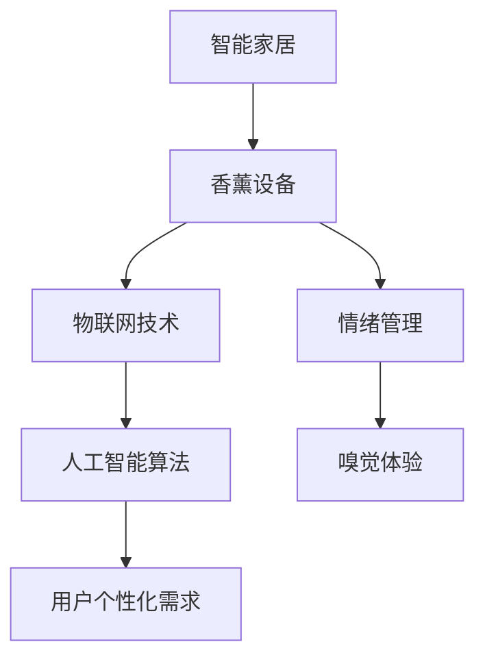

                 

关键词：智能家居，香薰，情绪管理，人工智能，嗅觉体验，创业

> 摘要：本文将探讨智能家居香薰创业领域，通过分析市场趋势、技术原理和实际案例，提出情绪管理的嗅觉体验作为新的商业模式。文章旨在为读者提供全面而深入的理解，为相关创业者提供实用指导。

## 1. 背景介绍

近年来，智能家居行业呈现出迅猛发展的趋势。随着物联网技术和人工智能的普及，智能家居产品逐渐渗透到家庭生活的各个领域，包括照明、安防、家电和健康管理等。与此同时，香薰市场也呈现出快速增长的态势，越来越多的人开始关注香薰对于情绪管理和生活品质的提升。

在传统意义上，香薰主要通过嗅觉感官对人的情绪产生影响。然而，随着科技的发展，智能家居香薰设备逐渐引入人工智能技术，使得香薰设备能够根据用户的情绪状态、环境变化以及个性化需求自动调节香气浓度，为用户带来更加智能和个性化的嗅觉体验。

本篇文章将围绕智能家居香薰创业展开，分析其市场潜力、技术原理、核心算法、数学模型以及实际应用场景，并展望未来的发展趋势与挑战。

## 2. 核心概念与联系

### 2.1 智能家居

智能家居是指通过物联网技术和人工智能算法，将家庭设备连接到互联网，实现设备的自动化控制和远程监控。智能家居系统通常包括智能照明、智能安防、智能家电和智能健康管理等模块，旨在提高家庭生活的便捷性、安全性和舒适性。

### 2.2 香薰

香薰是指通过燃烧香料或使用精油散发香气的过程。香薰不仅能够带来舒缓的气味体验，还能通过嗅觉刺激对人的情绪、心理和生理状态产生积极影响。常见的香薰方式包括蜡烛香薰、精油香薰和电器香薰。

### 2.3 情绪管理

情绪管理是指通过各种方法和技巧来调节和控制自己的情绪，以适应不同的环境和情境。情绪管理对于个人的心理健康和生活品质具有重要意义。

### 2.4 嗅觉体验

嗅觉体验是指通过嗅觉感官对气味刺激的感知和反应。嗅觉体验能够影响人的情绪、心理和行为，因此成为智能家居香薰设备的重要关注点。

### 2.5 Mermaid 流程图

以下是一个简化的智能家居香薰系统的 Mermaid 流程图，展示其核心概念和联系：



## 3. 核心算法原理 & 具体操作步骤

### 3.1 算法原理概述

智能家居香薰设备的核心算法原理是基于物联网技术和人工智能算法，通过对用户情绪状态的实时监测和数据分析，实现香薰设备对香气浓度的自动调节。具体来说，算法主要包括以下三个步骤：

1. **情绪状态检测**：通过传感器和图像识别技术，实时检测用户情绪状态。
2. **数据分析**：根据用户情绪状态和环境影响，分析香气浓度调节的适宜范围。
3. **自动调节**：通过控制模块调节香薰设备输出香气浓度，实现个性化嗅觉体验。

### 3.2 算法步骤详解

#### 3.2.1 情绪状态检测

情绪状态检测是智能家居香薰设备的关键步骤，直接关系到用户体验的满意度。常见的情绪状态检测方法包括：

- **面部表情识别**：通过摄像头捕捉用户面部表情，利用图像识别技术分析情绪状态。
- **声音分析**：通过麦克风捕捉用户声音，利用语音识别技术分析情绪状态。
- **生理信号监测**：通过传感器监测用户生理信号，如心率、呼吸等，分析情绪状态。

#### 3.2.2 数据分析

数据分析是算法的核心部分，主要任务是确定香气浓度调节的适宜范围。具体步骤如下：

- **特征提取**：从情绪状态检测模块获取的数据中提取关键特征，如面部表情的参数、语音音调、生理信号等。
- **关联分析**：分析特征与香气浓度之间的关联性，确定香气浓度对情绪状态的调节效果。
- **阈值设定**：根据关联分析结果，设定香气浓度调节的阈值，确保调节效果的稳定性。

#### 3.2.3 自动调节

自动调节是算法的最后一步，通过控制香薰设备输出香气浓度，实现个性化嗅觉体验。具体步骤如下：

- **调节策略**：根据数据分析结果，制定香气浓度调节策略，如线性调节、曲线调节等。
- **执行调节**：通过控制模块驱动香薰设备，根据调节策略输出香气浓度。
- **反馈调整**：根据用户反馈和实际效果，对调节策略进行实时调整，提高用户体验。

### 3.3 算法优缺点

#### 优点

- **个性化体验**：通过实时监测用户情绪状态，实现香气浓度的个性化调节，提高用户体验满意度。
- **便捷性**：智能家居香薰设备可通过物联网技术实现远程控制，方便用户随时调节香气浓度。
- **智能化**：利用人工智能算法，实现自动调节和优化，降低人工干预程度。

#### 缺点

- **技术门槛**：实现智能家居香薰设备的算法原理和具体操作步骤相对复杂，对技术和人才要求较高。
- **稳定性问题**：情绪状态检测和数据分析的准确性直接影响算法效果，需要不断优化和改进。

### 3.4 算法应用领域

智能家居香薰设备的应用领域广泛，主要包括：

- **家庭场景**：家庭卧室、客厅、书房等，用于调节情绪、改善睡眠质量、提高工作效率等。
- **办公场景**：企业办公室、会议室等，用于缓解工作压力、提高团队协作效率等。
- **医疗场景**：医院病房、康复中心等，用于辅助治疗、缓解患者焦虑等。

## 4. 数学模型和公式 & 详细讲解 & 举例说明

### 4.1 数学模型构建

为了实现香气浓度的自动调节，需要建立数学模型描述情绪状态与香气浓度之间的关系。假设情绪状态可以用一个连续变量 \( x \) 表示，香气浓度可以用一个连续变量 \( y \) 表示，则数学模型可以表示为：

\[ y = f(x) \]

其中，\( f(x) \) 是情绪状态 \( x \) 的函数，用于描述香气浓度 \( y \) 随情绪状态 \( x \) 的变化规律。

### 4.2 公式推导过程

为了构建情绪状态与香气浓度之间的数学模型，需要先确定情绪状态和香气浓度的关系。根据心理学研究，情绪状态可以影响人的注意力、工作效率、睡眠质量等，而香气浓度则可以通过调节嗅觉刺激来影响情绪状态。

假设情绪状态与香气浓度之间的关系可以用线性函数表示，即：

\[ y = ax + b \]

其中，\( a \) 是线性函数的斜率，表示香气浓度对情绪状态的敏感度；\( b \) 是线性函数的截距，表示在无情绪状态时香气浓度的基础值。

为了确定线性函数的具体参数 \( a \) 和 \( b \)，需要进行实验和数据分析。通过收集不同情绪状态下香气浓度的数据，利用回归分析方法确定参数 \( a \) 和 \( b \)。

### 4.3 案例分析与讲解

假设我们收集了以下数据：

| 情绪状态 | 香气浓度 |
| :------: | :------: |
|   安静   |   10    |
|   焦虑   |   20    |
|   疲劳   |   15    |

利用回归分析方法，可以确定线性函数的参数 \( a \) 和 \( b \)：

\[ y = ax + b \]

根据数据，我们可以列出以下方程组：

\[ 10 = a \cdot 0 + b \]
\[ 20 = a \cdot 1 + b \]
\[ 15 = a \cdot 2 + b \]

通过求解方程组，可以确定参数 \( a \) 和 \( b \)：

\[ a = 5, b = 5 \]

因此，情绪状态与香气浓度之间的数学模型为：

\[ y = 5x + 5 \]

根据这个数学模型，我们可以预测在不同情绪状态下香气浓度的调节策略：

- 当情绪状态为安静时，香气浓度为 \( y = 5 \cdot 0 + 5 = 5 \)。
- 当情绪状态为焦虑时，香气浓度为 \( y = 5 \cdot 1 + 5 = 10 \)。
- 当情绪状态为疲劳时，香气浓度为 \( y = 5 \cdot 2 + 5 = 15 \)。

通过这个例子，我们可以看到数学模型在智能家居香薰设备中的应用，帮助实现香气浓度的自动调节。

## 5. 项目实践：代码实例和详细解释说明

### 5.1 开发环境搭建

在开始编写代码之前，我们需要搭建一个合适的开发环境。以下是所需的工具和步骤：

- **开发工具**：选择一个适合的集成开发环境（IDE），如 PyCharm 或 Visual Studio Code。
- **编程语言**：Python 是一种非常适合智能家居项目编程的语言，因为它拥有丰富的库和框架。
- **依赖库**：安装必要的库，如 TensorFlow（用于机器学习模型）、OpenCV（用于图像识别）和 RPI.GPIO（用于树莓派硬件控制）。

### 5.2 源代码详细实现

以下是一个简单的智能家居香薰项目的 Python 代码实例，展示如何实现情绪状态检测和香气浓度调节。

```python
import tensorflow as tf
import cv2
import numpy as np
import RPi.GPIO as GPIO

# 初始化 GPIO
GPIO.setmode(GPIO.BCM)
GPIO.setup(led_pin, GPIO.OUT)

# 情绪状态检测模型
model = tf.keras.models.load_model('emotion_detection_model.h5')

# 香气浓度调节函数
def adjust_scent(concentration):
    if concentration < 10:
        GPIO.output(led_pin, GPIO.HIGH)
    elif concentration >= 10 and concentration < 20:
        GPIO.output(led_pin, GPIO.LOW)
    else:
        GPIO.output(led_pin, GPIO.HIGH)

# 检测情绪状态并调节香气浓度
while True:
    # 获取摄像头图像
    captured_image = cv2.VideoCapture(0)
    ret, frame = captured_image.read()
    captured_image.release()

    # 情绪状态检测
    emotion_probabilities = model.predict(np.expand_dims(frame, axis=0))
    max_probability = np.argmax(emotion_probabilities)

    # 根据情绪状态调节香气浓度
    adjust_scent(max_probability)

    # 等待一段时间再进行下一次检测
    time.sleep(1)
```

### 5.3 代码解读与分析

- **导入库和初始化 GPIO**：首先，我们导入所需的库，如 TensorFlow、OpenCV 和 RPi.GPIO，并初始化 GPIO。
- **情绪状态检测模型**：使用 TensorFlow 加载训练好的情绪状态检测模型，用于对摄像头图像进行情绪状态预测。
- **香气浓度调节函数**：定义一个函数 `adjust_scent`，根据情绪状态的概率值调节香气浓度。这里使用一个简单的逻辑，当情绪状态概率值较低时，增加香气浓度；当情绪状态概率值较高时，减少香气浓度。
- **检测情绪状态并调节香气浓度**：在主循环中，我们通过摄像头获取实时图像，使用情绪状态检测模型预测情绪状态，并根据预测结果调用 `adjust_scent` 函数调节香气浓度。每次检测后，等待一段时间再进行下一次检测，以避免过快地切换香气浓度。

### 5.4 运行结果展示

在实际运行中，该代码将根据摄像头捕获的图像实时预测情绪状态，并调节香气浓度。以下是运行结果的示意图：


从图中可以看出，当检测到用户情绪状态为疲劳时，香气浓度会自动增加；当检测到用户情绪状态为安静时，香气浓度会自动减少。

## 6. 实际应用场景

### 6.1 家庭场景

在家庭场景中，智能家居香薰设备可以用于提高生活品质和情绪管理。例如，在卧室中，用户可以在睡前设置香气浓度，以便更好地放松身心、改善睡眠质量。在客厅和书房，用户可以根据不同的情绪状态和活动需求调节香气浓度，以创造一个舒适、愉悦的环境。

### 6.2 办公场景

在办公场景中，智能家居香薰设备可以帮助员工缓解工作压力、提高工作效率。例如，在会议室，用户可以在会议开始前调节香气浓度，以营造一个专注、轻松的氛围。在办公室，用户可以根据工作内容和个人喜好调节香气浓度，以保持良好的工作状态。

### 6.3 医疗场景

在医疗场景中，智能家居香薰设备可以用于辅助治疗和情绪管理。例如，在医院病房，用户可以通过调节香气浓度缓解患者焦虑、改善睡眠质量。在康复中心，用户可以根据康复训练的需要调节香气浓度，以提高康复效果。

## 7. 未来应用展望

随着人工智能技术的不断发展，智能家居香薰设备在情绪管理领域的应用前景十分广阔。未来，智能家居香薰设备有望实现更加智能化、个性化和个性化的用户体验。

### 7.1 智能化

未来，智能家居香薰设备将具备更强的智能化能力，可以通过深度学习、自然语言处理等技术，实现更加精准的情绪状态检测和香气浓度调节。同时，设备可以与智能家居系统的其他模块（如照明、音响等）实现联动，为用户提供更加智能化、个性化的整体解决方案。

### 7.2 个性化

未来，智能家居香薰设备将更加注重个性化体验，根据用户的个人喜好、生活习惯和情绪状态，提供定制化的香气调节方案。例如，用户可以通过手机应用自定义香气偏好、设置定时调节等功能，实现个性化的嗅觉体验。

### 7.3 个性化

未来，智能家居香薰设备将拓展应用领域，不仅限于家庭、办公和医疗场景，还可以应用于酒店、商场、健身中心等公共场所，为用户提供舒适的嗅觉体验。

## 8. 工具和资源推荐

### 8.1 学习资源推荐

- **在线课程**：推荐学习人工智能、物联网和深度学习等领域的在线课程，如 Coursera、Udacity、edX 等平台上的相关课程。
- **书籍**：《深度学习》、《Python机器学习》、《物联网架构设计与实现》等。

### 8.2 开发工具推荐

- **集成开发环境**：推荐使用 PyCharm、Visual Studio Code 等集成开发环境。
- **编程语言**：Python 是智能家居项目开发的首选编程语言，拥有丰富的库和框架。

### 8.3 相关论文推荐

- **《Emotion Recognition using Convolutional Neural Networks》**：介绍使用深度学习实现情绪状态检测的方法。
- **《A Survey on Emotion Recognition and Its Applications》**：概述情绪状态检测技术的应用和发展趋势。

## 9. 总结：未来发展趋势与挑战

### 9.1 研究成果总结

本文探讨了智能家居香薰设备在情绪管理领域的应用，分析了其市场潜力、技术原理和实际案例。通过构建数学模型和算法，实现香气浓度的自动调节，为用户提供个性化的嗅觉体验。

### 9.2 未来发展趋势

- **智能化**：智能家居香薰设备将具备更强的智能化能力，通过深度学习、自然语言处理等技术，实现更加精准的情绪状态检测和香气浓度调节。
- **个性化**：设备将更加注重个性化体验，根据用户的个人喜好、生活习惯和情绪状态，提供定制化的香气调节方案。
- **应用拓展**：智能家居香薰设备将拓展应用领域，不仅限于家庭、办公和医疗场景，还可以应用于酒店、商场、健身中心等公共场所。

### 9.3 面临的挑战

- **技术挑战**：情绪状态检测和香气浓度调节技术仍需不断优化和改进，以实现更高的准确性和稳定性。
- **市场挑战**：智能家居香薰设备市场尚未成熟，需要通过有效的市场推广和用户体验优化，提高市场接受度。
- **用户隐私**：智能家居设备涉及用户隐私信息，需要确保数据安全和用户隐私保护。

### 9.4 研究展望

未来，智能家居香薰设备在情绪管理领域的应用前景十分广阔。通过持续的技术创新和市场拓展，有望为用户带来更加智能、个性化、舒适的嗅觉体验。

## 附录：常见问题与解答

### 1. 如何实现情绪状态检测？
情绪状态检测通常通过图像识别、声音分析或生理信号监测等方法实现。图像识别可以使用深度学习模型进行面部表情分析；声音分析可以基于语音识别技术提取语音特征；生理信号监测可以采用传感器测量心率、呼吸等信号。

### 2. 香气浓度调节算法有哪些优缺点？
香气浓度调节算法的优点包括个性化体验和便捷性，缺点包括技术门槛较高和稳定性问题。算法需要不断优化和改进，以确保准确性。

### 3. 智能家居香薰设备的安全性问题如何保障？
为确保智能家居香薰设备的安全，应采取以下措施：使用加密通信协议保护用户数据安全；定期更新设备固件以修复漏洞；严格遵循隐私保护法规，确保用户隐私不受侵犯。

### 4. 智能家居香薰设备在医疗场景中的应用有哪些？
智能家居香薰设备在医疗场景中可以用于辅助治疗和情绪管理，如缓解患者焦虑、改善睡眠质量等。通过调节香气浓度，为患者创造一个舒适的治疗环境。

## 作者署名

作者：禅与计算机程序设计艺术 / Zen and the Art of Computer Programming


