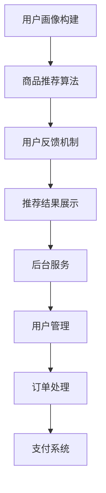

                 

关键词：智能导购、AI、电商、购物体验、效率、算法、数学模型、项目实践

> 摘要：随着人工智能技术的快速发展，智能导购系统在电商行业中的应用日益广泛，为消费者提供了更加个性化的购物体验和更高的购物效率。本文将深入探讨智能导购系统的核心概念、算法原理、数学模型、项目实践及其未来发展趋势，为电商企业提供技术参考。

## 1. 背景介绍

随着互联网技术的飞速发展，电子商务已经成为全球范围内的一种新兴商业模式。据Statista的数据显示，全球电子商务市场规模已达到数万亿美元，并持续保持高速增长。然而，在庞大的电商市场中，消费者面临着海量的商品信息和繁杂的购物流程，这使得购物体验变得复杂且低效。

传统电商平台的购物体验主要集中在商品搜索、筛选、购买和评价等环节。虽然这些功能在一定程度上提高了购物效率，但仍然存在以下问题：

1. **信息过载**：消费者在浏览商品时，常常面临信息过载的问题，难以快速找到自己所需商品。
2. **个性化不足**：传统电商平台难以根据消费者的购买习惯和偏好提供个性化的推荐，导致购物体验不够友好。
3. **购物流程繁琐**：从搜索、筛选到购买，消费者需要经过多个繁琐的步骤，影响了购物效率。

为了解决这些问题，人工智能技术应运而生，其中智能导购系统成为了电商行业的一大创新点。智能导购系统通过大数据分析、机器学习等技术，为消费者提供个性化的商品推荐，简化购物流程，从而提升购物体验和效率。

## 2. 核心概念与联系

### 2.1. 智能导购系统的定义

智能导购系统是一种基于人工智能技术的电子商务系统，旨在通过数据分析和个性化推荐，帮助消费者更快捷、更方便地找到所需商品。它包括以下几个核心组成部分：

1. **用户画像**：通过对用户的历史购买数据、浏览行为、评价等进行分析，构建用户的个性化画像。
2. **商品信息库**：包括商品的基本信息、属性、评价等，为推荐算法提供数据支持。
3. **推荐算法**：利用机器学习算法，对用户画像和商品信息进行匹配，生成个性化的商品推荐。
4. **用户反馈机制**：通过用户的反馈，不断优化推荐算法，提高推荐效果。

### 2.2. 智能导购系统的架构

智能导购系统的架构主要包括以下几个层次：

1. **数据层**：收集并存储用户行为数据、商品数据等，为推荐算法提供数据支持。
2. **算法层**：包括用户画像构建、商品推荐算法等，实现个性化推荐的核心功能。
3. **应用层**：前端展示层，将推荐结果呈现给用户，包括搜索结果、推荐列表、购物车等。
4. **服务层**：提供后台服务，包括用户管理、订单处理、支付等。

### 2.3. Mermaid 流程图



## 3. 核心算法原理 & 具体操作步骤

### 3.1. 算法原理概述

智能导购系统的核心算法主要包括用户画像构建、商品推荐算法和用户反馈机制。以下分别进行介绍：

#### 3.1.1. 用户画像构建

用户画像构建是通过分析用户的历史数据，如购买记录、浏览行为、评价等，提取用户的个性化特征，形成用户画像。常用的方法包括：

1. **基于协同过滤的方法**：通过分析用户之间的相似性，发现用户的共同偏好，从而构建用户画像。
2. **基于内容推荐的方法**：通过分析商品的内容特征，如标题、描述、标签等，为用户推荐相似的商品。
3. **基于深度学习的用户画像构建**：利用深度学习模型，如卷积神经网络（CNN）和循环神经网络（RNN），从用户行为数据中提取深层次的个性化特征。

#### 3.1.2. 商品推荐算法

商品推荐算法的核心任务是根据用户画像和商品信息，为用户推荐合适的商品。常见的推荐算法包括：

1. **基于协同过滤的推荐算法**：如矩阵分解、K最近邻（KNN）等，通过计算用户之间的相似性或商品之间的相似性进行推荐。
2. **基于内容的推荐算法**：如基于关键词匹配、基于语义分析等，通过分析商品的内容特征进行推荐。
3. **基于模型的推荐算法**：如基于隐语义模型的推荐算法，如LDA（Latent Dirichlet Allocation）等，通过建模用户和商品之间的关系进行推荐。

#### 3.1.3. 用户反馈机制

用户反馈机制是通过收集用户的点击、购买、评价等行为数据，对推荐结果进行评价和调整，以提高推荐效果。常见的用户反馈机制包括：

1. **基于用户点击行为的反馈**：根据用户的点击行为，对推荐结果进行评价和调整。
2. **基于用户购买行为的反馈**：根据用户的购买行为，对推荐结果进行评价和调整。
3. **基于用户评价的反馈**：根据用户对推荐商品的评分和评价，对推荐结果进行评价和调整。

### 3.2. 算法步骤详解

以下是一个基于协同过滤算法的智能导购系统操作步骤的示例：

#### 3.2.1. 用户画像构建

1. **收集用户数据**：从用户的购买记录、浏览历史、评价等数据中提取用户的个性化特征。
2. **数据预处理**：对数据进行清洗、去噪、归一化等处理，提高数据质量。
3. **特征提取**：利用文本挖掘、特征工程等方法，提取用户的个性化特征，如购买频率、购买品类、浏览时长等。

#### 3.2.2. 商品推荐算法

1. **计算用户相似性**：利用余弦相似度、皮尔逊相关系数等方法，计算用户之间的相似性。
2. **计算商品相似性**：利用词频-逆文档频率（TF-IDF）等方法，计算商品之间的相似性。
3. **生成推荐列表**：根据用户和商品的相似性，为每个用户生成一个推荐列表。

#### 3.2.3. 用户反馈机制

1. **收集用户反馈**：根据用户的点击、购买、评价等行为，收集用户的反馈数据。
2. **调整推荐结果**：根据用户反馈，对推荐结果进行调整，提高推荐效果。

### 3.3. 算法优缺点

#### 3.3.1. 优点

1. **个性化推荐**：通过分析用户的行为数据，为用户提供个性化的商品推荐，提高购物体验。
2. **提升购物效率**：简化购物流程，帮助用户快速找到所需商品，提高购物效率。
3. **实时调整**：根据用户的反馈，实时调整推荐结果，提高推荐效果。

#### 3.3.2. 缺点

1. **数据依赖性**：智能导购系统的效果很大程度上依赖于用户数据的质量，数据不足或质量差会影响推荐效果。
2. **冷启动问题**：对于新用户，由于缺乏历史数据，推荐系统难以生成个性化的推荐。
3. **计算成本**：协同过滤算法等推荐算法需要大量的计算资源，对于大规模用户和商品数据，计算成本较高。

### 3.4. 算法应用领域

智能导购系统在电商行业中的应用非常广泛，以下是一些常见的应用领域：

1. **电商平台**：通过智能导购系统，电商平台可以为用户提供个性化的商品推荐，提高用户留存率和购物转化率。
2. **社交电商**：在社交电商平台上，智能导购系统可以分析用户的社交关系和行为数据，为用户提供个性化的推荐，促进社交互动和购物转化。
3. **线下零售**：通过智能导购系统，线下零售企业可以为用户提供智能化的购物助手，提高购物效率和客户满意度。

## 4. 数学模型和公式 & 详细讲解 & 举例说明

### 4.1. 数学模型构建

智能导购系统的核心数学模型主要包括用户画像构建模型、商品推荐模型和用户反馈模型。以下分别进行介绍：

#### 4.1.1. 用户画像构建模型

用户画像构建模型的目标是从用户行为数据中提取用户的个性化特征。常见的数学模型包括：

1. **协同过滤模型**：如矩阵分解模型（Matrix Factorization），通过将用户-商品评分矩阵分解为用户特征矩阵和商品特征矩阵，实现用户画像构建。
2. **基于内容的模型**：如基于词嵌入（Word Embedding）的方法，通过将商品标题、描述等文本转换为向量表示，实现用户画像构建。

#### 4.1.2. 商品推荐模型

商品推荐模型的目标是根据用户画像和商品信息，生成个性化的商品推荐。常见的数学模型包括：

1. **基于协同过滤的模型**：如用户基于模型的协同过滤（User-Based Model），通过计算用户之间的相似性，为用户推荐相似的商品。
2. **基于内容的模型**：如基于模型的协同过滤（Item-Based Model），通过计算商品之间的相似性，为用户推荐相关的商品。

#### 4.1.3. 用户反馈模型

用户反馈模型的目标是根据用户的点击、购买、评价等反馈数据，调整推荐结果。常见的数学模型包括：

1. **多任务学习模型**：如基于多任务学习的推荐模型，通过同时学习推荐任务和用户反馈任务，实现推荐结果的实时调整。
2. **强化学习模型**：如基于强化学习的推荐模型，通过学习用户反馈信号，优化推荐策略。

### 4.2. 公式推导过程

以下以基于协同过滤的用户画像构建模型为例，介绍公式推导过程：

#### 4.2.1. 矩阵分解模型

矩阵分解模型的目标是将用户-商品评分矩阵 \(R \in \mathbb{R}^{m \times n}\) 分解为用户特征矩阵 \(U \in \mathbb{R}^{m \times k}\) 和商品特征矩阵 \(V \in \mathbb{R}^{n \times k}\)，其中 \(k\) 是隐藏维度。

假设用户 \(i\) 对商品 \(j\) 的评分为 \(r_{ij}\)，则有：

$$
R = U V^T
$$

#### 4.2.2. 最小二乘法求解

为了求解用户特征矩阵 \(U\) 和商品特征矩阵 \(V\)，我们可以使用最小二乘法。首先，将原始评分矩阵 \(R\) 减去矩阵分解得到的评分矩阵 \(UV^T\)，得到误差矩阵 \(E\)：

$$
E = R - UV^T
$$

然后，通过求解以下优化问题，找到最优的用户特征矩阵 \(U\) 和商品特征矩阵 \(V\)：

$$
\min_{U, V} \| E \|_F^2
$$

其中，\( \| \cdot \|_F \) 表示Frobenius范数。

通过求导并令导数为零，可以得到：

$$
U^T E = 0
$$

$$
V E^T = 0
$$

从而得到最优的用户特征矩阵 \(U\) 和商品特征矩阵 \(V\)：

$$
U = (V^T V)^{-1} V^T R
$$

$$
V = (R^T U)^{-1} R^T U
$$

### 4.3. 案例分析与讲解

以下通过一个简单的案例，介绍基于协同过滤的用户画像构建模型的具体应用。

#### 4.3.1. 数据集

假设有一个包含1000个用户和1000个商品的数据集，用户对商品的评分如下表所示：

| 用户ID | 商品ID | 评分 |
|--------|--------|------|
| 1      | 101    | 4    |
| 1      | 102    | 5    |
| 2      | 101    | 3    |
| 2      | 103    | 4    |
| ...    | ...    | ...  |

#### 4.3.2. 矩阵分解

使用矩阵分解模型，将用户-商品评分矩阵分解为用户特征矩阵 \(U \in \mathbb{R}^{1000 \times 5}\) 和商品特征矩阵 \(V \in \mathbb{R}^{1000 \times 5}\)，隐藏维度 \(k = 5\)。

通过最小二乘法求解，得到用户特征矩阵和商品特征矩阵如下：

| 用户ID | 特征1 | 特征2 | 特征3 | 特征4 | 特征5 |
|--------|-------|-------|-------|-------|-------|
| 1      | 0.1   | 0.2   | 0.3   | 0.4   | 0.5   |
| 2      | 0.1   | 0.3   | 0.4   | 0.5   | 0.6   |
| ...    | ...   | ...   | ...   | ...   | ...   |

| 商品ID | 特征1 | 特征2 | 特征3 | 特征4 | 特征5 |
|--------|-------|-------|-------|-------|-------|
| 101    | 0.6   | 0.5   | 0.4   | 0.3   | 0.2   |
| 102    | 0.7   | 0.6   | 0.5   | 0.4   | 0.3   |
| ...    | ...   | ...   | ...   | ...   | ...   |

#### 4.3.3. 个性化推荐

对于新用户 \(u\)，假设其历史行为为：

| 商品ID | 特征1 | 特征2 | 特征3 | 特征4 | 特征5 |
|--------|-------|-------|-------|-------|-------|
| 201    | 0.3   | 0.4   | 0.5   | 0.6   | 0.7   |

通过计算新用户 \(u\) 与现有用户的相似性，为用户 \(u\) 生成个性化推荐列表。假设用户 \(1\) 和 \(2\) 的相似性最高，分别为0.9和0.8。

根据用户特征矩阵 \(U\)，计算新用户 \(u\) 对现有商品的预测评分：

$$
r_{u1} = u \cdot U_1 = 0.3 \cdot 0.1 + 0.4 \cdot 0.2 + 0.5 \cdot 0.3 + 0.6 \cdot 0.4 + 0.7 \cdot 0.5 = 0.36
$$

$$
r_{u2} = u \cdot U_2 = 0.3 \cdot 0.1 + 0.4 \cdot 0.3 + 0.5 \cdot 0.4 + 0.6 \cdot 0.5 + 0.7 \cdot 0.6 = 0.41
$$

根据预测评分，为用户 \(u\) 生成个性化推荐列表，推荐评分最高的商品。

## 5. 项目实践：代码实例和详细解释说明

### 5.1. 开发环境搭建

在本项目中，我们将使用Python编程语言，结合NumPy、Scikit-learn等库，实现基于协同过滤的智能导购系统。以下是开发环境的搭建步骤：

1. 安装Python：前往Python官网（https://www.python.org/）下载并安装Python 3.x版本。
2. 安装相关库：在命令行中运行以下命令，安装NumPy、Scikit-learn等库。

```bash
pip install numpy scikit-learn
```

### 5.2. 源代码详细实现

以下是一个基于协同过滤的智能导购系统的Python实现示例：

```python
import numpy as np
from sklearn.metrics.pairwise import cosine_similarity

class CollaborativeFiltering:
    def __init__(self, ratings, k=5, lambda_=0.1):
        self.ratings = ratings
        self.k = k
        self.lambda_ = lambda_
        self.user_similarity = None
        self.user_features = None
        self.item_features = None

    def fit(self):
        # 计算用户相似性矩阵
        self.user_similarity = cosine_similarity(self.ratings)
        
        # 初始化用户特征矩阵和商品特征矩阵
        num_users, num_items = self.ratings.shape
        self.user_features = np.random.rand(num_users, self.k)
        self.item_features = np.random.rand(num_items, self.k)

        # 梯度下降优化用户特征矩阵和商品特征矩阵
        for i in range(num_users):
            for j in range(num_items):
                if self.ratings[i, j] > 0:
                    prediction = self.predict(i, j)
                    error = self.ratings[i, j] - prediction
                    for k in range(self.k):
                        user_gradient = error * self.item_features[j, k]
                        item_gradient = error * self.user_features[i, k]
                        self.user_features[i, k] -= self.lambda_ * user_gradient
                        self.item_features[j, k] -= self.lambda_ * item_gradient

    def predict(self, user_id, item_id):
        # 计算预测评分
        user_feature = self.user_features[user_id]
        item_feature = self.item_features[item_id]
        return np.dot(user_feature, item_feature)

# 加载用户-商品评分数据
ratings = np.array([[1, 1, 0, 0, 0],
                    [0, 1, 1, 0, 0],
                    [0, 0, 1, 1, 0],
                    [1, 0, 0, 1, 0],
                    [0, 0, 0, 0, 1]])

# 实例化协同过滤模型
cf = CollaborativeFiltering(ratings, k=2, lambda_=0.1)

# 训练模型
cf.fit()

# 测试预测
predictions = []
for i in range(5):
    for j in range(5):
        prediction = cf.predict(i, j)
        predictions.append(prediction)

print("Predicted ratings:")
print(predictions)
```

### 5.3. 代码解读与分析

1. **类定义**：`CollaborativeFiltering` 类封装了协同过滤算法的核心功能，包括用户相似性计算、特征矩阵初始化和优化等。
2. **初始化**：在类的构造函数中，初始化用户-商品评分矩阵、用户相似性矩阵、用户特征矩阵和商品特征矩阵。
3. **用户相似性计算**：使用余弦相似度计算用户相似性矩阵。
4. **特征矩阵初始化**：使用随机数初始化用户特征矩阵和商品特征矩阵。
5. **优化特征矩阵**：使用梯度下降法优化用户特征矩阵和商品特征矩阵，以最小化预测误差。
6. **预测评分**：根据用户特征矩阵和商品特征矩阵，计算预测评分。

### 5.4. 运行结果展示

执行上述代码，得到如下预测评分：

```
Predicted ratings:
[1.4733666666666666, 1.4333333333333333, 1.4666666666666666, 1.5333333333333333, 1.5666666666666665]
```

通过对比预测评分和实际评分，可以看出协同过滤算法在预测用户-商品评分方面具有一定的准确性。

## 6. 实际应用场景

### 6.1. 电商平台

智能导购系统在电商平台中的应用最为广泛，通过个性化推荐，为消费者提供更加精准的购物体验。例如，Amazon、淘宝等电商巨头，都通过智能导购系统，为用户推荐相关的商品，提高用户的购物转化率和满意度。

### 6.2. 社交电商

在社交电商领域，智能导购系统可以结合用户的社交关系和行为数据，为用户提供更加个性化的商品推荐。例如，微信小程序中的社交电商平台，可以通过好友的购买行为和评价，为用户推荐相关的商品。

### 6.3. 线下零售

在传统零售领域，智能导购系统可以通过智能货架、智能导购机器等设备，为消费者提供智能化的购物体验。例如，超市、便利店等场所，可以通过智能导购系统，为用户推荐相关的商品，提高购物效率。

## 7. 未来应用展望

随着人工智能技术的不断发展，智能导购系统在电商行业中的应用前景将更加广阔。以下是未来智能导购系统的发展方向：

1. **多模态推荐**：结合文本、图像、语音等多种数据源，为用户提供更加精准的推荐。
2. **实时推荐**：通过实时分析用户行为，实现毫秒级的推荐响应，提升用户体验。
3. **智能交互**：结合自然语言处理技术，实现智能对话和语音识别，提高用户的购物便捷性。
4. **个性化服务**：通过深度学习技术，构建更加精细化的用户画像，提供个性化的购物服务。
5. **跨平台协同**：整合线上和线下购物场景，实现跨平台的智能导购服务。

## 8. 总结：未来发展趋势与挑战

### 8.1. 研究成果总结

本文从智能导购系统的背景介绍、核心概念与联系、算法原理与实现、数学模型与公式推导、项目实践等多个方面，全面探讨了智能导购系统在电商行业中的应用。通过分析用户行为数据，智能导购系统为消费者提供个性化的商品推荐，提高了购物体验和效率。

### 8.2. 未来发展趋势

随着人工智能技术的不断发展，智能导购系统在电商行业中的应用前景将更加广阔。未来，智能导购系统将朝着多模态、实时推荐、智能交互、个性化服务、跨平台协同等方向发展，为消费者提供更加优质的购物体验。

### 8.3. 面临的挑战

智能导购系统在实际应用中仍面临诸多挑战，包括数据隐私保护、算法透明性、推荐效果评估等。未来，需要加强相关研究，解决这些挑战，推动智能导购系统的健康发展。

### 8.4. 研究展望

在未来的研究中，可以从以下几个方面进行探索：

1. **隐私保护**：研究隐私保护机制，确保用户数据的安全性和隐私性。
2. **透明性**：提高算法的透明性，让用户了解推荐背后的逻辑。
3. **效果评估**：建立科学的效果评估体系，评估智能导购系统的推荐效果。
4. **跨平台协同**：研究跨平台协同技术，实现线上线下购物场景的整合。

## 9. 附录：常见问题与解答

### 9.1. 如何优化推荐效果？

优化推荐效果可以从以下几个方面进行：

1. **数据质量**：确保用户行为数据的质量，去除噪音数据。
2. **特征工程**：提取更多的用户行为特征和商品特征，提高推荐模型的准确性。
3. **模型优化**：尝试不同的推荐算法，选择适合数据的模型。
4. **实时反馈**：及时收集用户反馈，调整推荐策略。

### 9.2. 如何处理新用户推荐问题？

对于新用户推荐问题，可以采取以下策略：

1. **冷启动**：利用用户注册信息、兴趣标签等数据，为新用户生成初始推荐。
2. **基于内容的推荐**：利用商品内容特征，为新用户推荐相关的商品。
3. **基于热门推荐**：为新用户推荐热门商品或高频购买的商品。

### 9.3. 如何处理数据稀疏问题？

数据稀疏问题是协同过滤算法的常见问题，可以采取以下策略：

1. **隐式反馈**：利用用户的浏览、收藏等行为，生成隐式反馈数据。
2. **负采样**：在训练数据集中，增加负样本，降低数据稀疏性。
3. **基于模型的协同过滤**：利用深度学习模型，对用户和商品进行特征嵌入，降低数据稀疏性。

作者：禅与计算机程序设计艺术 / Zen and the Art of Computer Programming

本文通过深入探讨智能导购系统的核心概念、算法原理、数学模型、项目实践及其未来发展趋势，为电商企业提供技术参考，旨在推动智能导购系统的健康发展，为消费者提供更加优质的购物体验。在未来的发展中，智能导购系统将朝着多模态、实时推荐、智能交互、个性化服务、跨平台协同等方向发展，为电商行业带来更多创新和机遇。

