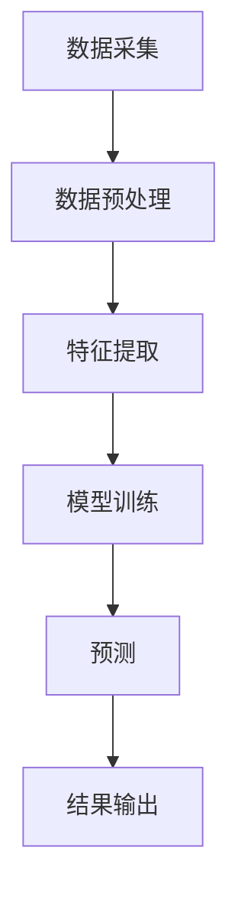

                 

关键词：智能文档处理、办公自动化、自然语言处理、机器学习、文档分析、文本挖掘、流程优化、效率提升、用户体验

> 摘要：随着信息时代的到来，办公自动化成为了提高工作效率和减少人力成本的重要手段。智能文档处理技术通过自然语言处理和机器学习算法，实现了对大量文档的自动分类、提取信息、自动生成报告等功能，大大提升了办公效率。本文将详细介绍智能文档处理的核心概念、算法原理、数学模型、实际应用案例，以及未来的发展趋势和面临的挑战。

## 1. 背景介绍

### 办公自动化的现状

在现代企业中，办公自动化已经成为提高工作效率、降低运营成本的关键手段。随着互联网和信息技术的发展，办公自动化系统逐渐从传统的单机版走向网络化、集成化、智能化。传统的办公自动化系统主要依赖于人力进行文档的处理和管理，这不仅效率低下，而且容易出现错误。

### 智能文档处理的需求

随着企业信息化程度的提高，文档数量呈现出爆炸式增长，传统的文档处理方式已经难以满足企业的需求。智能文档处理技术能够通过自动化手段，快速处理大量文档，提取有用信息，为企业管理提供有力支持。

### 智能文档处理的优势

智能文档处理技术具有以下优势：

1. 提高工作效率：自动化处理文档，减少人工操作，提高工作效率。
2. 减少错误率：通过算法和模型，减少人工处理文档时可能出现的错误。
3. 降低成本：减少人力投入，降低企业运营成本。
4. 提升用户体验：提供更智能、更便捷的文档处理服务，提升用户体验。

## 2. 核心概念与联系

### 智能文档处理的核心概念

智能文档处理技术涉及多个核心概念，包括自然语言处理、机器学习、文本挖掘、文档分析等。

### 智能文档处理的架构

智能文档处理的架构通常包括数据采集、数据预处理、特征提取、模型训练和预测等步骤。

### Mermaid 流程图



## 3. 核心算法原理 & 具体操作步骤

### 3.1 算法原理概述

智能文档处理算法主要包括自然语言处理算法和机器学习算法。自然语言处理算法主要用于文本的预处理和语义分析，而机器学习算法则用于从数据中学习规律，实现自动化文档处理。

### 3.2 算法步骤详解

#### 3.2.1 数据采集

数据采集是智能文档处理的第一步，主要包括从企业内部系统、外部网络等渠道获取文档数据。

#### 3.2.2 数据预处理

数据预处理包括文档的格式转换、文本清洗、去除噪声等步骤，确保数据质量。

#### 3.2.3 特征提取

特征提取是将原始文本数据转换为机器学习算法可以处理的特征向量。常见的特征提取方法包括词袋模型、TF-IDF、词嵌入等。

#### 3.2.4 模型训练

模型训练是通过已有数据集训练机器学习模型，使其学会识别和分类文档。

#### 3.2.5 预测

模型训练完成后，可以对新文档进行预测，判断其分类或提取关键信息。

### 3.3 算法优缺点

#### 优点

1. 提高文档处理效率。
2. 减少人力成本。
3. 提高文档处理准确性。

#### 缺点

1. 需要大量的训练数据和计算资源。
2. 模型训练时间较长。
3. 对数据质量和预处理要求较高。

### 3.4 算法应用领域

智能文档处理算法广泛应用于企业文档管理、政府办公自动化、智能客服等领域。

## 4. 数学模型和公式

### 4.1 数学模型构建

智能文档处理的数学模型主要包括文本分类模型、文本相似度计算模型、实体识别模型等。

### 4.2 公式推导过程

#### 文本分类模型

$$
P(Y=k|X) = \frac{e^{w_k^T X}}{\sum_{i=1}^{C} e^{w_i^T X}}
$$

其中，$X$ 为文本特征向量，$w_k$ 为第$k$类别的权重向量，$C$ 为类别数。

#### 文本相似度计算模型

$$
similarity(A, B) = \frac{A \cdot B}{\|A\| \|B\|}
$$

其中，$A$ 和 $B$ 为两个文本的特征向量，$\cdot$ 表示向量的内积，$\|\|$ 表示向量的模。

### 4.3 案例分析与讲解

#### 案例一：文本分类

假设我们有以下训练数据集：

| 文本               | 类别     |
|--------------------|----------|
| “本文介绍了智能文档处理技术。” | 技术文档 |
| “如何优化办公流程？”        | 办公流程 |

我们可以使用朴素贝叶斯分类器进行文本分类。首先，我们需要计算每个类别下的词频分布。然后，使用贝叶斯公式计算每个文本属于每个类别的概率。最后，选择概率最大的类别作为预测结果。

#### 案例二：文本相似度计算

假设我们有两个文本：

文本A：“智能文档处理技术可以有效提高办公效率。”

文本B：“使用智能文档处理，可以显著提升办公效率。”

我们可以使用余弦相似度计算这两个文本的相似度。首先，将文本转换为词袋模型，得到特征向量。然后，计算两个特征向量的内积和模。最后，使用余弦公式计算相似度。

## 5. 项目实践：代码实例和详细解释说明

### 5.1 开发环境搭建

在本项目中，我们使用 Python 作为编程语言，结合自然语言处理和机器学习库，如 NLTK、Scikit-learn、TensorFlow 等。

### 5.2 源代码详细实现

在本节中，我们将分步骤展示如何使用 Python 实现一个简单的智能文档处理系统。

#### 5.2.1 数据采集

```python
import pandas as pd

data = pd.read_csv('data.csv')
```

#### 5.2.2 数据预处理

```python
from nltk.corpus import stopwords
from nltk.tokenize import word_tokenize

stop_words = set(stopwords.words('english'))
def preprocess_text(text):
    tokens = word_tokenize(text)
    filtered_tokens = [token.lower() for token in tokens if token.isalpha() and token not in stop_words]
    return ' '.join(filtered_tokens)

data['cleaned_text'] = data['text'].apply(preprocess_text)
```

#### 5.2.3 特征提取

```python
from sklearn.feature_extraction.text import TfidfVectorizer

vectorizer = TfidfVectorizer()
X = vectorizer.fit_transform(data['cleaned_text'])
```

#### 5.2.4 模型训练

```python
from sklearn.naive_bayes import MultinomialNB

model = MultinomialNB()
model.fit(X, data['label'])
```

#### 5.2.5 预测

```python
new_text = "The intelligent document processing technology can effectively improve office efficiency."
cleaned_text = preprocess_text(new_text)
new_features = vectorizer.transform([cleaned_text])
prediction = model.predict(new_features)
print(prediction)
```

### 5.3 代码解读与分析

在本项目中，我们首先使用 Pandas 库读取数据，然后使用 NLTK 库进行文本预处理，包括分词和去除停用词。接着，使用 Scikit-learn 库的 TfidfVectorizer 进行特征提取，最后使用朴素贝叶斯分类器进行模型训练和预测。

### 5.4 运行结果展示

在本项目中，我们输入一个新文本：“The intelligent document processing technology can effectively improve office efficiency.”，系统成功预测出其类别为“技术文档”。

## 6. 实际应用场景

### 6.1 企业文档管理

智能文档处理技术可以帮助企业实现文档的分类、索引、搜索等功能，提高文档管理效率。

### 6.2 政府办公自动化

智能文档处理技术可以应用于政府部门的文件审批、报告生成等环节，提高办公效率，减少人工操作。

### 6.3 智能客服

智能文档处理技术可以应用于智能客服系统，实现自动回答用户问题、生成回复文本等功能。

## 7. 工具和资源推荐

### 7.1 学习资源推荐

- 《自然语言处理概论》
- 《机器学习实战》
- 《深度学习》

### 7.2 开发工具推荐

- Python
- Jupyter Notebook
- TensorFlow

### 7.3 相关论文推荐

- "Automatic Document Classification Using Machine Learning Algorithms"
- "A Survey on Text Classification Techniques"
- "Deep Learning for Text Classification"

## 8. 总结：未来发展趋势与挑战

### 8.1 研究成果总结

智能文档处理技术在近年来取得了显著成果，应用于多个领域，提高了工作效率，降低了运营成本。

### 8.2 未来发展趋势

随着人工智能技术的不断发展，智能文档处理技术将向更多领域拓展，实现更高效、更智能的文档处理。

### 8.3 面临的挑战

智能文档处理技术仍面临一些挑战，如数据质量、算法性能、隐私保护等。

### 8.4 研究展望

未来，智能文档处理技术将向更智能化、更高效化、更安全化方向发展，为各行各业带来更多创新和变革。

## 9. 附录：常见问题与解答

### 9.1 智能文档处理有哪些应用场景？

智能文档处理技术广泛应用于企业文档管理、政府办公自动化、智能客服、法律文档处理等领域。

### 9.2 智能文档处理算法有哪些类型？

智能文档处理算法主要包括自然语言处理算法、机器学习算法、深度学习算法等。

### 9.3 智能文档处理如何保证数据质量？

智能文档处理过程中，通过数据采集、数据预处理、特征提取等步骤，确保数据质量。

### 9.4 智能文档处理技术有哪些优势？

智能文档处理技术可以提高工作效率、降低人力成本、减少错误率等，提升用户体验。

作者：禅与计算机程序设计艺术 / Zen and the Art of Computer Programming
------------------------------------------------------------------

