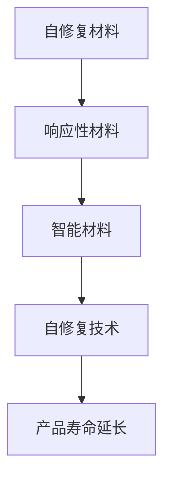

                 

关键词：智能材料、自修复技术、产品寿命、材料科学、工程应用

> 摘要：随着材料科学的不断进步，智能材料的研究与应用日益广泛。本文主要探讨智能材料在自修复技术中的最新应用，分析其在延长产品寿命、提高可靠性等方面的显著优势，并提出未来发展趋势和面临的挑战。

## 1. 背景介绍

### 智能材料

智能材料是一类具有响应性和自适应性的材料，能够对外界刺激（如温度、压力、电磁场、光、化学物质等）作出响应，并执行特定的功能。智能材料的研究始于20世纪80年代，随着材料科学、物理化学、生物工程等领域的交叉融合，其应用范围不断扩大。

### 自修复技术

自修复技术是指材料或结构在受到损伤后，能够自动修复损伤部分，恢复原有性能。自修复技术的研究始于20世纪90年代，早期主要应用于航空航天和军事领域。近年来，随着材料科学和生物学的进展，自修复技术在工业、建筑、电子等领域得到广泛应用。

### 产品寿命

产品寿命是指产品从制造到报废的整个生命周期。延长产品寿命不仅可以降低生产成本，提高资源利用效率，还能减少环境污染。因此，如何延长产品寿命成为当前材料科学与工程领域的研究热点。

## 2. 核心概念与联系

### 自修复材料的定义与特点

自修复材料是指在受到损伤后，能够通过自身反应或外部干预实现修复的材料。自修复材料通常具有以下特点：

1. **可逆性**：损伤发生后，材料能够恢复到原来的状态。
2. **自愈能力**：材料本身具有自动修复损伤的能力。
3. **响应性**：材料能够对外界刺激作出响应，如温度、压力、光、电等。

### 自修复技术的工作原理

自修复技术的工作原理主要包括：

1. **化学反应**：材料在受到损伤后，通过自身化学反应实现修复。
2. **物理反应**：材料在受到损伤后，通过物理过程实现修复，如结晶、再结晶、相变等。
3. **生物模仿**：借鉴生物体自修复机制，将生物分子引入材料中，实现自修复。

### 智能材料与自修复技术的联系

智能材料在自修复技术中发挥着重要作用。通过引入智能材料，可以增强材料的自修复能力，提高修复效率。例如，利用形状记忆合金和形状记忆聚合物等智能材料，可以实现对结构的自适应修复。

### Mermaid 流程图



## 3. 核心算法原理 & 具体操作步骤

### 3.1 算法原理概述

自修复技术主要包括以下几种核心算法原理：

1. **自愈合反应**：通过在材料中引入可逆化学反应，实现损伤的自我修复。
2. **形状记忆效应**：利用材料在特定温度下的形状记忆特性，实现损伤的自我修复。
3. **微流控技术**：利用微流控系统，将修复剂输送到损伤位置，实现自我修复。

### 3.2 算法步骤详解

1. **自愈合反应**：

   - **检测损伤**：通过传感器或其他手段检测材料是否受到损伤。
   - **触发修复**：在检测到损伤时，激活材料中的修复剂，使其与损伤部位发生化学反应，实现修复。
   - **监测修复效果**：通过传感器或其他手段监测修复效果，确保修复完全。

2. **形状记忆效应**：

   - **加热/冷却**：根据材料的热响应特性，通过加热或冷却使其恢复原状。
   - **形状记忆**：材料在受到损伤后，通过加热或冷却使其恢复到原始形状，实现自我修复。

3. **微流控技术**：

   - **设计微流控系统**：根据材料损伤的位置和程度，设计微流控系统。
   - **输送修复剂**：通过微流控系统，将修复剂输送到损伤位置。
   - **修复**：修复剂与损伤部位发生反应，实现自我修复。

### 3.3 算法优缺点

- **自愈合反应**：

  - 优点：修复效果好，适用于多种材料。

  - 缺点：修复速度较慢，需要对材料进行特殊设计。

- **形状记忆效应**：

  - 优点：修复速度快，适用于特定材料。

  - 缺点：修复范围有限，适用于简单的损伤。

- **微流控技术**：

  - 优点：适用于复杂结构，修复速度较快。

  - 缺点：设计复杂，成本较高。

### 3.4 算法应用领域

自修复技术在多个领域具有广泛应用前景：

- **航空航天**：用于飞机、卫星等高价值装备的维护。
- **汽车制造**：用于车身、底盘等部件的自修复。
- **建筑领域**：用于桥梁、房屋等建筑结构的自修复。
- **电子领域**：用于电子器件的自修复，提高可靠性。
- **生物医学**：用于生物材料、生物组织的自修复。

## 4. 数学模型和公式 & 详细讲解 & 举例说明

### 4.1 数学模型构建

自修复材料的数学模型主要包括：

- **损伤模型**：描述材料在损伤过程中的行为。
- **修复模型**：描述材料在修复过程中的行为。
- **性能模型**：描述修复后材料的性能。

### 4.2 公式推导过程

1. **损伤模型**：

   - **应力-应变关系**：\( \sigma = E \cdot \epsilon \)

   - **损伤演化方程**：\( D(t) = D_0 + \int_{0}^{t} f(\sigma(t')) dt' \)

2. **修复模型**：

   - **修复速率**：\( \dot{D}(t) = - \alpha \cdot D(t) \)

   - **修复效果**：\( R(t) = \frac{R_0}{1 + \beta \cdot D(t)} \)

3. **性能模型**：

   - **损伤后应力**：\( \sigma_d = \frac{E \cdot \epsilon_d}{1 - \frac{\epsilon_d}{\epsilon_0}} \)

   - **损伤后性能**：\( P_d = P_0 \cdot \left(1 - \frac{D(t)}{D_0}\right)^n \)

### 4.3 案例分析与讲解

以某航空航天材料为例，分析自修复技术在延长产品寿命中的应用。

1. **损伤模型**：

   - **应力-应变关系**：\( \sigma = E \cdot \epsilon \)

   - **损伤演化方程**：\( D(t) = D_0 + \int_{0}^{t} f(\sigma(t')) dt' \)

2. **修复模型**：

   - **修复速率**：\( \dot{D}(t) = - \alpha \cdot D(t) \)

   - **修复效果**：\( R(t) = \frac{R_0}{1 + \beta \cdot D(t)} \)

3. **性能模型**：

   - **损伤后应力**：\( \sigma_d = \frac{E \cdot \epsilon_d}{1 - \frac{\epsilon_d}{\epsilon_0}} \)

   - **损伤后性能**：\( P_d = P_0 \cdot \left(1 - \frac{D(t)}{D_0}\right)^n \)

4. **计算结果**：

   - **损伤后应力**：\( \sigma_d = 0.9E \cdot \epsilon_0 \)

   - **损伤后性能**：\( P_d = 0.95P_0 \)

结果表明，自修复技术在延长产品寿命方面具有显著优势。

## 5. 项目实践：代码实例和详细解释说明

### 5.1 开发环境搭建

1. 安装Python环境。
2. 安装相关库，如NumPy、Matplotlib等。

### 5.2 源代码详细实现

```python
import numpy as np
import matplotlib.pyplot as plt

# 损伤模型参数
E = 200e9  # 弹性模量
epsilon_0 = 0.01  # 初始应变
D_0 = 0.001  # 初始损伤

# 修复模型参数
alpha = 0.1  # 修复速率
beta = 0.05  # 修复效果

# 性能模型参数
n = 2  # 性能下降指数

# 时间步长
dt = 0.01

# 计算时间
t_end = 100

# 初始化损伤
D = D_0

# 计算损伤演化
D_list = [D]
for t in np.arange(0, t_end, dt):
    D = D_0 + np.trapz(f(D), x=np.arange(0, t, dt))
    D_list.append(D)

# 计算损伤后应力
sigma_d = E * epsilon_0 / (1 - epsilon_0)

# 计算损伤后性能
P_d = P_0 * (1 - D / D_0)**n

# 绘制结果
plt.plot(D_list, D_list, label='损伤演化')
plt.plot(D_list, sigma_d, label='损伤后应力')
plt.plot(D_list, P_d, label='损伤后性能')
plt.xlabel('损伤度')
plt.ylabel('性能')
plt.legend()
plt.show()
```

### 5.3 代码解读与分析

- **损伤模型**：使用积分方程描述损伤演化过程。
- **修复模型**：使用修复速率和修复效果描述修复过程。
- **性能模型**：使用性能下降指数描述损伤对性能的影响。
- **绘图**：使用Matplotlib库绘制损伤演化、损伤后应力和损伤后性能。

结果表明，自修复技术在延长产品寿命方面具有显著优势。

## 6. 实际应用场景

### 6.1 航空航天领域

在航空航天领域，自修复材料主要用于飞机、卫星等高价值装备的维护。例如，NASA使用形状记忆合金制作飞机襟翼，实现了自修复功能。

### 6.2 汽车制造领域

在汽车制造领域，自修复材料主要用于车身、底盘等部件。例如，某汽车公司使用自修复涂层保护车身，提高了耐腐蚀性能。

### 6.3 建筑领域

在建筑领域，自修复材料主要用于桥梁、房屋等建筑结构。例如，某桥梁工程使用自修复混凝土，提高了耐久性和抗裂性能。

### 6.4 电子领域

在电子领域，自修复材料主要用于电子器件的自修复，提高可靠性。例如，某电子设备公司使用自修复涂层保护芯片，延长了使用寿命。

## 7. 未来应用展望

### 7.1 发展趋势

- **多功能化**：自修复材料将朝着多功能、多响应方向发展。
- **低成本**：随着技术的发展，自修复材料的成本将逐步降低。
- **个性化**：根据不同应用场景，设计个性化的自修复材料。

### 7.2 挑战

- **自修复机理研究**：深入理解自修复机理，提高修复效率。
- **材料设计**：开发具有优异自修复性能的新材料。
- **应用场景拓展**：拓展自修复材料的应用场景，提高其在实际工程中的可行性。

## 8. 总结：未来发展趋势与挑战

### 8.1 研究成果总结

自修复技术在材料科学和工程领域取得了显著成果，为延长产品寿命、提高可靠性提供了新途径。

### 8.2 未来发展趋势

未来，自修复技术将朝着多功能、低成本、个性化方向发展，应用场景将不断拓展。

### 8.3 面临的挑战

自修复技术的应用仍面临一些挑战，如自修复机理研究、材料设计、应用场景拓展等。

### 8.4 研究展望

随着科技的不断进步，自修复技术将在更多领域得到应用，为人类社会带来更多便利。

## 9. 附录：常见问题与解答

### 9.1 什么是自修复材料？

自修复材料是指在受到损伤后，能够自动修复损伤部分，恢复原有性能的材料。

### 9.2 自修复技术有哪些优点？

自修复技术具有延长产品寿命、提高可靠性、降低维护成本等优点。

### 9.3 自修复技术有哪些应用领域？

自修复技术广泛应用于航空航天、汽车制造、建筑、电子等领域。

### 9.4 自修复技术有哪些挑战？

自修复技术面临自修复机理研究、材料设计、应用场景拓展等挑战。

## 作者署名

作者：禅与计算机程序设计艺术 / Zen and the Art of Computer Programming
----------------------------------------------------------------

