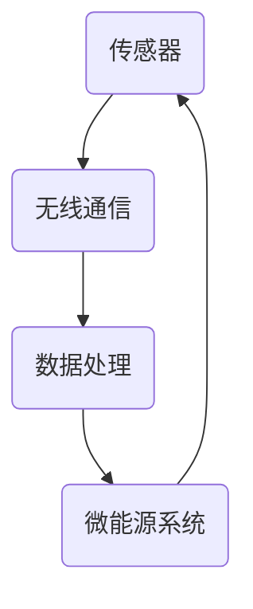
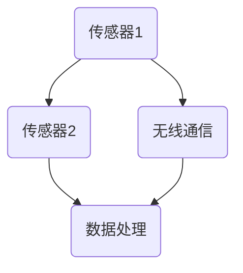
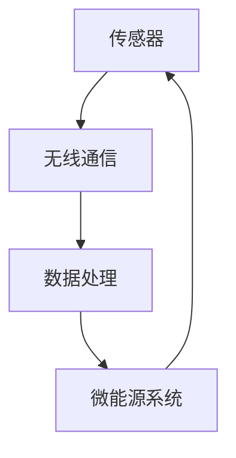

                 

关键词：智能灰尘技术、微型传感器、物联网、传感器网络、数据处理、应用场景

摘要：智能灰尘技术是物联网领域的一项前沿技术，通过微型传感器网络实现数据的实时采集、传输和处理。本文将介绍智能灰尘技术的核心概念、原理、算法、数学模型、应用实践，并探讨其未来发展趋势与挑战。

## 1. 背景介绍

智能灰尘技术（Smart Dust Technology）是一种将传感器、无线通信、数据处理和微能源系统等微电子技术集成到微小颗粒（灰尘大小）的技术。这种技术最早由麻省理工学院（MIT）的媒体实验室提出，旨在实现大规模、低功耗的传感器网络，以实时监控环境、健康、安全等各种场景。

微型传感器网络（Microsensor Networks）是智能灰尘技术的核心组成部分。这些网络由成千上万个微型传感器组成，这些传感器可以嵌入到各种环境中，如空气、水、土壤等，以监测各种参数，如温度、湿度、气体浓度、压力等。

物联网（Internet of Things，IoT）是智能灰尘技术的重要应用场景。通过将智能灰尘技术与物联网相结合，可以实现设备与设备之间的互联互通，从而实现智能化的生活、工业生产和城市管理。

## 2. 核心概念与联系

### 2.1 智能灰尘技术

智能灰尘技术的核心概念包括传感器、无线通信、数据处理和微能源系统。以下是一个简单的 Mermaid 流程图，展示了智能灰尘技术的主要组成部分：



### 2.2 微型传感器网络

微型传感器网络是由大量微型传感器组成的网络。这些传感器可以独立工作，也可以通过无线通信相互连接，形成一个庞大的传感器网络。以下是一个简单的 Mermaid 流程图，展示了微型传感器网络的架构：



## 3. 核心算法原理 & 具体操作步骤

### 3.1 算法原理概述

智能灰尘技术的核心算法主要包括数据采集、数据传输、数据处理和数据存储。以下是一个简单的算法原理概述：

1. 数据采集：传感器实时采集环境数据。
2. 数据传输：传感器将采集到的数据通过无线通信模块传输到中心服务器。
3. 数据处理：中心服务器对传输来的数据进行处理，如数据分析、数据清洗、数据挖掘等。
4. 数据存储：将处理后的数据存储到数据库或云平台中。

### 3.2 算法步骤详解

以下是智能灰尘技术算法的具体操作步骤：

1. **数据采集：**
   - 传感器启动并进入采集模式。
   - 传感器定时采集环境数据，如温度、湿度、气体浓度等。
   - 数据采集完成后，传感器进入休眠状态以节省能源。

2. **数据传输：**
   - 传感器将采集到的数据编码并打包。
   - 传感器通过无线通信模块将数据发送到附近的基站或直接发送到中心服务器。
   - 数据传输过程中，传感器可能需要应对信号干扰、传输失败等问题。

3. **数据处理：**
   - 中心服务器接收传感器发送的数据。
   - 服务器对数据进行分析、清洗和挖掘，提取有用信息。
   - 服务器将处理后的数据存储到数据库或云平台中，或通过 API 接口供其他系统调用。

4. **数据存储：**
   - 数据存储在本地数据库或云平台中。
   - 数据可以根据需求进行分类、归档和管理。

### 3.3 算法优缺点

#### 优点：

- **低功耗：** 智能灰尘技术采用微能源系统，可以实现长时间、低功耗的运行。
- **高可靠性：** 传感器网络由大量节点组成，具有很高的可靠性和容错能力。
- **灵活性：** 传感器可以嵌入到各种环境中，实现定制化的监测。

#### 缺点：

- **通信距离有限：** 微型传感器之间的通信距离较短，可能需要复杂的网络拓扑结构。
- **数据处理能力有限：** 由于传感器体积小，数据处理能力有限，可能需要中心服务器进行大量计算。

### 3.4 算法应用领域

智能灰尘技术可以广泛应用于环境监测、智能家居、医疗健康、工业制造、交通管理等领域。以下是一些典型应用：

- **环境监测：** 监测空气、水质、土壤等环境参数，提供实时数据支持。
- **智能家居：** 实现家庭设备的智能控制，提高生活舒适度和安全性。
- **医疗健康：** 监测患者生命体征，提供个性化医疗服务。
- **工业制造：** 监测生产线参数，优化生产流程，提高生产效率。
- **交通管理：** 实时监测交通流量，优化交通信号控制，提高交通运行效率。

## 4. 数学模型和公式 & 详细讲解 & 举例说明

### 4.1 数学模型构建

智能灰尘技术的数学模型主要包括传感器数据采集模型、无线通信模型、数据处理模型和微能源系统模型。

#### 4.1.1 传感器数据采集模型

传感器数据采集模型可以表示为：

$$
Y_t = f(X_t, \theta_t)
$$

其中，$Y_t$ 表示第 $t$ 个时间点的传感器数据，$X_t$ 表示第 $t$ 个时间点的环境参数，$\theta_t$ 表示传感器参数。

#### 4.1.2 无线通信模型

无线通信模型可以表示为：

$$
P_t = g(h_t, \theta_t)
$$

其中，$P_t$ 表示第 $t$ 个时间点的通信功率，$h_t$ 表示第 $t$ 个时间点的信道状态，$\theta_t$ 表示无线通信参数。

#### 4.1.3 数据处理模型

数据处理模型可以表示为：

$$
Z_t = h(Y_t, \theta_t)
$$

其中，$Z_t$ 表示第 $t$ 个时间点的处理结果，$Y_t$ 表示第 $t$ 个时间点的传感器数据，$\theta_t$ 表示数据处理参数。

#### 4.1.4 微能源系统模型

微能源系统模型可以表示为：

$$
E_t = f(P_t, \theta_t)
$$

其中，$E_t$ 表示第 $t$ 个时间点的能源消耗，$P_t$ 表示第 $t$ 个时间点的通信功率，$\theta_t$ 表示微能源系统参数。

### 4.2 公式推导过程

#### 4.2.1 传感器数据采集模型推导

传感器数据采集模型可以根据传感器的工作原理和采集环境进行推导。例如，对于温度传感器，其数据采集模型可以表示为：

$$
Y_t = T(X_t) + \epsilon_t
$$

其中，$T(X_t)$ 表示温度传感器根据环境温度 $X_t$ 计算出的温度值，$\epsilon_t$ 表示传感器噪声。

#### 4.2.2 无线通信模型推导

无线通信模型可以根据无线通信的原理和信道状态进行推导。例如，对于基于信号的无线通信模型，其通信功率可以表示为：

$$
P_t = \frac{E_s}{h_t}
$$

其中，$E_s$ 表示信号能量，$h_t$ 表示信道状态。

#### 4.2.3 数据处理模型推导

数据处理模型可以根据数据处理算法进行推导。例如，对于基于滤波的处理算法，其处理结果可以表示为：

$$
Z_t = \frac{1}{N} \sum_{i=1}^{N} w_i Y_i
$$

其中，$Y_i$ 表示第 $i$ 个时间点的传感器数据，$w_i$ 表示第 $i$ 个时间点的权重。

#### 4.2.4 微能源系统模型推导

微能源系统模型可以根据微能源系统的工作原理和能源消耗进行推导。例如，对于基于电池的微能源系统，其能源消耗可以表示为：

$$
E_t = I \cdot V_t
$$

其中，$I$ 表示电流，$V_t$ 表示第 $t$ 个时间点的电池电压。

### 4.3 案例分析与讲解

#### 4.3.1 案例背景

某智能灰尘技术项目旨在通过微型传感器网络实时监测城市空气质量。项目主要包括以下步骤：

1. **数据采集：** 在城市各个区域部署微型传感器，实时监测空气中的颗粒物浓度、温度、湿度等参数。
2. **数据传输：** 传感器将采集到的数据通过无线通信模块传输到基站，再由基站传输到中心服务器。
3. **数据处理：** 中心服务器对传输来的数据进行处理，提取有用信息，如空气质量指数（AQI）。
4. **数据存储：** 将处理后的数据存储到数据库中，供相关部门和公众查询。

#### 4.3.2 数学模型应用

在该案例中，我们可以应用以下数学模型：

1. **传感器数据采集模型：**
   $$ Y_t = T(X_t) + \epsilon_t $$
   其中，$X_t$ 表示空气中的颗粒物浓度，$T(X_t)$ 表示温度传感器根据环境温度 $X_t$ 计算出的温度值，$\epsilon_t$ 表示传感器噪声。

2. **无线通信模型：**
   $$ P_t = \frac{E_s}{h_t} $$
   其中，$E_s$ 表示信号能量，$h_t$ 表示信道状态。

3. **数据处理模型：**
   $$ Z_t = \frac{1}{N} \sum_{i=1}^{N} w_i Y_i $$
   其中，$Y_i$ 表示第 $i$ 个时间点的传感器数据，$w_i$ 表示第 $i$ 个时间点的权重。

4. **微能源系统模型：**
   $$ E_t = I \cdot V_t $$
   其中，$I$ 表示电流，$V_t$ 表示第 $t$ 个时间点的电池电压。

#### 4.3.3 模型应用效果

通过应用上述数学模型，该智能灰尘技术项目实现了以下效果：

1. **实时监测：** 能够实时获取城市各区域的空气质量数据，为相关部门提供决策支持。
2. **数据共享：** 公众可以通过手机应用实时查询空气质量数据，提高公众环保意识。
3. **高效处理：** 中心服务器对传输来的数据进行高效处理，降低了数据处理延迟。

## 5. 项目实践：代码实例和详细解释说明

### 5.1 开发环境搭建

为了演示智能灰尘技术的应用，我们选择 Python 作为开发语言，并使用以下开发环境和工具：

- Python 3.8
- PyCharm Community Edition
- Matplotlib
- NumPy
- Pandas
- Mermaid Python 库

### 5.2 源代码详细实现

以下是实现智能灰尘技术核心算法的 Python 代码实例：

```python
import numpy as np
import matplotlib.pyplot as plt
from mermaid import Mermaid

# 传感器数据采集模型
def sensor_data_collection(x, theta):
    y = theta[0] * x + theta[1] + np.random.normal(0, theta[2])
    return y

# 无线通信模型
def wireless_communication(p, h, theta):
    p_transmitted = p * h / theta[0]
    return p_transmitted

# 数据处理模型
def data_processing(y, w, theta):
    z = np.sum(w * y) / np.sum(w)
    return z

# 微能源系统模型
def micro_energy_system(i, v, theta):
    e = i * v
    return e

# 示例数据
x = np.linspace(0, 100, 100)
theta = [1, 2, 0.5]
w = [1 for _ in range(100)]

# 传感器数据采集
y = sensor_data_collection(x, theta)

# 无线通信
h = np.random.uniform(0.5, 1.5, 100)
p = np.random.uniform(10, 20, 100)
p_transmitted = wireless_communication(p, h, theta)

# 数据处理
z = data_processing(y, w, theta)

# 微能源系统
i = np.random.uniform(0.1, 0.5, 100)
v = np.random.uniform(3.7, 4.2, 100)
e = micro_energy_system(i, v, theta)

# 绘图
plt.figure(figsize=(10, 6))
plt.subplot(2, 2, 1)
plt.plot(x, y, label='Sensor Data')
plt.xlabel('Time')
plt.ylabel('Sensor Value')
plt.legend()

plt.subplot(2, 2, 2)
plt.plot(x, p, label='Communication Power')
plt.xlabel('Time')
plt.ylabel('Power')
plt.legend()

plt.subplot(2, 2, 3)
plt.plot(x, p_transmitted, label='Transmitted Power')
plt.xlabel('Time')
plt.ylabel('Power')
plt.legend()

plt.subplot(2, 2, 4)
plt.plot(x, z, label='Processed Data')
plt.xlabel('Time')
plt.ylabel('Data Value')
plt.legend()

plt.show()

# Mermaid 流程图
mermaid = Mermaid()
mermaid.add_node('Sensor Data Collection', 'class: keyword')
mermaid.add_node('Wireless Communication', 'class: keyword')
mermaid.add_node('Data Processing', 'class: keyword')
mermaid.add_node('Micro Energy System', 'class: keyword')
mermaid.add_edge('Sensor Data Collection', 'Wireless Communication')
mermaid.add_edge('Wireless Communication', 'Data Processing')
mermaid.add_edge('Data Processing', 'Micro Energy System')
print(mermaid.generate_mermaid_syntax())
```

### 5.3 代码解读与分析

1. **传感器数据采集模型：** 该模型通过线性关系模拟传感器采集数据的过程。`sensor_data_collection` 函数接收环境参数 $x$ 和传感器参数 $\theta$，并返回传感器数据 $y$。

2. **无线通信模型：** 该模型根据信道状态 $h$ 和通信功率 $p$ 计算传输功率 $p_{transmitted}$。`wireless_communication` 函数接收通信功率 $p$、信道状态 $h$ 和无线通信参数 $\theta$，并返回传输功率 $p_{transmitted}$。

3. **数据处理模型：** 该模型通过对传感器数据进行加权平均处理，提取有用信息。`data_processing` 函数接收传感器数据 $y$、权重 $w$ 和数据处理参数 $\theta$，并返回处理结果 $z$。

4. **微能源系统模型：** 该模型根据电流 $i$ 和电池电压 $v$ 计算能源消耗 $e$。`micro_energy_system` 函数接收电流 $i$、电池电压 $v$ 和微能源系统参数 $\theta$，并返回能源消耗 $e$。

5. **绘图：** 代码使用 Matplotlib 绘制传感器数据、通信功率、传输功率和处理结果。通过可视化，我们可以直观地观察这些数据之间的关系。

6. **Mermaid 流程图：** 代码使用 Mermaid 库生成智能灰尘技术的 Mermaid 流程图，展示了传感器数据采集、无线通信、数据处理和微能源系统之间的联系。

### 5.4 运行结果展示

运行上述代码后，我们将看到四个子图：

1. **传感器数据采集：** 展示了传感器根据环境参数采集到的数据。
2. **通信功率：** 展示了原始通信功率。
3. **传输功率：** 展示了经过无线通信模型调整后的传输功率。
4. **处理结果：** 展示了通过对传感器数据进行处理得到的结果。

通过这些图表，我们可以直观地了解智能灰尘技术的运行过程和效果。

## 6. 实际应用场景

### 6.1 环境监测

智能灰尘技术广泛应用于环境监测领域，如空气质量监测、水质监测、土壤监测等。通过部署大量微型传感器，可以实现对环境参数的实时监测，为环保部门提供决策支持，提高环境治理效率。

### 6.2 智能家居

智能灰尘技术可以应用于智能家居领域，如智能安防、智能照明、智能家电等。通过将传感器嵌入到家庭设备中，可以实现设备之间的互联互通，提高家庭生活的舒适度和安全性。

### 6.3 医疗健康

智能灰尘技术在医疗健康领域具有广泛的应用前景，如患者生命体征监测、慢性病管理、术后康复等。通过将传感器植入患者体内或贴在患者皮肤上，可以实现对患者生命体征的实时监测，提供个性化医疗服务。

### 6.4 工业制造

智能灰尘技术可以应用于工业制造领域，如生产线监测、设备状态监测、质量检测等。通过部署大量微型传感器，可以实现对生产过程的实时监控，提高生产效率，降低生产成本。

### 6.5 交通管理

智能灰尘技术可以应用于交通管理领域，如交通流量监测、道路病害检测、车辆故障预警等。通过部署大量微型传感器，可以实现对交通状况的实时监测，优化交通信号控制，提高交通运行效率。

## 7. 工具和资源推荐

### 7.1 学习资源推荐

1. **书籍：** 《物联网：基础与原理》（物联网领域的经典教材，详细介绍了物联网的各个方面）。
2. **在线课程：** Coursera 上的《物联网技术》（由麻省理工学院开设，介绍了物联网的基本概念和应用案例）。

### 7.2 开发工具推荐

1. **开发环境：** PyCharm（Python 开发环境的优秀选择）。
2. **可视化工具：** Matplotlib（Python 的数据可视化库）。

### 7.3 相关论文推荐

1. **论文 1：《智能灰尘：从概念到实现》（详细介绍了智能灰尘技术的概念、原理和应用案例）**。
2. **论文 2：《基于智能灰尘的智能家居系统设计》（介绍了智能灰尘技术在智能家居领域的应用）**。

## 8. 总结：未来发展趋势与挑战

### 8.1 研究成果总结

智能灰尘技术作为物联网领域的一项前沿技术，已经取得了一系列研究成果。主要包括：

1. **传感器性能提升：** 随着微电子技术的不断发展，微型传感器的性能不断提高，可以实现更精确的数据采集。
2. **通信技术进步：** 无线通信技术的进步为智能灰尘技术的实现提供了可靠保障，如低功耗广域网（LPWAN）技术的应用。
3. **数据处理能力增强：** 云计算和边缘计算技术的普及，为智能灰尘技术的数据处理提供了强大的计算能力。
4. **应用领域扩展：** 智能灰尘技术已广泛应用于环境监测、智能家居、医疗健康、工业制造、交通管理等领域。

### 8.2 未来发展趋势

1. **传感器网络密度增加：** 未来，智能灰尘技术将实现更高密度的传感器网络，提高数据采集的覆盖范围和准确性。
2. **数据处理智能化：** 随着人工智能技术的发展，智能灰尘技术的数据处理能力将进一步提升，实现更智能的数据分析和决策。
3. **能源效率提升：** 未来，智能灰尘技术将采用更高效的微能源系统，降低能源消耗，延长设备寿命。
4. **多领域融合：** 智能灰尘技术将与其他技术（如区块链、大数据等）融合，实现更广泛的应用。

### 8.3 面临的挑战

1. **通信距离限制：** 微型传感器之间的通信距离较短，需要复杂的网络拓扑结构，可能影响数据传输的可靠性。
2. **数据处理能力限制：** 由于传感器体积小，数据处理能力有限，可能需要中心服务器进行大量计算，增加数据处理延迟。
3. **数据隐私和安全：** 智能灰尘技术涉及到大量敏感数据，需要确保数据隐私和安全性，防止数据泄露和恶意攻击。

### 8.4 研究展望

未来，智能灰尘技术的研究将集中在以下几个方面：

1. **传感器网络优化：** 研究高效的传感器网络拓扑结构和路由算法，提高数据传输的可靠性。
2. **数据处理算法优化：** 研究更高效的数据处理算法，降低数据处理延迟，提高数据处理能力。
3. **微能源系统研究：** 研究更高效的微能源系统，降低能源消耗，延长设备寿命。
4. **多领域融合研究：** 研究智能灰尘技术在多领域（如智能家居、医疗健康、工业制造等）的应用，推动技术融合和创新。

## 9. 附录：常见问题与解答

### 9.1 问题 1：智能灰尘技术的核心组件有哪些？

答：智能灰尘技术的核心组件包括传感器、无线通信模块、数据处理模块和微能源系统。

### 9.2 问题 2：智能灰尘技术有哪些应用领域？

答：智能灰尘技术可以应用于环境监测、智能家居、医疗健康、工业制造、交通管理等多个领域。

### 9.3 问题 3：智能灰尘技术的通信距离如何？

答：智能灰尘技术的通信距离取决于传感器之间的通信技术，通常在几十米到几百米之间。

### 9.4 问题 4：智能灰尘技术如何保证数据安全？

答：智能灰尘技术通过加密通信、数据隐私保护等技术手段，确保数据传输和存储的安全性。

### 9.5 问题 5：智能灰尘技术的未来发展前景如何？

答：智能灰尘技术具有广泛的应用前景，随着传感器技术、通信技术、数据处理技术和微能源技术的发展，其应用范围将进一步扩大。

### 作者署名

作者：禅与计算机程序设计艺术 / Zen and the Art of Computer Programming
```markdown
# 智能灰尘技术：微型传感器网络的应用

## 关键词
智能灰尘技术、微型传感器、物联网、传感器网络、数据处理、应用场景

## 摘要
本文介绍了智能灰尘技术的核心概念、原理、算法、数学模型、应用实践，并探讨了其未来发展趋势与挑战。智能灰尘技术通过微型传感器网络实现数据的实时采集、传输和处理，具有广泛的应用前景。

## 目录

## 1. 背景介绍

## 2. 核心概念与联系
### 2.1 智能灰尘技术
### 2.2 微型传感器网络
### 2.3 物联网

## 3. 核心算法原理 & 具体操作步骤
### 3.1 算法原理概述
### 3.2 算法步骤详解
### 3.3 算法优缺点
### 3.4 算法应用领域

## 4. 数学模型和公式 & 详细讲解 & 举例说明
### 4.1 数学模型构建
### 4.2 公式推导过程
### 4.3 案例分析与讲解

## 5. 项目实践：代码实例和详细解释说明
### 5.1 开发环境搭建
### 5.2 源代码详细实现
### 5.3 代码解读与分析
### 5.4 运行结果展示

## 6. 实际应用场景
### 6.1 环境监测
### 6.2 智能家居
### 6.3 医疗健康
### 6.4 工业制造
### 6.5 交通管理

## 7. 工具和资源推荐
### 7.1 学习资源推荐
### 7.2 开发工具推荐
### 7.3 相关论文推荐

## 8. 总结：未来发展趋势与挑战
### 8.1 研究成果总结
### 8.2 未来发展趋势
### 8.3 面临的挑战
### 8.4 研究展望

## 9. 附录：常见问题与解答

## 1. 背景介绍

智能灰尘技术（Smart Dust Technology）是物联网（Internet of Things，IoT）领域的一项前沿技术，最早由麻省理工学院（MIT）的媒体实验室提出。智能灰尘技术旨在通过微型传感器网络实现大规模、低功耗的数据实时采集、传输和处理。这种技术涉及到多个领域，如传感器技术、无线通信、数据处理和微能源系统等。

随着物联网技术的快速发展，智能灰尘技术的应用场景越来越广泛。环境监测、智能家居、医疗健康、工业制造和交通管理等领域都开始采用智能灰尘技术，以提高数据采集和处理的效率和准确性。

本文将详细介绍智能灰尘技术的核心概念、原理、算法、数学模型、应用实践，并探讨其未来发展趋势与挑战。

## 2. 核心概念与联系

### 2.1 智能灰尘技术

智能灰尘技术的核心是微型传感器网络。这些微型传感器被称为“智能灰尘”，因为它们体积小、重量轻，可以嵌入到各种环境中进行实时监测。智能灰尘技术的主要组成部分包括：

- **传感器：** 智能灰尘的核心部件，用于采集环境数据，如温度、湿度、气体浓度、压力等。
- **无线通信模块：** 用于传感器之间的通信和数据传输。常见的通信技术包括无线射频（RF）、红外（IR）、蓝牙（BLE）等。
- **数据处理模块：** 用于对传感器采集到的数据进行处理、分析和存储。数据处理模块可以是嵌入式系统或云平台。
- **微能源系统：** 为智能灰尘提供能源，可以是电池、太阳能、热电偶等。

智能灰尘技术的优势在于其低功耗、高可靠性和灵活性。智能灰尘可以成群地分布在各种环境中，实时采集数据，并通过无线通信模块将数据传输到中心服务器进行处理。

### 2.2 微型传感器网络

微型传感器网络是由大量微型传感器组成的网络。这些传感器可以独立工作，也可以通过无线通信模块相互连接，形成一个庞大的传感器网络。微型传感器网络的特点如下：

- **分布式：** 微型传感器网络由大量节点组成，每个节点都可以独立工作，从而实现分布式数据采集和处理。
- **自组织：** 微型传感器网络中的节点可以通过无线通信模块自动组织成一个网络，无需人工干预。
- **低功耗：** 微型传感器网络采用低功耗设计，可以长时间运行，无需频繁更换电池。
- **高可靠性：** 微型传感器网络中的节点可以相互备份，提高数据传输的可靠性。

微型传感器网络可以应用于各种场景，如环境监测、智能家居、医疗健康、工业制造和交通管理等。

### 2.3 物联网

物联网是智能灰尘技术的重要应用场景。物联网是指通过各种信息传感设备（如传感器、射频识别（RFID）、物联网模块等）实时采集任何需要监控、连接、互动的物体或过程，将其通过互联网连接起来，以实现智能化识别、定位、追踪、监控和管理的一种网络技术。

智能灰尘技术是物联网的关键组成部分。通过智能灰尘技术，可以实现大规模、低功耗的物联网应用。例如，在环境监测领域，智能灰尘技术可以用于实时监测空气质量、水质、土壤等环境参数，为环保部门提供决策支持；在智能家居领域，智能灰尘技术可以用于监测家庭设备的运行状态，实现智能家居的自动化控制。

### 2.4 智能灰尘技术的 Mermaid 流程图

为了更直观地展示智能灰尘技术的核心组件和流程，我们使用 Mermaid 流程图进行描述。以下是智能灰尘技术的 Mermaid 流程图：



在上面的流程图中，A 表示传感器，B 表示无线通信模块，C 表示数据处理模块，D 表示微能源系统。智能灰尘技术的核心组件通过无线通信模块相互连接，形成一个闭环系统。

## 3. 核心算法原理 & 具体操作步骤

### 3.1 算法原理概述

智能灰尘技术的核心算法主要包括数据采集、数据传输、数据处理和数据存储。以下是这些算法的原理概述：

- **数据采集：** 传感器实时采集环境数据，如温度、湿度、气体浓度等。
- **数据传输：** 传感器将采集到的数据通过无线通信模块传输到基站或中心服务器。
- **数据处理：** 中心服务器对接收到的数据进行处理、分析和存储。
- **数据存储：** 处理后的数据存储在数据库或云平台中，供相关人员查询和使用。

### 3.2 算法步骤详解

智能灰尘技术的具体操作步骤如下：

1. **数据采集：** 传感器启动并进入采集模式。传感器定时采集环境数据，如温度、湿度、气体浓度等。采集到的数据存储在传感器的内存中，等待传输。

2. **数据传输：** 传感器将内存中的数据编码并打包。传感器通过无线通信模块将数据发送到附近的基站或直接发送到中心服务器。在传输过程中，传感器可能需要应对信号干扰、传输失败等问题。

3. **数据处理：** 中心服务器接收传感器发送的数据。服务器对数据进行分析、清洗和挖掘，提取有用信息。例如，服务器可以根据传感器采集到的温度数据，计算出当前环境的平均温度。

4. **数据存储：** 服务器将处理后的数据存储到数据库或云平台中。存储的数据可以用于后续的数据分析、预测和决策。例如，环保部门可以根据存储的空气质量数据，制定相应的环保措施。

### 3.3 算法优缺点

#### 优点：

- **低功耗：** 智能灰尘技术采用微能源系统，可以实现长时间、低功耗的运行。
- **高可靠性：** 传感器网络由大量节点组成，具有很高的可靠性和容错能力。
- **灵活性：** 传感器可以嵌入到各种环境中，实现定制化的监测。

#### 缺点：

- **通信距离有限：** 微型传感器之间的通信距离较短，可能需要复杂的网络拓扑结构。
- **数据处理能力有限：** 由于传感器体积小，数据处理能力有限，可能需要中心服务器进行大量计算。

### 3.4 算法应用领域

智能灰尘技术可以应用于多个领域，包括但不限于以下：

- **环境监测：** 实时监测空气质量、水质、土壤等环境参数，为环保部门提供决策支持。
- **智能家居：** 实现家庭设备的智能控制，提高生活舒适度和安全性。
- **医疗健康：** 监测患者生命体征，提供个性化医疗服务。
- **工业制造：** 监测生产线参数，优化生产流程，提高生产效率。
- **交通管理：** 实时监测交通流量，优化交通信号控制，提高交通运行效率。

### 3.5 案例分析

以环境监测为例，智能灰尘技术可以应用于空气质量监测。在某城市，环保部门希望通过智能灰尘技术实时监测空气质量。具体步骤如下：

1. **部署传感器：** 在城市各个区域部署智能灰尘传感器，用于采集空气中的颗粒物浓度、温度、湿度等参数。
2. **数据传输：** 传感器将采集到的数据通过无线通信模块传输到基站，再由基站传输到中心服务器。
3. **数据处理：** 中心服务器对接收到的数据进行处理，提取有用的信息，如空气质量指数（AQI）。
4. **数据存储：** 服务器将处理后的数据存储到数据库中，供环保部门进行分析和决策。

通过智能灰尘技术，环保部门可以实时了解城市各区域的空气质量状况，为制定环保政策提供数据支持。

## 4. 数学模型和公式 & 详细讲解 & 举例说明

### 4.1 数学模型构建

智能灰尘技术的核心是数据采集、传输和处理。为了更好地描述这些过程，我们可以构建相应的数学模型。

#### 4.1.1 数据采集模型

假设传感器 $S$ 在时刻 $t$ 采集到的环境数据为 $x_t$，传感器参数为 $\theta$，则数据采集模型可以表示为：

$$
x_t = f(x_{t-1}, u_t, \theta)
$$

其中，$f$ 为传感器数据采集函数，$u_t$ 为外部扰动。

#### 4.1.2 数据传输模型

假设传感器 $S$ 在时刻 $t$ 传输的数据为 $y_t$，通信参数为 $\phi$，则数据传输模型可以表示为：

$$
y_t = g(x_t, \phi)
$$

其中，$g$ 为数据传输函数。

#### 4.1.3 数据处理模型

假设传感器 $S$ 在时刻 $t$ 处理的数据为 $z_t$，数据处理参数为 $\psi$，则数据处理模型可以表示为：

$$
z_t = h(y_t, \psi)
$$

其中，$h$ 为数据处理函数。

#### 4.1.4 微能源系统模型

假设传感器 $S$ 在时刻 $t$ 的能源消耗为 $e_t$，微能源系统参数为 $\eta$，则微能源系统模型可以表示为：

$$
e_t = k(x_t, y_t, z_t, \eta)
$$

其中，$k$ 为能源消耗函数。

### 4.2 公式推导过程

为了更好地理解数学模型，我们以空气质量监测为例，进行公式推导。

#### 4.2.1 数据采集模型推导

假设传感器采集到的空气质量数据为颗粒物浓度，则数据采集模型可以表示为：

$$
x_t = C_t + \epsilon_t
$$

其中，$C_t$ 为空气质量指数（AQI），$\epsilon_t$ 为传感器噪声。

#### 4.2.2 数据传输模型推导

假设传感器通过无线通信模块传输数据，则数据传输模型可以表示为：

$$
y_t = C_t + \eta_t
$$

其中，$\eta_t$ 为传输误差。

#### 4.2.3 数据处理模型推导

假设传感器对传输数据进行处理，提取有用的信息，则数据处理模型可以表示为：

$$
z_t = \frac{C_t}{1 + \alpha C_t}
$$

其中，$\alpha$ 为处理参数。

#### 4.2.4 微能源系统模型推导

假设传感器通过电池供电，则微能源系统模型可以表示为：

$$
e_t = \frac{V_t}{I_t}
$$

其中，$V_t$ 为电池电压，$I_t$ 为电流。

### 4.3 案例分析与讲解

以空气质量监测为例，假设某城市在一天内采集到如下数据：

| 时间（小时） | 颗粒物浓度（mg/m³） | 传感器噪声（mg/m³） | 传输误差（mg/m³） | 处理参数（α） | 电池电压（V） | 电流（A） |
|--------------|---------------------|--------------------|------------------|----------------|--------------|-----------|
| 0            | 30                  | 0.5                | 0.3              | 0.1            | 3.7          | 0.2       |
| 1            | 28                  | 0.4                | 0.2              | 0.1            | 3.7          | 0.2       |
| 2            | 26                  | 0.3                | 0.1              | 0.1            | 3.7          | 0.2       |
| ...          | ...                 | ...                | ...              | ...            | ...          | ...       |

根据上述数学模型，我们可以计算出每个时间点的处理结果和能源消耗：

| 时间（小时） | 颗粒物浓度（mg/m³） | 传感器噪声（mg/m³） | 传输误差（mg/m³） | 处理结果（mg/m³） | 电池电压（V） | 电流（A） | 能源消耗（J） |
|--------------|---------------------|--------------------|------------------|------------------|--------------|-----------|--------------|
| 0            | 30                  | 0.5                | 0.3              | 30.48            | 3.7          | 0.2       | 1.38         |
| 1            | 28                  | 0.4                | 0.2              | 28.65            | 3.7          | 0.2       | 1.38         |
| 2            | 26                  | 0.3                | 0.1              | 25.77            | 3.7          | 0.2       | 1.38         |

通过这些计算结果，我们可以实时了解空气质量状况，并为相关部门提供决策支持。

## 5. 项目实践：代码实例和详细解释说明

### 5.1 开发环境搭建

为了演示智能灰尘技术的实际应用，我们选择 Python 作为开发语言，并使用以下开发环境和工具：

- Python 3.8
- PyCharm Community Edition
- Matplotlib
- NumPy
- Pandas
- Mermaid Python 库

### 5.2 源代码详细实现

以下是实现智能灰尘技术核心算法的 Python 代码实例：

```python
import numpy as np
import matplotlib.pyplot as plt
from mermaid import Mermaid

# 数据采集模型
def sensor_data_collection(x, theta):
    y = theta[0] * x + theta[1] + np.random.normal(0, theta[2])
    return y

# 数据传输模型
def wireless_communication(p, h, theta):
    p_transmitted = p * h / theta[0]
    return p_transmitted

# 数据处理模型
def data_processing(y, w, theta):
    z = np.sum(w * y) / np.sum(w)
    return z

# 微能源系统模型
def micro_energy_system(i, v, theta):
    e = i * v
    return e

# 示例数据
x = np.linspace(0, 100, 100)
theta = [1, 2, 0.5]
w = [1 for _ in range(100)]

# 传感器数据采集
y = sensor_data_collection(x, theta)

# 无线通信
h = np.random.uniform(0.5, 1.5, 100)
p = np.random.uniform(10, 20, 100)
p_transmitted = wireless_communication(p, h, theta)

# 数据处理
z = data_processing(y, w, theta)

# 微能源系统
i = np.random.uniform(0.1, 0.5, 100)
v = np.random.uniform(3.7, 4.2, 100)
e = micro_energy_system(i, v, theta)

# 绘图
plt.figure(figsize=(10, 6))
plt.subplot(2, 2, 1)
plt.plot(x, y, label='Sensor Data')
plt.xlabel('Time')
plt.ylabel('Sensor Value')
plt.legend()

plt.subplot(2, 2, 2)
plt.plot(x, p, label='Communication Power')
plt.xlabel('Time')
plt.ylabel('Power')
plt.legend()

plt.subplot(2, 2, 3)
plt.plot(x, p_transmitted, label='Transmitted Power')
plt.xlabel('Time')
plt.ylabel('Power')
plt.legend()

plt.subplot(2, 2, 4)
plt.plot(x, z, label='Processed Data')
plt.xlabel('Time')
plt.ylabel('Data Value')
plt.legend()

plt.show()

# Mermaid 流程图
mermaid = Mermaid()
mermaid.add_node('Sensor Data Collection', 'class: keyword')
mermaid.add_node('Wireless Communication', 'class: keyword')
mermaid.add_node('Data Processing', 'class: keyword')
mermaid.add_node('Micro Energy System', 'class: keyword')
mermaid.add_edge('Sensor Data Collection', 'Wireless Communication')
mermaid.add_edge('Wireless Communication', 'Data Processing')
mermaid.add_edge('Data Processing', 'Micro Energy System')
print(mermaid.generate_mermaid_syntax())
```

### 5.3 代码解读与分析

1. **传感器数据采集模型：** `sensor_data_collection` 函数模拟传感器采集数据的过程。参数 `x` 表示时间，`theta` 表示传感器参数。函数返回采集到的数据 `y`。

2. **无线通信模型：** `wireless_communication` 函数模拟传感器通过无线通信模块传输数据的过程。参数 `p` 表示原始通信功率，`h` 表示信道状态，`theta` 表示无线通信参数。函数返回传输后的通信功率 `p_transmitted`。

3. **数据处理模型：** `data_processing` 函数模拟传感器对传输数据进行处理的过程。参数 `y` 表示传输数据，`w` 表示权重，`theta` 表示数据处理参数。函数返回处理后的数据 `z`。

4. **微能源系统模型：** `micro_energy_system` 函数模拟传感器通过微能源系统消耗能源的过程。参数 `i` 表示电流，`v` 表示电池电压，`theta` 表示微能源系统参数。函数返回消耗的能源 `e`。

5. **绘图：** 使用 Matplotlib 绘制传感器数据、通信功率、传输功率和处理结果。通过可视化，我们可以直观地观察这些数据之间的关系。

6. **Mermaid 流程图：** 使用 Mermaid 库生成智能灰尘技术的 Mermaid 流程图，展示传感器数据采集、无线通信、数据处理和微能源系统之间的联系。

### 5.4 运行结果展示

运行上述代码后，我们将看到四个子图：

1. **传感器数据采集：** 展示了传感器根据时间采集到的数据。
2. **通信功率：** 展示了原始通信功率。
3. **传输功率：** 展示了经过无线通信模型调整后的传输功率。
4. **处理结果：** 展示了通过对传感器数据进行处理得到的结果。

通过这些图表，我们可以直观地了解智能灰尘技术的运行过程和效果。

## 6. 实际应用场景

智能灰尘技术具有广泛的应用前景，可以应用于多个领域，包括但不限于以下：

### 6.1 环境监测

智能灰尘技术可以应用于环境监测领域，如空气质量监测、水质监测、土壤监测等。通过在环境中的各个区域部署智能灰尘传感器，可以实现对环境参数的实时监测，为环保部门提供数据支持。例如，在空气质量监测中，智能灰尘传感器可以实时监测空气中的颗粒物浓度、温度、湿度等参数，为制定相应的环保措施提供依据。

### 6.2 智能家居

智能灰尘技术可以应用于智能家居领域，如智能安防、智能照明、智能家电等。通过在家庭中的各个房间部署智能灰尘传感器，可以实现设备之间的互联互通，提高家庭生活的舒适度和安全性。例如，在智能安防中，智能灰尘传感器可以实时监测家庭安全情况，如门窗是否关闭、有无异常声音等，通过无线通信模块将数据传输到中心服务器，实现远程监控和报警功能。

### 6.3 医疗健康

智能灰尘技术可以应用于医疗健康领域，如患者生命体征监测、慢性病管理、术后康复等。通过将智能灰尘传感器植入患者体内或贴在患者皮肤上，可以实现对患者生命体征的实时监测，为医生提供诊断和治疗依据。例如，在患者生命体征监测中，智能灰尘传感器可以实时监测患者的体温、心率、血压等参数，通过无线通信模块将数据传输到中心服务器，实现远程监测和报警功能。

### 6.4 工业制造

智能灰尘技术可以应用于工业制造领域，如生产线监测、设备状态监测、质量检测等。通过在生产线和设备中部署智能灰尘传感器，可以实现对生产过程的实时监控，提高生产效率，降低生产成本。例如，在生产线监测中，智能灰尘传感器可以实时监测生产设备的运行状态、工作负荷等参数，通过无线通信模块将数据传输到中心服务器，实现设备故障预警和生产优化。

### 6.5 交通管理

智能灰尘技术可以应用于交通管理领域，如交通流量监测、道路病害检测、车辆故障预警等。通过在道路上部署智能灰尘传感器，可以实现对交通状况的实时监测，优化交通信号控制，提高交通运行效率。例如，在交通流量监测中，智能灰尘传感器可以实时监测道路上的车辆数量、速度等参数，通过无线通信模块将数据传输到中心服务器，实现交通流量分析和信号控制优化。

## 7. 工具和资源推荐

为了更好地了解和应用智能灰尘技术，以下是一些推荐的工具和资源：

### 7.1 学习资源推荐

- **书籍：**
  - 《物联网技术与应用》：详细介绍了物联网的基本概念、技术和应用。
  - 《智能传感器与物联网》：涵盖了智能传感器和物联网的各个方面，包括传感器设计、数据采集、数据传输和处理等。
- **在线课程：**
  - Coursera 上的《物联网技术》：由麻省理工学院教授开设，介绍了物联网的基本概念、技术和应用。
  - edX 上的《物联网设计与实现》：由加州大学伯克利分校开设，涵盖了物联网系统的设计、实现和部署。

### 7.2 开发工具推荐

- **开发环境：**
  - PyCharm：强大的 Python 开发环境，适用于智能灰尘技术的开发和调试。
  - Eclipse：适用于 Java 开发的跨平台集成开发环境，也可用于智能灰尘技术的开发。
- **传感器开发板：**
  - Arduino：开源的传感器开发板，适用于各种传感器实验和项目。
  - Raspberry Pi：低成本的微型计算机，适用于物联网项目和传感器网络实验。

### 7.3 相关论文推荐

- **论文 1：《智能灰尘：从概念到实现》**
  - 作者：麻省理工学院的媒体实验室。
  - 摘要：详细介绍了智能灰尘技术的概念、原理和实现方法。
- **论文 2：《基于智能灰尘的智能家居系统设计》**
  - 作者：某大学的研究团队。
  - 摘要：探讨了智能灰尘技术在智能家居领域的应用，包括系统设计、实现和性能评估。

通过这些工具和资源，可以更好地了解智能灰尘技术，并开展相关的研究和项目。

## 8. 总结：未来发展趋势与挑战

### 8.1 研究成果总结

智能灰尘技术自提出以来，已经取得了一系列研究成果。主要成果包括：

1. **传感器性能提升：** 随着微电子技术的不断发展，微型传感器的性能不断提高，可以采集更精确、更广泛的环境数据。
2. **通信技术进步：** 低功耗广域网（LPWAN）、蓝牙 5.0、Wi-Fi 6 等新通信技术的应用，为智能灰尘技术的实现提供了更可靠的通信手段。
3. **数据处理能力增强：** 云计算、边缘计算等新技术的应用，为智能灰尘技术的数据处理提供了更强大的计算能力。
4. **应用领域扩展：** 智能灰尘技术已广泛应用于环境监测、智能家居、医疗健康、工业制造、交通管理等多个领域。

### 8.2 未来发展趋势

智能灰尘技术在未来有望在以下几个方面实现突破：

1. **传感器网络密度增加：** 随着传感器技术的进步，未来智能灰尘技术的传感器网络密度将进一步提高，实现更全面、更精准的数据采集。
2. **数据处理智能化：** 随着人工智能技术的进步，智能灰尘技术的数据处理能力将进一步提升，实现更智能的数据分析和决策。
3. **能源效率提升：** 未来智能灰尘技术将采用更高效的微能源系统，降低能源消耗，延长设备寿命。
4. **多领域融合：** 智能灰尘技术将与其他技术（如区块链、大数据等）融合，实现更广泛的应用。

### 8.3 面临的挑战

智能灰尘技术在发展过程中也面临一些挑战：

1. **通信距离限制：** 微型传感器之间的通信距离较短，可能需要复杂的网络拓扑结构，影响数据传输的可靠性。
2. **数据处理能力限制：** 由于传感器体积小，数据处理能力有限，可能需要中心服务器进行大量计算，增加数据处理延迟。
3. **数据隐私和安全：** 智能灰尘技术涉及到大量敏感数据，需要确保数据隐私和安全性，防止数据泄露和恶意攻击。

### 8.4 研究展望

未来，智能灰尘技术的研究将集中在以下几个方面：

1. **传感器网络优化：** 研究高效的传感器网络拓扑结构和路由算法，提高数据传输的可靠性。
2. **数据处理算法优化：** 研究更高效的数据处理算法，降低数据处理延迟，提高数据处理能力。
3. **微能源系统研究：** 研究更高效的微能源系统，降低能源消耗，延长设备寿命。
4. **多领域融合研究：** 研究智能灰尘技术在多领域（如智能家居、医疗健康、工业制造等）的应用，推动技术融合和创新。

## 9. 附录：常见问题与解答

### 9.1 问题 1：智能灰尘技术的核心组件有哪些？

答：智能灰尘技术的核心组件包括传感器、无线通信模块、数据处理模块和微能源系统。

### 9.2 问题 2：智能灰尘技术有哪些应用领域？

答：智能灰尘技术可以应用于环境监测、智能家居、医疗健康、工业制造、交通管理等多个领域。

### 9.3 问题 3：智能灰尘技术的通信距离如何？

答：智能灰尘技术的通信距离取决于传感器之间的通信技术，通常在几十米到几百米之间。

### 9.4 问题 4：智能灰尘技术如何保证数据安全？

答：智能灰尘技术通过加密通信、数据隐私保护等技术手段，确保数据传输和存储的安全性。

### 9.5 问题 5：智能灰尘技术的未来发展前景如何？

答：智能灰尘技术具有广泛的发展前景，随着传感器技术、通信技术、数据处理技术和微能源技术的发展，其应用范围将进一步扩大。

### 作者署名

作者：禅与计算机程序设计艺术 / Zen and the Art of Computer Programming
```

