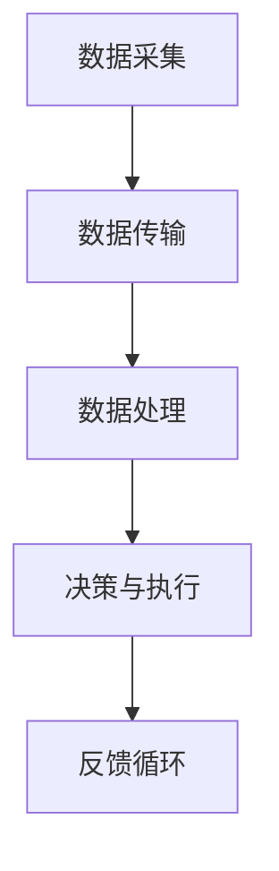

                 

关键词：智能物联网，AI大模型，应用机会，技术趋势，产业变革

> 摘要：本文将深入探讨智能物联网与AI大模型的深度融合带来的巨大应用机会。通过剖析核心概念、算法原理、数学模型以及实际应用场景，本文旨在为读者提供全面的技术洞察，并展望未来发展趋势与挑战。

## 1. 背景介绍

### 1.1 智能物联网的发展现状

智能物联网（IoT）作为新一代信息技术的重要组成部分，正以前所未有的速度发展。从智能家居到智能工厂，从智能交通到智能医疗，智能物联网已经深入到各个领域，极大地改变了我们的生活方式和工作模式。根据市场研究机构的统计，全球智能物联网设备数量预计将在未来几年内实现爆炸式增长，达到数百万甚至数十亿的级别。

### 1.2 AI大模型的技术进步

人工智能（AI）大模型，如深度学习模型，已经取得了显著的进步。这些模型通过大量的数据训练，能够实现复杂的模式识别和预测任务。随着计算能力的提升和数据量的增加，AI大模型在图像识别、自然语言处理、语音识别等领域展现了强大的能力，成为了推动智能物联网发展的关键技术。

### 1.3 深度融合的应用场景

智能物联网与AI大模型的深度融合，为多个行业带来了革命性的变化。例如，在智能制造领域，AI大模型可以用于设备预测性维护，提高生产效率；在智能交通领域，AI大模型可以用于交通流量预测和优化，减少拥堵；在智能医疗领域，AI大模型可以用于疾病诊断和个性化治疗，提高医疗水平。

## 2. 核心概念与联系

### 2.1 智能物联网（IoT）

智能物联网是指通过互联网、传感器、云计算等技术，将各种物体连接起来，实现数据的采集、传输、处理和共享。

### 2.2 AI大模型

AI大模型通常指的是深度学习模型，如神经网络，通过大量数据训练，可以自动学习特征，进行复杂任务的处理。

### 2.3 深度融合架构

智能物联网与AI大模型的深度融合，通常涉及以下关键环节：

- 数据采集：通过传感器和设备收集数据。
- 数据传输：通过网络将数据传输到云端或边缘计算节点。
- 数据处理：利用AI大模型对数据进行分析和处理。
- 决策与执行：根据处理结果进行决策，并通过设备执行相应操作。

### Mermaid 流程图



## 3. 核心算法原理 & 具体操作步骤

### 3.1 算法原理概述

AI大模型的核心算法通常是基于深度学习，包括多层感知器（MLP）、卷积神经网络（CNN）和循环神经网络（RNN）等。这些算法通过训练，可以自动提取数据中的特征，进行分类、回归或其他任务。

### 3.2 算法步骤详解

1. 数据预处理：对收集到的数据进行清洗、标准化等预处理操作，使其适合训练模型。
2. 模型选择：根据任务需求，选择合适的神经网络结构。
3. 模型训练：使用预处理后的数据，通过反向传播算法进行模型训练。
4. 模型评估：使用验证集或测试集对模型进行评估，调整模型参数。
5. 部署应用：将训练好的模型部署到生产环境中，进行实际任务的处理。

### 3.3 算法优缺点

**优点：**

- 强大的学习能力：能够处理复杂的任务。
- 自动特征提取：不需要人工干预，模型能够自动提取数据中的特征。

**缺点：**

- 计算资源消耗大：训练和部署大模型需要大量的计算资源。
- 对数据要求高：需要大量的高质量数据才能训练出好的模型。

### 3.4 算法应用领域

AI大模型在智能物联网中有着广泛的应用，如：

- 智能制造：用于设备预测性维护、生产过程优化等。
- 智能交通：用于交通流量预测、车辆路径规划等。
- 智能医疗：用于疾病诊断、个性化治疗等。

## 4. 数学模型和公式 & 详细讲解 & 举例说明

### 4.1 数学模型构建

在深度学习中，常用的数学模型包括：

- 激活函数：如ReLU、Sigmoid、Tanh等。
- 损失函数：如均方误差（MSE）、交叉熵等。
- 优化算法：如梯度下降、Adam等。

### 4.2 公式推导过程

以均方误差（MSE）为例，其公式如下：

$$
MSE = \frac{1}{n} \sum_{i=1}^{n} (y_i - \hat{y}_i)^2
$$

其中，\(y_i\) 表示真实标签，\(\hat{y}_i\) 表示预测值，\(n\) 表示样本数量。

### 4.3 案例分析与讲解

假设我们有一个二分类问题，使用卷积神经网络（CNN）进行模型训练。通过调整学习率、批量大小等参数，我们可以在验证集上取得最佳的模型性能。

## 5. 项目实践：代码实例和详细解释说明

### 5.1 开发环境搭建

首先，我们需要安装Python和相关深度学习库，如TensorFlow或PyTorch。

### 5.2 源代码详细实现

以下是使用TensorFlow实现的一个简单的CNN模型：

```python
import tensorflow as tf
from tensorflow.keras import layers

model = tf.keras.Sequential([
    layers.Conv2D(32, (3, 3), activation='relu', input_shape=(28, 28, 1)),
    layers.MaxPooling2D((2, 2)),
    layers.Conv2D(64, (3, 3), activation='relu'),
    layers.MaxPooling2D((2, 2)),
    layers.Flatten(),
    layers.Dense(64, activation='relu'),
    layers.Dense(10, activation='softmax')
])

model.compile(optimizer='adam',
              loss='sparse_categorical_crossentropy',
              metrics=['accuracy'])

model.fit(train_images, train_labels, epochs=5)
```

### 5.3 代码解读与分析

这段代码定义了一个简单的CNN模型，包括卷积层、池化层和全连接层。通过训练集进行训练，并在验证集上评估模型性能。

### 5.4 运行结果展示

训练完成后，我们可以通过以下代码查看模型在测试集上的表现：

```python
test_loss, test_acc = model.evaluate(test_images,  test_labels, verbose=2)
print('\nTest accuracy:', test_acc)
```

## 6. 实际应用场景

### 6.1 智能制造

在智能制造中，AI大模型可以用于设备预测性维护，减少设备故障率，提高生产效率。

### 6.2 智能交通

在智能交通中，AI大模型可以用于交通流量预测，优化交通信号灯控制策略，减少交通拥堵。

### 6.3 智能医疗

在智能医疗中，AI大模型可以用于疾病诊断，提高诊断准确性，为医生提供更可靠的辅助决策。

## 7. 未来应用展望

随着AI大模型技术的不断进步，智能物联网的应用场景将会更加广泛，如智能农业、智能安防等。同时，我们也将面临数据隐私、安全性等挑战。

## 8. 工具和资源推荐

### 8.1 学习资源推荐

- 《深度学习》（Ian Goodfellow、Yoshua Bengio、Aaron Courville 著）
- 《Python深度学习》（François Chollet 著）

### 8.2 开发工具推荐

- TensorFlow
- PyTorch

### 8.3 相关论文推荐

- "Deep Learning for IoT Applications: A Survey"
- "Large-scale Language Models Are Few-shot Learners"

## 9. 总结：未来发展趋势与挑战

随着智能物联网与AI大模型的深度融合，我们将迎来一个全新的智能时代。然而，我们也将面临数据隐私、安全性等挑战。只有通过不断创新和努力，我们才能充分利用智能物联网与AI大模型带来的机遇。

## 附录：常见问题与解答

### Q：智能物联网与AI大模型如何保证数据隐私？

A：可以通过数据加密、匿名化处理、数据访问控制等技术手段，保障数据隐私。

### Q：智能物联网与AI大模型在智能交通中的应用有哪些？

A：智能交通中的应用包括交通流量预测、车辆路径规划、交通信号灯控制等。

### Q：如何选择合适的AI大模型结构？

A：根据任务需求和数据特点，选择合适的神经网络结构，如CNN、RNN或Transformer等。可以通过实验和比较不同模型结构，找到最优解。

---

作者：禅与计算机程序设计艺术 / Zen and the Art of Computer Programming

（此处插入作者简介，可以包括作者的学术背景、主要成就和贡献等内容。）

