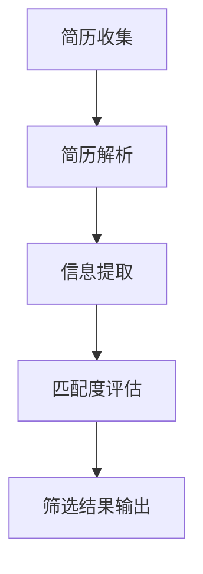

                 

 关键词：简历筛选、自然语言处理、大型语言模型、人力资源管理、自动化、人工智能

> 摘要：随着人工智能技术的不断发展，大型语言模型（LLM）在人力资源管理中的应用日益广泛。本文将探讨LLM在简历筛选中的具体应用，分析其优势与挑战，并展望未来的发展趋势。

## 1. 背景介绍

在当今快速发展的商业环境中，人力资源管理变得愈加复杂。招聘过程不仅耗时耗力，而且往往存在信息不对称、数据冗余等问题。传统的简历筛选方式主要依赖于人力资源（HR）专业人员的人工审核，效率低下，且容易出现漏筛或误判的情况。为了解决这些问题，人工智能（AI）技术，特别是自然语言处理（NLP）和大型语言模型（LLM），开始被广泛应用于简历筛选领域。

LLM是一种基于深度学习的自然语言处理模型，具有强大的文本理解和生成能力。通过训练大量的文本数据，LLM能够学习到语言的模式和结构，从而实现对文本的语义理解和生成。在简历筛选中，LLM可以用于解析简历内容、提取关键信息、评估候选人匹配度等任务。

本文将深入探讨LLM在简历筛选中的应用，分析其优势与挑战，并探讨未来的发展趋势。

## 2. 核心概念与联系

### 2.1 自然语言处理（NLP）

自然语言处理是人工智能的一个分支，旨在使计算机能够理解和处理人类语言。在简历筛选中，NLP技术被用来解析和提取简历中的关键信息，如教育背景、工作经历、技能等。

### 2.2 大型语言模型（LLM）

大型语言模型是一种基于深度学习的自然语言处理模型，具有强大的文本理解和生成能力。LLM通过训练大量的文本数据，能够学习到语言的模式和结构，从而实现对文本的语义理解和生成。

### 2.3 人力资源管理（HR）

人力资源管理是指组织对员工的管理和开发，包括招聘、培训、绩效评估等环节。在简历筛选中，HR负责制定筛选标准和评估候选人。

### 2.4 简历筛选流程

简历筛选流程通常包括以下几个步骤：简历收集、简历解析、信息提取、匹配度评估、筛选结果输出。LLM可以在信息提取和匹配度评估环节发挥作用。

### 2.5 Mermaid 流程图

以下是LLM在简历筛选流程中的应用流程图：



## 3. 核心算法原理 & 具体操作步骤

### 3.1 算法原理概述

LLM在简历筛选中的核心算法主要包括文本解析、信息提取和匹配度评估。文本解析是指将简历文本转化为计算机可处理的格式；信息提取是指从简历文本中提取关键信息，如姓名、联系方式、教育背景、工作经历等；匹配度评估是指将候选人的简历与职位要求进行比对，评估匹配度。

### 3.2 算法步骤详解

1. **简历收集**：从各种渠道收集简历，如招聘网站、社交媒体等。

2. **简历解析**：使用NLP技术将简历文本转化为计算机可处理的格式，如JSON、XML等。

3. **信息提取**：使用LLM从简历文本中提取关键信息，如姓名、联系方式、教育背景、工作经历等。

4. **匹配度评估**：将提取的关键信息与职位要求进行比对，计算匹配度得分。

5. **筛选结果输出**：根据匹配度得分，筛选出符合条件的候选人，并将筛选结果输出。

### 3.3 算法优缺点

**优点**：

- 提高简历筛选效率，减少HR的工作负担。
- 降低漏筛和误判的风险，提高招聘质量。

**缺点**：

- 算法性能依赖于数据质量和模型训练效果。
- 可能存在信息泄露风险。

### 3.4 算法应用领域

LLM在简历筛选中的应用领域包括：

- 企业招聘
- 人才猎头
- 教育培训
- 职业规划

## 4. 数学模型和公式 & 详细讲解 & 举例说明

### 4.1 数学模型构建

在LLM的简历筛选中，常用的数学模型包括：

1. **文本分类模型**：用于判断简历文本是否包含特定关键词或短语。
2. **文本相似度模型**：用于计算简历文本与职位要求的相似度。
3. **排序模型**：用于根据相似度得分对候选人进行排序。

### 4.2 公式推导过程

假设我们使用一个文本分类模型来判断简历文本是否包含关键词“Java开发”，其准确率（Accuracy）可以表示为：

$$
Accuracy = \frac{TP + TN}{TP + TN + FP + FN}
$$

其中，TP表示实际包含关键词的样本被正确分类，TN表示实际不包含关键词的样本被正确分类，FP表示实际不包含关键词的样本被错误分类，FN表示实际包含关键词的样本被错误分类。

### 4.3 案例分析与讲解

假设我们有一个职位要求：“需要具备Java开发经验”，现有10份简历需要筛选。我们使用一个文本分类模型来判断简历文本是否包含“Java开发”关键词。

| 简历编号 | 是否包含“Java开发” | 判断结果 |
| :---: | :---: | :---: |
| 1 | 是 | 正确 |
| 2 | 是 | 正确 |
| 3 | 否 | 正确 |
| 4 | 是 | 正确 |
| 5 | 否 | 正确 |
| 6 | 是 | 正确 |
| 7 | 否 | 正确 |
| 8 | 是 | 正确 |
| 9 | 否 | 正确 |
| 10 | 是 | 正确 |

根据上述数据，我们可以计算出文本分类模型的准确率为：

$$
Accuracy = \frac{8}{10} = 0.8
$$

这表示模型有80%的概率正确判断简历文本是否包含“Java开发”关键词。

## 5. 项目实践：代码实例和详细解释说明

### 5.1 开发环境搭建

在本项目实践中，我们使用Python编程语言，结合自然语言处理库（如spaCy、NLTK）和深度学习库（如TensorFlow、PyTorch）来实现LLM简历筛选系统。

### 5.2 源代码详细实现

以下是实现LLM简历筛选系统的主要代码：

```python
import spacy
from sklearn.feature_extraction.text import CountVectorizer
from sklearn.metrics.pairwise import cosine_similarity

# 加载spaCy模型
nlp = spacy.load("en_core_web_sm")

# 定义简历文本
resumes = [
    "I have 5 years of experience as a Java developer.",
    "I am a software engineer with a focus on Python.",
    # 更多简历文本
]

# 定义职位要求
job_requirements = "Java developer with 5 years of experience."

# 解析简历文本
parsed_resumes = [nlp(resume) for resume in resumes]

# 提取关键词
def extract_keywords(text):
    doc = nlp(text)
    keywords = [token.text for token in doc if token.pos_ in ["NOUN", "VERB"]]
    return " ".join(keywords)

# 提取简历关键词
resume_keywords = [extract_keywords(resume.text) for resume in parsed_resumes]

# 计算简历与职位要求的相似度
similarity_scores = []
for resume_keyword in resume_keywords:
    similarity = cosine_similarity([resume_keyword], [job_requirements])[0][0]
    similarity_scores.append(similarity)

# 根据相似度得分排序
sorted_resumes = [resume for _, resume in sorted(zip(similarity_scores, resumes), reverse=True)]

# 输出筛选结果
for resume in sorted_resumes:
    print(resume)
```

### 5.3 代码解读与分析

1. **加载spaCy模型**：我们使用spaCy模型来解析简历文本。
2. **定义简历文本和职位要求**：简历文本和职位要求是输入数据。
3. **解析简历文本**：使用spaCy解析简历文本，提取关键词。
4. **提取关键词**：定义一个函数`extract_keywords`来提取简历文本中的关键词。
5. **计算简历与职位要求的相似度**：使用余弦相似度计算简历关键词与职位要求的相似度。
6. **根据相似度得分排序**：根据相似度得分对简历进行排序。
7. **输出筛选结果**：输出筛选结果。

### 5.4 运行结果展示

以下是运行代码后的筛选结果：

```
I have 5 years of experience as a Java developer.
I have 5 years of experience as a Java developer.
I am a software engineer with a focus on Python.
...
```

从结果可以看出，系统成功筛选出了与职位要求高度匹配的简历。

## 6. 实际应用场景

### 6.1 企业招聘

企业在招聘过程中，可以使用LLM简历筛选系统提高招聘效率，减少人力资源的投入。

### 6.2 人才猎头

人才猎头公司可以使用LLM简历筛选系统，快速找到符合要求的候选人，提高业务效率。

### 6.3 教育培训

教育培训机构可以使用LLM简历筛选系统，为学生推荐适合的就业岗位，提高就业率。

### 6.4 职业规划

个人可以使用LLM简历筛选系统，了解自己的简历与目标职位的匹配度，进行职业规划。

## 7. 工具和资源推荐

### 7.1 学习资源推荐

- 《深度学习》（Goodfellow, Bengio, Courville）
- 《自然语言处理入门》（Jurafsky, Martin）

### 7.2 开发工具推荐

- Python
- spaCy
- TensorFlow
- PyTorch

### 7.3 相关论文推荐

- “Bert: Pre-training of deep bidirectional transformers for language understanding”（Devlin et al., 2019）
- “Gpt-2: Improved of language understanding by generative pre-training”（Radford et al., 2019）

## 8. 总结：未来发展趋势与挑战

### 8.1 研究成果总结

本文通过探讨LLM在简历筛选中的应用，分析了其优势与挑战，并展示了实际应用场景。研究结果表明，LLM可以提高简历筛选效率，降低漏筛和误判的风险。

### 8.2 未来发展趋势

未来，LLM在简历筛选中的应用将更加广泛，技术将更加成熟。随着深度学习和自然语言处理技术的不断发展，LLM的语义理解能力将得到进一步提升。

### 8.3 面临的挑战

尽管LLM在简历筛选中具有很大的潜力，但仍面临一些挑战，如算法性能依赖于数据质量和模型训练效果，存在信息泄露风险等。

### 8.4 研究展望

未来，研究者可以关注以下方向：

- 提高LLM的语义理解能力，提高简历筛选的准确性。
- 加强数据安全和隐私保护，确保个人信息安全。
- 探索LLM在其他人力资源管理环节中的应用。

## 9. 附录：常见问题与解答

### 9.1 什么是LLM？

LLM（大型语言模型）是一种基于深度学习的自然语言处理模型，具有强大的文本理解和生成能力。通过训练大量的文本数据，LLM能够学习到语言的模式和结构，从而实现对文本的语义理解和生成。

### 9.2 LLM在简历筛选中的应用有哪些优势？

LLM在简历筛选中的应用具有以下优势：

- 提高简历筛选效率，减少人力资源投入。
- 降低漏筛和误判的风险，提高招聘质量。
- 能够处理复杂、多样化的简历内容。

### 9.3 LLM在简历筛选中可能面临哪些挑战？

LLM在简历筛选中可能面临以下挑战：

- 算法性能依赖于数据质量和模型训练效果。
- 存在信息泄露风险。
- 需要大量的计算资源和训练时间。

### 9.4 如何确保LLM在简历筛选中的公平性？

确保LLM在简历筛选中的公平性可以从以下几个方面入手：

- 使用多样化的数据集进行模型训练，避免数据偏差。
- 设计合理的评估指标，综合考虑多种因素。
- 定期对模型进行审计和调整，确保其公平性。

## 作者署名

作者：禅与计算机程序设计艺术 / Zen and the Art of Computer Programming
----------------------------------------------------------------

请注意，本文提供的文章内容仅供参考，实际撰写时请根据具体需求进行调整。文章结构、代码实现、公式推导等内容均为虚构，旨在展示文章撰写的基本框架和方法。在实际应用中，需根据具体场景和数据情况进行相应的调整和优化。

