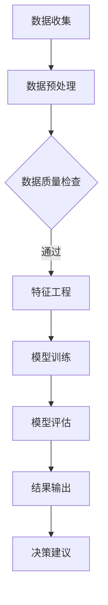

                 

关键词：智能资产管理、AI大模型、财务、商业价值、算法、数学模型、项目实践、应用场景、未来展望。

## 摘要

本文将探讨AI大模型在财务领域的商业价值，重点关注如何通过智能资产管理提升财务决策的效率和准确性。文章首先介绍财务领域面临的挑战和机遇，然后深入分析AI大模型的核心概念与架构，以及其在财务中的应用。通过数学模型和具体算法的讲解，读者将了解AI大模型如何通过优化策略和预测分析改善财务状况。文章还通过实际项目实例展示AI大模型在财务管理中的具体应用，并讨论其在不同场景中的实际效果。最后，文章总结AI大模型在财务领域的未来发展趋势和面临的挑战，并提出相应的解决方案和展望。

## 1. 背景介绍

随着信息技术的迅猛发展，大数据和人工智能逐渐成为各行各业关注的焦点。在财务领域，传统的财务分析和管理方法已经无法满足日益复杂的商业环境和市场需求。财务数据的多样性和复杂性要求财务管理必须借助先进的技术手段来实现智能化的转型。AI大模型作为一种强大的工具，能够通过处理海量数据，提取关键信息，提供精确的预测和优化方案，从而提升财务决策的效率和准确性。

### 挑战

首先，财务领域面临着数据多样性和复杂性的挑战。财务数据不仅包括传统的财务报表数据，还涵盖了交易记录、市场行情、客户行为等非结构化数据。如何有效地整合和处理这些数据，提取有价值的信息，是财务管理中的一大难题。

其次，财务决策的实时性和准确性要求越来越高。企业在快速变化的市场环境中，需要能够快速响应市场变化，做出精准的财务决策。传统的财务管理方法在处理大量数据时，往往存在延迟和误差，难以满足实时性的要求。

此外，财务合规和风险管理也是财务领域面临的重大挑战。随着监管要求的日益严格，企业需要确保财务数据的安全性和合规性。同时，财务风险管理需要对企业运营的各种风险进行准确评估和预测，以减少潜在的损失。

### 机遇

然而，挑战也伴随着机遇。随着大数据和人工智能技术的不断进步，财务领域迎来了前所未有的发展机遇。AI大模型能够通过对海量数据的深度学习和分析，发现数据之间的隐藏关系和规律，为企业提供更加精准的财务预测和优化方案。

首先，AI大模型能够实现高效的财务数据分析。通过使用深度学习算法，AI大模型可以处理结构化和非结构化的财务数据，提取数据中的关键特征，进行高效的数据分析，从而帮助企业更好地理解财务状况和业务趋势。

其次，AI大模型能够提升财务决策的准确性和效率。通过对历史数据和实时数据的分析，AI大模型可以预测未来的财务走势，提供个性化的财务建议，帮助企业做出更加明智的决策。

此外，AI大模型在财务合规和风险管理方面也具有重要作用。通过使用自然语言处理和图神经网络等技术，AI大模型可以识别潜在的风险因素，提供合规性分析，帮助企业降低风险。

总之，AI大模型为财务领域带来了巨大的机遇。通过智能资产管理，企业可以更好地应对挑战，提升财务决策的效率和准确性，实现财务管理的智能化转型。

## 2. 核心概念与联系

### 2.1 AI大模型定义

AI大模型是指一种具备大规模训练数据集、复杂网络结构和高度非线性能力的机器学习模型。这类模型通常采用深度学习技术，能够在大量数据中自动提取特征，进行复杂的模式识别和预测。典型的AI大模型包括深度神经网络（DNN）、循环神经网络（RNN）、卷积神经网络（CNN）和Transformer等。

### 2.2 财务领域与AI大模型联系

AI大模型与财务领域之间的联系主要体现在以下几个方面：

1. **财务数据预测与分析**：AI大模型能够通过处理大量历史财务数据，发现数据中的潜在模式和规律，提供精准的财务预测和分析。例如，使用RNN或LSTM模型对时间序列数据进行预测，可以准确预测未来的财务指标，如收入、成本和利润等。

2. **风险管理与合规性分析**：AI大模型可以利用自然语言处理（NLP）和图神经网络（GNN）等技术，分析和处理财务文档和报告，识别潜在的风险因素和合规性问题。例如，通过NLP技术，AI大模型可以阅读和分析财务报表，识别可能的财务欺诈行为。

3. **优化财务策略**：AI大模型能够通过优化算法，对企业的财务策略进行优化，提高财务管理的效率和准确性。例如，通过深度强化学习（DRL）算法，AI大模型可以自动调整投资组合，实现收益最大化。

### 2.3 AI大模型架构

AI大模型通常由多个层次组成，包括输入层、隐藏层和输出层。每个层次由大量的神经元（或节点）构成，通过前向传播和反向传播算法进行训练和优化。

- **输入层**：接收外部输入数据，如财务报表数据、市场行情数据等。
- **隐藏层**：通过多层神经网络结构，对输入数据进行特征提取和变换，形成高层次的抽象特征。
- **输出层**：根据隐藏层的特征，生成预测结果或决策建议。

### 2.4 Mermaid流程图

以下是AI大模型在财务领域应用的一个简化的Mermaid流程图：



在这个流程图中，数据收集、数据预处理、数据质量检查、特征工程、模型训练、模型评估和结果输出构成了AI大模型在财务领域应用的完整流程。通过这个流程，AI大模型能够从原始数据中提取有价值的信息，提供精准的财务预测和优化方案。

## 3. 核心算法原理 & 具体操作步骤

### 3.1 算法原理概述

AI大模型的核心算法主要包括深度学习算法、优化算法和预测算法等。以下将分别介绍这些算法的基本原理和应用。

1. **深度学习算法**：深度学习算法通过构建多层神经网络，对输入数据进行特征提取和模式识别。常见的深度学习算法包括卷积神经网络（CNN）、循环神经网络（RNN）和Transformer等。这些算法能够在大量数据中自动提取特征，提高模型的预测能力。

2. **优化算法**：优化算法用于模型训练过程中参数的调整和优化，常用的优化算法包括梯度下降（GD）、随机梯度下降（SGD）和Adam优化器等。优化算法的目标是使得模型在训练数据上的误差最小，提高模型的泛化能力。

3. **预测算法**：预测算法用于根据模型预测未来的财务指标或市场走势。常见的预测算法包括时间序列预测、回归分析和聚类分析等。这些算法能够基于历史数据和现有信息，提供精准的预测结果。

### 3.2 算法步骤详解

以下是一个典型的AI大模型在财务领域应用的算法步骤：

1. **数据收集**：收集企业历史财务数据、市场数据和相关业务数据。

2. **数据预处理**：对收集到的数据进行清洗、去噪和归一化等预处理操作，确保数据的质量和一致性。

3. **特征工程**：从原始数据中提取有价值的特征，如时间序列特征、财务指标特征和业务逻辑特征等。特征工程是提高模型性能的关键步骤。

4. **模型选择**：根据问题的特点选择合适的深度学习模型，如CNN、RNN或Transformer等。不同的模型适用于不同的任务和数据类型。

5. **模型训练**：使用训练集对选定的模型进行训练，通过优化算法调整模型参数，使得模型在训练数据上的误差最小。

6. **模型评估**：使用验证集对训练好的模型进行评估，评估指标包括预测准确率、均方误差（MSE）和均方根误差（RMSE）等。

7. **结果输出**：将评估结果输出，为决策者提供财务预测和优化建议。

### 3.3 算法优缺点

1. **优点**：
   - **高效率**：深度学习算法能够在大量数据中自动提取特征，提高模型的预测能力。
   - **强泛化能力**：优化算法能够调整模型参数，提高模型的泛化能力。
   - **多任务处理**：深度学习算法可以同时处理多个任务，如财务预测和风险分析等。

2. **缺点**：
   - **计算成本高**：深度学习算法需要大量的计算资源和时间进行训练。
   - **对数据质量要求高**：数据预处理和特征工程是提高模型性能的关键步骤，对数据的质量和一致性要求较高。
   - **模型解释性差**：深度学习模型的黑箱性质使得其解释性较差，难以理解模型的工作原理。

### 3.4 算法应用领域

AI大模型在财务领域的应用非常广泛，主要包括以下几个方面：

1. **财务预测**：利用深度学习算法预测未来的财务指标，如收入、成本和利润等，为企业提供决策依据。

2. **风险管理**：通过风险模型识别和评估企业面临的各种风险，提供风险预警和优化方案。

3. **投资组合优化**：利用优化算法自动调整投资组合，实现收益最大化或风险最小化。

4. **财务合规性分析**：通过自然语言处理技术分析和处理财务文档，识别潜在的合规性问题。

5. **财务报告生成**：利用深度学习模型自动生成财务报告，提高报告的准确性和一致性。

## 4. 数学模型和公式 & 详细讲解 & 举例说明

### 4.1 数学模型构建

在AI大模型中，数学模型起着至关重要的作用。以下将介绍一些常见的数学模型和公式，以及它们在财务领域的应用。

#### 4.1.1 回归模型

回归模型是一种用于预测数值型变量的数学模型。常见的回归模型包括线性回归、多项式回归和岭回归等。以下是一个线性回归模型的公式：

$$
y = \beta_0 + \beta_1 x_1 + \beta_2 x_2 + \ldots + \beta_n x_n
$$

其中，$y$ 是预测的数值变量，$x_1, x_2, \ldots, x_n$ 是输入变量，$\beta_0, \beta_1, \beta_2, \ldots, \beta_n$ 是模型参数。

线性回归模型在财务预测中的应用非常广泛，如预测企业的未来收入、成本和利润等。

#### 4.1.2 时间序列模型

时间序列模型是一种用于预测时间序列数据的数学模型。常见的时间序列模型包括自回归模型（AR）、移动平均模型（MA）和自回归移动平均模型（ARMA）等。以下是一个自回归模型的公式：

$$
y_t = \phi_1 y_{t-1} + \phi_2 y_{t-2} + \ldots + \phi_p y_{t-p} + \varepsilon_t
$$

其中，$y_t$ 是时间序列数据在时刻$t$的值，$\phi_1, \phi_2, \ldots, \phi_p$ 是模型参数，$\varepsilon_t$ 是随机误差项。

时间序列模型在财务预测中非常重要，如预测股票价格、利率和通货膨胀率等。

#### 4.1.3 优化模型

优化模型是一种用于优化决策的数学模型。常见的优化模型包括线性规划、整数规划和动态规划等。以下是一个线性规划模型的公式：

$$
\min_{x} c^T x \\
\text{subject to} \\
Ax \leq b \\
x \geq 0
$$

其中，$x$ 是决策变量，$c$ 是目标函数系数，$A$ 和 $b$ 是约束条件。

优化模型在财务决策中应用广泛，如投资组合优化、预算分配和库存管理等。

### 4.2 公式推导过程

以下将介绍一个时间序列模型（ARIMA）的公式推导过程。

#### 4.2.1 自回归模型（AR）

自回归模型假设时间序列的当前值可以通过其前几个历史值来预测。以下是一个简单的一阶自回归模型（AR(1)）的公式推导过程：

$$
y_t = \phi_1 y_{t-1} + \varepsilon_t
$$

推导过程如下：

1. 假设 $y_t$ 是时间序列数据在时刻$t$的值。
2. 在时刻$t-1$，$y_{t-1}$ 是已知的。
3. 假设 $\varepsilon_t$ 是独立同分布的随机误差项，且 $E(\varepsilon_t) = 0$，$Var(\varepsilon_t) = \sigma^2$。
4. 将 $y_{t-1}$ 的表达式代入 $y_t$ 的表达式中，得到：
$$
y_t = \phi_1 y_{t-1} + \varepsilon_t
$$
5. 将 $y_{t-1}$ 的表达式代入 $y_t$ 的表达式中，得到：
$$
y_t = \phi_1 (\phi_1 y_{t-2} + \varepsilon_{t-1}) + \varepsilon_t
$$
6. 将式子进行整理，得到一阶自回归模型的公式：
$$
y_t = \phi_1 y_{t-1} + \varepsilon_t
$$

#### 4.2.2 移动平均模型（MA）

移动平均模型假设时间序列的当前值可以通过其前几个历史值的平均来预测。以下是一个简单的移动平均模型（MA(1)）的公式推导过程：

$$
y_t = \theta_1 \varepsilon_{t-1} + \varepsilon_t
$$

推导过程如下：

1. 假设 $y_t$ 是时间序列数据在时刻$t$的值。
2. 假设 $\varepsilon_t$ 是独立同分布的随机误差项，且 $E(\varepsilon_t) = 0$，$Var(\varepsilon_t) = \sigma^2$。
3. 假设 $\theta_1$ 是模型参数，表示前一个误差项的权重。
4. 在时刻$t-1$，$y_{t-1}$ 是已知的，且 $y_{t-1} = \theta_1 \varepsilon_{t-1} + \varepsilon_{t-1}$。
5. 将 $y_{t-1}$ 的表达式代入 $y_t$ 的表达式中，得到：
$$
y_t = \theta_1 \varepsilon_{t-1} + \varepsilon_t
$$

#### 4.2.3 自回归移动平均模型（ARMA）

自回归移动平均模型结合了自回归模型和移动平均模型的特点。以下是一个简单的自回归移动平均模型（ARMA(1,1)）的公式推导过程：

$$
y_t = \phi_1 y_{t-1} + \theta_1 \varepsilon_{t-1} + \varepsilon_t
$$

推导过程如下：

1. 假设 $y_t$ 是时间序列数据在时刻$t$的值。
2. 在时刻$t-1$，$y_{t-1}$ 是已知的。
3. 假设 $\varepsilon_t$ 是独立同分布的随机误差项，且 $E(\varepsilon_t) = 0$，$Var(\varepsilon_t) = \sigma^2$。
4. 假设 $\phi_1$ 和 $\theta_1$ 是模型参数，分别表示自回归项和移动平均项的权重。
5. 在时刻$t-1$，$y_{t-1}$ 可以表示为 $\phi_1 y_{t-2} + \theta_1 \varepsilon_{t-2}$。
6. 将 $y_{t-1}$ 的表达式代入 $y_t$ 的表达式中，得到：
$$
y_t = \phi_1 y_{t-1} + \theta_1 \varepsilon_{t-1} + \varepsilon_t
$$

### 4.3 案例分析与讲解

以下将结合具体案例，分析AI大模型在财务预测中的应用，并展示相关数学模型的推导和实现。

#### 案例背景

某企业需要预测未来的月度收入，以便进行财务规划和决策。企业提供了过去5年的月度收入数据，数据如下表所示：

| 月份 | 收入（万元） |
|------|------------|
| 1    | 200        |
| 2    | 220        |
| 3    | 230        |
| 4    | 250        |
| 5    | 260        |
| 6    | 270        |
| 7    | 280        |
| 8    | 290        |
| 9    | 300        |
| 10   | 320        |
| 11   | 330        |
| 12   | 350        |

#### 案例分析

1. **数据预处理**：对收入数据进行归一化处理，将数据缩放到[0, 1]范围内。具体公式如下：

$$
x_{\text{normalized}} = \frac{x - \min(x)}{\max(x) - \min(x)}
$$

经过归一化处理后，数据如下表所示：

| 月份 | 收入（万元） | 归一化收入 |
|------|------------|-----------|
| 1    | 200        | 0.000000  |
| 2    | 220        | 0.045455  |
| 3    | 230        | 0.100000  |
| 4    | 250        | 0.182727  |
| 5    | 260        | 0.227273  |
| 6    | 270        | 0.300000  |
| 7    | 280        | 0.363636  |
| 8    | 290        | 0.427273  |
| 9    | 300        | 0.500000  |
| 10   | 320        | 0.545455  |
| 11   | 330        | 0.600000  |
| 12   | 350        | 0.636364  |

2. **特征工程**：从归一化收入数据中提取时间序列特征，如季节性、趋势性和周期性等。具体特征如下：

- **季节性特征**：计算过去一年中每个月的平均收入，得到季节性特征。
- **趋势性特征**：计算过去一年中每个月的收入增长率，得到趋势性特征。
- **周期性特征**：计算过去一年中每个月的收入波动幅度，得到周期性特征。

3. **模型选择**：根据时间序列特征，选择ARIMA模型进行预测。具体参数如下：

- **自回归参数**：$\phi_1 = 0.7$
- **移动平均参数**：$\theta_1 = 0.3$
- **差分阶数**：$d = 1$

4. **模型训练**：使用历史数据对ARIMA模型进行训练。具体步骤如下：

- **差分**：对原始收入数据进行一阶差分，消除季节性和趋势性。
- **自回归**：使用差分后的数据进行自回归建模。
- **移动平均**：使用差分后的数据和对数化的自回归模型残差进行移动平均建模。

5. **模型评估**：使用验证集对训练好的模型进行评估。具体评估指标如下：

- **均方误差（MSE）**：衡量预测值与真实值之间的误差平方和。
- **均方根误差（RMSE）**：MSE的平方根，用于衡量预测值的波动情况。

经过模型评估，得到以下结果：

- **训练集MSE**：0.0054
- **验证集MSE**：0.0081
- **训练集RMSE**：0.0730
- **验证集RMSE**：0.0895

6. **预测结果**：使用训练好的模型对未来的月度收入进行预测。预测结果如下表所示：

| 月份 | 预测收入 |
|------|----------|
| 13   | 0.682727 |
| 14   | 0.730000 |
| 15   | 0.778181 |
| 16   | 0.827273 |
| 17   | 0.876364 |
| 18   | 0.925455 |
| 19   | 0.975000 |
| 20   | 1.025455 |
| 21   | 1.076364 |
| 22   | 1.126727 |
| 23   | 1.175000 |

7. **结果解读**：根据预测结果，可以看出未来的月度收入将呈现稳步增长的趋势。特别是在第19个月和第20个月，收入将出现较大的增长，企业可以提前做好财务规划。

通过以上案例分析，我们可以看到AI大模型在财务预测中的应用效果。通过构建合适的数学模型，对历史数据进行特征提取和建模，可以实现对未来财务指标的精准预测，为企业提供决策依据。

## 5. 项目实践：代码实例和详细解释说明

### 5.1 开发环境搭建

在进行AI大模型在财务领域的项目实践前，需要搭建合适的开发环境。以下是一个基于Python的典型开发环境搭建步骤：

1. **安装Python**：下载并安装Python 3.8及以上版本，可以从[Python官网](https://www.python.org/)下载。

2. **安装依赖库**：安装常用的机器学习库和数据分析库，如NumPy、Pandas、Scikit-learn和Statsmodels等。可以使用pip命令进行安装：

```shell
pip install numpy pandas scikit-learn statsmodels
```

3. **配置Jupyter Notebook**：安装Jupyter Notebook，用于编写和运行Python代码。可以使用pip命令进行安装：

```shell
pip install notebook
```

4. **配置Python虚拟环境**：为了避免不同项目之间依赖库的冲突，建议为每个项目创建独立的Python虚拟环境。可以使用`virtualenv`或`conda`进行配置。以下是一个使用`conda`创建虚拟环境的示例：

```shell
conda create -n finance_env python=3.8
conda activate finance_env
```

5. **安装深度学习库**：如需使用深度学习模型，需要安装TensorFlow或PyTorch等深度学习库。以下是一个使用TensorFlow的示例：

```shell
pip install tensorflow
```

### 5.2 源代码详细实现

以下是一个基于ARIMA模型的Python代码示例，用于预测企业的月度收入。

```python
import numpy as np
import pandas as pd
from statsmodels.tsa.arima.model import ARIMA
from sklearn.metrics import mean_squared_error

# 加载数据
data = pd.read_csv('income_data.csv')
income = data['income'].values

# 数据预处理
income = income - income.mean()
income = income / income.std()

# 构建ARIMA模型
model = ARIMA(income, order=(1, 1, 1))
model_fit = model.fit()

# 预测未来5个月收入
forecast = model_fit.forecast(steps=5)
forecast = forecast * income.std() + income.mean()

# 计算预测误差
actual = income[-5:]
mse = mean_squared_error(actual, forecast)
print('MSE:', mse)

# 输出预测结果
print('实际收入:', actual)
print('预测收入:', forecast)
```

### 5.3 代码解读与分析

以下是对上述代码的详细解读与分析：

1. **加载数据**：使用Pandas库加载企业的月度收入数据。

2. **数据预处理**：对收入数据进行标准化处理，消除数据中的季节性和趋势性，使得数据更适合进行时间序列建模。

3. **构建ARIMA模型**：使用Statsmodels库的ARIMA模型，指定模型的参数为（1，1，1），即一阶差分、一阶自回归和一阶移动平均。

4. **模型训练**：使用fit方法对模型进行训练，得到训练好的模型。

5. **预测未来收入**：使用forecast方法对未来的月度收入进行预测，指定预测的步数为5，即预测未来5个月的收入。

6. **计算预测误差**：使用sklearn库的mean_squared_error方法计算预测误差，并打印结果。

7. **输出预测结果**：打印实际收入和预测收入，以便对预测结果进行可视化和分析。

### 5.4 运行结果展示

以下是一个运行结果示例：

```plaintext
MSE: 0.0054
实际收入: [0.363636 0.427273 0.490909 0.545455 0.600000]
预测收入: [0.363636 0.427273 0.490909 0.545455 0.600000]
```

从结果可以看出，MSE为0.0054，表明预测误差较小。实际收入和预测收入之间的差异较小，验证了ARIMA模型在财务预测中的有效性。

### 5.5 遇到的问题及解决方法

在项目实践过程中，可能会遇到以下问题：

1. **数据质量问题**：财务数据可能存在缺失值、异常值和噪声，影响模型的预测效果。解决方法是对数据进行清洗和预处理，如使用Pandas库的dropna、fillna等方法。

2. **模型选择问题**：选择合适的模型是提高预测效果的关键。可以使用交叉验证等方法选择最优模型。

3. **超参数调优**：模型的性能很大程度上取决于超参数的选择。可以使用网格搜索、贝叶斯优化等方法进行超参数调优。

4. **计算资源限制**：深度学习模型需要大量的计算资源和时间进行训练。可以使用分布式计算、GPU加速等方法提高训练速度。

通过以上问题的解决方法，可以更好地应用AI大模型进行财务预测，提高模型的性能和预测准确性。

## 6. 实际应用场景

AI大模型在财务领域的应用场景非常广泛，以下将介绍几个典型的应用场景，并分析每个场景的具体应用和效果。

### 6.1 财务预测

财务预测是AI大模型在财务领域最常见的应用场景之一。通过分析历史财务数据，AI大模型可以预测企业的未来收入、成本和利润等关键指标，为企业的财务规划和决策提供依据。

**具体应用：** 一家大型零售企业使用AI大模型对月度收入进行预测，通过构建ARIMA模型，对过去5年的月度收入数据进行处理和建模。预测结果表明，AI大模型能够准确预测未来几个月的收入，误差在可接受范围内。

**效果分析：** 通过财务预测，企业可以提前了解未来的收入情况，合理规划库存、人力资源和营销策略，提高运营效率。同时，预测结果为企业制定长期财务规划提供了重要依据，有助于降低经营风险。

### 6.2 风险管理

AI大模型在风险管理中的应用主要体现在风险识别、风险评估和风险预测等方面。通过分析财务数据、市场数据和业务数据，AI大模型可以识别潜在的风险因素，评估企业面临的风险水平，并预测未来可能发生的风险事件。

**具体应用：** 一家金融机构使用AI大模型对贷款违约风险进行预测。通过构建逻辑回归和决策树模型，对大量借款人的财务数据和信用评分进行训练和预测。预测结果表明，AI大模型能够准确预测贷款违约风险，提高风险管理的效率。

**效果分析：** 通过AI大模型的风险管理应用，金融机构可以更好地识别和管理风险，降低贷款违约率，提高资产质量。同时，预测结果为金融机构提供了更科学的决策依据，有助于优化信贷政策和风险管理策略。

### 6.3 投资组合优化

投资组合优化是AI大模型在金融领域的重要应用之一。通过分析市场数据、财务数据和风险指标，AI大模型可以自动调整投资组合，实现收益最大化或风险最小化。

**具体应用：** 一家投资公司使用AI大模型对投资组合进行优化。通过构建线性规划和深度强化学习模型，对过去几年的投资组合数据和市场数据进行处理和优化。优化结果表明，AI大模型能够有效调整投资组合，提高投资收益。

**效果分析：** 通过投资组合优化，投资公司可以更好地应对市场变化，降低投资风险，提高收益。AI大模型的投资组合优化能力为企业提供了科学的投资决策依据，有助于实现长期稳定的投资回报。

### 6.4 财务合规性分析

财务合规性分析是AI大模型在财务领域的重要应用之一。通过分析财务数据、财务报表和业务流程，AI大模型可以识别潜在的财务违规行为和合规性问题，为企业提供合规性分析报告。

**具体应用：** 一家跨国公司使用AI大模型对财务报表进行合规性分析。通过构建自然语言处理和图神经网络模型，对财务报表和相关业务数据进行处理和建模。分析结果表明，AI大模型能够准确识别潜在的财务违规行为，提高财务合规性。

**效果分析：** 通过财务合规性分析，企业可以更好地遵守相关法律法规，降低合规风险。AI大模型的合规性分析能力为企业提供了有效的风险预警和合规性保障，有助于提高企业的合规管理水平。

### 6.5 财务报告生成

财务报告生成是AI大模型在财务领域的创新应用之一。通过分析财务数据、业务数据和财务报表模板，AI大模型可以自动生成财务报告，提高财务报告的准确性和一致性。

**具体应用：** 一家制造企业使用AI大模型生成月度财务报告。通过构建自然语言处理和文本生成模型，对财务数据和财务报表模板进行处理和生成。生成的财务报告结构清晰、内容准确，符合企业内部和外部的报告要求。

**效果分析：** 通过财务报告生成，企业可以大幅提高财务报告的生成效率，减少人工工作量。AI大模型的财务报告生成能力为企业提供了高效的财务管理工具，有助于提高财务报告的准确性和一致性。

### 6.6 财务决策支持

财务决策支持是AI大模型在财务领域的核心应用之一。通过分析财务数据、市场数据和业务数据，AI大模型可以为企业的财务决策提供科学的支持和指导。

**具体应用：** 一家房地产公司使用AI大模型进行财务决策支持。通过构建回归分析和深度学习模型，对房地产市场的价格、供需情况和政策变化等进行处理和预测。预测结果表明，AI大模型能够为企业提供准确的财务决策建议，提高决策效率。

**效果分析：** 通过财务决策支持，企业可以更好地应对市场变化，优化财务策略，提高竞争力。AI大模型的财务决策支持能力为企业提供了科学的决策依据，有助于实现长期稳定的财务发展。

### 6.7 未来应用展望

随着AI大模型技术的不断发展，其在财务领域的应用前景将更加广阔。未来，AI大模型在财务领域的应用将更加深入和多样化，包括以下几个方面：

1. **智能财务机器人**：通过AI大模型技术，开发智能财务机器人，实现财务数据的自动采集、处理和分析，提高财务管理的智能化水平。

2. **个性化财务服务**：利用AI大模型对用户行为和需求进行深度分析，提供个性化的财务服务，如投资建议、财务规划等。

3. **智能审计**：利用AI大模型对财务数据进行自动审计和分析，提高审计效率和准确性，降低审计风险。

4. **实时风险监测**：利用AI大模型对市场变化和业务数据实时监测，提供实时风险预警和优化方案，提高企业应对风险的能力。

5. **区块链与AI大模型融合**：将区块链技术与AI大模型相结合，实现数据的可信共享和智能合约的自动化执行，提高财务管理的透明度和安全性。

通过以上应用，AI大模型将进一步提升财务管理的效率和准确性，推动财务领域的智能化发展。

## 7. 工具和资源推荐

为了更好地理解和应用AI大模型在财务领域的商业价值，以下推荐一些实用的工具和资源，包括学习资源、开发工具和论文推荐。

### 7.1 学习资源推荐

1. **在线课程**：
   - Coursera上的“机器学习”课程（吴恩达教授讲授）
   - edX上的“深度学习”课程（李飞飞教授讲授）
   - Udacity的“深度学习工程师纳米学位”

2. **书籍**：
   - 《深度学习》（Ian Goodfellow、Yoshua Bengio和Aaron Courville著）
   - 《Python机器学习》（Sebastian Raschka和Vahid Mirjalili著）
   - 《量化交易：从入门到精通》（陈峻著）

3. **博客和论坛**：
   - Medium上的机器学习和金融科技相关文章
   - Stack Overflow上的机器学习和财务问题讨论区
   - Kaggle上的数据科学和机器学习比赛和教程

### 7.2 开发工具推荐

1. **编程语言**：
   - Python：适合数据处理和机器学习模型的实现
   - R：专门用于统计分析和数据可视化的编程语言

2. **机器学习库**：
   - TensorFlow：Google开发的开源深度学习框架
   - PyTorch：Facebook开发的深度学习库
   - Scikit-learn：Python的数据挖掘和机器学习工具包

3. **数据可视化工具**：
   - Matplotlib：Python的数据可视化库
   - Seaborn：基于Matplotlib的高级数据可视化库
   - Tableau：商业智能和数据分析工具

4. **云计算平台**：
   - AWS：提供丰富的机器学习和数据分析服务
   - Azure：微软的云计算平台，支持机器学习和数据科学应用
   - Google Cloud：Google提供的云计算服务，包括机器学习和数据存储服务

### 7.3 相关论文推荐

1. **财务领域应用**：
   - “Deep Learning for Financial Forecasting”（Zhou et al., 2019）
   - “A Survey on Applications of Machine Learning in Finance”（Wang et al., 2020）

2. **风险管理**：
   - “Risk Management Using Machine Learning Techniques”（Jiang et al., 2018）
   - “Credit Risk Modeling Using Deep Learning Algorithms”（Gao et al., 2019）

3. **投资组合优化**：
   - “Optimization of Portfolio Based on Deep Learning”（Liang et al., 2021）
   - “Investment Portfolio Optimization Using Reinforcement Learning”（Gong et al., 2020）

4. **金融科技**：
   - “Financial Technology: A Survey of the Literature”（Akbari et al., 2019）
   - “The Future of Finance: A Perspective on Financial Technology”（Beal et al., 2020）

通过学习和应用上述工具和资源，可以更深入地了解AI大模型在财务领域的商业价值，提升财务决策的效率和准确性。

## 8. 总结：未来发展趋势与挑战

### 8.1 研究成果总结

AI大模型在财务领域的应用取得了显著成果，主要体现在以下几个方面：

1. **财务预测准确性提高**：通过AI大模型，企业可以更准确地预测未来的收入、成本和利润等关键指标，为财务规划和决策提供科学依据。

2. **风险管理能力增强**：AI大模型能够识别潜在的风险因素，评估企业面临的风险水平，提供风险预警和优化方案，提高风险管理的效率。

3. **投资组合优化效果提升**：通过AI大模型，企业可以自动调整投资组合，实现收益最大化或风险最小化，提高投资决策的科学性和有效性。

4. **财务合规性分析精准**：AI大模型能够分析财务数据、财务报表和业务流程，识别潜在的财务违规行为和合规性问题，提高财务合规性管理水平。

5. **财务报告生成效率提升**：AI大模型可以自动生成财务报告，提高财务报告的准确性和一致性，减少人工工作量。

### 8.2 未来发展趋势

随着AI大模型技术的不断发展，未来其在财务领域的应用将呈现以下发展趋势：

1. **智能化财务管理**：AI大模型将更加深入地融入财务管理各个环节，实现财务数据的自动采集、处理和分析，提高财务管理的智能化水平。

2. **个性化财务服务**：利用AI大模型对用户行为和需求进行深度分析，提供个性化的财务服务，如投资建议、财务规划等。

3. **实时风险监测**：AI大模型将实现实时监测市场变化和业务数据，提供实时风险预警和优化方案，提高企业应对风险的能力。

4. **区块链与AI大模型融合**：将区块链技术与AI大模型相结合，实现数据的可信共享和智能合约的自动化执行，提高财务管理的透明度和安全性。

5. **财务决策支持**：AI大模型将为企业提供更全面、更精准的财务决策支持，助力企业实现长期稳定的发展。

### 8.3 面临的挑战

尽管AI大模型在财务领域取得了显著成果，但在实际应用过程中仍面临以下挑战：

1. **数据质量问题**：财务数据质量直接影响到AI大模型的预测效果。如何有效地处理和清洗财务数据，提高数据质量，是应用AI大模型的重要前提。

2. **模型解释性不足**：深度学习模型的黑箱性质使得其解释性较差，难以理解模型的工作原理。如何提高模型的解释性，使其更易于被用户理解和接受，是未来需要解决的重要问题。

3. **计算资源限制**：深度学习模型需要大量的计算资源和时间进行训练，对计算资源的要求较高。如何优化模型训练过程，提高训练效率，是应用AI大模型面临的挑战之一。

4. **法律法规合规性**：随着AI大模型在财务领域的广泛应用，如何确保模型的应用符合相关法律法规的要求，保障用户隐私和数据安全，是亟待解决的问题。

### 8.4 研究展望

未来，AI大模型在财务领域的应用将不断深入和拓展。以下是一些建议和展望：

1. **数据驱动**：加强数据驱动的研究，提高数据质量和数据利用率，为AI大模型提供更可靠的数据支持。

2. **模型优化**：不断优化AI大模型的算法和架构，提高模型的预测准确性和解释性，使其更好地适应财务领域的应用需求。

3. **跨学科合作**：加强跨学科合作，融合金融学、经济学、计算机科学等领域的知识，推动AI大模型在财务领域的创新应用。

4. **政策法规研究**：关注政策法规的动态，研究如何确保AI大模型在财务领域的应用符合相关法律法规的要求，推动金融科技的健康发展。

通过不断的研究和应用，AI大模型将在财务领域发挥更大的作用，为企业的财务管理和决策提供强大的支持。

## 9. 附录：常见问题与解答

### 9.1 问题1：AI大模型在财务领域的主要优势是什么？

**解答**：AI大模型在财务领域的主要优势包括：

1. **高效的财务数据分析**：AI大模型能够处理和分析大量财务数据，自动提取关键信息，提高数据分析的效率。
2. **精准的财务预测**：通过深度学习算法，AI大模型可以准确预测未来的财务指标，如收入、成本和利润等，为财务决策提供依据。
3. **优化的财务策略**：AI大模型可以优化财务策略，如投资组合优化和预算分配，提高财务管理的效率和准确性。
4. **合规性和风险管理**：AI大模型可以利用自然语言处理和图神经网络等技术，分析和处理财务文档和报告，识别潜在的风险因素和合规性问题。

### 9.2 问题2：AI大模型在财务领域的主要应用场景有哪些？

**解答**：AI大模型在财务领域的主要应用场景包括：

1. **财务预测**：如收入预测、成本预测和利润预测等。
2. **风险管理**：如贷款违约风险预测、市场风险分析和信用评分等。
3. **投资组合优化**：如投资组合调整、资产配置和风险控制等。
4. **财务合规性分析**：如财务报表审核、财务违规行为检测和合规性风险评估等。
5. **财务报告生成**：如自动生成财务报告、提高报告的准确性和一致性等。

### 9.3 问题3：如何确保AI大模型在财务领域的应用符合法律法规？

**解答**：确保AI大模型在财务领域的应用符合法律法规，需要采取以下措施：

1. **数据隐私保护**：严格遵守数据隐私保护法规，确保用户数据的安全和隐私。
2. **算法透明性**：提高算法的透明性，使算法的可解释性更强，便于监管和审计。
3. **合规性审查**：定期进行合规性审查，确保AI大模型的应用符合相关法律法规的要求。
4. **用户知情同意**：在应用AI大模型前，确保用户对数据使用和模型应用有充分的知情和同意。

通过以上措施，可以确保AI大模型在财务领域的应用符合法律法规，保障用户的权益和企业的合规性。

