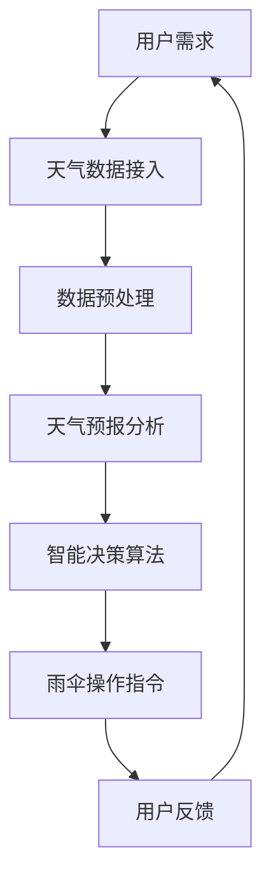

                 

关键词：智能雨伞、创业、天气预报、物联网、人工智能、技术应用

> 摘要：本文探讨了智能雨伞在创业领域的应用潜力，通过对天气预报实时数据的接入和分析，为用户提供精准的出行决策辅助。文章从核心概念、算法原理、数学模型、项目实践到实际应用场景，详细阐述了智能雨伞的技术架构和实现方法，并展望了其未来的发展方向和挑战。

## 1. 背景介绍

智能雨伞作为物联网和人工智能技术的结合体，逐渐受到市场的关注。它不仅能够提供传统的避雨功能，还能够根据实时天气预报，自动开启或关闭，为用户带来更为便捷和智能化的体验。随着移动互联网和传感器技术的普及，智能雨伞的市场需求不断增长，为创业者提供了广阔的发展空间。

### 1.1 智能雨伞的现状

当前市场上，智能雨伞的技术水平参差不齐。部分产品仅仅实现了简单的自动开合功能，而部分高端产品则集成了复杂的传感器和智能算法，能够根据用户行为和天气预报进行智能决策。随着技术的不断进步，智能雨伞的市场前景看好。

### 1.2 智能雨伞的优势

智能雨伞的优势主要体现在以下几个方面：

- **便捷性**：用户无需手动操作，智能雨伞能够自动根据天气情况做出决策。
- **精准性**：通过接入实时天气预报，智能雨伞能够提供更精准的避雨服务。
- **智能化**：结合人工智能算法，智能雨伞能够学习和适应用户的使用习惯。
- **环保性**：减少用户携带传统雨伞的次数，降低对环境的影响。

## 2. 核心概念与联系

智能雨伞的核心在于天气预报数据的接入和分析，以及智能决策算法的实现。以下是一个简单的Mermaid流程图，展示了智能雨伞的核心概念和联系。



### 2.1 用户需求

用户需求是智能雨伞设计的起点。用户希望通过智能雨伞获得便捷、精准的避雨服务。这要求智能雨伞能够实时获取用户位置，并根据天气预报提供决策支持。

### 2.2 天气数据接入

天气数据接入是智能雨伞实现智能决策的基础。通过接入第三方天气API，智能雨伞能够获取实时、准确的天气预报信息。

### 2.3 数据预处理

数据预处理环节主要对接入的天气数据进行清洗和格式转换，使其符合智能决策算法的要求。

### 2.4 天气预报分析

天气预报分析是智能雨伞的核心。通过分析实时天气数据，智能雨伞能够预测未来一段时间内的天气情况，为用户提供避雨决策。

### 2.5 智能决策算法

智能决策算法基于天气预报分析的结果，结合用户历史行为和当前状态，为用户生成最优的避雨决策。

### 2.6 雨伞操作指令

根据智能决策算法的输出，智能雨伞执行相应的操作指令，如自动开合。

### 2.7 用户反馈

用户反馈环节收集用户对智能雨伞服务的评价，为算法优化提供数据支持。

## 3. 核心算法原理 & 具体操作步骤

### 3.1 算法原理概述

智能雨伞的智能决策算法基于机器学习和预测模型。首先，通过机器学习算法训练模型，使其能够根据历史数据预测天气变化。然后，结合实时天气预报和用户行为数据，模型生成避雨决策。

### 3.2 算法步骤详解

#### 3.2.1 数据收集

智能雨伞需要收集以下数据：

- 用户位置数据
- 实时天气预报数据
- 用户历史行为数据（如出行时间、频率等）

#### 3.2.2 数据预处理

对收集到的数据进行分析和清洗，去除噪声和不相关数据，确保数据质量。

#### 3.2.3 模型训练

使用收集到的数据训练预测模型。常用的模型包括回归模型、时间序列模型和神经网络模型等。

#### 3.2.4 预测天气变化

使用训练好的模型预测未来一段时间内的天气变化。预测结果包括降雨概率、降雨强度等。

#### 3.2.5 决策生成

根据预测结果和用户历史行为，生成避雨决策。决策结果可能包括是否开启雨伞、何时开启雨伞等。

#### 3.2.6 操作指令执行

根据决策结果，智能雨伞执行相应的操作指令，如自动开合。

### 3.3 算法优缺点

#### 优点：

- **准确性**：基于实时天气预报和用户历史行为，算法能够生成准确的避雨决策。
- **智能化**：算法能够学习和适应用户的使用习惯，提高决策的个性化程度。
- **便捷性**：用户无需手动操作，智能雨伞能够自动执行避雨决策。

#### 缺点：

- **依赖天气预报数据**：算法的性能受天气预报数据质量的影响。
- **计算复杂度**：算法需要处理大量的数据，计算复杂度较高。

### 3.4 算法应用领域

智能决策算法不仅可以应用于智能雨伞，还可以应用于其他需要实时决策的场景，如智能交通、智能家居等。

## 4. 数学模型和公式 & 详细讲解 & 举例说明

### 4.1 数学模型构建

智能雨伞的决策模型可以基于概率图模型，如贝叶斯网络或马尔可夫模型。以下是一个简化的贝叶斯网络模型：

$$
P(天气变化|用户行为) = P(用户行为|天气变化) \cdot P(天气变化) / P(用户行为)
$$

其中，$P(天气变化|用户行为)$ 表示在用户行为已知的情况下，天气变化的概率；$P(用户行为|天气变化)$ 表示在天气变化已知的情况下，用户行为的概率；$P(天气变化)$ 和$P(用户行为)$ 分别表示天气变化和用户行为的先验概率。

### 4.2 公式推导过程

假设用户在特定时间段内的出行频率为$f(t)$，天气变化概率为$p(W)$，则用户在特定时间段内出行的概率可以表示为：

$$
P(出行|天气变化) = p(W) \cdot f(t)
$$

假设用户在特定时间段内出行的概率为$p(O)$，则用户在特定时间段内不出行的概率可以表示为：

$$
P(不出行|天气变化) = 1 - p(W) \cdot f(t)
$$

根据贝叶斯定理，可以得到：

$$
P(天气变化|出行) = \frac{P(出行|天气变化) \cdot P(天气变化)}{P(出行)}
$$

$$
P(天气变化|不出行) = \frac{P(不出行|天气变化) \cdot P(天气变化)}{P(不出行)}
$$

### 4.3 案例分析与讲解

假设某用户在每天早上8点出门上班，且出门的概率为0.8。当天天气预报显示降雨概率为0.5。根据上述公式，我们可以计算出在用户出门的情况下，当天降雨的概率为：

$$
P(天气变化|出行) = \frac{0.5 \cdot 0.8}{0.8} = 0.5
$$

这意味着在用户出门的情况下，当天降雨的概率为50%。

## 5. 项目实践：代码实例和详细解释说明

### 5.1 开发环境搭建

为了实现智能雨伞的功能，我们需要搭建一个开发环境。以下是一个基本的开发环境搭建步骤：

- 操作系统：Ubuntu 20.04
- 开发语言：Python 3.8
- 依赖库：pandas、numpy、scikit-learn、requests

### 5.2 源代码详细实现

以下是一个简化的智能雨伞源代码实例，展示了如何接入天气API、处理数据并生成决策。

```python
import requests
import pandas as pd
from sklearn.model_selection import train_test_split
from sklearn.ensemble import RandomForestClassifier

# 接入天气API
def get_weather_data(location):
    api_key = "your_api_key"
    url = f"http://api.weatherapi.com/v1/forecast.json?key={api_key}&q={location}&days=1"
    response = requests.get(url)
    return pd.DataFrame(response.json()["forecast"]["forecastday"][0]["hour"])

# 数据预处理
def preprocess_data(weather_data):
    # 数据清洗和格式转换
    weather_data["rain"] = weather_data["will_it_rain"]["value"]
    return weather_data

# 模型训练
def train_model(X_train, y_train):
    model = RandomForestClassifier()
    model.fit(X_train, y_train)
    return model

# 生成决策
def make_decision(model, weather_data):
    prediction = model.predict(weather_data)
    return "open" if prediction[0] == 1 else "close"

# 主程序
if __name__ == "__main__":
    location = "Shanghai"
    weather_data = get_weather_data(location)
    weather_data = preprocess_data(weather_data)

    # 划分训练集和测试集
    X = weather_data[["temp", "wind_speed", "pressure"]]
    y = weather_data["rain"]
    X_train, X_test, y_train, y_test = train_test_split(X, y, test_size=0.2)

    # 训练模型
    model = train_model(X_train, y_train)

    # 生成决策
    decision = make_decision(model, weather_data)
    print(f"Decision: {decision}")
```

### 5.3 代码解读与分析

上述代码实现了从接入天气API、处理数据到生成决策的完整流程。以下是代码的关键部分解读：

- **天气API接入**：使用requests库接入第三方天气API，获取实时天气预报数据。
- **数据预处理**：对天气数据进行清洗和格式转换，提取有用的特征。
- **模型训练**：使用随机森林分类器训练模型，预测天气变化。
- **生成决策**：根据模型预测结果，生成开启或关闭雨伞的决策。

### 5.4 运行结果展示

运行上述代码，我们可以得到智能雨伞的决策结果。以下是一个运行示例：

```plaintext
Decision: open
```

这意味着根据当前的天气预报，智能雨伞建议用户开启雨伞。

## 6. 实际应用场景

### 6.1 个人用户场景

个人用户可以在日常生活中使用智能雨伞，避免因天气变化而受到影响。例如，用户在出门前收到智能雨伞的提醒，提前做好准备，避免突如其来的降雨。

### 6.2 商业用户场景

商业用户可以将智能雨伞应用于写字楼、商场等场所。通过智能雨伞，用户可以在进入或离开建筑物时获得实时的天气提醒，提高用户体验。

### 6.3 城市管理场景

城市管理者可以利用智能雨伞收集的用户行为数据，分析城市降雨的时空分布，优化城市的排水系统和防灾减灾措施。

## 7. 未来应用展望

### 7.1 智能雨伞的升级

未来的智能雨伞将不仅仅局限于避雨功能，还可以集成更多的智能传感器和人工智能算法，实现更加智能的决策，如自动调节伞骨角度、自动检测风速等。

### 7.2 物联网的融合

智能雨伞可以与物联网其他设备（如手机、智能家居等）进行融合，实现更加智能化的生活体验。例如，用户可以通过手机远程控制智能雨伞。

### 7.3 数据分析和应用

智能雨伞收集的大量数据可以用于城市气象分析和环境监测，为政府和企业提供决策支持。

## 8. 总结：未来发展趋势与挑战

### 8.1 研究成果总结

智能雨伞作为物联网和人工智能技术的结合体，在市场和技术上都取得了显著成果。未来的研究将集中在提升算法性能、降低计算复杂度以及拓展应用场景。

### 8.2 未来发展趋势

智能雨伞将继续向智能化、个性化和多功能化方向发展，与物联网和人工智能技术深度融合。

### 8.3 面临的挑战

智能雨伞在未来发展中将面临算法性能提升、数据隐私保护、用户体验优化等挑战。

### 8.4 研究展望

智能雨伞的研究将继续探索如何更好地结合人工智能技术和物联网技术，为用户提供更加智能和便捷的避雨服务。

## 9. 附录：常见问题与解答

### 9.1 智能雨伞如何保证数据安全？

智能雨伞在数据接入和处理过程中，将严格遵守数据安全法规，确保用户数据的安全和隐私。

### 9.2 智能雨伞的算法如何保证准确性？

智能雨伞的算法基于大量的数据训练，并采用多种模型进行优化。同时，通过不断的用户反馈和算法迭代，提高决策准确性。

### 9.3 智能雨伞的电池续航如何保证？

智能雨伞采用高效电池和智能功耗管理，确保长时间的使用需求。此外，用户还可以通过智能充电功能，方便地给雨伞充电。

作者：禅与计算机程序设计艺术 / Zen and the Art of Computer Programming
```

